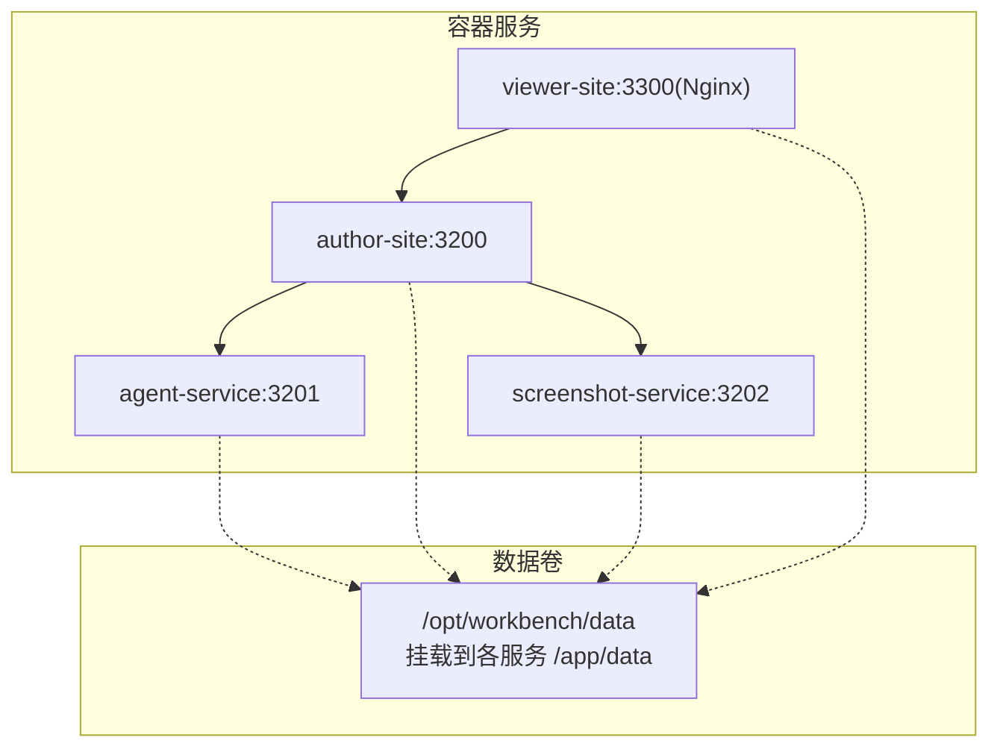
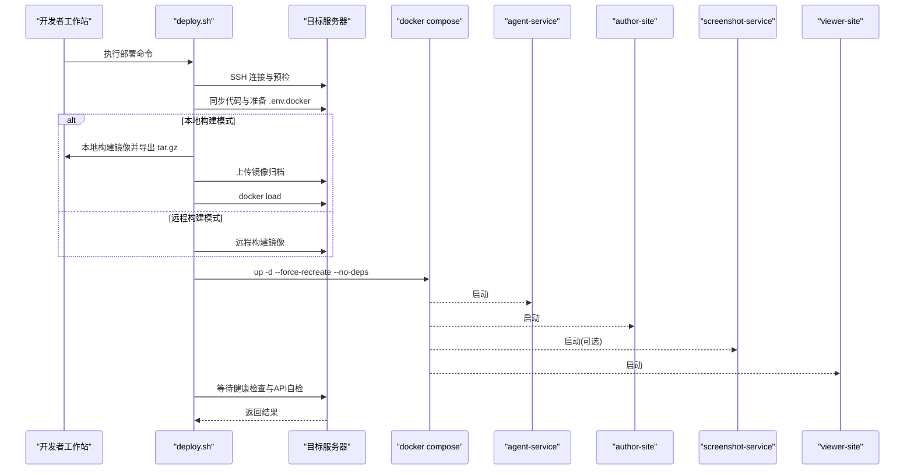
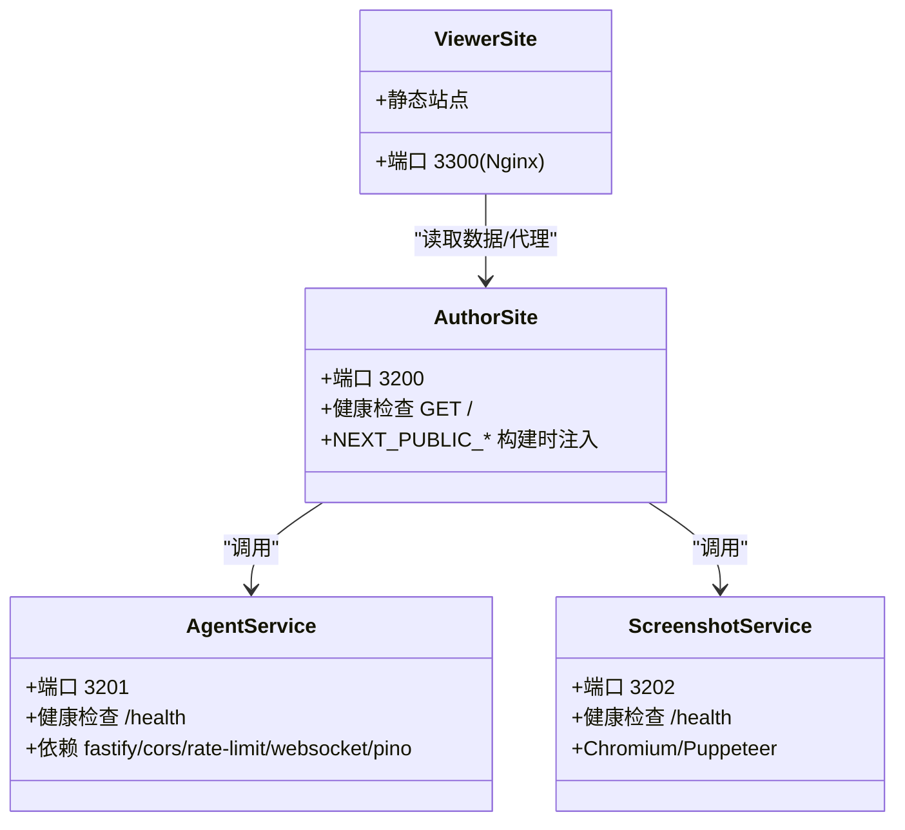
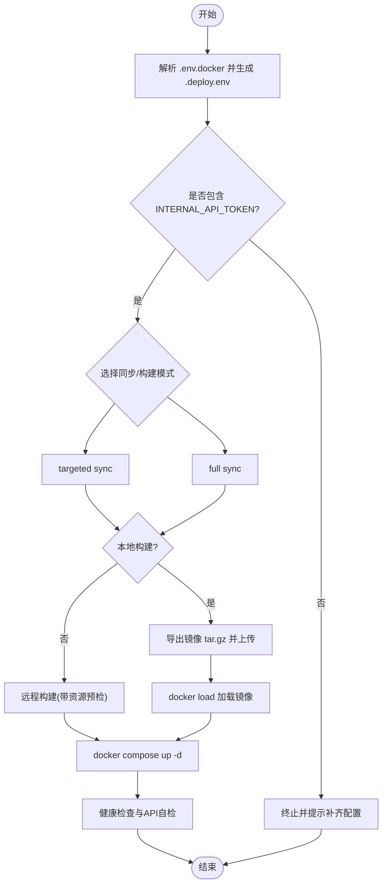
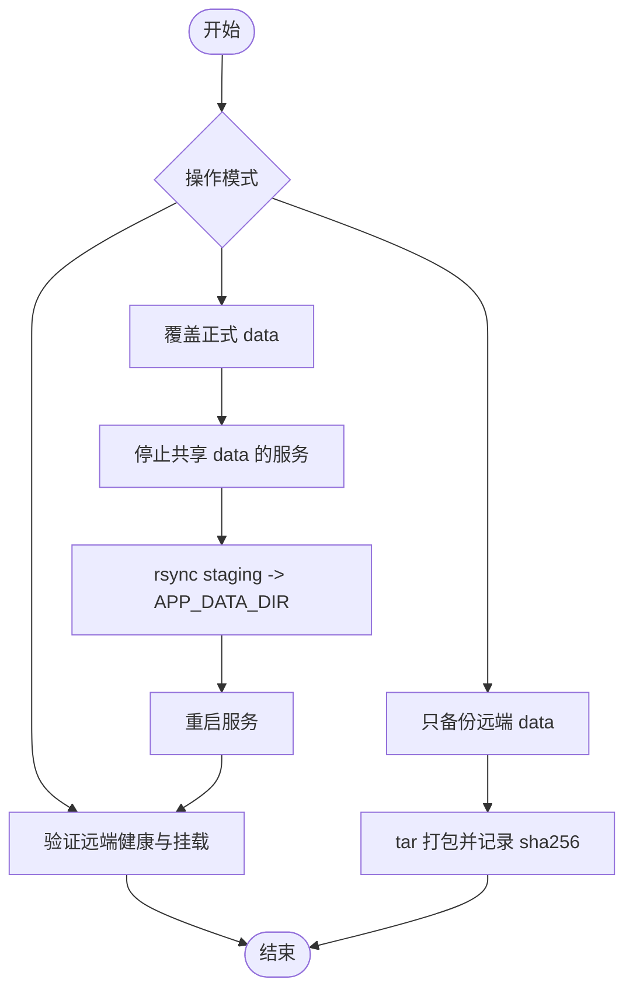
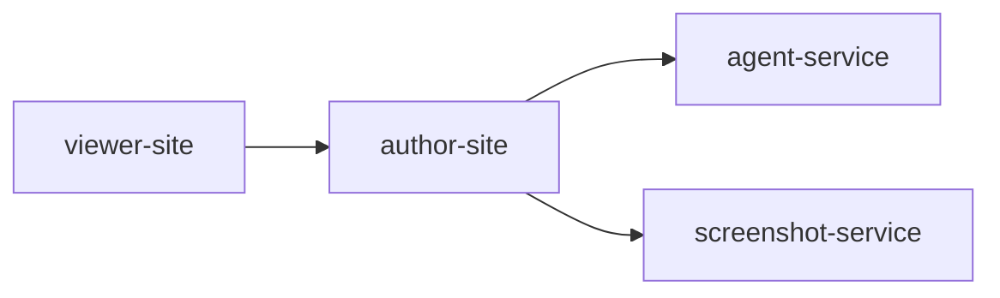
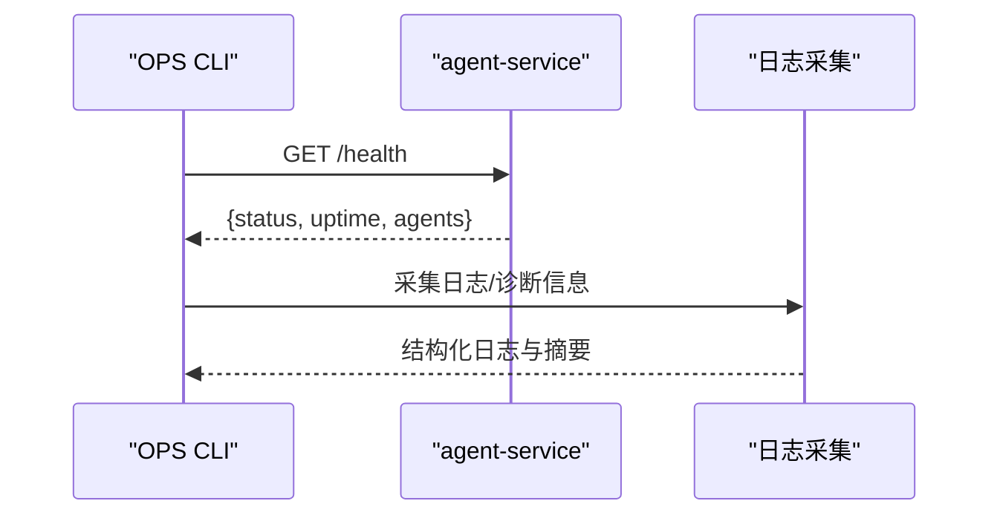

# 部署运维

<cite>
**本文引用的文件**   
- [docker-compose.yml](file://docker-compose.yml)
- [deploy.sh](file://scripts/deploy.sh)
- [deploy-fast.sh](file://scripts/deploy-fast.sh)
- [deploy-author-with-data.sh](file://scripts/deploy-author-with-data.sh)
- [sync-production-data-to-local.sh](file://scripts/sync-production-data-to-local.sh)
- [agent-service Dockerfile](file://docker/agent-service/Dockerfile)
- [author-site Dockerfile](file://docker/author-site/Dockerfile)
- [screenshot-service Dockerfile](file://docker/screenshot-service/Dockerfile)
- [viewer-site Dockerfile](file://docker/viewer-site/Dockerfile)
- [正式环境部署指南.md](file://docs/用户指南/正式环境部署指南.md)
- [health.ts（OPS CLI）](file://OPS/CLI/src/commands/health.ts)
- [logs.ts（OPS CLI）](file://OPS/CLI/src/commands/logs.ts)
- [docker-orbstack-verify.sh](file://scripts/docker-orbstack-verify.sh)
- [logger.ts（agent-service）](file://packages/agent-service/src/utils/logger.ts)
</cite>

## 目录
1. [简介](#简介)
2. [项目结构](#项目结构)
3. [核心组件](#核心组件)
4. [架构总览](#架构总览)
5. [详细组件分析](#详细组件分析)
6. [依赖关系分析](#依赖关系分析)
7. [性能与生产配置](#性能与生产配置)
8. [监控与告警](#监控与告警)
9. [健康检查与自动重启](#健康检查与自动重启)
10. [负载均衡与高可用](#负载均衡与高可用)
11. [数据备份与恢复](#数据备份与恢复)
12. [日志聚合策略](#日志聚合策略)
13. [自动化运维脚本使用指南](#自动化运维脚本使用指南)
14. [故障排除指南](#故障排除指南)
15. [结论](#结论)

## 简介
本文件面向 Workbench 平台的运维工程师与 SRE，提供基于 Docker 的容器化部署、编排与环境变量管理方案；覆盖生产环境配置、性能调优、监控指标收集、日志聚合、健康检查、自动重启、负载均衡、数据备份与恢复、灾难恢复预案以及自动化运维脚本的使用方法与故障排查。文档内容严格依据仓库内现有脚本、Dockerfile、compose 配置与用户指南整理而成。

## 项目结构
Workbench 采用多服务容器化部署：
- agent-service：Agent 后端服务（Node.js），暴露 /health 与健康状态 JSON。
- author-site：创作端（Next.js standalone），对外提供 Web 界面。
- screenshot-service：截图服务（Puppeteer + Chromium），提供截图能力。
- viewer-site：浏览端静态站点（Nginx）。

图示来源
- [docker-compose.yml:1-140](file://docker-compose.yml#L1-L140)

章节来源
- [docker-compose.yml:1-140](file://docker-compose.yml#L1-L140)
- [正式环境部署指南.md:1-350](file://docs/用户指南/正式环境部署指南.md#L1-L350)

## 核心组件
- 镜像构建
  - 所有服务均基于 node:20-bookworm-slim 基础镜像，使用 pnpm 进行依赖安装与构建。
  - 前端服务（author-site、viewer-site）在 builder 阶段完成 Next.js 构建，运行期仅包含产物与最小运行时。
  - screenshot-service 额外安装 Chromium 并设置 PUPPETEER_EXECUTABLE_PATH。
- 容器编排
  - docker-compose.yml 定义服务、端口映射、环境变量、资源限制、重启策略与依赖顺序。
  - 通过 profiles 控制可选服务（如 screenshot-service）。
- 环境变量管理
  - 关键环境变量包括模型提供商、超时、CORS、内部令牌、Figma OAuth、截图服务地址等。
  - 部署脚本从 .env.docker 生成远端 .env.docker，并进行必要校验（如 INTERNAL_API_TOKEN）。

章节来源
- [agent-service Dockerfile:1-43](file://docker/agent-service/Dockerfile#L1-L43)
- [author-site Dockerfile:1-94](file://docker/author-site/Dockerfile#L1-L94)
- [screenshot-service Dockerfile:1-56](file://docker/screenshot-service/Dockerfile#L1-L56)
- [viewer-site Dockerfile:1-46](file://docker/viewer-site/Dockerfile#L1-L46)
- [docker-compose.yml:1-140](file://docker-compose.yml#L1-L140)
- [deploy.sh:1-800](file://scripts/deploy.sh#L1-L800)

## 架构总览
整体部署流程由本地脚本驱动，支持“本地构建+上传镜像”或“远程构建”，并通过 SSH 执行远端 compose 命令拉起服务，随后进行健康检查与 API 自检。

图示来源
- [deploy.sh:440-591](file://scripts/deploy.sh#L440-L591)
- [docker-compose.yml:1-140](file://docker-compose.yml#L1-L140)

章节来源
- [deploy.sh:1-800](file://scripts/deploy.sh#L1-L800)
- [docker-compose.yml:1-140](file://docker-compose.yml#L1-L140)

## 详细组件分析

### 服务与镜像构建
- agent-service
  - 构建阶段复制相关包并执行 build:docker，运行期引入 fastify、cors、rate-limit、websocket、pino 等依赖。
  - 暴露 3201 端口，提供 /health 健康检查。
- author-site
  - 构建阶段注入 NEXT_PUBLIC_* 参数，输出 Next.js standalone 产物，运行期以 Node 启动。
  - 暴露 3200 端口，提供根路径健康检查。
- screenshot-service
  - 构建阶段跳过 Puppeteer 下载，运行期安装 chromium 并设置可执行路径。
  - 暴露 3202 端口，提供 /health 健康检查。
- viewer-site
  - 构建阶段输出静态站点，运行期使用 Nginx 提供静态资源。
  - 暴露 80 端口，compose 映射为 3300。

图示来源
- [agent-service Dockerfile:1-43](file://docker/agent-service/Dockerfile#L1-L43)
- [author-site Dockerfile:1-94](file://docker/author-site/Dockerfile#L1-L94)
- [screenshot-service Dockerfile:1-56](file://docker/screenshot-service/Dockerfile#L1-L56)
- [viewer-site Dockerfile:1-46](file://docker/viewer-site/Dockerfile#L1-L46)

章节来源
- [agent-service Dockerfile:1-43](file://docker/agent-service/Dockerfile#L1-L43)
- [author-site Dockerfile:1-94](file://docker/author-site/Dockerfile#L1-L94)
- [screenshot-service Dockerfile:1-56](file://docker/screenshot-service/Dockerfile#L1-L56)
- [viewer-site Dockerfile:1-46](file://docker/viewer-site/Dockerfile#L1-L46)

### 部署流水线与快速部署
- 标准部署脚本 deploy.sh
  - 解析 .env.docker，生成 .deploy.env，校验 INTERNAL_API_TOKEN。
  - 支持 targeted/full 同步模式与 local/remote 构建模式。
  - 本地构建模式下导出镜像 tar.gz 并上传至服务器，再 load 并重建服务。
  - 远程构建模式下对内存与负载进行预检，避免在生产机高峰构建。
  - 部署后自检：容器运行状态、健康检查、HTTP 端点与内部鉴权接口。
- 快速部署脚本 deploy-fast.sh
  - 提供短名（author/agent/viewer/shot/core）与选项（--targeted-sync/--full-sync/--local-build/--remote-build/--dry-run）。
  - 默认启用 targeted sync 与本地构建，减少传输与构建时间。

图示来源
- [deploy.sh:1-800](file://scripts/deploy.sh#L1-L800)
- [deploy-fast.sh:1-140](file://scripts/deploy-fast.sh#L1-L140)

章节来源
- [deploy.sh:1-800](file://scripts/deploy.sh#L1-L800)
- [deploy-fast.sh:1-140](file://scripts/deploy-fast.sh#L1-L140)
- [正式环境部署指南.md:1-350](file://docs/用户指南/正式环境部署指南.md#L1-L350)

### 数据覆盖与一致性保障
- 覆盖正式 data
  - 使用 deploy-author-with-data.sh，支持只备份、覆盖并验证。
  - 覆盖前会停止共享 data 的服务，rsync 同步 staging 到 APP_DATA_DIR，并可选择保留 staging。
- 拉取正式 data 到本地
  - 使用 sync-production-data-to-local.sh，支持只备份本地、拉取并覆盖本地。
  - 覆盖前会先备份本地 data，确保可回滚。

图示来源
- [deploy-author-with-data.sh:1-469](file://scripts/deploy-author-with-data.sh#L1-L469)
- [sync-production-data-to-local.sh:1-335](file://scripts/sync-production-data-to-local.sh#L1-L335)

章节来源
- [deploy-author-with-data.sh:1-469](file://scripts/deploy-author-with-data.sh#L1-L469)
- [sync-production-data-to-local.sh:1-335](file://scripts/sync-production-data-to-local.sh#L1-L335)

## 依赖关系分析
- 服务间依赖
  - author-site 依赖 agent-service 与 screenshot-service。
  - viewer-site 依赖 author-site（读取数据与静态资源）。
- 外部依赖
  - screenshot-service 依赖系统级 Chromium。
  - 各服务通过环境变量配置 CORS、模型提供商、内部令牌等。

图示来源
- [docker-compose.yml:1-140](file://docker-compose.yml#L1-L140)

章节来源
- [docker-compose.yml:1-140](file://docker-compose.yml#L1-L140)

## 性能与生产配置
- 资源限制
  - 各服务在 compose 中设置了 CPU、内存、进程数限制，截图服务额外设置 shm_size。
- 构建优化
  - 使用 pnpm store 缓存加速依赖安装。
  - 前端服务在 builder 阶段完成构建，运行期镜像更小。
- 网络与安全
  - 通过环境变量配置 CORS_ORIGINS、USE_SECURE_COOKIE、INTERNAL_API_TOKEN 等。
- 平台与镜像源
  - 支持 DEBIAN_MIRROR、NPM_REGISTRY 等构建参数，便于国内网络环境加速。

章节来源
- [docker-compose.yml:1-140](file://docker-compose.yml#L1-L140)
- [author-site Dockerfile:1-94](file://docker/author-site/Dockerfile#L1-L94)
- [screenshot-service Dockerfile:1-56](file://docker/screenshot-service/Dockerfile#L1-L56)
- [viewer-site Dockerfile:1-46](file://docker/viewer-site/Dockerfile#L1-L46)

## 监控与告警
- 健康检查
  - 各服务在 Dockerfile 中定义了 HEALTHCHECK，检测 /health 或根路径。
  - 部署脚本在远端轮询健康状态与 HTTP 端点，失败则打印最近日志。
- 诊断与日志采集
  - OPS CLI 提供 health 与 logs 命令，支持 JSON 输出与过滤。
  - 本地验证脚本 docker-orbstack-verify.sh 用于本地快速验证服务可用性。
- 指标与 SLO
  - 作者端内置性能采样器，记录队列等待、提交延迟、远程更新延迟等，并生成 SLO 报告（p95 阈值判定）。

图示来源
- [health.ts（OPS CLI）:1-54](file://OPS/CLI/src/commands/health.ts#L1-L54)
- [logs.ts（OPS CLI）:1-160](file://OPS/CLI/src/commands/logs.ts#L1-L160)
- [docker-orbstack-verify.sh:62-91](file://scripts/docker-orbstack-verify.sh#L62-L91)

章节来源
- [health.ts（OPS CLI）:1-54](file://OPS/CLI/src/commands/health.ts#L1-L54)
- [logs.ts（OPS CLI）:1-160](file://OPS/CLI/src/commands/logs.ts#L1-L160)
- [docker-orbstack-verify.sh:62-91](file://scripts/docker-orbstack-verify.sh#L62-L91)

## 健康检查与自动重启
- 健康检查
  - 容器级别：HEALTHCHECK 定期探测 /health 或根路径。
  - 部署级别：脚本等待健康状态为 healthy 或 running，并轮询 HTTP 端点。
- 自动重启
  - compose 中统一配置 restart: unless-stopped，保证异常退出后自动恢复。

章节来源
- [docker-compose.yml:1-140](file://docker-compose.yml#L1-L140)
- [agent-service Dockerfile:39-43](file://docker/agent-service/Dockerfile#L39-L43)
- [author-site Dockerfile:90-94](file://docker/author-site/Dockerfile#L90-L94)
- [screenshot-service Dockerfile:50-56](file://docker/screenshot-service/Dockerfile#L50-L56)
- [deploy.sh:593-794](file://scripts/deploy.sh#L593-L794)

## 负载均衡与高可用
- 当前仓库未提供显式的负载均衡配置（如 Ingress/Nginx 反向代理或多实例编排）。
- 建议实践
  - 在容器编排层增加多个 author-site/agent-service 实例，结合外部负载均衡器（如 Nginx/HAProxy/K8s Ingress）实现流量分发。
  - 将 /opt/workbench/data 迁移至共享存储（如 NFS/Ceph/S3 兼容对象存储），确保多实例一致访问。
  - 使用会话保持或无状态设计，避免单点问题。

[本节为通用建议，不直接分析具体文件]

## 数据备份与恢复
- 备份策略
  - 远端 data 备份：deploy-author-with-data.sh 支持只备份，打包 APP_DATA_DIR 与历史 volume 数据，并输出 sha256。
  - 本地 data 备份：sync-production-data-to-local.sh 支持只备份本地 data。
- 恢复流程
  - 覆盖正式 data：停止共享 data 的服务，rsync 同步 staging 到 APP_DATA_DIR，重启服务并验证。
  - 覆盖本地 data：拉取正式 data 到本地 staging，备份本地 data，rsync 覆盖并清理 staging。
- 灾难恢复预案
  - 首次部署到新服务器时，允许创建空 APP_DATA_DIR（需显式开启）。
  - 若发现线上 data 为空或被切错，优先使用备份恢复，再重新拉起服务。

章节来源
- [deploy-author-with-data.sh:1-469](file://scripts/deploy-author-with-data.sh#L1-L469)
- [sync-production-data-to-local.sh:1-335](file://scripts/sync-production-data-to-local.sh#L1-L335)
- [deploy.sh:440-591](file://scripts/deploy.sh#L440-L591)

## 日志聚合策略
- 日志格式
  - agent-service 使用 pino 输出结构化 JSON 日志，支持 LOG_LEVEL 控制级别。
- 采集方式
  - 本地可通过 OPS CLI 的 logs 命令采集与过滤日志，或读取本地日志文件。
  - 生产环境建议将容器 stdout 日志接入集中式日志系统（如 ELK/Loki），并按服务与模块分索引。
- 诊断辅助
  - OPS CLI 的 health 与 logs 命令支持 JSON 输出，便于自动化集成。

章节来源
- [logger.ts（agent-service）:1-41](file://packages/agent-service/src/utils/logger.ts#L1-L41)
- [logs.ts（OPS CLI）:1-160](file://OPS/CLI/src/commands/logs.ts#L1-L160)

## 自动化运维脚本使用指南
- 标准部署
  - scripts/deploy.sh：完整部署流程，支持 targeted/full 同步与 local/remote 构建，含健康检查与 API 自检。
- 快速部署
  - scripts/deploy-fast.sh：快捷入口，支持 author/agent/viewer/shot/core 短名与多种选项。
- 数据覆盖与验证
  - scripts/deploy-author-with-data.sh：覆盖正式 data 并验证。
  - scripts/sync-production-data-to-local.sh：拉取正式 data 到本地并覆盖。
- 本地验证
  - scripts/docker-orbstack-verify.sh：本地快速验证服务健康与 HTTP 端点。

章节来源
- [deploy.sh:1-800](file://scripts/deploy.sh#L1-L800)
- [deploy-fast.sh:1-140](file://scripts/deploy-fast.sh#L1-L140)
- [deploy-author-with-data.sh:1-469](file://scripts/deploy-author-with-data.sh#L1-L469)
- [sync-production-data-to-local.sh:1-335](file://scripts/sync-production-data-to-local.sh#L1-L335)
- [docker-orbstack-verify.sh:62-91](file://scripts/docker-orbstack-verify.sh#L62-L91)

## 故障排除指南
- 常见问题定位
  - 部署后页面不可用：检查容器运行状态与健康检查，查看最近日志。
  - 加速部署缺少 packages：切换到 full sync 或更新 targeted package 列表。
  - 线上项目列表为空：确认 APP_DATA_DIR 是否被切到空目录，必要时使用覆盖脚本恢复。
  - SSH 连接失败：检查私钥与连通性。
  - .env.docker 缺少配置：确保包含 INTERNAL_API_TOKEN 等必需项。
- 健康检查与自检
  - 使用 curl 检查各服务端口与 /health 端点。
  - 使用 OPS CLI 的 health 与 logs 命令获取结构化诊断信息。
- 截图服务深度健康
  - 使用 SCREENSHOT_HEALTH_URL 环境变量配合深度健康脚本进行更全面的检查。

章节来源
- [正式环境部署指南.md:255-350](file://docs/用户指南/正式环境部署指南.md#L255-L350)
- [deploy.sh:593-794](file://scripts/deploy.sh#L593-L794)
- [health.ts（OPS CLI）:1-54](file://OPS/CLI/src/commands/health.ts#L1-L54)
- [logs.ts（OPS CLI）:138-160](file://OPS/CLI/src/commands/logs.ts#L138-L160)

## 结论
Workbench 的部署运维体系围绕 Docker 与 docker-compose 展开，通过完善的脚本链路与健康检查机制，实现了从代码同步、镜像构建、服务启停到健康自检的闭环。生产环境应重点关注数据持久化、日志集中化与监控告警接入，并结合业务规模扩展负载均衡与高可用方案。建议在 CI/CD 中集成健康检查与日志采集，形成标准化的发布与回滚流程。