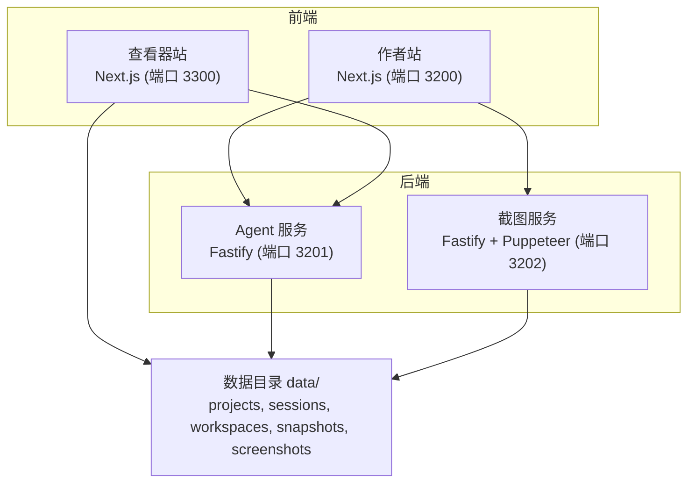
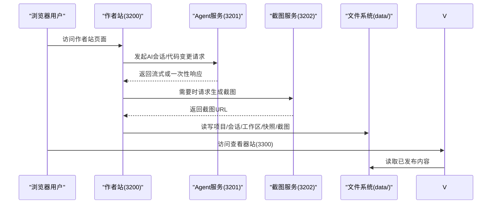
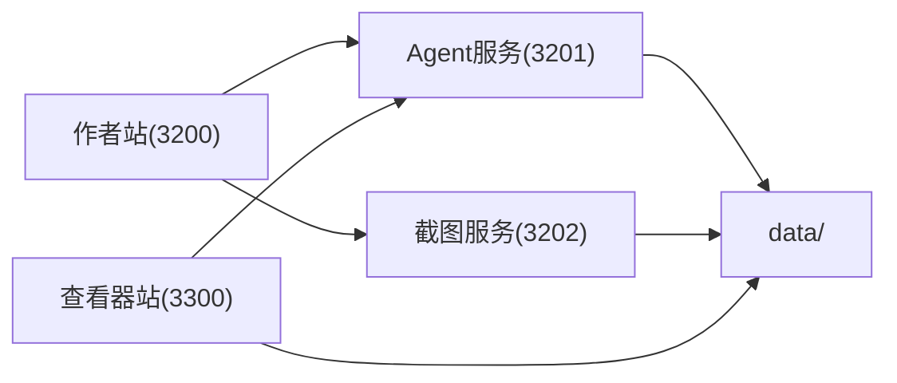

# 快速开始

<cite>
**本文引用的文件**   
- [package.json](file://package.json)
- [.npmrc](file://.npmrc)
- [docker-compose.yml](file://docker-compose.yml)
- [AGENTS.md](file://AGENTS.md)
- [scripts/dev-restart.mjs](file://scripts/dev-restart.mjs)
- [scripts/docker-orbstack-up.sh](file://scripts/docker-orbstack-up.sh)
- [packages/author-site/package.json](file://packages/author-site/package.json)
- [packages/agent-service/package.json](file://packages/agent-service/package.json)
- [packages/screenshot-service/package.json](file://packages/screenshot-service/package.json)
- [packages/viewer-site/package.json](file://packages/viewer-site/package.json)
- [packages/author-site/next.config.js](file://packages/author-site/next.config.js)
- [packages/author-site/src/lib/fs-utils.ts](file://packages/author-site/src/lib/fs-utils.ts)
- [docker/screenshot-service/Dockerfile](file://docker/screenshot-service/Dockerfile)
</cite>

## 目录
1. [简介](#简介)
2. [项目结构](#项目结构)
3. [核心组件](#核心组件)
4. [架构总览](#架构总览)
5. [详细组件分析](#详细组件分析)
6. [依赖关系分析](#依赖关系分析)
7. [性能与资源建议](#性能与资源建议)
8. [故障排除指南](#故障排除指南)
9. [结论](#结论)
10. [附录：常用命令速查](#附录常用命令速查)

## 简介
本指南面向首次接触 Workbench AI 辅助创作平台的开发者，提供从零到一的环境准备、本地开发环境搭建、服务启动、构建与运行微服务的完整步骤，并附带常见问题排查方法与第一个项目的创建与运行示例。所有命令均基于仓库内脚本与配置，确保可执行且与当前版本一致。

## 项目结构
Workbench 采用 pnpm monorepo 组织，核心前端为 Next.js（作者站与查看器），后端为 Fastify 的 Agent 服务与截图服务，Docker Compose 编排多服务协同运行。根目录 scripts 提供开发重启、Docker 启动与验证等工具脚本。

图表来源
- [docker-compose.yml:1-140](file://docker-compose.yml#L1-L140)
- [packages/author-site/package.json:1-127](file://packages/author-site/package.json#L1-L127)
- [packages/agent-service/package.json:1-53](file://packages/agent-service/package.json#L1-L53)
- [packages/screenshot-service/package.json:1-39](file://packages/screenshot-service/package.json#L1-L39)
- [packages/viewer-site/package.json:1-62](file://packages/viewer-site/package.json#L1-L62)

章节来源
- [AGENTS.md:176-198](file://AGENTS.md#L176-L198)
- [docker-compose.yml:1-140](file://docker-compose.yml#L1-L140)

## 核心组件
- 包管理器与运行时
  - Node.js 要求：>=18.0.0
  - pnpm 版本：8.15.0（通过 packageManager 锁定）
  - .npmrc 启用 hoist 以兼容部分依赖
- 前端站点
  - 作者站：Next.js 应用，默认端口 3200
  - 查看器站：Next.js 应用，默认端口 3300
- 后端服务
  - Agent 服务：Fastify + Pi Agent，默认端口 3201
  - 截图服务：Fastify + Puppeteer，默认端口 3202
- 数据持久化
  - 默认数据目录 data/，可通过 DATA_DIR 覆盖
  - 子目录包含 projects、sessions、workspaces、snapshots、screenshots 等

章节来源
- [package.json:95-100](file://package.json#L95-L100)
- [.npmrc:1-2](file://.npmrc#L1-L2)
- [packages/author-site/package.json:1-127](file://packages/author-site/package.json#L1-L127)
- [packages/agent-service/package.json:1-53](file://packages/agent-service/package.json#L1-L53)
- [packages/screenshot-service/package.json:1-39](file://packages/screenshot-service/package.json#L1-L39)
- [packages/viewer-site/package.json:1-62](file://packages/viewer-site/package.json#L1-L62)
- [packages/author-site/src/lib/fs-utils.ts:44-56](file://packages/author-site/src/lib/fs-utils.ts#L44-L56)

## 架构总览
下图展示本地开发时各组件之间的调用关系与端口映射。作者站作为主入口，调用 Agent 服务进行 AI 对话与代码操作，必要时触发截图服务生成预览图；查看器站用于预览发布产物，读取 data 目录中的静态资源。

图表来源
- [docker-compose.yml:1-140](file://docker-compose.yml#L1-L140)
- [packages/author-site/package.json:1-127](file://packages/author-site/package.json#L1-L127)
- [packages/agent-service/package.json:1-53](file://packages/agent-service/package.json#L1-L53)
- [packages/screenshot-service/package.json:1-39](file://packages/screenshot-service/package.json#L1-L39)
- [packages/viewer-site/package.json:1-62](file://packages/viewer-site/package.json#L1-L62)

## 详细组件分析

### 环境要求与前置准备
- Node.js >= 18.0.0
- pnpm@8.15.0（推荐通过 corepack 管理）
- Docker 与 docker compose（可选，用于容器化运行）
- 操作系统需支持 lsof（用于开发端口清理）

章节来源
- [package.json:95-100](file://package.json#L95-L100)
- [AGENTS.md:35-48](file://AGENTS.md#L35-L48)

### 安装依赖
在项目根目录执行以下命令完成依赖安装：
- 使用 corepack 固定 pnpm 版本并安装依赖
- 若网络受限，可在 .npmrc 中配置镜像源或使用脚本参数

章节来源
- [package.json:95-96](file://package.json#L95-L96)
- [.npmrc:1-2](file://.npmrc#L1-L2)

### 环境变量配置
- 开发环境
  - 根目录 .env 会被作者站 next.config.js 加载注入进程环境
  - 关键变量包括 JWT_SECRET、CORS_ORIGINS、DATA_DIR、PI_AGENT_* 等
- Docker 环境
  - 使用 .env.docker 覆盖部署相关变量
  - 脚本会设置 NEXT_PUBLIC_* 前缀变量供前端编译期使用

章节来源
- [packages/author-site/next.config.js:1-24](file://packages/author-site/next.config.js#L1-L24)
- [docker-compose.yml:1-140](file://docker-compose.yml#L1-L140)
- [AGENTS.md:44-48](file://AGENTS.md#L44-L48)

### 启动开发服务器（Node 本地）
- 一键启动所有开发服务（作者站、Agent 服务、查看器站、截图服务）
- 自动清理占用端口并转发信号
- 可选择清理 Next.js 缓存后重启

章节来源
- [package.json:5-14](file://package.json#L5-L14)
- [scripts/dev-restart.mjs:1-151](file://scripts/dev-restart.mjs#L1-L151)

### 启动单个微服务
- 作者站：pnpm dev:author
- Agent 服务：pnpm dev:agent
- 截图服务：pnpm dev:screenshot
- 查看器站：pnpm dev:viewer

章节来源
- [package.json:9-14](file://package.json#L9-L14)
- [packages/author-site/package.json:1-127](file://packages/author-site/package.json#L1-L127)
- [packages/agent-service/package.json:1-53](file://packages/agent-service/package.json#L1-L53)
- [packages/screenshot-service/package.json:1-39](file://packages/screenshot-service/package.json#L1-L39)
- [packages/viewer-site/package.json:1-62](file://packages/viewer-site/package.json#L1-L62)

### 构建项目
- 构建作者站（含预览运行时）
- 构建查看器站（含预览运行时）
- 构建预览运行时（公共脚本）

章节来源
- [package.json:22-24](file://package.json#L22-L24)
- [packages/author-site/package.json:1-127](file://packages/author-site/package.json#L1-L127)
- [packages/viewer-site/package.json:1-62](file://packages/viewer-site/package.json#L1-L62)

### 使用 Docker 启动（OrbStack）
- 准备 .env.docker 文件
- 使用脚本一键拉起服务并校验 HTTP 表面
- 可选开启截图服务 profile

章节来源
- [scripts/docker-orbstack-up.sh:1-98](file://scripts/docker-orbstack-up.sh#L1-L98)
- [docker-compose.yml:1-140](file://docker-compose.yml#L1-L140)

### 第一个项目：创建与运行示例
- 在本地开发模式下，作者站负责项目管理与编辑，Agent 服务处理 AI 交互，截图服务生成预览图
- 数据写入 data/ 目录，便于本地调试与可视化检查

章节来源
- [packages/author-site/src/lib/fs-utils.ts:44-56](file://packages/author-site/src/lib/fs-utils.ts#L44-L56)
- [AGENTS.md:308-312](file://AGENTS.md#L308-L312)

## 依赖关系分析
- 前端依赖后端 API：作者站与查看器站通过环境变量指向 Agent 服务与截图服务地址
- 截图服务依赖 Chromium（容器内安装），并通过 PUPPETEER_EXECUTABLE_PATH 指定路径
- 数据目录由 DATA_DIR 统一控制，多个服务共享同一份数据卷

图表来源
- [docker-compose.yml:1-140](file://docker-compose.yml#L1-L140)
- [docker/screenshot-service/Dockerfile:1-42](file://docker/screenshot-service/Dockerfile#L1-L42)
- [packages/author-site/src/lib/fs-utils.ts:44-56](file://packages/author-site/src/lib/fs-utils.ts#L44-L56)

章节来源
- [docker-compose.yml:1-140](file://docker-compose.yml#L1-L140)
- [docker/screenshot-service/Dockerfile:1-42](file://docker/screenshot-service/Dockerfile#L1-L42)

## 性能与资源建议
- 合理分配 CPU 与内存限制（Compose 已内置默认值）
- 截图服务对 Chromium 有额外内存需求，建议在 Apple Silicon 上使用 amd64 平台镜像以避免沙箱问题
- 首次构建较慢属正常现象，后续构建将复用 pnpm store 缓存

章节来源
- [docker-compose.yml:36-140](file://docker-compose.yml#L36-L140)
- [docker/screenshot-service/Dockerfile:1-42](file://docker/screenshot-service/Dockerfile#L1-L42)

## 故障排除指南
- 端口被占用
  - 使用开发重启脚本自动释放端口并清理 Next.js 缓存
- Docker 不可用或未启动
  - 先启动 OrbStack/Docker，再执行启动脚本
- 截图服务健康检查失败
  - 确认 Chromium 可用与沙箱配置，必要时调整平台与禁用沙箱
- 环境变量未生效
  - 检查 .env 与 .env.docker 是否被正确加载，确认 NEXT_PUBLIC_* 前缀变量

章节来源
- [scripts/dev-restart.mjs:1-151](file://scripts/dev-restart.mjs#L1-L151)
- [scripts/docker-orbstack-up.sh:1-98](file://scripts/docker-orbstack-up.sh#L1-L98)
- [docker-compose.yml:116-121](file://docker-compose.yml#L116-L121)
- [packages/author-site/next.config.js:1-24](file://packages/author-site/next.config.js#L1-L24)

## 结论
通过以上步骤，你可以在本地快速搭建 Workbench AI 辅助创作平台的开发环境，启动作者站、Agent 服务、截图服务与查看器站，并进行项目创建与预览。结合 Docker 与脚本工具，可实现一致的本地与准生产体验。

## 附录：常用命令速查
- 开发
  - 启动全部服务：pnpm dev
  - 仅作者站：pnpm dev:author
  - 仅 Agent 服务：pnpm dev:agent
  - 仅截图服务：pnpm dev:screenshot
  - 仅查看器站：pnpm dev:viewer
- 构建
  - 构建作者站：pnpm build
  - 构建查看器站：pnpm build:viewer
  - 构建预览运行时：pnpm build:preview-runtime
- Docker（OrbStack）
  - 启动主服务：corepack pnpm docker:orbstack
  - 启动主服务+截图：corepack pnpm docker:orbstack:screenshot
  - 预拉镜像：corepack pnpm docker:prepull
  - 深度健康检查：corepack pnpm docker:screenshot:deep-health

章节来源
- [package.json:5-24](file://package.json#L5-L24)
- [scripts/docker-orbstack-up.sh:1-98](file://scripts/docker-orbstack-up.sh#L1-L98)