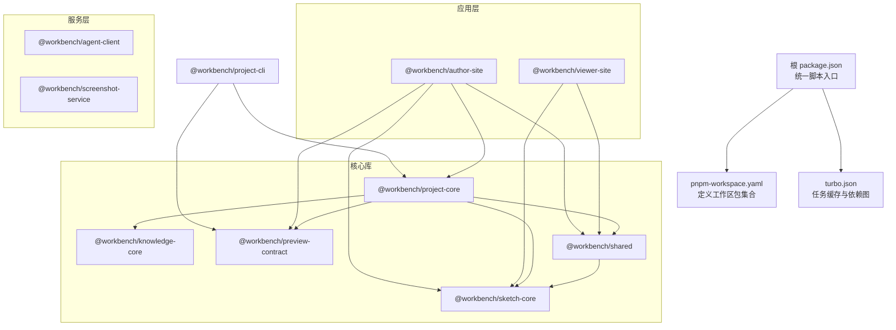
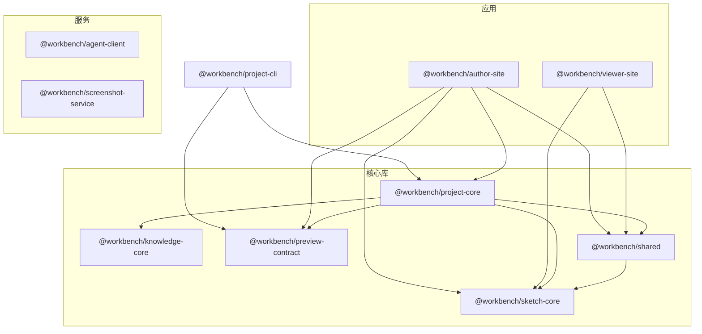
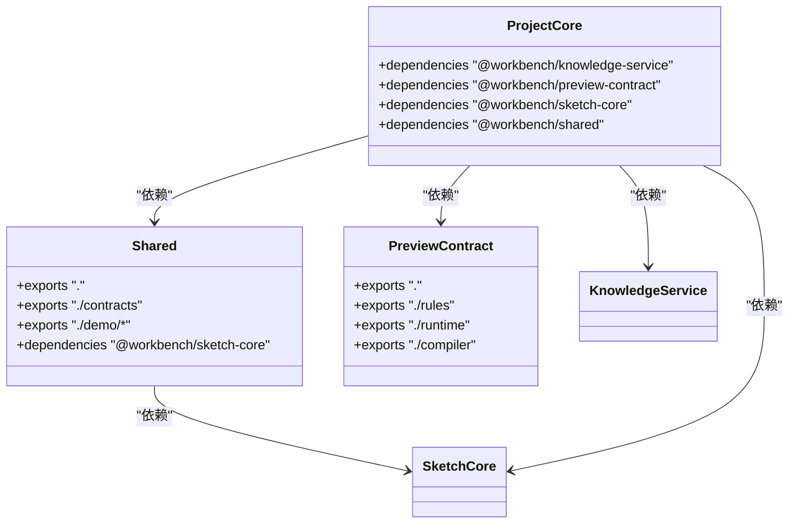
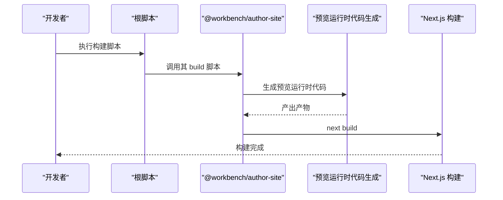
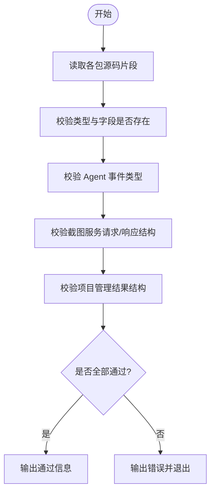
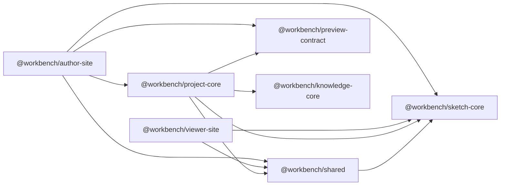
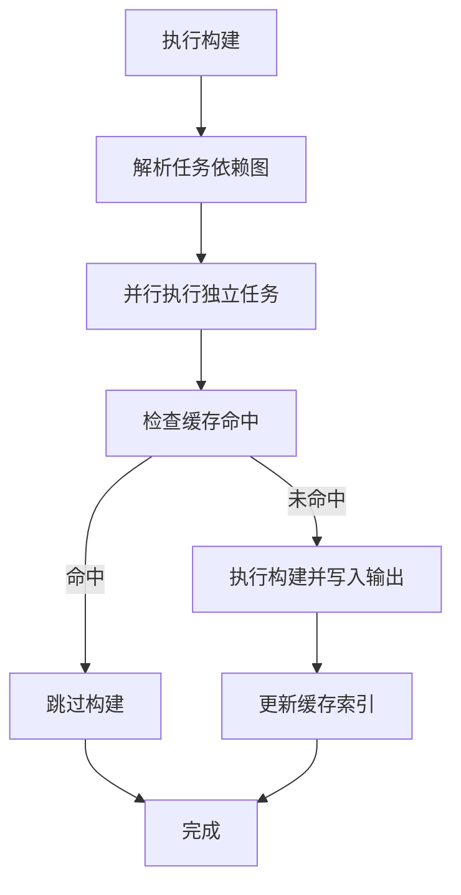
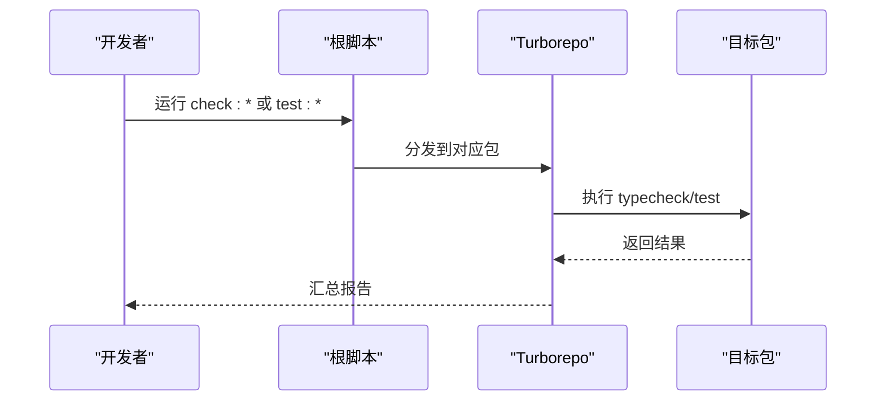

# Monorepo 包管理

<cite>
**本文引用的文件**   
- [package.json](file://package.json)
- [pnpm-workspace.yaml](file://pnpm-workspace.yaml)
- [turbo.json](file://turbo.json)
- [packages/shared/package.json](file://packages/shared/package.json)
- [packages/preview-contract/package.json](file://packages/preview-contract/package.json)
- [packages/project-core/package.json](file://packages/project-core/package.json)
- [packages/author-site/package.json](file://packages/author-site/package.json)
- [packages/viewer-site/package.json](file://packages/viewer-site/package.json)
- [packages/sketch-core/package.json](file://packages/sketch-core/package.json)
- [packages/knowledge-core/package.json](file://packages/knowledge-core/package.json)
- [packages/project-cli/package.json](file://packages/project-cli/package.json)
- [scripts/check-contracts.mjs](file://scripts/check-contracts.mjs)
</cite>

## 目录
1. [简介](#简介)
2. [项目结构](#项目结构)
3. [核心组件](#核心组件)
4. [架构总览](#架构总览)
5. [详细组件分析](#详细组件分析)
6. [依赖关系与版本策略](#依赖关系与版本策略)
7. [性能与缓存优化](#性能与缓存优化)
8. [开发与测试工作流](#开发与测试工作流)
9. [发布流程与最佳实践](#发布流程与最佳实践)
10. [故障排查指南](#故障排查指南)
11. [结论](#结论)

## 简介
本文件面向 Workbench Monorepo 的包管理与构建体系，聚焦以下目标：
- pnpm workspace 配置与内部包依赖管理机制
- Turborepo 构建缓存、任务依赖图与并行构建优化
- 共享包设计模式（如 shared、preview-contract）的职责划分
- 包间依赖关系与版本兼容性策略
- 开发工作流（增量构建、代码共享、测试策略）
- 包发布流程与版本控制最佳实践

## 项目结构
仓库采用 pnpm workspace 组织多个子包，根级脚本统一编排开发、构建与检查任务；Turborepo 负责跨包的构建缓存与任务调度。

图表来源
- [package.json:1-101](file://package.json#L1-L101)
- [pnpm-workspace.yaml:1-15](file://pnpm-workspace.yaml#L1-L15)
- [turbo.json:1-20](file://turbo.json#L1-L20)
- [packages/author-site/package.json:1-127](file://packages/author-site/package.json#L1-L127)
- [packages/viewer-site/package.json:1-62](file://packages/viewer-site/package.json#L1-L62)
- [packages/project-core/package.json:1-27](file://packages/project-core/package.json#L1-L27)
- [packages/shared/package.json:1-21](file://packages/shared/package.json#L1-L21)
- [packages/preview-contract/package.json:1-28](file://packages/preview-contract/package.json#L1-L28)
- [packages/sketch-core/package.json:1-21](file://packages/sketch-core/package.json#L1-L21)
- [packages/knowledge-core/package.json:1-20](file://packages/knowledge-core/package.json#L1-L20)
- [packages/project-cli/package.json:1-31](file://packages/project-cli/package.json#L1-L31)

章节来源
- [package.json:1-101](file://package.json#L1-L101)
- [pnpm-workspace.yaml:1-15](file://pnpm-workspace.yaml#L1-L15)
- [turbo.json:1-20](file://turbo.json#L1-L20)

## 核心组件
- 根脚本与工具链
  - 通过根 package.json 提供 dev/build/lint/typecheck/test 等命令，使用 corepack pnpm --filter 精确定位子包执行，保证可复现的环境与一致的依赖解析。
- 工作区与依赖覆盖
  - pnpm-workspace.yaml 声明 packages/* 与 OPS/CLI 为工作区包，并集中配置 allowBuilds 与 overrides，确保原生模块与关键依赖版本一致。
- 构建缓存与任务编排
  - turbo.json 定义 build/dev/lint/clean 任务的依赖与输出，build 任务依赖上游包的构建产物，并通过 outputs 指定缓存目录。

章节来源
- [package.json:1-101](file://package.json#L1-L101)
- [pnpm-workspace.yaml:1-15](file://pnpm-workspace.yaml#L1-L15)
- [turbo.json:1-20](file://turbo.json#L1-L20)

## 架构总览
Monorepo 分层清晰：
- 应用层：author-site、viewer-site 基于 Next.js 提供创作端与预览端
- 服务层：agent-client、screenshot-service 提供 Agent 客户端与截图服务
- 核心库：project-core、knowledge-core、sketch-core、preview-contract、shared 提供领域能力与契约
- CLI：project-cli 作为工程化入口，依赖 preview-contract 与 project-core

图表来源
- [packages/author-site/package.json:1-127](file://packages/author-site/package.json#L1-L127)
- [packages/viewer-site/package.json:1-62](file://packages/viewer-site/package.json#L1-L62)
- [packages/project-core/package.json:1-27](file://packages/project-core/package.json#L1-L27)
- [packages/shared/package.json:1-21](file://packages/shared/package.json#L1-L21)
- [packages/preview-contract/package.json:1-28](file://packages/preview-contract/package.json#L1-L28)
- [packages/sketch-core/package.json:1-21](file://packages/sketch-core/package.json#L1-L21)
- [packages/knowledge-core/package.json:1-20](file://packages/knowledge-core/package.json#L1-L20)
- [packages/project-cli/package.json:1-31](file://packages/project-cli/package.json#L1-L31)

## 详细组件分析

### 共享包与契约包职责
- @workbench/shared
  - 暴露通用类型与演示模板，导出 contracts 与 demo 相关模块，依赖 sketch-core 以复用绘图核心能力。
- @workbench/preview-contract
  - 定义预览运行时、编译器与规则的类型契约，供 CLI 与站点消费，保障前后端与工具链对预览产物的约定一致。
- @workbench/project-core
  - 聚合知识、预览契约、绘图核心与共享模块，形成项目域的核心能力中心。

图表来源
- [packages/shared/package.json:1-21](file://packages/shared/package.json#L1-L21)
- [packages/preview-contract/package.json:1-28](file://packages/preview-contract/package.json#L1-L28)
- [packages/project-core/package.json:1-27](file://packages/project-core/package.json#L1-L27)

章节来源
- [packages/shared/package.json:1-21](file://packages/shared/package.json#L1-L21)
- [packages/preview-contract/package.json:1-28](file://packages/preview-contract/package.json#L1-L28)
- [packages/project-core/package.json:1-27](file://packages/project-core/package.json#L1-L27)

### 应用层与核心库集成
- author-site
  - 依赖 project-core、shared、sketch-core、preview-contract 等，构建前会触发预览运行时代码生成，再执行 Next.js 构建。
- viewer-site
  - 依赖 shared、sketch-core 等，同样在构建前生成预览运行时代码。

图表来源
- [packages/author-site/package.json:1-127](file://packages/author-site/package.json#L1-L127)
- [package.json:1-101](file://package.json#L1-L101)

章节来源
- [packages/author-site/package.json:1-127](file://packages/author-site/package.json#L1-L127)
- [packages/viewer-site/package.json:1-62](file://packages/viewer-site/package.json#L1-L62)

### CLI 与契约校验
- @workbench/project-cli
  - 提供命令行工具，依赖 preview-contract 与 project-core，用于项目管理与脚手架操作。
- 契约校验脚本
  - scripts/check-contracts.mjs 读取多包源码片段，断言关键接口与字段存在，确保跨包契约一致性。

图表来源
- [scripts/check-contracts.mjs:1-366](file://scripts/check-contracts.mjs#L1-L366)
- [packages/project-cli/package.json:1-31](file://packages/project-cli/package.json#L1-L31)

章节来源
- [packages/project-cli/package.json:1-31](file://packages/project-cli/package.json#L1-L31)
- [scripts/check-contracts.mjs:1-366](file://scripts/check-contracts.mjs#L1-L366)

## 依赖关系与版本策略
- 内部包版本管理
  - 所有内部包均使用 workspace:* 进行本地链接，避免跨包版本漂移，确保开发时始终引用最新实现。
- 外部依赖覆盖
  - 根 pnpm-workspace.yaml 与 package.json 中设置 overrides，统一关键依赖版本，减少重复安装与冲突。
- 原生模块构建许可
  - pnpm-workspace.yaml 的 allowBuilds 显式允许部分需要编译的原生依赖在工作区内构建，提升可移植性。

图表来源
- [packages/author-site/package.json:1-127](file://packages/author-site/package.json#L1-L127)
- [packages/viewer-site/package.json:1-62](file://packages/viewer-site/package.json#L1-L62)
- [packages/project-core/package.json:1-27](file://packages/project-core/package.json#L1-L27)
- [packages/shared/package.json:1-21](file://packages/shared/package.json#L1-L21)
- [packages/preview-contract/package.json:1-28](file://packages/preview-contract/package.json#L1-L28)
- [packages/sketch-core/package.json:1-21](file://packages/sketch-core/package.json#L1-L21)
- [packages/knowledge-core/package.json:1-20](file://packages/knowledge-core/package.json#L1-L20)

章节来源
- [pnpm-workspace.yaml:1-15](file://pnpm-workspace.yaml#L1-L15)
- [package.json:91-99](file://package.json#L91-L99)

## 性能与缓存优化
- Turborepo 任务缓存
  - build 任务声明 dependsOn: ["^build"]，确保依赖包先构建；outputs 包含 .next/** 与 dist/**，将构建产物纳入缓存键计算。
  - dev 任务禁用缓存并标记为持久任务，适合热重载场景。
  - lint 任务依赖上游构建，保证类型与规则基于最新产物执行。
- 并行构建
  - 通过 Turbo 的任务图自动并行执行无相互阻塞的任务，显著缩短全量构建时间。
- 增量构建
  - 仅当输入或输出哈希变化时重新构建，结合 workspace:* 的即时链接，提高迭代效率。

图表来源
- [turbo.json:1-20](file://turbo.json#L1-L20)

章节来源
- [turbo.json:1-20](file://turbo.json#L1-L20)

## 开发与测试工作流
- 开发环境
  - 根脚本提供 dev、dev:services、dev:author、dev:viewer 等命令，支持按包启动与多服务并发。
- 类型检查与测试
  - 每个包提供 typecheck 与 test 脚本，根脚本提供 check:* 组合命令，便于局部验证与全量回归。
- 契约校验
  - 使用 scripts/check-contracts.mjs 校验跨包契约，确保 API 与数据结构稳定。

图表来源
- [package.json:1-101](file://package.json#L1-L101)
- [turbo.json:1-20](file://turbo.json#L1-L20)

章节来源
- [package.json:1-101](file://package.json#L1-L101)
- [scripts/check-contracts.mjs:1-366](file://scripts/check-contracts.mjs#L1-L366)

## 发布流程与最佳实践
- 当前状态
  - 所有内部包均为私有（private: true），并使用 workspace:* 链接，未直接对外发布。
- 建议的发布流程
  - 版本策略：采用语义化版本（SemVer），在变更公共契约或破坏性接口时升级主版本。
  - 自动化：引入 changesets 或 lerna 管理变更集与版本号，自动生成 changelog 与版本标签。
  - 构建与校验：发布前执行全量 typecheck、test 与契约校验，确保产物稳定。
  - 发布源：配置私有 npm 源或企业仓库，使用 CI 流水线执行 publish。
  - 依赖更新：优先使用 workspace:* 保持开发期同步，发布后在消费者包中按需升级版本范围。
- 最佳实践
  - 明确 exports 字段，限制可访问路径，避免泄露内部实现。
  - 最小化依赖，尽量将第三方依赖放入 devDependencies。
  - 为每个包编写 README 与示例，降低协作成本。

[本节为通用指导，不直接分析具体文件]

## 故障排查指南
- 构建缓存失效
  - 清理 Turbo 缓存后重试；检查 outputs 是否正确声明，确保产物被纳入缓存键。
- 依赖冲突
  - 使用 pnpm overrides 统一关键依赖版本；必要时在包内单独锁定版本。
- 契约不一致
  - 运行契约校验脚本，根据错误提示修复缺失字段或类型。
- 原生模块构建失败
  - 确认 allowBuilds 已启用相应模块；检查 Node 版本与平台兼容性。

章节来源
- [turbo.json:1-20](file://turbo.json#L1-L20)
- [pnpm-workspace.yaml:1-15](file://pnpm-workspace.yaml#L1-L15)
- [scripts/check-contracts.mjs:1-366](file://scripts/check-contracts.mjs#L1-L366)

## 结论
Workbench Monorepo 通过 pnpm workspace 与 Turborepo 的组合，实现了高效的依赖管理与构建缓存；共享包与契约包明确了职责边界与跨包约定；根脚本提供了统一的开发、构建与校验入口。遵循本文的工作流与最佳实践，可进一步提升团队协作效率与交付质量。