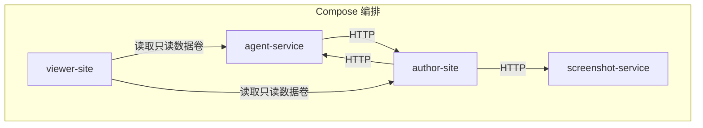
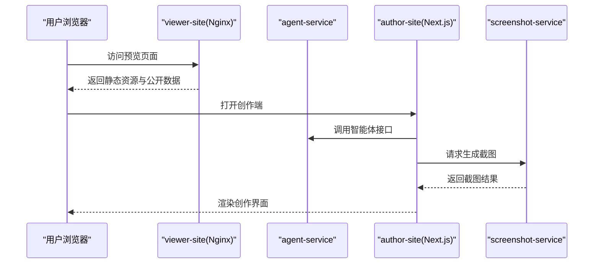
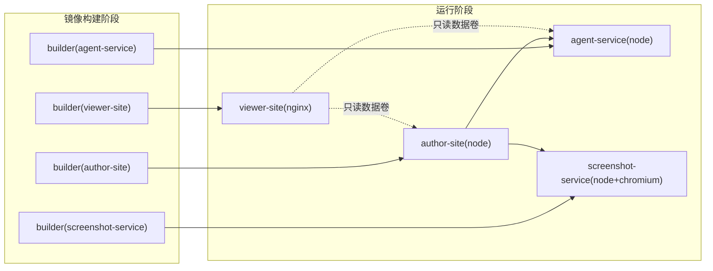

# 容器化部署策略

<cite>
**本文引用的文件**   
- [docker-compose.yml](file://docker-compose.yml)
- [agent-service/Dockerfile](file://docker/agent-service/Dockerfile)
- [author-site/Dockerfile](file://docker/author-site/Dockerfile)
- [screenshot-service/Dockerfile](file://docker/screenshot-service/Dockerfile)
- [viewer-site/Dockerfile](file://docker/viewer-site/Dockerfile)
- [viewer-site/nginx.conf](file://docker/viewer-site/nginx.conf)
- [deploy.sh](file://scripts/deploy.sh)
- [deploy-fast.sh](file://scripts/deploy-fast.sh)
- [docker-build-check.sh](file://scripts/docker-build-check.sh)
- [docker-prepull.sh](file://scripts/docker-prepull.sh)
- [docker-orbstack-up.sh](file://scripts/docker-orbstack-up.sh)
- [docker-screenshot-deep-health.sh](file://scripts/docker-screenshot-deep-health.sh)
</cite>

## 目录
1. [简介](#简介)
2. [项目结构](#项目结构)
3. [核心组件](#核心组件)
4. [架构总览](#架构总览)
5. [详细组件分析](#详细组件分析)
6. [依赖关系分析](#依赖关系分析)
7. [性能与资源限制](#性能与资源限制)
8. [数据持久化与备份恢复](#数据持久化与备份恢复)
9. [健康检查与监控集成](#健康检查与监控集成)
10. [生产环境部署架构](#生产环境部署架构)
11. [部署自动化与 CI/CD](#部署自动化与-cicd)
12. [扩容策略](#扩容策略)
13. [故障排查指南](#故障排查指南)
14. [结论](#结论)

## 简介
本策略文档面向 Workbench 的容器化部署，覆盖 Docker Compose 编排、镜像构建与安全加固、生产反向代理与 SSL、负载均衡、数据持久化与备份、健康检查与监控、部署自动化脚本与流水线、以及扩容策略。目标是帮助读者在本地与生产环境中稳定、安全、可观测地运行 Workbench。

## 项目结构
Workbench 采用多服务架构，通过 Docker Compose 编排：
- agent-service：后端智能体服务
- author-site：创作端（Next.js）
- screenshot-service：截图服务（Chromium + Puppeteer）
- viewer-site：预览端（静态站点 + Nginx）

图表来源
- [docker-compose.yml:1-140](file://docker-compose.yml#L1-L140)

章节来源
- [docker-compose.yml:1-140](file://docker-compose.yml#L1-L140)

## 核心组件
- 服务定义与端口映射
  - agent-service：3201
  - author-site：3200
  - screenshot-service：3202（可选 profile）
  - viewer-site：宿主机 3300 -> 容器 80
- 环境变量管理
  - 通过 .env.docker 注入，支持默认值与外部变量覆盖
  - 关键变量包括模型配置、CORS、内部令牌、Figma OAuth、截图平台等
- 数据卷挂载
  - 统一使用 APP_DATA_DIR 指向宿主路径，便于持久化与共享
  - viewer-site 以只读方式挂载数据卷
- 资源限制
  - CPU、内存、进程数限制，截图服务额外设置 shm_size
- 健康检查
  - 各服务暴露 /health 或根路径用于健康探测

章节来源
- [docker-compose.yml:1-140](file://docker-compose.yml#L1-L140)

## 架构总览

图表来源
- [docker-compose.yml:1-140](file://docker-compose.yml#L1-L140)
- [viewer-site/nginx.conf:1-45](file://docker/viewer-site/nginx.conf#L1-L45)

## 详细组件分析

### 服务与网络
- 服务间通信
  - author-site 通过内部域名访问 agent-service 与 screenshot-service
  - viewer-site 仅通过 HTTP 提供静态内容与公开数据
- 网络隔离
  - 默认使用 Compose 内置网络，服务名即 DNS 名称
  - 如需跨主机或外部网关，可在生产层引入反向代理统一入口

章节来源
- [docker-compose.yml:1-140](file://docker-compose.yml#L1-L140)

### 数据卷与权限
- 统一数据目录
  - 所有写服务共享同一宿主目录，便于备份与迁移
  - viewer-site 以只读挂载避免误写
- 首次部署保护
  - 部署脚本默认不自动创建空 data 目录，防止误切到空数据

章节来源
- [docker-compose.yml:35-86](file://docker-compose.yml#L35-L86)
- [docker-compose.yml:132-139](file://docker-compose.yml#L132-L139)
- [deploy.sh:449-464](file://scripts/deploy.sh#L449-L464)

### 环境变量与密钥
- 敏感信息
  - INTERNAL_API_TOKEN、JWT_SECRET、ADMIN_SECRET、OAuth 凭据等需通过安全渠道注入
- 运行时开关
  - CORS_ORIGINS、PUPPETEER_DISABLE_SANDBOX、USE_SECURE_COOKIE 等按环境调整

章节来源
- [docker-compose.yml:8-86](file://docker-compose.yml#L8-L86)

### 健康检查
- 内置健康端点
  - agent-service、screenshot-service 暴露 /health
  - author-site 根路径作为简易健康检查
- 深度健康检查
  - screenshot-service 支持 deep=1 参数进行浏览器能力自检

章节来源
- [docker-compose.yml:116-121](file://docker-compose.yml#L116-L121)
- [docker-screenshot-deep-health.sh:1-42](file://scripts/docker-screenshot-deep-health.sh#L1-L42)

## 依赖关系分析

图表来源
- [agent-service/Dockerfile:1-43](file://docker/agent-service/Dockerfile#L1-L43)
- [author-site/Dockerfile:1-94](file://docker/author-site/Dockerfile#L1-L94)
- [screenshot-service/Dockerfile:1-56](file://docker/screenshot-service/Dockerfile#L1-L56)
- [viewer-site/Dockerfile:1-46](file://docker/viewer-site/Dockerfile#L1-L46)

章节来源
- [agent-service/Dockerfile:1-43](file://docker/agent-service/Dockerfile#L1-L43)
- [author-site/Dockerfile:1-94](file://docker/author-site/Dockerfile#L1-L94)
- [screenshot-service/Dockerfile:1-56](file://docker/screenshot-service/Dockerfile#L1-L56)
- [viewer-site/Dockerfile:1-46](file://docker/viewer-site/Dockerfile#L1-L46)

## 性能与资源限制
- 资源配额
  - agent-service：CPU 1.0，内存 1g，进程上限 512
  - author-site：CPU 1.0，内存 1g，进程上限 512
  - screenshot-service：CPU 1.0，内存 1536m，进程上限 768，shm_size 256m
  - viewer-site：CPU 0.5，内存 512m，进程上限 256
- 构建优化
  - 多阶段构建减少运行镜像体积
  - pnpm 缓存加速依赖安装
  - 按需拷贝包，避免无关文件进入镜像
- 平台兼容
  - screenshot-service 支持指定平台（如 linux/amd64），适配 OrbStack 等环境

章节来源
- [docker-compose.yml:37-115](file://docker-compose.yml#L37-L115)
- [docker-compose.yml:91-91](file://docker-compose.yml#L91-L91)
- [docker-compose.yml:136-139](file://docker-compose.yml#L136-L139)
- [docker-prepull.sh:38-44](file://scripts/docker-prepull.sh#L38-L44)

## 数据持久化与备份恢复
- 持久化方案
  - 统一 APP_DATA_DIR 挂载至宿主目录，确保容器重启后数据不丢失
  - viewer-site 以只读方式访问发布产物，避免并发写入冲突
- 备份建议
  - 定期归档 APP_DATA_DIR 目录（包含项目、审计日志、发布产物等）
  - 对大对象（如截图、预览产物）可使用对象存储或快照机制
- 恢复流程
  - 停止服务 -> 替换数据目录 -> 启动服务 -> 执行健康检查

章节来源
- [docker-compose.yml:35-86](file://docker-compose.yml#L35-L86)
- [docker-compose.yml:132-139](file://docker-compose.yml#L132-L139)

## 健康检查与监控集成
- 健康检查
  - 容器级 HEALTHCHECK 定时探测 /health 或根路径
  - 部署脚本在启动后进行 API 可达性校验
- 深度健康检查
  - screenshot-service 支持 deep=1 参数验证 Chromium 可用性
- 监控集成建议
  - 采集容器指标（CPU、内存、I/O）、应用日志与链路追踪
  - 将 /health 接入外部监控系统（如 Prometheus、Grafana）

章节来源
- [docker-compose.yml:116-121](file://docker-compose.yml#L116-L121)
- [docker-compose.yml:39-40](file://docker-compose.yml#L39-L40)
- [docker-compose.yml:90-91](file://docker-compose.yml#L90-L91)
- [docker-compose.yml:50-51](file://docker-compose.yml#L50-L51)
- [docker-screenshot-deep-health.sh:1-42](file://scripts/docker-screenshot-deep-health.sh#L1-L42)

## 生产环境部署架构
- 反向代理
  - 在生产中建议使用 Nginx/Traefik/Ingress 作为统一入口，负责 TLS 终止、路由与限流
  - 将 3200/3201/3202 端口暴露给内网，对外仅开放 443
- SSL 证书管理
  - 由反向代理统一管理证书（Let's Encrypt 或企业 CA）
  - 启用 HSTS、TLS 1.2+、强加密套件
- 负载均衡
  - 对无状态服务（author-site、agent-service）进行水平扩展
  - 会话与状态外置（数据库、对象存储），避免粘性会话
- 安全加固
  - 最小权限原则：非 root 运行（截图服务已切换 user）
  - 仅暴露必要端口；严格 CORS 白名单
  - 使用内部令牌鉴权管理后台接口

章节来源
- [docker-compose.yml:8-86](file://docker-compose.yml#L8-L86)
- [docker-compose.yml:116-121](file://docker-compose.yml#L116-L121)
- [screenshot-service/Dockerfile:53-55](file://docker/screenshot-service/Dockerfile#L53-L55)

## 部署自动化与 CI/CD
- 一键部署脚本
  - deploy.sh：完整流程（预检、同步、构建、加载镜像、启动、自检）
  - deploy-fast.sh：快捷入口，支持 targeted sync 与本地构建模式
- 构建与预拉取
  - docker-build-check.sh：本地构建校验，支持并行与截图服务
  - docker-prepull.sh：预拉基础镜像，提升构建速度
- 本地开发体验
  - docker-orbstack-up.sh：一键拉起本地服务并验证
- 流水线建议
  - 触发条件：push/PR
  - 步骤：lint/test -> 构建镜像 -> 推送镜像仓库 -> 部署到目标环境 -> 健康检查
  - 回滚策略：基于镜像标签快速回滚

章节来源
- [deploy.sh:1-800](file://scripts/deploy.sh#L1-L800)
- [deploy-fast.sh:1-140](file://scripts/deploy-fast.sh#L1-L140)
- [docker-build-check.sh:1-94](file://scripts/docker-build-check.sh#L1-L94)
- [docker-prepull.sh:1-45](file://scripts/docker-prepull.sh#L1-L45)
- [docker-orbstack-up.sh:1-98](file://scripts/docker-orbstack-up.sh#L1-L98)

## 扩容策略
- 水平扩展
  - author-site 与 agent-service 为无状态服务，可通过副本数扩展
  - 使用外部负载均衡分发流量
- 垂直扩展
  - 根据负载调整 CPU/内存配额，截图服务需关注内存与共享内存
- 弹性伸缩
  - 结合 KEDA/HPA 基于 QPS/CPU 指标自动扩缩容
- 灰度与蓝绿
  - 基于镜像版本与反向代理权重实现灰度发布

章节来源
- [docker-compose.yml:37-115](file://docker-compose.yml#L37-L115)

## 故障排查指南
- 常见问题定位
  - SSH 连接失败：检查私钥与服务器可达性
  - 远程镜像源失效：修复 daemon.json 中的镜像源
  - 资源不足：本地或远端构建前进行内存与负载预检
  - 数据目录不存在：确认 APP_DATA_DIR 存在且权限正确
- 健康检查失败
  - 查看容器日志与 /health 响应
  - 截图服务使用深度健康检查验证 Chromium
- 内部令牌不一致
  - 确保 author-site 与 agent-service 使用相同的 INTERNAL_API_TOKEN

章节来源
- [deploy.sh:196-274](file://scripts/deploy.sh#L196-L274)
- [deploy.sh:449-464](file://scripts/deploy.sh#L449-L464)
- [deploy.sh:596-794](file://scripts/deploy.sh#L596-L794)
- [docker-screenshot-deep-health.sh:1-42](file://scripts/docker-screenshot-deep-health.sh#L1-L42)

## 结论
通过多阶段构建、严格的资源限制与健康检查、统一的部署脚本与预检机制，Workbench 能够在本地与生产环境中稳定运行。生产环境建议引入反向代理与负载均衡，配合完善的监控与告警体系，实现高可用与可观测性。数据持久化与备份恢复是保障业务连续性的关键，应纳入日常运维流程。