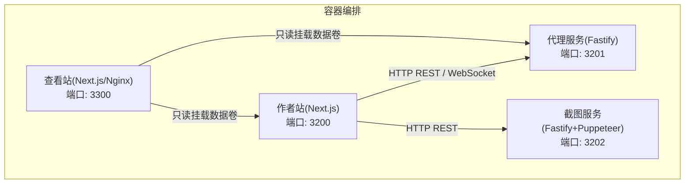
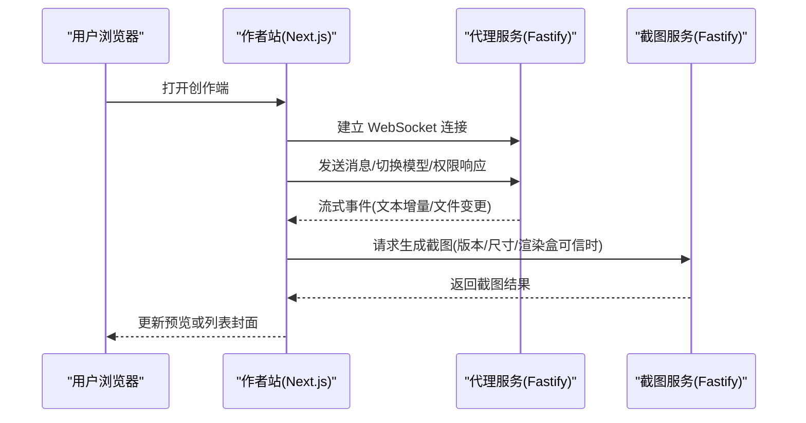
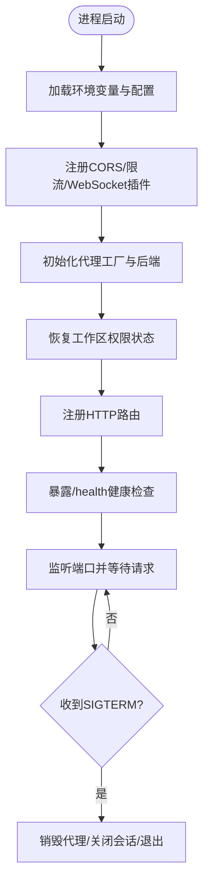
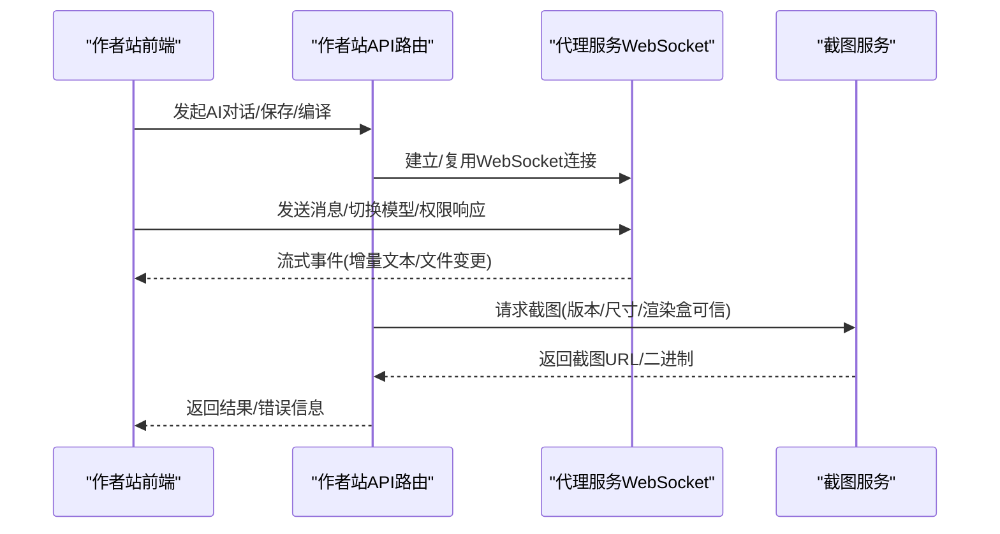
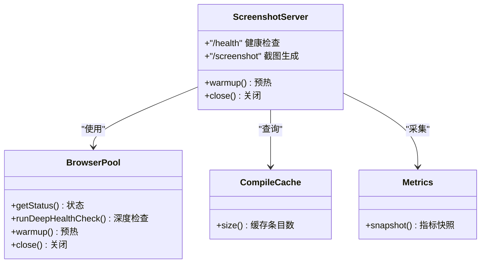
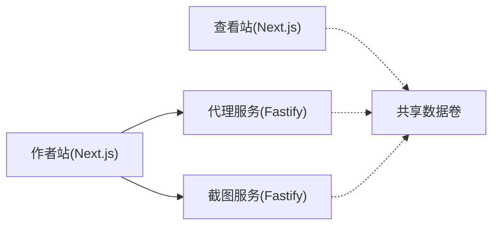

# 微服务架构设计

<cite>
**本文引用的文件**
- [docker-compose.yml](file://docker-compose.yml)
- [package.json](file://package.json)
- [packages/agent-service/package.json](file://packages/agent-service/package.json)
- [packages/screenshot-service/package.json](file://packages/screenshot-service/package.json)
- [packages/author-site/package.json](file://packages/author-site/package.json)
- [packages/viewer-site/package.json](file://packages/viewer-site/package.json)
- [packages/agent-service/src/server.ts](file://packages/agent-service/src/server.ts)
- [packages/screenshot-service/src/server.ts](file://packages/screenshot-service/src/server.ts)
- [docs/项目文档/创作端/05-AI对话/技术/02_AIChat分层架构.md](file://docs/项目文档/创作端/05-AI对话/技术/02_AIChat分层架构.md)
- [docs/项目文档/创作端/04-配置与预览/技术/09_截图服务性能优化方案.md](file://docs/项目文档/创作端/04-配置与预览/技术/09_截图服务性能优化方案.md)
- [docs/复盘文档/预览引擎/iframe沙箱与动态CDN编译策略.md](file://docs/复盘文档/预览引擎/iframe沙箱与动态CDN编译策略.md)
- [OPS/CLI/src/commands/logs.ts](file://OPS/CLI/src/commands/logs.ts)
</cite>

## 目录
1. [引言](#引言)
2. [项目结构](#项目结构)
3. [核心组件](#核心组件)
4. [架构总览](#架构总览)
5. [详细组件分析](#详细组件分析)
6. [依赖关系分析](#依赖关系分析)
7. [性能考虑](#性能考虑)
8. [故障排查指南](#故障排查指南)
9. [结论](#结论)
10. [附录](#附录)

## 引言
本设计文档面向 Workbench 微服务架构，聚焦以下目标：
- 明确各微服务的职责边界与独立部署策略（Agent 服务、Author Site、Viewer Site、Screenshot Service）。
- 描述服务间通信机制（HTTP REST API、WebSocket 实时通信）及错误处理策略。
- 说明服务发现、负载均衡与高可用设计思路。
- 解释容错机制、熔断器模式与降级策略。
- 提供服务间调用图与数据流向图，帮助开发者理解交互关系。
- 给出性能优化与扩展性设计原则。

## 项目结构
Workbench 采用 monorepo + Docker Compose 的本地开发/演示编排方式，核心服务如下：
- Agent 服务：提供 AI 代理能力、项目管理、协作与 WebSocket 实时通道。
- Author Site（创作端）：Next.js 应用，承载编辑器、AI 对话、项目管理等前端与后端路由。
- Viewer Site（使用端展示）：Next.js 静态站点，用于发布后的内容展示。
- Screenshot Service（截图服务）：基于 Puppeteer 的页面截图生成服务。

图表来源
- [docker-compose.yml](file://docker-compose.yml)

章节来源
- [docker-compose.yml](file://docker-compose.yml)
- [package.json](file://package.json)

## 核心组件
- Agent 服务
  - 技术栈：Fastify、@fastify/websocket、@fastify/rate-limit、@fastify/cors、yjs/y-protocols/ws。
  - 职责：AI 代理生命周期管理、会话存储、工作区权限恢复、内部配置同步、健康检查、WebSocket 实时事件分发。
  - 关键入口：server.ts 启动 Fastify、注册插件、暴露 /health、优雅关闭。
- Author Site（创作端）
  - 技术栈：Next.js、React、Yjs 生态、多种 UI 库。
  - 职责：编辑体验、AI 对话（含 StreamService 封装）、项目管理、编译预览、截图触发、模型配置管理。
  - 对外接口：REST API（如 /api/ai/chat、/api/admin/*），并作为客户端通过 HTTP 访问 Agent 与截图服务。
- Viewer Site（使用端展示）
  - 技术栈：Next.js、React、Tailwind。
  - 职责：渲染已发布内容，只读访问共享数据卷，不直接写数据。
- Screenshot Service（截图服务）
  - 技术栈：Fastify、puppeteer-core、浏览器池、编译缓存、指标采集。
  - 职责：接收截图请求，复用浏览器实例，返回截图产物；提供深度健康检查与指标。

章节来源
- [packages/agent-service/package.json](file://packages/agent-service/package.json)
- [packages/author-site/package.json](file://packages/author-site/package.json)
- [packages/viewer-site/package.json](file://packages/viewer-site/package.json)
- [packages/screenshot-service/package.json](file://packages/screenshot-service/package.json)
- [packages/agent-service/src/server.ts](file://packages/agent-service/src/server.ts)
- [packages/screenshot-service/src/server.ts](file://packages/screenshot-service/src/server.ts)

## 架构总览
整体采用“前后端分离 + 专用服务”的微服务模式：
- 创作端与查看端为独立的 Next.js 应用，分别负责编辑与展示。
- Agent 服务作为业务中枢，提供 AI 能力、协作与状态持久化。
- 截图服务作为无状态计算节点，按需生成页面截图。

图表来源
- [packages/agent-service/src/server.ts](file://packages/agent-service/src/server.ts)
- [packages/screenshot-service/src/server.ts](file://packages/screenshot-service/src/server.ts)
- [docs/项目文档/创作端/05-AI对话/技术/02_AIChat分层架构.md](file://docs/项目文档/创作端/05-AI对话/技术/02_AIChat分层架构.md)

## 详细组件分析

### Agent 服务（AI 代理与项目管理）
- 启动流程
  - 加载配置与环境变量，初始化日志、CORS、限流、WebSocket。
  - 注册后端代理工厂（支持 pi-agent 后端）。
  - 启动工作区权限恢复流程，注册路由，暴露 /health。
  - 监听 SIGTERM 进行优雅关闭（销毁所有代理、关闭会话存储、关闭服务器）。
- 运行时特性
  - CORS 允许来自作者站与查看站的跨域请求。
  - 限流保护公共接口。
  - 健康检查返回运行时长、代理数量与工作区权限恢复状态。
- 与外部集成
  - 作者站通过 HTTP 与 WebSocket 与其交互。
  - 可选地调用截图服务以生成资源快照。

图表来源
- [packages/agent-service/src/server.ts](file://packages/agent-service/src/server.ts)

章节来源
- [packages/agent-service/src/server.ts](file://packages/agent-service/src/server.ts)
- [packages/agent-service/package.json](file://packages/agent-service/package.json)

### Author Site（创作端应用）
- 职责边界
  - 提供编辑器、AI 对话、项目管理、编译预览、截图触发、模型配置管理等能力。
  - 作为客户端调用 Agent 服务（HTTP + WebSocket）与截图服务（HTTP）。
- 实时通信
  - 通过 StreamService 封装 WebSocket 连接管理、消息发送、事件分发与会话隔离。
  - 首条消息注入系统提示，流式回复过程中节流持久化，最终持久化与兜底策略完善。
- 错误处理
  - 对网络异常、非 JSON 响应、编译错误、运行时错误均有捕获与友好展示。
  - 截图失败不影响编辑与单页预览，保持用户体验连续性。

图表来源
- [docs/项目文档/创作端/05-AI对话/技术/02_AIChat分层架构.md](file://docs/项目文档/创作端/05-AI对话/技术/02_AIChat分层架构.md)

章节来源
- [docs/项目文档/创作端/05-AI对话/技术/02_AIChat分层架构.md](file://docs/项目文档/创作端/05-AI对话/技术/02_AIChat分层架构.md)
- [packages/author-site/package.json](file://packages/author-site/package.json)

### Viewer Site（使用端展示）
- 职责边界
  - 仅用于展示已发布内容，读取共享数据卷，不参与写入。
  - 通过 Next.js 提供静态/服务端渲染能力，减少运行时依赖。
- 部署策略
  - 可独立构建与部署，适合 CDN 加速与边缘缓存。
  - 与 Agent/作者站解耦，降低耦合风险。

章节来源
- [packages/viewer-site/package.json](file://packages/viewer-site/package.json)
- [docker-compose.yml](file://docker-compose.yml)

### Screenshot Service（截图生成）
- 职责边界
  - 接收截图请求，复用浏览器实例，返回截图产物。
  - 提供健康检查（基础/深度）、队列与缓存指标。
- 性能与可靠性
  - 浏览器池管理、预热、深度健康检查、指标采集。
  - 失败不阻断编辑，优先保证实时预览可用性。

图表来源
- [packages/screenshot-service/src/server.ts](file://packages/screenshot-service/src/server.ts)
- [packages/screenshot-service/package.json](file://packages/screenshot-service/package.json)

章节来源
- [packages/screenshot-service/src/server.ts](file://packages/screenshot-service/src/server.ts)
- [packages/screenshot-service/package.json](file://packages/screenshot-service/package.json)

## 依赖关系分析
- 服务间依赖
  - 作者站依赖 Agent 服务（HTTP + WebSocket）与截图服务（HTTP）。
  - 查看站只读依赖共享数据卷，不直接依赖其他服务。
  - 截图服务依赖浏览器环境（Chromium）与编译缓存。
- 容器编排依赖
  - docker-compose 定义服务顺序、端口映射、环境变量、资源限制与健康检查。
  - 截图服务默认处于 profile screenshot，可按需启用。

图表来源
- [docker-compose.yml](file://docker-compose.yml)

章节来源
- [docker-compose.yml](file://docker-compose.yml)

## 性能考虑
- 截图服务优化原则
  - 最新真实优先：页面变化后先回到实时 iframe；截图仅在版本、尺寸和 renderBox 可信时替换 iframe。
  - 内容身份与产物身份分离：区分快速/严格、renderBox 版本与渲染策略。
  - 少做无效工作：取消旧批次、合并同 hash 请求、跳过已有可信缓存，优先处理当前可见页。
  - 先观测再优化：补齐性能基线与缓存可信度，避免误判偶发收益。
  - 配置开关独立：调度、快速模式、预热、page 池独立启停，便于灰度与回退。
  - 失败不阻断编辑：截图慢、失败或离线时，画布与单页预览继续使用实时 iframe。
- 预览引擎错误恢复
  - 编译错误、执行错误、运行时错误均有捕获与展示。
  - iframe 内错误通过 postMessage 上报父窗口，显示友好提示，不清空上一个成功渲染结果。

章节来源
- [docs/项目文档/创作端/04-配置与预览/技术/09_截图服务性能优化方案.md](file://docs/项目文档/创作端/04-配置与预览/技术/09_截图服务性能优化方案.md)
- [docs/复盘文档/预览引擎/iframe沙箱与动态CDN编译策略.md](file://docs/复盘文档/预览引擎/iframe沙箱与动态CDN编译策略.md)

## 故障排查指南
- 健康检查
  - Agent 服务：/health 返回 status、uptime、agents、workspaceAuthorityRecovery。
  - 截图服务：/health 返回 browser 状态、队列、缓存条目、指标快照与 lastError，支持 deep=1 深度检查。
- CLI 诊断
  - 通过 CLI 命令拉取健康检查结果，记录级别、时间与消息，便于定位不可达或服务异常。
- 常见错误场景
  - 网络错误：fetch 异常或非 JSON 响应时，前端展示明确错误信息。
  - 渲染错误：iframe 内 Error Boundary 捕获并通过 postMessage 上报，父窗口友好提示。
  - 截图失败：不阻断编辑，优先保证实时预览可用性。

章节来源
- [packages/agent-service/src/server.ts](file://packages/agent-service/src/server.ts)
- [packages/screenshot-service/src/server.ts](file://packages/screenshot-service/src/server.ts)
- [OPS/CLI/src/commands/logs.ts](file://OPS/CLI/src/commands/logs.ts)
- [docs/复盘文档/预览引擎/iframe沙箱与动态CDN编译策略.md](file://docs/复盘文档/预览引擎/iframe沙箱与动态CDN编译策略.md)

## 结论
Workbench 微服务架构通过清晰的服务边界与独立部署策略，实现了创作端、展示端、AI 代理与截图能力的解耦。Agent 服务承担核心业务与实时通信，截图服务专注高性能渲染产物生成，作者站与查看站各司其职。配合健康检查、限流、CORS、优雅关闭与完善的错误恢复机制，系统在稳定性与可扩展性方面具备良好基础。未来可在服务发现、负载均衡与熔断降级方面进一步增强，以满足更高可用性与弹性伸缩需求。

## 附录
- 部署与运行
  - 使用 docker-compose 启动多服务，端口映射与环境变量集中管理。
  - 截图服务可通过 profile 控制是否参与编排。
- 开发与调试
  - 根脚本提供并行启动、单独服务启动与类型检查、测试等命令。
  - 健康检查与 CLI 诊断辅助快速定位问题。

章节来源
- [docker-compose.yml](file://docker-compose.yml)
- [package.json](file://package.json)