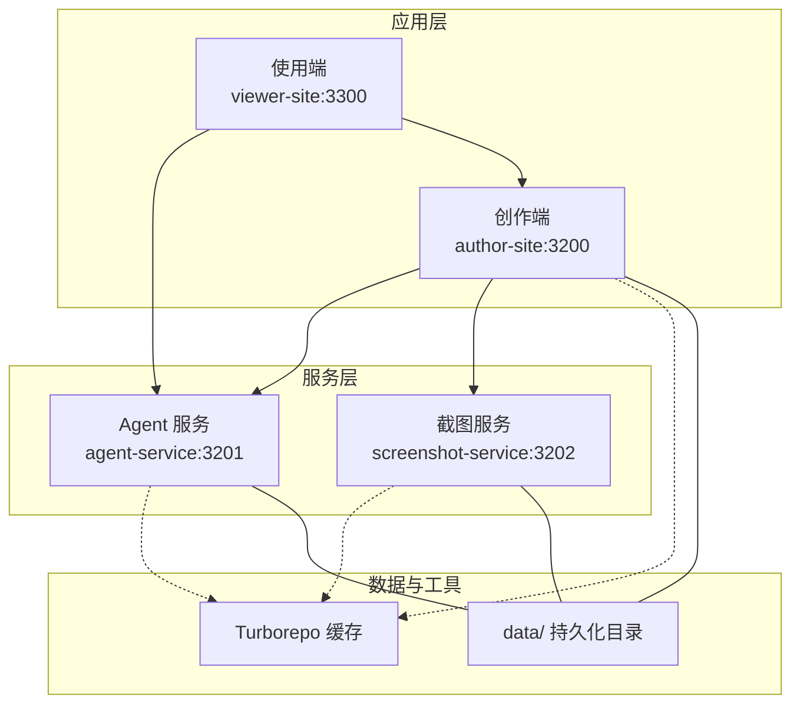
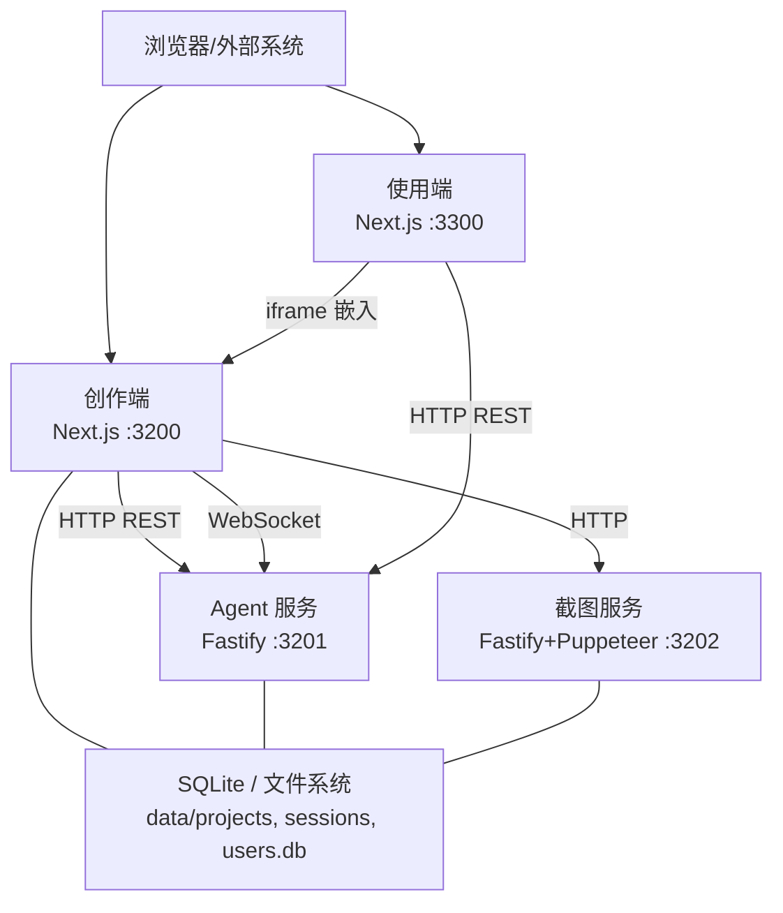
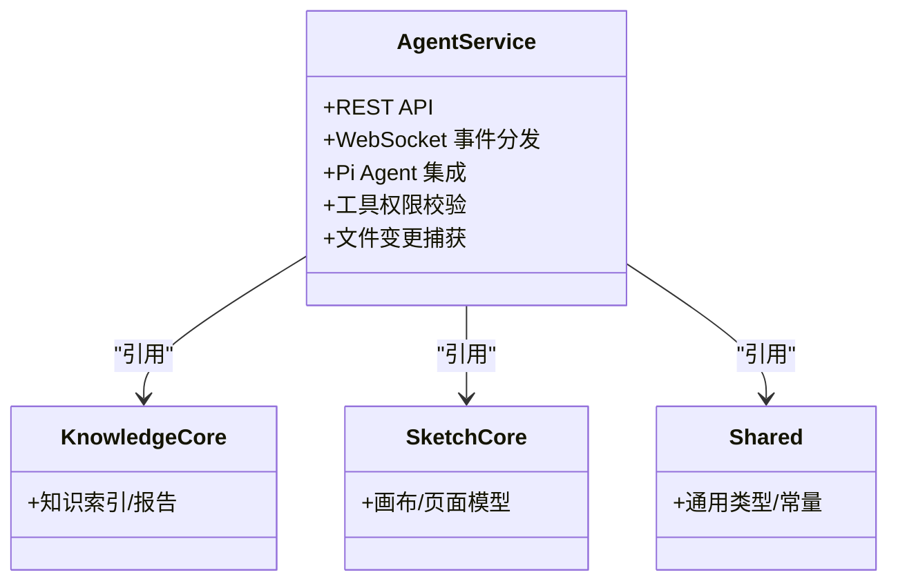
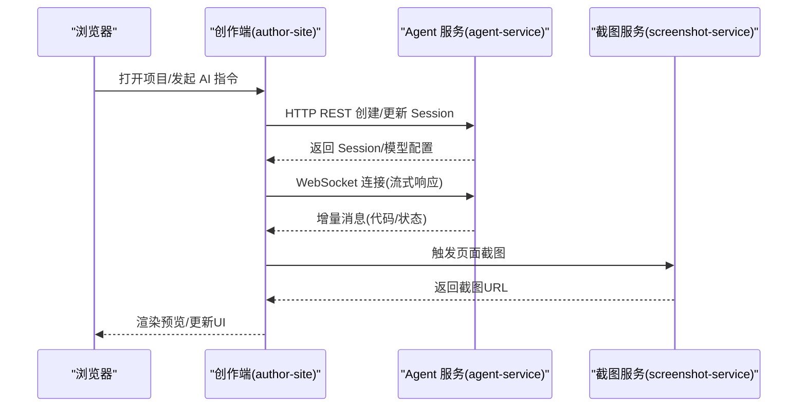
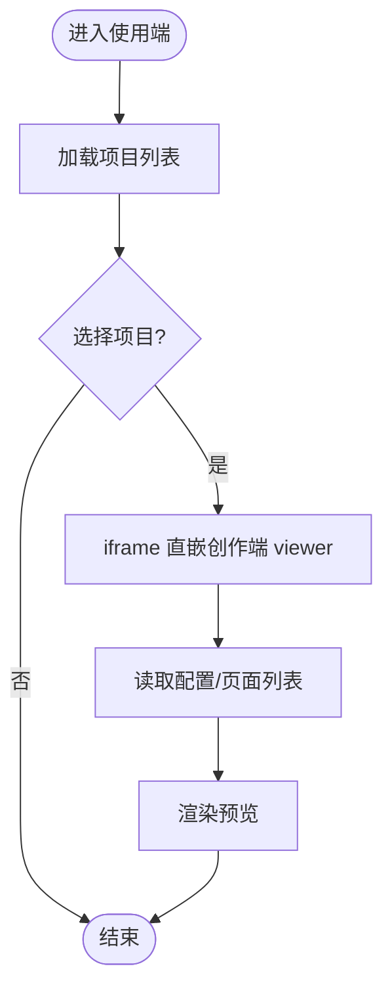
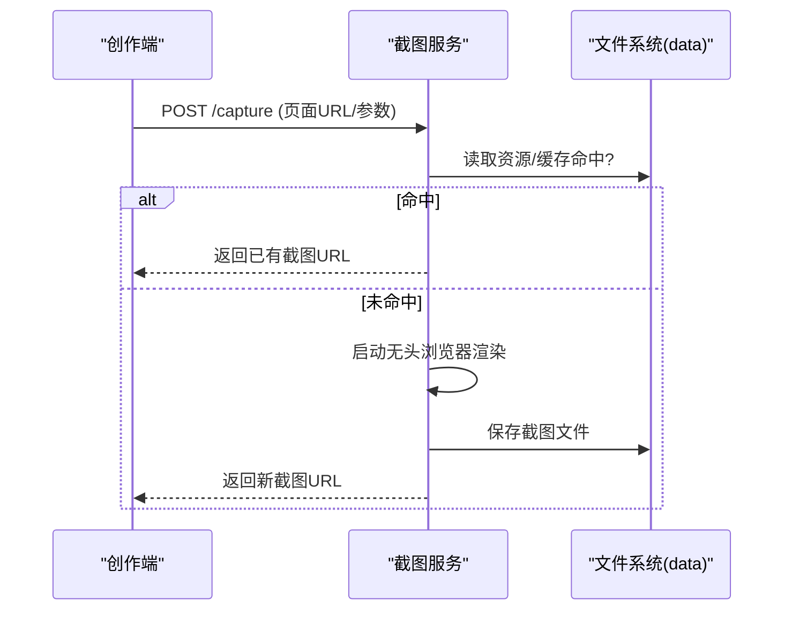
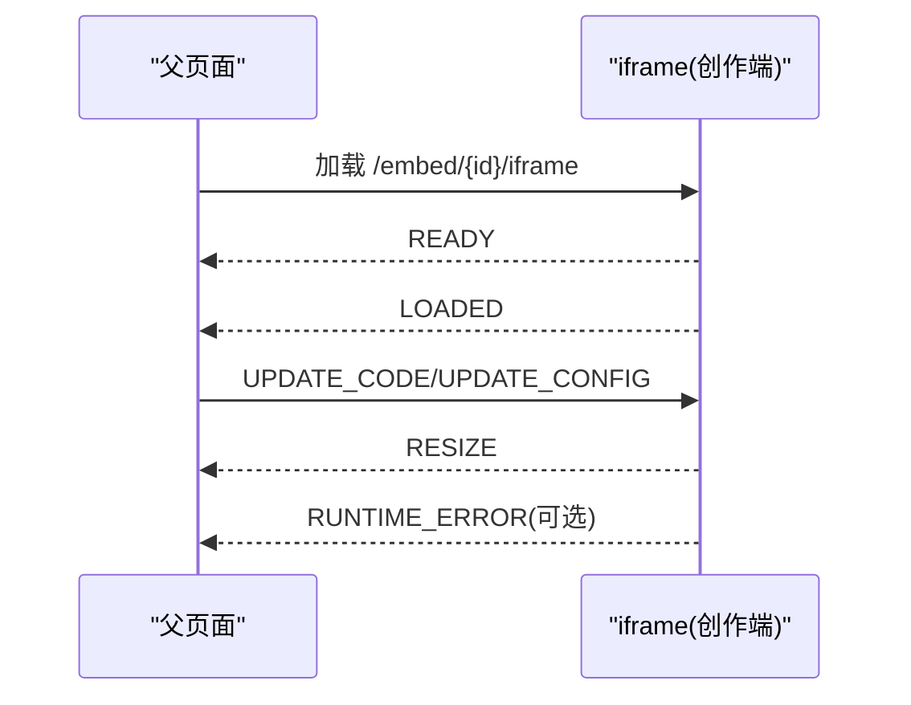
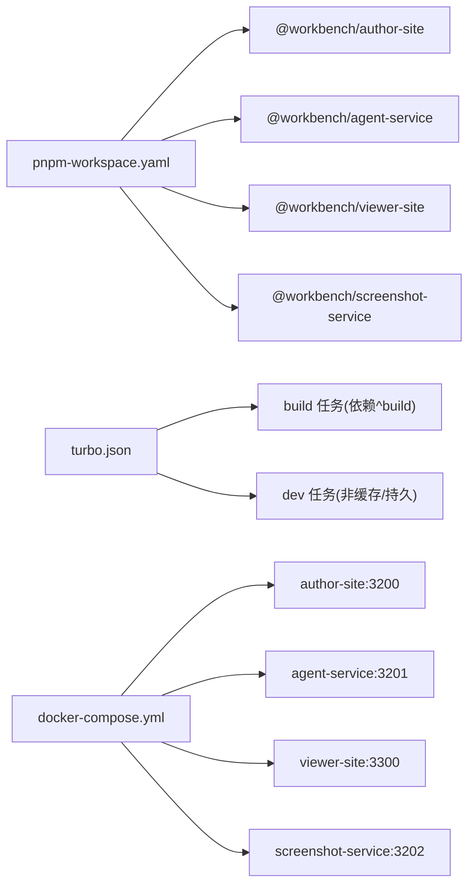

# 架构总览

<cite>
**本文引用的文件**   
- [package.json](file://package.json)
- [turbo.json](file://turbo.json)
- [pnpm-workspace.yaml](file://pnpm-workspace.yaml)
- [docker-compose.yml](file://docker-compose.yml)
- [packages/agent-service/package.json](file://packages/agent-service/package.json)
- [packages/author-site/package.json](file://packages/author-site/package.json)
- [packages/viewer-site/package.json](file://packages/viewer-site/package.json)
- [packages/screenshot-service/package.json](file://packages/screenshot-service/package.json)
- [docs/项目文档/项目总览.md](file://docs/项目文档/项目总览.md)
- [docs/项目文档/创作端/08-管理后台/技术/01_架构设计.md](file://docs/项目文档/创作端/08-管理后台/技术/01_架构设计.md)
- [docs/项目文档/创作端/README.md](file://docs/项目文档/创作端/README.md)
- [docs/项目文档/使用端/README.md](file://docs/项目文档/使用端/README.md)
- [docs/项目文档/使用端/03-部署与嵌入/技术/01_部署与CORS配置.md](file://docs/项目文档/使用端/03-部署与嵌入/技术/01_部署与CORS配置.md)
- [docs/项目文档/创作端/07-嵌入API/嵌入API_需求文档.md](file://docs/项目文档/创作端/07-嵌入API/嵌入API_需求文档.md)
- [docs/项目文档/创作端/06-基础设施/技术/03_Docker部署方案.md](file://docs/项目文档/创作端/06-基础设施/技术/03_Docker部署方案.md)
- [scripts/deploy.sh](file://scripts/deploy.sh)
</cite>

## 目录
1. [引言](#引言)
2. [项目结构](#项目结构)
3. [核心组件](#核心组件)
4. [架构总览](#架构总览)
5. [详细组件分析](#详细组件分析)
6. [依赖关系分析](#依赖关系分析)
7. [性能考量](#性能考量)
8. [故障排查指南](#故障排查指南)
9. [结论](#结论)
10. [附录](#附录)

## 引言
本架构总览面向 Workbench AI 辅助创作平台，聚焦微服务架构、Monorepo 与构建缓存、数据流与通信协议、容器化与编排策略，以及技术选型权衡。目标读者包括后端、前端、测试与运维工程师，帮助快速理解整体设计与关键交互路径。

## 项目结构
仓库采用 pnpm Monorepo + Turborepo 的构建体系，按功能域拆分为多个包：
- 应用层：创作端 author-site（Next.js）、使用端 viewer-site（Next.js）
- 服务层：Agent 服务 agent-service（Fastify）、截图服务 screenshot-service（Fastify + Puppeteer）
- 共享与领域：project-core、project-scaffold、project-cli、shared、sketch-*、knowledge-* 等
- 运行与部署：docker-compose.yml、Dockerfile、部署脚本 scripts/*

图表来源
- [docker-compose.yml:1-140](file://docker-compose.yml#L1-L140)
- [docs/项目文档/项目总览.md:99-119](file://docs/项目文档/项目总览.md#L99-L119)

章节来源
- [docs/项目文档/项目总览.md:99-119](file://docs/项目文档/项目总览.md#L99-L119)
- [pnpm-workspace.yaml:1-15](file://pnpm-workspace.yaml#L1-L15)
- [turbo.json:1-20](file://turbo.json#L1-L20)

## 核心组件
- Agent 服务（agent-service）
  - 职责：项目管理、会话管理、WebSocket 实时推送、Pi Agent 集成、模型配置同步、权限校验、文件变更捕获
  - 端口：3201；依赖 Fastify、@fastify/websocket、yjs/y-protocols
- 创作端（author-site）
  - 职责：用户鉴权、Demo/项目管理、Schema 驱动表单与动态编译、AI 对话、预览与嵌入、管理后台
  - 端口：3200；Next.js 14，内置 API Routes，JWT 认证
- 使用端（viewer-site）
  - 职责：项目浏览、通过 iframe 直嵌创作端 viewer、外部系统嵌入展示
  - 端口：3300；Next.js 14，静态预览端
- 截图服务（screenshot-service）
  - 职责：页面截图与缩略图生成，支持同步/异步模式，浏览器池与 LRU 缓存
  - 端口：3202；Fastify + Puppeteer

章节来源
- [docs/项目文档/项目总览.md:84-98](file://docs/项目文档/项目总览.md#L84-L98)
- [packages/agent-service/package.json:1-53](file://packages/agent-service/package.json#L1-L53)
- [packages/author-site/package.json:1-127](file://packages/author-site/package.json#L1-L127)
- [packages/viewer-site/package.json:1-62](file://packages/viewer-site/package.json#L1-L62)
- [packages/screenshot-service/package.json:1-39](file://packages/screenshot-service/package.json#L1-L39)

## 架构总览
Workbench 采用“前后端分离 + 独立服务”的微服务架构：
- 创作端与使用端为 Next.js 应用，分别提供编辑与预览能力
- Agent 服务作为统一业务与 AI 代理后端，暴露 REST 与 WebSocket
- 截图服务独立运行，负责渲染与截图
- 所有服务通过 Docker Compose 编排，共享 data 目录实现数据持久化

图表来源
- [docker-compose.yml:1-140](file://docker-compose.yml#L1-L140)
- [docs/项目文档/项目总览.md:35-82](file://docs/项目文档/项目总览.md#L35-L82)

## 详细组件分析

### Agent 服务（agent-service）
- 技术栈：Fastify、@fastify/websocket、yjs/y-protocols、Pi Agent 内核
- 关键能力：
  - REST API：项目列表/详情/版本、Session 管理、文件操作、模型配置同步
  - WebSocket：流式响应推送、实时文件变更
  - Pi Tools：文件读写、截图、控制台日志、计划审批、页面删除、子 Agent 委派
  - Session Guard + Snapshot：文件边界校验、变更比较与回滚
- 部署要点：
  - 环境变量控制模型提供商、超时、Web 搜索、CORS、内部令牌等
  - 与 author-site、screenshot-service 通过 HTTP 互通

图表来源
- [packages/agent-service/package.json:1-53](file://packages/agent-service/package.json#L1-L53)

章节来源
- [docs/项目文档/项目总览.md:196-206](file://docs/项目文档/项目总览.md#L196-L206)
- [packages/agent-service/package.json:1-53](file://packages/agent-service/package.json#L1-L53)

### 创作端（author-site）
- 技术栈：Next.js 14、SWR、RJSF、Tailwind/shadcn/ui、Jest、Playwright
- 关键能力：
  - 用户鉴权：JWT（jose），httpOnly Cookie，路由守卫
  - Demo/项目管理：工作区与快照、版本历史
  - 配置与预览：Schema → 表单 → 动态编译 → 实时预览
  - AI 对话：调用 Agent 服务，SSE/WebSocket 流式响应
  - 嵌入 API：iframe + postMessage 双向通信
  - 管理后台：Admin Secret 鉴权，模型动态管理
- 部署要点：
  - NEXT_PUBLIC_* 注入客户端可见配置
  - 与 Agent 服务、截图服务通过环境变量互联

图表来源
- [packages/author-site/package.json:1-127](file://packages/author-site/package.json#L1-L127)
- [docker-compose.yml:42-86](file://docker-compose.yml#L42-L86)

章节来源
- [docs/项目文档/创作端/README.md:211-262](file://docs/项目文档/创作端/README.md#L211-L262)
- [docs/项目文档/创作端/08-管理后台/技术/01_架构设计.md:297-328](file://docs/项目文档/创作端/08-管理后台/技术/01_架构设计.md#L297-L328)
- [packages/author-site/package.json:1-127](file://packages/author-site/package.json#L1-L127)

### 使用端（viewer-site）
- 技术栈：Next.js 14，轻量预览端
- 关键能力：
  - 项目浏览与卡片展示
  - 通过 iframe 直嵌创作端 viewer，承载页面列表/配置面板/宫格预览
  - 独立部署与 CORS 配置，便于外部系统集成
- 部署要点：
  - 只读挂载 data 目录，减少写入风险
  - 通过 NEXT_PUBLIC_AGENT_SERVICE_URL 访问 Agent 服务

图表来源
- [docs/项目文档/使用端/README.md:80-155](file://docs/项目文档/使用端/README.md#L80-L155)
- [docs/项目文档/使用端/03-部署与嵌入/技术/01_部署与CORS配置.md:25-45](file://docs/项目文档/使用端/03-部署与嵌入/技术/01_部署与CORS配置.md#L25-L45)

章节来源
- [docs/项目文档/使用端/README.md:80-155](file://docs/项目文档/使用端/README.md#L80-L155)
- [packages/viewer-site/package.json:1-62](file://packages/viewer-site/package.json#L1-L62)

### 截图服务（screenshot-service）
- 技术栈：Fastify + Puppeteer，Chromium 环境
- 关键能力：
  - 同步单页截图与异步批量截图
  - LRU 编译缓存 + 文件系统截图缓存
  - 浏览器池管理，优化并发截图性能
- 部署要点：
  - 需要 Chromium 运行时与足够共享内存
  - 健康检查端点 /health，支持深度健康检测

图表来源
- [packages/screenshot-service/package.json:1-39](file://packages/screenshot-service/package.json#L1-L39)
- [docker-compose.yml:88-121](file://docker-compose.yml#L88-L121)

章节来源
- [docs/项目文档/项目总览.md:64-72](file://docs/项目文档/项目总览.md#L64-L72)
- [packages/screenshot-service/package.json:1-39](file://packages/screenshot-service/package.json#L1-L39)

### 嵌入协议（iframe + postMessage）
- 目标：外部系统通过 iframe 将创作端 Demo 组件嵌入自身页面，实现即插即用
- 通信：父页面 ↔ iframe 通过 postMessage 双向通信，包含 READY/LOADED/RESIZE/RUNTIME_ERROR 等消息类型
- 安全：sandbox 属性限制，targetOrigin 校验，同源策略约束
- 缓存：内容缓存策略与 CDN 依赖加载

图表来源
- [docs/项目文档/创作端/07-嵌入API/嵌入API_需求文档.md:1-200](file://docs/项目文档/创作端/07-嵌入API/嵌入API_需求文档.md#L1-L200)

章节来源
- [docs/项目文档/创作端/07-嵌入API/嵌入API_需求文档.md:1-200](file://docs/项目文档/创作端/07-嵌入API/嵌入API_需求文档.md#L1-L200)

## 依赖关系分析
- 包依赖与工作空间
  - pnpm workspace 声明 packages/* 与 OPS/CLI 成员
  - 各包通过 @workbench/* 相互引用，形成清晰的领域边界
- 构建任务与缓存
  - Turborepo 定义 build/lint/clean 任务，build 依赖上游包的 ^build，输出 .next/** 与 dist/**
  - dev 任务禁用缓存并标记为 persistent，适合热重载开发体验
- 容器编排
  - docker-compose.yml 定义四个服务及端口映射、环境变量、卷挂载、资源上限与健康检查
  - 默认 profile 与平台参数控制截图服务的可选启动

图表来源
- [pnpm-workspace.yaml:1-15](file://pnpm-workspace.yaml#L1-L15)
- [turbo.json:1-20](file://turbo.json#L1-L20)
- [docker-compose.yml:1-140](file://docker-compose.yml#L1-L140)

章节来源
- [pnpm-workspace.yaml:1-15](file://pnpm-workspace.yaml#L1-L15)
- [turbo.json:1-20](file://turbo.json#L1-L20)
- [docker-compose.yml:1-140](file://docker-compose.yml#L1-L140)

## 性能考量
- 构建与缓存
  - Turborepo 的跨包依赖缓存显著缩短全仓构建时间；建议优先复用 cache 目录与远程缓存（如 CI 中）
  - dev 任务关闭缓存以保证热更新一致性
- 运行时资源
  - 容器 CPU/内存/进程数上限避免单点资源耗尽；截图服务额外设置 shm_size 以支撑 Chromium
- 网络与并发
  - Agent 服务 WebSocket 用于低延迟流式响应；截图服务通过浏览器池与 LRU 缓存提升吞吐
- 数据持久化
  - data 目录集中存储项目、会话、快照与用户数据库，需确保稳定挂载与备份策略

[本节为通用指导，不直接分析具体文件]

## 故障排查指南
- 常见部署问题
  - 本地镜像未找到或导出失败：检查 compose build 与 docker save 流程
  - 远端 data 目录缺失导致空数据：确认 APP_DATA_DIR 存在或使用显式允许创建开关
  - 截图服务不可用：检查 Chromium 安装、shm_size 与 /health 深度健康检查
- 健康检查与验证
  - 使用 /health 端点验证服务可用性；必要时执行深度健康检查脚本
- 权限与安全
  - 管理后台 Admin Secret 与 JWT Cookie 校验；确保 INTERNAL_API_TOKEN 已配置

章节来源
- [scripts/deploy.sh:444-669](file://scripts/deploy.sh#L444-L669)
- [docs/项目文档/创作端/08-管理后台/技术/01_架构设计.md:297-328](file://docs/项目文档/创作端/08-管理后台/技术/01_架构设计.md#L297-L328)
- [docker-compose.yml:116-121](file://docker-compose.yml#L116-L121)

## 结论
Workbench 以 Monorepo 组织多包协作，结合 Turborepo 构建缓存与 Docker Compose 编排，形成清晰的前后端与服务分层。Agent 服务统一承载业务与 AI 能力，截图服务解耦渲染压力，创作端与使用端各司其职并通过 HTTP/WS/iframe 协议协同。该架构在性能、可扩展性与维护性之间取得平衡，适合持续演进与团队协作。

[本节为总结性内容，不直接分析具体文件]

## 附录
- 快速启动与常用命令
  - 并行开发：pnpm dev / pnpm dev:services
  - 单服务开发：pnpm dev:author / dev:agent / dev:viewer / dev:screenshot
  - 构建与检查：pnpm build / check:all / test:e2e
- 部署与运维
  - 本地 OrbStack 一键拉起：pnpm docker:orbstack[:screenshot]
  - 正式环境部署：scripts/deploy-fast.sh / scripts/deploy.sh
  - 数据同步与覆盖：deploy-author-with-data.sh / sync-production-data-to-local.sh

章节来源
- [package.json:5-78](file://package.json#L5-L78)
- [docs/项目文档/创作端/06-基础设施/技术/03_Docker部署方案.md:59-80](file://docs/项目文档/创作端/06-基础设施/技术/03_Docker部署方案.md#L59-L80)
- [docs/用户指南/正式环境部署指南.md:1-350](file://docs/用户指南/正式环境部署指南.md#L1-L350)