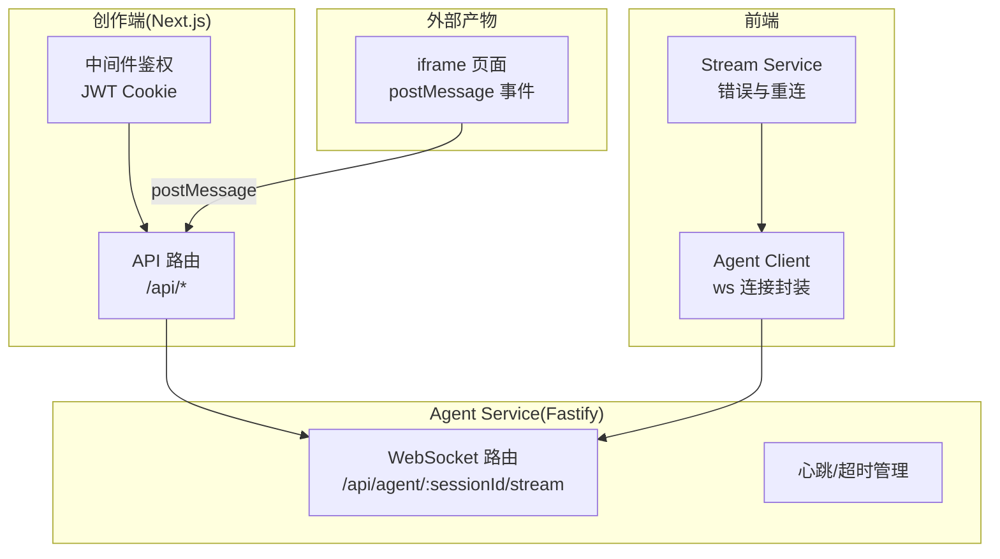
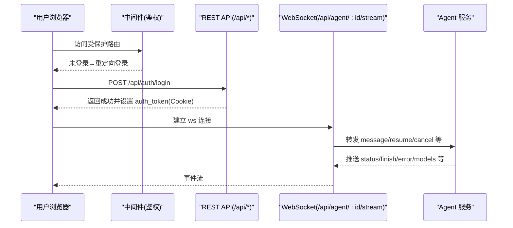
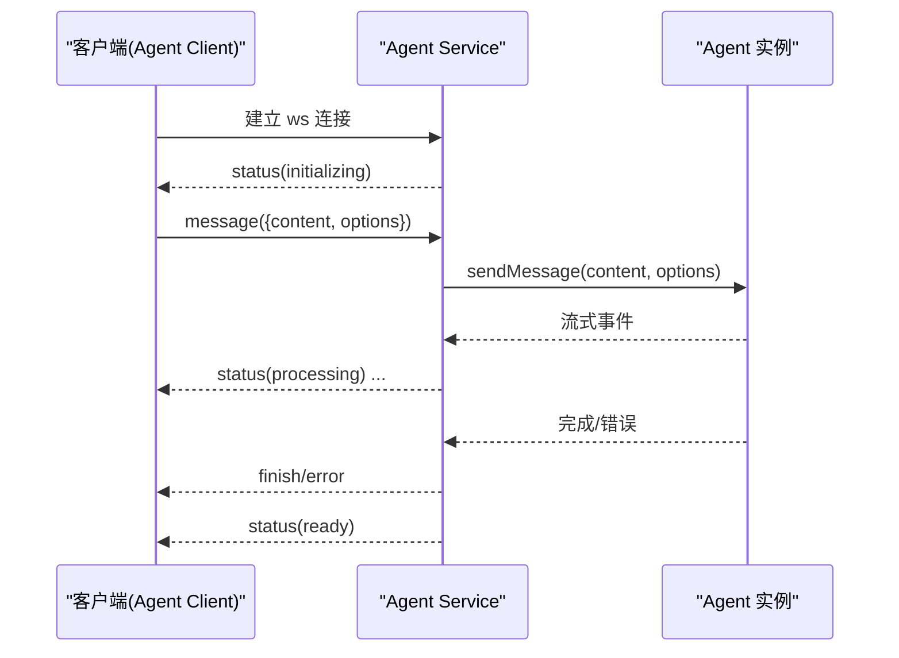
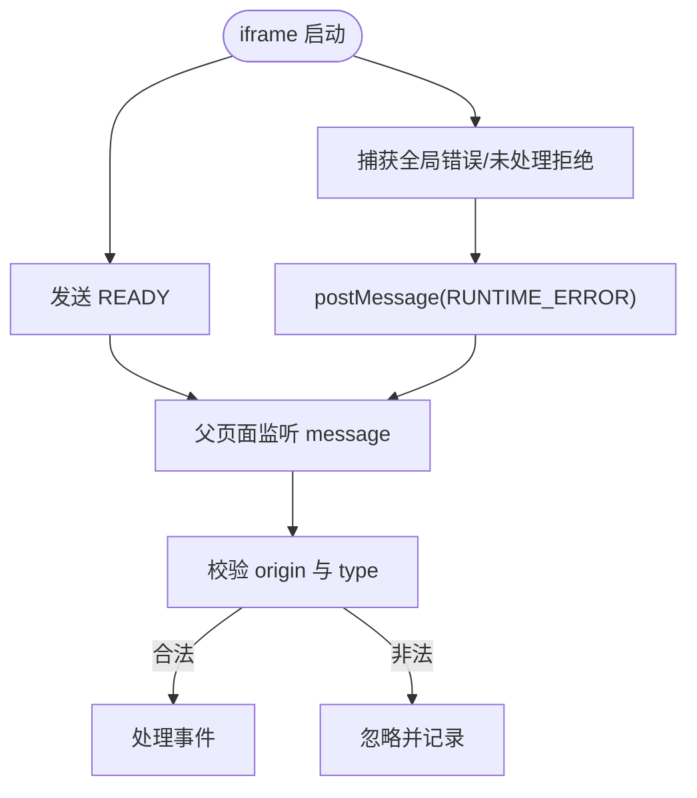
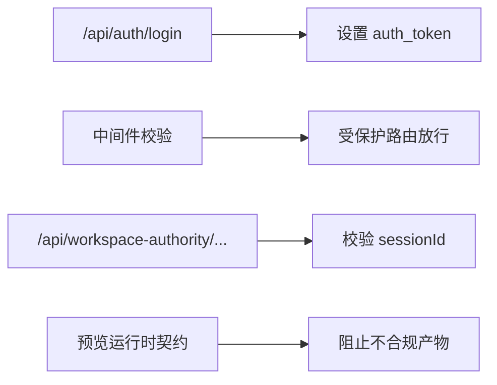

# 通信协议设计

<cite>
**本文引用的文件**   
- [路由设计.md](file://docs/项目文档/创作端/06-基础设施/技术/01_路由设计.md)
- [auth/login/route.ts](file://packages/author-site/src/app/api/auth/login/route.ts)
- [workspace-authority/[projectId]/[workspaceId]/[...segments]/route.ts](file://packages/author-site/src/app/api/workspace-authority/[projectId]/[workspaceId]/[...segments]/route.ts)
- [user/external-auth/[provider]/callback/route.ts](file://packages/author-site/src/app/api/user/external-auth/[provider]/callback/route.ts)
- [jwt.ts](file://packages/author-site/src/lib/auth/jwt.ts)
- [websocket.ts](file://packages/agent-service/src/routes/websocket.ts)
- [client.ts](file://packages/agent-client/src/client.ts)
- [stream-service.ts](file://packages/author-site/src/components/ai-elements/chat/services/stream-service.ts)
- [types.ts（共享类型）](file://packages/shared/src/types.ts)
- [runtime.ts（预览运行时契约）](file://packages/preview-contract/src/runtime.ts)
- [iframe.html（示例产物）](file://data/published/proj_1779608460378/demos/page_gwdv/iframe.html)
- [logs.ts（CLI 日志诊断）](file://OPS/CLI/src/commands/logs.ts)
- [diagnostics.ts（CLI 诊断聚合）](file://OPS/CLI/src/commands/diagnostics.ts)
</cite>

## 目录
1. [引言](#引言)
2. [项目结构](#项目结构)
3. [核心组件](#核心组件)
4. [架构总览](#架构总览)
5. [详细组件分析](#详细组件分析)
6. [依赖关系分析](#依赖关系分析)
7. [性能与可靠性](#性能与可靠性)
8. [故障排查指南](#故障排查指南)
9. [结论](#结论)
10. [附录：协议示例与客户端集成](#附录协议示例与客户端集成)

## 引言
本文件面向 Workbench 的通信协议，覆盖以下方面：
- HTTP REST API 的路由约定、请求响应格式、状态码与错误处理策略
- WebSocket 实时通信的连接建立、消息格式、事件类型与断线重连机制
- iframe 嵌入协议的 postMessage 通信规范与安全策略
- 数据序列化格式与版本兼容策略
- 协议示例与客户端集成指南
- 协议调试工具与监控方案

## 项目结构
Workbench 采用多包仓库组织，通信相关能力主要分布在：
- 创作端 Next.js API 路由（REST）
- Agent Service 的 Fastify + WebSocket 服务
- 前端客户端封装（Agent Client、Stream Service）
- 共享类型与预览运行时契约
- 运维 CLI 的诊断与日志采集

图表来源
- [路由设计.md:1-113](file://docs/项目文档/创作端/06-基础设施/技术/01_路由设计.md#L1-L113)
- [websocket.ts:134-180](file://packages/agent-service/src/routes/websocket.ts#L134-L180)
- [client.ts:380-408](file://packages/agent-client/src/client.ts#L380-L408)
- [stream-service.ts:533-557](file://packages/author-site/src/components/ai-elements/chat/services/stream-service.ts#L533-L557)
- [iframe.html:1216-1232](file://data/published/proj_1779608460378/demos/page_gwdv/iframe.html#L1216-L1232)

章节来源
- [路由设计.md:1-113](file://docs/项目文档/创作端/06-基础设施/技术/01_路由设计.md#L1-L113)

## 核心组件
- HTTP REST API
  - 基于 Next.js App Router 的 Route Handlers，统一 JSON 响应体与错误码
  - 鉴权通过 JWT Cookie，中间件校验后放行或重定向
- WebSocket 实时通道
  - Fastify 注册 /api/agent/:sessionId/stream，支持消息、取消、模型切换、权限/需求确认等事件
  - 内置心跳、进度心跳、显式超时控制与自动清理
- iframe 嵌入通信
  - 通过 window.postMessage 上报 READY、RUNTIME_ERROR 等事件
- 共享类型与契约
  - 统一的 ApiSuccessResponse/ApiErrorResponse、ErrorCode 枚举
  - 预览运行时契约用于页面源码/编译产物的校验与约束

章节来源
- [types.ts（共享类型）:32-86](file://packages/shared/src/types.ts#L32-L86)
- [jwt.ts:1-70](file://packages/author-site/src/lib/auth/jwt.ts#L1-L70)
- [websocket.ts:134-180](file://packages/agent-service/src/routes/websocket.ts#L134-L180)
- [runtime.ts:1-643](file://packages/preview-contract/src/runtime.ts#L1-L643)

## 架构总览
整体交互流程如下：
- 浏览器访问受保护页面时，中间件校验 auth_token（JWT），未登录则重定向到登录页
- 登录后调用 REST API 获取资源；需要 AI 能力时，前端通过 Agent Client 建立 WebSocket 长连接
- Agent Service 维护会话与 Agent 实例，按事件驱动推送 status/finish/error 等消息
- 预览产物 iframe 通过 postMessage 向父窗口发送运行期事件

图表来源
- [auth/login/route.ts:1-48](file://packages/author-site/src/app/api/auth/login/route.ts#L1-L48)
- [jwt.ts:14-56](file://packages/author-site/src/lib/auth/jwt.ts#L14-L56)
- [websocket.ts:134-180](file://packages/agent-service/src/routes/websocket.ts#L134-L180)

## 详细组件分析

### HTTP REST API 规范
- 路由约定
  - 使用 Next.js App Router 的 route.ts 文件组织，路径即路由，详见“路由设计”文档中的目录映射
- 请求/响应格式
  - Content-Type: application/json
  - 成功响应体：{ success: true, data: T }
  - 失败响应体：{ success: false, error: { code, message, details? } }
- 状态码定义
  - 200：业务成功（即使返回错误体也建议用 200，由 body.success 区分）
  - 400：参数无效/校验失败
  - 401：未授权/会话缺失
  - 403：无权限
  - 500：内部错误
- 错误处理策略
  - 统一错误码枚举与中文提示，便于前端分类展示
  - 鉴权失败、参数校验失败、资源不存在等明确语义化错误码

章节来源
- [路由设计.md:1-113](file://docs/项目文档/创作端/06-基础设施/技术/01_路由设计.md#L1-L113)
- [types.ts（共享类型）:32-86](file://packages/shared/src/types.ts#L32-L86)
- [auth/login/route.ts:1-48](file://packages/author-site/src/app/api/auth/login/route.ts#L1-L48)
- [workspace-authority/[projectId]/[workspaceId]/[...segments]/route.ts:28-47](file://packages/author-site/src/app/api/workspace-authority/[projectId]/[workspaceId]/[...segments]/route.ts#L28-L47)

#### 鉴权与中间件
- 登录成功后设置 httpOnly Cookie（auth_token），有效期 7 天
- 中间件从 Cookie 提取 Token 并验证签名与过期时间，根据路由类型决定放行或重定向
- 外部 OAuth 回调使用 HMAC 校验 state，防止 CSRF

章节来源
- [jwt.ts:14-56](file://packages/author-site/src/lib/auth/jwt.ts#L14-L56)
- [user/external-auth/[provider]/callback/route.ts:18-59](file://packages/author-site/src/app/api/user/external-auth/[provider]/callback/route.ts#L18-L59)

### WebSocket 实时通信协议
- 连接建立
  - 客户端连接 /api/agent/:sessionId/stream
  - 服务端记录连接、初始化事件路由器、启动心跳检测
- 心跳与保活
  - 服务端周期性检查 lastPing，超过阈值关闭连接
  - 客户端可发送 ping，服务端回 pong
- 消息格式（客户端→服务端）
  - type: "message" | "cancel" | "ping" | "resume" | "set_model" | "get_models" | "permission_response" | "user_choice_response" | "console_data"
  - 字段包括 id/content/sessionId/model/modelId/workingDir/projectId/demoId/images/files/systemPrompt/options/timestamp 等
- 事件格式（服务端→客户端）
  - status：包含 sessionId/status（initializing/processing/ready）
  - finish：包含 id/sessionId/content/files/metadata
  - error：包含 id/sessionId/error.code/message/retryable
  - models：当前模型列表与是否可切换
  - pong：心跳应答
- 断线重连
  - 客户端在 onerror/onclose 中触发重连逻辑，必要时先 resume 恢复会话
- 超时与取消
  - 支持显式 options.timeout，到达上限自动取消并返回 MESSAGE_TIMEOUT
  - cancel 事件立即中断当前任务

图表来源
- [websocket.ts:134-180](file://packages/agent-service/src/routes/websocket.ts#L134-L180)
- [websocket.ts:182-206](file://packages/agent-service/src/routes/websocket.ts#L182-L206)
- [websocket.ts:208-486](file://packages/agent-service/src/routes/websocket.ts#L208-L486)
- [client.ts:380-408](file://packages/agent-client/src/client.ts#L380-L408)
- [stream-service.ts:533-557](file://packages/author-site/src/components/ai-elements/chat/services/stream-service.ts#L533-L557)

章节来源
- [websocket.ts:134-180](file://packages/agent-service/src/routes/websocket.ts#L134-L180)
- [websocket.ts:182-206](file://packages/agent-service/src/routes/websocket.ts#L182-L206)
- [websocket.ts:208-486](file://packages/agent-service/src/routes/websocket.ts#L208-L486)
- [client.ts:380-408](file://packages/agent-client/src/client.ts#L380-L408)
- [stream-service.ts:533-557](file://packages/author-site/src/components/ai-elements/chat/services/stream-service.ts#L533-L557)

### iframe 嵌入协议（postMessage）
- 事件类型
  - READY：页面加载完成，通知父容器可交互
  - RUNTIME_ERROR：捕获运行时错误或未处理 Promise 拒绝
- 安全策略
  - 建议使用受限 targetOrigin 进行白名单校验
  - 仅接收已知 type 的事件，忽略未知事件
- 跨域处理
  - 父页面监听 message 事件，校验 event.origin 是否在允许域名列表
  - 对 RUNTIME_ERROR 进行告警与上报

图表来源
- [iframe.html:1216-1232](file://data/published/proj_1779608460378/demos/page_gwdv/iframe.html#L1216-L1232)

章节来源
- [iframe.html:1216-1232](file://data/published/proj_1779608460378/demos/page_gwdv/iframe.html#L1216-L1232)

### 数据序列化与版本兼容
- 统一 JSON 序列化，所有 API 请求/响应均为 JSON
- 错误体统一为 { success, error: { code, message, details? } }
- 预览运行时契约
  - 对页面源码与编译产物进行静态校验，保证依赖白名单、默认导出、模块绑定唯一性等
  - 提供规则与阶段化问题描述，便于定位与修复

章节来源
- [types.ts（共享类型）:32-86](file://packages/shared/src/types.ts#L32-L86)
- [runtime.ts:1-643](file://packages/preview-contract/src/runtime.ts#L1-L643)

## 依赖关系分析
- 鉴权链路
  - 登录接口 → 生成 JWT → 设置 Cookie → 中间件校验
- 工作区权限
  - workspace-authority 路由对 sessionId 进行强校验，结合白名单端点限制方法
- 预览运行时
  - 预览代码需满足依赖白名单与导出契约，否则阻断渲染

图表来源
- [auth/login/route.ts:1-48](file://packages/author-site/src/app/api/auth/login/route.ts#L1-L48)
- [jwt.ts:14-56](file://packages/author-site/src/lib/auth/jwt.ts#L14-L56)
- [workspace-authority/[projectId]/[workspaceId]/[...segments]/route.ts:28-47](file://packages/author-site/src/app/api/workspace-authority/[projectId]/[workspaceId]/[...segments]/route.ts#L28-L47)
- [runtime.ts:1-643](file://packages/preview-contract/src/runtime.ts#L1-L643)

章节来源
- [auth/login/route.ts:1-48](file://packages/author-site/src/app/api/auth/login/route.ts#L1-L48)
- [workspace-authority/[projectId]/[workspaceId]/[...segments]/route.ts:28-47](file://packages/author-site/src/app/api/workspace-authority/[projectId]/[workspaceId]/[...segments]/route.ts#L28-L47)
- [runtime.ts:1-643](file://packages/preview-contract/src/runtime.ts#L1-L643)

## 性能与可靠性
- WebSocket
  - 心跳间隔与超时阈值保障连接健康
  - 进度心跳避免长时间无反馈导致前端误判
  - 显式消息超时上限，避免长任务阻塞
- 鉴权
  - JWT 本地校验，减少数据库压力
- 预览
  - 静态契约校验前置，降低运行时失败概率

章节来源
- [websocket.ts:134-180](file://packages/agent-service/src/routes/websocket.ts#L134-L180)
- [websocket.ts:346-417](file://packages/agent-service/src/routes/websocket.ts#L346-L417)
- [jwt.ts:14-56](file://packages/author-site/src/lib/auth/jwt.ts#L14-L56)

## 故障排查指南
- 日志采集
  - CLI 支持按级别、模式、会话 ID 过滤日志，输出结构化结果
- 诊断聚合
  - 合并 SQLite/JSONL 事件，统计性能分位与关键事件流
- 常见问题
  - WebSocket 连接失败：检查 Agent Service 是否运行、网络可达性与鉴权
  - 预览空白：检查运行时契约校验错误信息并按 instruction 修复

章节来源
- [logs.ts:46-263](file://OPS/CLI/src/commands/logs.ts#L46-L263)
- [diagnostics.ts:639-766](file://OPS/CLI/src/commands/diagnostics.ts#L639-L766)

## 结论
Workbench 的通信体系以 REST 为基础、WebSocket 为实时通道、iframe postMessage 为嵌入桥接，配合统一的错误体与鉴权机制，形成稳定可扩展的协议栈。通过严格的预览运行时契约与完善的诊断工具，可有效提升开发与排障效率。

## 附录：协议示例与客户端集成

### HTTP 示例
- 登录
  - 请求：POST /api/auth/login，body: { username, password }
  - 响应：{ success: true, data: { user } } 或 { success: false, error: { code, message } }
- 工作区权限代理
  - 请求：GET/POST /api/workspace-authority/:projectId/:workspaceId/:segments?sessionId=...
  - 校验：sessionId 必须存在且端点在白名单内

章节来源
- [auth/login/route.ts:1-48](file://packages/author-site/src/app/api/auth/login/route.ts#L1-L48)
- [workspace-authority/[projectId]/[workspaceId]/[...segments]/route.ts:28-47](file://packages/author-site/src/app/api/workspace-authority/[projectId]/[workspaceId]/[...segments]/route.ts#L28-L47)

### WebSocket 示例
- 建立连接
  - ws.connect("/api/agent/:sessionId/stream")
- 发送消息
  - { type: "message", content: "...", options: { timeout: 60000 } }
- 接收事件
  - status/finish/error/models/pong
- 重连策略
  - onerror/onclose 指数退避重试，必要时先发送 resume 恢复会话

章节来源
- [websocket.ts:134-180](file://packages/agent-service/src/routes/websocket.ts#L134-L180)
- [client.ts:380-408](file://packages/agent-client/src/client.ts#L380-L408)
- [stream-service.ts:533-557](file://packages/author-site/src/components/ai-elements/chat/services/stream-service.ts#L533-L557)

### iframe 示例
- 父页面监听
  - window.addEventListener("message", handler)
  - 校验 event.origin 与 event.data.type ∈ {"READY","RUNTIME_ERROR"}
- 子页面行为
  - 加载完成后发送 READY
  - 捕获全局错误与 unhandledrejection，发送 RUNTIME_ERROR

章节来源
- [iframe.html:1216-1232](file://data/published/proj_1779608460378/demos/page_gwdv/iframe.html#L1216-L1232)