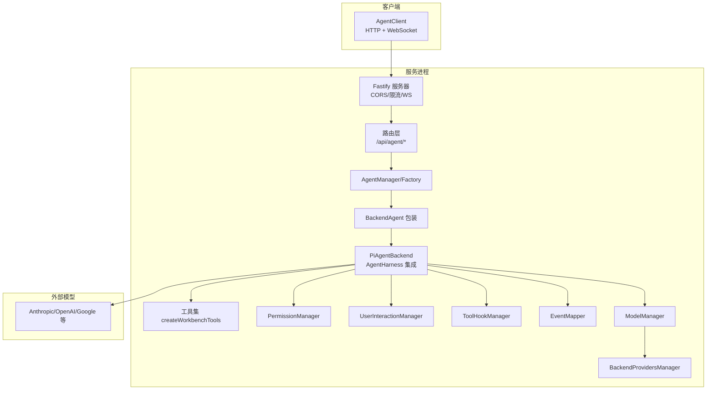
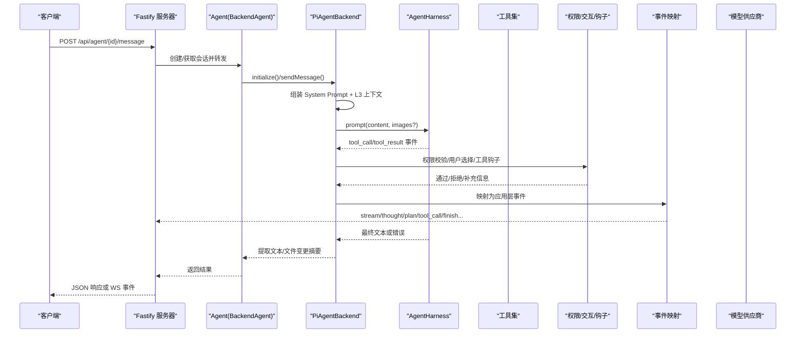
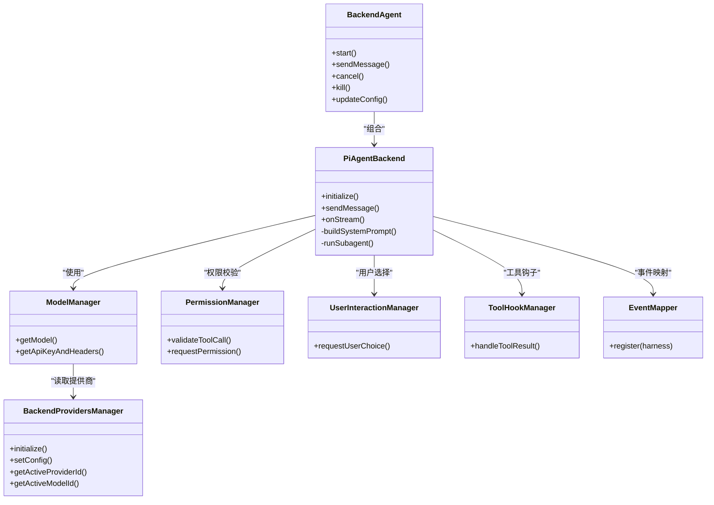
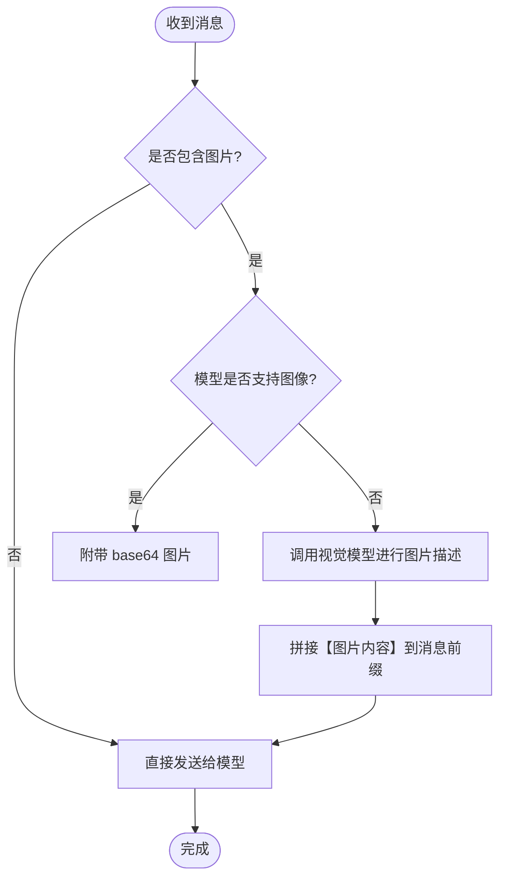
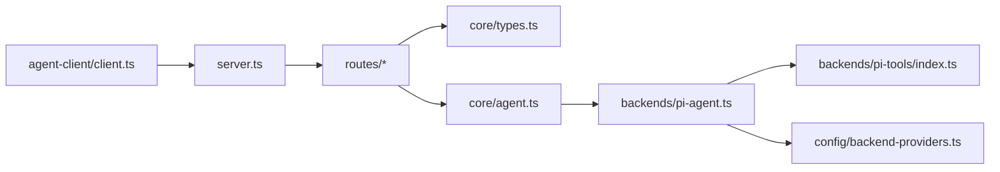

# AI 辅助编码

<cite>
**本文引用的文件**   
- [packages/agent-service/src/server.ts](file://packages/agent-service/src/server.ts)
- [packages/agent-service/src/core/types.ts](file://packages/agent-service/src/core/types.ts)
- [packages/agent-service/src/core/agent.ts](file://packages/agent-service/src/core/agent.ts)
- [packages/agent-service/src/backends/pi-agent.ts](file://packages/agent-service/src/backends/pi-agent.ts)
- [packages/agent-service/src/config/backend-providers.ts](file://packages/agent-service/src/config/backend-providers.ts)
- [packages/agent-service/src/backends/pi-tools/index.ts](file://packages/agent-service/src/backends/pi-tools/index.ts)
- [packages/agent-client/src/client.ts](file://packages/agent-client/src/client.ts)
- [docs/项目文档/创作端/05-AI对话/技术/03_AI行为约束机制.md](file://docs/项目文档/创作端/05-AI对话/技术/03_AI行为约束机制.md)
- [docs/项目文档/figma插件/技术/代码生成引擎.md](file://docs/项目文档/figma插件/技术/代码生成引擎.md)
</cite>

## 目录
1. [简介](#简介)
2. [项目结构](#项目结构)
3. [核心组件](#核心组件)
4. [架构总览](#架构总览)
5. [详细组件分析](#详细组件分析)
6. [依赖关系分析](#依赖关系分析)
7. [性能与可扩展性](#性能与可扩展性)
8. [故障排查指南](#故障排查指南)
9. [结论](#结论)
10. [附录：配置与最佳实践](#附录配置与最佳实践)

## 简介
本技术文档围绕“AI 辅助编码”能力，系统性阐述自然语言指令处理、代码生成与工具执行、智能提示与错误修复、以及 Agent 后端的插件化模型集成。内容覆盖从客户端到服务端、从系统提示到工具链、从权限控制到运行期事件的全链路实现，并提供配置示例与最佳实践，帮助读者快速理解并高效使用该系统。

## 项目结构
本项目采用多包工作区组织，AI 辅助编码的核心位于 agent-service（后端）与 agent-client（前端 SDK），并通过路由层暴露 HTTP/WebSocket 接口；同时包含工具集、权限与模型供应商管理等子系统。

图示来源
- [packages/agent-service/src/server.ts:33-111](file://packages/agent-service/src/server.ts#L33-L111)
- [packages/agent-service/src/backends/pi-agent.ts:112-245](file://packages/agent-service/src/backends/pi-agent.ts#L112-L245)
- [packages/agent-service/src/backends/pi-tools/index.ts:69-136](file://packages/agent-service/src/backends/pi-tools/index.ts#L69-L136)
- [packages/agent-service/src/config/backend-providers.ts:18-188](file://packages/agent-service/src/config/backend-providers.ts#L18-L188)

章节来源
- [packages/agent-service/src/server.ts:33-111](file://packages/agent-service/src/server.ts#L33-L111)
- [packages/agent-service/src/backends/pi-agent.ts:112-245](file://packages/agent-service/src/backends/pi-agent.ts#L112-L245)
- [packages/agent-service/src/backends/pi-tools/index.ts:69-136](file://packages/agent-service/src/backends/pi-tools/index.ts#L69-L136)
- [packages/agent-service/src/config/backend-providers.ts:18-188](file://packages/agent-service/src/config/backend-providers.ts#L18-L188)

## 核心组件
- 服务器与生命周期管理：基于 Fastify 启动，注册 CORS、限流、WebSocket，初始化后端供应商管理器与工作区权限恢复，提供健康检查与优雅关闭。
- Agent 抽象与状态机：BaseAgent 定义会话、状态、事件与生命周期方法，统一对外暴露 sendMessage/cancel/kill/updateConfig 等能力。
- PiAgent 后端：封装 AgentHarness，注入工具集、权限校验、用户交互、事件映射、图片描述与子 Agent 运行器，负责消息发送与结果提取。
- 工具集：按模式动态装配读写文件、Bash、截图、知识库、页面管理、计划审批、用户选择、Web 搜索/读取、Figma/Dingtalk 等工具。
- 模型供应商管理：支持 .env 与运行时推送的提供商列表，解析激活提供商与默认模型，供 ModelManager 使用。
- 客户端 SDK：提供 REST 与 WebSocket 双通道，封装消息发送、会话管理、文件变更、回滚、工作区操作与工具能力查询。

章节来源
- [packages/agent-service/src/server.ts:33-111](file://packages/agent-service/src/server.ts#L33-L111)
- [packages/agent-service/src/core/agent.ts:22-137](file://packages/agent-service/src/core/agent.ts#L22-L137)
- [packages/agent-service/src/backends/pi-agent.ts:112-245](file://packages/agent-service/src/backends/pi-agent.ts#L112-L245)
- [packages/agent-service/src/backends/pi-tools/index.ts:69-136](file://packages/agent-service/src/backends/pi-tools/index.ts#L69-L136)
- [packages/agent-service/src/config/backend-providers.ts:18-188](file://packages/agent-service/src/config/backend-providers.ts#L18-L188)
- [packages/agent-client/src/client.ts:20-204](file://packages/agent-client/src/client.ts#L20-L204)

## 架构总览
下图展示一次“发送消息 → 构建上下文 → 调用模型 → 工具执行 → 事件回传 → 返回结果”的端到端流程。

图示来源
- [packages/agent-service/src/server.ts:33-111](file://packages/agent-service/src/server.ts#L33-L111)
- [packages/agent-service/src/backends/pi-agent.ts:614-758](file://packages/agent-service/src/backends/pi-agent.ts#L614-L758)
- [packages/agent-service/src/backends/pi-tools/index.ts:69-136](file://packages/agent-service/src/backends/pi-tools/index.ts#L69-L136)
- [packages/agent-client/src/client.ts:200-409](file://packages/agent-client/src/client.ts#L200-L409)

## 详细组件分析

### 自然语言指令处理机制
- 输入解析与上下文拼接
  - 上传文件清单与会话历史附件会被格式化并前置到用户消息前，明确 attachmentId 与来源，避免模型猜测。
  - 若模型不支持图像，则触发视觉模型对图片进行预描述，并将描述文本插入到消息中。
- 意图识别与计划
  - 通过系统提示词与内置技能模板引导模型输出结构化计划与步骤，结合计划工具与审批工具形成可追踪的执行路径。
- 动态上下文注入
  - L3 层在 user message 前注入工作空间页面清单、源码片段（受大小限制）、知识库索引等，增强模型对当前项目的理解。

章节来源
- [packages/agent-service/src/backends/pi-agent.ts:73-110](file://packages/agent-service/src/backends/pi-agent.ts#L73-L110)
- [packages/agent-service/src/backends/pi-agent.ts:614-758](file://packages/agent-service/src/backends/pi-agent.ts#L614-L758)
- [docs/项目文档/创作端/05-AI对话/技术/03_AI行为约束机制.md:44-89](file://docs/项目文档/创作端/05-AI对话/技术/03_AI行为约束机制.md#L44-L89)

### 代码生成引擎工作原理
- 模板匹配与提示工程
  - 静态 System Prompt（L2）与记忆（L4）由模板驱动，保证缓存命中与一致性；动态上下文（L3）按需注入。
  - 预安装技能以 Markdown 形式注入，指导模型遵循领域规范与约定。
- AST 操作与代码合成
  - 针对 Figma 导出场景，存在 HTML 与 Tailwind/React 双引擎：前者生成纯 HTML/CSS，后者生成 JSX+Tailwind，并在生成时自动推导 Props 元数据，便于工作台配置面板编译。
- 质量保障
  - 写入关键页面文件后会立即执行同源 preview contract 校验，失败不自动回滚但会反馈给模型继续修复，直至通过。

章节来源
- [docs/项目文档/创作端/05-AI对话/技术/03_AI行为约束机制.md:44-89](file://docs/项目文档/创作端/05-AI对话/技术/03_AI行为约束机制.md#L44-L89)
- [docs/项目文档/figma插件/技术/代码生成引擎.md:50-132](file://docs/项目文档/figma插件/技术/代码生成引擎.md#L50-L132)

### 智能提示系统（补全/检测/重构建议）
- 错误检测与修复建议
  - 前端错误映射将诊断信息汇总为“问题摘要 + 逐条详情 + 修复建议”，并标记是否可一键修复，驱动 AI 进行自动化修正。
- 重构建议
  - 通过工具链（如编辑/重写文件、Schema 校验、预览验证）与事件流，向模型反馈修改效果与约束，促使模型迭代优化。

章节来源
- [packages/author-site/lib/error-mapper.ts:37-53](file://packages/author-site/lib/error-mapper.ts#L37-L53)

### Agent 后端与插件架构（多模型提供商）
- 后端适配器
  - BackendAgent 作为统一包装，内部持有具体后端实例（如 PiAgentBackend），屏蔽差异。
- 插件式工具集
  - createWorkbenchTools 根据模式与开关动态装配工具，包括文件、Bash、截图、知识库、页面管理、计划审批、用户选择、Web 搜索/读取、Figma/Dingtalk 等，支持只读模式与子 Agent 委派。
- 多模型提供商
  - BackendProvidersManager 支持 .env 与运行时推送两种来源，解析激活提供商与默认模型；ModelManager 据此构造模型参数与鉴权头。
- 事件与权限
  - ToolHookManager 捕获工具调用与结果，PermissionManager 做白/黑名单与敏感操作拦截，UserInteractionManager 处理用户选择请求，EventMapper 将底层事件映射为应用层事件。

图示来源
- [packages/agent-service/src/core/agent.ts:22-137](file://packages/agent-service/src/core/agent.ts#L22-L137)
- [packages/agent-service/src/backends/pi-agent.ts:112-245](file://packages/agent-service/src/backends/pi-agent.ts#L112-L245)
- [packages/agent-service/src/config/backend-providers.ts:18-188](file://packages/agent-service/src/config/backend-providers.ts#L18-L188)
- [packages/agent-service/src/backends/pi-tools/index.ts:69-136](file://packages/agent-service/src/backends/pi-tools/index.ts#L69-L136)

章节来源
- [packages/agent-service/src/core/agent.ts:22-137](file://packages/agent-service/src/core/agent.ts#L22-L137)
- [packages/agent-service/src/backends/pi-agent.ts:112-245](file://packages/agent-service/src/backends/pi-agent.ts#L112-L245)
- [packages/agent-service/src/config/backend-providers.ts:18-188](file://packages/agent-service/src/config/backend-providers.ts#L18-L188)
- [packages/agent-service/src/backends/pi-tools/index.ts:69-136](file://packages/agent-service/src/backends/pi-tools/index.ts#L69-L136)

### 关键流程图：非视觉模型的图片预处理

图示来源
- [packages/agent-service/src/backends/pi-agent.ts:614-758](file://packages/agent-service/src/backends/pi-agent.ts#L614-L758)

## 依赖关系分析
- 模块耦合
  - server.ts 仅负责基础设施与路由注册，业务逻辑下沉至 Agent/Backend 层，保持清晰边界。
  - PiAgentBackend 聚合多个管理器（权限、交互、钩子、事件映射、模型），职责内聚且通过回调解耦。
- 外部依赖
  - 模型供应商通过 BackendProvidersManager 统一管理，支持热更新；AgentHarness 通过 getApiKeyAndHeaders 获取鉴权信息，避免硬编码。
- 潜在循环
  - 类型定义集中在 core/types.ts，避免跨模块循环引用；权限配置通过 type alias 复用，降低耦合。

图示来源
- [packages/agent-service/src/server.ts:33-111](file://packages/agent-service/src/server.ts#L33-L111)
- [packages/agent-service/src/core/types.ts:1-325](file://packages/agent-service/src/core/types.ts#L1-L325)
- [packages/agent-service/src/core/agent.ts:22-137](file://packages/agent-service/src/core/agent.ts#L22-L137)
- [packages/agent-service/src/backends/pi-agent.ts:112-245](file://packages/agent-service/src/backends/pi-agent.ts#L112-L245)
- [packages/agent-service/src/backends/pi-tools/index.ts:69-136](file://packages/agent-service/src/backends/pi-tools/index.ts#L69-L136)
- [packages/agent-service/src/config/backend-providers.ts:18-188](file://packages/agent-service/src/config/backend-providers.ts#L18-L188)
- [packages/agent-client/src/client.ts:20-204](file://packages/agent-client/src/client.ts#L20-L204)

章节来源
- [packages/agent-service/src/core/types.ts:1-325](file://packages/agent-service/src/core/types.ts#L1-L325)
- [packages/agent-service/src/server.ts:33-111](file://packages/agent-service/src/server.ts#L33-L111)

## 性能与可扩展性
- 提示词缓存
  - 静态 System Prompt（L2）与记忆（L4）不变，利于 LLM API 侧缓存命中，减少首字延迟。
- 动态上下文裁剪
  - L3 注入受页面数量与大小限制，避免超长上下文导致超时与成本上升。
- 工具执行与权限
  - 工具调用走白/黑名单与 beforeToolCall 拦截，减少无效 I/O 与危险操作。
- 并发与资源
  - 子 Agent 具备超时与 AbortSignal 控制，避免长时间占用资源；主 Agent 与子 Agent 环境隔离，降低相互影响。
- 扩展点
  - 工具集可按需启用/禁用；新增模型提供商仅需在 BackendProvidersManager 中声明，无需改动核心流程。

[本节为通用指导，不直接分析具体文件]

## 故障排查指南
- 常见问题定位
  - 模型不可用：检查 BackendProvidersManager 的提供商与模型配置是否正确加载，确认 activeProviderId/activeModelId。
  - 图片无法理解：确认视觉模型可用且已配置；否则将抛出“需要配置识图模型”的错误。
  - 空响应：当模型未返回可提取文本且无工具结果/文件变更时，会抛出“空内容”错误，需检查模型配置与日志。
  - 权限拒绝：查看 permission_request 事件与工具调用记录，确认白名单策略与审批流程。
- 诊断手段
  - 使用 /health 检查服务状态与活跃 Agent 数。
  - 通过 WebSocket 订阅 stream/thought/tool_call/error/finish 等事件，定位卡点。
  - 查看工具钩子记录的 files 变更与 details.runtimeValidation 结果，辅助修复。

章节来源
- [packages/agent-service/src/server.ts:89-99](file://packages/agent-service/src/server.ts#L89-L99)
- [packages/agent-service/src/backends/pi-agent.ts:614-758](file://packages/agent-service/src/backends/pi-agent.ts#L614-L758)
- [packages/agent-service/src/config/backend-providers.ts:18-188](file://packages/agent-service/src/config/backend-providers.ts#L18-L188)

## 结论
本系统通过“静态提示 + 动态上下文 + 强约束工具链 + 多模型提供商”的组合，实现了高可靠、可审计、可扩展的 AI 辅助编码能力。其分层防护与事件化设计既保障了安全性与可控性，又保留了足够的灵活性以适配不同业务场景与模型生态。

[本节为总结性内容，不直接分析具体文件]

## 附录：配置与最佳实践

### 配置要点
- 环境变量
  - PI_AGENT_PROVIDERS：JSON 数组，声明提供商与模型列表，支持默认模型与启用标志。
  - PI_AGENT_PROVIDER / PI_AGENT_MODEL：指定激活提供商与模型（可选）。
  - CORS_ORIGINS：允许的前端来源，逗号分隔。
- 运行时推送
  - author-site 可通过内部接口推送最新提供商配置，agent-service 接收后热更新。

章节来源
- [packages/agent-service/src/config/backend-providers.ts:28-94](file://packages/agent-service/src/config/backend-providers.ts#L28-L94)
- [packages/agent-service/src/server.ts:46-66](file://packages/agent-service/src/server.ts#L46-L66)

### 提示词工程建议
- 将全局规则与约定放入 L2 静态提示，确保缓存命中与一致性。
- 将项目级偏好与历史决策放入 L4 记忆，跨会话持久化。
- 将工作空间清单、源码片段与知识索引放入 L3 动态上下文，按需裁剪长度。

章节来源
- [docs/项目文档/创作端/05-AI对话/技术/03_AI行为约束机制.md:44-89](file://docs/项目文档/创作端/05-AI对话/技术/03_AI行为约束机制.md#L44-L89)

### 模型选择与切换
- 优先使用 BackendProvidersManager 提供的 getActiveModelId 与 getProviderModels，避免直连 pi-ai 导致的自定义 provider 识别问题。
- 在客户端通过 options.model 或 headers 传递模型标识，实现会话级切换。

章节来源
- [packages/agent-service/src/config/backend-providers.ts:149-177](file://packages/agent-service/src/config/backend-providers.ts#L149-L177)
- [packages/agent-client/src/client.ts:54-83](file://packages/agent-client/src/client.ts#L54-L83)

### 性能优化
- 合理设置子 Agent 超时与思考级别，避免长耗时任务阻塞。
- 控制 L3 上下文大小，必要时分步对话，逐步引入更多上下文。
- 利用工具只读模式与最小化工具集，降低 I/O 与权限开销。

章节来源
- [packages/agent-service/src/backends/pi-agent.ts:429-612](file://packages/agent-service/src/backends/pi-agent.ts#L429-L612)
- [packages/agent-service/src/backends/pi-tools/index.ts:74-81](file://packages/agent-service/src/backends/pi-tools/index.ts#L74-L81)

### 实战案例（说明性）
- 简单任务：在现有页面添加一个按钮并绑定点击事件。模型通过 read/write/edit 工具修改文件，随后触发预览校验，失败则继续修复直至通过。
- 中等任务：从 Figma 导入页面，自动生成 React/Tailwind 组件与 Props 元数据，工作台编译配置面板，AI 根据 Schema 校验结果微调样式与布局。
- 复杂任务：跨多个页面进行批量删除与重构，先提交删除计划，经审批通过后执行；期间持续通过工具钩子与事件流反馈进度与风险。

[本节为概念性说明，不直接分析具体文件]