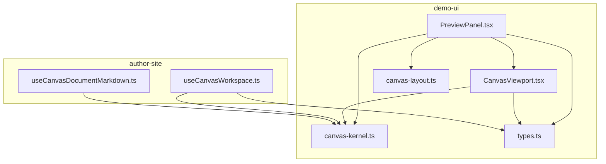
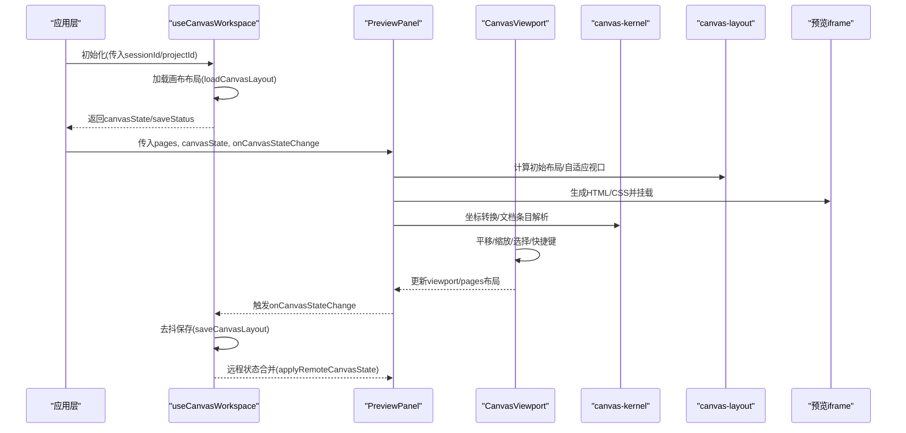
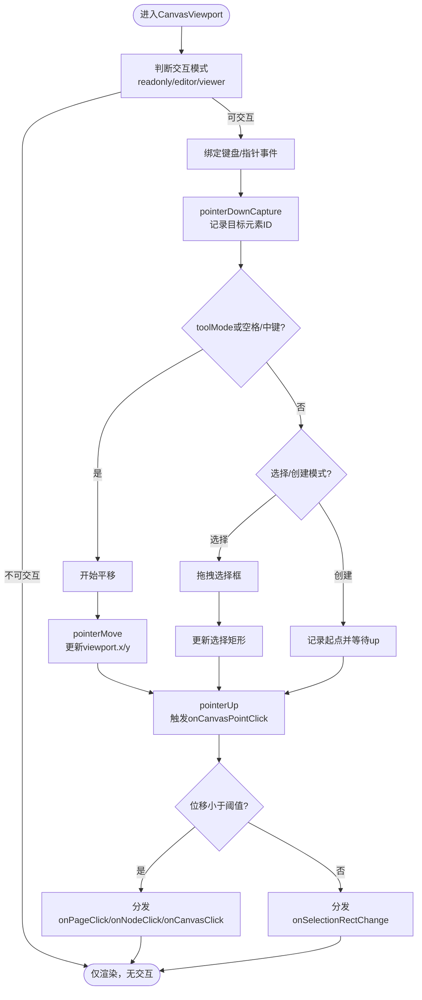
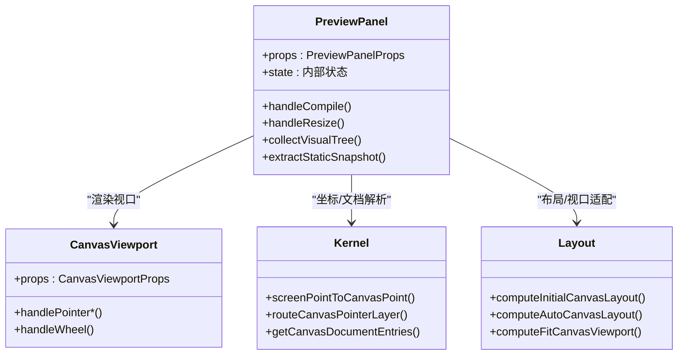
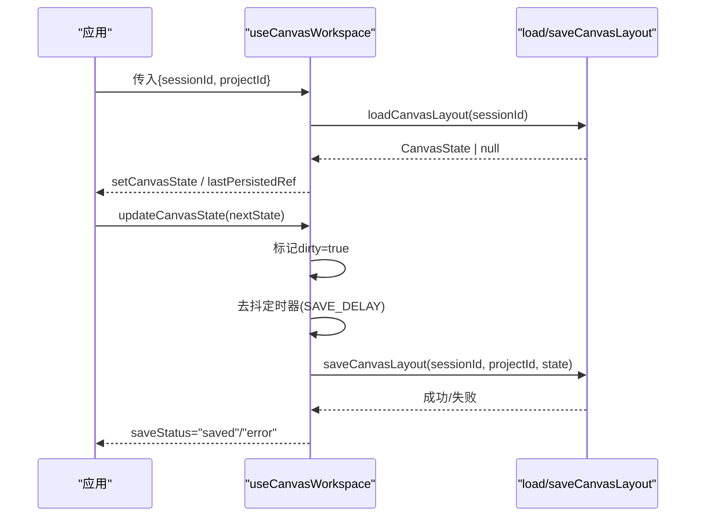
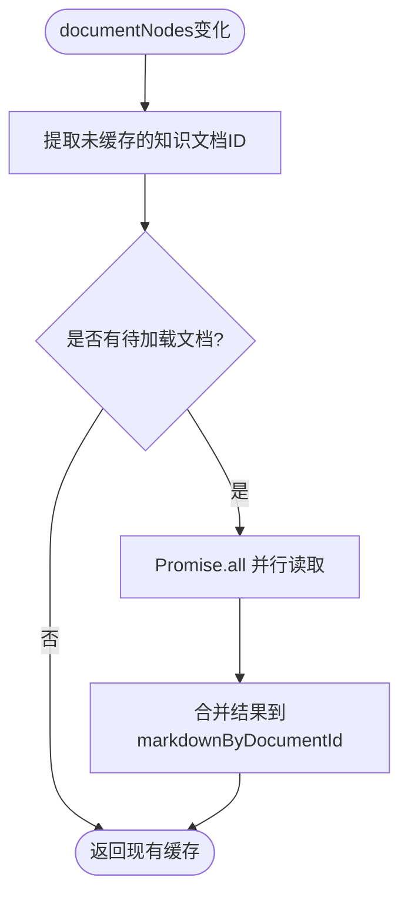
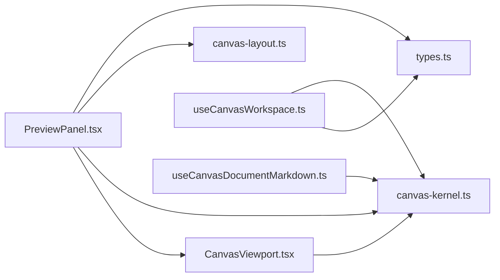

# React组件封装

<cite>
**本文引用的文件**   
- [CanvasViewport.tsx](file://packages/demo-ui/src/CanvasViewport.tsx)
- [PreviewPanel.tsx](file://packages/demo-ui/src/PreviewPanel.tsx)
- [canvas-kernel.ts](file://packages/demo-ui/src/canvas-kernel.ts)
- [canvas-layout.ts](file://packages/demo-ui/src/canvas-layout.ts)
- [types.ts](file://packages/demo-ui/src/types.ts)
- [useCanvasWorkspace.ts](file://packages/author-site/src/components/demo/useCanvasWorkspace.ts)
- [useCanvasDocumentMarkdown.ts](file://packages/demo-ui/src/useCanvasDocumentMarkdown.ts)
</cite>

## 目录
1. [简介](#简介)
2. [项目结构](#项目结构)
3. [核心组件与能力](#核心组件与能力)
4. [架构总览](#架构总览)
5. [详细组件分析](#详细组件分析)
6. [依赖关系分析](#依赖关系分析)
7. [性能与交互优化](#性能与交互优化)
8. [故障排查指南](#故障排查指南)
9. [结论](#结论)
10. [附录：使用示例与最佳实践](#附录使用示例与最佳实践)

## 简介
本文件面向在项目中集成“React组件封装层”的开发者，聚焦于画布（Canvas）相关的能力与用法。内容覆盖：
- Canvas 组件的属性配置：尺寸、样式、事件绑定
- useCanvas Hook 的使用方式：获取画布实例、状态监听、操作调用
- 生命周期钩子：onMount、onUnmount、onUpdate 的处理机制
- 属性面板集成：表单控件绑定与数据同步
- 完整使用示例：基础用法、高级配置、自定义扩展

## 项目结构
仓库中与画布相关的核心代码位于 demo-ui 与 author-site 两个包中：
- demo-ui：提供预览面板、画布视口、布局计算、内核工具函数与类型定义
- author-site：提供工作区级 Hook，负责加载/保存画布布局、状态持久化与并发控制

图示来源
- [PreviewPanel.tsx:1-200](file://packages/demo-ui/src/PreviewPanel.tsx#L1-L200)
- [CanvasViewport.tsx:1-120](file://packages/demo-ui/src/CanvasViewport.tsx#L1-L120)
- [canvas-kernel.ts:1-120](file://packages/demo-ui/src/canvas-kernel.ts#L1-L120)
- [canvas-layout.ts:1-120](file://packages/demo-ui/src/canvas-layout.ts#L1-L120)
- [types.ts:1-120](file://packages/demo-ui/src/types.ts#L1-L120)
- [useCanvasWorkspace.ts:1-120](file://packages/author-site/src/components/demo/useCanvasWorkspace.ts#L1-L120)
- [useCanvasDocumentMarkdown.ts:1-74](file://packages/demo-ui/src/useCanvasDocumentMarkdown.ts#L1-L74)

章节来源
- [PreviewPanel.tsx:1-200](file://packages/demo-ui/src/PreviewPanel.tsx#L1-L200)
- [CanvasViewport.tsx:1-120](file://packages/demo-ui/src/CanvasViewport.tsx#L1-L120)
- [canvas-kernel.ts:1-120](file://packages/demo-ui/src/canvas-kernel.ts#L1-L120)
- [canvas-layout.ts:1-120](file://packages/demo-ui/src/canvas-layout.ts#L1-L120)
- [types.ts:1-120](file://packages/demo-ui/src/types.ts#L1-L120)
- [useCanvasWorkspace.ts:1-120](file://packages/author-site/src/components/demo/useCanvasWorkspace.ts#L1-L120)
- [useCanvasDocumentMarkdown.ts:1-74](file://packages/demo-ui/src/useCanvasDocumentMarkdown.ts#L1-L74)

## 核心组件与能力
- PreviewPanel：预览容器，负责编译、渲染、可视化编辑、静态快照等；通过 props 暴露大量回调以对接上层业务逻辑
- CanvasViewport：画布视口，处理平移、缩放、选择框、快捷键、对齐辅助线等交互
- canvas-kernel：画布坐标转换、指针路由、文档条目解析、文本节点摘要等通用算法
- canvas-layout：页面尺寸解析、初始布局、自动布局、视口适配等布局算法
- types：统一的类型定义，包括预览面板、画布状态、自由节点、图层等
- useCanvasWorkspace：工作区级 Hook，负责画布状态的加载、增量保存、去抖、错误状态管理
- useCanvasDocumentMarkdown：根据文档节点异步读取知识文档并缓存 Markdown 内容

章节来源
- [PreviewPanel.tsx:1-200](file://packages/demo-ui/src/PreviewPanel.tsx#L1-L200)
- [CanvasViewport.tsx:1-120](file://packages/demo-ui/src/CanvasViewport.tsx#L1-L120)
- [canvas-kernel.ts:1-120](file://packages/demo-ui/src/canvas-kernel.ts#L1-L120)
- [canvas-layout.ts:1-120](file://packages/demo-ui/src/canvas-layout.ts#L1-L120)
- [types.ts:1-120](file://packages/demo-ui/src/types.ts#L1-L120)
- [useCanvasWorkspace.ts:1-120](file://packages/author-site/src/components/demo/useCanvasWorkspace.ts#L1-L120)
- [useCanvasDocumentMarkdown.ts:1-74](file://packages/demo-ui/src/useCanvasDocumentMarkdown.ts#L1-L74)

## 架构总览
下图展示了从应用到预览 iframe 的数据流与交互路径，以及画布状态在作者端与工作区的流转。

图示来源
- [PreviewPanel.tsx:1128-1181](file://packages/demo-ui/src/PreviewPanel.tsx#L1128-L1181)
- [CanvasViewport.tsx:174-281](file://packages/demo-ui/src/CanvasViewport.tsx#L174-L281)
- [canvas-kernel.ts:33-81](file://packages/demo-ui/src/canvas-kernel.ts#L33-L81)
- [canvas-layout.ts:190-218](file://packages/demo-ui/src/canvas-layout.ts#L190-L218)
- [useCanvasWorkspace.ts:67-151](file://packages/author-site/src/components/demo/useCanvasWorkspace.ts#L67-L151)

## 详细组件分析

### CanvasViewport 组件
职责
- 统一处理画布的平移、缩放、选择框、快捷键、光标样式
- 将屏幕坐标转换为画布坐标，支持创建模式下的点选
- 输出对齐辅助线与选择区域

关键属性
- viewport/onViewportChange：视图变换状态与回调
- editable/interactionMode：是否可编辑及交互模式
- toolMode：hand/select/text/image
- alignmentGuides：对齐辅助线
- creationMode：创建模式（text/image）
- onCanvasClick/onPageClick/onNodeClick：点击事件
- onSelectionRectChange：选择矩形变化
- onCanvasPointClick：画布点选回调

交互流程

图示来源
- [CanvasViewport.tsx:284-456](file://packages/demo-ui/src/CanvasViewport.tsx#L284-L456)
- [CanvasViewport.tsx:174-281](file://packages/demo-ui/src/CanvasViewport.tsx#L174-L281)

章节来源
- [CanvasViewport.tsx:1-120](file://packages/demo-ui/src/CanvasViewport.tsx#L1-L120)
- [CanvasViewport.tsx:174-281](file://packages/demo-ui/src/CanvasViewport.tsx#L174-L281)
- [CanvasViewport.tsx:284-456](file://packages/demo-ui/src/CanvasViewport.tsx#L284-L456)
- [CanvasViewport.tsx:458-501](file://packages/demo-ui/src/CanvasViewport.tsx#L458-L501)

### PreviewPanel 组件
职责
- 管理预览生命周期：编译、注入、尺寸测量、滚动条隐藏、静态快照
- 可视化编辑：收集节点树、属性变更、注释、内联编辑
- 与父级通信：console日志、应用动作、内容高度变化、可见页变化

关键属性（节选）
- code/sessionId/demoId/compiledJsUrl/cssImports：预览源与资源
- previewSize/fillContainer/containerSizeOverride：尺寸策略
- visualEditMode/visualHoverNodeId/selectedVisualNodeId/hiddenVisualNodeIds：可视化编辑状态
- onVisualNodeTreeChange/onStaticPrototypeSnapshot：节点树与静态快照回调
- onConsoleEntry/onAppAction/onContentHeightChange：运行时事件

图示来源
- [PreviewPanel.tsx:1-200](file://packages/demo-ui/src/PreviewPanel.tsx#L1-L200)
- [PreviewPanel.tsx:1128-1181](file://packages/demo-ui/src/PreviewPanel.tsx#L1128-L1181)
- [canvas-kernel.ts:33-112](file://packages/demo-ui/src/canvas-kernel.ts#L33-L112)
- [canvas-layout.ts:190-218](file://packages/demo-ui/src/canvas-layout.ts#L190-L218)

章节来源
- [PreviewPanel.tsx:1-200](file://packages/demo-ui/src/PreviewPanel.tsx#L1-L200)
- [PreviewPanel.tsx:1128-1181](file://packages/demo-ui/src/PreviewPanel.tsx#L1128-L1181)

### useCanvasWorkspace Hook
职责
- 加载/保存画布布局，维护 saveStatus/saveError/hasUnsavedCanvasChanges
- 对 canvasState 进行去抖持久化，避免频繁写入
- 提供 flushCanvasState 强制落盘、applyRemoteCanvasState 合并远端状态

典型流程

图示来源
- [useCanvasWorkspace.ts:67-151](file://packages/author-site/src/components/demo/useCanvasWorkspace.ts#L67-L151)
- [useCanvasWorkspace.ts:153-186](file://packages/author-site/src/components/demo/useCanvasWorkspace.ts#L153-L186)

章节来源
- [useCanvasWorkspace.ts:1-120](file://packages/author-site/src/components/demo/useCanvasWorkspace.ts#L1-L120)
- [useCanvasWorkspace.ts:153-186](file://packages/author-site/src/components/demo/useCanvasWorkspace.ts#L153-L186)

### useCanvasDocumentMarkdown Hook
职责
- 遍历文档节点，提取知识文档引用
- 并行读取 Markdown 内容并缓存，避免重复请求

图示来源
- [useCanvasDocumentMarkdown.ts:21-67](file://packages/demo-ui/src/useCanvasDocumentMarkdown.ts#L21-L67)

章节来源
- [useCanvasDocumentMarkdown.ts:1-74](file://packages/demo-ui/src/useCanvasDocumentMarkdown.ts#L1-L74)

### 类型与数据结构
- CanvasState：包含 pages、viewport、layers、nodes、hiddenPageIds 等
- CanvasPageLayout：单页布局（位置、尺寸、zIndex、sizeMode、previewSizeKey）
- CanvasViewportState：视图平移与缩放
- CanvasFreeNode：自由节点（document/image/text）
- PreviewPanelProps：预览面板所有输入与回调

章节来源
- [types.ts:153-215](file://packages/demo-ui/src/types.ts#L153-L215)
- [types.ts:248-324](file://packages/demo-ui/src/types.ts#L248-L324)
- [types.ts:378-414](file://packages/demo-ui/src/types.ts#L378-L414)

## 依赖关系分析
- PreviewPanel 依赖 CanvasViewport 实现画布交互
- CanvasViewport 依赖 canvas-kernel 做坐标与指针路由
- PreviewPanel 与 useCanvasWorkspace 共同维护画布状态与持久化
- useCanvasDocumentMarkdown 依赖 canvas-kernel 的文档条目解析

图示来源
- [PreviewPanel.tsx:1-200](file://packages/demo-ui/src/PreviewPanel.tsx#L1-L200)
- [CanvasViewport.tsx:1-120](file://packages/demo-ui/src/CanvasViewport.tsx#L1-L120)
- [canvas-kernel.ts:1-120](file://packages/demo-ui/src/canvas-kernel.ts#L1-L120)
- [canvas-layout.ts:1-120](file://packages/demo-ui/src/canvas-layout.ts#L1-L120)
- [types.ts:1-120](file://packages/demo-ui/src/types.ts#L1-L120)
- [useCanvasWorkspace.ts:1-120](file://packages/author-site/src/components/demo/useCanvasWorkspace.ts#L1-L120)
- [useCanvasDocumentMarkdown.ts:1-74](file://packages/demo-ui/src/useCanvasDocumentMarkdown.ts#L1-L74)

章节来源
- [PreviewPanel.tsx:1-200](file://packages/demo-ui/src/PreviewPanel.tsx#L1-L200)
- [CanvasViewport.tsx:1-120](file://packages/demo-ui/src/CanvasViewport.tsx#L1-L120)
- [canvas-kernel.ts:1-120](file://packages/demo-ui/src/canvas-kernel.ts#L1-L120)
- [canvas-layout.ts:1-120](file://packages/demo-ui/src/canvas-layout.ts#L1-L120)
- [types.ts:1-120](file://packages/demo-ui/src/types.ts#L1-L120)
- [useCanvasWorkspace.ts:1-120](file://packages/author-site/src/components/demo/useCanvasWorkspace.ts#L1-L120)
- [useCanvasDocumentMarkdown.ts:1-74](file://packages/demo-ui/src/useCanvasDocumentMarkdown.ts#L1-L74)

## 性能与交互优化
- 视口更新节流：CanvasViewport 使用 requestAnimationFrame 批量刷新，减少重排
- will-change 提示：交互期间开启 willChange: transform，提升合成层性能
- 去抖保存：useCanvasWorkspace 默认延迟保存，降低 I/O 压力
- 并行读取：useCanvasDocumentMarkdown 并行拉取多个文档内容，缩短首屏时间
- 被动监听：wheel 事件使用 passive:false 确保阻止默认行为的同时保持流畅

章节来源
- [CanvasViewport.tsx:97-118](file://packages/demo-ui/src/CanvasViewport.tsx#L97-L118)
- [CanvasViewport.tsx:493-508](file://packages/demo-ui/src/CanvasViewport.tsx#L493-L508)
- [useCanvasWorkspace.ts:110-151](file://packages/author-site/src/components/demo/useCanvasWorkspace.ts#L110-L151)
- [useCanvasDocumentMarkdown.ts:42-62](file://packages/demo-ui/src/useCanvasDocumentMarkdown.ts#L42-L62)

## 故障排查指南
- 画布布局加载失败：检查 sessionId 是否正确、网络可达性；查看 saveStatus 是否为 error 并定位 saveError 信息
- 画布布局保存失败：确认 projectId 存在且权限正确；必要时调用 flushCanvasState 强制落盘
- 预览无法显示：检查 code/compiledJsUrl 是否有效；关注 onError 回调中的诊断信息
- 静态快照为空：确认 iframe 已就绪且根节点存在；查看 onStaticPrototypeSnapshot 的错误消息

章节来源
- [useCanvasWorkspace.ts:92-101](file://packages/author-site/src/components/demo/useCanvasWorkspace.ts#L92-L101)
- [useCanvasWorkspace.ts:135-144](file://packages/author-site/src/components/demo/useCanvasWorkspace.ts#L135-L144)
- [PreviewPanel.tsx:1148-1161](file://packages/demo-ui/src/PreviewPanel.tsx#L1148-L1161)

## 结论
该封装层通过 PreviewPanel 与 CanvasViewport 的组合，提供了完整的画布交互与预览能力；配合 useCanvasWorkspace 的状态管理与持久化，形成稳定可靠的创作体验。建议在上层应用中：
- 明确区分只读/编辑模式，合理设置 interactionMode
- 利用 layout 算法与视口适配，保证多设备一致性
- 结合 useCanvasDocumentMarkdown 按需加载文档内容，提升性能
- 通过 PreviewPanel 的丰富回调，打通可视化编辑与外部系统

## 附录：使用示例与最佳实践

### 基础用法
- 在页面中引入 PreviewPanel，传入 code 或 compiledJsUrl，并设置 previewSize
- 使用 CanvasViewport 包裹页面列表，响应 onCanvasStateChange 以持久化布局
- 使用 useCanvasWorkspace 管理画布状态与保存

参考路径
- [PreviewPanel.tsx:1-200](file://packages/demo-ui/src/PreviewPanel.tsx#L1-L200)
- [CanvasViewport.tsx:1-120](file://packages/demo-ui/src/CanvasViewport.tsx#L1-L120)
- [useCanvasWorkspace.ts:1-120](file://packages/author-site/src/components/demo/useCanvasWorkspace.ts#L1-L120)

### 高级配置
- 启用可视化编辑：设置 visualEditMode 及相关节点状态，订阅 onVisualNodeTreeChange
- 静态原型快照：触发 staticPrototypeRequestKey，并在 onStaticPrototypeSnapshot 中处理结果
- 内容高度自适应：监听 onContentHeightChange，结合 resolveCanvasContentHeightLayout 调整页面高度

参考路径
- [PreviewPanel.tsx:1128-1181](file://packages/demo-ui/src/PreviewPanel.tsx#L1128-L1181)
- [canvas-layout.ts:152-188](file://packages/demo-ui/src/canvas-layout.ts#L152-L188)

### 自定义扩展
- 自定义对齐辅助线：向 CanvasViewport 传入 alignmentGuides，并根据拖拽计算 guides
- 自定义创建模式：设置 creationMode 为 text/image，并在 onCanvasPointClick 中创建对应节点
- 自定义文档内容：实现 onReadKnowledgeDocument，由 useCanvasDocumentMarkdown 并行加载

参考路径
- [CanvasViewport.tsx:557-589](file://packages/demo-ui/src/CanvasViewport.tsx#L557-L589)
- [useCanvasDocumentMarkdown.ts:21-67](file://packages/demo-ui/src/useCanvasDocumentMarkdown.ts#L21-L67)