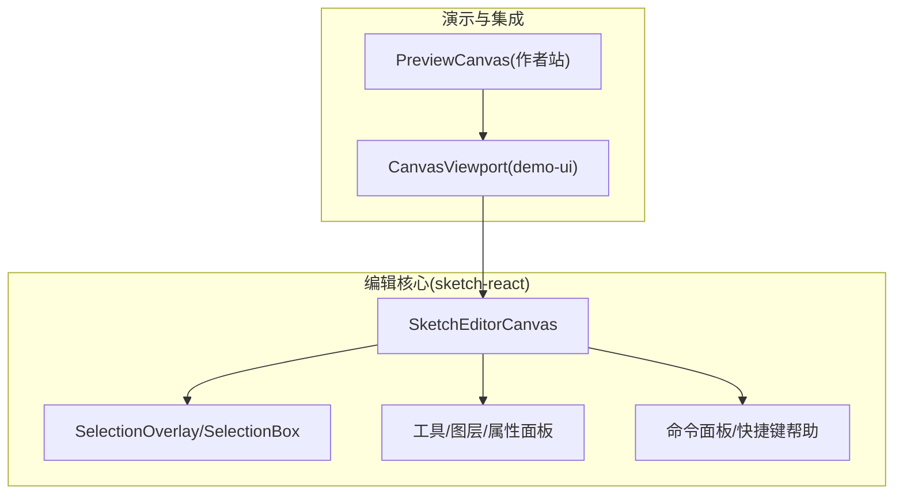
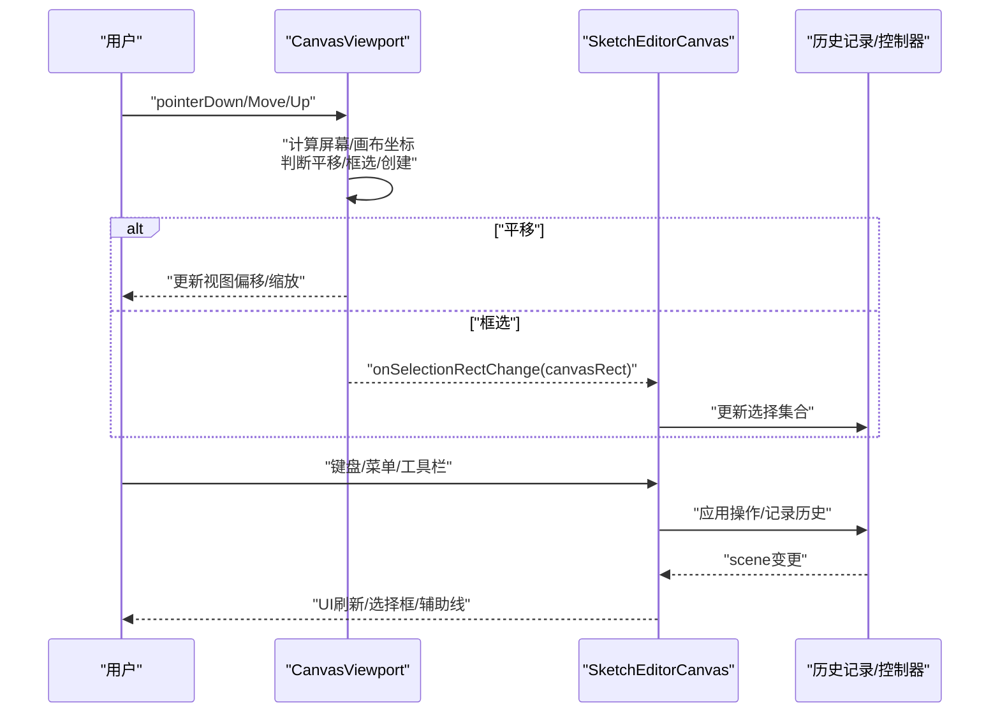
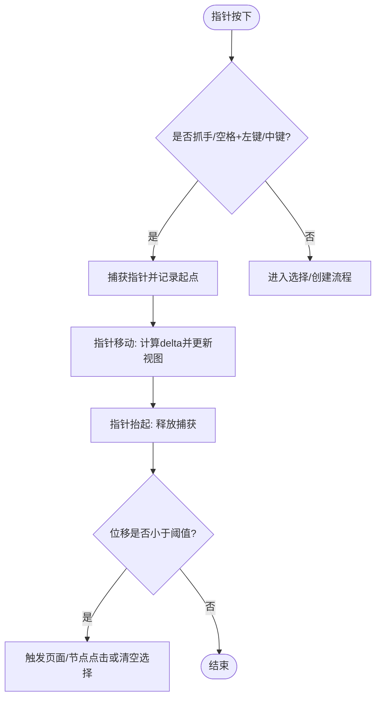
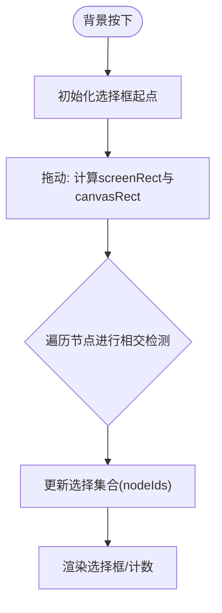
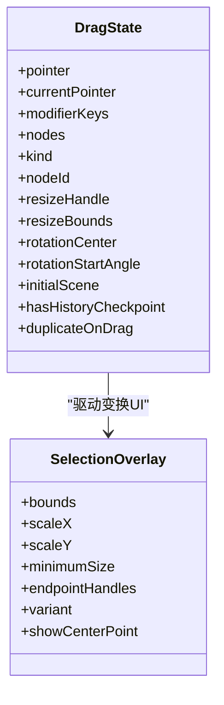
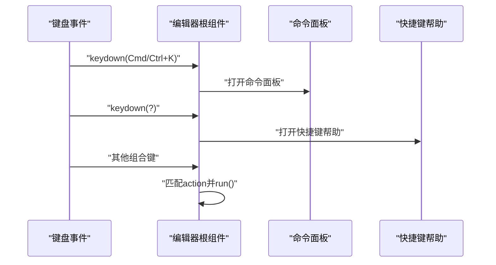
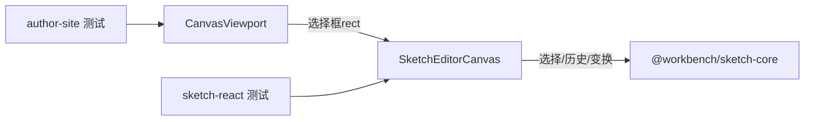

# 交互系统

<cite>
**本文引用的文件**   
- [packages/sketch-react/src/index.tsx](file://packages/sketch-react/src/index.tsx)
- [packages/demo-ui/src/CanvasViewport.tsx](file://packages/demo-ui/src/CanvasViewport.tsx)
- [packages/author-site/src/components/demo/preview-canvas-interaction-mode.test.tsx](file://packages/author-site/src/components/demo/preview-canvas-interaction-mode.test.tsx)
- [packages/sketch-react/tests/sketch-react.test.tsx](file://packages/sketch-react/tests/sketch-react.test.tsx)
</cite>

## 目录
1. [简介](#简介)
2. [项目结构](#项目结构)
3. [核心组件](#核心组件)
4. [架构总览](#架构总览)
5. [详细组件分析](#详细组件分析)
6. [依赖关系分析](#依赖关系分析)
7. [性能考量](#性能考量)
8. [故障排查指南](#故障排查指南)
9. [结论](#结论)
10. [附录](#附录)

## 简介
本文件面向画布交互系统，系统性说明拖拽、选择框、变换（旋转/缩放/对齐/分布）、快捷键与命令面板、手势与移动端适配，以及扩展开发指南。文档基于仓库中 sketch-react 与 demo-ui 的交互实现与测试用例进行梳理，帮助读者快速理解并扩展交互能力。

## 项目结构
- 交互核心位于 sketch-react 包，提供编辑器状态、选择、历史、工具栏、图层面板、属性面板、预览渲染等能力。
- 画布视口与基础拖拽/平移/框选逻辑在 demo-ui 的 CanvasViewport 中实现，向上层提供统一的指针事件处理与视图更新。
- 行为验证与边界场景由 author-site 与 sketch-react 的测试覆盖，确保多选、对齐、分布、旋转命中等特性稳定可用。

图表来源
- [packages/demo-ui/src/CanvasViewport.tsx](file://packages/demo-ui/src/CanvasViewport.tsx)
- [packages/sketch-react/src/index.tsx](file://packages/sketch-react/src/index.tsx)

章节来源
- [packages/sketch-react/src/index.tsx](file://packages/sketch-react/src/index.tsx)
- [packages/demo-ui/src/CanvasViewport.tsx](file://packages/demo-ui/src/CanvasViewport.tsx)

## 核心组件
- 画布视口与指针事件：统一捕获 PointerEvent，支持抓手平移、空格+左键临时平移、中键平移、滚轮缩放、选择模式下的矩形框选。
- 选择与命中：支持多对象选择、旋转对象的视觉多边形命中、线条/箭头端点命中、路径容差命中。
- 变换操作：移动、缩放（含等比）、旋转、对齐（左/顶）、分布（水平/垂直）、成组/解组、层级排序。
- 快捷键与命令面板：内置动作集、组合键映射、搜索命令、快捷键帮助弹窗。
- 辅助线：网格、中心线、边缘对齐、间距提示。
- 历史与撤销重做：操作级历史栈，支持连续编辑合并为一次历史。

章节来源
- [packages/demo-ui/src/CanvasViewport.tsx](file://packages/demo-ui/src/CanvasViewport.tsx)
- [packages/sketch-react/src/index.tsx](file://packages/sketch-react/src/index.tsx)

## 架构总览
交互系统采用“视口层 + 编辑器层”的分层设计：
- 视口层负责坐标转换、平移/缩放、框选区域计算与 UI 反馈。
- 编辑器层负责选择态、变换逻辑、对齐/分布、图层管理、样式与文本编辑、命令与快捷键。

图表来源
- [packages/demo-ui/src/CanvasViewport.tsx](file://packages/demo-ui/src/CanvasViewport.tsx)
- [packages/sketch-react/src/index.tsx](file://packages/sketch-react/src/index.tsx)

## 详细组件分析

### 拖拽与平移
- 事件捕获与分流：在 capture 阶段拦截需要优先处理的平移（手型工具、空格+左键、中键），阻止事件下沉到页面或节点，避免冲突。
- 平移轨迹：记录起始指针与起始视图位置，move 时按 delta 更新视图偏移；使用 requestAnimationFrame 节流更新，减少重排。
- 点击判定：当位移小于阈值视为点击，触发页面/节点点击回调或取消选择。
- 光标与交互态：根据工具与是否按住空格动态切换抓取/释放光标。

图表来源
- [packages/demo-ui/src/CanvasViewport.tsx](file://packages/demo-ui/src/CanvasViewport.tsx)

章节来源
- [packages/demo-ui/src/CanvasViewport.tsx](file://packages/demo-ui/src/CanvasViewport.tsx)

### 选择框（矩形框选）
- 触发条件：选择模式下，在画布空白区域按下并拖动。
- 区域计算：将屏幕坐标转换为画布坐标，考虑当前缩放与偏移，得到 canvasRect。
- 命中策略：对每个节点进行几何相交检测，支持旋转节点的视觉多边形相交、线条/箭头的线段相交、路径容差命中。
- 多选支持：Shift/Ctrl 组合点击可叠加选择；框选结束后批量更新选择集合。
- 可视化：绘制虚线选择框与计数标签。

图表来源
- [packages/sketch-react/src/index.tsx](file://packages/sketch-react/src/index.tsx)
- [packages/demo-ui/src/CanvasViewport.tsx](file://packages/demo-ui/src/CanvasViewport.tsx)

章节来源
- [packages/sketch-react/src/index.tsx](file://packages/sketch-react/src/index.tsx)
- [packages/demo-ui/src/CanvasViewport.tsx](file://packages/demo-ui/src/CanvasViewport.tsx)
- [packages/sketch-react/tests/sketch-react.test.tsx](file://packages/sketch-react/tests/sketch-react.test.tsx)

### 变换操作（移动/缩放/旋转/对齐/分布）
- 移动：基于 dragState 的指针差值，批量平移选中节点，支持吸附辅助线与约束。
- 缩放：支持八向手柄与等比缩放（Shift），对旋转节点以选择框整体缩放更合理；线条/箭头端点单独调整。
- 旋转：顶部旋转手柄，围绕节点中心旋转，角度归一化。
- 对齐：按选择边界左侧/顶部对齐，考虑旋转后的视觉边界。
- 分布：水平/垂直分布，按可视边界等分间距。
- 层级：置顶/置底/上移一层/下移一层，通过 reorder 操作维护视觉顺序。

图表来源
- [packages/sketch-react/src/index.tsx](file://packages/sketch-react/src/index.tsx)

章节来源
- [packages/sketch-react/src/index.tsx](file://packages/sketch-react/src/index.tsx)
- [packages/sketch-react/tests/sketch-react.test.tsx](file://packages/sketch-react/tests/sketch-react.test.tsx)

### 快捷键系统与命令面板
- 动作定义：所有交互以 SketchActionEntry 形式声明，包含 id、分组、标签、描述、快捷键数组、禁用原因与执行函数。
- 组合键处理：全局监听键盘事件，区分 meta/ctrl/alt/shift 与 Tab、Delete、Backspace、Z/Y 等常用键，调用对应 action.run()。
- 命令面板：Cmd/Ctrl+K 打开，支持模糊搜索（名称/描述/分组/快捷键），回车执行。
- 快捷键帮助：? 键打开，展示所有带快捷键的动作列表。
- 作用域：通过 keyboardScopeId 控制多个编辑器实例间的快捷键优先级。

图表来源
- [packages/sketch-react/src/index.tsx](file://packages/sketch-react/src/index.tsx)

章节来源
- [packages/sketch-react/src/index.tsx](file://packages/sketch-react/src/index.tsx)

### 手势支持与移动端适配
- 指针统一：使用 PointerEvent 兼容鼠标与触控，setPointerCapture/releasePointerCapture 保证拖拽稳定性。
- 滚动缩放：wheel 事件结合 ctrl/meta 键实现以鼠标为中心的缩放；移动端可通过双指缩放（上层可接入）。
- 触摸交互：测试环境模拟 PointerEvent，确保移动端行为一致；长按/双击等行为可在上层扩展。
- 光标与反馈：根据工具与交互态切换光标，提升可用性。

章节来源
- [packages/demo-ui/src/CanvasViewport.tsx](file://packages/demo-ui/src/CanvasViewport.tsx)
- [packages/author-site/src/components/demo/preview-canvas-interaction-mode.test.tsx](file://packages/author-site/src/components/demo/preview-canvas-interaction-mode.test.tsx)

### 交互扩展开发指南
- 自定义操作类型
  - 新增动作：在动作构建处添加新的 SketchActionEntry，定义 id、section、label、shortcuts、disabledReason 与 run 回调。
  - 绑定快捷键：在键盘处理器中添加组合键分支，调用 runAction(id)。
  - 暴露 API：通过控制器方法（如 setTool、applyOperations、setNodeIds）完成数据变更。
- 事件冒泡机制
  - 视口层在 capture 阶段拦截平移，bubble 阶段处理选择/创建，避免与子元素冲突。
  - 选择命中后通过 onSelectionChange 回调向外传播，上层可据此联动 UI。
- 扩展建议
  - 保持选择与变换逻辑的幂等性，避免重复历史。
  - 对复杂命中（旋转/路径）复用现有几何算法，确保一致性。
  - 使用 will-change 与 rAF 优化高频更新。

章节来源
- [packages/sketch-react/src/index.tsx](file://packages/sketch-react/src/index.tsx)
- [packages/demo-ui/src/CanvasViewport.tsx](file://packages/demo-ui/src/CanvasViewport.tsx)

## 依赖关系分析
- 视口与编辑器耦合点：CanvasViewport 通过 onSelectionRectChange、onCanvasClick、onPageClick、onNodeClick 与上层通信；编辑器内部维护选择、历史与变换。
- 选择与几何：选择命中依赖几何库（sketch-core）提供的边界、旋转、连线、路径等计算。
- 测试与回归：大量用例覆盖旋转命中、对齐/分布、隐藏节点、配置绑定可见性等边界场景。

图表来源
- [packages/demo-ui/src/CanvasViewport.tsx](file://packages/demo-ui/src/CanvasViewport.tsx)
- [packages/sketch-react/src/index.tsx](file://packages/sketch-react/src/index.tsx)
- [packages/author-site/src/components/demo/preview-canvas-interaction-mode.test.tsx](file://packages/author-site/src/components/demo/preview-canvas-interaction-mode.test.tsx)
- [packages/sketch-react/tests/sketch-react.test.tsx](file://packages/sketch-react/tests/sketch-react.test.tsx)

章节来源
- [packages/sketch-react/src/index.tsx](file://packages/sketch-react/src/index.tsx)
- [packages/demo-ui/src/CanvasViewport.tsx](file://packages/demo-ui/src/CanvasViewport.tsx)
- [packages/author-site/src/components/demo/preview-canvas-interaction-mode.test.tsx](file://packages/author-site/src/components/demo/preview-canvas-interaction-mode.test.tsx)
- [packages/sketch-react/tests/sketch-react.test.tsx](file://packages/sketch-react/tests/sketch-react.test.tsx)

## 性能考量
- 高频更新节流：使用 requestAnimationFrame 聚合视图更新，减少布局抖动。
- 命中计算优化：仅对可见且可编辑节点进行命中检测，必要时限制候选集。
- 变换预览：在拖拽过程中计算预览边界与吸附线，提交时才写入历史，降低历史爆炸风险。
- 渲染优化：对频繁变化的容器启用 will-change，配合 transform 合成层提升流畅度。

[本节为通用指导，不直接分析具体文件]

## 故障排查指南
- 框选无效
  - 检查是否在抓手模式或按住空格，此时会优先平移而非框选。
  - 确认选择模式已激活，且点击目标为画布空白区域。
- 旋转节点未被选中
  - 旋转节点使用视觉多边形相交，确认节点确实处于旋转状态且未锁定。
- 对齐/分布异常
  - 对齐/分布基于可视边界，若节点被隐藏或图片资源未解析，将被排除。
- 快捷键无响应
  - 确认当前焦点与作用域，多个编辑器实例需激活目标作用域。
  - 检查是否被输入框拦截（textarea/input/contenteditable）。

章节来源
- [packages/sketch-react/src/index.tsx](file://packages/sketch-react/src/index.tsx)
- [packages/demo-ui/src/CanvasViewport.tsx](file://packages/demo-ui/src/CanvasViewport.tsx)
- [packages/sketch-react/tests/sketch-react.test.tsx](file://packages/sketch-react/tests/sketch-react.test.tsx)

## 结论
本交互系统通过清晰的视口/编辑器分层、完善的命中与变换算法、健壮的快捷键与命令面板，提供了高效稳定的画布体验。借助测试覆盖与可扩展的动作体系，开发者可以安全地扩展新工具与新交互，同时保持性能与一致性。

[本节为总结，不直接分析具体文件]

## 附录
- 关键术语
  - 选择框：矩形框选区域，用于批量选择。
  - 吸附辅助线：网格/中心/边缘/间距提示线。
  - 命令面板：通过搜索快速执行命令的对话框。
- 参考用例
  - 旋转节点对齐与分布：见测试用例中对旋转节点的对齐与分布断言。
  - 隐藏节点与配置绑定：见测试用例中对隐藏与不可见资源的处理。

章节来源
- [packages/sketch-react/tests/sketch-react.test.tsx](file://packages/sketch-react/tests/sketch-react.test.tsx)