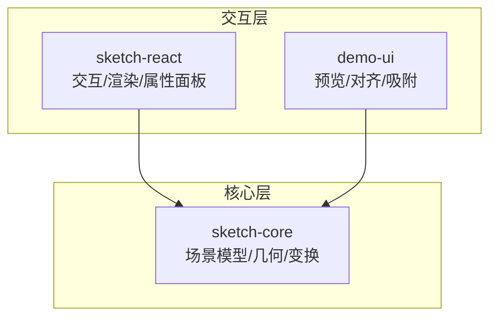
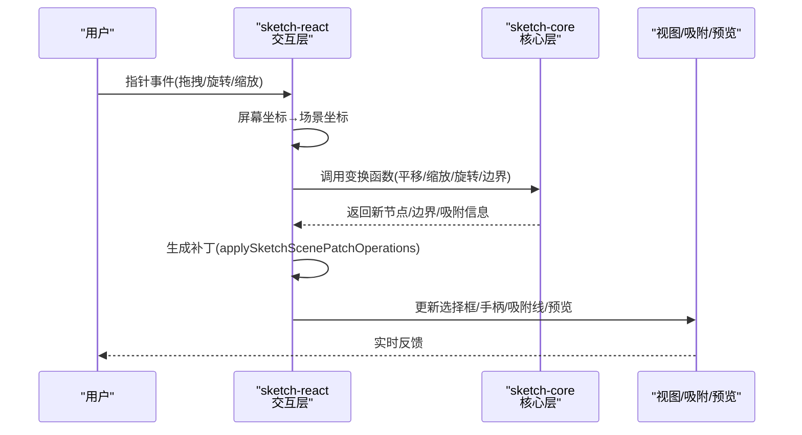
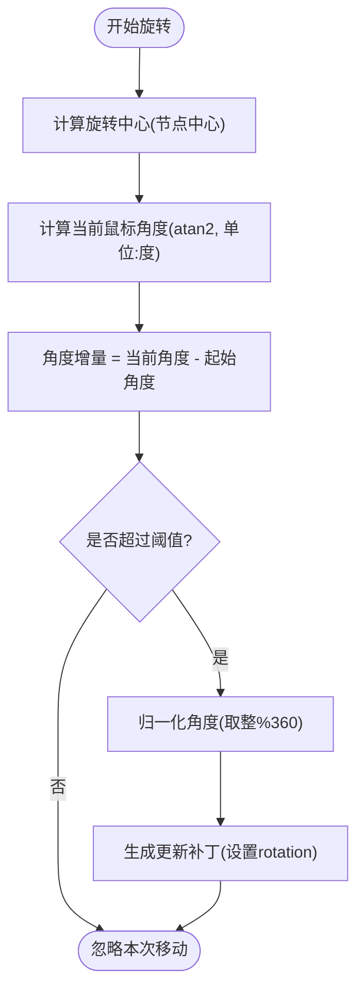
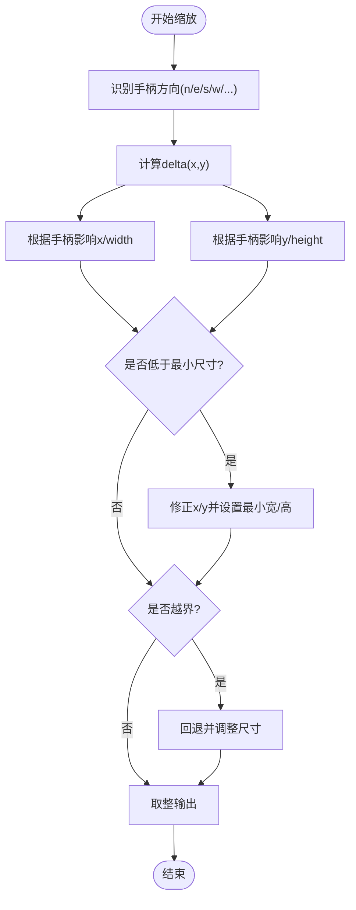
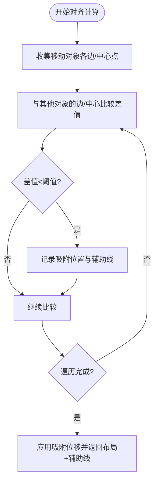
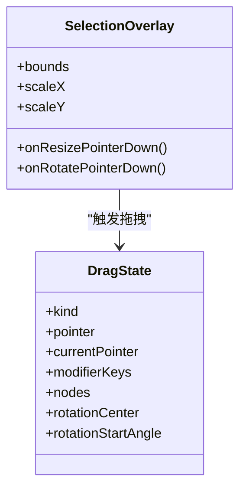
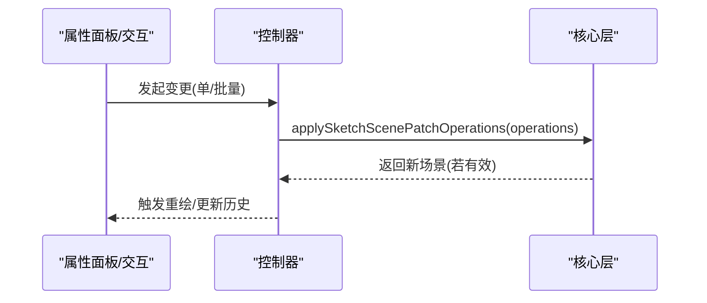
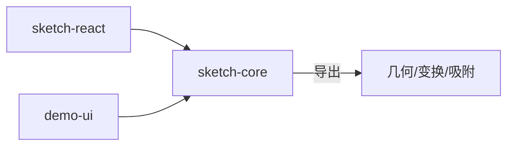

# 变换系统

<cite>
**本文引用的文件**
- [packages/sketch-core/src/index.ts](file://packages/sketch-core/src/index.ts)
- [packages/sketch-react/src/index.tsx](file://packages/sketch-react/src/index.tsx)
- [packages/demo-ui/src/PreviewCanvas.tsx](file://packages/demo-ui/src/PreviewCanvas.tsx)
- [packages/demo-ui/src/CanvasViewport.tsx](file://packages/demo-ui/src/CanvasViewport.tsx)
- [packages/sketch-core/tests/sketch-core.test.ts](file://packages/sketch-core/tests/sketch-core.test.ts)
</cite>

## 目录
1. [简介](#简介)
2. [项目结构](#项目结构)
3. [核心组件](#核心组件)
4. [架构总览](#架构总览)
5. [详细组件分析](#详细组件分析)
6. [依赖关系分析](#依赖关系分析)
7. [性能与精度](#性能与精度)
8. [故障排查指南](#故障排查指南)
9. [结论](#结论)
10. [附录](#附录)

## 简介
本技术文档围绕画布变换系统，系统性阐述元素变换的核心算法与交互实现，包括：
- 矩阵变换数学原理、坐标系统转换与变换链计算逻辑
- 旋转功能（中心点设置、角度计算、弧度转换）
- 缩放操作（等比与非等比、缩放中心控制）
- 对齐与分布（水平/垂直对齐、间距计算、批量操作）
- 变换手柄交互（定位、拖拽、实时预览）
- 扩展方法（自定义变换、历史机制）
- 精度控制与性能优化策略

## 项目结构
变换系统由“核心数据与几何计算”和“交互渲染层”两部分组成：
- 核心层（sketch-core）：提供场景模型、节点几何、变换函数、边界计算、吸附辅助线等纯函数式能力。
- 交互层（sketch-react、demo-ui）：负责事件处理、拖拽/旋转/缩放交互、选择框与手柄绘制、吸附辅助线与实时预览、视口缩放与偏移。

图表来源
- [packages/sketch-core/src/index.ts](file://packages/sketch-core/src/index.ts)
- [packages/sketch-react/src/index.tsx](file://packages/sketch-react/src/index.tsx)
- [packages/demo-ui/src/PreviewCanvas.tsx](file://packages/demo-ui/src/PreviewCanvas.tsx)

章节来源
- [packages/sketch-core/src/index.ts](file://packages/sketch-core/src/index.ts)
- [packages/sketch-react/src/index.tsx](file://packages/sketch-react/src/index.tsx)
- [packages/demo-ui/src/PreviewCanvas.tsx](file://packages/demo-ui/src/PreviewCanvas.tsx)

## 核心组件
- 场景与节点模型：定义节点类型、样式、连接绑定、页面尺寸等数据结构，以及校验与归一化能力。
- 几何与变换：平移、缩放、旋转、包围盒计算、命中测试、吸附参考线生成。
- 补丁与变更：基于操作的不可变更新，支持撤销/重做与差异摘要。
- 交互与渲染：选择框、八向缩放手柄、旋转手柄、拖拽、吸附辅助线、实时预览。

章节来源
- [packages/sketch-core/src/index.ts](file://packages/sketch-core/src/index.ts)
- [packages/sketch-react/src/index.tsx](file://packages/sketch-react/src/index.tsx)

## 架构总览
变换系统的整体流程如下：用户输入在交互层被捕获并转换为场景坐标，随后调用核心层的几何与变换函数计算新状态，通过补丁机制更新场景，最终驱动视图重绘与吸附/预览反馈。

图表来源
- [packages/sketch-react/src/index.tsx](file://packages/sketch-react/src/index.tsx)
- [packages/sketch-core/src/index.ts](file://packages/sketch-core/src/index.ts)

## 详细组件分析

### 坐标系统与矩阵变换
- 坐标系统
  - 屏幕坐标到场景坐标的转换：根据容器尺寸与页面尺寸进行线性映射，确保点击/拖拽位置准确对应到画布坐标系。
  - 视口缩放与偏移：对 viewport.scale 进行钳制与四舍五入，保证缩放范围合理且数值稳定。
- 矩阵变换
  - 旋转采用以节点中心为原点的二维旋转矩阵；包围盒计算时，将矩形四个角点绕中心旋转后取最小外接矩形。
  - 平移与缩放分别通过向量加法与比例乘法完成；非等比缩放按手柄方向组合 x/y 变化量。
- 变换链
  - 当前实现中，节点仅存储 x/y/w/h/rotation，渲染时按顺序应用平移与旋转；缩放通过直接修改宽高与左上角实现，不引入额外矩阵层级。

章节来源
- [packages/sketch-react/src/index.tsx](file://packages/sketch-react/src/index.tsx)
- [packages/sketch-core/src/index.ts](file://packages/sketch-core/src/index.ts)

### 旋转功能
- 旋转中心点
  - 默认以节点包围盒中心为旋转中心，计算方式为 (x + width/2, y + height/2)。
- 角度计算与弧度转换
  - 拖拽旋转时，使用 atan2 计算鼠标相对中心的极角（度），与初始角度差值作为增量；内部统一转为弧度参与三角函数运算。
  - 角度归一化：结果取整并对 360 取模，保持角度在 [0, 360) 区间。
- 交互细节
  - 首次记录历史检查点前，角度增量小于阈值则忽略，避免抖动产生无效操作。

图表来源
- [packages/sketch-react/src/index.tsx](file://packages/sketch-react/src/index.tsx)
- [packages/sketch-core/src/index.ts](file://packages/sketch-core/src/index.ts)

章节来源
- [packages/sketch-react/src/index.tsx](file://packages/sketch-react/src/index.tsx)
- [packages/sketch-core/src/index.ts](file://packages/sketch-core/src/index.ts)

### 缩放操作
- 等比缩放
  - 当开启“锁定宽高比”时，修改宽度或高度会按比例同步另一维度，保持原始宽高比不变。
- 非等比缩放
  - 根据手柄方向（n/e/s/w/ne/nw/se/sw）组合 x/y 的变化量，调整 x/y 与 width/height。
- 缩放中心控制
  - 当前实现以节点自身边界为基准进行缩放，未暴露独立“缩放中心”参数；如需以任意点为中心，可在上层封装时将目标点转换为等效的 x/y/width/height 变更。
- 边界与最小尺寸
  - 非线段类节点存在最小尺寸限制；线段/箭头类允许零长度但需保留方向向量，防止退化。

图表来源
- [packages/sketch-core/src/index.ts](file://packages/sketch-core/src/index.ts)
- [packages/sketch-react/src/index.tsx](file://packages/sketch-react/src/index.tsx)

章节来源
- [packages/sketch-core/src/index.ts](file://packages/sketch-core/src/index.ts)
- [packages/sketch-react/src/index.tsx](file://packages/sketch-react/src/index.tsx)

### 对齐与分布
- 吸附参考线
  - 自动检测与页面中心、网格、其他节点边缘与中心的对齐机会，生成吸附辅助线集合。
  - 支持临时隐藏吸附（按住 Cmd/Ctrl）。
- 对齐与分布
  - demo-ui 中的 computeAlignment 实现了水平/垂直对齐与间距判断，结合 SNAP_THRESHOLD 判定是否触发吸附，并输出对齐后的布局与辅助线。
- 批量操作
  - 属性面板支持批量修改颜色、字号、字重、文本对齐、图片适配等；拖拽过程中对选中集合统一应用补丁。

图表来源
- [packages/demo-ui/src/PreviewCanvas.tsx](file://packages/demo-ui/src/PreviewCanvas.tsx)
- [packages/sketch-react/src/index.tsx](file://packages/sketch-react/src/index.tsx)

章节来源
- [packages/demo-ui/src/PreviewCanvas.tsx](file://packages/demo-ui/src/PreviewCanvas.tsx)
- [packages/sketch-react/src/index.tsx](file://packages/sketch-react/src/index.tsx)

### 变换手柄与交互设计
- 选择框与手柄
  - SelectionOverlay 根据 bounds 与 scaleX/scaleY 计算屏幕位置，绘制八向缩放手柄与旋转手柄，支持 hover/marquee 等多种变体。
- 拖拽控制
  - 统一 DragState 管理拖拽起点、当前指针、修饰键状态；根据 kind 区分平移/旋转等模式。
- 实时预览
  - 拖拽过程中即时计算吸附参考线并渲染，同时更新选择框与手柄位置，形成所见即所得体验。

图表来源
- [packages/sketch-react/src/index.tsx](file://packages/sketch-react/src/index.tsx)

章节来源
- [packages/sketch-react/src/index.tsx](file://packages/sketch-react/src/index.tsx)

### 补丁与变更（历史与批量）
- 补丁操作
  - 支持 add/update/delete/duplicate/reorder/group/ungroup/set-locked/set-visible/bind/unbind 等操作，全部不可变更新并通过校验器验证。
- 历史机制
  - 交互层在连续编辑开始时创建历史检查点，结束时提交；旋转拖拽在未建立检查点前对微小增量进行抑制。
- 批量操作
  - 属性面板对多个节点应用相同样式或内容变更，统一生成补丁序列。

图表来源
- [packages/sketch-core/src/index.ts](file://packages/sketch-core/src/index.ts)
- [packages/sketch-react/src/index.tsx](file://packages/sketch-react/src/index.tsx)

章节来源
- [packages/sketch-core/src/index.ts](file://packages/sketch-core/src/index.ts)
- [packages/sketch-react/src/index.tsx](file://packages/sketch-react/src/index.tsx)

### 扩展方法
- 自定义变换操作
  - 在交互层新增一种 kind 的拖拽模式，并在事件处理分支中计算对应的 patch 序列，交由 applySketchScenePatchOperations 提交。
- 变换历史
  - 利用 beginContinuousHistory/endContinuousHistory 包裹连续编辑，确保撤销/重做粒度合理；必要时在关键节点插入检查点。
- 新增吸附规则
  - 在 getSketchSnapGuides 中增加新的参考源（如自定义网格、智能对齐面），遵循 pushNearestSnapGuide 去重与阈值判定。

章节来源
- [packages/sketch-react/src/index.tsx](file://packages/sketch-react/src/index.tsx)
- [packages/sketch-core/src/index.ts](file://packages/sketch-core/src/index.ts)

## 依赖关系分析
- 模块耦合
  - sketch-react 强依赖 sketch-core 提供的几何与变换函数；demo-ui 也复用 core 的几何能力用于预览对齐。
- 外部依赖
  - 主要依赖浏览器事件与 DOM API；无重型第三方库耦合。
- 循环依赖
  - 未见循环引用；core 为纯函数库，react 与 demo-ui 为上层消费方。

图表来源
- [packages/sketch-core/src/index.ts](file://packages/sketch-core/src/index.ts)
- [packages/sketch-react/src/index.tsx](file://packages/sketch-react/src/index.tsx)
- [packages/demo-ui/src/PreviewCanvas.tsx](file://packages/demo-ui/src/PreviewCanvas.tsx)

章节来源
- [packages/sketch-core/src/index.ts](file://packages/sketch-core/src/index.ts)
- [packages/sketch-react/src/index.tsx](file://packages/sketch-react/src/index.tsx)
- [packages/demo-ui/src/PreviewCanvas.tsx](file://packages/demo-ui/src/PreviewCanvas.tsx)

## 性能与精度
- 视口刷新节流
  - 使用 requestAnimationFrame 合并高频更新，减少重排重绘开销。
- 数值精度
  - 视口偏移与缩放值进行四舍五入与钳制，避免浮点误差累积；节点坐标与尺寸在变换后取整，提升一致性。
- 命中与边界
  - 命中测试与包围盒计算尽量使用简单几何判断，降低复杂度；旋转包围盒仅在需要时计算。
- 建议
  - 大量节点场景下可考虑分帧计算吸附与命中；对频繁更新的属性启用增量更新与脏标记。

章节来源
- [packages/demo-ui/src/CanvasViewport.tsx](file://packages/demo-ui/src/CanvasViewport.tsx)
- [packages/sketch-core/src/index.ts](file://packages/sketch-core/src/index.ts)
- [packages/sketch-react/src/index.tsx](file://packages/sketch-react/src/index.tsx)

## 故障排查指南
- 旋转异常
  - 检查旋转中心是否为节点中心；确认角度增量阈值与归一化逻辑是否正确。
- 缩放失真
  - 确认是否启用了“锁定宽高比”；检查手柄方向与 delta 符号是否匹配。
- 吸附不生效
  - 检查吸附阈值配置；确认是否按住 Cmd/Ctrl 临时隐藏了吸附线。
- 历史无法撤销
  - 确认是否在连续编辑开始时创建了历史检查点；微调增量是否被阈值过滤。

章节来源
- [packages/sketch-react/src/index.tsx](file://packages/sketch-react/src/index.tsx)
- [packages/sketch-core/src/index.ts](file://packages/sketch-core/src/index.ts)

## 结论
本变换系统以简洁的数据模型与纯函数式核心实现为基础，配合交互层的精细事件处理与吸附/预览反馈，提供了稳定高效的平移、缩放、旋转与对齐能力。通过补丁与历史机制，系统具备良好的可扩展性与可维护性，适合在复杂画布场景中持续演进。

## 附录
- 单元测试覆盖要点
  - 命中测试与变换：平移、缩放、旋转的正确性与边界情况。
  - 吸附与辅助线：边缘、中心、网格等多类吸附行为。

章节来源
- [packages/sketch-core/tests/sketch-core.test.ts](file://packages/sketch-core/tests/sketch-core.test.ts)