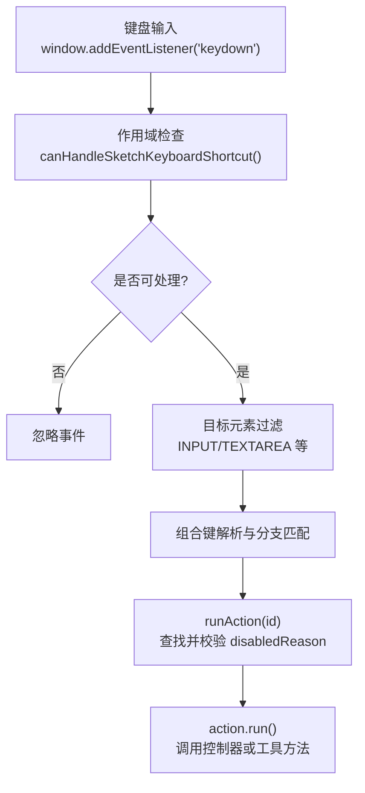
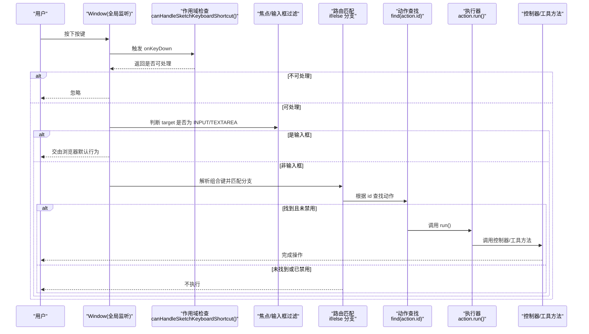
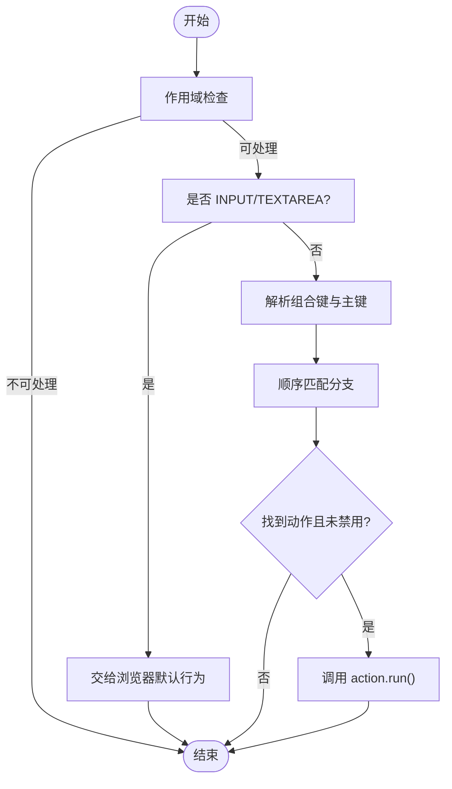
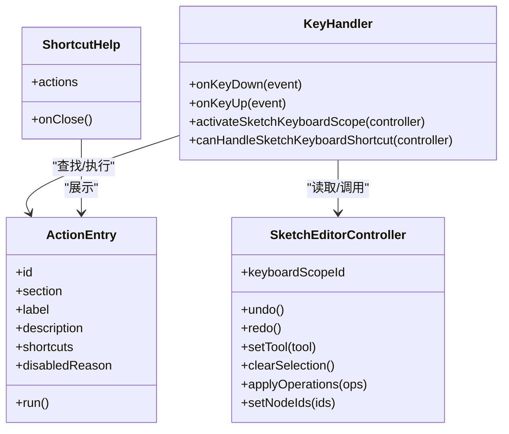

# 快捷键系统

<cite>
**本文引用的文件**
- [packages/sketch-react/src/index.tsx](file://packages/sketch-react/src/index.tsx)
- [packages/sketch-react/tests/sketch-react.test.tsx](file://packages/sketch-react/tests/sketch-react.test.tsx)
</cite>

## 目录
1. [简介](#简介)
2. [项目结构](#项目结构)
3. [核心组件](#核心组件)
4. [架构总览](#架构总览)
5. [详细组件分析](#详细组件分析)
6. [依赖关系分析](#依赖关系分析)
7. [性能考量](#性能考量)
8. [故障排查指南](#故障排查指南)
9. [结论](#结论)
10. [附录](#附录)

## 简介
本文件面向画布快捷键系统，系统性说明键盘事件监听机制、快捷键映射与执行流程、平台差异处理、用户自定义配置与持久化、扩展开发指南以及测试与调试方法。文档基于仓库中画布编辑器（sketch-react）的源码实现进行梳理，确保读者能够理解并在此基础上扩展新的快捷键能力。

## 项目结构
快捷键系统主要位于 sketch-react 包中，围绕“动作条目（Action Entry）”、“全局键盘监听”、“作用域控制”和“命令分发”四个层面组织：
- 动作定义层：集中声明所有可触发的操作及其键位绑定
- 监听与路由层：在窗口级注册 keydown/keyup 监听，按条件过滤与匹配
- 作用域控制层：通过 keyboardScopeId 控制哪些实例能响应快捷键
- 执行层：根据匹配到的 action id 调用对应 run 函数完成业务逻辑

图表来源
- [packages/sketch-react/src/index.tsx:6130-6282](file://packages/sketch-react/src/index.tsx#L6130-L6282)
- [packages/sketch-react/src/index.tsx:172-183](file://packages/sketch-react/src/index.tsx#L172-L183)

章节来源
- [packages/sketch-react/src/index.tsx:172-183](file://packages/sketch-react/src/index.tsx#L172-L183)
- [packages/sketch-react/src/index.tsx:6130-6282](file://packages/sketch-react/src/index.tsx#L6130-L6282)

## 核心组件
- 动作条目集合（Action Entries）
  - 每个动作包含 id、section、label、description、shortcuts、disabledReason、run 等字段
  - shortcuts 使用人类可读的组合键字符串，如 “Cmd/Ctrl+Z”、“Alt+拖动”
  - disabledReason 用于运行时禁用状态提示
- 快捷键帮助面板（Shortcuts Help）
  - 展示所有带有 shortcuts 的动作，便于用户查阅
- 全局键盘监听器
  - 在 window 上注册 keydown/keyup，统一处理编辑模式下的快捷键
- 作用域控制器
  - 通过 controller.keyboardScopeId 与 activeSketchKeyboardScopeId 决定当前实例是否响应

章节来源
- [packages/sketch-react/src/index.tsx:3030-3250](file://packages/sketch-react/src/index.tsx#L3030-L3250)
- [packages/sketch-react/src/index.tsx:3324-3373](file://packages/sketch-react/src/index.tsx#L3324-L3373)
- [packages/sketch-react/src/index.tsx:172-183](file://packages/sketch-react/src/index.tsx#L172-L183)
- [packages/sketch-react/src/index.tsx:6130-6282](file://packages/sketch-react/src/index.tsx#L6130-L6282)

## 架构总览
下图展示了从键盘事件到命令执行的完整链路，包括作用域判定、焦点与输入框过滤、组合键解析、动作查找与执行。

图表来源
- [packages/sketch-react/src/index.tsx:6130-6282](file://packages/sketch-react/src/index.tsx#L6130-L6282)
- [packages/sketch-react/src/index.tsx:3030-3250](file://packages/sketch-react/src/index.tsx#L3030-L3250)

## 详细组件分析

### 键盘事件监听机制
- 全局捕获
  - 在编辑模式下于 window 注册 keydown/keyup 监听，保证快捷键在全局范围内可用
- 事件冒泡控制
  - 对需要拦截的按键调用 preventDefault()，阻止浏览器默认行为（如滚动、搜索等）
  - 对弹窗/帮助面板内部单独处理 Escape 关闭，避免冒泡影响上层
- 焦点管理
  - 当目标为 INPUT/TEXTAREA 时直接放行，允许输入法与文本编辑正常进行
  - 提供 Tab 切换相邻节点的能力，结合 shiftKey 控制方向
  - Space 键进入平移模式，配合 onPointerDown/onPointerMove 实现拖拽平移

章节来源
- [packages/sketch-react/src/index.tsx:6130-6282](file://packages/sketch-react/src/index.tsx#L6130-L6282)
- [packages/sketch-react/src/index.tsx:3324-3373](file://packages/sketch-react/src/index.tsx#L3324-L3373)

### 快捷键映射系统
- 键位定义格式
  - 使用人类可读字符串描述组合键，例如 “Cmd/Ctrl+Z”、“Shift+1”、“Alt+拖动”
  - 同一动作可绑定多个快捷键，数组形式存储
- 组合键解析
  - 运行时通过 event.metaKey/event.ctrlKey/event.altKey/event.shiftKey 与 event.key 进行精确匹配
  - 支持多分支优先级，例如 Alt+C 与 Ctrl+C 分别映射到不同动作
- 冲突检测
  - 当前采用 if/else 顺序匹配，后出现的分支会覆盖前面的匹配结果
  - 建议在新增快捷键时审查已有分支，避免无意覆盖

图表来源
- [packages/sketch-react/src/index.tsx:6130-6282](file://packages/sketch-react/src/index.tsx#L6130-L6282)
- [packages/sketch-react/src/index.tsx:3030-3250](file://packages/sketch-react/src/index.tsx#L3030-L3250)

### 快捷键的执行流程
- 命令分发
  - 通过 find(action.id) 定位动作条目，若存在且无 disabledReason，则执行 run()
- 参数传递
  - run 闭包内可直接访问 scene、controller、configData 等上下文，无需显式传参
- 异步操作支持
  - run 可为异步函数；当前示例多为同步调用控制器方法，如需异步可在 run 中封装 Promise 并处理错误

章节来源
- [packages/sketch-react/src/index.tsx:6166-6171](file://packages/sketch-react/src/index.tsx#L6166-L6171)
- [packages/sketch-react/src/index.tsx:3030-3250](file://packages/sketch-react/src/index.tsx#L3030-L3250)

### 用户自定义配置与偏好持久化
- 配置文件格式
  - configData 作为运行时配置对象传入，可用于开关某些快捷键或调整行为
- 运行时修改
  - 通过更新 configData 并触发重渲染，可动态改变快捷键可用性或行为
- 偏好设置持久化
  - 当前代码未内置持久化逻辑；建议将用户偏好写入本地存储或服务端，并在初始化时注入到 configData

章节来源
- [packages/sketch-react/src/index.tsx:6130-6282](file://packages/sketch-react/src/index.tsx#L6130-L6282)

### 平台差异处理
- Mac 与 Windows 修饰键
  - 同时兼容 metaKey（Mac Cmd）与 ctrlKey（Windows Ctrl），以 (event.metaKey || event.ctrlKey) 的形式统一处理
- 输入法兼容性
  - 当目标为 INPUT/TEXTAREA 时直接放行，确保 IME 输入不受快捷键拦截影响

章节来源
- [packages/sketch-react/src/index.tsx:6130-6282](file://packages/sketch-react/src/index.tsx#L6130-L6282)

### 快捷键扩展开发指南
- 新快捷键注册方法
  - 在动作条目列表中添加新项，指定 id、shortcuts 与 run 回调
  - 若需复杂匹配逻辑，可在 onKeyDown 分支中新增 if/else 分支
- 权限控制机制
  - 使用 disabledReason 控制可用性，结合选中状态、可见性、锁定状态等条件动态计算
  - 通过作用域控制 canHandleSketchKeyboardShortcut 限制仅当前活跃画布响应

章节来源
- [packages/sketch-react/src/index.tsx:3030-3250](file://packages/sketch-react/src/index.tsx#L3030-L3250)
- [packages/sketch-react/src/index.tsx:172-183](file://packages/sketch-react/src/index.tsx#L172-L183)
- [packages/sketch-react/src/index.tsx:6130-6282](file://packages/sketch-react/src/index.tsx#L6130-L6282)

### 快捷键测试与调试工具
- 单元测试要点
  - 验证预览模式下快捷键被禁用
  - 验证快捷键作用域隔离：多个画布实例仅当前激活实例响应
- 调试技巧
  - 打开快捷键帮助面板查看已绑定的快捷键
  - 在控制台打印事件属性（key、metaKey、ctrlKey、altKey、shiftKey）辅助定位问题

章节来源
- [packages/sketch-react/tests/sketch-react.test.tsx:960-988](file://packages/sketch-react/tests/sketch-react.test.tsx#L960-L988)
- [packages/sketch-react/src/index.tsx:3324-3373](file://packages/sketch-react/src/index.tsx#L3324-L3373)

## 依赖关系分析
- 模块耦合
  - 快捷键系统与控制器（controller）、场景数据（scene）、配置（configData）紧密耦合
  - 通过闭包捕获上下文，减少显式参数传递，提高内聚性
- 外部依赖
  - 依赖浏览器原生 KeyboardEvent 与 DOM API
  - 依赖 React 生命周期与状态管理（useEffect、useState）

图表来源
- [packages/sketch-react/src/index.tsx:3030-3250](file://packages/sketch-react/src/index.tsx#L3030-L3250)
- [packages/sketch-react/src/index.tsx:3324-3373](file://packages/sketch-react/src/index.tsx#L3324-L3373)
- [packages/sketch-react/src/index.tsx:6130-6282](file://packages/sketch-react/src/index.tsx#L6130-L6282)

## 性能考量
- 事件处理路径尽量保持轻量，避免在 keydown 回调中进行昂贵计算
- 使用 disabledReason 提前短路，减少不必要的分支与查找
- 对于频繁触发的移动类快捷键（箭头键），批量应用操作以减少重排

## 故障排查指南
- 快捷键无效
  - 检查是否在编辑模式（mode === "edit"）
  - 确认当前实例是否处于活动作用域（activeSketchKeyboardScopeId）
  - 核对目标元素是否为 INPUT/TEXTAREA，导致事件被放行
- 快捷键冲突
  - 审查 if/else 分支顺序，必要时重构为更清晰的映射表
- 平台差异问题
  - 确认同时兼容 metaKey 与 ctrlKey
  - 针对 Mac 与 Windows 的修饰键语义差异进行测试

章节来源
- [packages/sketch-react/src/index.tsx:6130-6282](file://packages/sketch-react/src/index.tsx#L6130-L6282)
- [packages/sketch-react/src/index.tsx:172-183](file://packages/sketch-react/src/index.tsx#L172-L183)

## 结论
该快捷键系统以“动作条目 + 全局监听 + 作用域控制 + 顺序匹配”为核心设计，具备跨平台兼容性与良好的可扩展性。通过合理运用 disabledReason 与 configData，可实现灵活的权限控制与个性化配置。建议在后续迭代中引入更健壮的冲突检测与可配置的映射表，以提升可维护性与用户体验。

## 附录
- 常用快捷键参考
  - 撤销/重做：Cmd/Ctrl+Z / Cmd/Ctrl+Shift+Z
  - 复制/粘贴：Cmd/Ctrl+C / Cmd/Ctrl+V
  - 复制样式/粘贴样式：Cmd/Ctrl+Alt+C / Cmd/Ctrl+Alt+V
  - 删除：Delete / Backspace
  - 层级调整：Cmd/Ctrl+[ / ] 及 Shift 变体
  - 视图缩放：Shift+1 / Shift+2
  - 全选：Cmd/Ctrl+A
  - 平移：空格拖拽
  - 打开命令面板：Cmd/Ctrl+K
  - 打开快捷键帮助：?

章节来源
- [packages/sketch-react/src/index.tsx:3030-3250](file://packages/sketch-react/src/index.tsx#L3030-L3250)
- [packages/sketch-react/src/index.tsx:6130-6282](file://packages/sketch-react/src/index.tsx#L6130-L6282)