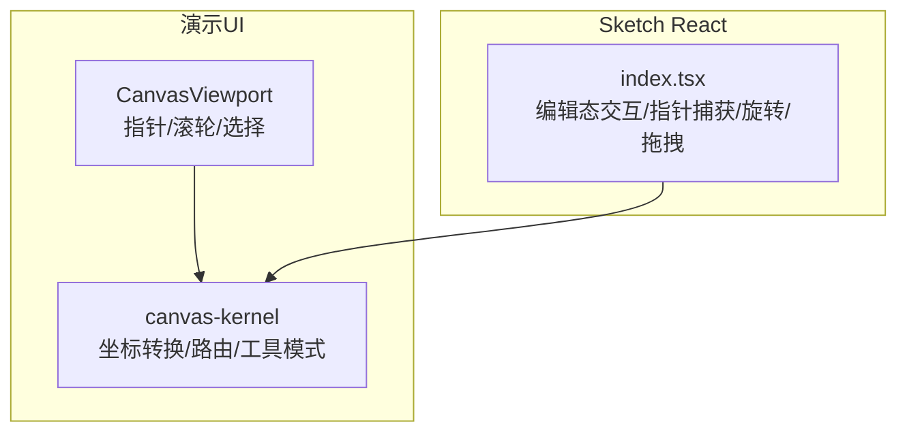
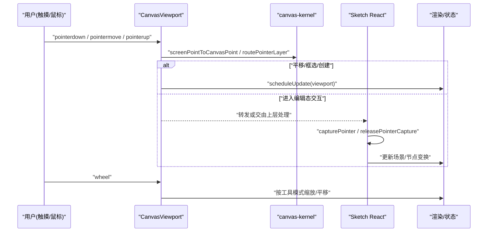
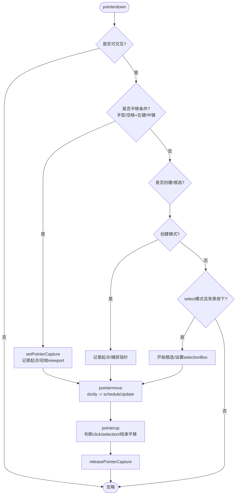
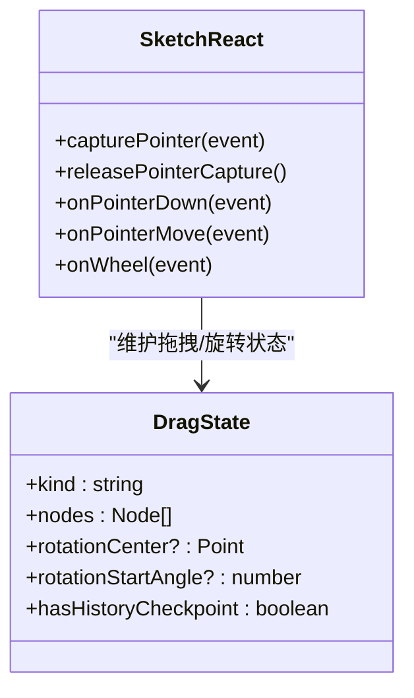
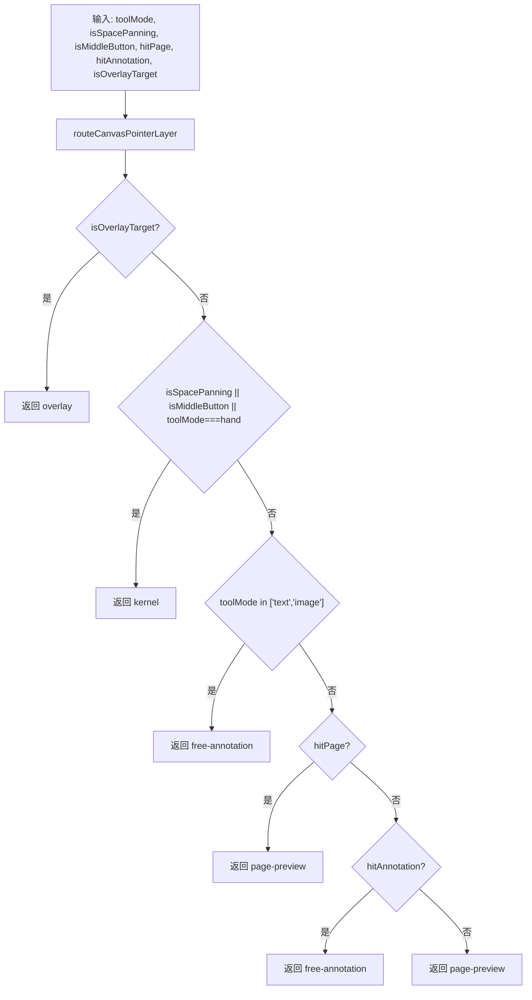
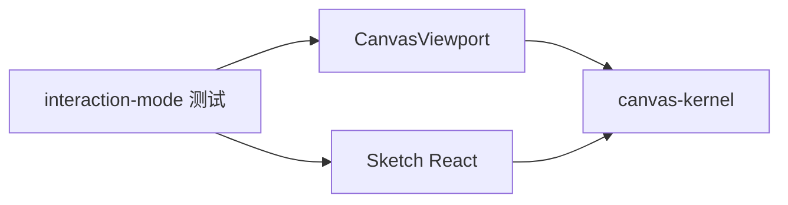

# 手势支持

<cite>
**本文引用的文件**   
- [CanvasViewport.tsx](file://packages/demo-ui/src/CanvasViewport.tsx)
- [index.tsx](file://packages/sketch-react/src/index.tsx)
- [canvas-kernel.ts](file://packages/demo-ui/src/canvas-kernel.ts)
- [preview-canvas-interaction-mode.test.tsx](file://packages/author-site/src/components/demo/preview-canvas-interaction-mode.test.tsx)
</cite>

## 目录
1. [简介](#简介)
2. [项目结构](#项目结构)
3. [核心组件](#核心组件)
4. [架构总览](#架构总览)
5. [详细组件分析](#详细组件分析)
6. [依赖关系分析](#依赖关系分析)
7. [性能考虑](#性能考虑)
8. [故障排查指南](#故障排查指南)
9. [结论](#结论)
10. [附录](#附录)

## 简介
本文件面向移动端画布交互，系统化说明触摸事件处理、多点触控识别、手势检测与合并策略，覆盖常用手势（单指拖动、双指缩放、三指旋转、长按）的实现思路与冲突解决机制。同时给出移动端特有的交互优化建议（触摸反馈、惯性滚动、防误触）、配置灵活性（绑定、灵敏度、用户自定义）、扩展方法（自定义手势、事件订阅），以及不同移动设备的兼容性与性能优化建议。

## 项目结构
本项目在“演示UI”和“Sketch React”两个层面提供画布交互能力：
- 演示UI层（demo-ui）：提供轻量级画布视口与基础指针事件处理，包含平移、框选、滚轮缩放等。
- Sketch React层（sketch-react）：提供更完整的编辑态交互，包括拖拽、旋转、多选、键盘快捷键、指针捕获等。

图表来源
- [CanvasViewport.tsx:1-606](file://packages/demo-ui/src/CanvasViewport.tsx#L1-L606)
- [canvas-kernel.ts:1-201](file://packages/demo-ui/src/canvas-kernel.ts#L1-L201)
- [index.tsx:6000-6500](file://packages/sketch-react/src/index.tsx#L6000-L6500)

章节来源
- [CanvasViewport.tsx:1-606](file://packages/demo-ui/src/CanvasViewport.tsx#L1-L606)
- [canvas-kernel.ts:1-201](file://packages/demo-ui/src/canvas-kernel.ts#L1-L201)
- [index.tsx:6000-6500](file://packages/sketch-react/src/index.tsx#L6000-L6500)

## 核心组件
- CanvasViewport：负责容器级指针事件（down/move/up/leave）、滚轮缩放、空格+左键/中键平移、框选、光标样式切换、视图更新节流（requestAnimationFrame）。
- canvas-kernel：提供屏幕到画布的坐标转换、工具模式解析、指针路由（overlay/kernel/page-preview/free-annotation）等通用能力。
- Sketch React index.tsx：在编辑模式下实现更丰富的交互，包括指针捕获、拖拽、旋转、双击/点击进入编辑、键盘快捷键、滚轮缩放与平移等。

章节来源
- [CanvasViewport.tsx:1-606](file://packages/demo-ui/src/CanvasViewport.tsx#L1-L606)
- [canvas-kernel.ts:1-201](file://packages/demo-ui/src/canvas-kernel.ts#L1-L201)
- [index.tsx:6000-6500](file://packages/sketch-react/src/index.tsx#L6000-L6500)

## 架构总览
下图展示从原生指针事件到业务手势的流转路径，以及在不同工具模式下的路由决策。

图表来源
- [CanvasViewport.tsx:283-491](file://packages/demo-ui/src/CanvasViewport.tsx#L283-L491)
- [canvas-kernel.ts:33-81](file://packages/demo-ui/src/canvas-kernel.ts#L33-L81)
- [index.tsx:6104-6128](file://packages/sketch-react/src/index.tsx#L6104-L6128)

## 详细组件分析

### 组件A：CanvasViewport 指针与滚轮处理
- 指针捕获与释放：在 capture 阶段拦截平移（手型工具/空格+左键/中键），使用 setPointerCapture/releasePointerCapture 保证跨元素移动稳定。
- 平移逻辑：记录起始位置与初始 viewport，move 时计算 dx/dy 并 scheduleUpdate 更新 x/y。
- 框选逻辑：select 模式下背景按下开始框选，move 时更新 selectionBox，up 时根据位移阈值判定 click 或 selection。
- 滚轮缩放：hand 模式或 Ctrl/Cmd 下触发缩放；以鼠标/触点为锚点计算新 zoom 与偏移。
- 视图更新节流：pendingViewport + requestAnimationFrame 合并多次更新，避免频繁重排。
- 交互提示：willChange transform 在交互期间开启以提升合成性能。

图表来源
- [CanvasViewport.tsx:283-456](file://packages/demo-ui/src/CanvasViewport.tsx#L283-L456)
- [CanvasViewport.tsx:458-501](file://packages/demo-ui/src/CanvasViewport.tsx#L458-L501)

章节来源
- [CanvasViewport.tsx:283-456](file://packages/demo-ui/src/CanvasViewport.tsx#L283-L456)
- [CanvasViewport.tsx:458-501](file://packages/demo-ui/src/CanvasViewport.tsx#L458-L501)

### 组件B：Sketch React 编辑态交互与旋转
- 指针捕获：统一封装 capturePointer/releasePointerCapture，确保拖拽/旋转过程中指针稳定。
- 拖拽与旋转：move 时计算 delta，若为 rotate 则基于中心点角度差更新节点 rotation，必要时记录历史检查点再提交。
- 滚轮与平移：Ctrl/Cmd + wheel 缩放；普通 wheel 平移；hand 模式或空格键临时平移。
- 键盘快捷键：空格平移、Esc 退出/取消、方向键微调、复制粘贴、撤销重做等。

图表来源
- [index.tsx:6104-6128](file://packages/sketch-react/src/index.tsx#L6104-L6128)
- [index.tsx:6399-6437](file://packages/sketch-react/src/index.tsx#L6399-L6437)

章节来源
- [index.tsx:6104-6128](file://packages/sketch-react/src/index.tsx#L6104-L6128)
- [index.tsx:6399-6437](file://packages/sketch-react/src/index.tsx#L6399-L6437)

### 组件C：坐标与路由（canvas-kernel）
- 坐标转换：screenPointToCanvasPoint / canvasPointToScreenPoint 用于将屏幕坐标与画布坐标互转。
- 工具模式解析：resolveCanvasToolMode 在非编辑态强制 hand 模式。
- 指针路由：routeCanvasPointerLayer 根据工具模式、修饰键、命中目标决定由 kernel/page-preview/free-annotation/overlay 哪一层消费事件。

图表来源
- [canvas-kernel.ts:33-81](file://packages/demo-ui/src/canvas-kernel.ts#L33-L81)

章节来源
- [canvas-kernel.ts:33-81](file://packages/demo-ui/src/canvas-kernel.ts#L33-L81)

## 依赖关系分析
- CanvasViewport 依赖 canvas-kernel 的坐标转换与路由能力，用于将底层指针事件映射到正确的处理层。
- Sketch React 在编辑态接管交互，内部也复用坐标转换与场景操作，但通过自身的状态机管理拖拽/旋转/框选等复杂流程。
- 测试用例验证了滚轮缩放与默认行为阻止，确保浏览器默认缩放被正确拦截。

图表来源
- [CanvasViewport.tsx:1-606](file://packages/demo-ui/src/CanvasViewport.tsx#L1-L606)
- [canvas-kernel.ts:1-201](file://packages/demo-ui/src/canvas-kernel.ts#L1-L201)
- [preview-canvas-interaction-mode.test.tsx:1858-1908](file://packages/author-site/src/components/demo/preview-canvas-interaction-mode.test.tsx#L1858-L1908)

章节来源
- [CanvasViewport.tsx:1-606](file://packages/demo-ui/src/CanvasViewport.tsx#L1-L606)
- [canvas-kernel.ts:1-201](file://packages/demo-ui/src/canvas-kernel.ts#L1-L201)
- [preview-canvas-interaction-mode.test.tsx:1858-1908](file://packages/author-site/src/components/demo/preview-canvas-interaction-mode.test.tsx#L1858-L1908)

## 性能考虑
- 视图更新合并：使用 pendingViewport + requestAnimationFrame 合并高频更新，减少重绘压力。
- willChange 优化：交互期间开启 willChange: transform，提升合成层优先级，降低卡顿。
- 指针捕获：避免跨元素丢失指针导致抖动与额外命中测试。
- 事件监听：wheel 使用 passive:false 以便 preventDefault，避免浏览器默认缩放干扰。

章节来源
- [CanvasViewport.tsx:92-119](file://packages/demo-ui/src/CanvasViewport.tsx#L92-L119)
- [CanvasViewport.tsx:493-508](file://packages/demo-ui/src/CanvasViewport.tsx#L493-L508)
- [CanvasViewport.tsx:543-554](file://packages/demo-ui/src/CanvasViewport.tsx#L543-L554)

## 故障排查指南
- 滚轮缩放未生效：确认当前工具模式是否为 hand，或是否按住 Ctrl/Cmd；检查是否调用了 preventDefault。
- 平移不灵敏：检查是否在 capture 阶段设置了指针捕获；确认 move 中是否正确计算 dx/dy 并调用 scheduleUpdate。
- 框选无效：确认 select 模式下按下目标是否为画布背景；检查 up 时的位移阈值判定。
- 旋转无响应：确认处于编辑态且存在旋转手柄；检查是否有有效的 rotationCenter 与 rotationStartAngle。
- 浏览器默认缩放被阻止：测试用例已验证 Ctrl+滚轮会阻止默认缩放，确保事件可取消且 preventDefault 生效。

章节来源
- [CanvasViewport.tsx:458-501](file://packages/demo-ui/src/CanvasViewport.tsx#L458-L501)
- [CanvasViewport.tsx:319-456](file://packages/demo-ui/src/CanvasViewport.tsx#L319-L456)
- [index.tsx:6399-6437](file://packages/sketch-react/src/index.tsx#L6399-L6437)
- [preview-canvas-interaction-mode.test.tsx:1874-1891](file://packages/author-site/src/components/demo/preview-canvas-interaction-mode.test.tsx#L1874-L1891)

## 结论
当前代码在桌面端提供了完善的指针与滚轮交互，并在 Sketch React 层实现了复杂的编辑态手势（拖拽、旋转、快捷键）。针对移动端适配，建议在现有基础上引入多点触控识别与手势合并策略，完善三指旋转与长按等常见手势，并通过配置化手段提升灵活性与可扩展性。

## 附录

### 移动端适配方案与实现要点

#### 触摸事件处理机制
- 事件源：优先使用 Pointer Events（touch/mouse/pen 统一），结合 setPointerCapture 保证跨元素稳定追踪。
- 多点触控识别：监听 touchstart/touchmove/touchend，维护 touches 列表，计算两指距离与夹角变化，区分缩放与旋转。
- 事件合并策略：对高频 move 事件进行节流/合并，采用 requestAnimationFrame 批量更新视图，避免 UI 抖动。

章节来源
- [CanvasViewport.tsx:283-456](file://packages/demo-ui/src/CanvasViewport.tsx#L283-L456)
- [CanvasViewport.tsx:92-119](file://packages/demo-ui/src/CanvasViewport.tsx#L92-L119)

#### 常用手势实现
- 单指拖动（平移）：已在 capture 阶段处理，保持 hand 模式或空格+左键/中键即可。
- 双指缩放：基于两指距离比计算缩放因子，以两指中心为锚点更新 zoom 与偏移。
- 三指旋转：基于三点质心作为旋转中心，计算前后角度差，增量更新节点 rotation。
- 长按操作：记录首次 touchstart 时间戳，超过阈值触发长按回调，同时屏蔽后续点击。

章节来源
- [CanvasViewport.tsx:283-456](file://packages/demo-ui/src/CanvasViewport.tsx#L283-L456)
- [index.tsx:6399-6437](file://packages/sketch-react/src/index.tsx#L6399-L6437)

#### 手势冲突解决机制
- 系统手势拦截：在容器上设置 CSS 与 meta 标签禁用默认缩放/回退等行为；在事件处理中及时 preventDefault。
- 自定义手势优先级：通过 routeCanvasPointerLayer 与工具模式决定由 kernel/page-preview/free-annotation/overlay 哪一层消费事件。
- 手势取消条件：当检测到系统手势（如双指缩放）或超出阈值（如长按后滑动）时，主动取消当前手势并释放指针捕获。

章节来源
- [canvas-kernel.ts:63-81](file://packages/demo-ui/src/canvas-kernel.ts#L63-L81)
- [CanvasViewport.tsx:283-317](file://packages/demo-ui/src/CanvasViewport.tsx#L283-L317)

#### 移动端特有交互优化
- 触摸反馈：在 down 时添加短暂高亮或阴影，在 up 时移除，提升操作感知。
- 惯性滚动：在平移结束时根据速度向量应用阻尼衰减动画，直至速度接近零。
- 防误触处理：增大点击/拖拽阈值，延迟短按判定，避免边缘误触与快速抖动。

章节来源
- [CanvasViewport.tsx:510-525](file://packages/demo-ui/src/CanvasViewport.tsx#L510-L525)

#### 手势配置的灵活性
- 手势绑定：通过工具模式与修饰键组合绑定不同手势（如 hand/空格/中键）。
- 灵敏度调节：提供缩放步长、平移阈值、长按时长等参数，便于针对不同设备调优。
- 用户自定义选项：暴露开关项（如启用/禁用三指旋转、长按菜单），允许运行时切换。

章节来源
- [CanvasViewport.tsx:43-46](file://packages/demo-ui/src/CanvasViewport.tsx#L43-L46)
- [canvas-kernel.ts:56-61](file://packages/demo-ui/src/canvas-kernel.ts#L56-L61)

#### 手势扩展开发方法
- 自定义手势添加：在容器层新增 touch/pointer 监听器，识别特定多点模式后派发自定义事件。
- 事件订阅机制：定义统一的事件总线或 React Context，供业务组件订阅手势结果（如 onPinchZoom/onRotate）。
- 与现有流程集成：在 routeCanvasPointerLayer 中增加新的 layer 类型，或将自定义手势映射到已有 layer。

章节来源
- [canvas-kernel.ts:63-81](file://packages/demo-ui/src/canvas-kernel.ts#L63-L81)

#### 兼容性建议
- iOS Safari：注意 passive 事件与 preventDefault 的限制，尽量在 capture 阶段处理关键逻辑。
- Android Chrome：对多点触控与指针捕获的支持良好，但仍需校验 setPointerCapture 可用性。
- 低版本浏览器：提供降级方案（如仅支持单指平移与滚轮缩放），并优雅提示功能受限。

章节来源
- [index.tsx:6104-6128](file://packages/sketch-react/src/index.tsx#L6104-L6128)
- [CanvasViewport.tsx:493-501](file://packages/demo-ui/src/CanvasViewport.tsx#L493-L501)