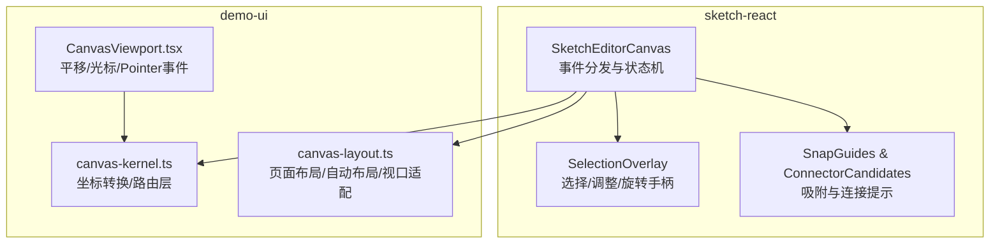
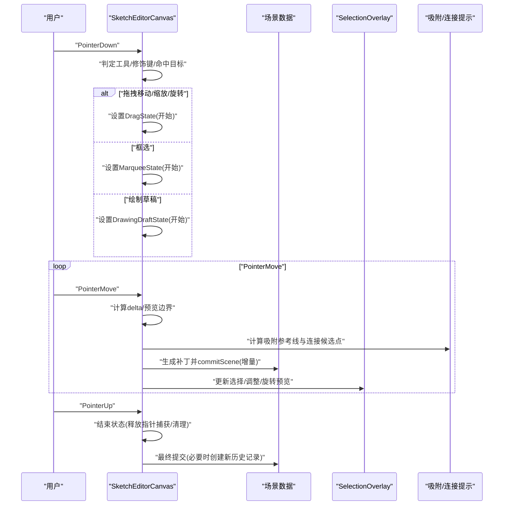
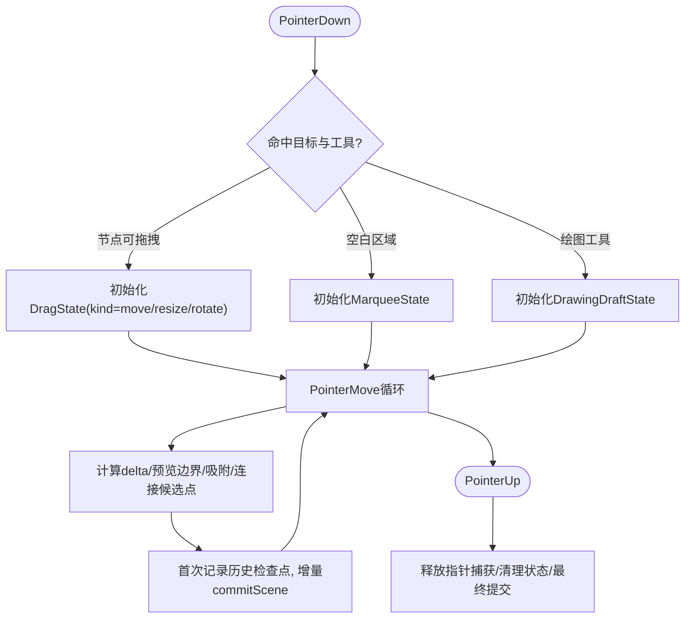
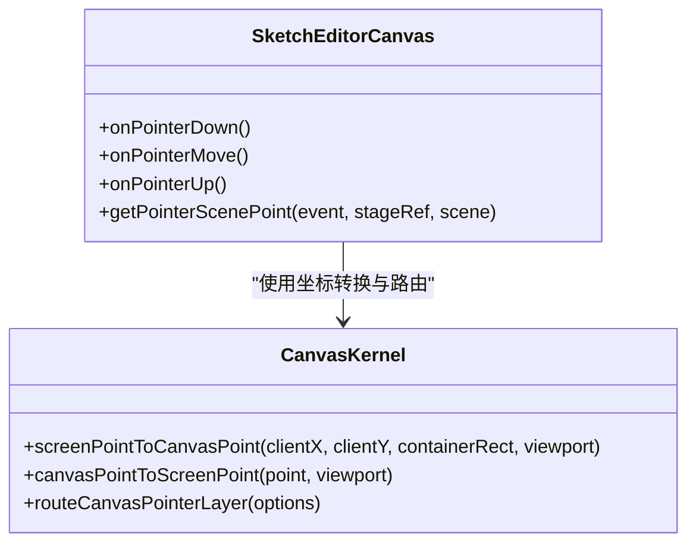
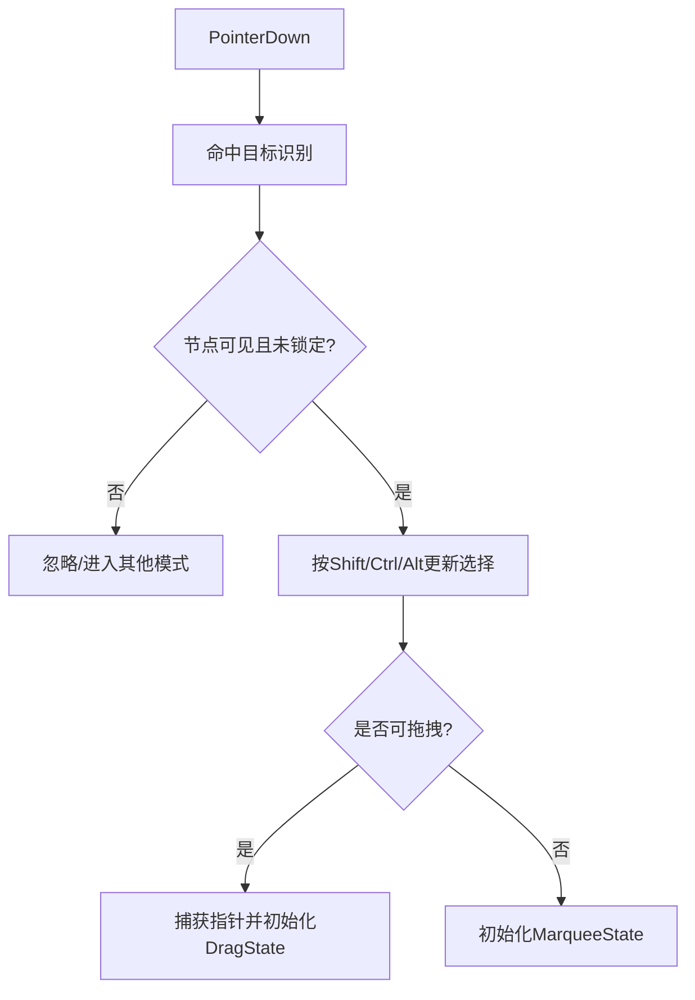
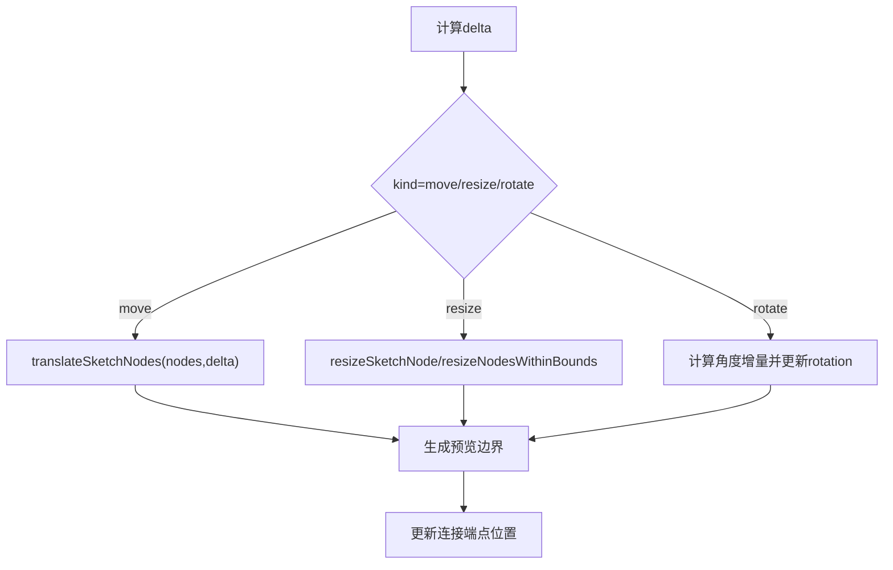
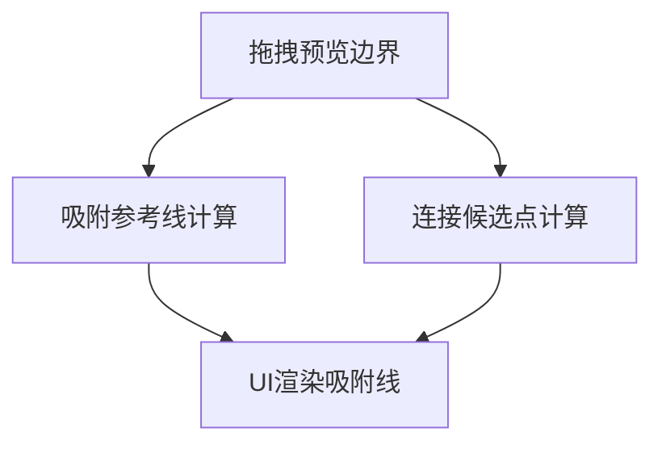
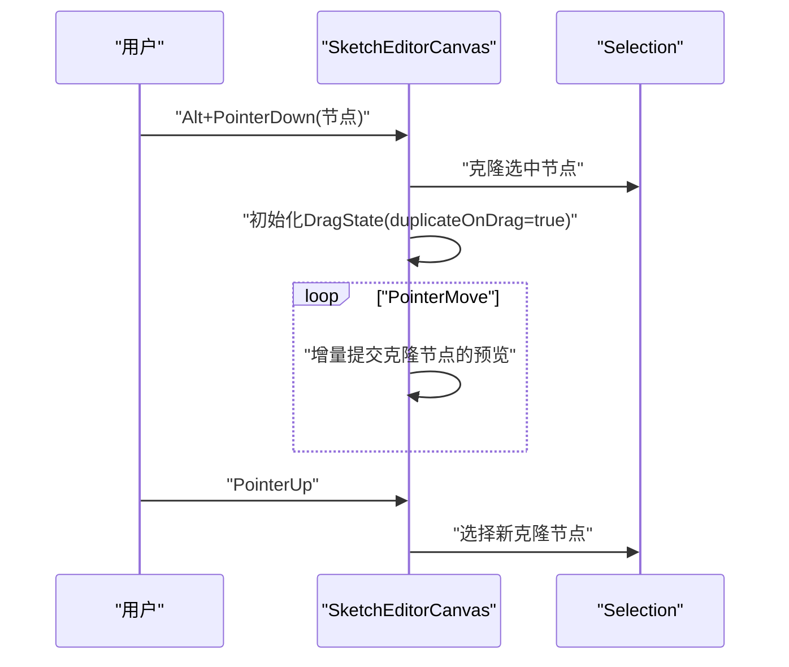
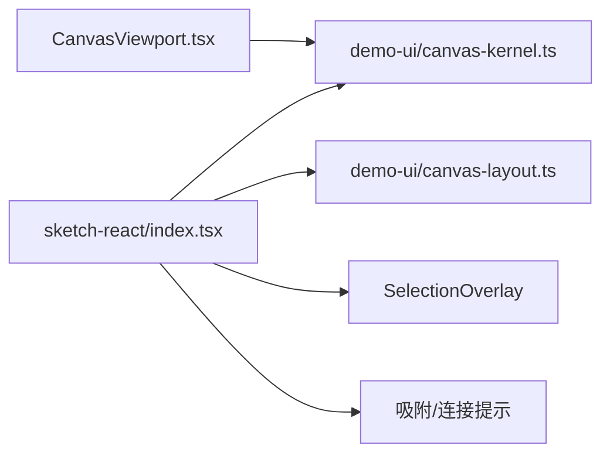

# 拖拽系统

<cite>
**本文引用的文件**
- [packages/sketch-react/src/index.tsx](file://packages/sketch-react/src/index.tsx)
- [packages/demo-ui/src/canvas-kernel.ts](file://packages/demo-ui/src/canvas-kernel.ts)
- [packages/demo-ui/src/canvas-layout.ts](file://packages/demo-ui/src/canvas-layout.ts)
- [packages/demo-ui/src/CanvasViewport.tsx](file://packages/demo-ui/src/CanvasViewport.tsx)
- [packages/sketch-react/tests/sketch-react.test.tsx](file://packages/sketch-react/tests/sketch-react.test.tsx)
</cite>

## 目录
1. [简介](#简介)
2. [项目结构](#项目结构)
3. [核心组件](#核心组件)
4. [架构总览](#架构总览)
5. [详细组件分析](#详细组件分析)
6. [依赖关系分析](#依赖关系分析)
7. [性能考量](#性能考量)
8. [故障排查指南](#故障排查指南)
9. [结论](#结论)
10. [附录](#附录)

## 简介
本技术文档围绕画布拖拽系统，系统性阐述鼠标事件监听、拖拽起始点检测算法与移动轨迹计算逻辑；详述拖拽状态管理机制（开始、进行中、结束）及边界约束处理；解释多元素拖拽的批量处理与相对位置保持方案；介绍拖拽反馈机制（视觉预览、吸附对齐、连接候选点提示）；并提供自定义拖拽行为的扩展方法与事件回调处理指南；最后给出性能优化策略与移动端触摸事件的适配要点。

## 项目结构
仓库中与拖拽系统密切相关的代码主要分布在以下模块：
- sketch-react 包：提供完整的画布编辑器交互能力，包括指针捕获、拖拽/缩放/旋转、框选、吸附参考线、连接候选点等。
- demo-ui 包：提供画布内核工具函数（坐标转换、布局归一化、自动布局、视口适配等），以及一个独立的 CanvasViewport 组件用于演示视图平移与光标样式。
- 测试用例：覆盖拖拽历史合并、指针捕获释放、多选拖拽一致性等行为验证。

图表来源
- [packages/sketch-react/src/index.tsx:6313-6590](file://packages/sketch-react/src/index.tsx#L6313-L6590)
- [packages/demo-ui/src/canvas-kernel.ts:33-81](file://packages/demo-ui/src/canvas-kernel.ts#L33-L81)
- [packages/demo-ui/src/canvas-layout.ts:190-334](file://packages/demo-ui/src/canvas-layout.ts#L190-L334)
- [packages/demo-ui/src/CanvasViewport.tsx:308-340](file://packages/demo-ui/src/CanvasViewport.tsx#L308-L340)

章节来源
- [packages/sketch-react/src/index.tsx:6313-6590](file://packages/sketch-react/src/index.tsx#L6313-L6590)
- [packages/demo-ui/src/canvas-kernel.ts:33-81](file://packages/demo-ui/src/canvas-kernel.ts#L33-L81)
- [packages/demo-ui/src/canvas-layout.ts:190-334](file://packages/demo-ui/src/canvas-layout.ts#L190-L334)
- [packages/demo-ui/src/CanvasViewport.tsx:308-340](file://packages/demo-ui/src/CanvasViewport.tsx#L308-L340)

## 核心组件
- SketchEditorCanvas：统一处理 Pointer 事件、键盘快捷键、拖拽/缩放/旋转、框选、绘制草稿、粘贴/拖放图片、右键菜单等。内部维护 DragState、MarqueeState、DrawingDraftState 等状态，并通过控制器提交场景变更。
- SelectionOverlay：渲染选择框、调整手柄、旋转中心点、连接端点手柄等交互控件。
- 吸附与连接提示：在拖拽过程中计算吸附参考线与连接候选点，以可视化方式辅助对齐与连线。
- 画布内核与布局工具：提供屏幕坐标与场景坐标互转、工具模式路由、页面布局归一化、自动布局与视口适配等通用能力。

章节来源
- [packages/sketch-react/src/index.tsx:6313-6590](file://packages/sketch-react/src/index.tsx#L6313-L6590)
- [packages/sketch-react/src/index.tsx:6841-6910](file://packages/sketch-react/src/index.tsx#L6841-L6910)
- [packages/sketch-react/src/index.tsx:6911-6970](file://packages/sketch-react/src/index.tsx#L6911-L6970)
- [packages/demo-ui/src/canvas-kernel.ts:33-81](file://packages/demo-ui/src/canvas-kernel.ts#L33-L81)
- [packages/demo-ui/src/canvas-layout.ts:190-334](file://packages/demo-ui/src/canvas-layout.ts#L190-L334)

## 架构总览
拖拽系统的整体流程如下：
- 输入层：PointerDown/Move/Up 事件由容器与舞台节点接收，结合键盘修饰键与当前工具模式进行路由。
- 状态机：根据命中目标与操作类型进入不同状态（平移、拖拽移动、拖拽缩放、拖拽旋转、框选、绘制草稿）。
- 计算层：在 Move 阶段计算 delta、预览边界、吸附参考线与连接候选点，生成补丁操作集。
- 提交层：首次有效变更时记录历史检查点，随后增量提交场景更新，避免频繁重排。
- 输出层：通过 SelectionOverlay 与吸附/连接提示提供即时反馈。

图表来源
- [packages/sketch-react/src/index.tsx:6313-6590](file://packages/sketch-react/src/index.tsx#L6313-L6590)
- [packages/sketch-react/src/index.tsx:6841-6910](file://packages/sketch-react/src/index.tsx#L6841-L6910)
- [packages/sketch-react/src/index.tsx:6911-6970](file://packages/sketch-react/src/index.tsx#L6911-L6970)

## 详细组件分析

### 拖拽状态机与事件流
- 拖拽开始
  - 条件：选中节点且非锁定，或按住 Alt 复制，或从选择框外空白区域按下触发框选。
  - 动作：捕获指针、记录初始场景快照、初始化 DragState（包含 kind、nodes、pointer、initialScene、hasHistoryCheckpoint、duplicateOnDrag 等）。
- 拖拽进行中
  - 计算：根据 currentPointer 与 pointer 差值得到 delta；对 move 使用 translateSketchNodes，对 resize 使用 resizeSketchNode/resizeNodesWithinBounds，对 rotate 计算角度增量。
  - 预览：计算预览边界 getDragPreviewBounds，生成吸附参考线与连接候选点。
  - 提交：首次有效变更时记录历史检查点，随后 commitScene(false) 增量更新。
- 拖拽结束
  - 行为：释放指针捕获、清空临时状态；针对连接线端点拖拽，尝试吸附到最近连接候选点并绑定。
  - 框选：根据 Marquee 矩形框内命中节点集合更新选择。

图表来源
- [packages/sketch-react/src/index.tsx:6313-6590](file://packages/sketch-react/src/index.tsx#L6313-L6590)
- [packages/sketch-react/src/index.tsx:6800-6805](file://packages/sketch-react/src/index.tsx#L6800-L6805)

章节来源
- [packages/sketch-react/src/index.tsx:6313-6590](file://packages/sketch-react/src/index.tsx#L6313-L6590)
- [packages/sketch-react/src/index.tsx:6800-6805](file://packages/sketch-react/src/index.tsx#L6800-L6805)

### 鼠标事件监听与坐标转换
- 事件监听
  - 容器级 onPointerDown/Move/Up 负责平移、粘贴/拖放图片、上下文菜单等。
  - 舞台级 onPointerDown/Move/Up 负责节点命中、选择、拖拽、框选、绘制草稿等。
- 坐标转换
  - 将 clientX/clientY 转换为场景坐标，考虑视口偏移与缩放。
  - 提供 screenPointToCanvasPoint 与 canvasPointToScreenPoint 等工具函数。
- 工具模式路由
  - 根据 toolMode、空格+左键、中键、是否命中页面/标注等决定 PointerLayer，从而分流到 kernel/page-preview/free-annotation/overlay 等不同处理路径。

图表来源
- [packages/demo-ui/src/canvas-kernel.ts:33-81](file://packages/demo-ui/src/canvas-kernel.ts#L33-L81)
- [packages/sketch-react/src/index.tsx:6313-6590](file://packages/sketch-react/src/index.tsx#L6313-L6590)

章节来源
- [packages/demo-ui/src/canvas-kernel.ts:33-81](file://packages/demo-ui/src/canvas-kernel.ts#L33-L81)
- [packages/sketch-react/src/index.tsx:6313-6590](file://packages/sketch-react/src/index.tsx#L6313-L6590)

### 拖拽起始点检测算法
- 命中目标识别
  - 优先读取 data-sketch-node-id 或 data-sketch-node-label 属性，否则执行 hitTestSketchScene 进行几何命中。
  - 过滤不可见/锁定节点，确保仅对可编辑节点生效。
- 选择策略
  - Shift 多选/取消选择；Cmd/Ctrl 点击在命中候选集中切换当前选中项；空白处按下启动框选。
- 复制拖拽
  - Alt 拖动时克隆选中节点作为拖拽副本，并在结束时选择新节点。

图表来源
- [packages/sketch-react/src/index.tsx:6698-6805](file://packages/sketch-react/src/index.tsx#L6698-L6805)

章节来源
- [packages/sketch-react/src/index.tsx:6698-6805](file://packages/sketch-react/src/index.tsx#L6698-L6805)

### 移动轨迹计算与批量处理
- 单元素与多元素
  - move：translateSketchNodes(nodes, delta) 对每个节点应用相同位移，保持相对位置不变。
  - resize：基于 resizeHandle 与可选的 preserveAspectRatio（Shift）计算新尺寸，支持整组从选择边界缩放。
  - rotate：以选择中心为轴心，计算角度增量并更新 rotation。
- 连接跟随
  - 拖拽过程中同步更新连接的端点位置，保证连线随节点移动而更新。
- 边界约束
  - 文本绘制草稿时 clampScenePoint 限制在页面范围内；箭头/线条端点拖拽在结束时尝试吸附到连接候选点。

图表来源
- [packages/sketch-react/src/index.tsx:6399-6508](file://packages/sketch-react/src/index.tsx#L6399-L6508)

章节来源
- [packages/sketch-react/src/index.tsx:6399-6508](file://packages/sketch-react/src/index.tsx#L6399-L6508)

### 拖拽反馈机制
- 视觉预览
  - SelectionOverlay 显示选择框、调整手柄、旋转中心点；拖拽过程中实时更新预览。
- 吸附对齐
  - 计算吸附参考线（网格、中心、边缘、间距），支持 Cmd/Ctrl 临时隐藏。
- 连接候选点
  - 在拖拽/调整端点时高亮候选连接点，松开后自动绑定或更新端点坐标。

图表来源
- [packages/sketch-react/src/index.tsx:6911-6970](file://packages/sketch-react/src/index.tsx#L6911-L6970)
- [packages/sketch-react/src/index.tsx:2272-2287](file://packages/sketch-react/src/index.tsx#L2272-L2287)

章节来源
- [packages/sketch-react/src/index.tsx:6911-6970](file://packages/sketch-react/src/index.tsx#L6911-L6970)
- [packages/sketch-react/src/index.tsx:2272-2287](file://packages/sketch-react/src/index.tsx#L2272-L2287)

### 多元素拖拽与相对位置保持
- 选中集合
  - 通过 setNodeIds 管理 nodeIds，selectionFromIds 派生 selection。
- 批量操作
  - 所有选中节点共享同一 delta，保持彼此相对位置不变。
- 复制拖拽
  - Alt 拖动时克隆选中节点，拖拽结束后选择新节点，撤销一次即可移除克隆。

图表来源
- [packages/sketch-react/src/index.tsx:6774-6790](file://packages/sketch-react/src/index.tsx#L6774-L6790)
- [packages/sketch-react/tests/sketch-react.test.tsx:2061-2092](file://packages/sketch-react/tests/sketch-react.test.tsx#L2061-L2092)

章节来源
- [packages/sketch-react/src/index.tsx:6774-6790](file://packages/sketch-react/src/index.tsx#L6774-L6790)
- [packages/sketch-react/tests/sketch-react.test.tsx:2061-2092](file://packages/sketch-react/tests/sketch-react.test.tsx#L2061-L2092)

### 自定义拖拽行为的开发指南
- 扩展拖拽操作器
  - 在 DragState.kind 新增分支（如“滑动”、“弹性”），在 onPointerMove 中实现对应变换逻辑，并生成预览边界与补丁操作。
- 事件回调处理
  - 利用 controller.applyOperations/commitScene 提交变更；在首次有效变更时调用 recordHistoryCheckpoint 建立撤销检查点。
- 吸附与碰撞
  - 复用 getSketchSnapGuides 与 getConnectorCandidatePoints 提供的吸附与连接提示能力，按需扩展阈值与规则。
- 可视化反馈
  - 通过 SelectionOverlay 与自定义 overlay 组件展示拖拽预览与辅助线。

章节来源
- [packages/sketch-react/src/index.tsx:6399-6508](file://packages/sketch-react/src/index.tsx#L6399-L6508)
- [packages/sketch-react/src/index.tsx:2272-2287](file://packages/sketch-react/src/index.tsx#L2272-L2287)

### 性能优化策略
- 增量提交
  - 仅在首次有效变更时记录历史检查点，后续使用 commitScene(false) 增量更新，减少重排与重绘。
- 指针捕获
  - 使用 setPointerCapture/releasePointerCapture 确保跨元素移动稳定，避免丢失事件。
- 节流采样
  - 铅笔绘制时对点采样距离进行判断，避免过多点导致性能问题。
- 视口与缩放
  - 使用 normalizeViewport/zoomViewportAt 控制缩放与平移，配合 willChange 提升合成性能。

章节来源
- [packages/sketch-react/src/index.tsx:6431-6508](file://packages/sketch-react/src/index.tsx#L6431-L6508)
- [packages/sketch-react/src/index.tsx:6104-6128](file://packages/sketch-react/src/index.tsx#L6104-L6128)
- [packages/sketch-react/src/index.tsx:6368-6388](file://packages/sketch-react/src/index.tsx#L6368-L6388)
- [packages/demo-ui/src/CanvasViewport.tsx:544-554](file://packages/demo-ui/src/CanvasViewport.tsx#L544-L554)

### 移动端触摸事件适配方案
- Pointer Events 统一
  - 使用 PointerDown/Move/Up 兼容鼠标与触摸，无需分别处理 mouse/touch。
- 手势与修饰键
  - 移动端无 Alt/Cmd/Ctrl，可通过 UI 按钮或长按模拟复制/等比缩放等修饰行为。
- 多点触控
  - 如需双指缩放/平移，可在容器层监听 wheel 与 pinch 手势，结合 zoomViewportAt/normalizeViewport 实现。
- 指针捕获
  - 移动端同样适用 setPointerCapture，确保拖拽过程不丢失事件。

章节来源
- [packages/sketch-react/src/index.tsx:6313-6590](file://packages/sketch-react/src/index.tsx#L6313-L6590)
- [packages/sketch-react/src/index.tsx:6104-6128](file://packages/sketch-react/src/index.tsx#L6104-L6128)

## 依赖关系分析
- 组件耦合
  - SketchEditorCanvas 依赖 SelectionOverlay 与吸附/连接提示组件进行反馈渲染。
  - 坐标转换与路由逻辑来自 canvas-kernel，布局与视口适配来自 canvas-layout。
- 外部依赖
  - 浏览器原生 Pointer API、DOMRect、setPointerCapture/releasePointerCapture。
  - React Hooks 与状态管理（useState/useEffect/useCallback）驱动 UI 更新。

图表来源
- [packages/sketch-react/src/index.tsx:6313-6590](file://packages/sketch-react/src/index.tsx#L6313-L6590)
- [packages/demo-ui/src/canvas-kernel.ts:33-81](file://packages/demo-ui/src/canvas-kernel.ts#L33-L81)
- [packages/demo-ui/src/canvas-layout.ts:190-334](file://packages/demo-ui/src/canvas-layout.ts#L190-L334)
- [packages/demo-ui/src/CanvasViewport.tsx:308-340](file://packages/demo-ui/src/CanvasViewport.tsx#L308-L340)

章节来源
- [packages/sketch-react/src/index.tsx:6313-6590](file://packages/sketch-react/src/index.tsx#L6313-L6590)
- [packages/demo-ui/src/canvas-kernel.ts:33-81](file://packages/demo-ui/src/canvas-kernel.ts#L33-L81)
- [packages/demo-ui/src/canvas-layout.ts:190-334](file://packages/demo-ui/src/canvas-layout.ts#L190-L334)
- [packages/demo-ui/src/CanvasViewport.tsx:308-340](file://packages/demo-ui/src/CanvasViewport.tsx#L308-L340)

## 性能考量
- 增量提交与历史检查点：避免每次移动都创建新的历史记录，提高撤销/重做效率。
- 指针捕获：减少事件丢失导致的抖动与卡顿。
- 点采样与阈值：绘制草稿时对点进行采样，降低点数带来的渲染压力。
- 视口变换与 GPU 加速：合理使用 transform 与 willChange，提升合成性能。

[本节为通用指导，不直接分析具体文件]

## 故障排查指南
- 拖拽无效
  - 检查节点是否被锁定或不可见；确认命中目标是否正确识别。
- 吸附不生效
  - 确认是否按住 Cmd/Ctrl 临时隐藏了吸附参考线；检查吸附阈值与边界范围。
- 连接未绑定
  - 查看连接候选点是否出现；确认端点拖拽结束时是否命中候选点。
- 多选拖拽不一致
  - 验证是否共享同一 delta；检查是否有节点被锁定或不可见。

章节来源
- [packages/sketch-react/src/index.tsx:6698-6805](file://packages/sketch-react/src/index.tsx#L6698-L6805)
- [packages/sketch-react/src/index.tsx:6911-6970](file://packages/sketch-react/src/index.tsx#L6911-L6970)
- [packages/sketch-react/tests/sketch-react.test.tsx:3147-3171](file://packages/sketch-react/tests/sketch-react.test.tsx#L3147-L3171)

## 结论
该拖拽系统以 Pointer Events 为核心，结合清晰的状态机与增量提交机制，实现了高性能、可扩展的画布交互体验。通过统一的坐标转换与路由、完善的吸附与连接提示、以及对多元素拖拽与复制的支持，满足了复杂设计场景下的交互需求。开发者可在此基础上扩展自定义拖拽行为，并结合性能优化策略与移动端适配方案，构建更丰富的画布应用。

[本节为总结性内容，不直接分析具体文件]

## 附录
- 关键术语
  - DragState：描述拖拽操作的完整状态，包括起始指针、当前指针、修饰键、操作对象、操作类型、历史检查点等。
  - MarqueeState：描述框选矩形的起止点。
  - DrawingDraftState：描述绘制草稿的起点、当前点与点序列。
- 相关测试
  - 拖拽历史合并：一次拖拽视为一个历史步骤。
  - 指针捕获与释放：拖拽开始时捕获，结束时释放。
  - 多选拖拽一致性：共享 delta，保持相对位置。

章节来源
- [packages/sketch-react/tests/sketch-react.test.tsx:1679-1716](file://packages/sketch-react/tests/sketch-react.test.tsx#L1679-L1716)
- [packages/sketch-react/tests/sketch-react.test.tsx:1715-1751](file://packages/sketch-react/tests/sketch-react.test.tsx#L1715-L1751)
- [packages/sketch-react/tests/sketch-react.test.tsx:3147-3171](file://packages/sketch-react/tests/sketch-react.test.tsx#L3147-L3171)