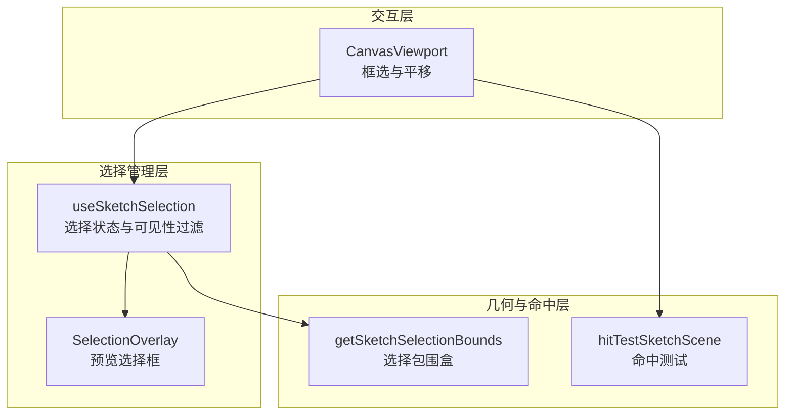
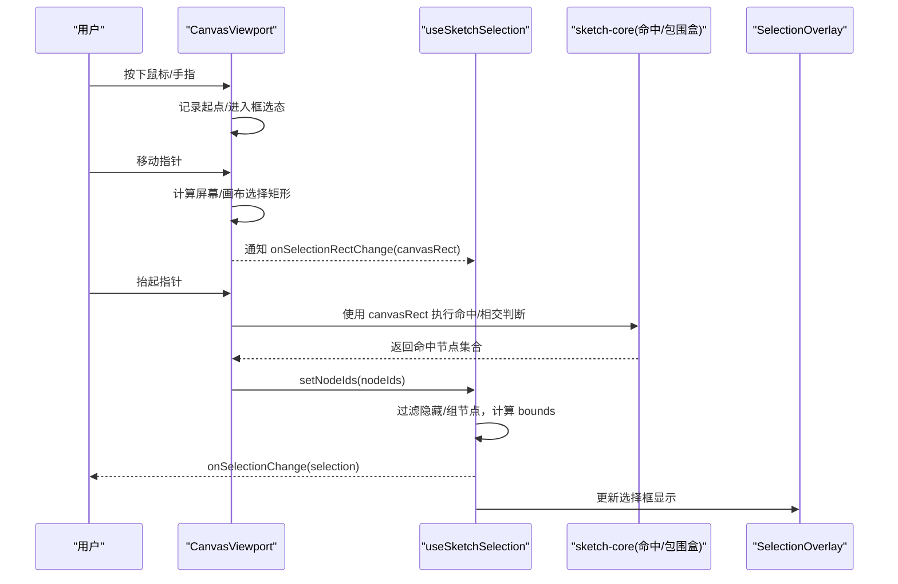
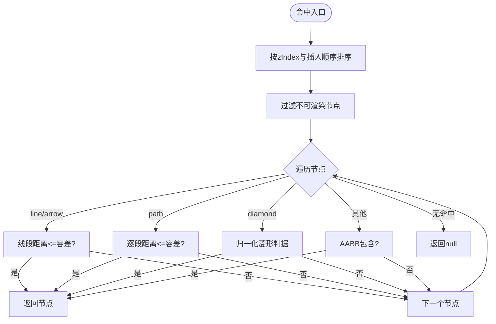
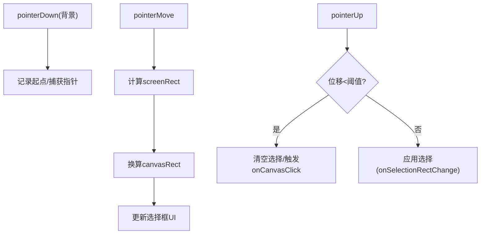
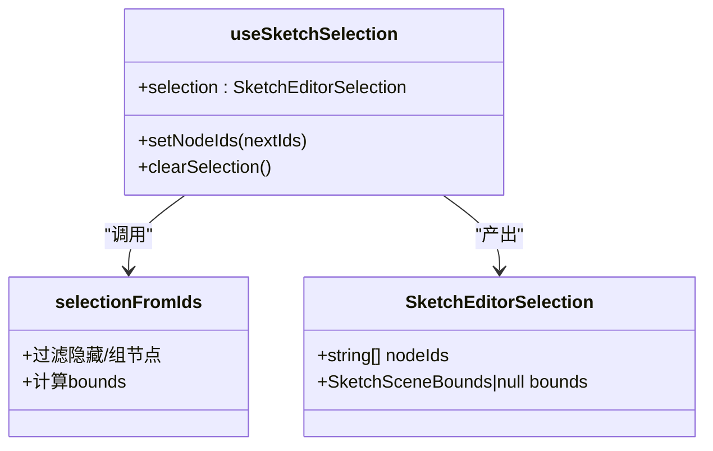
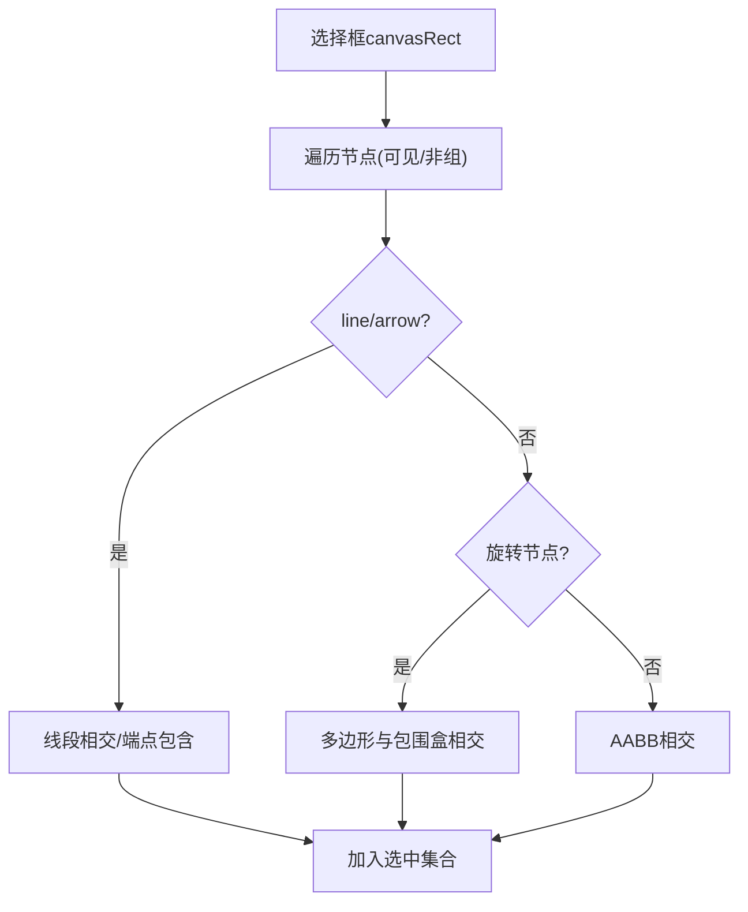
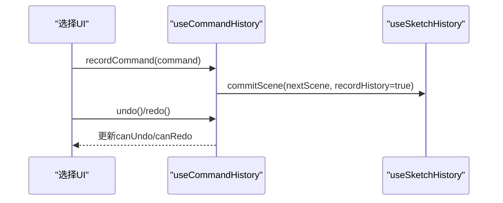
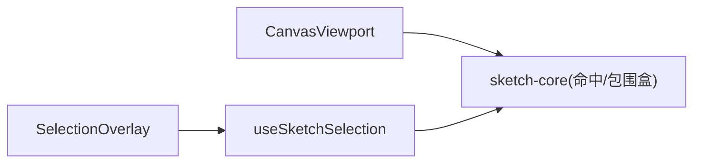

# 选择系统

<cite>
**本文引用的文件**
- [packages/sketch-react/src/index.tsx](file://packages/sketch-react/src/index.tsx)
- [packages/sketch-react/src/preview.tsx](file://packages/sketch-react/src/preview.tsx)
- [packages/demo-ui/src/CanvasViewport.tsx](file://packages/demo-ui/src/CanvasViewport.tsx)
- [packages/sketch-core/src/index.ts](file://packages/sketch-core/src/index.ts)
- [packages/sketch-core/tests/sketch-core.test.ts](file://packages/sketch-core/tests/sketch-core.test.ts)
- [packages/sketch-react/tests/sketch-react.test.tsx](file://packages/sketch-react/tests/sketch-react.test.tsx)
- [packages/author-site/src/app/demo/[id]/edit/hooks/useCommandHistory.ts](file://packages/author-site/src/app/demo/[id]/edit/hooks/useCommandHistory.ts)
</cite>

## 目录
1. [简介](#简介)
2. [项目结构](#项目结构)
3. [核心组件](#核心组件)
4. [架构总览](#架构总览)
5. [详细组件分析](#详细组件分析)
6. [依赖关系分析](#依赖关系分析)
7. [性能考虑](#性能考虑)
8. [故障排查指南](#故障排查指南)
9. [结论](#结论)
10. [附录](#附录)

## 简介
本文件面向画布选择系统，系统性说明单选与多选的实现机制、框选区域计算、选中状态管理、选择框绘制逻辑（含虚线边框渲染、动态尺寸调整与边界溢出处理）、复杂场景下的选择行为（嵌套元素优先级、隐藏元素过滤、只读元素过滤），以及选择状态的持久化（撤销重做）与同步策略。同时提供扩展接口说明（自定义选择模式与事件订阅）和大数据量场景的性能优化方案。

## 项目结构
选择系统由三层组成：
- 交互层：负责指针事件、平移/缩放、框选区域计算与选择框绘制
- 选择管理层：维护选中节点集合、可见性过滤、选择边界计算与变更回调
- 几何与命中层：提供命中测试、旋转/路径/线段等几何判定、选择包围盒合并

图表来源
- [packages/demo-ui/src/CanvasViewport.tsx:121-147](file://packages/demo-ui/src/CanvasViewport.tsx#L121-L147)
- [packages/sketch-react/src/index.tsx:759-796](file://packages/sketch-react/src/index.tsx#L759-L796)
- [packages/sketch-react/src/preview.tsx:130-160](file://packages/sketch-react/src/preview.tsx#L130-L160)
- [packages/sketch-core/src/index.ts:1478-1492](file://packages/sketch-core/src/index.ts#L1478-L1492)
- [packages/sketch-core/src/index.ts:1670-1707](file://packages/sketch-core/src/index.ts#L1670-L1707)

章节来源
- [packages/demo-ui/src/CanvasViewport.tsx:121-147](file://packages/demo-ui/src/CanvasViewport.tsx#L121-L147)
- [packages/sketch-react/src/index.tsx:759-796](file://packages/sketch-react/src/index.tsx#L759-L796)
- [packages/sketch-react/src/preview.tsx:130-160](file://packages/sketch-react/src/preview.tsx#L130-L160)
- [packages/sketch-core/src/index.ts:1478-1492](file://packages/sketch-core/src/index.ts#L1478-L1492)
- [packages/sketch-core/src/index.ts:1670-1707](file://packages/sketch-core/src/index.ts#L1670-L1707)

## 核心组件
- CanvasViewport：处理指针事件、平移/缩放、框选区域计算与选择框绘制，支持在“选择”模式下背景拖拽触发框选；在“手型”模式下通过空格或中键进行平移。
- useSketchSelection：维护选中节点 ID 列表，基于配置数据过滤不可见节点，计算选择包围盒，并对外暴露 setNodeIds/clearSelection 与 onSelectionChange 回调。
- SelectionOverlay：在预览模式下根据选择包围盒渲染选择框，支持最小尺寸限制与缩放适配。
- hitTestSketchScene：按 z-index 与渲染可见性排序后，对 line/arrow/path/diamond/普通矩形等进行命中测试。
- getSketchSelectionBounds：合并多个节点的视觉包围盒（考虑旋转），返回统一的选择包围盒。

章节来源
- [packages/demo-ui/src/CanvasViewport.tsx:341-420](file://packages/demo-ui/src/CanvasViewport.tsx#L341-L420)
- [packages/sketch-react/src/index.tsx:1060-1090](file://packages/sketch-react/src/index.tsx#L1060-L1090)
- [packages/sketch-react/src/preview.tsx:130-160](file://packages/sketch-react/src/preview.tsx#L130-L160)
- [packages/sketch-core/src/index.ts:1670-1707](file://packages/sketch-core/src/index.ts#L1670-L1707)
- [packages/sketch-core/src/index.ts:1478-1492](file://packages/sketch-core/src/index.ts#L1478-L1492)

## 架构总览
选择流程从交互层开始，经选择管理层到几何与命中层，最终回写 UI 与外部回调。

图表来源
- [packages/demo-ui/src/CanvasViewport.tsx:341-420](file://packages/demo-ui/src/CanvasViewport.tsx#L341-L420)
- [packages/sketch-react/src/index.tsx:759-796](file://packages/sketch-react/src/index.tsx#L759-L796)
- [packages/sketch-core/src/index.ts:1670-1707](file://packages/sketch-core/src/index.ts#L1670-L1707)
- [packages/sketch-react/src/preview.tsx:130-160](file://packages/sketch-react/src/preview.tsx#L130-L160)

## 详细组件分析

### 点击检测算法与命中测试
- 命中顺序：按 zIndex 降序，同层按插入顺序倒序，确保上层优先命中。
- 特殊类型：
  - line/arrow：使用线段距离容差（strokeWidth/2+3，至少为6）进行命中。
  - path：遍历折线段，采用点到线段距离容差命中。
  - diamond：菱形内判据 normalizedX + normalizedY <= 1。
  - 其他：轴对齐包围盒命中。
- 局部坐标变换：命中前对点按节点旋转中心逆旋转到局部坐标系。

图表来源
- [packages/sketch-core/src/index.ts:1670-1707](file://packages/sketch-core/src/index.ts#L1670-L1707)
- [packages/sketch-core/src/index.ts:1630-1659](file://packages/sketch-core/src/index.ts#L1630-L1659)
- [packages/sketch-core/src/index.ts:1661-1668](file://packages/sketch-core/src/index.ts#L1661-L1668)

章节来源
- [packages/sketch-core/src/index.ts:1670-1707](file://packages/sketch-core/src/index.ts#L1670-L1707)
- [packages/sketch-core/tests/sketch-core.test.ts:1264-1291](file://packages/sketch-core/tests/sketch-core.test.ts#L1264-L1291)
- [packages/sketch-core/tests/sketch-core.test.ts:1293-1322](file://packages/sketch-core/tests/sketch-core.test.ts#L1293-L1322)

### 框选区域计算与选择框绘制
- 屏幕坐标到画布坐标转换：依据容器边界、视口偏移与缩放因子换算。
- 框选矩形：以起始点与当前点确定 screenRect，再转换为 canvasRect。
- 选择框绘制：
  - 编辑模式：在 CanvasViewport 中以绝对定位 div 渲染半透明填充与边框。
  - 预览模式：SelectionOverlay 根据选择包围盒与缩放比例绘制蓝色边框，支持 minimumSize 保证最小可视尺寸。
- 虚线边框：选择框本身为实线边框；若需虚线风格，可结合样式类实现（示例参考线型预设映射）。

图表来源
- [packages/demo-ui/src/CanvasViewport.tsx:121-147](file://packages/demo-ui/src/CanvasViewport.tsx#L121-L147)
- [packages/demo-ui/src/CanvasViewport.tsx:341-420](file://packages/demo-ui/src/CanvasViewport.tsx#L341-L420)
- [packages/sketch-react/src/preview.tsx:130-160](file://packages/sketch-react/src/preview.tsx#L130-L160)

章节来源
- [packages/demo-ui/src/CanvasViewport.tsx:121-147](file://packages/demo-ui/src/CanvasViewport.tsx#L121-L147)
- [packages/demo-ui/src/CanvasViewport.tsx:341-420](file://packages/demo-ui/src/CanvasViewport.tsx#L341-L420)
- [packages/sketch-react/src/preview.tsx:130-160](file://packages/sketch-react/src/preview.tsx#L130-L160)

### 选中状态管理与可见性过滤
- 状态来源：setNodeIds 接收去重后的节点 ID 列表。
- 可见性过滤：
  - 组节点不参与选择。
  - 通过 bindings.visible 解析为 false 的节点视为隐藏。
  - 图片节点若 src 为空则不纳入选择边界。
- 选择边界：仅对可见节点计算 getSketchSelectionBounds，若无可见节点则 bounds 为 null。
- 变更回调：selection 变化时触发 onSelectionChange，且内部使用 selectionsEqual 避免重复回调。

图表来源
- [packages/sketch-react/src/index.tsx:759-796](file://packages/sketch-react/src/index.tsx#L759-L796)
- [packages/sketch-react/src/index.tsx:1060-1090](file://packages/sketch-react/src/index.tsx#L1060-L1090)
- [packages/sketch-react/src/preview.tsx:74-97](file://packages/sketch-react/src/preview.tsx#L74-L97)

章节来源
- [packages/sketch-react/src/index.tsx:759-796](file://packages/sketch-react/src/index.tsx#L759-L796)
- [packages/sketch-react/src/index.tsx:1060-1090](file://packages/sketch-react/src/index.tsx#L1060-L1090)
- [packages/sketch-react/src/preview.tsx:74-97](file://packages/sketch-react/src/preview.tsx#L74-L97)
- [packages/sketch-react/tests/sketch-react.test.tsx:1443-1473](file://packages/sketch-react/tests/sketch-react.test.tsx#L1443-L1473)

### 复杂场景下的选择行为
- 嵌套元素优先级：命中测试按 z-index 与插入顺序决定顶层命中；选择框相交判断针对旋转节点使用多边形与包围盒相交。
- 隐藏元素处理：组节点与 visible=false 的节点不参与选择边界计算；图片空 src 亦被过滤。
- 只读元素过滤：锁定/只读元素可通过属性控制是否允许操作（如 locked 字段），在选择阶段可按业务规则决定是否纳入。

图表来源
- [packages/sketch-react/src/index.tsx:968-989](file://packages/sketch-react/src/index.tsx#L968-L989)
- [packages/sketch-core/src/index.ts:1478-1492](file://packages/sketch-core/src/index.ts#L1478-L1492)
- [packages/sketch-core/src/index.ts:1670-1707](file://packages/sketch-core/src/index.ts#L1670-L1707)

章节来源
- [packages/sketch-react/src/index.tsx:968-989](file://packages/sketch-react/src/index.tsx#L968-L989)
- [packages/sketch-core/src/index.ts:1478-1492](file://packages/sketch-core/src/index.ts#L1478-L1492)
- [packages/sketch-core/src/index.ts:1670-1707](file://packages/sketch-core/src/index.ts#L1670-L1707)

### 选择状态的持久化与撤销重做
- 命令历史：通过命令栈记录 redo/undo，支持键盘快捷键绑定与运行中保护。
- 场景历史：useSketchHistory 维护 past/future 栈，commitScene 时入栈并触发 onSceneChange。
- 选择状态同步：选择变更通过 onSelectionChange 上报，宿主可将选择结果写入持久化存储或与协作状态同步。

图表来源
- [packages/author-site/src/app/demo/[id]/edit/hooks/useCommandHistory.ts:40-154](file://packages/author-site/src/app/demo/[id]/edit/hooks/useCommandHistory.ts#L40-L154)
- [packages/sketch-react/src/index.tsx:1092-1126](file://packages/sketch-react/src/index.tsx#L1092-L1126)

章节来源
- [packages/author-site/src/app/demo/[id]/edit/hooks/useCommandHistory.ts:40-154](file://packages/author-site/src/app/demo/[id]/edit/hooks/useCommandHistory.ts#L40-L154)
- [packages/sketch-react/src/index.tsx:1092-1126](file://packages/sketch-react/src/index.tsx#L1092-L1126)

### 扩展接口与事件订阅
- 自定义选择模式：可在 CanvasViewport 中扩展工具模式，并在 pointerDown/move/up 分支中接入新的选择逻辑；或通过 useSketchSelection 的 setNodeIds 直接驱动选择状态。
- 事件订阅：
  - onSelectionChange：选择变更回调，适合订阅选择状态变化。
  - onSelectionRectChange：框选过程中实时回调 canvasRect，便于高亮或预检。
  - onNodeSelect/onCanvasClick：单点选择与空白点击取消选择。

章节来源
- [packages/demo-ui/src/CanvasViewport.tsx:341-420](file://packages/demo-ui/src/CanvasViewport.tsx#L341-L420)
- [packages/sketch-react/src/index.tsx:1060-1090](file://packages/sketch-react/src/index.tsx#L1060-L1090)
- [packages/sketch-react/src/preview.tsx:162-204](file://packages/sketch-react/src/preview.tsx#L162-L204)

## 依赖关系分析
- 交互层依赖几何层进行坐标换算与命中测试。
- 选择管理层依赖几何层计算选择包围盒，并对节点可见性进行过滤。
- 预览层依赖选择管理层提供的 bounds 渲染选择框。

图表来源
- [packages/demo-ui/src/CanvasViewport.tsx:121-147](file://packages/demo-ui/src/CanvasViewport.tsx#L121-L147)
- [packages/sketch-react/src/index.tsx:759-796](file://packages/sketch-react/src/index.tsx#L759-L796)
- [packages/sketch-react/src/preview.tsx:130-160](file://packages/sketch-react/src/preview.tsx#L130-L160)
- [packages/sketch-core/src/index.ts:1478-1492](file://packages/sketch-core/src/index.ts#L1478-L1492)
- [packages/sketch-core/src/index.ts:1670-1707](file://packages/sketch-core/src/index.ts#L1670-L1707)

章节来源
- [packages/demo-ui/src/CanvasViewport.tsx:121-147](file://packages/demo-ui/src/CanvasViewport.tsx#L121-L147)
- [packages/sketch-react/src/index.tsx:759-796](file://packages/sketch-react/src/index.tsx#L759-L796)
- [packages/sketch-react/src/preview.tsx:130-160](file://packages/sketch-react/src/preview.tsx#L130-L160)
- [packages/sketch-core/src/index.ts:1478-1492](file://packages/sketch-core/src/index.ts#L1478-L1492)
- [packages/sketch-core/src/index.ts:1670-1707](file://packages/sketch-core/src/index.ts#L1670-L1707)

## 性能考虑
- 命中测试复杂度：O(N)，N 为可见节点数。建议：
  - 空间索引：四叉树/网格加速大范围命中。
  - 层级裁剪：先按包围盒粗筛，再进行精确命中。
- 选择框绘制：使用 requestAnimationFrame 节流视图更新，减少重排。
- 大场景优化：
  - 延迟加载与按需渲染。
  - 将频繁计算的 bounds 缓存，仅在节点变化时刷新。
  - 对 path 节点简化折点以降低命中成本。
- 选择边界计算：仅对可见节点计算，避免无效节点参与。

[本节为通用性能建议，无需源码引用]

## 故障排查指南
- 选择框未出现：
  - 检查 selection.bounds 是否为 null（可能全部节点被隐藏或为空）。
  - 确认 SelectionOverlay 的 scaleX/scaleY 与页面尺寸一致。
- 命中不准确：
  - 检查 line/arrow 的 strokeWidth 与容差设置。
  - 确认 path 的 points 与 stroke 宽度是否合理。
  - 验证旋转节点命中前的局部坐标变换是否正确。
- 选择状态不同步：
  - 核对 onSelectionChange 是否被正确订阅。
  - 检查 selectionsEqual 比较逻辑是否因浮点误差导致误判。
- 撤销重做异常：
  - 确认命令栈未在执行中再次入栈。
  - 检查 commitScene 的 recordHistory 参数与宿主替换 scene 时的历史重置。

章节来源
- [packages/sketch-react/src/preview.tsx:130-160](file://packages/sketch-react/src/preview.tsx#L130-L160)
- [packages/sketch-core/src/index.ts:1630-1659](file://packages/sketch-core/src/index.ts#L1630-L1659)
- [packages/sketch-core/src/index.ts:1661-1668](file://packages/sketch-core/src/index.ts#L1661-L1668)
- [packages/sketch-react/src/index.tsx:780-786](file://packages/sketch-react/src/index.tsx#L780-L786)
- [packages/author-site/src/app/demo/[id]/edit/hooks/useCommandHistory.ts:40-154](file://packages/author-site/src/app/demo/[id]/edit/hooks/useCommandHistory.ts#L40-L154)

## 结论
选择系统通过清晰的层次划分实现了稳定的单选/多选能力：交互层负责输入与框选，选择管理层负责状态与可见性过滤，几何层提供准确的命中与包围盒计算。配合撤销重做与事件订阅机制，系统具备良好的可扩展性与可维护性。在大场景下，建议引入空间索引与增量更新策略以提升性能。

## 附录
- 关键函数与位置：
  - 选择状态构建与过滤：[packages/sketch-react/src/index.tsx:759-796](file://packages/sketch-react/src/index.tsx#L759-L796)
  - 选择钩子与回调：[packages/sketch-react/src/index.tsx:1060-1090](file://packages/sketch-react/src/index.tsx#L1060-L1090)
  - 预览选择框渲染：[packages/sketch-react/src/preview.tsx:130-160](file://packages/sketch-react/src/preview.tsx#L130-L160)
  - 框选区域计算：[packages/demo-ui/src/CanvasViewport.tsx:121-147](file://packages/demo-ui/src/CanvasViewport.tsx#L121-L147)
  - 命中测试：[packages/sketch-core/src/index.ts:1670-1707](file://packages/sketch-core/src/index.ts#L1670-L1707)
  - 选择包围盒合并：[packages/sketch-core/src/index.ts:1478-1492](file://packages/sketch-core/src/index.ts#L1478-L1492)
  - 撤销重做命令历史：[packages/author-site/src/app/demo/[id]/edit/hooks/useCommandHistory.ts:40-154](file://packages/author-site/src/app/demo/[id]/edit/hooks/useCommandHistory.ts#L40-L154)
  - 场景历史提交：[packages/sketch-react/src/index.tsx:1092-1126](file://packages/sketch-react/src/index.tsx#L1092-L1126)