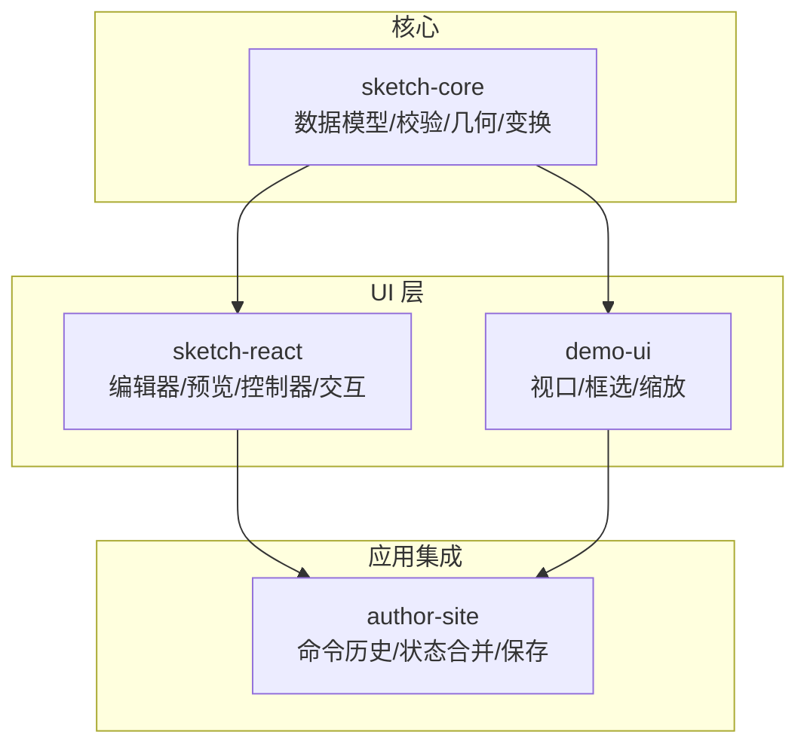
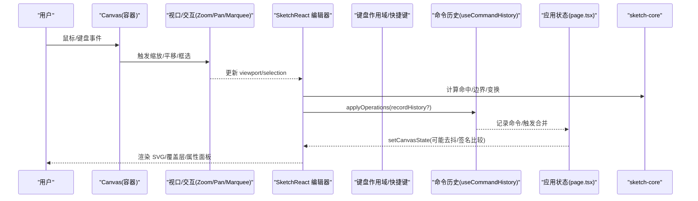
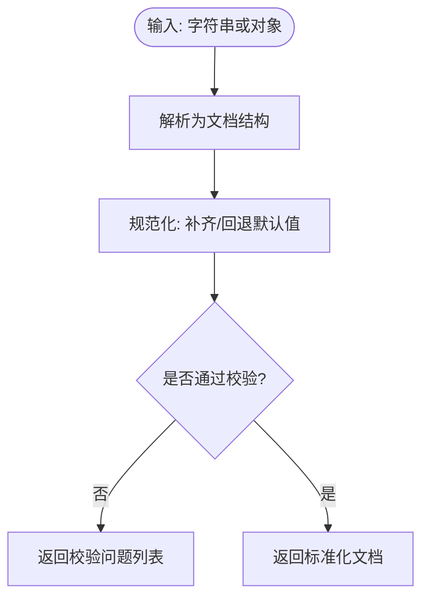
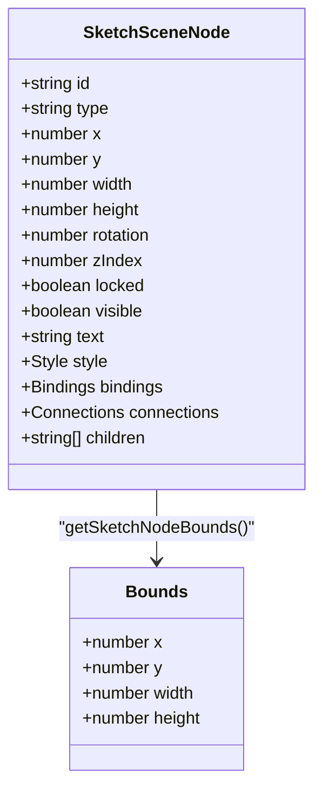
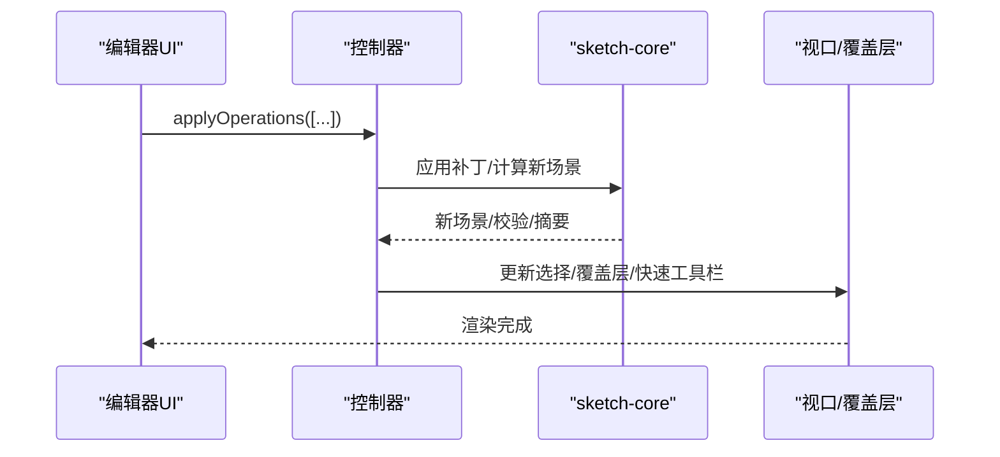
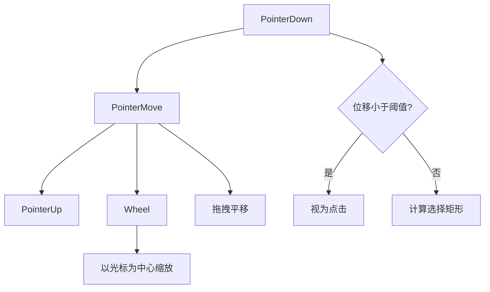
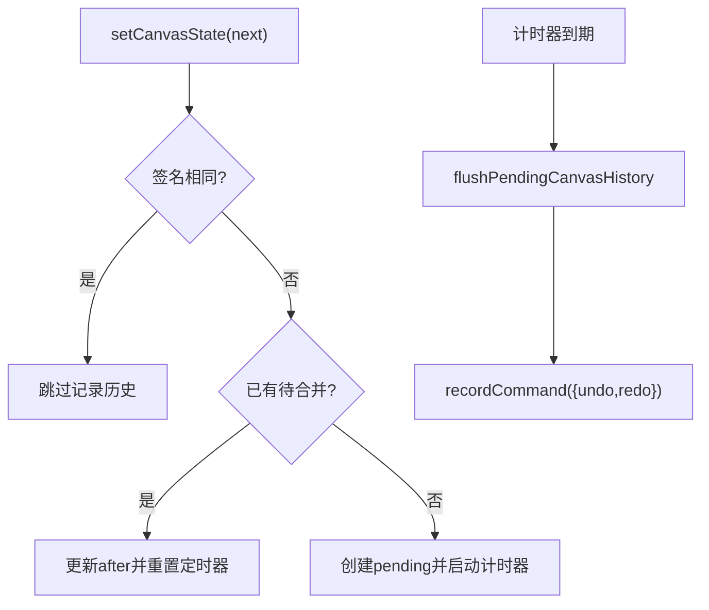
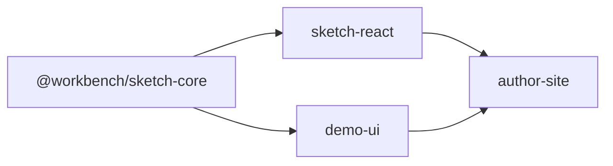

# 可视化画布编辑器

<cite>
**本文引用的文件**   
- [packages/sketch-core/src/index.ts](file://packages/sketch-core/src/index.ts)
- [packages/sketch-react/src/index.tsx](file://packages/sketch-react/src/index.tsx)
- [packages/sketch-react/src/preview.tsx](file://packages/sketch-react/src/preview.tsx)
- [packages/demo-ui/src/CanvasViewport.tsx](file://packages/demo-ui/src/CanvasViewport.tsx)
- [packages/author-site/src/app/demo/[id]/edit/hooks/useCommandHistory.ts](file://packages/author-site/src/app/demo/[id]/edit/hooks/useCommandHistory.ts)
- [packages/author-site/src/app/demo/[id]/edit/page.tsx](file://packages/author-site/src/app/demo/[id]/edit/page.tsx)
</cite>

## 目录
1. [简介](#简介)
2. [项目结构](#项目结构)
3. [核心组件](#核心组件)
4. [架构总览](#架构总览)
5. [详细组件分析](#详细组件分析)
6. [依赖分析](#依赖分析)
7. [性能考虑](#性能考虑)
8. [故障排查指南](#故障排查指南)
9. [结论](#结论)
10. [附录](#附录)

## 简介
本文件面向“可视化画布编辑器”的开发者与使用者，系统性阐述画布核心逻辑、坐标系统与变换矩阵计算、React 组件封装模式（属性面板绑定、事件处理、状态同步）、用户交互设计（拖拽、选择框、缩放与平移）、撤销重做系统（操作历史与快照机制）、快捷键系统、工具栏定制与扩展点，并提供使用示例与自定义开发指南（新增元素类型与样式定制）。

## 项目结构
仓库采用多包 monorepo 组织，画布相关核心能力主要分布在以下包：
- sketch-core：场景数据模型、校验、几何与变换算法、补丁操作等纯函数实现
- sketch-react：基于 React 的编辑/预览组件、视图控制器、交互与渲染管线
- demo-ui：演示用视口与交互封装（平移、缩放、框选）
- author-site：集成层，提供命令历史、画布状态合并与持久化入口



图表来源
- [packages/sketch-core/src/index.ts:1-176](file://packages/sketch-core/src/index.ts#L1-L176)
- [packages/sketch-react/src/index.tsx:1-150](file://packages/sketch-react/src/index.tsx#L1-L150)
- [packages/demo-ui/src/CanvasViewport.tsx:121-554](file://packages/demo-ui/src/CanvasViewport.tsx#L121-L554)
- [packages/author-site/src/app/demo/[id]/edit/page.tsx:814-916](file://packages/author-site/src/app/demo/[id]/edit/page.tsx#L814-L916)

章节来源
- [packages/sketch-core/src/index.ts:1-176](file://packages/sketch-core/src/index.ts#L1-L176)
- [packages/sketch-react/src/index.tsx:1-150](file://packages/sketch-react/src/index.tsx#L1-L150)

## 核心组件
- 场景数据模型与协议版本
  - 定义节点类型、样式、绑定、连接、文档结构、补丁操作、校验结果等
  - 提供默认场景创建、规范化、解析与深度校验
- 几何与变换
  - 节点边界计算（含旋转）、选择区域计算、命中测试、平移/缩放/旋转、吸附辅助线
- React 编辑器与预览
  - 统一控制器接口（工具、选择、操作、历史记录）
  - 键盘作用域、快速工具栏、属性面板、图层面板
  - 视口缩放/平移、滚轮缩放、空格+拖拽平移、框选
- 命令历史
  - 命令栈管理、执行/撤回/重做、全局快捷键绑定、错误上报
- 画布状态合并与持久化
  - 变更去抖、签名对比、批量合并、远端状态应用

章节来源
- [packages/sketch-core/src/index.ts:1-176](file://packages/sketch-core/src/index.ts#L1-L176)
- [packages/sketch-core/src/index.ts:506-557](file://packages/sketch-core/src/index.ts#L506-L557)
- [packages/sketch-core/src/index.ts:581-800](file://packages/sketch-core/src/index.ts#L581-L800)
- [packages/sketch-core/src/index.ts:1447-1477](file://packages/sketch-core/src/index.ts#L1447-L1477)
- [packages/sketch-react/src/index.tsx:1-150](file://packages/sketch-react/src/index.tsx#L1-L150)
- [packages/sketch-react/src/index.tsx:5743-5827](file://packages/sketch-react/src/index.tsx#L5743-L5827)
- [packages/sketch-react/src/index.tsx:6284-6319](file://packages/sketch-react/src/index.tsx#L6284-L6319)
- [packages/sketch-react/src/index.tsx:695-725](file://packages/sketch-react/src/index.tsx#L695-L725)
- [packages/sketch-react/src/preview.tsx:130-160](file://packages/sketch-react/src/preview.tsx#L130-L160)
- [packages/demo-ui/src/CanvasViewport.tsx:121-554](file://packages/demo-ui/src/CanvasViewport.tsx#L121-L554)
- [packages/author-site/src/app/demo/[id]/edit/hooks/useCommandHistory.ts:40-154](file://packages/author-site/src/app/demo/[id]/edit/hooks/useCommandHistory.ts#L40-L154)
- [packages/author-site/src/app/demo/[id]/edit/page.tsx:814-916](file://packages/author-site/src/app/demo/[id]/edit/page.tsx#L814-L916)

## 架构总览
下图展示了从用户输入到最终渲染的关键路径，以及各模块职责。



图表来源
- [packages/sketch-react/src/index.tsx:6284-6319](file://packages/sketch-react/src/index.tsx#L6284-L6319)
- [packages/sketch-react/src/index.tsx:695-725](file://packages/sketch-react/src/index.tsx#L695-L725)
- [packages/sketch-react/src/index.tsx:5743-5827](file://packages/sketch-react/src/index.tsx#L5743-L5827)
- [packages/author-site/src/app/demo/[id]/edit/hooks/useCommandHistory.ts:40-154](file://packages/author-site/src/app/demo/[id]/edit/hooks/useCommandHistory.ts#L40-L154)
- [packages/author-site/src/app/demo/[id]/edit/page.tsx:814-916](file://packages/author-site/src/app/demo/[id]/edit/page.tsx#L814-L916)
- [packages/sketch-core/src/index.ts:1447-1477](file://packages/sketch-core/src/index.ts#L1447-L1477)

## 详细组件分析

### 场景数据模型与校验（sketch-core）
- 模型要点
  - 节点类型集合、样式字段、文本样式运行段、绑定键集、连接器锚点、文档结构、补丁操作枚举、校验结果与摘要
- 关键流程
  - 解析与规范化：将任意输入归一化为标准文档结构，缺失字段回退默认值
  - 深度校验：检查版本、页面尺寸、节点必填字段、几何合法性、样式/绑定/连接有效性、父子关系环检测等
  - 默认场景：根据页面尺寸生成标题与便签占位



图表来源
- [packages/sketch-core/src/index.ts:506-557](file://packages/sketch-core/src/index.ts#L506-L557)
- [packages/sketch-core/src/index.ts:581-800](file://packages/sketch-core/src/index.ts#L581-L800)

章节来源
- [packages/sketch-core/src/index.ts:1-176](file://packages/sketch-core/src/index.ts#L1-L176)
- [packages/sketch-core/src/index.ts:506-557](file://packages/sketch-core/src/index.ts#L506-L557)
- [packages/sketch-core/src/index.ts:581-800](file://packages/sketch-core/src/index.ts#L581-L800)

### 几何与变换（sketch-core）
- 节点边界与选择区域
  - 支持旋转后的包围盒计算；多选时聚合得到选择区域
- 命中测试
  - 在给定坐标下返回首个命中节点
- 变换操作
  - 平移、缩放、旋转；对箭头/线段类节点进行双向端点约束
- 吸附与网格
  - 计算吸附线与间距提示，提升对齐体验



图表来源
- [packages/sketch-core/src/index.ts:135-176](file://packages/sketch-core/src/index.ts#L135-L176)
- [packages/sketch-core/src/index.ts:1447-1477](file://packages/sketch-core/src/index.ts#L1447-L1477)

章节来源
- [packages/sketch-core/src/index.ts:135-176](file://packages/sketch-core/src/index.ts#L135-L176)
- [packages/sketch-core/src/index.ts:1447-1477](file://packages/sketch-core/src/index.ts#L1447-L1477)

### React 编辑器与预览（sketch-react）
- 控制器接口
  - 暴露工具切换、选择管理、内联文本编辑、批量操作、提交场景、历史记录检查点、撤销/重做等
- 键盘作用域
  - 激活当前编辑器的键盘作用域，避免与其他弹窗冲突
- 快速工具栏
  - 基于选中节点位置与视口计算悬浮工具栏定位，提供常用样式快捷操作
- 视口与交互
  - 滚轮缩放（Ctrl/Cmd 以光标为中心）、普通滚轮平移、空格+拖拽平移、抓手工具
  - 客户端坐标到画布坐标转换、视口缩放范围限制与数值取整
- 选择覆盖层
  - 根据选择区域与缩放比例绘制选中边框



图表来源
- [packages/sketch-react/src/index.tsx:109-150](file://packages/sketch-react/src/index.tsx#L109-L150)
- [packages/sketch-react/src/index.tsx:5743-5827](file://packages/sketch-react/src/index.tsx#L5743-L5827)
- [packages/sketch-react/src/index.tsx:6284-6319](file://packages/sketch-react/src/index.tsx#L6284-L6319)
- [packages/sketch-react/src/index.tsx:695-725](file://packages/sketch-react/src/index.tsx#L695-L725)
- [packages/sketch-react/src/preview.tsx:130-160](file://packages/sketch-react/src/preview.tsx#L130-L160)

章节来源
- [packages/sketch-react/src/index.tsx:109-150](file://packages/sketch-react/src/index.tsx#L109-L150)
- [packages/sketch-react/src/index.tsx:5743-5827](file://packages/sketch-react/src/index.tsx#L5743-L5827)
- [packages/sketch-react/src/index.tsx:6284-6319](file://packages/sketch-react/src/index.tsx#L6284-L6319)
- [packages/sketch-react/src/index.tsx:695-725](file://packages/sketch-react/src/index.tsx#L695-L725)
- [packages/sketch-react/src/preview.tsx:130-160](file://packages/sketch-react/src/preview.tsx#L130-L160)

### 视口与交互（demo-ui）
- 框选
  - 根据指针起始点与当前位置计算屏幕矩形与画布矩形，区分点击与拖拽
- 平移与缩放
  - 拖拽平移实时更新视口偏移；滚轮以光标为中心缩放并限制范围
- 光标与交互态
  - 根据工具与按键动态切换光标样式



图表来源
- [packages/demo-ui/src/CanvasViewport.tsx:121-554](file://packages/demo-ui/src/CanvasViewport.tsx#L121-L554)

章节来源
- [packages/demo-ui/src/CanvasViewport.tsx:121-554](file://packages/demo-ui/src/CanvasViewport.tsx#L121-L554)

### 撤销重做系统（useCommandHistory）
- 命令栈
  - 执行命令先调用 redo，成功后入 undo 栈并清空 redo 栈
  - 撤回/重做失败时恢复原栈并上报错误
- 全局快捷键
  - Z 撤回，Shift+Z 或 Y 重做；忽略输入框等场景
- 运行态保护
  - 防止并发执行导致状态不一致

```mermaid
sequenceDiagram
participant App as "应用"
participant Hist as "useCommandHistory"
participant Cmd as "命令对象"
App->>Hist : executeCommand(Cmd)
Hist->>Cmd : redo()
Cmd-->>Hist : 成功
Hist->>Hist : undoStack.push(Cmd); redoStack=[]
App->>Hist : undo()
Hist->>Cmd : undo()
Cmd-->>Hist : 成功
Hist->>Hist : redoStack.push(Cmd)
```

图表来源
- [packages/author-site/src/app/demo/[id]/edit/hooks/useCommandHistory.ts:40-154](file://packages/author-site/src/app/demo/[id]/edit/hooks/useCommandHistory.ts#L40-L154)

章节来源
- [packages/author-site/src/app/demo/[id]/edit/hooks/useCommandHistory.ts:40-154](file://packages/author-site/src/app/demo/[id]/edit/hooks/useCommandHistory.ts#L40-L154)

### 画布状态合并与持久化（author-site）
- 变更合并
  - 通过签名对比判断内容是否变化；未变化则不记录历史
  - 短时多次变更合并为一次命令，减少历史膨胀
- 远端同步
  - 支持应用远端状态，抑制下一次协作推送以避免抖动



图表来源
- [packages/author-site/src/app/demo/[id]/edit/page.tsx:814-916](file://packages/author-site/src/app/demo/[id]/edit/page.tsx#L814-L916)

章节来源
- [packages/author-site/src/app/demo/[id]/edit/page.tsx:814-916](file://packages/author-site/src/app/demo/[id]/edit/page.tsx#L814-L916)

## 依赖分析
- 耦合关系
  - sketch-react 强依赖 sketch-core 的数据模型与几何/变换函数
  - demo-ui 独立于 sketch-core，提供通用视口交互，可被上层复用
  - author-site 整合 sketch-react 与 useCommandHistory，负责业务级状态合并与持久化
- 外部依赖
  - 图标库用于工具栏与按钮展示
  - Tailwind 类名用于样式



图表来源
- [packages/sketch-react/src/index.tsx:40-64](file://packages/sketch-react/src/index.tsx#L40-L64)
- [packages/demo-ui/src/CanvasViewport.tsx:121-554](file://packages/demo-ui/src/CanvasViewport.tsx#L121-L554)
- [packages/author-site/src/app/demo/[id]/edit/page.tsx:814-916](file://packages/author-site/src/app/demo/[id]/edit/page.tsx#L814-L916)

章节来源
- [packages/sketch-react/src/index.tsx:40-64](file://packages/sketch-react/src/index.tsx#L40-L64)
- [packages/demo-ui/src/CanvasViewport.tsx:121-554](file://packages/demo-ui/src/CanvasViewport.tsx#L121-L554)
- [packages/author-site/src/app/demo/[id]/edit/page.tsx:814-916](file://packages/author-site/src/app/demo/[id]/edit/page.tsx#L814-L916)

## 性能考虑
- 视口缩放与平移
  - 限制缩放范围并对偏移值取整，减少浮点抖动导致的重排
  - 使用 transform 与 will-change 优化合成层
- 历史合并
  - 短时间内的多次变更合并为一条命令，降低历史栈压力
- 选择与命中
  - 仅在需要时计算选择区域与命中，避免每帧全量遍历
- 渲染
  - 使用 SVG 标记渲染，结合最小化重绘策略

[本节为通用指导，无需源码引用]

## 故障排查指南
- 撤销/重做无响应
  - 检查是否处于运行中（running）状态，避免并发执行
  - 确认命令 redo/undo 是否抛出异常并被捕获上报
- 画布缩放异常
  - 检查视口缩放是否在允许范围内，客户端坐标是否有效
- 选择框不显示或错位
  - 核对选择区域与缩放比例计算，确保容器尺寸有效
- 属性面板不可编辑
  - 当节点被配置隐藏绑定时，属性面板应置为只读

章节来源
- [packages/author-site/src/app/demo/[id]/edit/hooks/useCommandHistory.ts:40-154](file://packages/author-site/src/app/demo/[id]/edit/hooks/useCommandHistory.ts#L40-L154)
- [packages/sketch-react/src/index.tsx:695-725](file://packages/sketch-react/src/index.tsx#L695-L725)
- [packages/sketch-react/src/preview.tsx:130-160](file://packages/sketch-react/src/preview.tsx#L130-L160)

## 结论
该画布编辑器以 sketch-core 提供稳定、可验证的场景数据与几何变换能力，sketch-react 在其上构建完整的编辑/预览体验与交互控制，author-site 负责命令历史与状态合并。整体架构清晰、职责分离良好，便于扩展新元素类型、工具与样式主题。

[本节为总结性内容，无需源码引用]

## 附录

### 使用示例与集成要点
- 基础用法
  - 引入 SketchPageEditor/SketchPagePreview，传入初始场景与回调
  - 通过控制器方法执行批量操作与提交场景
- 属性面板绑定
  - 使用 bindings 将节点属性与外部配置字段关联
  - 在属性面板中支持解绑与只读状态
- 快捷键与命令面板
  - 打开命令面板搜索并执行内置动作
  - 注册自定义动作后自动出现在帮助与命令面板

章节来源
- [packages/sketch-react/src/index.tsx:109-150](file://packages/sketch-react/src/index.tsx#L109-L150)
- [packages/sketch-react/src/index.tsx:5743-5827](file://packages/sketch-react/src/index.tsx#L5743-L5827)

### 自定义开发指南
- 新增元素类型
  - 在核心模型中扩展节点类型集合与校验规则
  - 在编辑器中注册对应工具与渲染逻辑
  - 在属性面板中为该类型添加专属属性组
- 样式定制
  - 通过样式字段与主题变量调整填充、描边、字体等
  - 利用快速工具栏切换常用色板
- 扩展点
  - 控制器接口作为扩展点，注入自定义操作与行为
  - 命令历史钩子用于审计与日志

章节来源
- [packages/sketch-core/src/index.ts:1-176](file://packages/sketch-core/src/index.ts#L1-L176)
- [packages/sketch-core/src/index.ts:581-800](file://packages/sketch-core/src/index.ts#L581-L800)
- [packages/sketch-react/src/index.tsx:109-150](file://packages/sketch-react/src/index.tsx#L109-L150)