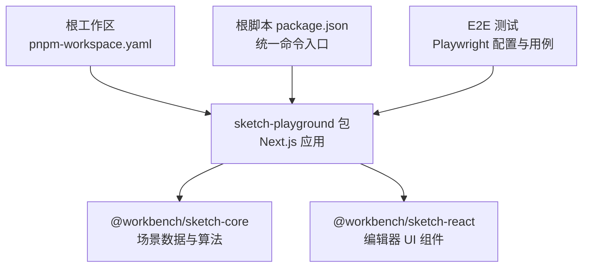
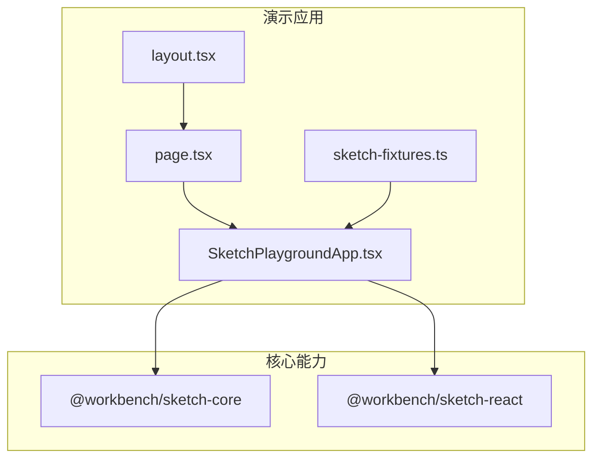
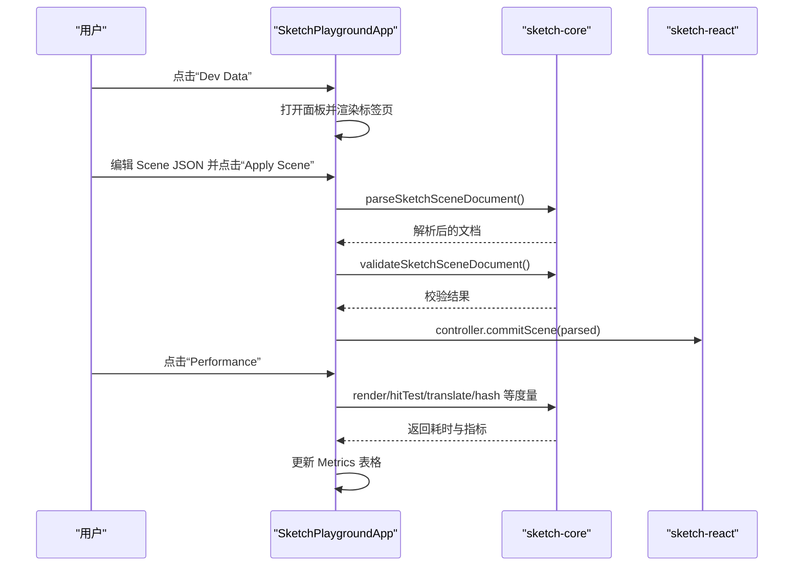
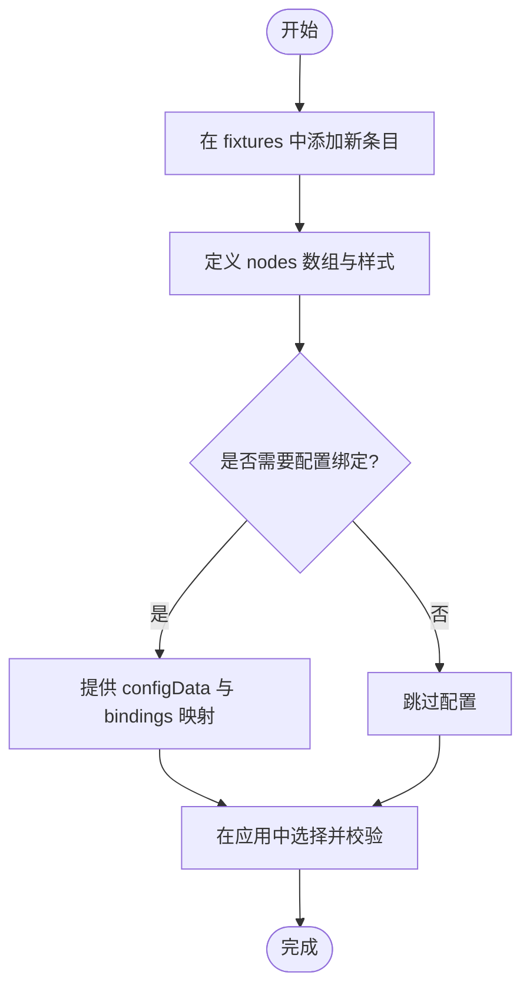
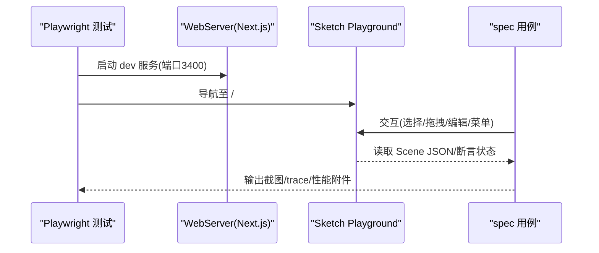
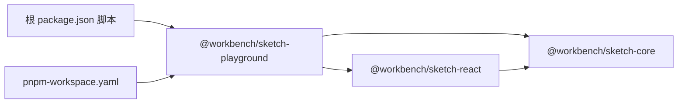

# 演示环境

<cite>
**本文引用的文件**   
- [package.json](file://package.json)
- [pnpm-workspace.yaml](file://pnpm-workspace.yaml)
- [packages/sketch-playground/package.json](file://packages/sketch-playground/package.json)
- [packages/sketch-playground/src/app/layout.tsx](file://packages/sketch-playground/src/app/layout.tsx)
- [packages/sketch-playground/src/app/page.tsx](file://packages/sketch-playground/src/app/page.tsx)
- [packages/sketch-playground/src/components/SketchPlaygroundApp.tsx](file://packages/sketch-playground/src/components/SketchPlaygroundApp.tsx)
- [packages/sketch-playground/src/fixtures/sketch-fixtures.ts](file://packages/sketch-playground/src/fixtures/sketch-fixtures.ts)
- [packages/sketch-core/package.json](file://packages/sketch-core/package.json)
- [packages/sketch-react/package.json](file://packages/sketch-react/package.json)
- [test/sketch-playground/playwright.config.ts](file://test/sketch-playground/playwright.config.ts)
- [test/sketch-playground/sketch-playground.spec.ts](file://test/sketch-playground/sketch-playground.spec.ts)
</cite>

## 目录
1. [简介](#简介)
2. [项目结构](#项目结构)
3. [核心组件](#核心组件)
4. [架构总览](#架构总览)
5. [详细组件分析](#详细组件分析)
6. [依赖关系分析](#依赖关系分析)
7. [性能考量](#性能考量)
8. [故障排查指南](#故障排查指南)
9. [结论](#结论)
10. [附录](#附录)

## 简介
本指南面向希望在 Sketch Playground 演示环境中进行学习与二次开发的工程师与设计师。内容涵盖：
- 启动方式与开发环境配置
- 内置示例的查看与学习方法（基础用法、高级特性、最佳实践）
- 如何添加新的演示用例（示例文件结构与代码组织规范）
- 调试工具与开发者工具的使用
- 性能监控与测试集成的配置
- 贡献示例代码的指南与代码规范要求

## 项目结构
Sketch Playground 是一个基于 Next.js 的前端应用，位于 packages/sketch-playground 下，使用 React + TailwindCSS 构建，并通过 @workbench/sketch-core 与 @workbench/sketch-react 提供场景数据模型与编辑器 UI 能力。根仓库通过 pnpm workspace 管理多包，并提供统一的脚本入口。

图表来源
- [pnpm-workspace.yaml:1-15](file://pnpm-workspace.yaml#L1-L15)
- [packages/sketch-playground/package.json:1-29](file://packages/sketch-playground/package.json#L1-L29)
- [packages/sketch-core/package.json:1-21](file://packages/sketch-core/package.json#L1-L21)
- [packages/sketch-react/package.json:1-34](file://packages/sketch-react/package.json#L1-L34)
- [test/sketch-playground/playwright.config.ts:1-26](file://test/sketch-playground/playwright.config.ts#L1-L26)

章节来源
- [pnpm-workspace.yaml:1-15](file://pnpm-workspace.yaml#L1-L15)
- [package.json:1-101](file://package.json#L1-L101)
- [packages/sketch-playground/package.json:1-29](file://packages/sketch-playground/package.json#L1-L29)

## 核心组件
- 应用外壳与路由
  - layout.tsx：定义页面元信息与全局布局。
  - page.tsx：挂载主应用组件。
- 主应用组件
  - SketchPlaygroundApp.tsx：实现示例切换、场景 JSON 编辑与应用、配置数据编辑与应用、性能基线测量、开发者面板（Scene/Config/Metrics/Debug）。
- 示例夹具
  - sketch-fixtures.ts：定义多个可运行的示例场景与可选配置数据。
- 依赖库
  - @workbench/sketch-core：场景文档解析、校验、渲染、命中测试、节点变换等核心能力。
  - @workbench/sketch-react：编辑器画布、工具栏、图层面板、属性面板与状态 Hook。

章节来源
- [packages/sketch-playground/src/app/layout.tsx:1-16](file://packages/sketch-playground/src/app/layout.tsx#L1-L16)
- [packages/sketch-playground/src/app/page.tsx:1-6](file://packages/sketch-playground/src/app/page.tsx#L1-L6)
- [packages/sketch-playground/src/components/SketchPlaygroundApp.tsx:1-512](file://packages/sketch-playground/src/components/SketchPlaygroundApp.tsx#L1-L512)
- [packages/sketch-playground/src/fixtures/sketch-fixtures.ts:1-89](file://packages/sketch-playground/src/fixtures/sketch-fixtures.ts#L1-L89)
- [packages/sketch-core/package.json:1-21](file://packages/sketch-core/package.json#L1-L21)
- [packages/sketch-react/package.json:1-34](file://packages/sketch-react/package.json#L1-L34)

## 架构总览
Sketch Playground 采用“数据驱动 + 组件化”的架构：示例夹具提供 Scene 数据，React 组件负责渲染与交互，核心库提供数据模型与算法能力。

图表来源
- [packages/sketch-playground/src/app/layout.tsx:1-16](file://packages/sketch-playground/src/app/layout.tsx#L1-L16)
- [packages/sketch-playground/src/app/page.tsx:1-6](file://packages/sketch-playground/src/app/page.tsx#L1-L6)
- [packages/sketch-playground/src/components/SketchPlaygroundApp.tsx:1-512](file://packages/sketch-playground/src/components/SketchPlaygroundApp.tsx#L1-L512)
- [packages/sketch-playground/src/fixtures/sketch-fixtures.ts:1-89](file://packages/sketch-playground/src/fixtures/sketch-fixtures.ts#L1-L89)
- [packages/sketch-core/package.json:1-21](file://packages/sketch-core/package.json#L1-L21)
- [packages/sketch-react/package.json:1-34](file://packages/sketch-react/package.json#L1-L34)

## 详细组件分析

### 启动与运行
- 本地开发
  - 在根目录执行：pnpm dev:sketch
  - 该命令会启动 Next.js 开发服务器并监听端口 3400。
- 生产预览
  - 构建后通过 next start -p 3400 启动服务。
- 工作区与脚本
  - 根 package.json 提供 dev:sketch 等便捷脚本；pnpm-workspace.yaml 声明包范围。

章节来源
- [package.json:1-101](file://package.json#L1-L101)
- [packages/sketch-playground/package.json:1-29](file://packages/sketch-playground/package.json#L1-L29)
- [pnpm-workspace.yaml:1-15](file://pnpm-workspace.yaml#L1-L15)

### 内置示例与学习路径
- 示例列表与加载
  - 顶部下拉框选择示例名称，自动加载对应 scene 与可选 configData。
- 基础用法
  - 观察默认“基础卡片”示例，理解 card/button/text/image 等节点类型与样式。
- 高级特性
  - “配置绑定页”展示 bindings 与外部 configData 的动态联动。
  - “长页面”用于体验滚动与大量对象渲染。
- 最佳实践案例
  - 参考示例中合理的 id 命名、style 字段组织与 bindings 映射策略。

章节来源
- [packages/sketch-playground/src/fixtures/sketch-fixtures.ts:1-89](file://packages/sketch-playground/src/fixtures/sketch-fixtures.ts#L1-L89)
- [packages/sketch-playground/src/components/SketchPlaygroundApp.tsx:133-182](file://packages/sketch-playground/src/components/SketchPlaygroundApp.tsx#L133-L182)

### 开发者工具与调试面板
- 打开方式
  - 点击顶部“Dev Data”按钮打开开发者面板。
- 功能概览
  - Scene JSON：实时查看与编辑场景数据，点击“Apply Scene”应用变更。
  - Config Data：编辑外部配置数据，点击“Apply Config”生效。
  - Metrics：显示节点数量、哈希长度、校验结果与性能基线表格。
  - Debug：展示当前工具、选中项、最近变更摘要与对象列表。
- 常用操作
  - 复制当前场景 JSON 到剪贴板。
  - 运行“Performance”生成不同规模下的基准数据。

图表来源
- [packages/sketch-playground/src/components/SketchPlaygroundApp.tsx:184-274](file://packages/sketch-playground/src/components/SketchPlaygroundApp.tsx#L184-L274)

章节来源
- [packages/sketch-playground/src/components/SketchPlaygroundApp.tsx:276-494](file://packages/sketch-playground/src/components/SketchPlaygroundApp.tsx#L276-L494)

### 添加新示例的步骤
- 新增示例条目
  - 在 fixtures 文件中新增一个 SketchFixture 对象，包含 id、name、scene，以及可选的 configData。
- 场景数据结构
  - 使用 scene(nodes, pageSize) 辅助函数构造标准文档结构。
- 组织规范
  - 为每个节点分配稳定 id，合理设置 style 与 bindings。
  - 若涉及动态配置，确保 configData 键名与 bindings 映射一致。
- 验证与预览
  - 在应用内选择新示例，确认渲染正确且校验通过。

图表来源
- [packages/sketch-playground/src/fixtures/sketch-fixtures.ts:1-89](file://packages/sketch-playground/src/fixtures/sketch-fixtures.ts#L1-L89)
- [packages/sketch-playground/src/components/SketchPlaygroundApp.tsx:170-182](file://packages/sketch-playground/src/components/SketchPlaygroundApp.tsx#L170-L182)

章节来源
- [packages/sketch-playground/src/fixtures/sketch-fixtures.ts:1-89](file://packages/sketch-playground/src/fixtures/sketch-fixtures.ts#L1-L89)
- [packages/sketch-playground/src/components/SketchPlaygroundApp.tsx:133-182](file://packages/sketch-playground/src/components/SketchPlaygroundApp.tsx#L133-L182)

### 性能监控与基线
- 内置性能基准
  - 点击“Performance”按钮，对 100/500/1000 个节点分别测量渲染、选择、属性面板、命中测试、拖拽、输入、平移、路径渲染与哈希长度。
- 指标说明
  - render ms：SVG 渲染耗时
  - selection ms：批量选择计算耗时
  - propertyPanel ms：属性面板序列化耗时
  - hitTest ms：命中测试耗时
  - drag ms：批量位移耗时
  - input ms：文本输入模拟耗时
  - translate ms：整体平移耗时
  - path render ms：路径渲染耗时
  - hash len：场景哈希源长度
- 使用建议
  - 在大规模场景优化前，先记录基线；修改后再次运行对比。

章节来源
- [packages/sketch-playground/src/components/SketchPlaygroundApp.tsx:214-274](file://packages/sketch-playground/src/components/SketchPlaygroundApp.tsx#L214-L274)

### 测试集成与运行
- 运行 Playwright 测试
  - 根脚本：pnpm test:e2e:sketch-playground
  - 测试会自动启动 sketch-playground 开发服务并访问 http://127.0.0.1:3400。
- 关键用例覆盖
  - 场景编辑与导出 JSON
  - 大文档交互性能基线
  - 调试面板信息展示
  - 截图录制与流程走查
  - 图片节点创建、形状文本编辑、约束绘制、撤销重做、视口平移、右键菜单、图层菜单、锁定与可见性、框选与多选、画笔与橡皮擦、线条与箭头编辑等。
- 追踪与附件
  - 失败时保留 trace；支持附加截图与性能 JSON。

图表来源
- [test/sketch-playground/playwright.config.ts:1-26](file://test/sketch-playground/playwright.config.ts#L1-L26)
- [test/sketch-playground/sketch-playground.spec.ts:1-800](file://test/sketch-playground/sketch-playground.spec.ts#L1-L800)

章节来源
- [test/sketch-playground/playwright.config.ts:1-26](file://test/sketch-playground/playwright.config.ts#L1-L26)
- [test/sketch-playground/sketch-playground.spec.ts:1-800](file://test/sketch-playground/sketch-playground.spec.ts#L1-L800)

## 依赖关系分析
- 包依赖
  - sketch-playground 依赖 sketch-core 与 sketch-react。
  - sketch-react 依赖 sketch-core。
- 脚本与工作区
  - 根 package.json 提供 dev/test/lint/typecheck 等统一命令。
  - pnpm-workspace.yaml 声明包范围与构建允许项。

图表来源
- [packages/sketch-playground/package.json:1-29](file://packages/sketch-playground/package.json#L1-L29)
- [packages/sketch-core/package.json:1-21](file://packages/sketch-core/package.json#L1-L21)
- [packages/sketch-react/package.json:1-34](file://packages/sketch-react/package.json#L1-L34)
- [package.json:1-101](file://package.json#L1-L101)
- [pnpm-workspace.yaml:1-15](file://pnpm-workspace.yaml#L1-L15)

章节来源
- [packages/sketch-playground/package.json:1-29](file://packages/sketch-playground/package.json#L1-L29)
- [packages/sketch-core/package.json:1-21](file://packages/sketch-core/package.json#L1-L21)
- [packages/sketch-react/package.json:1-34](file://packages/sketch-react/package.json#L1-L34)
- [package.json:1-101](file://package.json#L1-L101)
- [pnpm-workspace.yaml:1-15](file://pnpm-workspace.yaml#L1-L15)

## 性能考量
- 大数据量场景
  - 使用内置“Performance”按钮快速评估渲染、选择、命中测试、拖拽等关键路径耗时。
- 优化方向
  - 减少不必要的序列化与 JSON.stringify 调用。
  - 合理使用 useMemo/useCallback 避免重复计算。
  - 对路径与复杂图形进行批处理与增量更新。
- 回归保障
  - 结合 E2E 性能用例，建立阈值断言，防止退化。

[本节为通用指导，不直接分析具体文件]

## 故障排查指南
- 无法访问 http://127.0.0.1:3400
  - 检查是否已执行 pnpm dev:sketch；确认端口未被占用。
- 示例加载异常或校验失败
  - 打开“Dev Data → Scene JSON”，修正错误后点击“Apply Scene”。
- 配置未生效
  - 打开“Dev Data → Config Data”，修正 JSON 后点击“Apply Config”。
- 性能退化
  - 运行“Performance”获取基线，定位高耗时指标，逐步优化。
- 测试失败
  - 查看 Playwright trace 与截图附件，定位交互断点。

章节来源
- [packages/sketch-playground/src/components/SketchPlaygroundApp.tsx:184-212](file://packages/sketch-playground/src/components/SketchPlaygroundApp.tsx#L184-L212)
- [test/sketch-playground/playwright.config.ts:1-26](file://test/sketch-playground/playwright.config.ts#L1-L26)

## 结论
Sketch Playground 提供了开箱即用的可视化编辑与调试能力，配合丰富的内置示例与完善的 E2E 测试，适合用于 SDK 能力验证、性能基线管理与示例贡献。遵循本文档的规范与流程，可高效开展学习与二次开发。

[本节为总结性内容，不直接分析具体文件]

## 附录
- 常用命令
  - 启动演示：pnpm dev:sketch
  - 运行 E2E：pnpm test:e2e:sketch-playground
- 关键路径
  - 应用入口：src/app/page.tsx
  - 主组件：src/components/SketchPlaygroundApp.tsx
  - 示例夹具：src/fixtures/sketch-fixtures.ts
  - 测试配置：test/sketch-playground/playwright.config.ts
  - 测试用例：test/sketch-playground/sketch-playground.spec.ts

章节来源
- [package.json:1-101](file://package.json#L1-L101)
- [packages/sketch-playground/src/app/page.tsx:1-6](file://packages/sketch-playground/src/app/page.tsx#L1-L6)
- [packages/sketch-playground/src/components/SketchPlaygroundApp.tsx:1-512](file://packages/sketch-playground/src/components/SketchPlaygroundApp.tsx#L1-L512)
- [packages/sketch-playground/src/fixtures/sketch-fixtures.ts:1-89](file://packages/sketch-playground/src/fixtures/sketch-fixtures.ts#L1-L89)
- [test/sketch-playground/playwright.config.ts:1-26](file://test/sketch-playground/playwright.config.ts#L1-L26)
- [test/sketch-playground/sketch-playground.spec.ts:1-800](file://test/sketch-playground/sketch-playground.spec.ts#L1-L800)