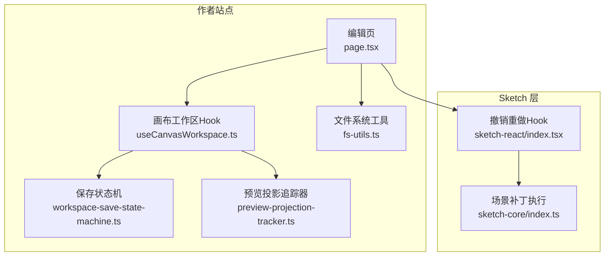
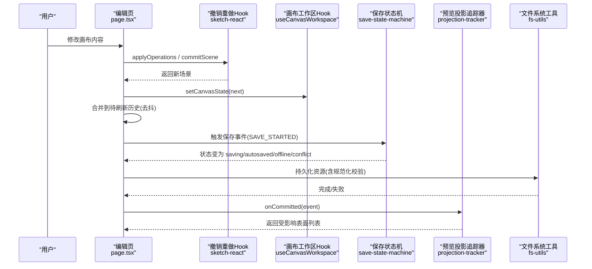
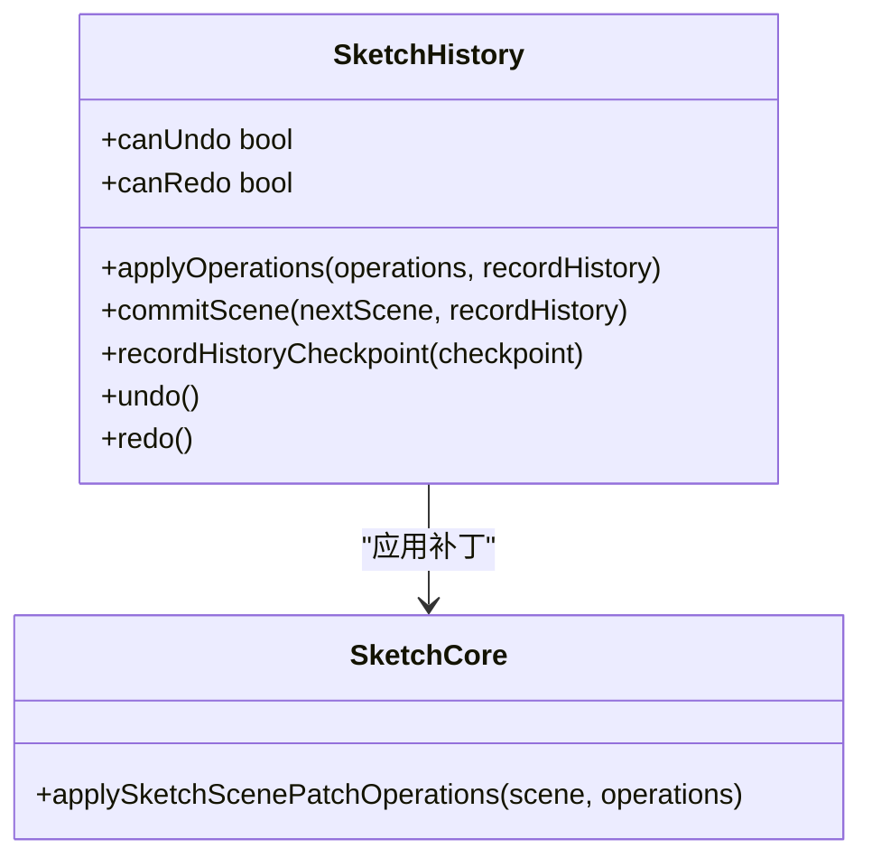
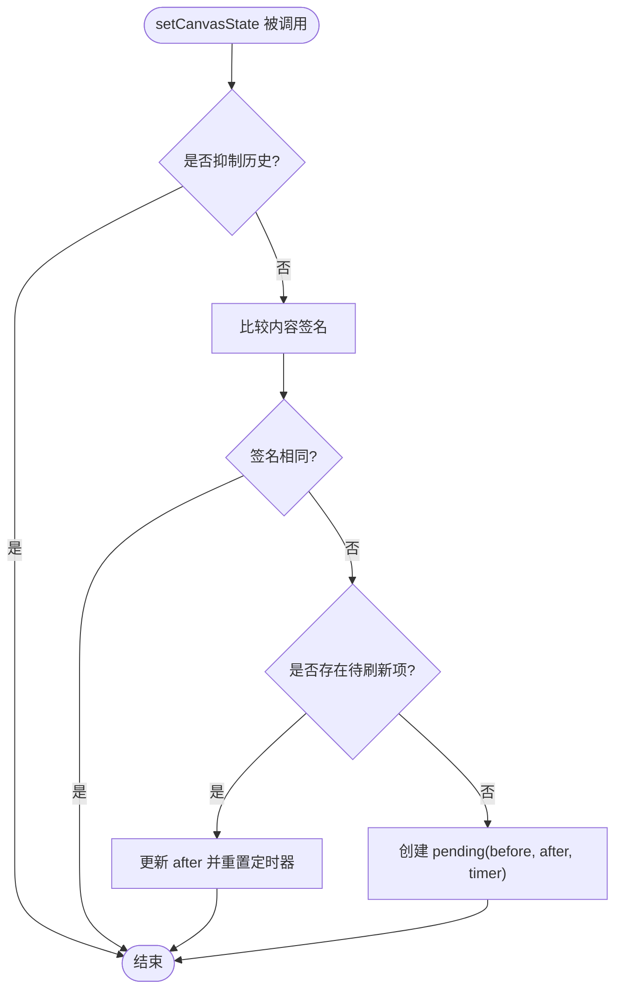
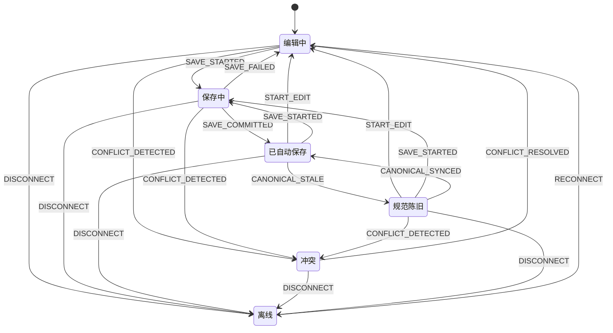
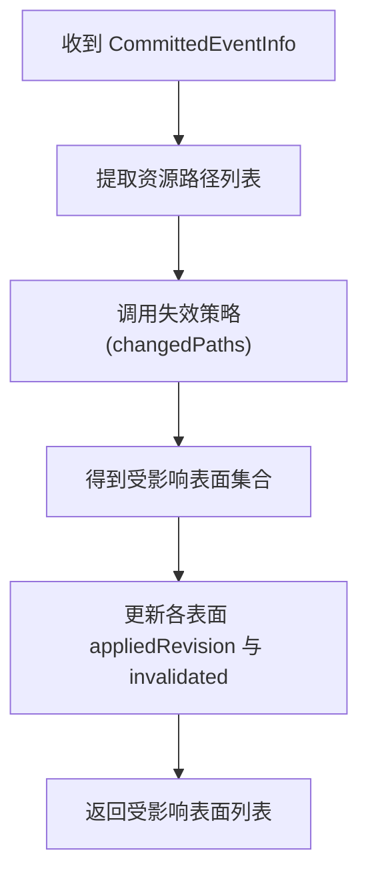
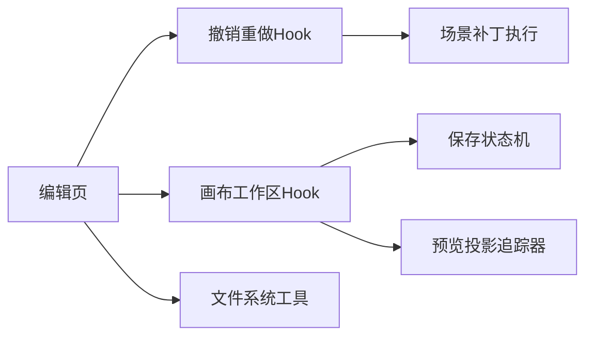

# 状态管理

<cite>
**本文引用的文件**   
- [packages/sketch-react/src/index.tsx](file://packages/sketch-react/src/index.tsx)
- [packages/author-site/src/app/demo/[id]/edit/page.tsx](file://packages/author-site/src/app/demo/[id]/edit/page.tsx)
- [packages/author-site/src/components/demo/useCanvasWorkspace.ts](file://packages/author-site/src/components/demo/useCanvasWorkspace.ts)
- [packages/author-site/src/lib/workspace-save-state-machine.ts](file://packages/author-site/src/lib/workspace-save-state-machine.ts)
- [packages/author-site/src/lib/preview-projection-tracker.ts](file://packages/author-site/src/lib/preview-projection-tracker.ts)
- [packages/author-site/src/lib/fs-utils.ts](file://packages/author-site/src/lib/fs-utils.ts)
- [packages/sketch-core/src/index.ts](file://packages/sketch-core/src/index.ts)
- [test/创作端E2E回归测试/canvas-autosave-reopen-regression.spec.ts](file://test/创作端E2E回归测试/canvas-autosave-reopen-regression.spec.ts)
- [test/创作端E2E回归测试/workspace-mutation-authority.spec.ts](file://test/创作端E2E回归测试/workspace-mutation-authority.spec.ts)
</cite>

## 目录
1. [简介](#简介)
2. [项目结构](#项目结构)
3. [核心组件](#核心组件)
4. [架构总览](#架构总览)
5. [详细组件分析](#详细组件分析)
6. [依赖关系分析](#依赖关系分析)
7. [性能考量](#性能考量)
8. [故障排查指南](#故障排查指南)
9. [结论](#结论)
10. [附录](#附录)

## 简介
本技术文档围绕画布状态管理系统，系统性阐述以下方面：
- 状态存储架构与数据模型（状态树设计、数据结构与访问模式）
- 撤销重做系统（操作历史、快照机制、时间旅行调试）
- 状态持久化策略（本地存储、自动保存、冲突解决）
- 变更监听与响应式更新机制
- 状态迁移与版本兼容性处理
- 最佳实践（性能优化与内存管理）

## 项目结构
画布状态管理涉及多个包与模块：
- sketch-react：提供基于 React 的撤销重做 Hook 与场景补丁应用能力
- author-site：集成画布工作区、自动保存调度、预览投影追踪、文件系统工具等
- sketch-core：提供画布场景补丁操作执行与差异计算
- E2E 测试：覆盖自动保存、重新打开、冲突回退等行为验证

图表来源
- [packages/author-site/src/app/demo/[id]/edit/page.tsx:775-955](file://packages/author-site/src/app/demo/[id]/edit/page.tsx#L775-L955)
- [packages/author-site/src/components/demo/useCanvasWorkspace.ts:209-236](file://packages/author-site/src/components/demo/useCanvasWorkspace.ts#L209-L236)
- [packages/author-site/src/lib/workspace-save-state-machine.ts:76-146](file://packages/author-site/src/lib/workspace-save-state-machine.ts#L76-L146)
- [packages/author-site/src/lib/preview-projection-tracker.ts:96-128](file://packages/author-site/src/lib/preview-projection-tracker.ts#L96-L128)
- [packages/author-site/src/lib/fs-utils.ts:821-860](file://packages/author-site/src/lib/fs-utils.ts#L821-L860)
- [packages/sketch-react/src/index.tsx:1092-1173](file://packages/sketch-react/src/index.tsx#L1092-L1173)
- [packages/sketch-core/src/index.ts:1004-1045](file://packages/sketch-core/src/index.ts#L1004-L1045)

章节来源
- [packages/author-site/src/app/demo/[id]/edit/page.tsx:775-955](file://packages/author-site/src/app/demo/[id]/edit/page.tsx#L775-L955)
- [packages/author-site/src/components/demo/useCanvasWorkspace.ts:209-236](file://packages/author-site/src/components/demo/useCanvasWorkspace.ts#L209-L236)
- [packages/author-site/src/lib/workspace-save-state-machine.ts:76-146](file://packages/author-site/src/lib/workspace-save-state-machine.ts#L76-L146)
- [packages/author-site/src/lib/preview-projection-tracker.ts:96-128](file://packages/author-site/src/lib/preview-projection-tracker.ts#L96-L128)
- [packages/author-site/src/lib/fs-utils.ts:821-860](file://packages/author-site/src/lib/fs-utils.ts#L821-L860)
- [packages/sketch-react/src/index.tsx:1092-1173](file://packages/sketch-react/src/index.tsx#L1092-L1173)
- [packages/sketch-core/src/index.ts:1004-1045](file://packages/sketch-core/src/index.ts#L1004-L1045)

## 核心组件
- 撤销重做 Hook（sketch-react）
  - 维护当前场景、过去栈、未来栈，支持批量操作应用、检查点记录、撤销/重做
  - 通过版本号驱动 UI 刷新，避免不必要的渲染
- 画布工作区 Hook（useCanvasWorkspace）
  - 封装画布状态读写、页面聚焦、选择清空、远端状态合并、未保存标记等
- 保存状态机（workspace-save-state-machine）
  - 定义编辑、保存中、已自动保存、离线、冲突、规范陈旧等状态及转移表
  - 提供从上下文直接计算展示状态的便捷方法
- 预览投影追踪器（preview-projection-tracker）
  - 跟踪各预览表面的基线 revision 与失效标记，根据资源变更路径决定受影响表面
- 文件系统工具（fs-utils）
  - 对应用图动作进行规范化校验，确保状态变更的可序列化与一致性
- 场景补丁执行（sketch-core）
  - 将补丁操作应用到节点集合，生成新场景并更新时间戳；计算前后字段差异用于审计或日志

章节来源
- [packages/sketch-react/src/index.tsx:1092-1173](file://packages/sketch-react/src/index.tsx#L1092-L1173)
- [packages/author-site/src/components/demo/useCanvasWorkspace.ts:209-236](file://packages/author-site/src/components/demo/useCanvasWorkspace.ts#L209-L236)
- [packages/author-site/src/lib/workspace-save-state-machine.ts:76-146](file://packages/author-site/src/lib/workspace-save-state-machine.ts#L76-L146)
- [packages/author-site/src/lib/preview-projection-tracker.ts:96-128](file://packages/author-site/src/lib/preview-projection-tracker.ts#L96-L128)
- [packages/author-site/src/lib/fs-utils.ts:821-860](file://packages/author-site/src/lib/fs-utils.ts#L821-L860)
- [packages/sketch-core/src/index.ts:1004-1045](file://packages/sketch-core/src/index.ts#L1004-L1045)

## 架构总览
整体流程：用户在编辑页触发画布变更 → 使用撤销重做 Hook 应用补丁 → 聚合为命令并进入待刷新的历史缓冲 → 定时刷新写入全局命令历史 → 工作区自动保存调度器标记脏资源 → 保存状态机驱动保存生命周期 → 提交成功后更新预览投影追踪器 → 必要时触发冲突检测与解决。

图表来源
- [packages/author-site/src/app/demo/[id]/edit/page.tsx:878-925](file://packages/author-site/src/app/demo/[id]/edit/page.tsx#L878-L925)
- [packages/sketch-react/src/index.tsx:1128-1173](file://packages/sketch-react/src/index.tsx#L1128-L1173)
- [packages/author-site/src/lib/workspace-save-state-machine.ts:76-146](file://packages/author-site/src/lib/workspace-save-state-machine.ts#L76-L146)
- [packages/author-site/src/lib/preview-projection-tracker.ts:120-128](file://packages/author-site/src/lib/preview-projection-tracker.ts#L120-L128)
- [packages/author-site/src/lib/fs-utils.ts:831-860](file://packages/author-site/src/lib/fs-utils.ts#L831-L860)

## 详细组件分析

### 撤销重做系统（sketch-react）
- 数据结构
  - 当前场景引用、过去栈、未来栈、历史版本号
- 关键行为
  - applyOperations：批量应用补丁，内部调用场景补丁执行器
  - commitScene：记录检查点到过去栈，清空未来栈，触发回调
  - undo/redo：在栈间移动当前场景，保持 canUndo/canRedo 标志
- 复杂度
  - 应用补丁 O(n)（n 为节点数），撤销/重做 O(1)
- 优化建议
  - 限制历史长度（已实现切片截断）
  - 仅在内容变化时刷新历史版本，减少重渲染

图表来源
- [packages/sketch-react/src/index.tsx:1092-1173](file://packages/sketch-react/src/index.tsx#L1092-L1173)
- [packages/sketch-core/src/index.ts:1004-1045](file://packages/sketch-core/src/index.ts#L1004-L1045)

章节来源
- [packages/sketch-react/src/index.tsx:1092-1173](file://packages/sketch-react/src/index.tsx#L1092-L1173)
- [packages/sketch-core/src/index.ts:1004-1045](file://packages/sketch-core/src/index.ts#L1004-L1045)

### 画布工作区与命令历史（author-site 编辑页）
- 职责
  - 接收画布状态变更，去抖合并相邻变更，生成“画布变更”命令
  - 通过 suppress 标志避免重复入队
- 关键点
  - pendingCanvasHistoryRef 缓存 before/after 与定时器
  - getCanvasContentHistorySignature 比较内容签名，避免无意义入队
  - flushPendingCanvasHistory 统一写入命令历史

图表来源
- [packages/author-site/src/app/demo/[id]/edit/page.tsx:896-925](file://packages/author-site/src/app/demo/[id]/edit/page.tsx#L896-L925)

章节来源
- [packages/author-site/src/app/demo/[id]/edit/page.tsx:878-925](file://packages/author-site/src/app/demo/[id]/edit/page.tsx#L878-L925)

### 保存状态机（workspace-save-state-machine）
- 状态集
  - editing、saving、autosaved、offline、conflict、canonical-stale
- 转移规则
  - 明确定义各状态下允许的事件与下一状态
  - computeSaveStateFromContext 提供基于事实的优先级判定
- 适用场景
  - 控制保存按钮文案、禁用交互、提示冲突与离线恢复

图表来源
- [packages/author-site/src/lib/workspace-save-state-machine.ts:76-146](file://packages/author-site/src/lib/workspace-save-state-machine.ts#L76-L146)

章节来源
- [packages/author-site/src/lib/workspace-save-state-machine.ts:76-146](file://packages/author-site/src/lib/workspace-save-state-machine.ts#L76-L146)

### 预览投影追踪器（preview-projection-tracker）
- 作用
  - 维护每个预览表面的 appliedRevision 与 invalidated 标记
  - 当 committed 事件到达时，依据资源变更路径计算受影响表面
- 输出
  - 返回被失效的表面列表，供上层按需刷新

图表来源
- [packages/author-site/src/lib/preview-projection-tracker.ts:120-128](file://packages/author-site/src/lib/preview-projection-tracker.ts#L120-L128)

章节来源
- [packages/author-site/src/lib/preview-projection-tracker.ts:96-128](file://packages/author-site/src/lib/preview-projection-tracker.ts#L96-L128)

### 文件系统工具与规范化（fs-utils）
- 作用
  - 对应用图动作进行规范化，过滤非法字段，保证可序列化
- 影响
  - 提升状态变更的一致性与健壮性，便于后续审计与迁移

章节来源
- [packages/author-site/src/lib/fs-utils.ts:821-860](file://packages/author-site/src/lib/fs-utils.ts#L821-L860)

### 场景补丁执行与差异计算（sketch-core）
- 作用
  - 将补丁操作应用到节点集合，生成新场景并更新时间戳
  - 计算前后字段差异，可用于审计或增量同步
- 复杂度
  - 补丁应用 O(n)，差异计算 O(n·m)（n 节点数，m 字段数）

章节来源
- [packages/sketch-core/src/index.ts:1004-1045](file://packages/sketch-core/src/index.ts#L1004-L1045)

## 依赖关系分析
- 低耦合高内聚
  - 撤销重做 Hook 仅依赖场景补丁执行器，不感知持久化细节
  - 保存状态机独立于 UI，可通过上下文函数计算展示状态
  - 预览投影追踪器只关注资源路径与表面映射
- 外部依赖
  - 文件系统工具负责规范化与排序，保障持久化数据一致性
- 潜在循环依赖
  - 通过事件与回调解耦，未见直接循环导入

图表来源
- [packages/sketch-react/src/index.tsx:1092-1173](file://packages/sketch-react/src/index.tsx#L1092-L1173)
- [packages/author-site/src/app/demo/[id]/edit/page.tsx:878-925](file://packages/author-site/src/app/demo/[id]/edit/page.tsx#L878-L925)
- [packages/author-site/src/lib/workspace-save-state-machine.ts:76-146](file://packages/author-site/src/lib/workspace-save-state-machine.ts#L76-L146)
- [packages/author-site/src/lib/preview-projection-tracker.ts:96-128](file://packages/author-site/src/lib/preview-projection-tracker.ts#L96-L128)
- [packages/author-site/src/lib/fs-utils.ts:821-860](file://packages/author-site/src/lib/fs-utils.ts#L821-L860)

## 性能考量
- 历史去抖与签名比较
  - 通过内容签名对比与定时器合并，避免频繁入队与渲染
- 历史长度限制
  - 过去栈切片截断，控制内存占用
- 局部失效与按需刷新
  - 预览投影追踪器按资源路径计算受影响表面，减少全量刷新
- 补丁粒度
  - 尽量使用最小补丁操作，降低节点遍历成本

[本节为通用指导，无需源码引用]

## 故障排查指南
- 自动保存后重新打开丢失数据
  - 验证持久化流程与重新加载逻辑，参考回归用例断言
- 旧版本提交导致冲突
  - 确认 409 冲突处理与磁盘不回退策略
- 离线与冲突状态切换异常
  - 检查状态机转移表与上下文计算函数

章节来源
- [test/创作端E2E回归测试/canvas-autosave-reopen-regression.spec.ts:506-543](file://test/创作端E2E回归测试/canvas-autosave-reopen-regression.spec.ts#L506-L543)
- [test/创作端E2E回归测试/workspace-mutation-authority.spec.ts:401-435](file://test/创作端E2E回归测试/workspace-mutation-authority.spec.ts#L401-L435)

## 结论
该状态管理体系以“撤销重做 Hook + 工作区状态 + 保存状态机 + 预览投影追踪 + 文件系统规范化”为核心，形成清晰的数据流与职责边界。通过去抖、签名比较、历史截断与局部失效策略，兼顾了用户体验与性能。建议在后续迭代中继续完善版本迁移与跨端同步策略，进一步提升一致性与可观测性。

## 附录
- 术语
  - 画布状态：编辑器中的页面布局、节点属性、绑定等
  - 补丁操作：描述节点增删改的最小变更单元
  - 规范陈旧：本地已保存但与权威副本不一致的状态
- 最佳实践
  - 使用最小补丁，避免整树替换
  - 在高频变更处使用去抖与签名比较
  - 显式处理冲突与离线场景，提供用户反馈
  - 定期清理历史栈，防止内存泄漏

[本节为概念性说明，无需源码引用]