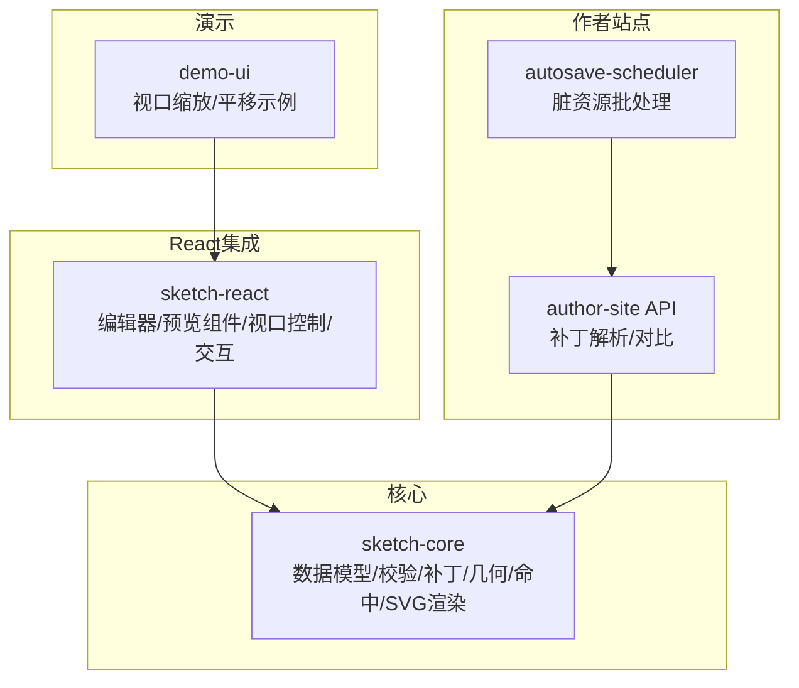
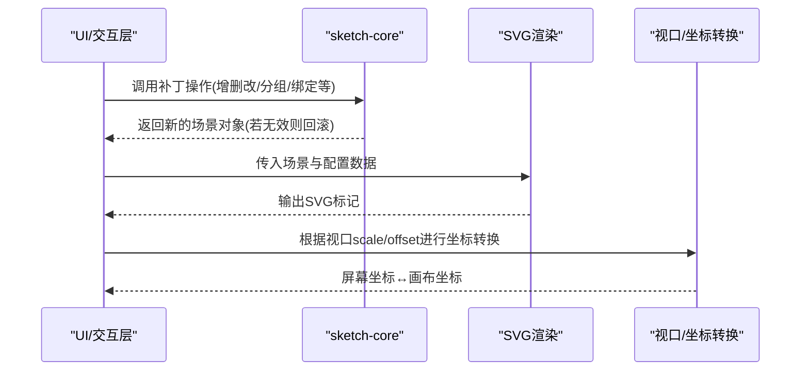
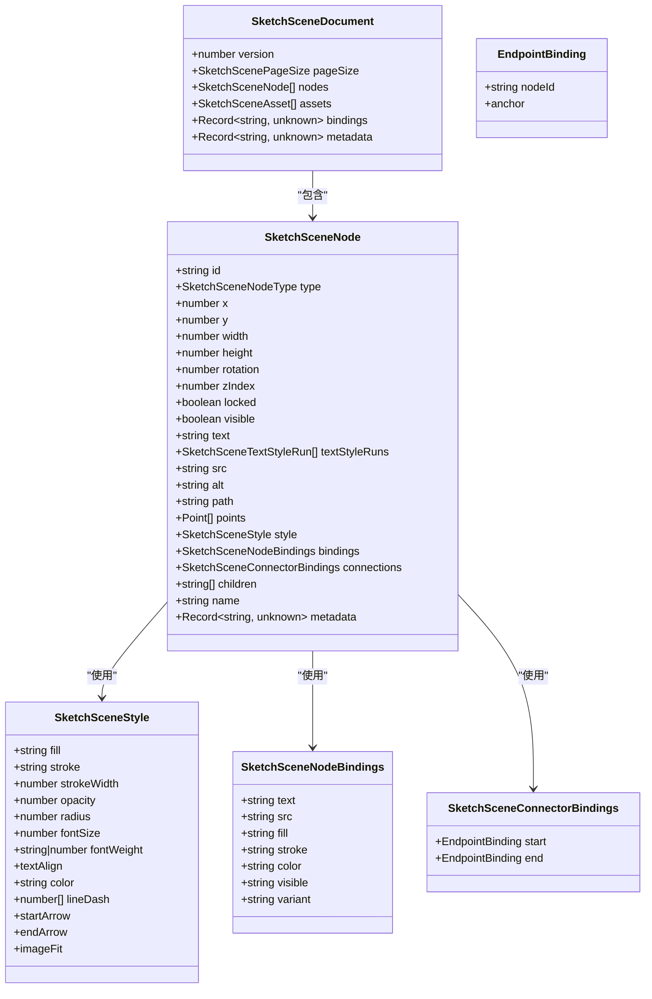
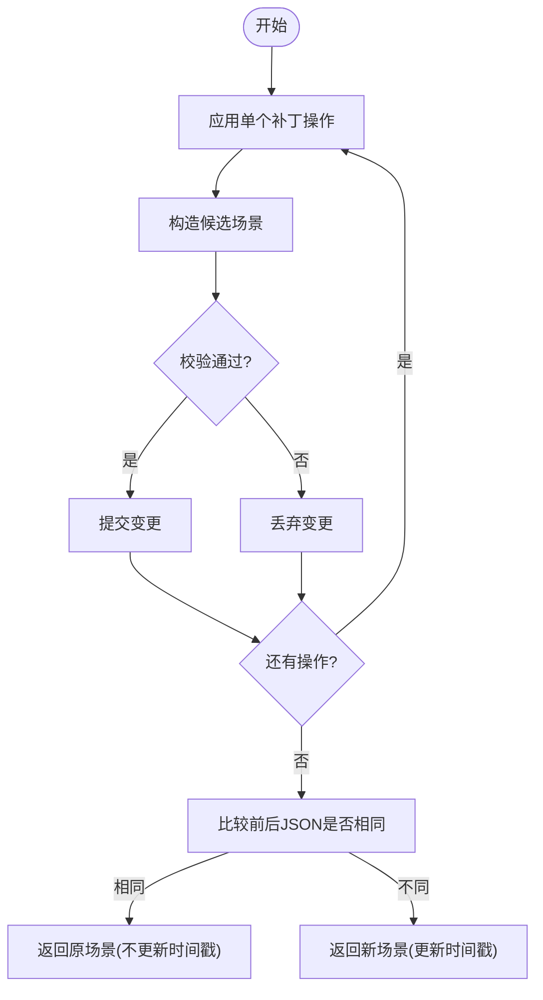
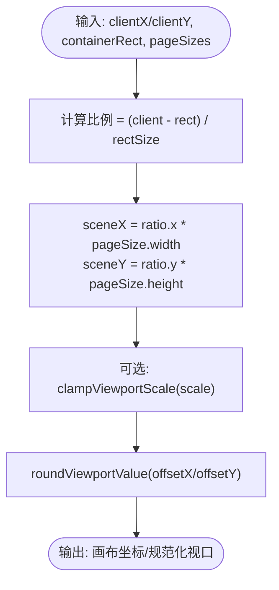
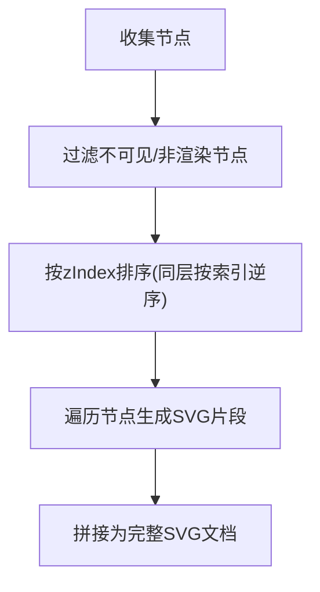
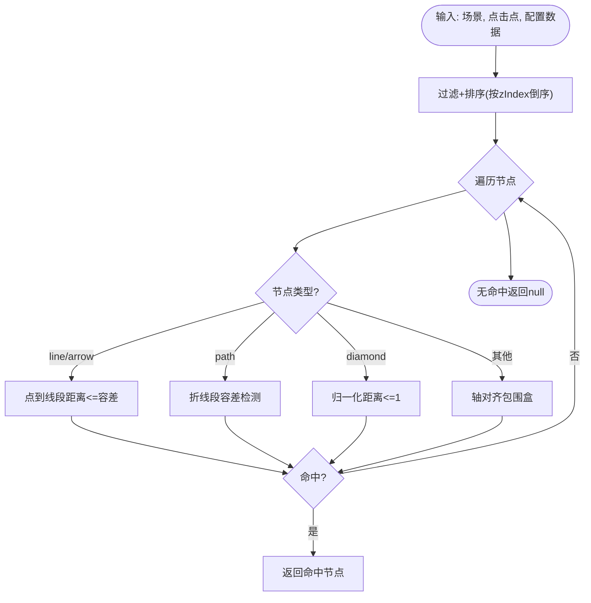
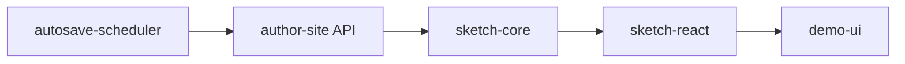

# 画布核心引擎

<cite>
**本文引用的文件**   
- [packages/sketch-core/src/index.ts](file://packages/sketch-core/src/index.ts)
- [packages/sketch-react/src/index.tsx](file://packages/sketch-react/src/index.tsx)
- [packages/demo-ui/src/CanvasViewport.tsx](file://packages/demo-ui/src/CanvasViewport.tsx)
- [packages/author-site/src/app/api/sessions/[sessionId]/files/[demoId]/route.ts](file://packages/author-site/src/app/api/sessions/[sessionId]/files/[demoId]/route.ts)
- [packages/author-site/src/lib/workspace-autosave-scheduler.ts](file://packages/author-site/src/lib/workspace-autosave-scheduler.ts)
</cite>

## 目录
1. [简介](#简介)
2. [项目结构](#项目结构)
3. [核心组件](#核心组件)
4. [架构总览](#架构总览)
5. [详细组件分析](#详细组件分析)
6. [依赖关系分析](#依赖关系分析)
7. [性能考量](#性能考量)
8. [故障排查指南](#故障排查指南)
9. [结论](#结论)
10. [附录](#附录)

## 简介
本技术文档围绕“画布核心引擎”展开，聚焦于渲染管线、图层管理、坐标系统与变换矩阵、元素生命周期与变更批处理、以及性能优化策略。该引擎以不可变数据模型为核心，通过补丁操作（Patch）驱动状态更新，并提供只读 SVG 渲染器与交互层（选择、拖拽、缩放、平移、吸附等）。同时提供 React 集成能力，便于在创作端与预览端复用。

## 项目结构
仓库中与画布核心引擎相关的代码主要分布在以下包：
- sketch-core：场景数据模型、校验、补丁应用、几何计算、命中测试、SVG 渲染等纯函数实现
- sketch-react：基于 React 的编辑器/预览组件、视图口控制、工具栏/属性面板/层级面板集成
- demo-ui：演示用视口缩放/平移交互示例
- author-site：服务端路由中对场景补丁的解析与对比、自动保存调度器等

图表来源
- [packages/sketch-core/src/index.ts](file://packages/sketch-core/src/index.ts)
- [packages/sketch-react/src/index.tsx](file://packages/sketch-react/src/index.tsx)
- [packages/demo-ui/src/CanvasViewport.tsx](file://packages/demo-ui/src/CanvasViewport.tsx)
- [packages/author-site/src/app/api/sessions/[sessionId]/files/[demoId]/route.ts](file://packages/author-site/src/app/api/sessions/[sessionId]/files/[demoId]/route.ts)
- [packages/author-site/src/lib/workspace-autosave-scheduler.ts](file://packages/author-site/src/lib/workspace-autosave-scheduler.ts)

章节来源
- [packages/sketch-core/src/index.ts](file://packages/sketch-core/src/index.ts)
- [packages/sketch-react/src/index.tsx](file://packages/sketch-react/src/index.tsx)
- [packages/demo-ui/src/CanvasViewport.tsx](file://packages/demo-ui/src/CanvasViewport.tsx)
- [packages/author-site/src/app/api/sessions/[sessionId]/files/[demoId]/route.ts](file://packages/author-site/src/app/api/sessions/[sessionId]/files/[demoId]/route.ts)
- [packages/author-site/src/lib/workspace-autosave-scheduler.ts](file://packages/author-site/src/lib/workspace-autosave-scheduler.ts)

## 核心组件
- 场景数据模型与协议版本：定义节点类型、样式、绑定、连接锚点、页面尺寸等
- 校验器：对文档、节点、样式、绑定、连接等进行严格校验，返回错误/警告
- 补丁系统：支持 add/update/delete/duplicate/reorder/group/ungroup/set-locked/set-visible/bind/unbind 等操作，并保证原子性与一致性
- 几何与变换：旋转中心、边界框计算、选择包围盒、最小线型向量等
- 命中测试：按 z-index 排序后逐节点检测，支持矩形、菱形、线段/箭头、路径
- 渲染器：生成只读 SVG 标记，用于预览或截图；支持文本行高、虚线、箭头标记等
- 视口与交互：屏幕坐标到画布坐标转换、缩放/平移算法、吸附对齐、键盘快捷键作用域

章节来源
- [packages/sketch-core/src/index.ts](file://packages/sketch-core/src/index.ts)
- [packages/sketch-react/src/index.tsx](file://packages/sketch-react/src/index.tsx)

## 架构总览
整体采用“不可变数据 + 补丁驱动 + 只读渲染”的架构：
- 数据层：SketchSceneDocument 作为唯一事实源，所有变更通过 applySketchScenePatchOperations 产生新实例
- 逻辑层：校验器确保每次变更后的合法性；几何/命中/吸附等纯函数提供稳定行为
- 渲染层：renderSketchSceneToSvgMarkup 将当前场景转换为 SVG 字符串，供浏览器直接渲染
- 交互层：sketch-react 暴露控制器接口，封装选择、拖拽、缩放、平移、撤销重做等

图表来源
- [packages/sketch-core/src/index.ts](file://packages/sketch-core/src/index.ts)
- [packages/sketch-react/src/index.tsx](file://packages/sketch-react/src/index.tsx)
- [packages/demo-ui/src/CanvasViewport.tsx](file://packages/demo-ui/src/CanvasViewport.tsx)

## 详细组件分析

### 数据模型与校验
- 节点类型：rect/diamond/ellipse/line/arrow/path/text/image/sticky/button/input/card/group
- 样式字段：填充、描边、透明度、圆角、字体、对齐、虚线、箭头、图片适配等
- 绑定与连接：节点属性可绑定至外部配置字段；连线仅支持 line/arrow 且端点需指向可连接节点
- 校验规则：版本、页面尺寸、节点必填字段、几何有效性、组语义约束（隐藏且未锁定）、循环引用检查、连接目标合法性等

图表来源
- [packages/sketch-core/src/index.ts](file://packages/sketch-core/src/index.ts)

章节来源
- [packages/sketch-core/src/index.ts](file://packages/sketch-core/src/index.ts)

### 补丁系统与变更批处理
- 补丁类型：add/update/delete/duplicate/reorder/group/ungroup/set-locked/set-visible/bind/unbind
- 原子性：每个候选变更先构造新场景，再执行校验；失败则丢弃，保持原场景不变
- 无副作用：若无实际变化，不更新 metadata.updatedAt
- 摘要统计：新增/删除/更新节点集合、受影响节点数、变更字段明细等

图表来源
- [packages/sketch-core/src/index.ts](file://packages/sketch-core/src/index.ts)

章节来源
- [packages/sketch-core/src/index.ts](file://packages/sketch-core/src/index.ts)

### 坐标系统与变换矩阵
- 屏幕坐标→画布坐标：根据容器 rect 与 scene.pageSize 比例换算
- 视口缩放/平移：clamp 缩放范围、四舍五入偏移量、以锚点为中心的缩放算法
- 旋转中心：节点宽高中心；旋转时按中心点进行坐标变换
- 边界框：考虑旋转后的外接矩形；选择包围盒为多个节点合并结果

图表来源
- [packages/sketch-react/src/index.tsx](file://packages/sketch-react/src/index.tsx)
- [packages/demo-ui/src/CanvasViewport.tsx](file://packages/demo-ui/src/CanvasViewport.tsx)

章节来源
- [packages/sketch-react/src/index.tsx](file://packages/sketch-react/src/index.tsx)
- [packages/demo-ui/src/CanvasViewport.tsx](file://packages/demo-ui/src/CanvasViewport.tsx)

### 元素绘制管线与图层管理
- 渲染顺序：按 zIndex 升序排列，同层按原始索引降序，保证上层覆盖下层
- 可见性过滤：group 不参与渲染；visible=false 的节点跳过；image 需要有效 src
- 文本渲染：支持多行 tspan 与段落级样式覆盖
- 装饰与标记：虚线、箭头 marker、圆角、阴影等由 SVG 原生特性表达

图表来源
- [packages/sketch-core/src/index.ts](file://packages/sketch-core/src/index.ts)

章节来源
- [packages/sketch-core/src/index.ts](file://packages/sketch-core/src/index.ts)

### 命中测试与选择
- 命中流程：按 z-index 倒序遍历，依次尝试各节点命中判定
- 形状特化：
  - 矩形：轴对齐包围盒
  - 菱形：归一化距离判断
  - 线段/箭头：点到线段距离容差
  - 路径：折线段容差检测
- 局部坐标：对旋转节点进行反向旋转变换后再检测

图表来源
- [packages/sketch-core/src/index.ts](file://packages/sketch-core/src/index.ts)

章节来源
- [packages/sketch-core/src/index.ts](file://packages/sketch-core/src/index.ts)

### 元素生命周期管理
- 创建：add 补丁分配顶层 z-index，重复 id 被拒绝
- 更新：update 补丁合并字段，非法值会被校验拦截
- 删除：delete 递归清理空 group 及失效连接
- 复制：duplicate 偏移位置、重置可见/锁定、追加副本名
- 分组/解组：group 计算选中包围盒创建语义组；ungroup 移除组节点并提升子节点
- 锁定/可见：set-locked/set-visible 对 group 有特殊约束（保持隐藏且未锁定）
- 绑定/解绑：bind/unbind 维护 node.bindings 映射

章节来源
- [packages/sketch-core/src/index.ts](file://packages/sketch-core/src/index.ts)

### 渲染优化技术
- 脏区域/增量更新：当前实现为全量 SVG 字符串生成；可在上层结合 patch summary 中的 updatedFieldsByNodeId 与 affectedNodeCount 进行差异渲染（例如缓存节点片段、按需重建）
- 虚拟DOM对比：sketch-core 提供 getSketchSceneHashSource 返回 SVG 源码，可用于快速比对是否需要重绘
- 批量提交：author-site 侧提供 normalizeSketchSceneForPatchCompare 去除时间戳，避免无关变更导致重算
- 自动保存节流：workspace-autosave-scheduler 提供 markDirty/flush 机制，聚合多次变更，降低 I/O 压力

章节来源
- [packages/sketch-core/src/index.ts](file://packages/sketch-core/src/index.ts)
- [packages/author-site/src/app/api/sessions/[sessionId]/files/[demoId]/route.ts](file://packages/author-site/src/app/api/sessions/[sessionId]/files/[demoId]/route.ts)
- [packages/author-site/src/lib/workspace-autosave-scheduler.ts](file://packages/author-site/src/lib/workspace-autosave-scheduler.ts)

### 核心API使用示例与扩展指南
- 基础用法
  - 初始化默认场景：createDefaultSketchScene(pageSize)
  - 解析/标准化：parseSketchSceneDocument(value)、normalizeSketchSceneDocument(value, fallbackPageSize)
  - 校验：validateSketchSceneDocument(value)
  - 应用补丁：applySketchScenePatchOperations(scene, operations) 或带结果的 applySketchScenePatchOperationsWithResult(...)
  - 渲染：renderSketchSceneToSvgMarkup(scene, configData)
  - 几何/命中：getSketchNodeBounds(node)、getSketchSelectionBounds(nodes)、hitTestSketchScene(scene, point, configData)
  - 变换：translateSketchNodes(nodes, delta)、resizeSketchNode(node, handle, delta)、rotateSketchNode(node, rotation)
- React 集成
  - 预览组件：SketchPagePreview(props)
  - 编辑组件：SketchPageEditor(props)，暴露控制器 SketchEditorController（工具、选择、撤销重做、批量操作等）
  - 视口控制：zoomViewportAt、getCenteredViewportForBounds、normalizeViewport 等
- 自定义渲染器扩展
  - 替换 renderSketchSceneToSvgMarkup 的输出为目标格式（如 Canvas/WebGL），但需遵循相同的节点过滤与排序规则
  - 复用 hitTestSketchScene 与几何函数，保证交互一致
  - 利用 patch summary 与 hash 源进行增量更新与缓存策略

章节来源
- [packages/sketch-core/src/index.ts](file://packages/sketch-core/src/index.ts)
- [packages/sketch-react/src/index.tsx](file://packages/sketch-react/src/index.tsx)

## 依赖关系分析
- sketch-react 依赖 sketch-core 的数据模型与纯函数能力
- demo-ui 演示视口交互，依赖 React 与 CSS transform 实现缩放/平移
- author-site API 对补丁载荷进行解析与对比，配合 autosave-scheduler 进行脏资源批处理

图表来源
- [packages/sketch-core/src/index.ts](file://packages/sketch-core/src/index.ts)
- [packages/sketch-react/src/index.tsx](file://packages/sketch-react/src/index.tsx)
- [packages/demo-ui/src/CanvasViewport.tsx](file://packages/demo-ui/src/CanvasViewport.tsx)
- [packages/author-site/src/app/api/sessions/[sessionId]/files/[demoId]/route.ts](file://packages/author-site/src/app/api/sessions/[sessionId]/files/[demoId]/route.ts)
- [packages/author-site/src/lib/workspace-autosave-scheduler.ts](file://packages/author-site/src/lib/workspace-autosave-scheduler.ts)

章节来源
- [packages/sketch-core/src/index.ts](file://packages/sketch-core/src/index.ts)
- [packages/sketch-react/src/index.tsx](file://packages/sketch-react/src/index.tsx)
- [packages/demo-ui/src/CanvasViewport.tsx](file://packages/demo-ui/src/CanvasViewport.tsx)
- [packages/author-site/src/app/api/sessions/[sessionId]/files/[demoId]/route.ts](file://packages/author-site/src/app/api/sessions/[sessionId]/files/[demoId]/route.ts)
- [packages/author-site/src/lib/workspace-autosave-scheduler.ts](file://packages/author-site/src/lib/workspace-autosave-scheduler.ts)

## 性能考量
- 渲染路径
  - 全量 SVG 生成适合中小规模场景；大规模场景建议在上层引入脏节点缓存与增量更新
  - 使用 getSketchSceneHashSource 进行快速比对，减少不必要的重绘
- 交互路径
  - 命中测试按 z-index 排序，建议在交互热点区域使用空间索引（如四叉树）进一步优化
  - 视口缩放/平移使用 clamp 与 round 控制精度，避免抖动
- 数据路径
  - 补丁操作内部校验保证一致性，但频繁小步操作可能带来开销；可合并操作或使用 batch 模式
  - autosave-scheduler 的 markDirty/flush 能显著降低写入频率

[本节为通用指导，无需具体文件来源]

## 故障排查指南
- 常见校验错误
  - 无效文档/版本/页面尺寸：检查 JSON 结构与字段类型
  - 缺失/重复节点 ID：确保唯一性与存在性
  - 几何无效：width/height 必须为正（除 line/arrow 特殊规则）
  - 组语义违规：组必须隐藏且未锁定，且至少有一个子节点
  - 连接目标非法：仅允许连接到非 group/line/arrow/path 的节点
- 补丁回滚
  - 当某条补丁导致校验失败时，整个操作序列会回滚到前一个合法状态
- 渲染异常
  - image 缺少 src 或绑定为空将被跳过渲染
  - 文本样式越界或非法值会被忽略或回退默认值

章节来源
- [packages/sketch-core/src/index.ts](file://packages/sketch-core/src/index.ts)

## 结论
画布核心引擎以不可变数据与补丁驱动为基础，提供稳定的几何/命中/渲染能力，并通过 React 集成实现完整的编辑体验。其设计强调一致性、可扩展性与可测试性。对于大规模场景，建议在上层引入脏区域与增量更新策略，并结合哈希比对与批处理机制进一步提升性能。

[本节为总结，无需具体文件来源]

## 附录
- 术语
  - 补丁（Patch）：描述场景变更的最小操作单元
  - 视口（Viewport）：当前可见区域，含 scale 与 offset
  - 脏资源（Dirty Resource）：待持久化的变更资源
- 参考实现路径
  - 补丁应用与摘要：applySketchScenePatchOperations / applySketchScenePatchOperationsWithResult
  - 渲染入口：renderSketchSceneToSvgMarkup / buildSketchScenePreviewDocumentHtml
  - 坐标转换：getClientScenePoint / zoomViewportAt / normalizeViewport
  - 命中测试：hitTestSketchScene / getNodeLocalPointForHitTest

章节来源
- [packages/sketch-core/src/index.ts](file://packages/sketch-core/src/index.ts)
- [packages/sketch-react/src/index.tsx](file://packages/sketch-react/src/index.tsx)