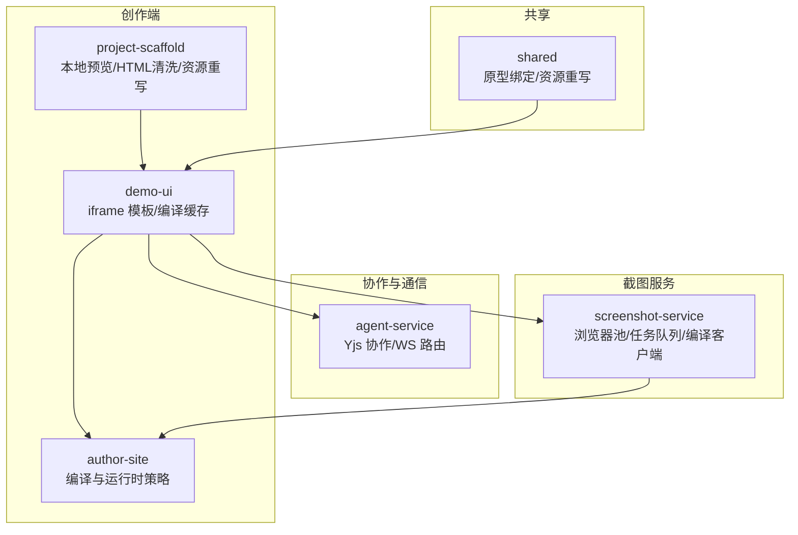
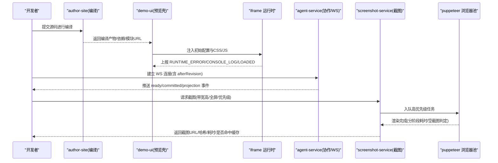
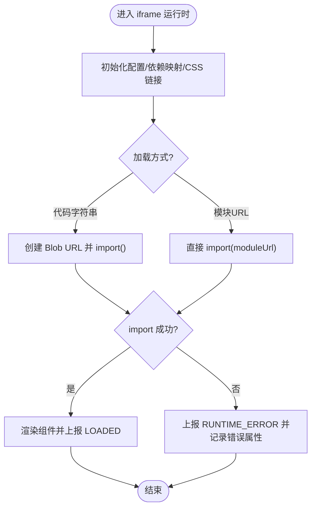
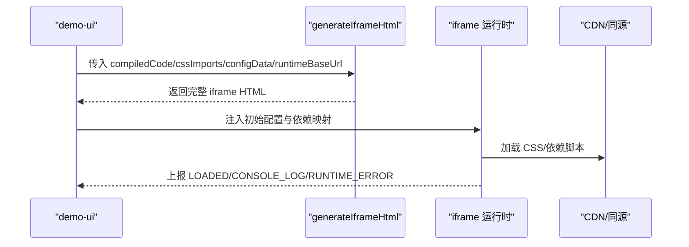
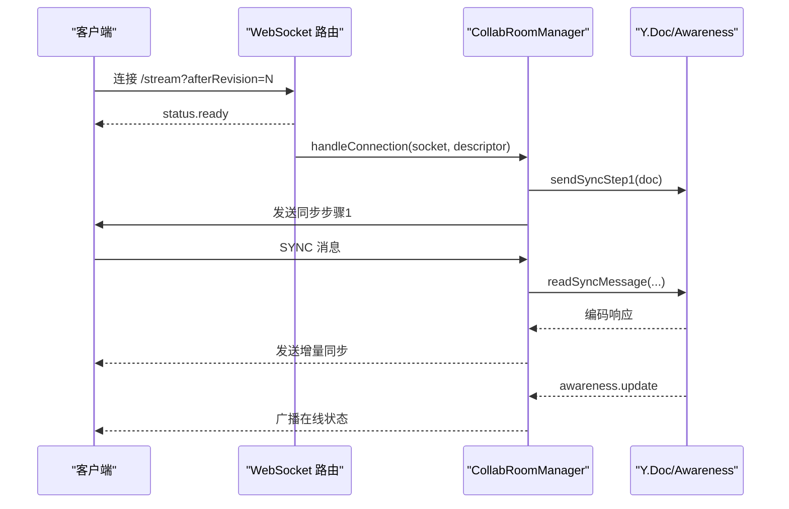
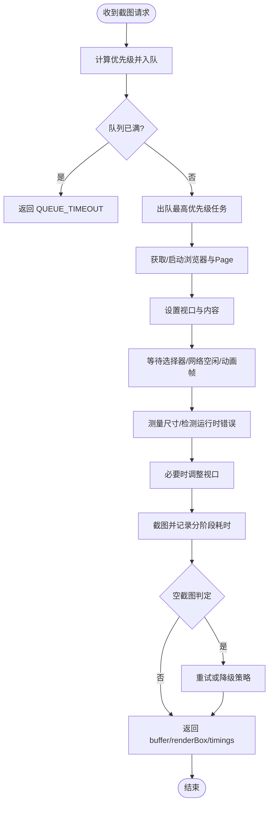
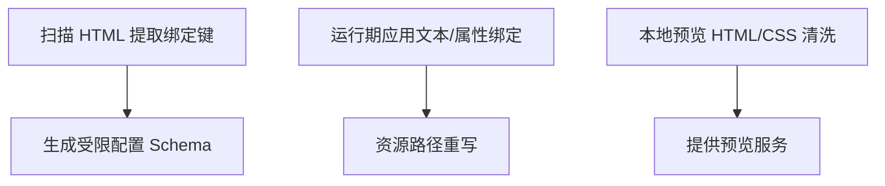
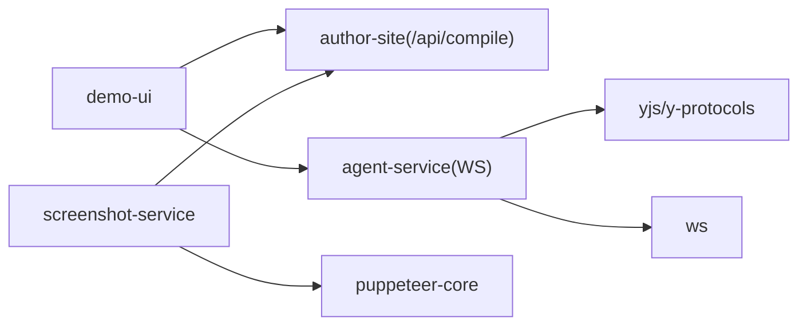

# 实时预览系统

<cite>
**本文引用的文件**
- [packages/screenshot-service/src/utils/compile-cache.ts](file://packages/screenshot-service/src/utils/compile-cache.ts)
- [packages/demo-ui/src/compile-cache.ts](file://packages/demo-ui/src/compile-cache.ts)
- [packages/demo-ui/src/iframe-template.ts](file://packages/demo-ui/src/iframe-template.ts)
- [packages/agent-service/src/collab/collab-room-manager.ts](file://packages/agent-service/src/collab/collab-room-manager.ts)
- [packages/agent-service/tests/unit/workspace-authority-routes.test.ts](file://packages/agent-service/tests/unit/workspace-authority-routes.test.ts)
- [packages/agent-service/tests/unit/collab-room-manager.test.ts](file://packages/agent-service/tests/unit/collab-room-manager.test.ts)
- [scripts/check-contracts.mjs](file://scripts/check-contracts.mjs)
- [packages/screenshot-service/src/utils/browser-pool.ts](file://packages/screenshot-service/src/utils/browser-pool.ts)
- [packages/screenshot-service/src/utils/compile-client.ts](file://packages/screenshot-service/src/utils/compile-client.ts)
- [packages/project-scaffold/src/local-preview-dev-server.ts](file://packages/project-scaffold/src/local-preview-dev-server.ts)
- [packages/shared/src/demo/prototype-preview.ts](file://packages/shared/src/demo/prototype-preview.ts)
- [packages/demo-ui/src/PageConfigPanel.tsx](file://packages/demo-ui/src/PageConfigPanel.tsx)
- [data/published/proj_1779608460378/demos/demo_1780550141175_a79047/iframe.html](file://data/published/proj_1779608460378/demos/demo_1780550141175_a79047/iframe.html)
- [packages/author-site/src/lib/__tests__/preview-runtime-policy.test.ts](file://packages/author-site/src/lib/__tests__/preview-runtime-policy.test.ts)
</cite>

## 目录
1. [简介](#简介)
2. [项目结构](#项目结构)
3. [核心组件](#核心组件)
4. [架构总览](#架构总览)
5. [详细组件分析](#详细组件分析)
6. [依赖关系分析](#依赖关系分析)
7. [性能优化指南](#性能优化指南)
8. [故障排除与调试](#故障排除与调试)
9. [结论](#结论)
10. [附录](#附录)

## 简介
本技术文档面向“实时预览系统”，围绕以下关键能力展开：动态编译引擎（代码监听、增量编译、缓存策略）、运行时沙箱机制（安全隔离、资源限制、错误处理）、配置驱动渲染流程（页面组装、资源加载、依赖注入）、WebSocket 实时通信（变更检测、增量更新、冲突解决）、截图生成服务（异步任务队列、浏览器自动化、图像优化），以及性能优化与故障排查实践。文档以仓库中的实际实现为依据，提供架构图、时序图与流程图，帮助开发者快速理解并高效排障。

## 项目结构
实时预览系统由多个包协同工作：
- 创作端与预览壳：demo-ui 负责 iframe 模板生成、运行时消息上报、编译缓存；author-site 提供编译与运行时策略校验；project-scaffold 提供本地开发预览与 HTML/CSS 清洗与资源重写。
- 协作与实时通信：agent-service 提供基于 Yjs 的协作房间管理、WebSocket 同步与在线状态广播。
- 截图服务：screenshot-service 提供浏览器池、任务队列、编译客户端与存储等能力。
- 共享工具：shared 提供原型绑定与资源重写逻辑。

图表来源
- [packages/demo-ui/src/iframe-template.ts:1278-1469](file://packages/demo-ui/src/iframe-template.ts#L1278-L1469)
- [packages/agent-service/src/collab/collab-room-manager.ts:115-200](file://packages/agent-service/src/collab/collab-room-manager.ts#L115-L200)
- [packages/screenshot-service/src/utils/browser-pool.ts:126-200](file://packages/screenshot-service/src/utils/browser-pool.ts#L126-L200)
- [packages/project-scaffold/src/local-preview-dev-server.ts:81-115](file://packages/project-scaffold/src/local-preview-dev-server.ts#L81-L115)
- [packages/shared/src/demo/prototype-preview.ts:171-258](file://packages/shared/src/demo/prototype-preview.ts#L171-L258)

章节来源
- [packages/demo-ui/src/iframe-template.ts:1278-1469](file://packages/demo-ui/src/iframe-template.ts#L1278-L1469)
- [packages/agent-service/src/collab/collab-room-manager.ts:115-200](file://packages/agent-service/src/collab/collab-room-manager.ts#L115-L200)
- [packages/screenshot-service/src/utils/browser-pool.ts:126-200](file://packages/screenshot-service/src/utils/browser-pool.ts#L126-L200)
- [packages/project-scaffold/src/local-preview-dev-server.ts:81-115](file://packages/project-scaffold/src/local-preview-dev-server.ts#L81-L115)
- [packages/shared/src/demo/prototype-preview.ts:171-258](file://packages/shared/src/demo/prototype-preview.ts#L171-L258)

## 核心组件
- 动态编译引擎
  - 编译客户端：通过 HTTP 调用 author-site 的 /api/compile 接口，返回编译产物与依赖清单。
  - 编译缓存：服务端与前端均维护 LRU/TTL 策略的编译结果缓存，减少重复编译。
- 运行时沙箱
  - iframe 独立执行上下文，错误与性能指标通过 postMessage 上报父窗口。
  - 资源加载支持 URL 模式与 Blob 模式，避免跨域问题。
- 配置驱动渲染
  - 模板注入初始配置与 CSS 导入，运行时根据配置更新 DOM 与样式。
  - 原型文本绑定与属性绑定在运行期或构建期完成。
- WebSocket 实时通信
  - 基于 Yjs 的文档同步与 Awareness 在线状态广播，支持断线重连与 catch-up。
- 截图生成服务
  - 优先级队列 + Puppeteer 浏览器池，分阶段计时与空截图判定，超时保护与健康检查。

章节来源
- [packages/screenshot-service/src/utils/compile-client.ts:34-78](file://packages/screenshot-service/src/utils/compile-client.ts#L34-L78)
- [packages/screenshot-service/src/utils/compile-cache.ts:10-70](file://packages/screenshot-service/src/utils/compile-cache.ts#L10-L70)
- [packages/demo-ui/src/compile-cache.ts:1-87](file://packages/demo-ui/src/compile-cache.ts#L1-L87)
- [packages/demo-ui/src/iframe-template.ts:1300-1334](file://packages/demo-ui/src/iframe-template.ts#L1300-L1334)
- [packages/shared/src/demo/prototype-preview.ts:171-258](file://packages/shared/src/demo/prototype-preview.ts#L171-L258)
- [packages/agent-service/src/collab/collab-room-manager.ts:297-332](file://packages/agent-service/src/collab/collab-room-manager.ts#L297-L332)
- [packages/screenshot-service/src/utils/browser-pool.ts:315-390](file://packages/screenshot-service/src/utils/browser-pool.ts#L315-L390)

## 架构总览
下图展示了从用户编辑到预览更新与截图生成的端到端流程，包括编译、缓存、iframe 运行时、协作同步与截图队列。

图表来源
- [packages/screenshot-service/src/utils/compile-client.ts:34-78](file://packages/screenshot-service/src/utils/compile-client.ts#L34-L78)
- [packages/demo-ui/src/iframe-template.ts:1300-1334](file://packages/demo-ui/src/iframe-template.ts#L1300-L1334)
- [packages/agent-service/tests/unit/workspace-authority-routes.test.ts:126-142](file://packages/agent-service/tests/unit/workspace-authority-routes.test.ts#L126-L142)
- [packages/screenshot-service/src/utils/browser-pool.ts:315-390](file://packages/screenshot-service/src/utils/browser-pool.ts#L315-L390)

## 详细组件分析

### 动态编译引擎（监听、增量、缓存）
- 编译客户端
  - 向 author-site 的 /api/compile 发起 POST，携带 code 与可选 sessionId。
  - 成功时返回 compiledCode、cssImports、dependencies、moduleHash/moduleUrl。
  - 失败时抛出包含状态码与详情结构的错误对象，便于上层统一处理。
- 编译缓存
  - 服务端 CompileCache：基于 SHA256 前缀键值，LRU 淘汰，按 cacheScope 隔离。
  - 前端 compile-cache：基于会话+页面+代码指纹的键，TTL 过期清理与最大容量控制。
- 增量与监听
  - 通过 WebSocket 的 workspace_authority 流，客户端使用 afterRevision 参数进行 catch-up，随后接收 committed 与 projection 事件，触发增量更新。
  - 配合 demo-ui 的编译缓存，可跳过未变化页面的重复编译。

```mermaid
classDiagram
class CompileClient {
+compileCode(code, sessionId) Promise~CompileResult~
}
class CompileCache {
-cache Map
-maxEntries number
+get(code, scope) CompileResult?
+set(code, result, scope) void
+clear() void
+size number
}
class FrontendCompileCache {
-compileCache Map
+getCachedCompile(sessionId, demoId, code) CompileResult?
+setCachedCompile(sessionId, demoId, result, code) void
+invalidateCompileCache(sessionId, demoId?) void
+hasCachedCompile(sessionId, demoId, code) boolean
}
CompileClient --> CompileCache : "调用"
FrontendCompileCache ..> CompileClient : "读取/写入"
```

图表来源
- [packages/screenshot-service/src/utils/compile-client.ts:34-78](file://packages/screenshot-service/src/utils/compile-client.ts#L34-L78)
- [packages/screenshot-service/src/utils/compile-cache.ts:10-70](file://packages/screenshot-service/src/utils/compile-cache.ts#L10-L70)
- [packages/demo-ui/src/compile-cache.ts:1-87](file://packages/demo-ui/src/compile-cache.ts#L1-L87)

章节来源
- [packages/screenshot-service/src/utils/compile-client.ts:34-78](file://packages/screenshot-service/src/utils/compile-client.ts#L34-L78)
- [packages/screenshot-service/src/utils/compile-cache.ts:10-70](file://packages/screenshot-service/src/utils/compile-cache.ts#L10-L70)
- [packages/demo-ui/src/compile-cache.ts:1-87](file://packages/demo-ui/src/compile-cache.ts#L1-L87)
- [packages/agent-service/tests/unit/workspace-authority-routes.test.ts:126-142](file://packages/agent-service/tests/unit/workspace-authority-routes.test.ts#L126-L142)

### 运行时沙箱机制（隔离、限制、错误处理）
- 隔离与执行
  - iframe 独立文档树与 JS 执行上下文，父窗口通过 postMessage 与子窗口通信。
  - 支持两种模块加载方式：直接传入编译后的代码字符串（Blob URL）或远程模块 URL。
- 错误与性能上报
  - 子窗口捕获运行时错误与性能指标，封装为 RUNTIME_ERROR 与 CONSOLE_LOG 事件上报父窗口。
  - 父窗口可通过 data-preview-runtime-error 属性获取最近一次错误摘要。
- 资源与依赖注入
  - 模板函数注入默认运行时依赖映射与 CSS 链接，支持 CDN 与同源 runtime 基址切换。
  - 发布产物中记录 previewRuntime 版本与路径，确保嵌入与查看阶段一致。

图表来源
- [packages/demo-ui/src/iframe-template.ts:1300-1334](file://packages/demo-ui/src/iframe-template.ts#L1300-L1334)
- [packages/demo-ui/src/iframe-template.ts:1278-1469](file://packages/demo-ui/src/iframe-template.ts#L1278-L1469)
- [data/published/proj_1779608460378/demos/demo_1780550141175_a79047/iframe.html:956-979](file://data/published/proj_1779608460378/demos/demo_1780550141175_a79047/iframe.html#L956-L979)

章节来源
- [packages/demo-ui/src/iframe-template.ts:1300-1334](file://packages/demo-ui/src/iframe-template.ts#L1300-L1334)
- [packages/demo-ui/src/iframe-template.ts:1278-1469](file://packages/demo-ui/src/iframe-template.ts#L1278-L1469)
- [data/published/proj_1779608460378/demos/demo_1780550141175_a79047/iframe.html:956-979](file://data/published/proj_1779608460378/demos/demo_1780550141175_a79047/iframe.html#L956-L979)

### 配置驱动渲染流程（页面组装、资源加载、依赖注入）
- 页面组装
  - generateIframeHtml 将编译产物、CSS 导入、配置数据与运行时依赖映射注入到 iframe 模板。
  - 支持 URL 模式与代码模式，便于热更新与回退。
- 资源加载
  - 动态插入 link 标签加载 CSS，支持相对路径与 CDN 地址重写。
  - 运行时依赖映射将第三方库解析为受控的同源或 CDN 地址。
- 依赖注入
  - 默认运行时导入表与 runtimeBaseUrl 控制最终 URL 解析。
  - 测试用例验证 @preview/sdk 与 SVGA 运行时被映射为同源 vendor 路径。

图表来源
- [packages/demo-ui/src/iframe-template.ts:1278-1469](file://packages/demo-ui/src/iframe-template.ts#L1278-L1469)
- [packages/author-site/src/lib/__tests__/preview-runtime-policy.test.ts:1-38](file://packages/author-site/src/lib/__tests__/preview-runtime-policy.test.ts#L1-L38)
- [packages/author-site/src/lib/__tests__/preview-runtime-policy.test.ts:40-82](file://packages/author-site/src/lib/__tests__/preview-runtime-policy.test.ts#L40-L82)

章节来源
- [packages/demo-ui/src/iframe-template.ts:1278-1469](file://packages/demo-ui/src/iframe-template.ts#L1278-L1469)
- [packages/author-site/src/lib/__tests__/preview-runtime-policy.test.ts:1-38](file://packages/author-site/src/lib/__tests__/preview-runtime-policy.test.ts#L1-L38)
- [packages/author-site/src/lib/__tests__/preview-runtime-policy.test.ts:40-82](file://packages/author-site/src/lib/__tests__/preview-runtime-policy.test.ts#L40-L82)

### WebSocket 实时通信（变更检测、增量更新、冲突解决）
- 连接与会话
  - 客户端通过 /stream?sessionId=...&afterRevision=... 建立连接，服务器先推送 ready，再推送已提交的 mutation 与投影事件。
- 协作房间
  - CollabRoomManager 管理 Yjs Doc 与 Awareness，处理 SYNC 与 AWARENESS 消息，广播在线状态。
  - 空闲房间自动清理，持久化刷新与草稿合并。
- 冲突解决
  - 基于 Yjs CRDT 的自动合并，结合 WorkspaceMutationAuthority 的权限与修订号保证一致性。

图表来源
- [packages/agent-service/tests/unit/workspace-authority-routes.test.ts:126-142](file://packages/agent-service/tests/unit/workspace-authority-routes.test.ts#L126-L142)
- [packages/agent-service/src/collab/collab-room-manager.ts:115-200](file://packages/agent-service/src/collab/collab-room-manager.ts#L115-L200)
- [packages/agent-service/src/collab/collab-room-manager.ts:297-332](file://packages/agent-service/src/collab/collab-room-manager.ts#L297-L332)

章节来源
- [packages/agent-service/tests/unit/workspace-authority-routes.test.ts:126-142](file://packages/agent-service/tests/unit/workspace-authority-routes.test.ts#L126-L142)
- [packages/agent-service/src/collab/collab-room-manager.ts:115-200](file://packages/agent-service/src/collab/collab-room-manager.ts#L115-L200)
- [packages/agent-service/src/collab/collab-room-manager.ts:297-332](file://packages/agent-service/src/collab/collab-room-manager.ts#L297-L332)
- [packages/agent-service/tests/unit/collab-room-manager.test.ts:217-252](file://packages/agent-service/tests/unit/collab-room-manager.test.ts#L217-L252)

### 截图生成服务（异步队列、浏览器自动化、图像优化）
- 任务队列与优先级
  - 任务按 active/visible/nearby/thumbnail/background 优先级排序，优先执行高优先级任务。
  - 队列满时新任务拒绝并返回 QUEUE_TIMEOUT。
- 浏览器池与渲染
  - 单例 BrowserPool 管理 Chromium 实例与 Page，启动参数禁用沙盒/GPU 等以提升稳定性。
  - 渲染阶段计时：browser/pageCreate/setViewport/content/waitForSelector/waitForNetworkIdle/animationFrame/runtimeErrorCheck/measurement/viewportResize/screenshot。
- 空截图判定与优化
  - 对大面积渲染但字节数极小的截图识别为空截图，避免无效输出。
  - 健康检查与预热接口用于服务可用性探测。

图表来源
- [packages/screenshot-service/src/utils/browser-pool.ts:126-200](file://packages/screenshot-service/src/utils/browser-pool.ts#L126-L200)
- [packages/screenshot-service/src/utils/browser-pool.ts:315-390](file://packages/screenshot-service/src/utils/browser-pool.ts#L315-L390)
- [packages/screenshot-service/src/utils/browser-pool.ts:757-810](file://packages/screenshot-service/src/utils/browser-pool.ts#L757-L810)

章节来源
- [packages/screenshot-service/src/utils/browser-pool.ts:126-200](file://packages/screenshot-service/src/utils/browser-pool.ts#L126-L200)
- [packages/screenshot-service/src/utils/browser-pool.ts:315-390](file://packages/screenshot-service/src/utils/browser-pool.ts#L315-L390)
- [packages/screenshot-service/src/utils/browser-pool.ts:757-810](file://packages/screenshot-service/src/utils/browser-pool.ts#L757-L810)

### 配置面板与原型绑定（页面组装辅助）
- 配置提取
  - 从 HTML 中提取 {{key}} 与 data-bind-* 属性对应的配置键，生成页面级配置 Schema 的子集。
- 原型绑定
  - 运行期遍历文本节点与元素属性，替换文本与 src/href/style 等属性，支持资源路径重写。
- 本地预览
  - 本地开发服务器对 HTML/CSS 进行安全清洗与资源路径重写，确保预览环境稳定。

图表来源
- [packages/demo-ui/src/PageConfigPanel.tsx:48-82](file://packages/demo-ui/src/PageConfigPanel.tsx#L48-L82)
- [packages/shared/src/demo/prototype-preview.ts:171-258](file://packages/shared/src/demo/prototype-preview.ts#L171-L258)
- [packages/project-scaffold/src/local-preview-dev-server.ts:81-115](file://packages/project-scaffold/src/local-preview-dev-server.ts#L81-L115)

章节来源
- [packages/demo-ui/src/PageConfigPanel.tsx:48-82](file://packages/demo-ui/src/PageConfigPanel.tsx#L48-L82)
- [packages/shared/src/demo/prototype-preview.ts:171-258](file://packages/shared/src/demo/prototype-preview.ts#L171-L258)
- [packages/project-scaffold/src/local-preview-dev-server.ts:81-115](file://packages/project-scaffold/src/local-preview-dev-server.ts#L81-L115)

## 依赖关系分析
- 组件耦合
  - demo-ui 依赖 author-site 的编译 API 与 screenshot-service 的编译客户端；同时与 agent-service 的 WS 流集成。
  - screenshot-service 依赖 puppeteer-core 与内部 browser-pool，并通过 compile-client 调用 author-site。
  - agent-service 依赖 yjs/y-protocols 与 ws，提供协作与在线状态。
- 外部依赖
  - puppeteer-core、yjs、ws、lib0 等。
- 潜在循环
  - 当前未见直接循环依赖，注意 screenshot-service 与 author-site 的 HTTP 边界清晰。

图表来源
- [packages/screenshot-service/src/utils/compile-client.ts:34-78](file://packages/screenshot-service/src/utils/compile-client.ts#L34-L78)
- [packages/agent-service/src/collab/collab-room-manager.ts:1-20](file://packages/agent-service/src/collab/collab-room-manager.ts#L1-L20)
- [packages/screenshot-service/src/utils/browser-pool.ts:1-20](file://packages/screenshot-service/src/utils/browser-pool.ts#L1-L20)

章节来源
- [packages/screenshot-service/src/utils/compile-client.ts:34-78](file://packages/screenshot-service/src/utils/compile-client.ts#L34-L78)
- [packages/agent-service/src/collab/collab-room-manager.ts:1-20](file://packages/agent-service/src/collab/collab-room-manager.ts#L1-L20)
- [packages/screenshot-service/src/utils/browser-pool.ts:1-20](file://packages/screenshot-service/src/utils/browser-pool.ts#L1-L20)

## 性能优化指南
- 懒加载
  - 按需加载 CSS 与依赖，仅在需要时插入 link 标签；模块采用 import() 延迟加载。
- 预编译与缓存
  - 服务端与前端双端缓存编译结果，减少重复编译；前端缓存按会话与页面粒度失效。
- CDN 加速
  - 运行时依赖映射支持 CDN 与同源 base，生产环境优先使用固定版本与 ?deps 策略，提升缓存命中率。
- 渲染与截图优化
  - 截图服务分阶段计时，定位瓶颈；空截图判定避免无效 IO；队列优先级保障关键截图及时完成。
- 资源体积控制
  - 仅引入必要依赖，避免冗余 vendor；利用同源 runtime vendor 减少跨域开销。

[本节为通用指导，不直接分析具体文件]

## 故障排除与调试
- 运行时错误定位
  - 在 iframe 内通过 data-preview-runtime-error 属性与 RUNTIME_ERROR 事件定位错误阶段、堆栈与时间戳。
- 性能诊断
  - 关注 CONSOLE_LOG 中的 PreviewRuntime 阶段耗时与资源时序，结合截图服务的 renderTimings 定位慢点。
- 协作与同步问题
  - 使用 afterRevision 参数进行 catch-up，确认 ready 与 committed 事件顺序；检查 Awareness 广播与断连恢复。
- 截图服务异常
  - 检查队列超时与浏览器启动错误；使用 deep health check 与 warmup 接口验证服务健康。
- 契约校验
  - 使用脚本校验截图生成请求/响应字段，确保前后端契约一致。

章节来源
- [packages/demo-ui/src/iframe-template.ts:1300-1334](file://packages/demo-ui/src/iframe-template.ts#L1300-L1334)
- [packages/agent-service/tests/unit/workspace-authority-routes.test.ts:126-142](file://packages/agent-service/tests/unit/workspace-authority-routes.test.ts#L126-L142)
- [packages/screenshot-service/src/utils/browser-pool.ts:757-810](file://packages/screenshot-service/src/utils/browser-pool.ts#L757-L810)
- [scripts/check-contracts.mjs:108-132](file://scripts/check-contracts.mjs#L108-L132)

## 结论
实时预览系统通过“编译-缓存-运行时-协作-截图”的多层协作，实现了高效的增量更新与稳定的可视化体验。借助 iframe 沙箱、Yjs 协作与 Puppeteer 浏览器池，系统在安全性、一致性与可扩展性方面具备良好基础。建议在生产环境中强化 CDN 与同源 runtime 的统一治理，完善监控与告警，持续优化渲染与截图链路。

[本节为总结，不直接分析具体文件]

## 附录
- 术语
  - 编译产物：包含 compiledCode、cssImports、dependencies、moduleHash/moduleUrl 的结构。
  - 运行时依赖映射：将第三方库与 SDK 映射为受控的同源或 CDN 地址。
  - 协作房间：基于 Yjs 的文档与在线状态管理单元。
- 参考实现路径
  - 编译客户端：[packages/screenshot-service/src/utils/compile-client.ts](file://packages/screenshot-service/src/utils/compile-client.ts)
  - 编译缓存（服务端/前端）：[packages/screenshot-service/src/utils/compile-cache.ts](file://packages/screenshot-service/src/utils/compile-cache.ts)、[packages/demo-ui/src/compile-cache.ts](file://packages/demo-ui/src/compile-cache.ts)
  - iframe 模板与运行时：[packages/demo-ui/src/iframe-template.ts](file://packages/demo-ui/src/iframe-template.ts)
  - 协作房间管理：[packages/agent-service/src/collab/collab-room-manager.ts](file://packages/agent-service/src/collab/collab-room-manager.ts)
  - 截图服务与浏览器池：[packages/screenshot-service/src/utils/browser-pool.ts](file://packages/screenshot-service/src/utils/browser-pool.ts)
  - 原型绑定与资源重写：[packages/shared/src/demo/prototype-preview.ts](file://packages/shared/src/demo/prototype-preview.ts)、[packages/project-scaffold/src/local-preview-dev-server.ts](file://packages/project-scaffold/src/local-preview-dev-server.ts)