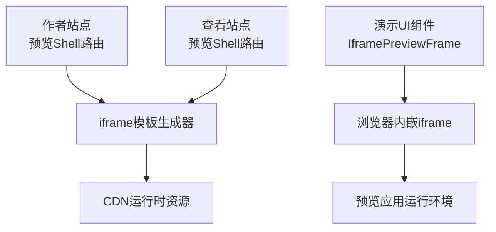
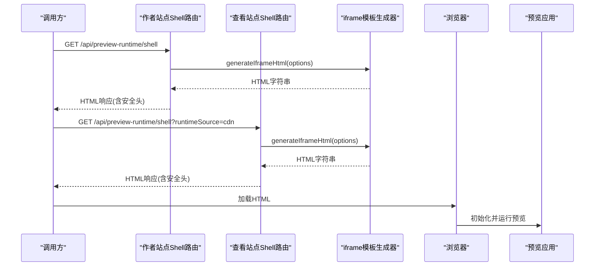
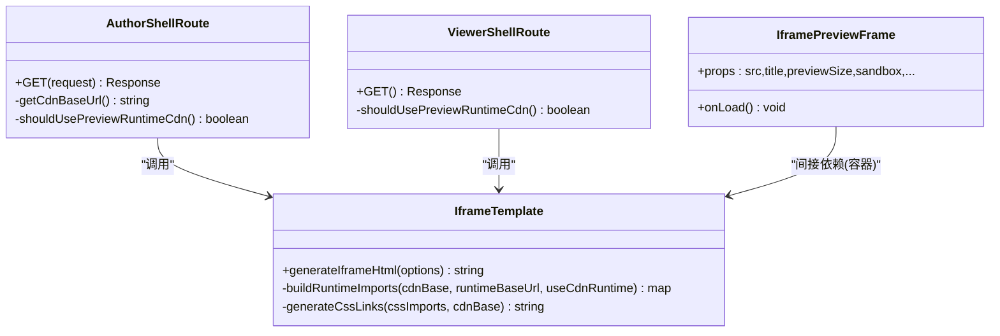

# 嵌入集成

<cite>
**本文引用的文件**   
- [packages/viewer-site/src/app/api/preview-runtime/shell/route.ts](file://packages/viewer-site/src/app/api/preview-runtime/shell/route.ts)
- [packages/author-site/src/app/api/preview-runtime/shell/route.ts](file://packages/author-site/src/app/api/preview-runtime/shell/route.ts)
- [packages/demo-ui/src/IframePreviewFrame.tsx](file://packages/demo-ui/src/IframePreviewFrame.tsx)
- [packages/demo-ui/src/iframe-template.ts](file://packages/demo-ui/src/iframe-template.ts)
- [docs/项目文档/使用端/02-预览与配置/技术/02_iframe通信机制.md](file://docs/项目文档/使用端/02-预览与配置/技术/02_iframe通信机制.md)
- [docs/项目文档/创作端/07-嵌入API/嵌入API_需求文档.md](file://docs/项目文档/创作端/07-嵌入API/嵌入API_需求文档.md)
</cite>

## 目录
1. [简介](#简介)
2. [项目结构](#项目结构)
3. [核心组件](#核心组件)
4. [架构总览](#架构总览)
5. [详细组件分析](#详细组件分析)
6. [依赖关系分析](#依赖关系分析)
7. [性能考虑](#性能考虑)
8. [故障排查指南](#故障排查指南)
9. [结论](#结论)
10. [附录](#附录)

## 简介
本文件面向“嵌入集成”场景，聚焦 iframe 嵌入机制、跨域通信与安全策略、postMessage 协议定义、外部系统集成方案（认证传递、状态同步、数据交换）、安全策略配置（CSP、权限控制、访问白名单）、性能优化（懒加载、缓存、内存管理），并提供集成示例与最佳实践。

重要说明：
- 旧版 v1.0 的 postMessage 通信已废弃，新架构（v2.0）中由 viewer 内部处理，不再通过外层 postMessage 与 iframe 通信。
- 当前实现以服务端渲染 iframe HTML 模板为主，结合 CDN 运行时资源加载，提供可嵌入的预览能力。

章节来源
- [docs/项目文档/使用端/02-预览与配置/技术/02_iframe通信机制.md:1-27](file://docs/项目文档/使用端/02-预览与配置/技术/02_iframe通信机制.md#L1-L27)

## 项目结构
与嵌入集成相关的核心代码位于以下模块：
- 预览运行时 Shell 路由：负责生成并返回 iframe 所需的 HTML 模板
- 演示 UI 组件：封装 iframe 容器、尺寸自适应、沙箱属性等
- 模板生成器：构建 iframe HTML，注入运行时依赖、CDN 地址、初始配置等

图表来源
- [packages/author-site/src/app/api/preview-runtime/shell/route.ts:1-24](file://packages/author-site/src/app/api/preview-runtime/shell/route.ts#L1-L24)
- [packages/viewer-site/src/app/api/preview-runtime/shell/route.ts:1-28](file://packages/viewer-site/src/app/api/preview-runtime/shell/route.ts#L1-L28)
- [packages/demo-ui/src/IframePreviewFrame.tsx:32-62](file://packages/demo-ui/src/IframePreviewFrame.tsx#L32-L62)
- [packages/demo-ui/src/iframe-template.ts:1270-1298](file://packages/demo-ui/src/iframe-template.ts#L1270-L1298)

章节来源
- [packages/author-site/src/app/api/preview-runtime/shell/route.ts:1-24](file://packages/author-site/src/app/api/preview-runtime/shell/route.ts#L1-L24)
- [packages/viewer-site/src/app/api/preview-runtime/shell/route.ts:1-28](file://packages/viewer-site/src/app/api/preview-runtime/shell/route.ts#L1-L28)
- [packages/demo-ui/src/IframePreviewFrame.tsx:32-62](file://packages/demo-ui/src/IframePreviewFrame.tsx#L32-L62)
- [packages/demo-ui/src/iframe-template.ts:1270-1298](file://packages/demo-ui/src/iframe-template.ts#L1270-L1298)

## 核心组件
- 预览运行时 Shell 路由（作者站点与查看站点）
  - 根据环境变量或请求参数决定运行时来源（本地或 CDN）
  - 调用模板生成器产出 iframe HTML，设置必要响应头（如 nosniff、no-store）
- 演示 UI 组件 IframePreviewFrame
  - 提供 iframe 容器、沙箱属性、尺寸自适应、加载回调等
- 模板生成器 iframe-template
  - 组装 CSS 导入、运行时依赖、初始代码/URL、初始配置等
  - 支持 URL 模式与 CDN 基址配置

章节来源
- [packages/author-site/src/app/api/preview-runtime/shell/route.ts:1-24](file://packages/author-site/src/app/api/preview-runtime/shell/route.ts#L1-L24)
- [packages/viewer-site/src/app/api/preview-runtime/shell/route.ts:1-28](file://packages/viewer-site/src/app/api/preview-runtime/shell/route.ts#L1-L28)
- [packages/demo-ui/src/IframePreviewFrame.tsx:32-62](file://packages/demo-ui/src/IframePreviewFrame.tsx#L32-L62)
- [packages/demo-ui/src/iframe-template.ts:1270-1298](file://packages/demo-ui/src/iframe-template.ts#L1270-L1298)

## 架构总览
整体流程：客户端请求预览 Shell 路由 → 服务端生成 iframe HTML → 浏览器加载并执行 → 预览应用在隔离环境中运行。

图表来源
- [packages/author-site/src/app/api/preview-runtime/shell/route.ts:1-24](file://packages/author-site/src/app/api/preview-runtime/shell/route.ts#L1-L24)
- [packages/viewer-site/src/app/api/preview-runtime/shell/route.ts:1-28](file://packages/viewer-site/src/app/api/preview-runtime/shell/route.ts#L1-L28)
- [packages/demo-ui/src/iframe-template.ts:1270-1298](file://packages/demo-ui/src/iframe-template.ts#L1270-L1298)

## 详细组件分析

### 预览运行时 Shell 路由（作者站点）
- 功能要点
  - 解析请求参数 runtimeSource，决定是否使用 CDN 运行时
  - 获取 CDN 基址，调用模板生成器产出 HTML
  - 设置响应头 Content-Type、Cache-Control、X-Content-Type-Options
- 关键路径
  - 入口：GET /api/preview-runtime/shell
  - 依赖：getCdnBaseUrl、shouldUsePreviewRuntimeCdn、generateIframeHtml

章节来源
- [packages/author-site/src/app/api/preview-runtime/shell/route.ts:1-24](file://packages/author-site/src/app/api/preview-runtime/shell/route.ts#L1-L24)

### 预览运行时 Shell 路由（查看站点）
- 功能要点
  - 根据环境变量 PREVIEW_RUNTIME_SOURCE 或 PREVIEW_RUNTIME_CDN_FALLBACK 决定运行时来源
  - 传入 supportUrlMode、CDN 基址、useCdnRuntime 给模板生成器
  - 设置响应头确保内容类型与缓存策略
- 关键路径
  - 入口：GET /api/preview-runtime/shell
  - 依赖：generateIframeHtml

章节来源
- [packages/viewer-site/src/app/api/preview-runtime/shell/route.ts:1-28](file://packages/viewer-site/src/app/api/preview-runtime/shell/route.ts#L1-L28)

### 演示 UI 组件 IframePreviewFrame
- 功能要点
  - 提供 iframe 容器与 ref，支持 sandbox 属性（默认 allow-scripts）
  - 监听容器尺寸变化，归一化宽高后更新状态
  - 暴露 onLoad 回调、configData、sessionId、demoId 等属性
- 设计考量
  - 尺寸自适应避免布局抖动
  - 沙箱最小权限原则，按需开启 same-origin

章节来源
- [packages/demo-ui/src/IframePreviewFrame.tsx:32-62](file://packages/demo-ui/src/IframePreviewFrame.tsx#L32-L62)

### 模板生成器 iframe-template
- 功能要点
  - 构建运行时依赖映射（基于 CDN 基址与 useCdnRuntime）
  - 生成 CSS 链接、初始代码/URL、初始配置 JSON
  - 支持 URL 模式与 baseOrigin 等选项
- 复杂度与扩展点
  - 依赖解析逻辑集中，便于切换 CDN 提供商
  - 可扩展注入更多运行时开关或调试信息

章节来源
- [packages/demo-ui/src/iframe-template.ts:1270-1298](file://packages/demo-ui/src/iframe-template.ts#L1270-L1298)

### 历史通信机制（已废弃）
- 背景
  - v1.0 使用 postMessage 在父页面与 iframe 间通信
  - 消息格式包含 type、payload 等字段；发送时机为首次加载完成与增量配置变更
  - 安全约束包括 sandbox 与 targetOrigin 校验
- 现状
  - v2.0 已废弃该机制，所有功能由 viewer 内部处理

章节来源
- [docs/项目文档/使用端/02-预览与配置/技术/02_iframe通信机制.md:1-27](file://docs/项目文档/使用端/02-预览与配置/技术/02_iframe通信机制.md#L1-L27)

### 嵌入 API 需求（参考）
- 事件类型
  - READY、LOADED、RESIZE、RUNTIME_ERROR 等
- 动态更新
  - 可通过 postMessage 向 iframe 发送 UPDATE_CODE 等指令
- 错误处理
  - 运行时错误通过 RUNTIME_ERROR 上报，包含 error、stack 等字段
- 注意
  - 此部分为需求文档中的示例与约定，实际实现需以当前架构为准

章节来源
- [docs/项目文档/创作端/07-嵌入API/嵌入API_需求文档.md:131-200](file://docs/项目文档/创作端/07-嵌入API/嵌入API_需求文档.md#L131-L200)

## 依赖关系分析
- 组件耦合
  - Shell 路由强依赖模板生成器；模板生成器依赖运行时依赖解析与 CDN 配置
  - IframePreviewFrame 仅作为容器，不直接参与运行时逻辑
- 外部依赖
  - CDN 运行时资源（esm.sh 或其他）
  - Next.js 响应对象用于设置安全头与缓存策略

图表来源
- [packages/author-site/src/app/api/preview-runtime/shell/route.ts:1-24](file://packages/author-site/src/app/api/preview-runtime/shell/route.ts#L1-L24)
- [packages/viewer-site/src/app/api/preview-runtime/shell/route.ts:1-28](file://packages/viewer-site/src/app/api/preview-runtime/shell/route.ts#L1-L28)
- [packages/demo-ui/src/iframe-template.ts:1270-1298](file://packages/demo-ui/src/iframe-template.ts#L1270-L1298)
- [packages/demo-ui/src/IframePreviewFrame.tsx:32-62](file://packages/demo-ui/src/IframePreviewFrame.tsx#L32-L62)

章节来源
- [packages/author-site/src/app/api/preview-runtime/shell/route.ts:1-24](file://packages/author-site/src/app/api/preview-runtime/shell/route.ts#L1-L24)
- [packages/viewer-site/src/app/api/preview-runtime/shell/route.ts:1-28](file://packages/viewer-site/src/app/api/preview-runtime/shell/route.ts#L1-L28)
- [packages/demo-ui/src/iframe-template.ts:1270-1298](file://packages/demo-ui/src/iframe-template.ts#L1270-L1298)
- [packages/demo-ui/src/IframePreviewFrame.tsx:32-62](file://packages/demo-ui/src/IframePreviewFrame.tsx#L32-L62)

## 性能考虑
- 懒加载
  - 仅在需要时创建 iframe 实例，延迟加载预览资源
  - 使用 IntersectionObserver 触发首次加载
- 缓存策略
  - 对静态资源启用长期缓存，对 Shell HTML 使用 no-store 避免陈旧版本
  - 通过 URL 查询参数或版本号控制缓存失效
- 内存管理
  - 及时销毁不可见的 iframe 实例，释放 DOM 与脚本上下文
  - 避免在父页面持有大量引用，防止内存泄漏
- 运行时来源选择
  - 优先使用 CDN 运行时以提升首屏速度，必要时回退到本地

[本节为通用指导，无需具体文件来源]

## 故障排查指南
- 常见问题
  - 预览不刷新：检查 key 或 URL 是否随版本变化；确认 no-store 生效
  - 运行时错误：关注 RUNTIME_ERROR 事件与堆栈信息
  - 跨域问题：校验 targetOrigin 与 CSP 策略
- 诊断建议
  - 记录 iframe 生命周期事件（ready、load、loaded）
  - 对比不同运行时来源（本地 vs CDN）的表现差异
  - 使用浏览器开发者工具监控网络与控制台日志

章节来源
- [docs/项目文档/使用端/02-预览与配置/技术/02_iframe通信机制.md:1-27](file://docs/项目文档/使用端/02-预览与配置/技术/02_iframe通信机制.md#L1-L27)
- [docs/项目文档/创作端/07-嵌入API/嵌入API_需求文档.md:131-200](file://docs/项目文档/创作端/07-嵌入API/嵌入API_需求文档.md#L131-L200)

## 结论
当前嵌入集成以服务端渲染 iframe HTML 为核心，结合 CDN 运行时与严格的安全头策略，提供稳定且安全的预览能力。旧版 postMessage 通信已废弃，新功能应在 viewer 内部实现。建议在集成中遵循最小权限原则、合理配置缓存与懒加载，并做好错误上报与诊断，以确保安全性与稳定性。

[本节为总结性内容，无需具体文件来源]

## 附录

### 安全策略配置清单
- 内容安全策略（CSP）
  - 限制脚本来源、样式来源、图片来源等
  - 禁止内联脚本与 eval
- 权限控制
  - iframe sandbox 最小权限（allow-scripts）
  - 按需开启 allow-same-origin，谨慎评估风险
- 访问白名单
  - 限定允许的域名与子域
  - 校验 targetOrigin，拒绝未知来源的消息

[本节为通用指导，无需具体文件来源]

### 集成示例与最佳实践
- 基本嵌入
  - 使用 IframePreviewFrame 组件，设置 sandbox 与尺寸
  - 通过 onLoad 回调处理就绪事件
- 动态更新
  - 如需更新代码或配置，按需求文档约定的消息类型进行交互
- 错误处理
  - 捕获 RUNTIME_ERROR，记录错误信息与堆栈
- 调试技巧
  - 打开浏览器控制台，观察网络请求与事件流
  - 使用不同的 runtimeSource 参数对比行为

章节来源
- [packages/demo-ui/src/IframePreviewFrame.tsx:32-62](file://packages/demo-ui/src/IframePreviewFrame.tsx#L32-L62)
- [docs/项目文档/创作端/07-嵌入API/嵌入API_需求文档.md:131-200](file://docs/项目文档/创作端/07-嵌入API/嵌入API_需求文档.md#L131-L200)