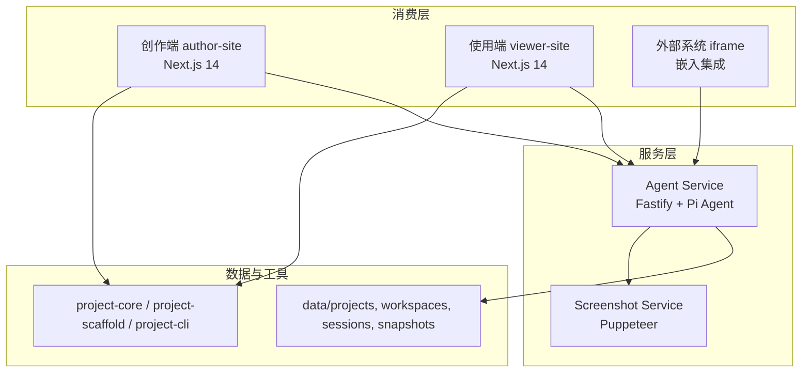
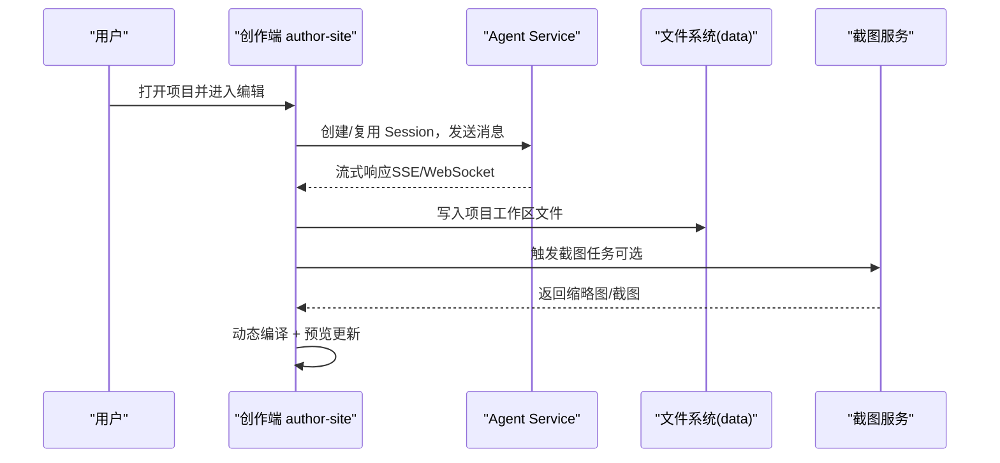
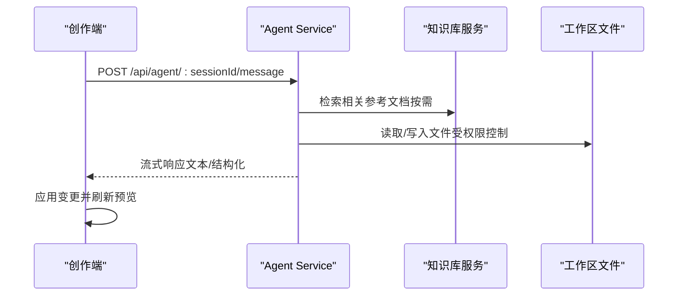
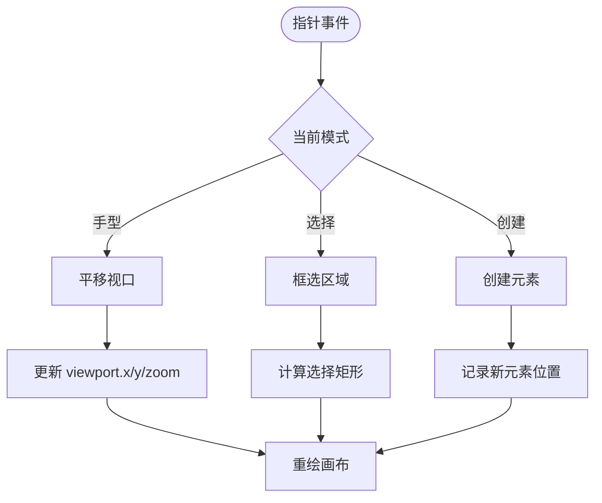
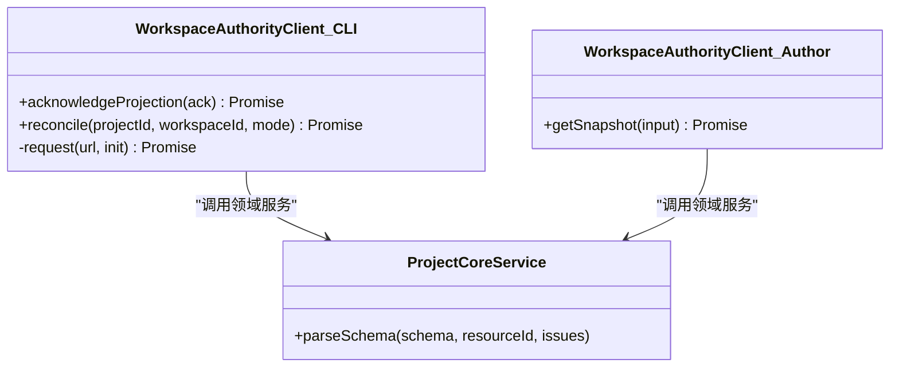
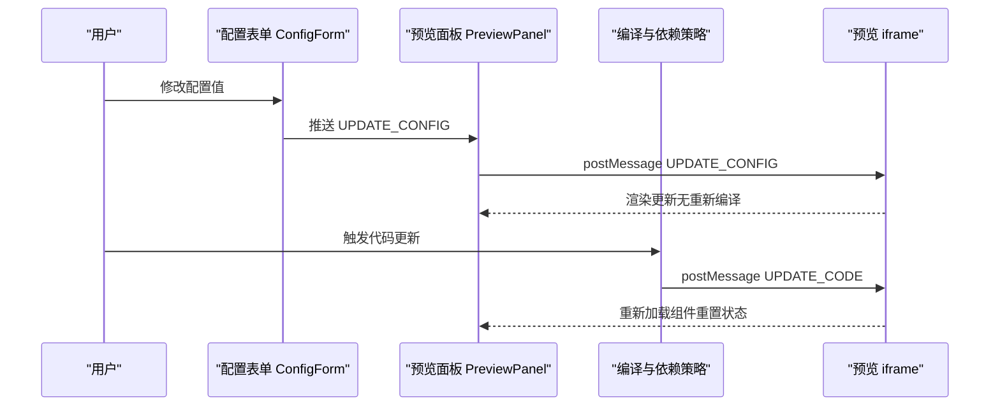
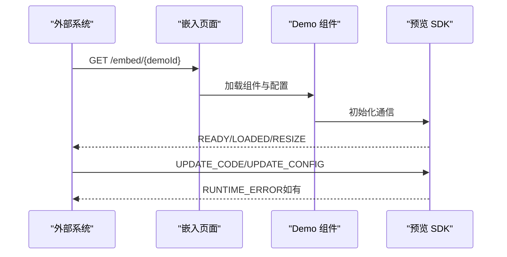
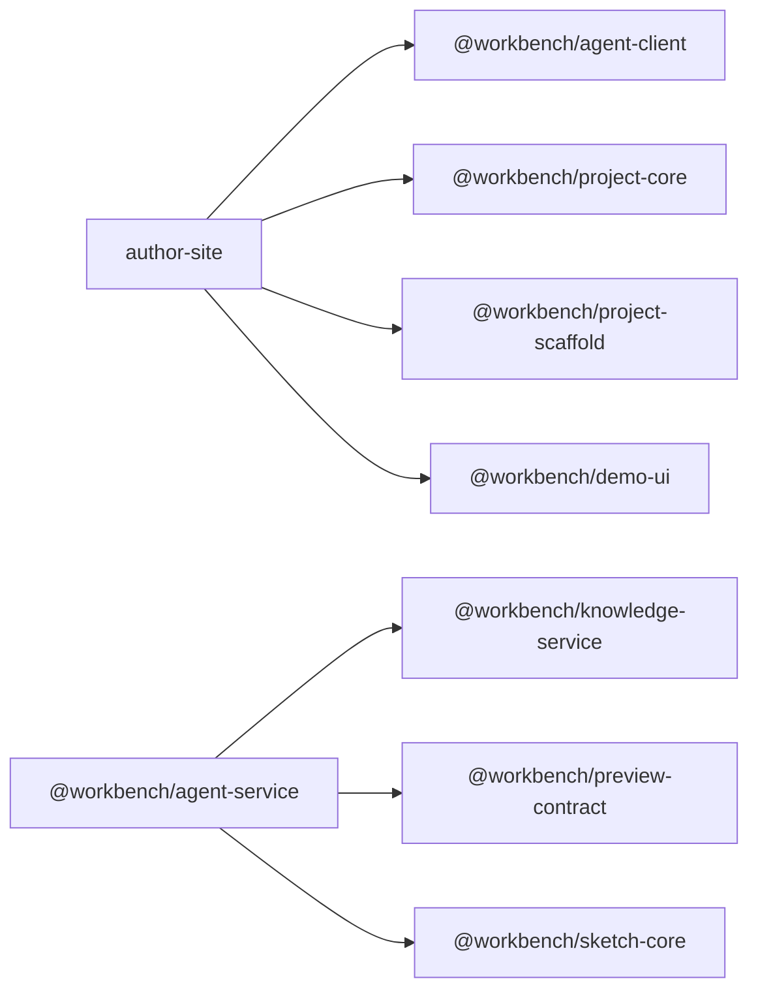

# 核心功能

<cite>
**本文引用的文件**   
- [项目总览.md](file://docs/项目文档/项目总览.md)
- [预览系统_需求文档.md](file://docs/项目文档/创作端/04-配置与预览/预览系统_需求文档.md)
- [iframe沙箱与动态CDN编译策略.md](file://docs/复盘文档/预览引擎/iframe沙箱与动态CDN编译策略.md)
- [嵌入API_需求文档.md](file://docs/项目文档/创作端/07-嵌入API/嵌入API_需求文档.md)
- [INDEX.md（嵌入API索引）](file://docs/项目文档/创作端/07-嵌入API/INDEX.md)
- [agent-service/package.json](file://packages/agent-service/package.json)
- [author-site/package.json](file://packages/author-site/package.json)
- [project-core/package.json](file://packages/project-core/package.json)
- [路由处理 route.ts](file://packages/author-site/src/app/api/demos/[id]/route.ts)
- [编辑页 page.tsx](file://packages/author-site/src/app/demo/[id]/edit/page.tsx)
- [工作区刷新 workspace-flush.ts](file://packages/author-site/src/lib/workspace-flush.ts)
- [Workspace Authority 客户端（CLI）](file://packages/project-cli/src/workspace-authority-client.ts)
- [Workspace Authority 客户端（Author Site）](file://packages/author-site/src/lib/workspace-authority-client.ts)
- [预览依赖策略 preview-dependency-policy.ts](file://packages/author-site/src/lib/preview-dependency-policy.ts)
- [构建预览运行时 build-preview-runtime.mjs](file://scripts/build-preview-runtime.mjs)
- [预览契约 rules.ts](file://packages/preview-contract/src/rules.ts)
- [CanvasViewport.tsx](file://packages/demo-ui/src/CanvasViewport.tsx)
- [PreviewPanel.tsx](file://packages/demo-ui/src/PreviewPanel.tsx)
- [ConfigForm.tsx](file://packages/demo-ui/src/ConfigForm.tsx)
- [服务实现 service.ts](file://packages/project-core/src/service.ts)
- [Pi Agent 后端 pi-agent.ts](file://packages/agent-service/src/backends/pi-agent.ts)
- [模型配置指南.md](file://docs/用户指南/模型配置指南.md)
- [AI错误归一化测试 ai-error-normalizer.test.ts](file://packages/author-site/src/lib/__tests__/ai-error-normalizer.test.ts)
</cite>

## 目录
1. [简介](#简介)
2. [项目结构](#项目结构)
3. [核心组件](#核心组件)
4. [架构总览](#架构总览)
5. [详细组件分析](#详细组件分析)
6. [依赖关系分析](#依赖关系分析)
7. [性能考量](#性能考量)
8. [故障排查指南](#故障排查指南)
9. [结论](#结论)
10. [附录](#附录)

## 简介
Workbench 是一个面向组件化开发的 AI 辅助创作与使用平台，提供从组件设计、AI 辅助编码、配置管理到预览嵌入的完整工作流。其核心价值包括：
- 创作端 OneFlow：开发者通过 AI 对话生成/修改组件代码，实时预览效果，管理配置 Schema
- 使用端 FlowSite：非技术人员浏览项目、调整配置参数、预览组件效果，无需编码
- Agent 服务：独立的 AI 代理服务层，当前采用 Pi Agent 单后端并提供项目工作空间 API
- 嵌入集成：通过 iframe + postMessage 协议，将组件嵌入外部系统使用
- 项目工具链：通过 project-core、project-scaffold、project-cli 复用项目读写与脚手架能力

适用场景：组件库开发、低代码平台、营销页面搭建、第三方集成、设计系统管理。

章节来源
- [项目总览.md:1-264](file://docs/项目文档/项目总览.md#L1-L264)

## 项目结构
仓库采用 Monorepo 组织方式，关键包与服务如下：
- author-site：创作端（Next.js，端口 3200）
- viewer-site：使用端（Next.js，端口 3300）
- agent-service：Agent 服务（Fastify，端口 3201）
- screenshot-service：截图服务（Fastify + Puppeteer，端口 3202）
- project-core：项目读写领域服务，供 Web API 与 CLI 复用
- project-scaffold：本地项目包协议与脚手架转换器
- project-cli：项目管理 JSON-first CLI（ow / workbench-project-admin）
- shared：共享类型/常量
- demo-ui：演示与通用 UI 组件（含画布、预览面板等）

图表来源
- [项目总览.md:33-119](file://docs/项目文档/项目总览.md#L33-L119)
- [agent-service/package.json:1-53](file://packages/agent-service/package.json#L1-L53)
- [author-site/package.json:1-127](file://packages/author-site/package.json#L1-L127)

章节来源
- [项目总览.md:99-119](file://docs/项目文档/项目总览.md#L99-L119)
- [agent-service/package.json:1-53](file://packages/agent-service/package.json#L1-L53)
- [author-site/package.json:1-127](file://packages/author-site/package.json#L1-L127)

## 核心组件
- AI 辅助编码：自然语言指令 → Agent Service → 流式响应 → 代码修改；支持会话上下文、知识库检索、Schema 校验与错误归一化
- 可视化画布编辑器：基于 CanvasViewport 的交互模式（平移、缩放、选择、创建），与预览面板联动
- 项目管理与协作：工作区权威（Workspace Authority）、基准工作区与分支工作区、快照与版本历史、多租户隔离
- 配置驱动与实时预览：JSON Schema 驱动表单生成，动态编译与双通道 postMessage 更新（UPDATE_CODE/UPDATE_CONFIG）
- 嵌入集成：iframe 嵌入 + postMessage 双向通信，支持 Demo 级与项目级嵌入
- 外部系统集成：REST API、WebSocket、内部配置同步接口、截图服务

章节来源
- [项目总览.md:123-207](file://docs/项目文档/项目总览.md#L123-L207)
- [预览系统_需求文档.md:1-55](file://docs/项目文档/创作端/04-配置与预览/预览系统_需求文档.md#L1-L55)
- [iframe沙箱与动态CDN编译策略.md:40-84](file://docs/复盘文档/预览引擎/iframe沙箱与动态CDN编译策略.md#L40-L84)
- [嵌入API_需求文档.md:1-78](file://docs/项目文档/创作端/07-嵌入API/嵌入API_需求文档.md#L1-L78)

## 架构总览
整体采用“前端消费层 + 独立服务层 + 文件系统数据”的分层架构。创作端与使用端通过 HTTP 与 Agent 服务交互；截图服务提供页面截图能力；项目工作区与快照由 project-core 统一读写。

图表来源
- [项目总览.md:33-82](file://docs/项目文档/项目总览.md#L33-L82)
- [预览系统_需求文档.md:1-55](file://docs/项目文档/创作端/04-配置与预览/预览系统_需求文档.md#L1-L55)

## 详细组件分析

### AI 辅助编码
- 自然语言指令处理：作者端通过 REST 调用 Agent Service，传入 sessionId、demoId、workingDir 等上下文；Agent 根据系统提示词与工具集执行操作
- 代码生成与智能提示：Agent 可读取/修改工作区文件，结合 Schema 校验与知识库检索，输出结构化结果；错误归一化提升用户体验
- 模型配置与切换：支持多 Provider（OpenAI、Anthropic、SiliconFlow、Moonshot 等），通过环境变量或内部接口动态配置

图表来源
- [Pi Agent 后端 pi-agent.ts:889-926](file://packages/agent-service/src/backends/pi-agent.ts#L889-L926)
- [模型配置指南.md:111-276](file://docs/用户指南/模型配置指南.md#L111-L276)

章节来源
- [Pi Agent 后端 pi-agent.ts:889-926](file://packages/agent-service/src/backends/pi-agent.ts#L889-L926)
- [模型配置指南.md:111-276](file://docs/用户指南/模型配置指南.md#L111-L276)
- [AI错误归一化测试 ai-error-normalizer.test.ts:1-34](file://packages/author-site/src/lib/__tests__/ai-error-normalizer.test.ts#L1-L34)

### 可视化画布编辑器
- 交互模式：支持平移（hand）、框选（select）、点选与拖拽，光标样式随模式变化
- 视图变换：viewport.x/y/zoom 控制平移与缩放，事件捕获与释放确保交互一致性
- 与预览联动：画布状态变更触发预览面板更新，保持所见即所得

图表来源
- [CanvasViewport.tsx:510-554](file://packages/demo-ui/src/CanvasViewport.tsx#L510-L554)
- [CanvasViewport.tsx:377-420](file://packages/demo-ui/src/CanvasViewport.tsx#L377-L420)

章节来源
- [CanvasViewport.tsx:510-554](file://packages/demo-ui/src/CanvasViewport.tsx#L510-L554)
- [CanvasViewport.tsx:377-420](file://packages/demo-ui/src/CanvasViewport.tsx#L377-L420)

### 项目管理与协作（多租户与工作区）
- 多租户隔离：每个项目拥有独立的工作区与快照，Session 不直接拥有文件，避免跨会话污染
- 工作区权威：通过 Workspace Authority 客户端协调投影与确认，保证并发写入一致性与冲突解决
- 刷新与同步：在关键动作前 flush 工作区，确保基准工作区与快照一致

图表来源
- [Workspace Authority 客户端（CLI）:78-120](file://packages/project-cli/src/workspace-authority-client.ts#L78-L120)
- [Workspace Authority 客户端（Author Site）:219-244](file://packages/author-site/src/lib/workspace-authority-client.ts#L219-L244)
- [服务实现 service.ts:6253-6292](file://packages/project-core/src/service.ts#L6253-L6292)

章节来源
- [Workspace Authority 客户端（CLI）:78-120](file://packages/project-cli/src/workspace-authority-client.ts#L78-L120)
- [Workspace Authority 客户端（Author Site）:219-244](file://packages/author-site/src/lib/workspace-authority-client.ts#L219-L244)
- [工作区刷新 workspace-flush.ts:229-287](file://packages/author-site/src/lib/workspace-flush.ts#L229-L287)
- [服务实现 service.ts:6253-6292](file://packages/project-core/src/service.ts#L6253-L6292)

### 配置驱动与实时预览
- Schema 解析与表单生成：JSON Schema 解析为字段组，自动生成表单控件
- 动态编译与运行：服务端 sucrase 编译 TSX/JSX，注入依赖与运行时 SDK
- 双通道 postMessage：UPDATE_CODE（重新编译）与 UPDATE_CONFIG（仅更新 props），实现 <16ms 的配置联动

图表来源
- [ConfigForm.tsx:168-190](file://packages/demo-ui/src/ConfigForm.tsx#L168-L190)
- [PreviewPanel.tsx:230-277](file://packages/demo-ui/src/PreviewPanel.tsx#L230-L277)
- [预览依赖策略 preview-dependency-policy.ts:198-470](file://packages/author-site/src/lib/preview-dependency-policy.ts#L198-L470)
- [构建预览运行时 build-preview-runtime.mjs:192-335](file://scripts/build-preview-runtime.mjs#L192-L335)
- [iframe沙箱与动态CDN编译策略.md:53-68](file://docs/复盘文档/预览引擎/iframe沙箱与动态CDN编译策略.md#L53-L68)

章节来源
- [预览系统_需求文档.md:1-55](file://docs/项目文档/创作端/04-配置与预览/预览系统_需求文档.md#L1-L55)
- [iframe沙箱与动态CDN编译策略.md:40-84](file://docs/复盘文档/预览引擎/iframe沙箱与动态CDN编译策略.md#L40-L84)
- [预览契约 rules.ts:19-36](file://packages/preview-contract/src/rules.ts#L19-L36)

### 嵌入集成与外部系统集成
- 嵌入模式：Demo 级与项目级嵌入，支持指定页面与 Schema 合并
- 通信协议：父页面 ↔ iframe 的双向 postMessage，包含 READY/LOADED/RESIZE/RUNTIME_ERROR 等消息
- 安全与隔离：iframe 沙箱隔离样式与脚本，避免全局污染

图表来源
- [嵌入API_需求文档.md:1-78](file://docs/项目文档/创作端/07-嵌入API/嵌入API_需求文档.md#L1-L78)
- [INDEX.md（嵌入API索引）:1-60](file://docs/项目文档/创作端/07-嵌入API/INDEX.md#L1-L60)

章节来源
- [嵌入API_需求文档.md:1-78](file://docs/项目文档/创作端/07-嵌入API/嵌入API_需求文档.md#L1-L78)
- [INDEX.md（嵌入API索引）:1-60](file://docs/项目文档/创作端/07-嵌入API/INDEX.md#L1-L60)

### 使用场景与最佳实践
- AI 辅助编码
  - 场景：快速生成页面骨架、批量重构样式、按 Schema 生成可配置字段
  - 最佳实践：明确输入上下文（workingDir、demoId），使用 Schema 约束输出，利用错误归一化提示优化体验
- 可视化画布
  - 场景：布局编排、元素定位、交互式原型
  - 最佳实践：合理设置 viewport 初始缩放，避免频繁大跨度平移导致重绘开销
- 项目管理与协作
  - 场景：多人协同编辑、版本回溯、模板导出
  - 最佳实践：关键动作前 flush 工作区，使用 reconcile 恢复一致态
- 配置驱动与预览
  - 场景：非技术人员调整展示内容、A/B 测试不同配置
  - 最佳实践：优先使用 UPDATE_CONFIG 通道减少编译开销，保持 Schema 稳定
- 嵌入集成
  - 场景：将组件嵌入 CMS、营销平台、运营后台
  - 最佳实践：监听 RESIZE 自适应高度，处理 RUNTIME_ERROR 友好提示

[本节为概念性总结，不直接分析具体文件]

## 依赖关系分析
- 包依赖与职责
  - agent-service：依赖 Fastify、Pi Agent、yjs/ws 等，提供 REST 与 WebSocket 能力
  - author-site：依赖 Next.js、RJSF、sucrase、SWR 等，负责创作端 UI 与预览编译
  - project-core：提供项目读写领域服务，被 Web API 与 CLI 复用
- 模块耦合
  - 创作端与 Agent 服务通过 REST 与 WebSocket 解耦
  - 预览系统与 Agent 服务通过 postMessage 与编译产物解耦
  - 工作区权威客户端对 project-core 有强依赖，保证写入一致性

图表来源
- [author-site/package.json:1-127](file://packages/author-site/package.json#L1-L127)
- [agent-service/package.json:1-53](file://packages/agent-service/package.json#L1-L53)
- [project-core/package.json:1-27](file://packages/project-core/package.json#L1-L27)

章节来源
- [author-site/package.json:1-127](file://packages/author-site/package.json#L1-L127)
- [agent-service/package.json:1-53](file://packages/agent-service/package.json#L1-L53)
- [project-core/package.json:1-27](file://packages/project-core/package.json#L1-L27)

## 性能考量
- 预览编译延迟：服务端 sucrase 编译约 50ms，首次依赖加载 1-2s，后续变更几乎瞬时
- 配置联动：<16ms 内完成 UPDATE_CONFIG 的 props 更新，避免重新编译
- 截图服务：LRU 编译缓存 + 文件系统截图缓存，浏览器池管理优化并发
- 工作区同步：flush 与 reconcile 机制降低冲突概率，提升一致性

章节来源
- [iframe沙箱与动态CDN编译策略.md:62-68](file://docs/复盘文档/预览引擎/iframe沙箱与动态CDN编译策略.md#L62-L68)
- [预览系统_需求文档.md:31-55](file://docs/项目文档/创作端/04-配置与预览/预览系统_需求文档.md#L31-L55)
- [项目总览.md:64-72](file://docs/项目文档/项目总览.md#L64-L72)

## 故障排查指南
- AI 连接与鉴权问题
  - 现象：连接失败、超时、鉴权失败、配额受限、上一轮仍在运行
  - 处理：检查网络与 API Key、余额与模型名称、Provider 匹配；等待上一轮完成或取消后再发
- 预览错误
  - 现象：语法错误、运行时错误、自动修复提示
  - 处理：查看错误边界提示，必要时触发 AI 修复任务，关注控制台日志
- 工作区同步异常
  - 现象：WORKSPACE_STALE、WORKSPACE_AUTHORITY_NOT_READY
  - 处理：重试 reconcile/restore，确认基准工作区与快照一致

章节来源
- [AI错误归一化测试 ai-error-normalizer.test.ts:1-34](file://packages/author-site/src/lib/__tests__/ai-error-normalizer.test.ts#L1-L34)
- [预览系统_需求文档.md:41-55](file://docs/项目文档/创作端/04-配置与预览/预览系统_需求文档.md#L41-L55)
- [Workspace Authority 客户端（CLI）:78-120](file://packages/project-cli/src/workspace-authority-client.ts#L78-L120)

## 结论
Workbench 以 AI 为核心，结合配置驱动与实时预览，形成从创作到使用的闭环。通过独立 Agent 服务与项目工作区机制，实现了高扩展性与一致性；嵌入集成与外部系统集成进一步拓展了使用边界。建议在实际使用中遵循最佳实践，充分利用 Schema 与双通道预览机制，以获得更流畅的创作与集成体验。

[本节为总结性内容，不直接分析具体文件]

## 附录
- 常用入口与路由
  - 项目更新/删除：/api/demos/[id]
  - 编辑页：/demo/[id]/edit
- 关键文件路径
  - 路由处理：packages/author-site/src/app/api/demos/[id]/route.ts
  - 编辑页：packages/author-site/src/app/demo/[id]/edit/page.tsx

章节来源
- [路由处理 route.ts:69-109](file://packages/author-site/src/app/api/demos/[id]/route.ts#L69-L109)
- [编辑页 page.tsx:775-876](file://packages/author-site/src/app/demo/[id]/edit/page.tsx#L775-L876)
- [编辑页 page.tsx:6773-6797](file://packages/author-site/src/app/demo/[id]/edit/page.tsx#L6773-L6797)