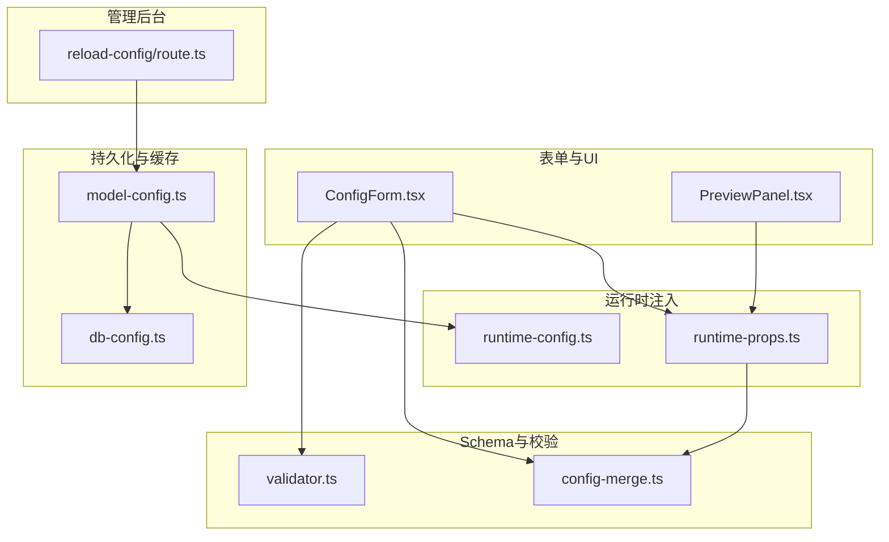
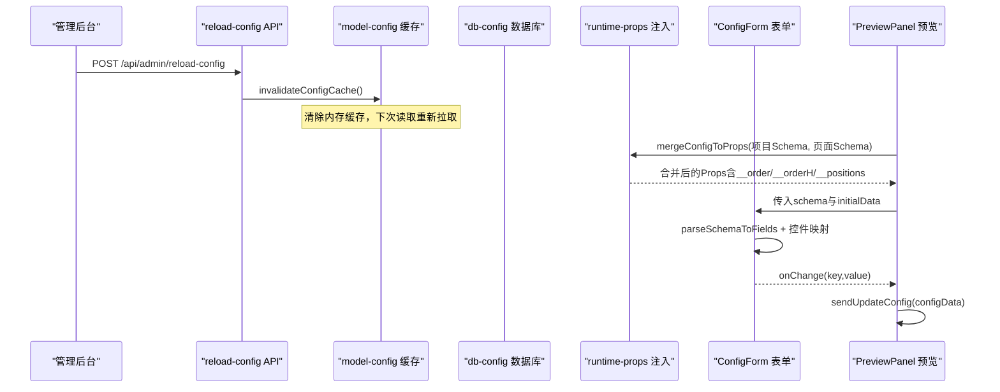
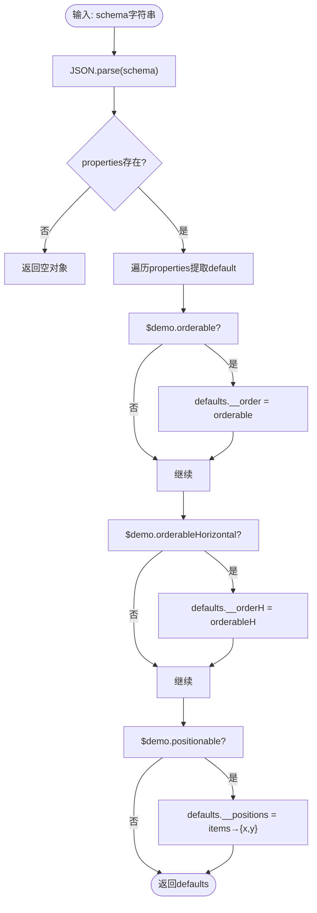
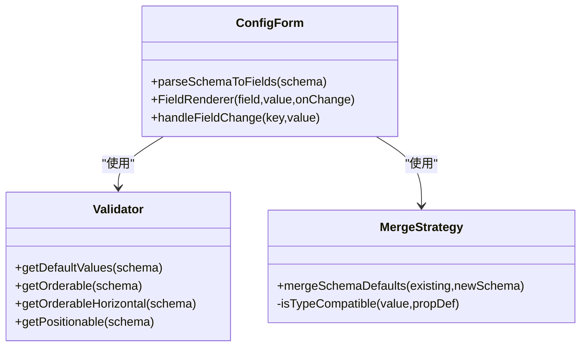
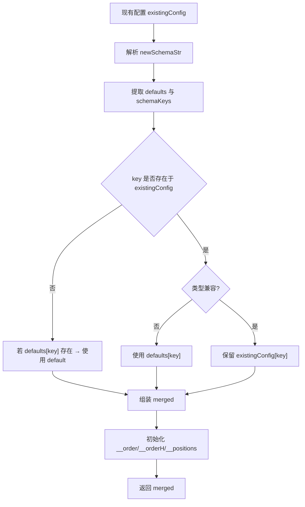
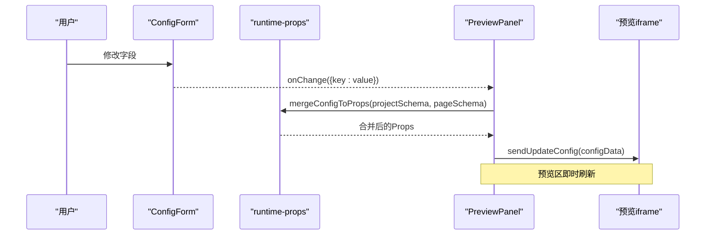
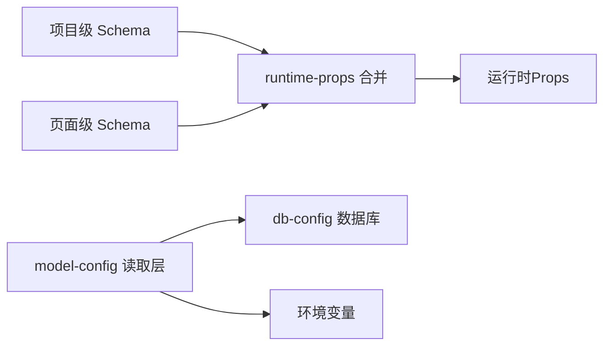
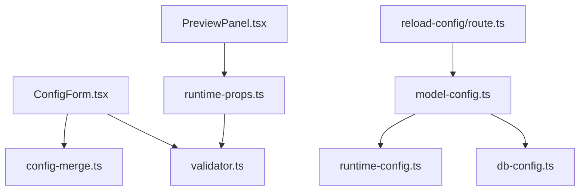

# 配置管理系统

<cite>
**本文引用的文件**   
- [packages/demo-ui/src/ConfigForm.tsx](file://packages/demo-ui/src/ConfigForm.tsx)
- [packages/demo-ui/src/validator.ts](file://packages/demo-ui/src/validator.ts)
- [packages/author-site/src/lib/config-merge.ts](file://packages/author-site/src/lib/config-merge.ts)
- [packages/author-site/src/lib/runtime-props.ts](file://packages/author-site/src/lib/runtime-props.ts)
- [packages/author-site/src/lib/db-config.ts](file://packages/author-site/src/lib/db-config.ts)
- [packages/author-site/src/lib/model-config.ts](file://packages/author-site/src/lib/model-config.ts)
- [packages/author-site/src/app/api/admin/reload-config/route.ts](file://packages/author-site/src/app/api/admin/reload-config/route.ts)
- [packages/author-site/src/lib/runtime-config.ts](file://packages/author-site/src/lib/runtime-config.ts)
- [packages/demo-ui/src/PreviewPanel.tsx](file://packages/demo-ui/src/PreviewPanel.tsx)
- [data/projects/proj_1779608458649/workspace/project.config.schema.json](file://data/projects/proj_1779608458649/workspace/project.config.schema.json)
- [docs/项目文档/创作端/04-配置与预览/技术/03_表单生成器.md](file://docs/项目文档/创作端/04-配置与预览/技术/03_表单生成器.md)
</cite>

## 目录
1. [简介](#简介)
2. [项目结构](#项目结构)
3. [核心组件](#核心组件)
4. [架构总览](#架构总览)
5. [详细组件分析](#详细组件分析)
6. [依赖关系分析](#依赖关系分析)
7. [性能考虑](#性能考虑)
8. [故障排查指南](#故障排查指南)
9. [结论](#结论)
10. [附录](#附录)

## 简介
本技术文档围绕仓库中的“配置管理系统”展开，系统性阐述以下能力：
- JSON Schema 定义机制：类型系统、验证规则与依赖关系管理（含 $demo 扩展）
- 表单自动生成引擎：控件映射、布局算法与 UI 渲染
- 配置验证与迁移：版本兼容性检查与数据转换逻辑
- 配置驱动的开发流程：运行时配置加载、热重载与动态更新
- 配置共享与继承：项目级配置、页面级配置与环境变量覆盖
- 模板与最佳实践：常见模式、性能优化与安全考量

## 项目结构
配置系统由前端表单渲染、Schema 校验与提取、运行时合并注入、持久化与缓存、以及管理后台热重载等模块组成。关键路径如下：
- 表单渲染与控件映射：packages/demo-ui/src/ConfigForm.tsx
- Schema 解析与元信息提取：packages/demo-ui/src/validator.ts
- 配置合并策略（新增/删除/类型兼容）：packages/author-site/src/lib/config-merge.ts
- 运行时 Props 注入（项目级+页面级）：packages/author-site/src/lib/runtime-props.ts
- 数据库读写封装（system_configs）：packages/author-site/src/lib/db-config.ts
- 模型配置读取层（DB 优先，环境变量回退）：packages/author-site/src/lib/model-config.ts
- 管理后台热重载 API：packages/author-site/src/app/api/admin/reload-config/route.ts
- 运行时环境变量解析：packages/author-site/src/lib/runtime-config.ts
- 预览面板推送配置到 iframe：packages/demo-ui/src/PreviewPanel.tsx
- 示例项目级 Schema：data/projects/.../project.config.schema.json
- 表单生成器设计文档：docs/项目文档/创作端/04-配置与预览/技术/03_表单生成器.md

图表来源
- [packages/demo-ui/src/ConfigForm.tsx:1-800](file://packages/demo-ui/src/ConfigForm.tsx#L1-L800)
- [packages/demo-ui/src/validator.ts:1-192](file://packages/demo-ui/src/validator.ts#L1-L192)
- [packages/author-site/src/lib/config-merge.ts:1-133](file://packages/author-site/src/lib/config-merge.ts#L1-L133)
- [packages/author-site/src/lib/runtime-props.ts:1-171](file://packages/author-site/src/lib/runtime-props.ts#L1-L171)
- [packages/author-site/src/lib/db-config.ts:1-129](file://packages/author-site/src/lib/db-config.ts#L1-L129)
- [packages/author-site/src/lib/model-config.ts:1-219](file://packages/author-site/src/lib/model-config.ts#L1-L219)
- [packages/author-site/src/app/api/admin/reload-config/route.ts:1-44](file://packages/author-site/src/app/api/admin/reload-config/route.ts#L1-L44)
- [packages/author-site/src/lib/runtime-config.ts:1-80](file://packages/author-site/src/lib/runtime-config.ts#L1-L80)
- [packages/demo-ui/src/PreviewPanel.tsx:848-906](file://packages/demo-ui/src/PreviewPanel.tsx#L848-L906)

章节来源
- [packages/demo-ui/src/ConfigForm.tsx:1-800](file://packages/demo-ui/src/ConfigForm.tsx#L1-L800)
- [packages/demo-ui/src/validator.ts:1-192](file://packages/demo-ui/src/validator.ts#L1-L192)
- [packages/author-site/src/lib/config-merge.ts:1-133](file://packages/author-site/src/lib/config-merge.ts#L1-L133)
- [packages/author-site/src/lib/runtime-props.ts:1-171](file://packages/author-site/src/lib/runtime-props.ts#L1-L171)
- [packages/author-site/src/lib/db-config.ts:1-129](file://packages/author-site/src/lib/db-config.ts#L1-L129)
- [packages/author-site/src/lib/model-config.ts:1-219](file://packages/author-site/src/lib/model-config.ts#L1-L219)
- [packages/author-site/src/app/api/admin/reload-config/route.ts:1-44](file://packages/author-site/src/app/api/admin/reload-config/route.ts#L1-L44)
- [packages/author-site/src/lib/runtime-config.ts:1-80](file://packages/author-site/src/lib/runtime-config.ts#L1-L80)
- [packages/demo-ui/src/PreviewPanel.tsx:848-906](file://packages/demo-ui/src/PreviewPanel.tsx#L848-L906)
- [data/projects/proj_1779608458649/workspace/project.config.schema.json:1-14](file://data/projects/proj_1779608458649/workspace/project.config.schema.json#L1-L14)
- [docs/项目文档/创作端/04-配置与预览/技术/03_表单生成器.md:1-800](file://docs/项目文档/创作端/04-配置与预览/技术/03_表单生成器.md#L1-L800)

## 核心组件
- ConfigForm 表单生成器：基于 JSON Schema 的字段解析、分组、条件显示与控件映射；支持排序、定位、备注与图片上传等扩展能力。
- validator 校验与提取：提供 getDefaultValues、getOrderable、getOrderableHorizontal、getPositionable、getPreviewSize 等工具函数，统一从 Schema 中抽取默认值与元信息。
- config-merge 合并策略：在 Schema 变更时，保留用户修改过的值，按类型兼容性判断是否替换为新 default，并初始化 __order/__orderH/__positions。
- runtime-props 运行时注入：合并项目级与页面级 Schema 的 default 值，检测字段冲突并抛出 SchemaConflictError。
- db-config 持久化：对 system_configs 表进行 CRUD，支持写入、读取、列表与初始化默认配置。
- model-config 模型配置层：优先从数据库读取，失败回退至环境变量；内置缓存与失效接口。
- reload-config API：管理后台触发缓存失效，使新配置立即生效。
- PreviewPanel 预览联动：将最新配置下发到预览 iframe，并在必要时收集可定位元素尺寸。

章节来源
- [packages/demo-ui/src/ConfigForm.tsx:1-800](file://packages/demo-ui/src/ConfigForm.tsx#L1-L800)
- [packages/demo-ui/src/validator.ts:1-192](file://packages/demo-ui/src/validator.ts#L1-L192)
- [packages/author-site/src/lib/config-merge.ts:1-133](file://packages/author-site/src/lib/config-merge.ts#L1-L133)
- [packages/author-site/src/lib/runtime-props.ts:1-171](file://packages/author-site/src/lib/runtime-props.ts#L1-L171)
- [packages/author-site/src/lib/db-config.ts:1-129](file://packages/author-site/src/lib/db-config.ts#L1-L129)
- [packages/author-site/src/lib/model-config.ts:1-219](file://packages/author-site/src/lib/model-config.ts#L1-L219)
- [packages/author-site/src/app/api/admin/reload-config/route.ts:1-44](file://packages/author-site/src/app/api/admin/reload-config/route.ts#L1-L44)
- [packages/demo-ui/src/PreviewPanel.tsx:848-906](file://packages/demo-ui/src/PreviewPanel.tsx#L848-L906)

## 架构总览
下图展示了配置从 Schema 到 UI 渲染、再到预览运行时的完整链路，以及管理后台的热重载路径。

图表来源
- [packages/author-site/src/app/api/admin/reload-config/route.ts:1-44](file://packages/author-site/src/app/api/admin/reload-config/route.ts#L1-L44)
- [packages/author-site/src/lib/model-config.ts:1-219](file://packages/author-site/src/lib/model-config.ts#L1-L219)
- [packages/author-site/src/lib/runtime-props.ts:1-171](file://packages/author-site/src/lib/runtime-props.ts#L1-L171)
- [packages/demo-ui/src/ConfigForm.tsx:1-800](file://packages/demo-ui/src/ConfigForm.tsx#L1-L800)
- [packages/demo-ui/src/PreviewPanel.tsx:848-906](file://packages/demo-ui/src/PreviewPanel.tsx#L848-L906)

## 详细组件分析

### JSON Schema 定义机制
- 类型系统与默认值：通过 properties 声明字段类型与 default；validator.getDefaultValues 会遍历 properties 提取默认值。
- 扩展元信息：$demo.orderable、$demo.orderableHorizontal、$demo.positionable、$demo.previewSize 等用于控制排序、定位与预览尺寸。
- 必填与分组：required 数组标记必填；ui:options.group 指定分组名称，未显式声明则自动推断。
- 条件显示：ui:options.visibleWhen 支持 field+equals 的轻量条件显示。

图表来源
- [packages/demo-ui/src/validator.ts:16-53](file://packages/demo-ui/src/validator.ts#L16-L53)
- [packages/demo-ui/src/validator.ts:107-143](file://packages/demo-ui/src/validator.ts#L107-L143)
- [packages/demo-ui/src/validator.ts:145-191](file://packages/demo-ui/src/validator.ts#L145-L191)

章节来源
- [packages/demo-ui/src/validator.ts:1-192](file://packages/demo-ui/src/validator.ts#L1-192)
- [data/projects/proj_1779608458649/workspace/project.config.schema.json:1-14](file://data/projects/proj_1779608458649/workspace/project.config.schema.json#L1-L14)

### 表单自动生成引擎
- 控件映射三层优先级：ui:widget 显式覆盖 > format 语义映射 > type 数据类型回退。
- 分组与筛选：根据 ui:options.group 或自动推断分组；PageConfigPanel 支持分类筛选。
- 条件显示：visibleWhen 仅影响 UI，不改变已保存值。
- 备注集成：字段级 $demo.note 存储 HTML，支持编辑与预览。
- 排序与定位：当 $demo.orderable/orderableHorizontal/positionable 满足条件时，渲染对应控件，结果写入 __order/__orderH/__positions。

图表来源
- [packages/demo-ui/src/ConfigForm.tsx:183-231](file://packages/demo-ui/src/ConfigForm.tsx#L183-L231)
- [packages/demo-ui/src/validator.ts:16-53](file://packages/demo-ui/src/validator.ts#L16-L53)
- [packages/author-site/src/lib/config-merge.ts:39-103](file://packages/author-site/src/lib/config-merge.ts#L39-L103)

章节来源
- [packages/demo-ui/src/ConfigForm.tsx:1-800](file://packages/demo-ui/src/ConfigForm.tsx#L1-L800)
- [docs/项目文档/创作端/04-配置与预览/技术/03_表单生成器.md:156-253](file://docs/项目文档/创作端/04-配置与预览/技术/03_表单生成器.md#L156-L253)

### 配置验证与迁移系统
- 合并策略：新增字段采用 schema default；删除字段移除；类型不兼容时使用新 default；__order/__orderH/__positions 始终来自当前 Schema。
- 类型兼容性：string/number/integer/boolean/array/object 严格匹配，未知类型默认兼容。
- 运行时冲突检测：项目级与页面级同名字段抛 SchemaConflictError。
- 用户修改检测：对比旧/新 default 与当前值，决定是否保留用户值。

图表来源
- [packages/author-site/src/lib/config-merge.ts:39-103](file://packages/author-site/src/lib/config-merge.ts#L39-L103)
- [packages/author-site/src/lib/config-merge.ts:108-132](file://packages/author-site/src/lib/config-merge.ts#L108-L132)
- [packages/author-site/src/lib/runtime-props.ts:78-94](file://packages/author-site/src/lib/runtime-props.ts#L78-L94)

章节来源
- [packages/author-site/src/lib/config-merge.ts:1-133](file://packages/author-site/src/lib/config-merge.ts#L1-133)
- [packages/author-site/src/lib/runtime-props.ts:1-171](file://packages/author-site/src/lib/runtime-props.ts#L1-L171)

### 配置驱动的开发流程（运行时加载、热重载、动态更新）
- 运行时加载：PreviewPanel 调用 runtime-props 合并项目级与页面级 Schema 的 default，得到 props 后下发给预览 iframe。
- 热重载：管理后台调用 reload-config API，清除 model-config 缓存，后续读取走数据库或环境变量。
- 动态更新：ConfigForm 监听 schema 变化，内部补齐缺失字段并保持等价性判断，避免不必要的重渲染。

图表来源
- [packages/demo-ui/src/PreviewPanel.tsx:848-906](file://packages/demo-ui/src/PreviewPanel.tsx#L848-L906)
- [packages/author-site/src/lib/runtime-props.ts:78-94](file://packages/author-site/src/lib/runtime-props.ts#L78-L94)
- [packages/demo-ui/src/ConfigForm.tsx:1378-1422](file://packages/demo-ui/src/ConfigForm.tsx#L1378-L1422)

章节来源
- [packages/demo-ui/src/PreviewPanel.tsx:848-906](file://packages/demo-ui/src/PreviewPanel.tsx#L848-L906)
- [packages/author-site/src/lib/runtime-props.ts:1-171](file://packages/author-site/src/lib/runtime-props.ts#L1-L171)
- [packages/demo-ui/src/ConfigForm.tsx:1378-1422](file://packages/demo-ui/src/ConfigForm.tsx#L1378-L1422)

### 配置共享与继承机制
- 项目级与页面级 Schema 合并：runtime-props.mergeConfigToProps 负责合并，禁止同名字段冲突（除保留键）。
- 环境变量覆盖：model-config 优先读数据库，失败回退环境变量；支持新旧结构双向兼容。
- 持久化：db-config 提供 system_configs 表的读写与初始化默认配置。

图表来源
- [packages/author-site/src/lib/runtime-props.ts:78-94](file://packages/author-site/src/lib/runtime-props.ts#L78-L94)
- [packages/author-site/src/lib/model-config.ts:172-201](file://packages/author-site/src/lib/model-config.ts#L172-L201)
- [packages/author-site/src/lib/db-config.ts:33-129](file://packages/author-site/src/lib/db-config.ts#L33-L129)
- [packages/author-site/src/lib/runtime-config.ts:72-79](file://packages/author-site/src/lib/runtime-config.ts#L72-L79)

章节来源
- [packages/author-site/src/lib/runtime-props.ts:1-171](file://packages/author-site/src/lib/runtime-props.ts#L1-L171)
- [packages/author-site/src/lib/model-config.ts:1-219](file://packages/author-site/src/lib/model-config.ts#L1-L219)
- [packages/author-site/src/lib/db-config.ts:1-129](file://packages/author-site/src/lib/db-config.ts#L1-L129)
- [packages/author-site/src/lib/runtime-config.ts:1-80](file://packages/author-site/src/lib/runtime-config.ts#L1-L80)

### 配置模板与最佳实践
- 推荐写法：单图字段优先使用 format:"image"；多图字段使用 type:"array" 或 ui:widget:"imageList"；富文本使用 ui:widget:"richtext"。
- 分组与分类：显式设置 ui:options.group 与 ui:options.category，提升可读性与筛选体验。
- 条件显示：使用 visibleWhen 表达二选一或依赖关系，注意不影响已保存值。
- 排序与定位：仅在需要时声明 $demo.orderable/orderableHorizontal/positionable，避免过度复杂。
- 安全与性能：避免在 Schema 中嵌入敏感信息；合理使用缓存与等价性判断减少重渲染。

章节来源
- [docs/项目文档/创作端/04-配置与预览/技术/03_表单生成器.md:156-253](file://docs/项目文档/创作端/04-配置与预览/技术/03_表单生成器.md#L156-L253)
- [packages/demo-ui/src/ConfigForm.tsx:183-231](file://packages/demo-ui/src/ConfigForm.tsx#L183-L231)

## 依赖关系分析
- 低耦合高内聚：表单渲染与 Schema 解析解耦；合并策略独立；运行时注入与持久化分层清晰。
- 直接依赖：
  - ConfigForm 依赖 validator 与 config-merge
  - runtime-props 依赖 validator（通过 @workbench/demo-ui 的 getDefaultValues）
  - model-config 依赖 db-config 与 runtime-config
  - reload-config API 依赖 model-config
- 潜在循环：无直接循环依赖；通过 API 与缓存失效实现松耦合热重载。

图表来源
- [packages/demo-ui/src/ConfigForm.tsx:1-800](file://packages/demo-ui/src/ConfigForm.tsx#L1-L800)
- [packages/demo-ui/src/validator.ts:1-192](file://packages/demo-ui/src/validator.ts#L1-L192)
- [packages/author-site/src/lib/config-merge.ts:1-133](file://packages/author-site/src/lib/config-merge.ts#L1-L133)
- [packages/author-site/src/lib/runtime-props.ts:1-171](file://packages/author-site/src/lib/runtime-props.ts#L1-L171)
- [packages/author-site/src/lib/model-config.ts:1-219](file://packages/author-site/src/lib/model-config.ts#L1-L219)
- [packages/author-site/src/lib/db-config.ts:1-129](file://packages/author-site/src/lib/db-config.ts#L1-L129)
- [packages/author-site/src/lib/runtime-config.ts:1-80](file://packages/author-site/src/lib/runtime-config.ts#L1-L80)
- [packages/author-site/src/app/api/admin/reload-config/route.ts:1-44](file://packages/author-site/src/app/api/admin/reload-config/route.ts#L1-L44)
- [packages/demo-ui/src/PreviewPanel.tsx:848-906](file://packages/demo-ui/src/PreviewPanel.tsx#L848-L906)

章节来源
- [packages/demo-ui/src/ConfigForm.tsx:1-800](file://packages/demo-ui/src/ConfigForm.tsx#L1-L800)
- [packages/author-site/src/lib/model-config.ts:1-219](file://packages/author-site/src/lib/model-config.ts#L1-L219)

## 性能考虑
- 表单状态等价性判断：ConfigForm 在 Schema 变更时进行深比较，避免无意义重渲染。
- 缓存策略：model-config 使用内存缓存（TTL），降低数据库访问频率；管理后台可通过 API 主动失效。
- 预览更新节流：PreviewPanel 在配置变更后延迟收集 positionable 元素尺寸，减少频繁计算。
- Schema 解析缓存：validator 与 ConfigForm 均对解析结果进行必要缓存，提高响应速度。

[本节为通用指导，无需列出具体文件来源]

## 故障排查指南
- 表单显示旧值：确认父组件是否使用 key={schema} 强制重建；检查 ConfigForm 内部合并逻辑是否返回等价对象导致未更新。
- 字段冲突报错：检查项目级与页面级 Schema 是否存在同名字段（排除保留键）；修正命名或拆分职责。
- 配置未生效：调用 /api/admin/reload-config 清除缓存；确认数据库写入成功且 model-config 能读到新值。
- 类型不兼容导致重置：查看 config-merge 的类型兼容性判断；确保用户值与新 Schema 类型一致或使用新 default。

章节来源
- [packages/author-site/src/app/api/admin/reload-config/route.ts:1-44](file://packages/author-site/src/app/api/admin/reload-config/route.ts#L1-L44)
- [packages/author-site/src/lib/model-config.ts:206-208](file://packages/author-site/src/lib/model-config.ts#L206-L208)
- [packages/author-site/src/lib/config-merge.ts:108-132](file://packages/author-site/src/lib/config-merge.ts#L108-L132)
- [packages/demo-ui/src/ConfigForm.tsx:1378-1422](file://packages/demo-ui/src/ConfigForm.tsx#L1378-L1422)

## 结论
该配置管理系统以 JSON Schema 为核心契约，结合表单自动生成、严格的合并与迁移策略、以及灵活的运行时注入与热重载机制，实现了“配置即界面”的高效开发体验。通过项目级与页面级的共享与继承、环境变量覆盖与数据库持久化，系统在易用性、可扩展性与稳定性之间取得良好平衡。建议在生产环境中持续完善 Schema 规范、强化错误提示与监控，并遵循最佳实践以提升整体质量。

[本节为总结性内容，无需列出具体文件来源]

## 附录
- 示例项目级 Schema 参考：data/projects/.../project.config.schema.json
- 表单生成器详细设计与交互说明：docs/项目文档/创作端/04-配置与预览/技术/03_表单生成器.md

章节来源
- [data/projects/proj_1779608458649/workspace/project.config.schema.json:1-14](file://data/projects/proj_1779608458649/workspace/project.config.schema.json#L1-L14)
- [docs/项目文档/创作端/04-配置与预览/技术/03_表单生成器.md:1-800](file://docs/项目文档/创作端/04-配置与预览/技术/03_表单生成器.md#L1-L800)