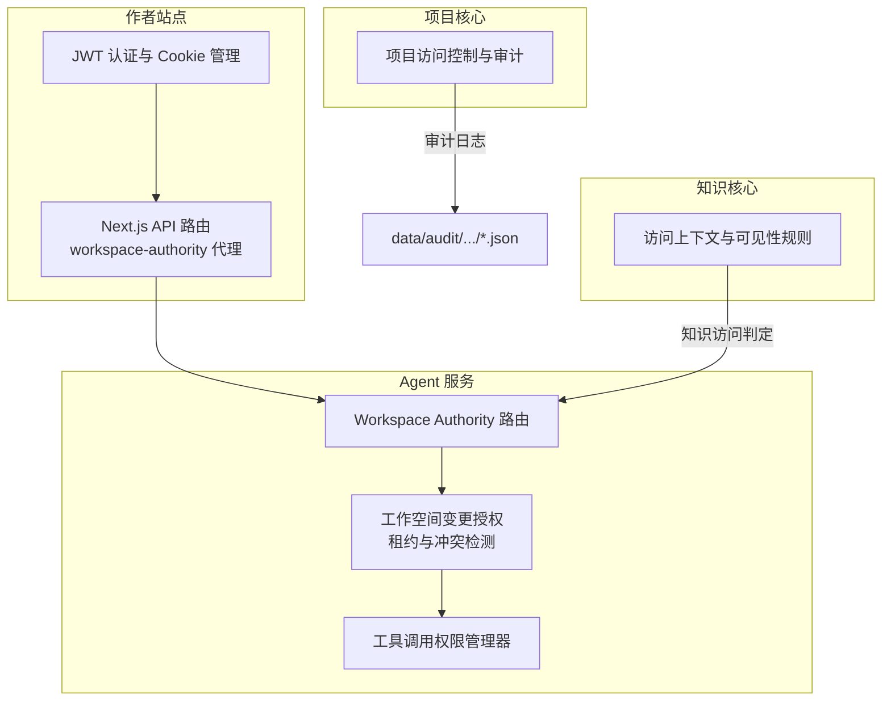
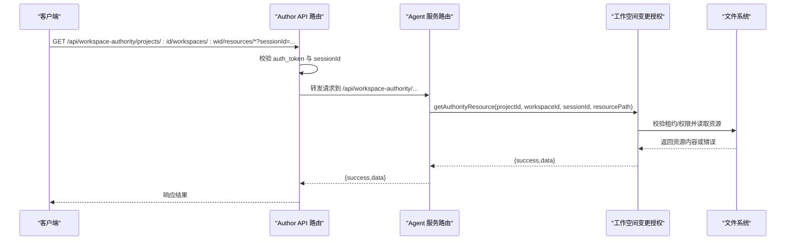
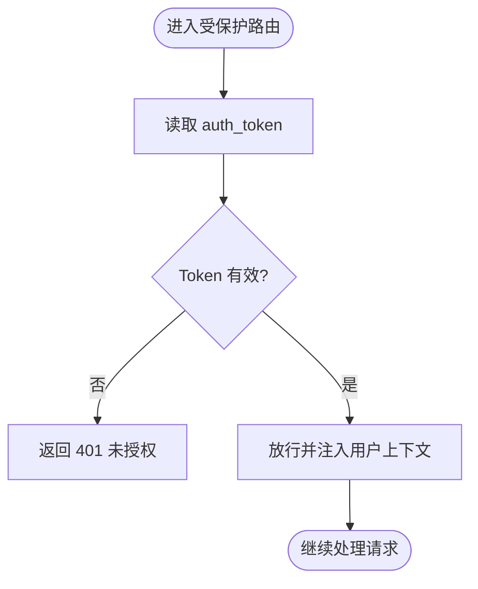
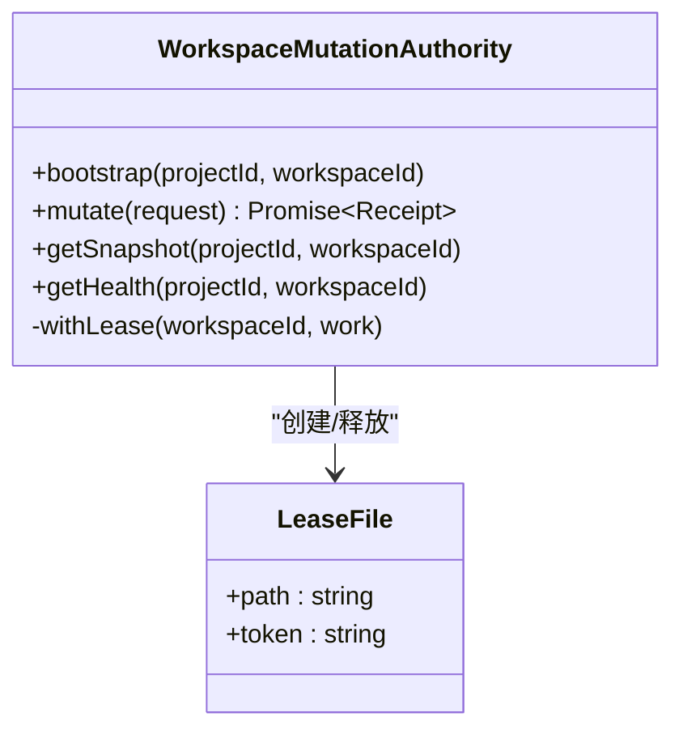
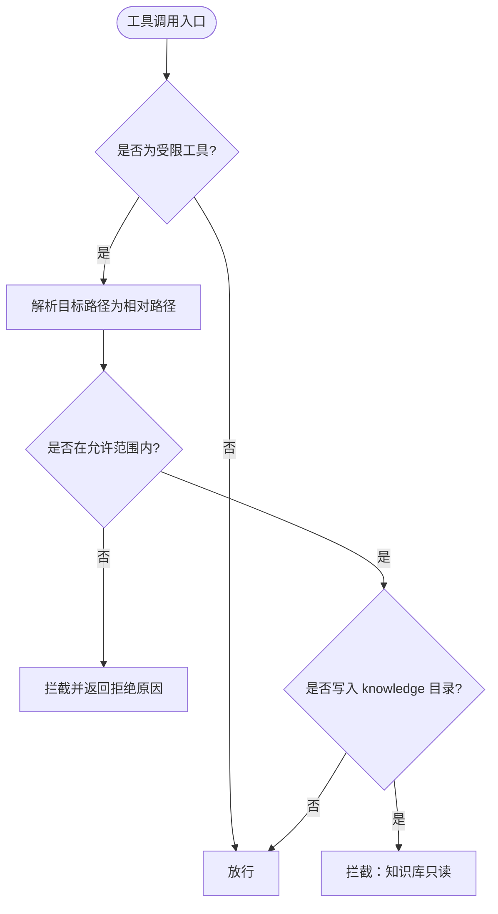
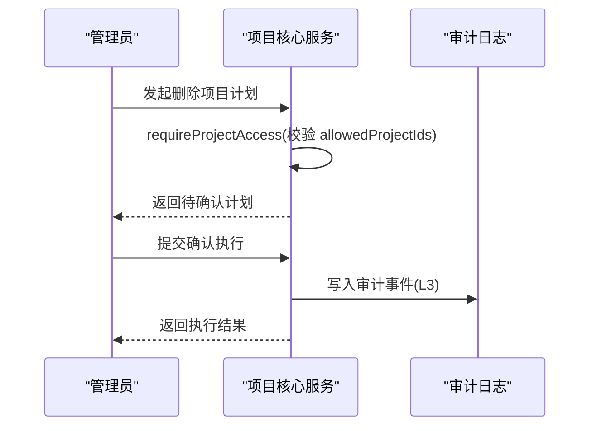
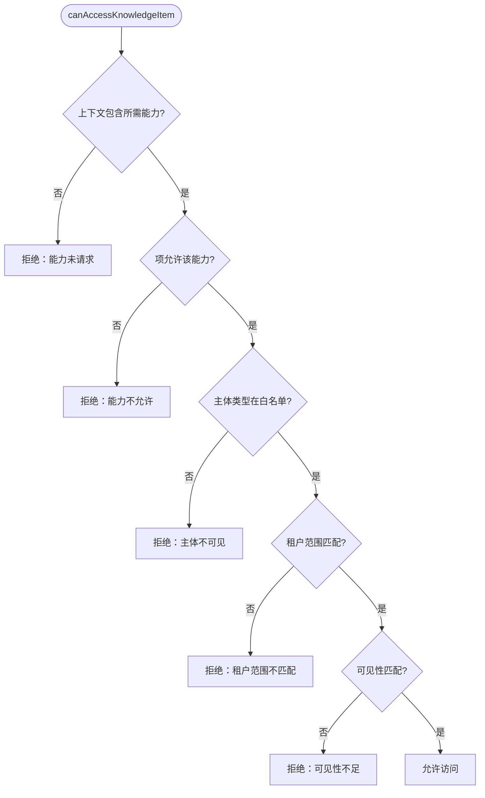
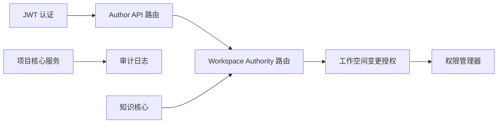

# 多租户架构设计

<cite>
**本文引用的文件**   
- [packages/knowledge-core/src/index.ts](file://packages/knowledge-core/src/index.ts)
- [packages/agent-service/src/backends/managers/permission-manager.ts](file://packages/agent-service/src/backends/managers/permission-manager.ts)
- [packages/project-core/src/service.ts](file://packages/project-core/src/service.ts)
- [packages/author-site/src/lib/auth/jwt.ts](file://packages/author-site/src/lib/auth/jwt.ts)
- [packages/author-site/src/app/api/workspace-authority/[projectId]/[workspaceId]/[...segments]/route.ts](file://packages/author-site/src/app/api/workspace-authority/[projectId]/[workspaceId]/[...segments]/route.ts)
- [packages/agent-service/src/routes/workspace-authority.ts](file://packages/agent-service/src/routes/workspace-authority.ts)
- [packages/agent-service/src/workspace/workspace-mutation-authority.ts](file://packages/agent-service/src/workspace/workspace-mutation-authority.ts)
- [packages/agent-service/tests/unit/permission-manager.test.ts](file://packages/agent-service/tests/unit/permission-manager.test.ts)
- [packages/agent-service/tests/unit/workspace-mutation-authority.test.ts](file://packages/agent-service/tests/unit/workspace-mutation-authority.test.ts)
- [packages/author-site/src/lib/fs-utils.ts](file://packages/author-site/src/lib/fs-utils.ts)
- [docs/项目文档/创作端/08-管理后台/技术/01_架构设计.md](file://docs/项目文档/创作端/08-管理后台/技术/01_架构设计.md)
- [data/audit/project-admin/2026-07-05/audit_1783268478167_fsi1jf.json](file://data/audit/project-admin/2026-07-05/audit_1783268478167_fsi1jf.json)
</cite>

## 目录
1. [引言](#引言)
2. [项目结构](#项目结构)
3. [核心组件](#核心组件)
4. [架构总览](#架构总览)
5. [详细组件分析](#详细组件分析)
6. [依赖关系分析](#依赖关系分析)
7. [性能与配额](#性能与配额)
8. [故障排查指南](#故障排查指南)
9. [结论](#结论)
10. [附录：最佳实践与示例流程](#附录最佳实践与示例流程)

## 引言
本文件面向多租户架构的设计与实现，围绕用户隔离、身份认证、权限控制、数据隔离、资源配额与安全边界展开。结合仓库中的知识库访问控制、工作空间变更授权、项目管理员鉴权与审计日志等模块，给出可落地的实现要点与图示说明，帮助读者快速理解并落地多租户方案。

## 项目结构
从代码组织看，系统按“能力域”划分多个包：
- author-site：前端站点与 Next.js API 路由，负责会话与鉴权、代理工作空间权限接口
- agent-service：Agent 运行时与工作空间变更授权服务，提供权限校验、并发锁、事件总线
- project-core：项目管理核心（项目删除、资产上传、审计日志等）
- knowledge-core：知识领域模型与访问控制规则（可见性、主体类型、租户范围）
- 审计日志：以日期分目录的 JSON 文件持久化记录

图表来源
- [packages/author-site/src/app/api/workspace-authority/[projectId]/[workspaceId]/[...segments]/route.ts](file://packages/author-site/src/app/api/workspace-authority/[projectId]/[workspaceId]/[...segments]/route.ts)
- [packages/author-site/src/lib/auth/jwt.ts](file://packages/author-site/src/lib/auth/jwt.ts)
- [packages/agent-service/src/routes/workspace-authority.ts](file://packages/agent-service/src/routes/workspace-authority.ts)
- [packages/agent-service/src/workspace/workspace-mutation-authority.ts](file://packages/agent-service/src/workspace/workspace-mutation-authority.ts)
- [packages/agent-service/src/backends/managers/permission-manager.ts](file://packages/agent-service/src/backends/managers/permission-manager.ts)
- [packages/project-core/src/service.ts](file://packages/project-core/src/service.ts)
- [packages/knowledge-core/src/index.ts](file://packages/knowledge-core/src/index.ts)

章节来源
- [docs/项目文档/创作端/08-管理后台/技术/01_架构设计.md](file://docs/项目文档/创作端/08-管理后台/技术/01_架构设计.md)

## 核心组件
- 身份认证与会话
  - JWT 签发与验证、Cookie 安全属性配置
  - 在 Next.js API 路由中校验登录态，未登录返回 401
- 工作空间变更授权（Workspace Authority）
  - 通过路由暴露 state/snapshot/resources/mutate 等接口
  - 基于文件系统租约与 prepared 事务保证并发写安全
- 工具调用权限与知识库写保护
  - 路径白名单与相对路径规范化，防止越界访问
  - 禁止 AI 写入知识库目录
- 项目级访问控制与审计
  - 操作者对项目的访问白名单校验
  - 关键操作生成审计日志（按日归档）
- 知识访问控制
  - 基于主体类型、可见性、能力集与租户范围的细粒度判定

章节来源
- [packages/author-site/src/lib/auth/jwt.ts](file://packages/author-site/src/lib/auth/jwt.ts)
- [packages/author-site/src/app/api/workspace-authority/[projectId]/[workspaceId]/[...segments]/route.ts](file://packages/author-site/src/app/api/workspace-authority/[projectId]/[workspaceId]/[...segments]/route.ts)
- [packages/agent-service/src/routes/workspace-authority.ts](file://packages/agent-service/src/routes/workspace-authority.ts)
- [packages/agent-service/src/workspace/workspace-mutation-authority.ts](file://packages/agent-service/src/workspace/workspace-mutation-authority.ts)
- [packages/agent-service/src/backends/managers/permission-manager.ts](file://packages/agent-service/src/backends/managers/permission-manager.ts)
- [packages/project-core/src/service.ts](file://packages/project-core/src/service.ts)
- [packages/knowledge-core/src/index.ts](file://packages/knowledge-core/src/index.ts)

## 架构总览
下图展示一次“读取工作空间资源”的请求链路，体现跨进程鉴权与租户隔离。

图表来源
- [packages/author-site/src/app/api/workspace-authority/[projectId]/[workspaceId]/[...segments]/route.ts](file://packages/author-site/src/app/api/workspace-authority/[projectId]/[workspaceId]/[...segments]/route.ts)
- [packages/agent-service/src/routes/workspace-authority.ts](file://packages/agent-service/src/routes/workspace-authority.ts)
- [packages/agent-service/src/workspace/workspace-mutation-authority.ts](file://packages/agent-service/src/workspace/workspace-mutation-authority.ts)

## 详细组件分析

### 组件A：身份认证与会话（JWT + Cookie）
- 功能要点
  - 使用 HS256 签名创建短期令牌，服务端设置 httpOnly Cookie
  - 生产环境默认启用 secure，可通过环境变量调整
  - API 路由在未携带有效 token 时直接拒绝
- 安全边界
  - 仅服务端可读写 Cookie，避免 XSS 窃取
  - 短过期时间降低泄露风险
- 扩展建议
  - 引入刷新令牌机制
  - 增加 IP/UA 绑定与异常登录告警

图表来源
- [packages/author-site/src/lib/auth/jwt.ts](file://packages/author-site/src/lib/auth/jwt.ts)
- [packages/author-site/src/app/api/workspace-authority/[projectId]/[workspaceId]/[...segments]/route.ts](file://packages/author-site/src/app/api/workspace-authority/[projectId]/[workspaceId]/[...segments]/route.ts)

章节来源
- [packages/author-site/src/lib/auth/jwt.ts](file://packages/author-site/src/lib/auth/jwt.ts)
- [packages/author-site/src/app/api/workspace-authority/[projectId]/[workspaceId]/[...segments]/route.ts](file://packages/author-site/src/app/api/workspace-authority/[projectId]/[workspaceId]/[...segments]/route.ts)

### 组件B：工作空间变更授权（并发写保护与快照）
- 功能要点
  - 通过文件系统租约（lock 文件）实现单实例内互斥写
  - 支持 prepared 事务与冲突计数，健康检查暴露 activeLease/preparedCount
  - 当检测到其他实例持有租约时 fail-closed，避免脏写
- 典型错误码
  - WORKSPACE_WRITE_LEASE_UNAVAILABLE：租约不可用
  - WORKSPACE_RESOURCE_CONFLICT：资源冲突
- 适用场景
  - 多实例部署下的协作编辑一致性保障

图表来源
- [packages/agent-service/src/workspace/workspace-mutation-authority.ts](file://packages/agent-service/src/workspace/workspace-mutation-authority.ts)
- [packages/agent-service/tests/unit/workspace-mutation-authority.test.ts](file://packages/agent-service/tests/unit/workspace-mutation-authority.test.ts)

章节来源
- [packages/agent-service/src/workspace/workspace-mutation-authority.ts](file://packages/agent-service/src/workspace/workspace-mutation-authority.ts)
- [packages/agent-service/tests/unit/workspace-mutation-authority.test.ts](file://packages/agent-service/tests/unit/workspace-mutation-authority.test.ts)

### 组件C：工具调用权限与知识库写保护
- 功能要点
  - 对 readFile/writeFile/editFile/listFiles 进行路径白名单校验
  - 将绝对路径解析为相对 workingDir 后判断是否越界
  - 禁止 AI 写入 knowledge 目录，确保知识库由用户维护
- 测试覆盖
  - 越界路径拦截、允许路径放行、知识库写保护

图表来源
- [packages/agent-service/src/backends/managers/permission-manager.ts](file://packages/agent-service/src/backends/managers/permission-manager.ts)
- [packages/agent-service/tests/unit/permission-manager.test.ts](file://packages/agent-service/tests/unit/permission-manager.test.ts)

章节来源
- [packages/agent-service/src/backends/managers/permission-manager.ts](file://packages/agent-service/src/backends/managers/permission-manager.ts)
- [packages/agent-service/tests/unit/permission-manager.test.ts](file://packages/agent-service/tests/unit/permission-manager.test.ts)

### 组件D：项目访问控制与审计日志
- 功能要点
  - 操作者需具备 allowedProjectIds 才能访问指定项目
  - 关键操作（如删除项目）强制二次确认与审计记录
  - 审计日志按日期分目录存储，包含操作者、级别、资源标识与差异摘要
- 角色约束
  - 某些高危操作要求 admin 角色

图表来源
- [packages/project-core/src/service.ts](file://packages/project-core/src/service.ts)
- [data/audit/project-admin/2026-07-05/audit_1783268478167_fsi1jf.json](file://data/audit/project-admin/2026-07-05/audit_1783268478167_fsi1jf.json)

章节来源
- [packages/project-core/src/service.ts](file://packages/project-core/src/service.ts)
- [data/audit/project-admin/2026-07-05/audit_1783268478167_fsi1jf.json](file://data/audit/project-admin/2026-07-05/audit_1783268478167_fsi1jf.json)

### 组件E：知识访问控制与租户范围
- 功能要点
  - 访问上下文包含主体类型、主体ID、租户范围（project/template/org）、能力集、访问面与用途
  - 判定顺序：能力请求→项能力→主体类型→租户范围→可见性
  - 排序策略：可信等级→来源类型→可见性→更新时间
- 租户隔离
  - current-project 来源必须匹配当前 projectId
  - linked-template 来源必须匹配当前 templateId

图表来源
- [packages/knowledge-core/src/index.ts](file://packages/knowledge-core/src/index.ts)

章节来源
- [packages/knowledge-core/src/index.ts](file://packages/knowledge-core/src/index.ts)

## 依赖关系分析
- 耦合关系
  - author-site 的 API 路由依赖 JWT 认证与运行时配置，并代理至 agent-service
  - agent-service 的路由层依赖工作空间变更授权与权限管理器
  - project-core 独立于 UI，提供项目管理与审计能力
  - knowledge-core 作为纯逻辑库被上层服务复用
- 外部依赖
  - 文件系统用于租约、审计日志与快照
  - SQLite 用于用户与配置（author-site 侧）

图表来源
- [packages/author-site/src/lib/auth/jwt.ts](file://packages/author-site/src/lib/auth/jwt.ts)
- [packages/author-site/src/app/api/workspace-authority/[projectId]/[workspaceId]/[...segments]/route.ts](file://packages/author-site/src/app/api/workspace-authority/[projectId]/[workspaceId]/[...segments]/route.ts)
- [packages/agent-service/src/routes/workspace-authority.ts](file://packages/agent-service/src/routes/workspace-authority.ts)
- [packages/agent-service/src/workspace/workspace-mutation-authority.ts](file://packages/agent-service/src/workspace/workspace-mutation-authority.ts)
- [packages/agent-service/src/backends/managers/permission-manager.ts](file://packages/agent-service/src/backends/managers/permission-manager.ts)
- [packages/project-core/src/service.ts](file://packages/project-core/src/service.ts)
- [packages/knowledge-core/src/index.ts](file://packages/knowledge-core/src/index.ts)

章节来源
- [packages/author-site/src/lib/auth/jwt.ts](file://packages/author-site/src/lib/auth/jwt.ts)
- [packages/author-site/src/app/api/workspace-authority/[projectId]/[workspaceId]/[...segments]/route.ts](file://packages/author-site/src/app/api/workspace-authority/[projectId]/[workspaceId]/[...segments]/route.ts)
- [packages/agent-service/src/routes/workspace-authority.ts](file://packages/agent-service/src/routes/workspace-authority.ts)
- [packages/agent-service/src/workspace/workspace-mutation-authority.ts](file://packages/agent-service/src/workspace/workspace-mutation-authority.ts)
- [packages/agent-service/src/backends/managers/permission-manager.ts](file://packages/agent-service/src/backends/managers/permission-manager.ts)
- [packages/project-core/src/service.ts](file://packages/project-core/src/service.ts)
- [packages/knowledge-core/src/index.ts](file://packages/knowledge-core/src/index.ts)

## 性能与配额
- 并发与一致性
  - 工作空间写操作通过租约与 prepared 事务保证一致性；健康检查暴露 activeLease/preparedCount/conflictCount 便于观测
- 监控指标
  - 队列等待、提交延迟、远程更新延迟、投影 ACK 延迟、重连收敛时间、规范物化滞后等
- 配额建议（通用指导）
  - 存储空间限制：按租户维度统计工作区大小，超限阻断新增写入
  - 并发操作限制：基于租约与健康检查限流，避免热点工作区拥塞
  - 资源使用监控：采集上述指标并接入告警，结合审计日志做溯源

章节来源
- [packages/agent-service/src/workspace/workspace-mutation-authority.ts](file://packages/agent-service/src/workspace/workspace-mutation-authority.ts)
- [packages/agent-service/tests/unit/workspace-mutation-authority.test.ts](file://packages/agent-service/tests/unit/workspace-mutation-authority.test.ts)
- [packages/author-site/src/lib/workspace-performance-sampling.ts](file://packages/author-site/src/lib/workspace-performance-sampling.ts)

## 故障排查指南
- 常见问题定位
  - 401 未授权：检查 auth_token 是否存在且未过期，确认路由是否要求登录
  - 工作空间不可用：查看 health 接口返回的 ready/activeLease/preparedCount
  - 写冲突：关注 conflictCount 与 WORKSPACE_RESOURCE_CONFLICT 错误码
  - 越界访问：检查路径是否超出工作空间根目录
- 审计与回溯
  - 审计日志按日归档，包含操作者、级别、资源 ID 与差异摘要，可用于合规与回溯

章节来源
- [packages/author-site/src/app/api/workspace-authority/[projectId]/[workspaceId]/[...segments]/route.ts](file://packages/author-site/src/app/api/workspace-authority/[projectId]/[workspaceId]/[...segments]/route.ts)
- [packages/agent-service/src/workspace/workspace-mutation-authority.ts](file://packages/agent-service/src/workspace/workspace-mutation-authority.ts)
- [packages/agent-service/tests/unit/workspace-mutation-authority.test.ts](file://packages/agent-service/tests/unit/workspace-mutation-authority.test.ts)
- [packages/project-core/src/service.ts](file://packages/project-core/src/service.ts)
- [data/audit/project-admin/2026-07-05/audit_1783268478167_fsi1jf.json](file://data/audit/project-admin/2026-07-05/audit_1783268478167_fsi1jf.json)

## 结论
本方案通过“认证—鉴权—隔离—审计”的分层设计，在多租户环境下实现了：
- 用户身份与会话的安全管理
- 工作空间并发写的一致性与可观测性
- 工具调用的路径与目录级保护
- 项目级访问控制与审计闭环
- 知识访问的多维控制（能力、主体、租户、可见性）

建议在后续演进中补充统一的配额与计费、跨租户共享资源的显式授权、以及更完善的密钥与凭据管理。

## 附录：最佳实践与示例流程

### 新用户注册与初始权限
- 步骤建议
  - 注册：创建用户记录并生成短期令牌，设置安全 Cookie
  - 初始化：为用户分配默认角色与最小权限集合
  - 首次登录：校验 Cookie 并建立会话
- 参考实现位置
  - 认证与 Cookie：[packages/author-site/src/lib/auth/jwt.ts](file://packages/author-site/src/lib/auth/jwt.ts)
  - 管理后台安全机制与用户列表 API：[docs/项目文档/创作端/08-管理后台/技术/01_架构设计.md](file://docs/项目文档/创作端/08-管理后台/技术/01_架构设计.md)

### 权限变更处理（角色/可见性）
- 步骤建议
  - 变更主体类型或可见性后，立即失效旧缓存（如有）
  - 重新计算租户范围与能力集，确保下次访问生效
- 参考实现位置
  - 知识访问控制与可见性映射：[packages/knowledge-core/src/index.ts](file://packages/knowledge-core/src/index.ts)

### 违规操作检测与审计
- 步骤建议
  - 对高风险操作强制二次确认与 L3 审计
  - 定期扫描审计日志，识别异常模式（高频失败、越界访问、非工作时间操作）
- 参考实现位置
  - 项目删除与审计：[packages/project-core/src/service.ts](file://packages/project-core/src/service.ts)
  - 审计样例：[data/audit/project-admin/2026-07-05/audit_1783268478167_fsi1jf.json](file://data/audit/project-admin/2026-07-05/audit_1783268478167_fsi1jf.json)