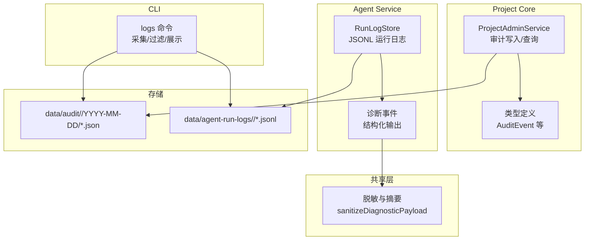
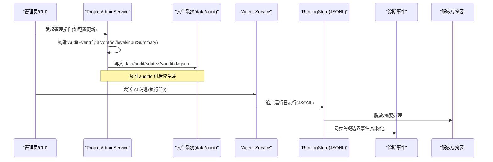
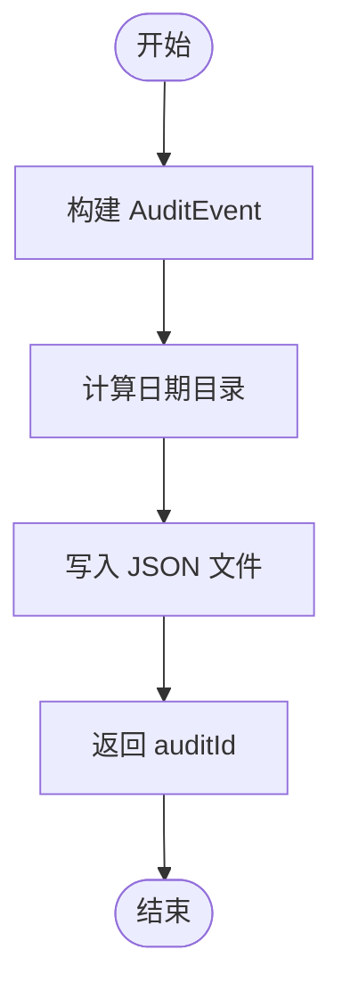
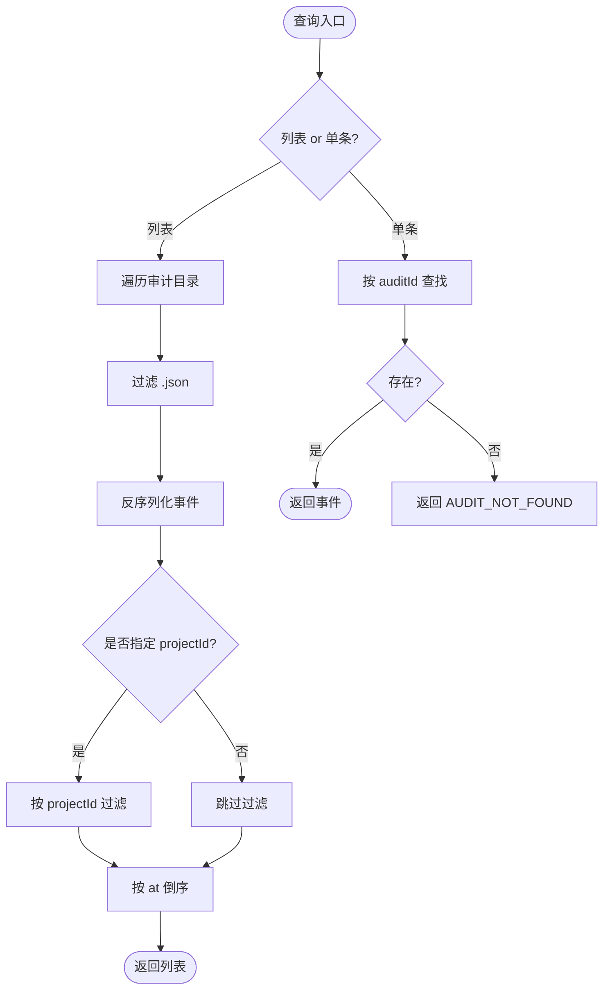
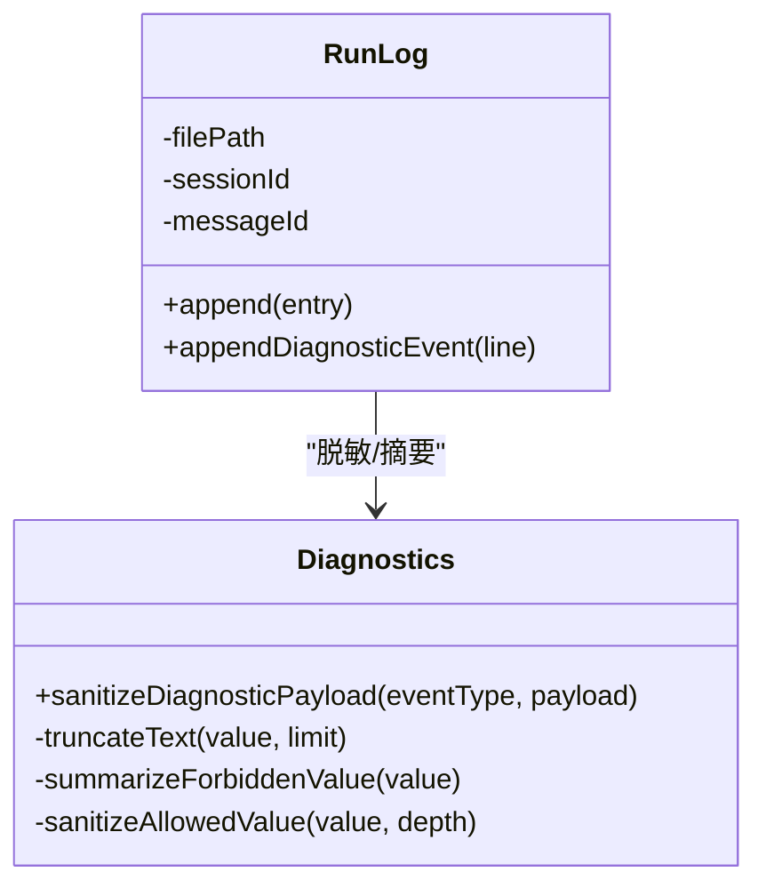
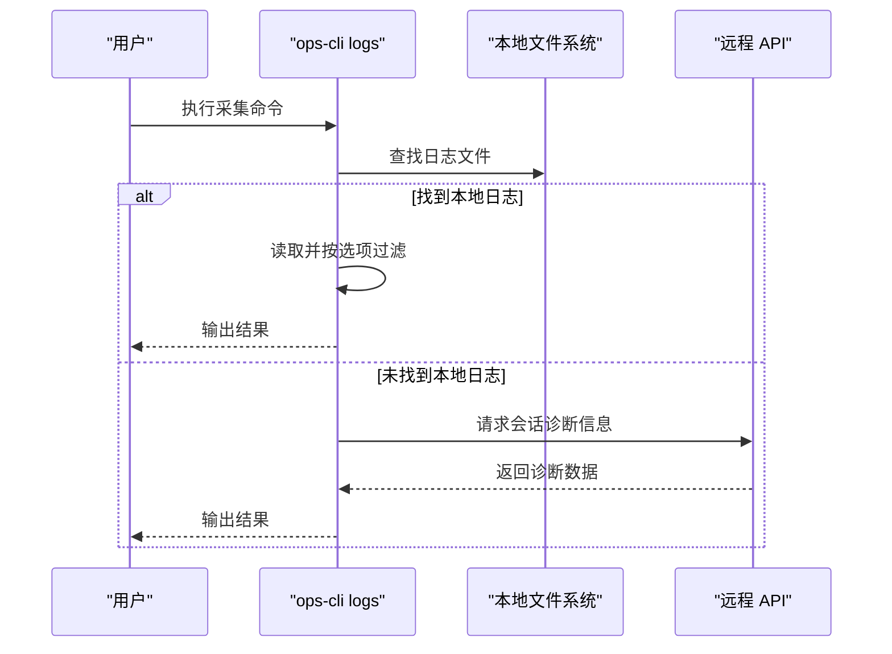
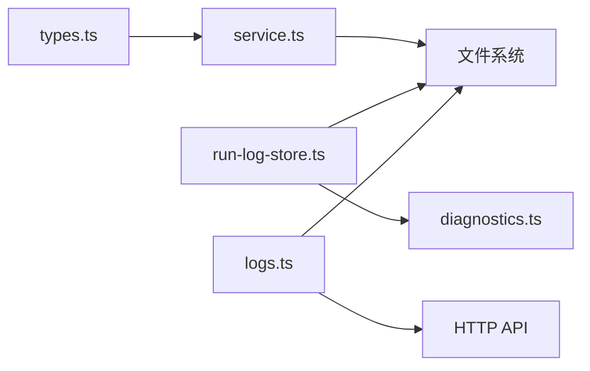

# 审计日志系统

<cite>
**本文引用的文件**   
- [packages/project-core/src/service.ts](file://packages/project-core/src/service.ts)
- [packages/project-core/src/types.ts](file://packages/project-core/src/types.ts)
- [data/audit/project-admin/2026-07-01/audit_1782898032726_avlcpe.json](file://data/audit/project-admin/2026-07-01/audit_1782898032726_avlcpe.json)
- [packages/agent-service/src/session/run-log-store.ts](file://packages/agent-service/src/session/run-log-store.ts)
- [packages/shared/src/diagnostics.ts](file://packages/shared/src/diagnostics.ts)
- [OPS/CLI/src/commands/logs.ts](file://OPS/CLI/src/commands/logs.ts)
- [docs/项目文档/创作端/05-AI对话/技术/07_运行进度与事件日志.md](file://docs/项目文档/创作端/05-AI对话/技术/07_运行进度与事件日志.md)
</cite>

## 目录
1. [简介](#简介)
2. [项目结构](#项目结构)
3. [核心组件](#核心组件)
4. [架构总览](#架构总览)
5. [详细组件分析](#详细组件分析)
6. [依赖关系分析](#依赖关系分析)
7. [性能考量](#性能考量)
8. [故障排查指南](#故障排查指南)
9. [结论](#结论)
10. [附录](#附录)

## 简介
本技术文档围绕仓库中的“审计日志系统”展开，覆盖以下目标：
- 操作记录机制：用户行为追踪、API 调用记录、系统事件捕获
- 变更追踪：数据修改历史、配置变更日志、权限变更记录
- 合规性要求：数据保留策略、隐私保护、法律合规检查
- 日志分析工具：查询接口、统计报表、异常检测
- 管理最佳实践：存储优化、归档策略、故障排查
- API 使用示例与监控告警配置指南

该系统以本地文件系统为持久化载体，按日期分目录存放审计事件 JSON 文件；同时结合 agent-service 的运行日志与诊断事件，形成从业务操作到运行时行为的完整可观测链路。

## 项目结构
审计日志相关的关键位置与职责如下：
- 审计事件写入与查询：位于 project-core 服务中，负责生成审计事件、按日归档、提供列表与单条查询能力
- 审计事件模型：定义在 types 中，包含审计 ID、时间戳、操作者、级别、工具名、资源标识、输入摘要、结果、差异摘要、校验结果等
- 审计事件样例：data/audit 目录下按日期组织的事件文件
- Agent 运行日志：agent-service 将每轮会话的 JSONL 日志落盘，并同步关键边界事件到结构化诊断流
- 脱敏与诊断：shared 层提供统一的脱敏与摘要逻辑，避免敏感信息泄露
- CLI 采集：OPS CLI 支持本地日志采集与远程诊断聚合

图表来源
- [packages/project-core/src/service.ts:4562-4578](file://packages/project-core/src/service.ts#L4562-L4578)
- [packages/project-core/src/service.ts:6497-6514](file://packages/project-core/src/service.ts#L6497-L6514)
- [packages/project-core/src/types.ts:560-574](file://packages/project-core/src/types.ts#L560-L574)
- [packages/agent-service/src/session/run-log-store.ts:355-384](file://packages/agent-service/src/session/run-log-store.ts#L355-L384)
- [packages/shared/src/diagnostics.ts:400-459](file://packages/shared/src/diagnostics.ts#L400-L459)
- [OPS/CLI/src/commands/logs.ts:1-44](file://OPS/CLI/src/commands/logs.ts#L1-L44)

章节来源
- [packages/project-core/src/service.ts:4562-4578](file://packages/project-core/src/service.ts#L4562-L4578)
- [packages/project-core/src/service.ts:6497-6514](file://packages/project-core/src/service.ts#L6497-L6514)
- [packages/project-core/src/types.ts:560-574](file://packages/project-core/src/types.ts#L560-L574)
- [packages/agent-service/src/session/run-log-store.ts:355-384](file://packages/agent-service/src/session/run-log-store.ts#L355-L384)
- [packages/shared/src/diagnostics.ts:400-459](file://packages/shared/src/diagnostics.ts#L400-L459)
- [OPS/CLI/src/commands/logs.ts:1-44](file://OPS/CLI/src/commands/logs.ts#L1-L44)

## 核心组件
- 审计事件模型（AuditEvent）
  - 关键字段：审计 ID、时间戳、操作者、级别、工具名、项目/资源标识、输入摘要、成功标志、差异摘要、校验结果、错误信息
  - 用途：统一描述一次操作的上下文与结果，便于检索与审计
- 审计写入与查询
  - 写入：在服务内部构造 AuditEvent，按日期分目录写入 JSON 文件，返回审计 ID
  - 查询：扫描审计目录，过滤 .json 文件，按时间倒序返回；支持按 projectId 过滤与按 auditId 精确获取
- Agent 运行日志
  - 每条日志一行 JSON，包含时间、会话/消息标识、事件类型、脱敏后的 payload 等
  - 写入失败不中断主流程，仅记录警告；同时将关键边界事件同步到结构化诊断流
- 脱敏与摘要
  - 对敏感键进行替换或截断，限制深度与长度，避免大文本进入日志
- CLI 采集
  - 优先读取本地日志文件，若不存在则通过 API 拉取会话诊断信息，支持按级别、模式、行数、会话过滤

章节来源
- [packages/project-core/src/types.ts:560-574](file://packages/project-core/src/types.ts#L560-L574)
- [packages/project-core/src/service.ts:4562-4578](file://packages/project-core/src/service.ts#L4562-L4578)
- [packages/project-core/src/service.ts:6497-6514](file://packages/project-core/src/service.ts#L6497-L6514)
- [packages/agent-service/src/session/run-log-store.ts:355-384](file://packages/agent-service/src/session/run-log-store.ts#L355-L384)
- [packages/shared/src/diagnostics.ts:400-459](file://packages/shared/src/diagnostics.ts#L400-L459)
- [OPS/CLI/src/commands/logs.ts:1-44](file://OPS/CLI/src/commands/logs.ts#L1-L44)

## 架构总览
下图展示了从业务操作到审计落盘、再到运行日志与诊断事件的端到端链路。

图表来源
- [packages/project-core/src/service.ts:6497-6514](file://packages/project-core/src/service.ts#L6497-L6514)
- [packages/agent-service/src/session/run-log-store.ts:355-384](file://packages/agent-service/src/session/run-log-store.ts#L355-L384)
- [packages/shared/src/diagnostics.ts:400-459](file://packages/shared/src/diagnostics.ts#L400-L459)

## 详细组件分析

### 审计事件模型与写入流程
- 模型字段说明
  - auditId/at：唯一标识与时间戳
  - actor：操作者身份与角色
  - level：审计级别（用于分级管控）
  - tool：触发操作的工具/入口
  - projectId/resourceId：资源定位
  - inputSummary：输入摘要（不含敏感原文）
  - ok/diffSummary/validation/error：结果与影响面
- 写入路径
  - 生成 auditId 与时间戳
  - 计算日期目录 YYYY-MM-DD
  - 写入 data/audit/<project>/YYYY-MM-DD/<auditId>.json
  - 返回 auditId 以便后续查询与关联

图表来源
- [packages/project-core/src/service.ts:6497-6514](file://packages/project-core/src/service.ts#L6497-L6514)

章节来源
- [packages/project-core/src/types.ts:560-574](file://packages/project-core/src/types.ts#L560-L574)
- [packages/project-core/src/service.ts:6497-6514](file://packages/project-core/src/service.ts#L6497-L6514)

### 审计查询接口
- 列表查询
  - 遍历审计目录，筛选 .json 文件，反序列化为事件对象
  - 可选按 projectId 过滤
  - 按 at 倒序排序
- 单条查询
  - 基于 auditId 查找对应事件，未找到返回错误码

图表来源
- [packages/project-core/src/service.ts:4562-4578](file://packages/project-core/src/service.ts#L4562-L4578)

章节来源
- [packages/project-core/src/service.ts:4562-4578](file://packages/project-core/src/service.ts#L4562-L4578)

### Agent 运行日志与诊断事件
- 运行日志
  - 路径：data/agent-run-logs/<sessionId>/<messageId>.jsonl
  - 内容：时间、会话/消息标识、事件类型、标题、摘要、工具调用 ID、脱敏 payload
  - 健壮性：写入失败仅记录警告，不中断对话
- 诊断事件
  - 同步关键边界事件（运行 ID、工具名、状态、耗时、文件路径摘要、数量、错误摘要）
  - 脱敏规则：敏感键替换、长文本截断、层级限制

图表来源
- [packages/agent-service/src/session/run-log-store.ts:355-384](file://packages/agent-service/src/session/run-log-store.ts#L355-L384)
- [packages/shared/src/diagnostics.ts:400-459](file://packages/shared/src/diagnostics.ts#L400-L459)

章节来源
- [packages/agent-service/src/session/run-log-store.ts:355-384](file://packages/agent-service/src/session/run-log-store.ts#L355-L384)
- [packages/shared/src/diagnostics.ts:400-459](file://packages/shared/src/diagnostics.ts#L400-L459)
- [docs/项目文档/创作端/05-AI对话/技术/07_运行进度与事件日志.md:61-81](file://docs/项目文档/创作端/05-AI对话/技术/07_运行进度与事件日志.md#L61-L81)

### CLI 日志采集与过滤
- 本地优先：尝试在多个候选路径下寻找日志文件
- 远程兜底：若本地无日志，通过 API 拉取会话诊断信息
- 过滤能力：按级别、正则模式、行数、会话 ID 过滤

图表来源
- [OPS/CLI/src/commands/logs.ts:1-44](file://OPS/CLI/src/commands/logs.ts#L1-L44)

章节来源
- [OPS/CLI/src/commands/logs.ts:1-44](file://OPS/CLI/src/commands/logs.ts#L1-L44)

## 依赖关系分析
- 模块耦合
  - ProjectAdminService 依赖类型定义与文件系统
  - RunLogStore 依赖 shared 脱敏逻辑与文件系统
  - CLI 依赖文件系统与网络 API
- 外部依赖
  - 文件系统 I/O
  - HTTP 调用（CLI 远程诊断）
- 潜在风险
  - 大量小文件导致的目录扫描开销
  - 写入失败降级策略需确保可观测性

图表来源
- [packages/project-core/src/types.ts:560-574](file://packages/project-core/src/types.ts#L560-L574)
- [packages/project-core/src/service.ts:4562-4578](file://packages/project-core/src/service.ts#L4562-L4578)
- [packages/agent-service/src/session/run-log-store.ts:355-384](file://packages/agent-service/src/session/run-log-store.ts#L355-L384)
- [packages/shared/src/diagnostics.ts:400-459](file://packages/shared/src/diagnostics.ts#L400-L459)
- [OPS/CLI/src/commands/logs.ts:1-44](file://OPS/CLI/src/commands/logs.ts#L1-L44)

章节来源
- [packages/project-core/src/types.ts:560-574](file://packages/project-core/src/types.ts#L560-L574)
- [packages/project-core/src/service.ts:4562-4578](file://packages/project-core/src/service.ts#L4562-L4578)
- [packages/agent-service/src/session/run-log-store.ts:355-384](file://packages/agent-service/src/session/run-log-store.ts#L355-L384)
- [packages/shared/src/diagnostics.ts:400-459](file://packages/shared/src/diagnostics.ts#L400-L459)
- [OPS/CLI/src/commands/logs.ts:1-44](file://OPS/CLI/src/commands/logs.ts#L1-L44)

## 性能考量
- 审计目录扫描
  - 当前实现按日期分目录，但仍需遍历所有 .json 文件；建议引入索引或增量扫描以提升查询性能
- 写入路径
  - 审计事件与运行日志均为追加写，注意磁盘 I/O 压力与 fsync 策略
- 脱敏与摘要
  - 对大对象进行深度与长度限制，降低序列化与存储成本
- CLI 采集
  - 本地优先减少网络开销；远程诊断按需拉取，避免全量传输

[本节为通用指导，无需特定文件引用]

## 故障排查指南
- 审计记录缺失
  - 检查 data/audit 目录是否存在且可写
  - 确认写入时是否抛出异常并被上层吞掉
- 审计查询缓慢
  - 评估目录规模与文件数量，考虑引入索引或分页
- Agent 运行日志丢失
  - 检查运行日志路径权限与磁盘空间
  - 关注写入失败的 warning 日志
- 敏感信息泄露风险
  - 确认脱敏规则生效，避免将密钥、token、密码等明文写入日志
- CLI 无法采集
  - 确认本地日志路径是否正确
  - 若走远程诊断，检查 API 可达性与鉴权

章节来源
- [packages/agent-service/src/session/run-log-store.ts:355-384](file://packages/agent-service/src/session/run-log-store.ts#L355-L384)
- [packages/shared/src/diagnostics.ts:400-459](file://packages/shared/src/diagnostics.ts#L400-L459)
- [OPS/CLI/src/commands/logs.ts:1-44](file://OPS/CLI/src/commands/logs.ts#L1-L44)

## 结论
该审计日志系统以轻量、可追溯为核心设计目标，通过统一的审计事件模型与按日归档的文件布局，实现了操作记录的标准化与可检索性；结合 Agent 运行日志与诊断事件，以及严格的脱敏策略，形成了从业务操作到运行时行为的闭环可观测体系。建议在后续演进中引入索引与归档策略，进一步提升查询效率与合规性保障。

[本节为总结性内容，无需特定文件引用]

## 附录

### API 使用示例（基于现有方法）
- 列出审计事件
  - 方法：auditList(projectId?)
  - 说明：返回按时间倒序的审计事件数组，可按 projectId 过滤
  - 参考路径：[packages/project-core/src/service.ts:4562-4571](file://packages/project-core/src/service.ts#L4562-L4571)
- 获取单条审计事件
  - 方法：auditGet(auditId)
  - 说明：根据 auditId 获取事件详情，不存在返回错误
  - 参考路径：[packages/project-core/src/service.ts:4573-4578](file://packages/project-core/src/service.ts#L4573-L4578)
- 发送 AI 消息（附带审计）
  - 方法：sendAiMessage(input, actor)
  - 说明：调用后会在成功分支记录审计事件，返回 auditId 与 nextActions
  - 参考路径：[packages/project-core/src/service.ts:4639-4712](file://packages/project-core/src/service.ts#L4639-L4712)

章节来源
- [packages/project-core/src/service.ts:4562-4578](file://packages/project-core/src/service.ts#L4562-L4578)
- [packages/project-core/src/service.ts:4639-4712](file://packages/project-core/src/service.ts#L4639-L4712)

### 监控与告警配置指南
- 指标建议
  - 审计写入成功率与延迟
  - 运行日志写入失败次数
  - 诊断事件同步成功率
- 阈值建议
  - 审计写入失败率 > 1% 触发告警
  - 运行日志连续写入失败 > N 次触发告警
  - 诊断事件同步失败率 > 5% 触发告警
- 采集方式
  - 使用 CLI 定期采集并汇总至集中式日志平台
  - 对关键错误关键词（如 “AGENT_SERVICE_UNAVAILABLE”、“AUDIT_NOT_FOUND”）设置告警规则

[本节为通用指导，无需特定文件引用]

### 合规性与保留策略
- 数据保留
  - 按日期归档，便于按周期清理与归档
- 隐私保护
  - 脱敏规则覆盖敏感键与长文本，避免明文泄露
- 法律合规检查
  - 审计事件包含操作者、时间、工具、资源与结果，满足可追溯与问责需求

章节来源
- [packages/shared/src/diagnostics.ts:400-459](file://packages/shared/src/diagnostics.ts#L400-L459)
- [data/audit/project-admin/2026-07-01/audit_1782898032726_avlcpe.json:1-24](file://data/audit/project-admin/2026-07-01/audit_1782898032726_avlcpe.json#L1-L24)