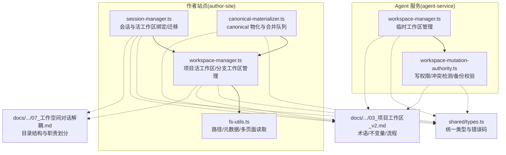
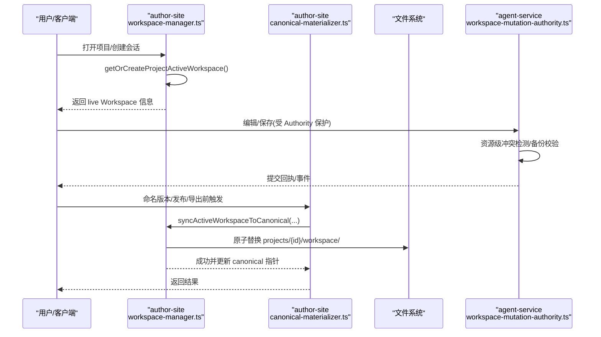
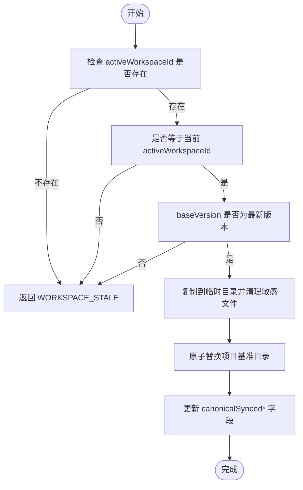
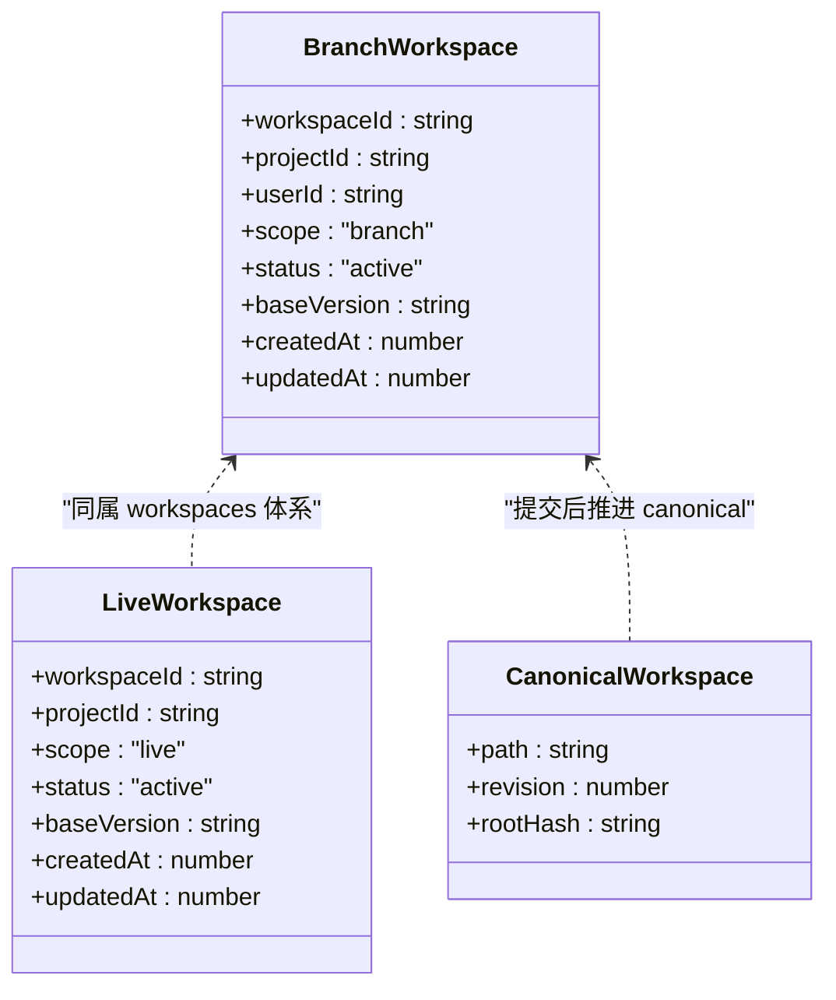
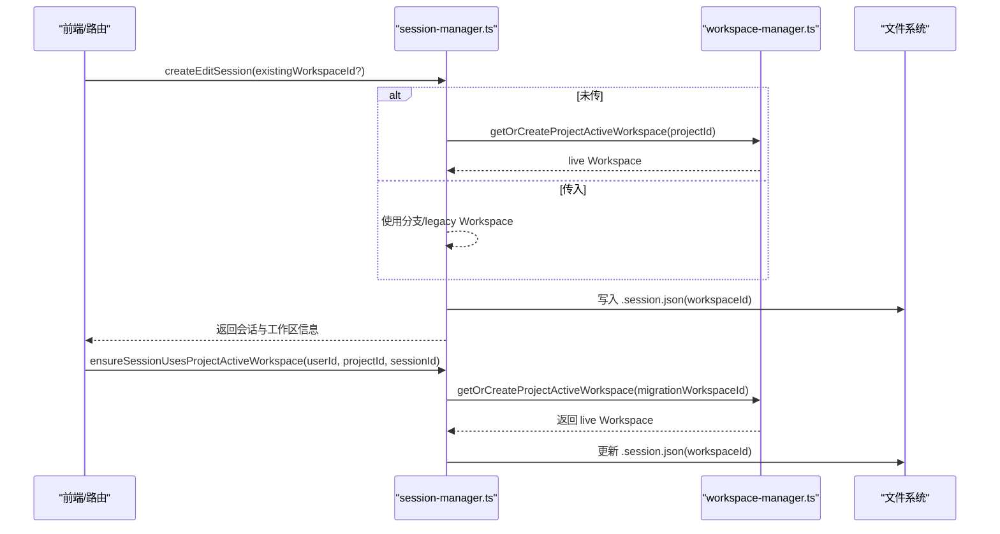
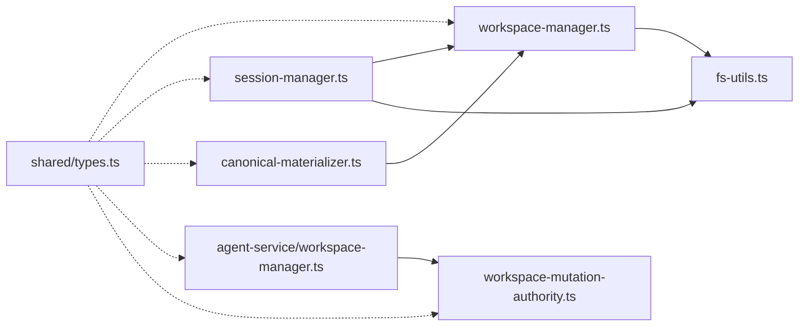

# 工作区类型与概念

<cite>
**本文引用的文件**   
- [packages/author-site/src/lib/workspace-manager.ts](file://packages/author-site/src/lib/workspace-manager.ts)
- [packages/author-site/src/lib/session-manager.ts](file://packages/author-site/src/lib/session-manager.ts)
- [packages/author-site/src/lib/canonical-materializer.ts](file://packages/author-site/src/lib/canonical-materializer.ts)
- [packages/author-site/src/lib/fs-utils.ts](file://packages/author-site/src/lib/fs-utils.ts)
- [packages/agent-service/src/workspace/workspace-manager.ts](file://packages/agent-service/src/workspace/workspace-manager.ts)
- [packages/agent-service/src/workspace/workspace-mutation-authority.ts](file://packages/agent-service/src/workspace/workspace-mutation-authority.ts)
- [packages/shared/src/types.ts](file://packages/shared/src/types.ts)
- [docs/项目文档/创作端/03-项目管理/技术/03_项目工作区_v2.md](file://docs/项目文档/创作端/03-项目管理/技术/03_项目工作区_v2.md)
- [docs/项目文档/创作端/03-项目管理/技术/07_工作空间对话解耦.md](file://docs/项目文档/创作端/03-项目管理/技术/07_工作空间对话解耦.md)
</cite>

## 目录
1. [引言](#引言)
2. [项目结构](#项目结构)
3. [核心组件](#核心组件)
4. [架构总览](#架构总览)
5. [详细组件分析](#详细组件分析)
6. [依赖关系分析](#依赖关系分析)
7. [性能考量](#性能考量)
8. [故障排查指南](#故障排查指南)
9. [结论](#结论)
10. [附录](#附录)

## 引言
本文件面向工作区类型系统，系统性阐述三类工作区的核心概念、设计理念与适用场景：基准工作区（Canonical Workspace）、分支工作区（Branch Workspace）和 Session 工作区（Session Workspace）。文档覆盖其生命周期（创建时机、使用范围、数据隔离机制、销毁策略），以及不同类型之间的继承关系与数据共享模式（文件变更传播、配置合并策略、冲突检测机制）。同时提供具体使用示例与管理员操作指南，包括工作区创建、切换、合并与清理的最佳实践。

## 项目结构
围绕工作区类型系统的实现主要分布在以下模块：
- author-site 侧负责项目级 live 工作区管理、canonical 物化、会话绑定与迁移；
- agent-service 侧负责临时工作区管理与写入权限控制（Authority）；
- shared 提供统一类型定义；
- docs 提供设计说明与术语约定。

图表来源
- [packages/author-site/src/lib/workspace-manager.ts:1-755](file://packages/author-site/src/lib/workspace-manager.ts#L1-L755)
- [packages/author-site/src/lib/session-manager.ts:1-200](file://packages/author-site/src/lib/session-manager.ts#L1-L200)
- [packages/author-site/src/lib/canonical-materializer.ts:1-178](file://packages/author-site/src/lib/canonical-materializer.ts#L1-L178)
- [packages/author-site/src/lib/fs-utils.ts:1713-1762](file://packages/author-site/src/lib/fs-utils.ts#L1713-L1762)
- [packages/agent-service/src/workspace/workspace-manager.ts:1-144](file://packages/agent-service/src/workspace/workspace-manager.ts#L1-L144)
- [packages/agent-service/src/workspace/workspace-mutation-authority.ts:988-1003](file://packages/agent-service/src/workspace/workspace-mutation-authority.ts#L988-L1003)
- [packages/shared/src/types.ts:1-86](file://packages/shared/src/types.ts#L1-L86)
- [docs/项目文档/创作端/03-项目管理/技术/03_项目工作区_v2.md:1-169](file://docs/项目文档/创作端/03-项目管理/技术/03_项目工作区_v2.md#L1-L169)
- [docs/项目文档/创作端/03-项目管理/技术/07_工作空间对话解耦.md:44-106](file://docs/项目文档/创作端/03-项目管理/技术/07_工作空间对话解耦.md#L44-L106)

章节来源
- [docs/项目文档/创作端/03-项目管理/技术/03_项目工作区_v2.md:1-169](file://docs/项目文档/创作端/03-项目管理/技术/03_项目工作区_v2.md#L1-L169)
- [docs/项目文档/创作端/03-项目管理/技术/07_工作空间对话解耦.md:44-106](file://docs/项目文档/创作端/03-项目管理/技术/07_工作空间对话解耦.md#L44-L106)

## 核心组件
- 项目工作区（live Workspace，scope=live）：多人协作的当前可编辑态，由 getOrCreateProjectActiveWorkspace 创建或复用，作为实时协同、预览与自动保存的共同目标。
- 项目基准工作区（canonical Workspace，projects/{id}/workspace/）：供发布、导出、历史快照、模板保存、CLI 等读流程消费，由 canonical materializer 从 live Workspace 同步推进。
- 分支工作区（branch Workspace，scope=branch）：显式隔离事务，适合 CLI、批量维护、AI 沙盒与实验性改动，不进入默认多人协作房间。
- Session 工作区：不再持有文件副本，仅记录用户、项目、AI 对话及绑定的 workspaceId；普通编辑页默认绑定 live Workspace，显式事务或旧链路可能绑定 branch/legacy Workspace。

章节来源
- [docs/项目文档/创作端/03-项目管理/技术/03_项目工作区_v2.md:18-34](file://docs/项目文档/创作端/03-项目管理/技术/03_项目工作区_v2.md#L18-L34)
- [docs/项目文档/创作端/03-项目管理/技术/03_项目工作区_v2.md:52-106](file://docs/项目文档/创作端/03-项目管理/技术/03_项目工作区_v2.md#L52-L106)
- [docs/项目文档/创作端/03-项目管理/技术/07_工作空间对话解耦.md:79-106](file://docs/项目文档/创作端/03-项目管理/技术/07_工作空间对话解耦.md#L79-L106)

## 架构总览
下图展示三类工作区在系统中的角色与交互：Session 通过 workspaceId 指向 live 或 branch 工作区；关键动作通过 canonical materializer 将 live 工作区原子同步到项目基准工作区；Agent 服务对 live 工作区进行受控写入与冲突检测。

图表来源
- [packages/author-site/src/lib/workspace-manager.ts:240-334](file://packages/author-site/src/lib/workspace-manager.ts#L240-L334)
- [packages/author-site/src/lib/workspace-manager.ts:336-492](file://packages/author-site/src/lib/workspace-manager.ts#L336-L492)
- [packages/author-site/src/lib/canonical-materializer.ts:135-170](file://packages/author-site/src/lib/canonical-materializer.ts#L135-L170)
- [packages/agent-service/src/workspace/workspace-mutation-authority.ts:988-1003](file://packages/agent-service/src/workspace/workspace-mutation-authority.ts#L988-L1003)

## 详细组件分析

### 基准工作区（Canonical Workspace）
- 设计理念
  - 作为“权威缓存”，供发布、导出、历史快照、模板保存、CLI 等只读流程消费。
  - 由 live Workspace 同步推进，确保关键动作消费的是已提交的最新内容。
- 生命周期
  - 创建时机：首次打开项目且无有效 active Workspace 时，从项目基准工作区复制生成 live Workspace；当 live Workspace 被确认基于最新版本后，关键动作会将其同步回项目基准工作区。
  - 使用范围：发布、导出、模板保存、CLI pull、历史快照等。
  - 数据隔离：与 live Workspace 分离，避免并发编辑影响只读流程。
  - 销毁策略：通常不删除；仅在重建或迁移时替换。
- 继承与共享
  - 继承自 live Workspace 的最新 committed 状态；通过 revision/rootHash 保证一致性。
  - 配置合并：以 live Workspace 为准，原子替换项目基准目录。
  - 冲突检测：由 Authority 在 live 层完成；canonical 同步失败则拒绝关键动作。
- 关键实现要点
  - 同步入口：syncActiveWorkspaceToCanonical 负责校验 activeWorkspaceId/baseVersion，原子替换项目基准目录，并更新 canonicalSynced* 字段。
  - 合并队列：CoalesceMaterializer 合并多次请求，仅物化到最新 revision，避免重复 IO。
  - 诊断与回溯：记录开始/成功/失败事件，包含 reason/code/workspacePath 等上下文。

图表来源
- [packages/author-site/src/lib/workspace-manager.ts:336-492](file://packages/author-site/src/lib/workspace-manager.ts#L336-L492)
- [packages/author-site/src/lib/canonical-materializer.ts:41-122](file://packages/author-site/src/lib/canonical-materializer.ts#L41-L122)

章节来源
- [packages/author-site/src/lib/workspace-manager.ts:336-492](file://packages/author-site/src/lib/workspace-manager.ts#L336-L492)
- [packages/author-site/src/lib/canonical-materializer.ts:135-170](file://packages/author-site/src/lib/canonical-materializer.ts#L135-L170)
- [docs/项目文档/创作端/03-项目管理/技术/03_项目工作区_v2.md:124-146](file://docs/项目文档/创作端/03-项目管理/技术/03_项目工作区_v2.md#L124-L146)

### 分支工作区（Branch Workspace）
- 设计理念
  - 用于显式隔离的事务型工作区，适合 CLI、批量维护、AI 大改与实验性修改。
  - 不参与默认多人协作房间，避免干扰 live Workspace。
- 生命周期
  - 创建时机：显式调用 createWorkspace(userId, projectId)，从项目基准工作区复制生成。
  - 使用范围：独立编辑、批处理、AI 沙盒。
  - 数据隔离：独立目录与 .workspace.json，scope=branch。
  - 销毁策略：cleanupOrphanWorkspaces 按 TTL 清理未被活跃 Session 引用且过期的分支工作区。
- 继承与共享
  - 继承自项目基准工作区的内容；提交时需比较 baseVersion 与项目当前版本，冲突则拒绝整体覆盖。
  - 提交成功后，项目基准工作区与新版本快照成为最新权威状态，旧 live Workspace 指针失效。
- 关键实现要点
  - 创建：createWorkspace 复制项目基准目录并写入 scope=branch 的元数据。
  - 清理：collectActiveWorkspaceIds 扫描活跃 Session，仅清理孤儿且超时的分支工作区。

图表来源
- [packages/author-site/src/lib/workspace-manager.ts:190-238](file://packages/author-site/src/lib/workspace-manager.ts#L190-L238)
- [packages/author-site/src/lib/workspace-manager.ts:659-713](file://packages/author-site/src/lib/workspace-manager.ts#L659-L713)
- [docs/项目文档/创作端/03-项目管理/技术/03_项目工作区_v2.md:97-106](file://docs/项目文档/创作端/03-项目管理/技术/03_项目工作区_v2.md#L97-L106)

章节来源
- [packages/author-site/src/lib/workspace-manager.ts:190-238](file://packages/author-site/src/lib/workspace-manager.ts#L190-L238)
- [packages/author-site/src/lib/workspace-manager.ts:659-713](file://packages/author-site/src/lib/workspace-manager.ts#L659-L713)
- [docs/项目文档/创作端/03-项目管理/技术/03_项目工作区_v2.md:152-163](file://docs/项目文档/创作端/03-项目管理/技术/03_项目工作区_v2.md#L152-L163)

### Session 工作区（Session Workspace）
- 设计理念
  - Session 不再持有文件副本，仅记录用户、项目、AI 对话与绑定的 workspaceId。
  - 普通编辑页默认绑定 live Workspace；显式事务或旧链路可能绑定 branch/legacy Workspace。
- 生命周期
  - 创建时机：createEditSession 根据是否传入 existingWorkspaceId 决定绑定 live 或分支/legacy 工作区。
  - 使用范围：会话期间的编辑、预览、AI 交互。
  - 数据隔离：通过 workspaceId 间接访问文件；归档/放弃/过期不影响 live Workspace。
  - 销毁策略：archiveActiveSession 标记为 archived；过期清理不删除 live Workspace。
- 继承与共享
  - 通过 ensureSessionUsesProjectActiveWorkspace 迁移至最新 live Workspace；rebindProjectEditingSessionsToWorkspace 批量重绑。
  - 版本恢复后可用 syncSessionFromProject 将 session 工作区内容替换为项目基准最新内容。
- 关键实现要点
  - 绑定：getSessionWorkspacePath/findWorkspacePath 解析路径；API 路由中统一 resolveSessionWorkspace 校验 sessionId 与 workspaceId。
  - 迁移：ensureSessionUsesProjectActiveWorkspace 获取或创建 live Workspace，必要时迁移旧 workspaceId。
  - 同步：syncEditSessionToProjectWorkspace 调用 materializeCanonicalWorkspace 推进 canonical。

图表来源
- [packages/author-site/src/lib/session-manager.ts:354-418](file://packages/author-site/src/lib/session-manager.ts#L354-L418)
- [packages/author-site/src/lib/session-manager.ts:806-824](file://packages/author-site/src/lib/session-manager.ts#L806-L824)
- [packages/author-site/src/lib/workspace-manager.ts:240-334](file://packages/author-site/src/lib/workspace-manager.ts#L240-L334)
- [packages/author-site/src/lib/fs-utils.ts:1834-1838](file://packages/author-site/src/lib/fs-utils.ts#L1834-L1838)

章节来源
- [docs/项目文档/创作端/03-项目管理/技术/07_工作空间对话解耦.md:79-106](file://docs/项目文档/创作端/03-项目管理/技术/07_工作空间对话解耦.md#L79-L106)
- [packages/author-site/src/lib/session-manager.ts:354-418](file://packages/author-site/src/lib/session-manager.ts#L354-L418)
- [packages/author-site/src/lib/session-manager.ts:806-824](file://packages/author-site/src/lib/session-manager.ts#L806-L824)

### Agent 服务中的工作区管理
- 临时工作区（temp Workspace）
  - 用途：Agent 工具链的隔离执行环境，生命周期短，结束后清理。
  - 管理：WorkspaceManager.create/cleanup/cleanupAllTempWorkspaces。
- 写入权限与冲突检测
  - Authority 保障 live Workspace 的单写者语义，资源级冲突检测与持久化备份校验，防止外部漂移导致不一致。

章节来源
- [packages/agent-service/src/workspace/workspace-manager.ts:1-144](file://packages/agent-service/src/workspace/workspace-manager.ts#L1-L144)
- [packages/agent-service/src/workspace/workspace-mutation-authority.ts:988-1003](file://packages/agent-service/src/workspace/workspace-mutation-authority.ts#L988-L1003)

## 依赖关系分析
- author-site 内部依赖
  - workspace-manager 依赖 fs-utils 的路径与元数据读写；canonical-materializer 封装 workspace-manager 的同步逻辑并提供合并队列。
  - session-manager 依赖 workspace-manager 与 fs-utils，负责会话与工作区绑定与迁移。
- 跨服务依赖
  - agent-service 的 Authority 与 live Workspace 交互，确保写入一致性与冲突检测。
- 类型契约
  - shared/types.ts 定义 SessionMeta、ErrorCode 等，贯穿 author-site 与 agent-service。

图表来源
- [packages/author-site/src/lib/workspace-manager.ts:1-23](file://packages/author-site/src/lib/workspace-manager.ts#L1-L23)
- [packages/author-site/src/lib/canonical-materializer.ts:1-20](file://packages/author-site/src/lib/canonical-materializer.ts#L1-L20)
- [packages/author-site/src/lib/session-manager.ts:1-34](file://packages/author-site/src/lib/session-manager.ts#L1-L34)
- [packages/agent-service/src/workspace/workspace-manager.ts:1-12](file://packages/agent-service/src/workspace/workspace-manager.ts#L1-L12)
- [packages/shared/src/types.ts:1-86](file://packages/shared/src/types.ts#L1-L86)

章节来源
- [packages/author-site/src/lib/workspace-manager.ts:1-23](file://packages/author-site/src/lib/workspace-manager.ts#L1-L23)
- [packages/author-site/src/lib/canonical-materializer.ts:1-20](file://packages/author-site/src/lib/canonical-materializer.ts#L1-L20)
- [packages/author-site/src/lib/session-manager.ts:1-34](file://packages/author-site/src/lib/session-manager.ts#L1-L34)
- [packages/agent-service/src/workspace/workspace-manager.ts:1-12](file://packages/agent-service/src/workspace/workspace-manager.ts#L1-L12)
- [packages/shared/src/types.ts:1-86](file://packages/shared/src/types.ts#L1-L86)

## 性能考量
- canonical 物化合并：CoalesceMaterializer 在同一 tick 内合并多个请求，仅物化到最新 revision，减少重复 IO 与磁盘竞争。
- 原子替换：同步过程先写入临时目录再 rename，降低中间态风险。
- 后台清理：cleanupOrphanWorkspaces 按 TTL 清理孤儿分支工作区，避免磁盘膨胀。
- Authority 写入：资源级冲突检测与持久化备份校验，避免无效重试与数据漂移。

[本节为通用指导，无需列出具体文件来源]

## 故障排查指南
- 常见错误码
  - WORKSPACE_STALE：当前工作区已过期，请刷新项目后重试。
  - SESSION_NOT_FOUND：会话不存在。
  - FILE_READ_ERROR / FILE_WRITE_ERROR：文件读写失败。
  - UNAUTHORIZED / FORBIDDEN：鉴权失败。
- 定位步骤
  - 检查 Session 是否绑定有效的 workspaceId 且未过期。
  - 确认 activeWorkspaceId 与传入 workspaceId 一致，且 baseVersion 为最新版本。
  - 查看 canonical 同步日志（开始/成功/失败事件），关注 reason 与 errorCode。
  - 若涉及 Agent 写入，检查 Authority 的备份校验与冲突检测结果。
- 快速修复
  - 刷新项目以重新绑定 live Workspace。
  - 对分支事务，基于最新项目工作区重新开启事务。
  - 清理孤儿工作区释放磁盘空间。

章节来源
- [packages/shared/src/types.ts:48-86](file://packages/shared/src/types.ts#L48-L86)
- [packages/author-site/src/lib/workspace-manager.ts:336-492](file://packages/author-site/src/lib/workspace-manager.ts#L336-L492)
- [packages/agent-service/src/workspace/workspace-mutation-authority.ts:988-1003](file://packages/agent-service/src/workspace/workspace-mutation-authority.ts#L988-L1003)

## 结论
本工作区类型系统通过明确区分 live、branch 与 canonical 三类工作区，结合 Authority 的强一致写入与 canonical 的可靠物化，实现了多人协作、隔离事务与只读消费的平衡。Session 仅承担会话上下文与绑定关系，进一步解耦了对话与文件状态。通过严格的不变量与诊断能力，系统在复杂并发与长生命周期场景下仍保持高可靠性与可观测性。

[本节为总结性内容，无需列出具体文件来源]

## 附录

### 管理员操作指南（最佳实践）
- 创建工作区
  - 创建分支工作区：适用于 CLI、批量维护、AI 沙盒。参考 createWorkspace。
  - 获取或创建项目活工作区：getOrCreateProjectActiveWorkspace 会自动处理迁移与基线版本校验。
- 切换工作区
  - 确保会话绑定最新 live Workspace：ensureSessionUsesProjectActiveWorkspace 与 rebindProjectEditingSessionsToWorkspace。
- 合并与推进
  - 关键动作前推进 canonical：materializeCanonicalWorkspace 或 ensureCanonicalRevisionMaterializer。
  - 分支事务提交后，需使项目基准工作区与新版本快照成为权威状态，并失效旧 live Workspace 指针。
- 清理与维护
  - 定期运行 cleanupOrphanWorkspaces 清理孤儿分支工作区。
  - 监控 canonical 同步诊断事件，及时处理 WORKSPACE_STALE 与 WRITE 失败。

章节来源
- [packages/author-site/src/lib/workspace-manager.ts:190-238](file://packages/author-site/src/lib/workspace-manager.ts#L190-L238)
- [packages/author-site/src/lib/workspace-manager.ts:240-334](file://packages/author-site/src/lib/workspace-manager.ts#L240-L334)
- [packages/author-site/src/lib/workspace-manager.ts:659-713](file://packages/author-site/src/lib/workspace-manager.ts#L659-L713)
- [packages/author-site/src/lib/canonical-materializer.ts:135-170](file://packages/author-site/src/lib/canonical-materializer.ts#L135-L170)
- [docs/项目文档/创作端/03-项目管理/技术/03_项目工作区_v2.md:152-163](file://docs/项目文档/创作端/03-项目管理/技术/03_项目工作区_v2.md#L152-L163)