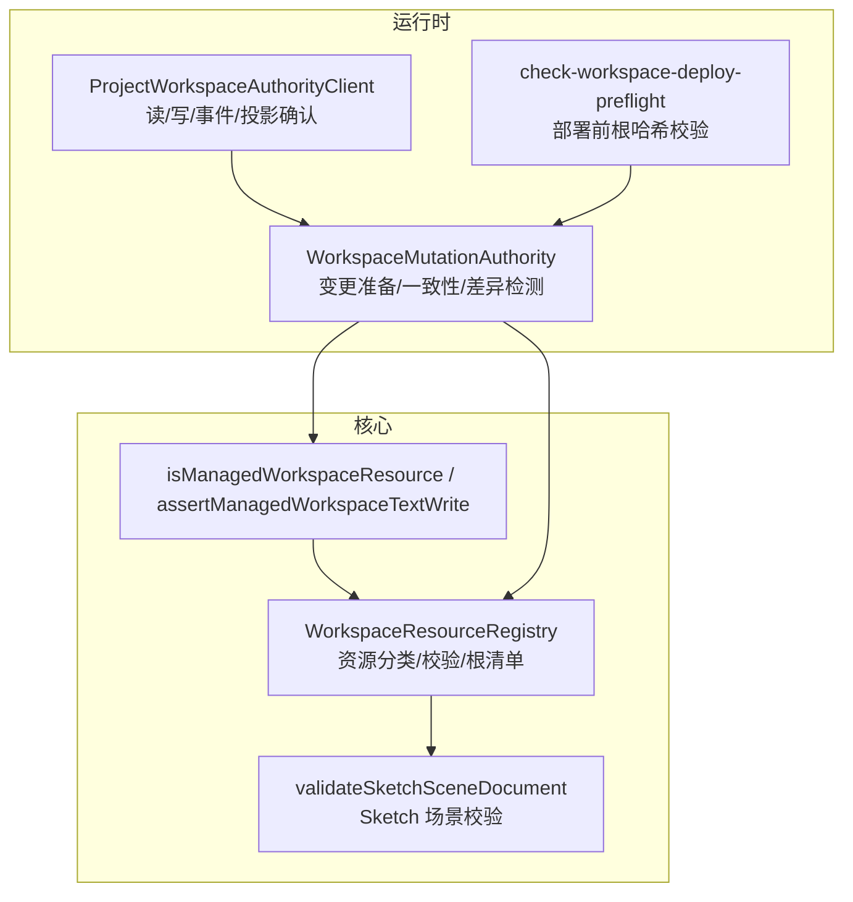
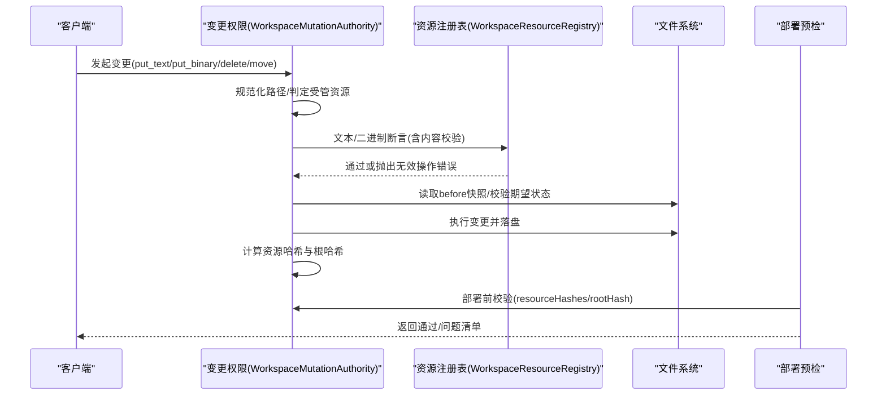
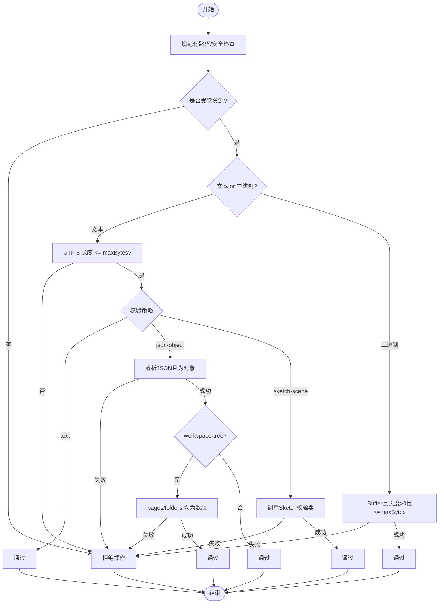
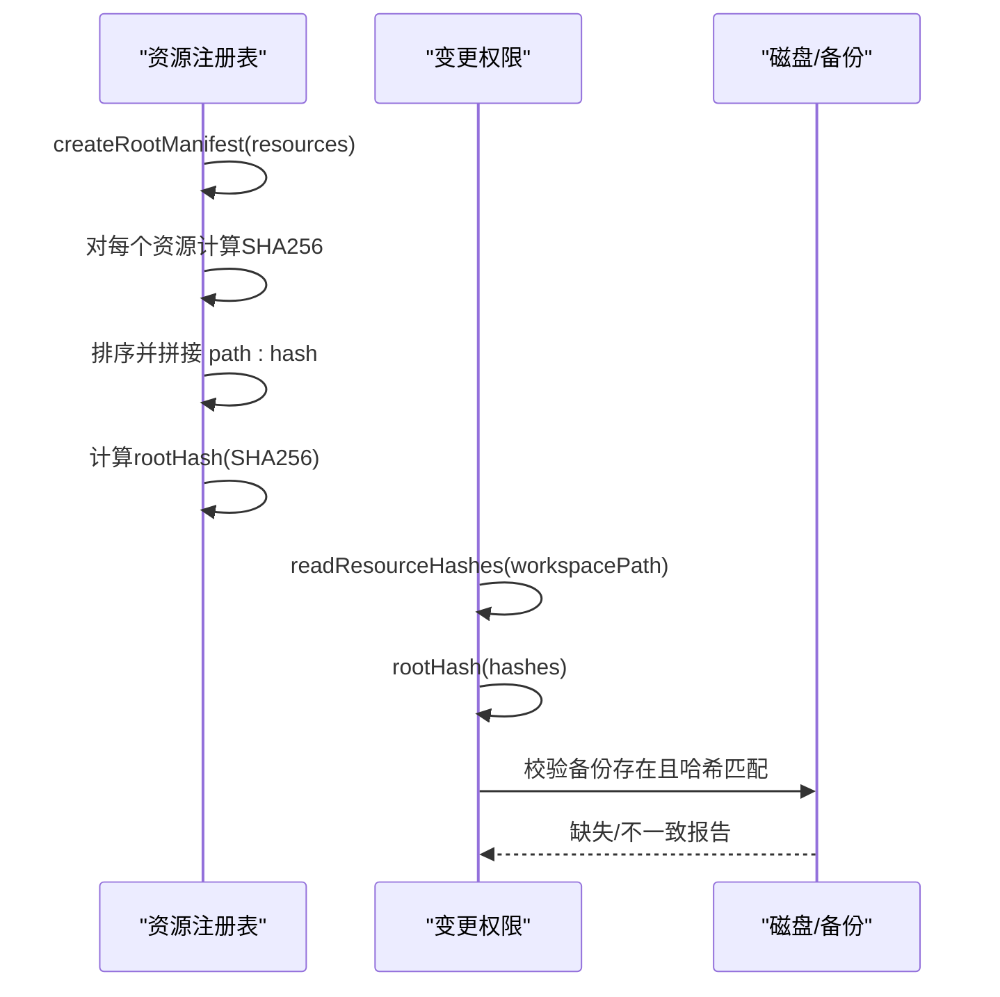
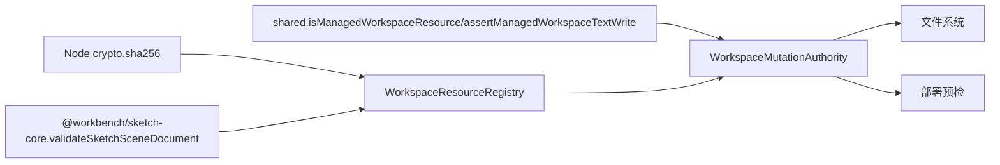

# 工作区资源管理

<cite>
**本文引用的文件列表**
- [packages/project-core/src/workspace-resource-registry.ts](file://packages/project-core/src/workspace-resource-registry.ts)
- [packages/shared/src/contracts.ts](file://packages/shared/src/contracts.ts)
- [packages/sketch-core/src/index.ts](file://packages/sketch-core/src/index.ts)
- [packages/project-core/src/__tests__/workspace-resource-registry.test.ts](file://packages/project-core/src/__tests__/workspace-resource-registry.test.ts)
- [packages/agent-service/src/workspace/workspace-mutation-authority.ts](file://packages/agent-service/src/workspace/workspace-mutation-authority.ts)
- [scripts/check-workspace-deploy-preflight.mjs](file://scripts/check-workspace-deploy-preflight.mjs)
- [packages/project-cli/src/workspace-authority-client.ts](file://packages/project-cli/src/workspace-authority-client.ts)
</cite>

## 目录
1. [简介](#简介)
2. [项目结构](#项目结构)
3. [核心组件](#核心组件)
4. [架构总览](#架构总览)
5. [详细组件分析](#详细组件分析)
6. [依赖关系分析](#依赖关系分析)
7. [性能考量](#性能考量)
8. [故障排查指南](#故障排查指南)
9. [结论](#结论)
10. [附录](#附录)

## 简介
本技术文档围绕“工作区资源管理系统”展开，重点阐述 WorkspaceResourceRegistry 的设计与实现、资源分类体系、内容验证机制、哈希与完整性校验、安全策略（大小限制、路径遍历防护、二进制处理），以及资源操作 API 的使用示例与性能优化建议。目标是帮助开发者快速理解并正确使用该子系统，确保工作区资源的正确性、一致性与安全性。

## 项目结构
工作区资源管理相关代码主要分布在以下模块：
- 资源注册表与策略：packages/project-core/src/workspace-resource-registry.ts
- 受管资源判定与文本写入断言：packages/shared/src/contracts.ts
- Sketch 场景文档解析与校验：packages/sketch-core/src/index.ts
- 变更权限与一致性检查：packages/agent-service/src/workspace/workspace-mutation-authority.ts
- 部署预检与根哈希比对：scripts/check-workspace-deploy-preflight.mjs
- 客户端 API 封装：packages/project-cli/src/workspace-authority-client.ts
- 单元测试覆盖：packages/project-core/src/__tests__/workspace-resource-registry.test.ts



图表来源
- [packages/project-core/src/workspace-resource-registry.ts:1-141](file://packages/project-core/src/workspace-resource-registry.ts#L1-L141)
- [packages/shared/src/contracts.ts:183-201](file://packages/shared/src/contracts.ts#L183-L201)
- [packages/sketch-core/src/index.ts:580-779](file://packages/sketch-core/src/index.ts#L580-L779)
- [packages/agent-service/src/workspace/workspace-mutation-authority.ts:710-851](file://packages/agent-service/src/workspace/workspace-mutation-authority.ts#L710-L851)
- [scripts/check-workspace-deploy-preflight.mjs:141-164](file://scripts/check-workspace-deploy-preflight.mjs#L141-L164)
- [packages/project-cli/src/workspace-authority-client.ts:52-120](file://packages/project-cli/src/workspace-authority-client.ts#L52-L120)

章节来源
- [packages/project-core/src/workspace-resource-registry.ts:1-141](file://packages/project-core/src/workspace-resource-registry.ts#L1-L141)
- [packages/shared/src/contracts.ts:183-201](file://packages/shared/src/contracts.ts#L183-L201)
- [packages/sketch-core/src/index.ts:580-779](file://packages/sketch-core/src/index.ts#L580-L779)
- [packages/agent-service/src/workspace/workspace-mutation-authority.ts:710-851](file://packages/agent-service/src/workspace/workspace-mutation-authority.ts#L710-L851)
- [scripts/check-workspace-deploy-preflight.mjs:141-164](file://scripts/check-workspace-deploy-preflight.mjs#L141-L164)
- [packages/project-cli/src/workspace-authority-client.ts:52-120](file://packages/project-cli/src/workspace-authority-client.ts#L52-L120)

## 核心组件
- WorkspaceResourceRegistry：集中定义所有受管资源的路径模式、类型、文本/二进制属性、最大字节数与内容校验策略；提供文本/二进制写入断言与根清单生成。
- isManagedWorkspaceResource/assertManagedWorkspaceTextWrite：在共享层提供“是否受管资源”的快速判断与文本写入前置断言，用于变更权限与一致性检查。
- validateSketchSceneDocument：对 Sketch 场景 JSON 进行严格的结构与语义校验，包括版本、页面尺寸、节点集合、几何约束、样式与绑定等。
- WorkspaceMutationAuthority：在执行变更时读取目标资源、计算哈希、比较期望状态、生成根哈希，保障并发与幂等。
- check-workspace-deploy-preflight：部署前扫描已提交备份，对比 resourceHashes 与根哈希，发现缺失或不一致。
- ProjectWorkspaceAuthorityClient：对外暴露读资源、发起变更、拉取事件、投影确认与 reconcile 的 HTTP 客户端。

章节来源
- [packages/project-core/src/workspace-resource-registry.ts:1-141](file://packages/project-core/src/workspace-resource-registry.ts#L1-L141)
- [packages/shared/src/contracts.ts:183-201](file://packages/shared/src/contracts.ts#L183-L201)
- [packages/sketch-core/src/index.ts:580-779](file://packages/sketch-core/src/index.ts#L580-L779)
- [packages/agent-service/src/workspace/workspace-mutation-authority.ts:710-851](file://packages/agent-service/src/workspace/workspace-mutation-authority.ts#L710-L851)
- [scripts/check-workspace-deploy-preflight.mjs:141-164](file://scripts/check-workspace-deploy-preflight.mjs#L141-L164)
- [packages/project-cli/src/workspace-authority-client.ts:52-120](file://packages/project-cli/src/workspace-authority-client.ts#L52-L120)

## 架构总览
工作区资源管理的整体流程如下：
- 入口：调用方通过 Client 发起读/写请求。
- 准入：使用 isManagedWorkspaceResource 与 normalizeWorkspaceResourcePath 进行路径规范化与安全过滤。
- 校验：根据资源描述符执行文本或二进制断言，必要时进行 JSON/Sketch/工作区树结构校验。
- 一致性：变更权限层读取 before 快照、校验 expectedHash/expectedAbsent，防止冲突。
- 持久化：将变更落盘后，计算每个资源的 SHA256 与根哈希，供后续增量同步与部署预检使用。



图表来源
- [packages/project-cli/src/workspace-authority-client.ts:52-120](file://packages/project-cli/src/workspace-authority-client.ts#L52-L120)
- [packages/agent-service/src/workspace/workspace-mutation-authority.ts:710-851](file://packages/agent-service/src/workspace/workspace-mutation-authority.ts#L710-L851)
- [packages/project-core/src/workspace-resource-registry.ts:1-141](file://packages/project-core/src/workspace-resource-registry.ts#L1-L141)
- [scripts/check-workspace-deploy-preflight.mjs:141-164](file://scripts/check-workspace-deploy-preflight.mjs#L141-L164)

## 详细组件分析

### 资源分类体系与处理规则
- 资源种类（kind）涵盖：
  - 页面代码：demos/<page>/index.tsx
  - 原型文件：demos/<page>/prototype.html、prototype.css、prototype.meta.json、config.schema.json
  - 手绘页面：demos/<page>/sketch.scene.json、sketch.meta.json
  - 项目配置：project.config.schema.json、project.config.values.json
  - 工作区树：workspace-tree.json
  - 画布布局：.canvas-layout.json
  - 知识文档：knowledge/*.md(.markdown/.mdown)、knowledge/manifest.json
  - 资产文件：assets/*
- 每种资源均包含：
  - text：是否为文本资源
  - maxBytes：最大字节限制（文本通常为 2MB，资产为 20MB）
  - validation：校验策略（text/json-object/workspace-tree/sketch-scene/binary）

```mermaid
classDiagram
class WorkspaceResourceRegistry {
+describe(resourcePath) WorkspaceResourceDescriptor|Null
+assertTextWrite(resourcePath, content) WorkspaceResourceDescriptor
+assertBinaryWrite(resourcePath, content) WorkspaceResourceDescriptor
+createRootManifest(resources) WorkspaceRootManifest
-validateTextContent(descriptor, content) void
}
class WorkspaceResourceDescriptor {
+kind : string
+text : boolean
+maxBytes : number
+validation : string
}
class WorkspaceRootManifest {
+rootHash : string
+resourceHashes : Record~string,string~
+resources : {path,kind,hash,size}[]
}
WorkspaceResourceRegistry --> WorkspaceResourceDescriptor : "返回"
WorkspaceResourceRegistry --> WorkspaceRootManifest : "生成"
```

图表来源
- [packages/project-core/src/workspace-resource-registry.ts:1-141](file://packages/project-core/src/workspace-resource-registry.ts#L1-L141)

章节来源
- [packages/project-core/src/workspace-resource-registry.ts:1-141](file://packages/project-core/src/workspace-resource-registry.ts#L1-L141)
- [packages/project-core/src/__tests__/workspace-resource-registry.test.ts:1-114](file://packages/project-core/src/__tests__/workspace-resource-registry.test.ts#L1-L114)

### 资源验证机制
- 路径规范化与安全：
  - 统一斜杠、去除前导斜杠、拒绝空路径、零字符与“..”越界路径。
- 文本内容验证：
  - 若 validation 为 json-object：必须为合法 JSON 且为对象（非数组）。
  - 若 validation 为 workspace-tree：除 JSON 对象外，还需包含 pages 与 folders 两个数组字段。
  - 若 validation 为 sketch-scene：调用 Sketch 场景校验器，要求版本、页面尺寸、节点集合、几何与样式/绑定等符合协议。
  - 若 validation 为 text：仅做长度与编码检查。
- 二进制内容验证：
  - 必须为 Buffer，长度大于 0，且不超过 maxBytes。



图表来源
- [packages/project-core/src/workspace-resource-registry.ts:41-135](file://packages/project-core/src/workspace-resource-registry.ts#L41-L135)
- [packages/sketch-core/src/index.ts:580-779](file://packages/sketch-core/src/index.ts#L580-L779)

章节来源
- [packages/project-core/src/workspace-resource-registry.ts:41-135](file://packages/project-core/src/workspace-resource-registry.ts#L41-L135)
- [packages/sketch-core/src/index.ts:580-779](file://packages/sketch-core/src/index.ts#L580-L779)
- [packages/project-core/src/__tests__/workspace-resource-registry.test.ts:71-85](file://packages/project-core/src/__tests__/workspace-resource-registry.test.ts#L71-L85)

### 资源哈希计算与完整性检查
- 单资源哈希：对所有资源内容（文本 UTF-8 字节或原始二进制）计算 SHA256。
- 根哈希生成：将所有资源按路径排序，拼接为 “path:hash\n...” 序列，再计算 SHA256。
- 差异检测：
  - 变更权限层在准备阶段读取 before 快照，记录每个资源的 exists/hash。
  - 提交时校验 expectedHash/expectedAbsent，避免并发覆盖。
  - 部署预检扫描已提交备份，对比 resourceHashes 与 rootHash，定位缺失或不一致的备份。



图表来源
- [packages/project-core/src/workspace-resource-registry.ts:47-112](file://packages/project-core/src/workspace-resource-registry.ts#L47-L112)
- [packages/agent-service/src/workspace/workspace-mutation-authority.ts:825-851](file://packages/agent-service/src/workspace/workspace-mutation-authority.ts#L825-L851)
- [scripts/check-workspace-deploy-preflight.mjs:141-164](file://scripts/check-workspace-deploy-preflight.mjs#L141-L164)

章节来源
- [packages/project-core/src/workspace-resource-registry.ts:47-112](file://packages/project-core/src/workspace-resource-registry.ts#L47-L112)
- [packages/agent-service/src/workspace/workspace-mutation-authority.ts:825-851](file://packages/agent-service/src/workspace/workspace-mutation-authority.ts#L825-L851)
- [scripts/check-workspace-deploy-preflight.mjs:141-164](file://scripts/check-workspace-deploy-preflight.mjs#L141-L164)

### 安全策略与大小限制
- 路径遍历防护：
  - 规范化路径时拒绝包含“..”、空路径与零字符的路径。
  - 变更权限层再次校验 isManagedWorkspaceResource，确保只允许受管路径。
- 文件大小上限：
  - 文本资源默认最大 2MB。
  - 资产文件最大 20MB（变更权限层对 put_binary 也做了 size 与 stagingId 校验）。
- 二进制文件处理：
  - 仅接受 Buffer，禁止空内容，强制走二进制断言。
  - 资产路径必须以 assets/ 开头，stagingId 需为 UUID 格式，size 与 hash 需一致。

章节来源
- [packages/project-core/src/workspace-resource-registry.ts:41-88](file://packages/project-core/src/workspace-resource-registry.ts#L41-L88)
- [packages/shared/src/contracts.ts:183-201](file://packages/shared/src/contracts.ts#L183-L201)
- [packages/agent-service/src/workspace/workspace-mutation-authority.ts:710-740](file://packages/agent-service/src/workspace/workspace-mutation-authority.ts#L710-L740)

### 资源操作 API 使用示例
- 读取资源：
  - 客户端方法：readResource(projectId, workspaceId, resourcePath)
  - 返回：path、content、hash、revision
- 发起变更：
  - 客户端方法：mutate(request)
  - request 包含 sessionId、projectId、workspaceId、operations[]
  - operations 支持 put_text、put_binary、delete_path、move_path
- 事件与投影：
  - getEvents(projectId, workspaceId, afterRevision)
  - getProjectionAcks(projectId, workspaceId, afterRevision)
  - acknowledgeProjection(ack)
- 合并恢复：
  - reconcile(projectId, workspaceId, mode="adopt"|"restore")

章节来源
- [packages/project-cli/src/workspace-authority-client.ts:52-120](file://packages/project-cli/src/workspace-authority-client.ts#L52-L120)

## 依赖关系分析
- WorkspaceResourceRegistry 依赖：
  - @workbench/sketch-core 的 validateSketchSceneDocument
  - Node crypto 的 sha256
- 变更权限层依赖：
  - 共享层的 isManagedWorkspaceResource/assertManagedWorkspaceTextWrite
  - 资源注册表的断言与哈希函数
  - 文件系统读写与 staging 存储
- 部署预检依赖：
  - 资源哈希映射与根哈希，用于一致性校验



图表来源
- [packages/project-core/src/workspace-resource-registry.ts:1-141](file://packages/project-core/src/workspace-resource-registry.ts#L1-L141)
- [packages/shared/src/contracts.ts:183-201](file://packages/shared/src/contracts.ts#L183-L201)
- [packages/agent-service/src/workspace/workspace-mutation-authority.ts:710-851](file://packages/agent-service/src/workspace/workspace-mutation-authority.ts#L710-L851)

章节来源
- [packages/project-core/src/workspace-resource-registry.ts:1-141](file://packages/project-core/src/workspace-resource-registry.ts#L1-L141)
- [packages/shared/src/contracts.ts:183-201](file://packages/shared/src/contracts.ts#L183-L201)
- [packages/agent-service/src/workspace/workspace-mutation-authority.ts:710-851](file://packages/agent-service/src/workspace/workspace-mutation-authority.ts#L710-L851)

## 性能考量
- 哈希计算：
  - 使用流式或分块方式可避免大文件一次性加载到内存（当前实现直接传入 Buffer/字符串，适合中小规模资源）。
  - 根哈希生成时对 entries 排序，保证顺序无关性，但排序开销随资源数量线性增长。
- I/O 访问：
  - 变更权限层在 prepare 阶段会遍历工作区以构建 before 快照，建议在高频变更场景下缓存快照或使用增量索引。
- 批量操作：
  - 合并多个小变更为一个 mutation，减少网络往返与重复校验。
- 资源裁剪：
  - 仅在需要时计算根哈希；对于只读路径可使用资源级哈希进行差异检测。

[本节为通用性能建议，不直接分析具体文件]

## 故障排查指南
- 常见错误码与原因：
  - WORKSPACE_INVALID_OPERATION：路径不受管、越界、类型不匹配、内容校验失败、二进制为空或超限。
  - WORKSPACE_RESOURCE_CONFLICT：baseRevision 过期或期望状态与实际不符。
- 排查步骤：
  - 确认路径是否受管且规范化正确。
  - 检查文本/二进制断言是否通过（大小、类型、JSON/Sketch/工作区树结构）。
  - 核对 expectedHash/expectedAbsent 是否与 before 快照一致。
  - 使用部署预检脚本定位缺失或不一致的备份资源。
- 日志与输出：
  - 变更权限层会在 prepare 阶段抛出明确错误信息。
  - 部署预检会返回 missingResources 列表与 issues 清单。

章节来源
- [packages/agent-service/src/workspace/workspace-mutation-authority.ts:710-740](file://packages/agent-service/src/workspace/workspace-mutation-authority.ts#L710-L740)
- [scripts/check-workspace-deploy-preflight.mjs:141-164](file://scripts/check-workspace-deploy-preflight.mjs#L141-L164)

## 结论
工作区资源管理通过统一的资源注册表与严格的校验策略，确保了资源类型的规范性、内容的合法性与系统的一致性。结合 SHA256 哈希与根哈希机制，实现了可靠的完整性校验与差异检测。配合变更权限层的安全策略与部署预检，有效防范了路径穿越、越权访问与数据损坏风险。建议在生产环境中结合缓存与增量索引进一步优化性能，并持续完善监控与告警能力。

[本节为总结性内容，不直接分析具体文件]

## 附录
- 资源类型与校验策略速查：
  - page-code、page-prototype-html/css/meta、page-schema、page-sketch-scene/meta、project-schema/values、workspace-tree、canvas-layout、knowledge-document/manifest、asset
  - 校验策略：text、json-object、workspace-tree、sketch-scene、binary
- 关键常量与限制：
  - 文本最大 2MB，资产最大 20MB
  - 资产路径必须以 assets/ 开头，stagingId 需为 UUID 格式

章节来源
- [packages/project-core/src/workspace-resource-registry.ts:1-141](file://packages/project-core/src/workspace-resource-registry.ts#L1-L141)
- [packages/agent-service/src/workspace/workspace-mutation-authority.ts:710-740](file://packages/agent-service/src/workspace/workspace-mutation-authority.ts#L710-L740)