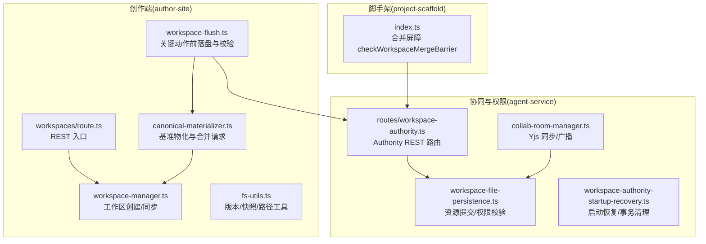
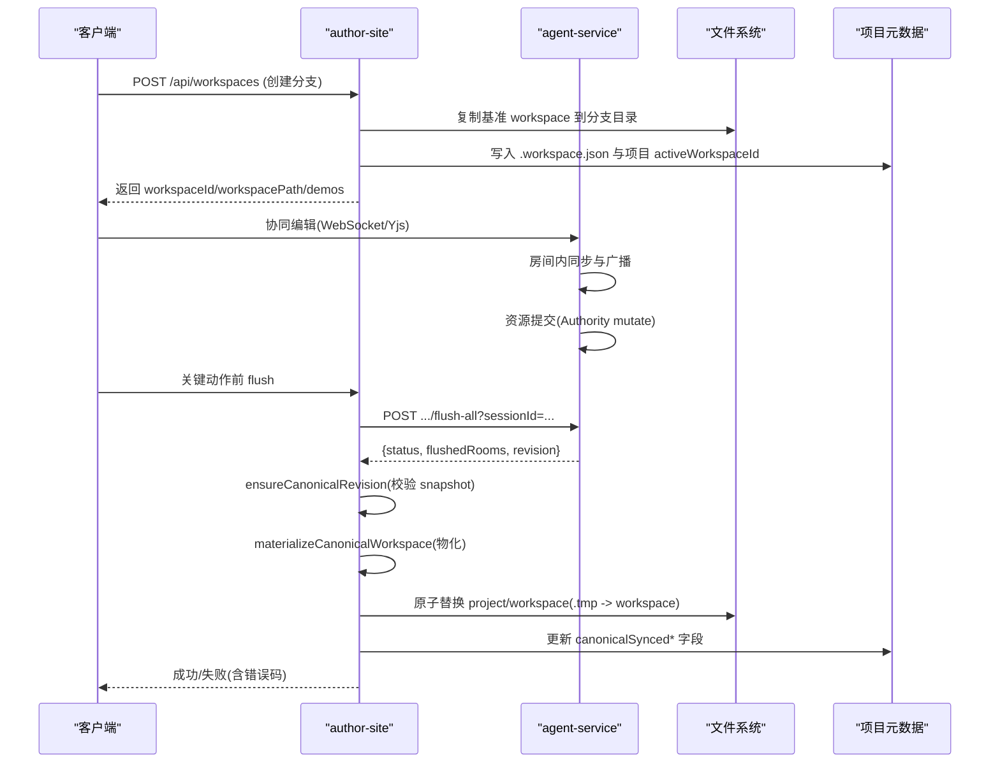
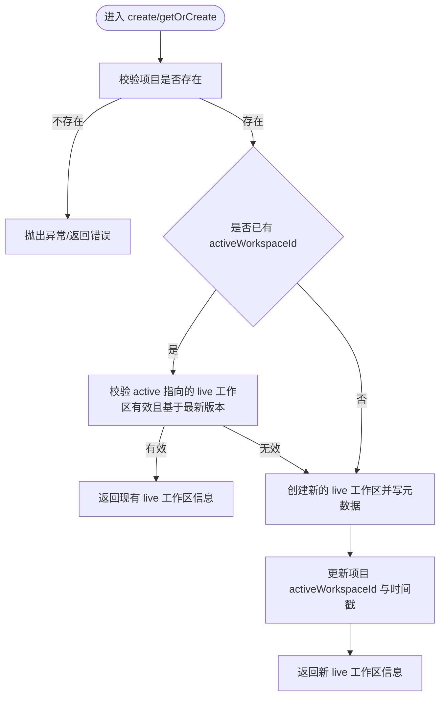
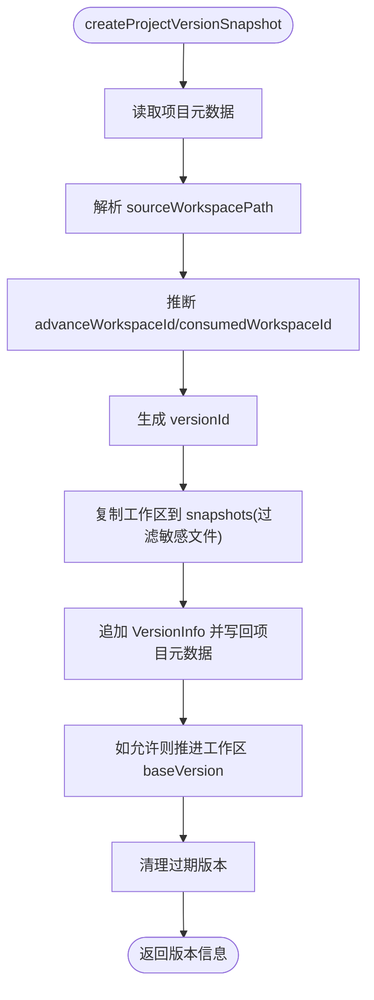
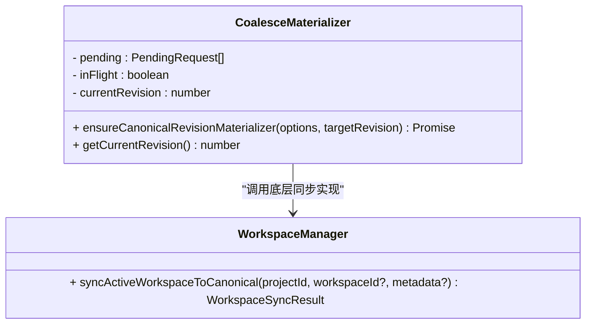
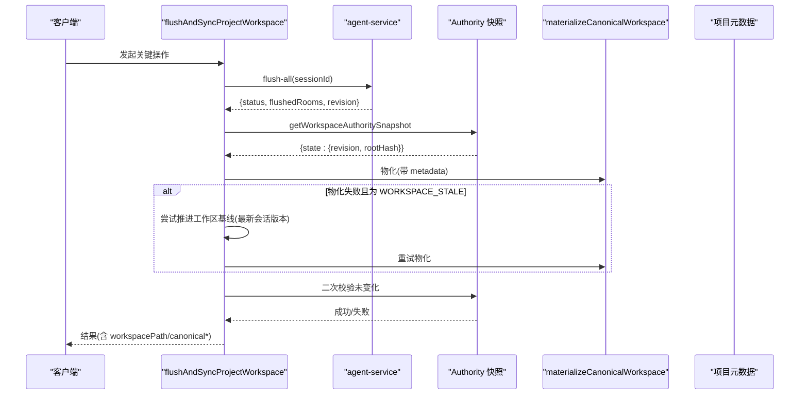
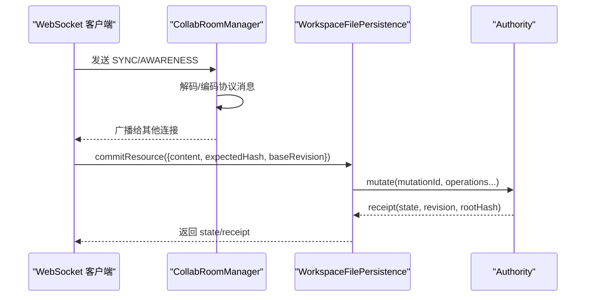
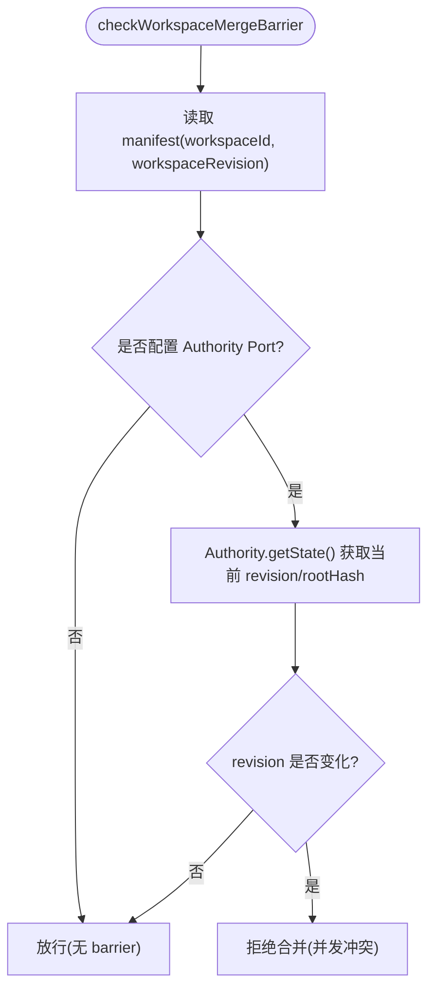
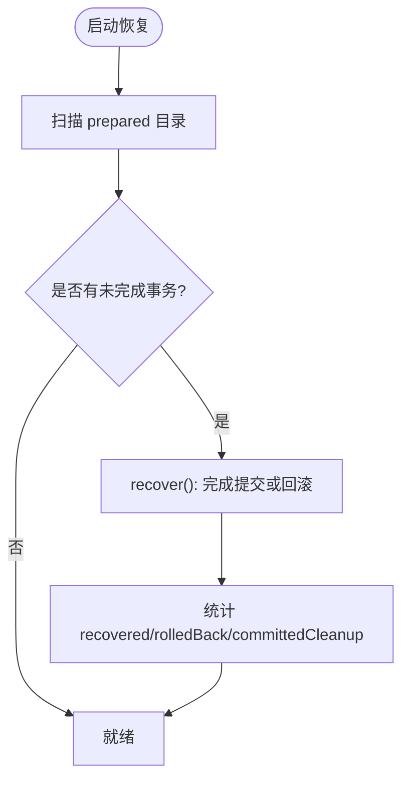
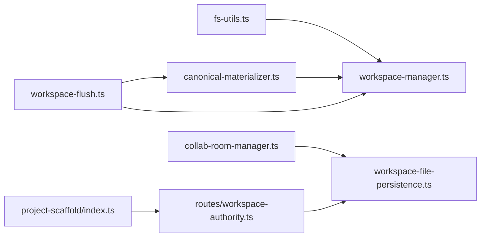

# 工作区转换流程

<cite>
**本文引用的文件**
- [packages/author-site/src/lib/workspace-manager.ts](file://packages/author-site/src/lib/workspace-manager.ts)
- [packages/author-site/src/lib/canonical-materializer.ts](file://packages/author-site/src/lib/canonical-materializer.ts)
- [packages/author-site/src/lib/workspace-flush.ts](file://packages/author-site/src/lib/workspace-flush.ts)
- [packages/author-site/src/lib/fs-utils.ts](file://packages/author-site/src/lib/fs-utils.ts)
- [packages/agent-service/src/collab/collab-room-manager.ts](file://packages/agent-service/src/collab/collab-room-manager.ts)
- [packages/agent-service/src/collab/workspace-file-persistence.ts](file://packages/agent-service/src/collab/workspace-file-persistence.ts)
- [packages/agent-service/src/workspace/workspace-authority-startup-recovery.ts](file://packages/agent-service/src/workspace/workspace-authority-startup-recovery.ts)
- [packages/project-scaffold/src/index.ts](file://packages/project-scaffold/src/index.ts)
- [packages/author-site/src/app/api/workspaces/route.ts](file://packages/author-site/src/app/api/workspaces/route.ts)
- [packages/agent-service/src/routes/workspace-authority.ts](file://packages/agent-service/src/routes/workspace-authority.ts)
</cite>

## 目录
1. [简介](#简介)
2. [项目结构](#项目结构)
3. [核心组件](#核心组件)
4. [架构总览](#架构总览)
5. [详细组件分析](#详细组件分析)
6. [依赖关系分析](#依赖关系分析)
7. [性能与一致性](#性能与一致性)
8. [故障排查指南](#故障排查指南)
9. [结论](#结论)
10. [附录：API 调用示例](#附录api-调用示例)

## 简介
本技术文档围绕“工作区转换流程”展开，覆盖从基准工作区到分支工作区的创建、快照生成、增量复制与元数据同步；分支合并策略（自动合并算法、冲突检测规则、手动解决流程）；工作区状态同步机制（实时协作支持、版本锁定、并发控制）；以及数据一致性保证（事务处理、回滚机制、错误恢复）。文末提供 API 调用示例与故障排查指南。

## 项目结构
该仓库采用多包 monorepo 组织，工作区转换相关代码主要分布在以下模块：
- author-site：创作端服务，负责工作区创建、同步、物化、刷新落盘等
- agent-service：协同与权限服务，负责协作房间、持久化、启动恢复、Authority 路由
- project-scaffold：脚手架工具，提供合并屏障检查等能力
- 其他：测试、脚本、文档等

图示来源
- [packages/author-site/src/lib/workspace-manager.ts:1-755](file://packages/author-site/src/lib/workspace-manager.ts#L1-L755)
- [packages/author-site/src/lib/canonical-materializer.ts:1-152](file://packages/author-site/src/lib/canonical-materializer.ts#L1-L152)
- [packages/author-site/src/lib/workspace-flush.ts:1-288](file://packages/author-site/src/lib/workspace-flush.ts#L1-L288)
- [packages/author-site/src/lib/fs-utils.ts:1400-1600](file://packages/author-site/src/lib/fs-utils.ts#L1400-L1600)
- [packages/author-site/src/app/api/workspaces/route.ts:1-49](file://packages/author-site/src/app/api/workspaces/route.ts#L1-L49)
- [packages/agent-service/src/collab/collab-room-manager.ts:297-493](file://packages/agent-service/src/collab/collab-room-manager.ts#L297-L493)
- [packages/agent-service/src/collab/workspace-file-persistence.ts:164-200](file://packages/agent-service/src/collab/workspace-file-persistence.ts#L164-L200)
- [packages/agent-service/src/workspace/workspace-authority-startup-recovery.ts:71-88](file://packages/agent-service/src/workspace/workspace-authority-startup-recovery.ts#L71-L88)
- [packages/agent-service/src/routes/workspace-authority.ts:40-65](file://packages/agent-service/src/routes/workspace-authority.ts#L40-L65)
- [packages/project-scaffold/src/index.ts:1967-2018](file://packages/project-scaffold/src/index.ts#L1967-L2018)

章节来源
- [packages/author-site/src/lib/workspace-manager.ts:1-755](file://packages/author-site/src/lib/workspace-manager.ts#L1-L755)
- [packages/author-site/src/lib/canonical-materializer.ts:1-152](file://packages/author-site/src/lib/canonical-materializer.ts#L1-L152)
- [packages/author-site/src/lib/workspace-flush.ts:1-288](file://packages/author-site/src/lib/workspace-flush.ts#L1-L288)
- [packages/author-site/src/lib/fs-utils.ts:1400-1600](file://packages/author-site/src/lib/fs-utils.ts#L1400-L1600)
- [packages/agent-service/src/collab/collab-room-manager.ts:297-493](file://packages/agent-service/src/collab/collab-room-manager.ts#L297-L493)
- [packages/agent-service/src/collab/workspace-file-persistence.ts:164-200](file://packages/agent-service/src/collab/workspace-file-persistence.ts#L164-L200)
- [packages/agent-service/src/workspace/workspace-authority-startup-recovery.ts:71-88](file://packages/agent-service/src/workspace/workspace-authority-startup-recovery.ts#L71-L88)
- [packages/agent-service/src/routes/workspace-authority.ts:40-65](file://packages/agent-service/src/routes/workspace-authority.ts#L40-L65)
- [packages/project-scaffold/src/index.ts:1967-2018](file://packages/project-scaffold/src/index.ts#L1967-L2018)

## 核心组件
- 工作区管理器（author-site）
  - 负责分支工作区创建、Live 工作区获取/创建、将活跃工作区同步至项目基准工作区（canonical）、清理孤儿工作区、会话与工作区同步等
- 基准物化器（author-site）
  - 对多次物化请求进行合并（coalesce），确保同一时刻仅一次物化执行，并返回目标 revision/rootHash
- 刷新与落盘（author-site）
  - 在关键动作前将协同草稿落盘，校验 Authority 快照，完成 canonical 物化，并在必要时提升工作区基线
- 文件系统工具（author-site）
  - 版本生成、快照创建、工作区查找与元数据读写、多页面文件读取等
- 协同房间管理（agent-service）
  - Yjs 同步协议处理、awareness 广播、空闲房间回收
- 协作持久化（agent-service）
  - 基于 Authority 的文本资源提交、权限校验、状态查询
- 启动恢复（agent-service）
  - 启动时扫描未完成事务，按 manifest/hash 决定提交或回滚，产出诊断统计
- 合并屏障（project-scaffold）
  - 提交本地项目包前，通过 Authority 对比当前 revision 与本地记录，防止并发写入冲突

章节来源
- [packages/author-site/src/lib/workspace-manager.ts:190-334](file://packages/author-site/src/lib/workspace-manager.ts#L190-L334)
- [packages/author-site/src/lib/canonical-materializer.ts:30-152](file://packages/author-site/src/lib/canonical-materializer.ts#L30-L152)
- [packages/author-site/src/lib/workspace-flush.ts:114-287](file://packages/author-site/src/lib/workspace-flush.ts#L114-L287)
- [packages/author-site/src/lib/fs-utils.ts:1454-1539](file://packages/author-site/src/lib/fs-utils.ts#L1454-L1539)
- [packages/agent-service/src/collab/collab-room-manager.ts:297-493](file://packages/agent-service/src/collab/collab-room-manager.ts#L297-L493)
- [packages/agent-service/src/collab/workspace-file-persistence.ts:164-200](file://packages/agent-service/src/collab/workspace-file-persistence.ts#L164-L200)
- [packages/agent-service/src/workspace/workspace-authority-startup-recovery.ts:71-88](file://packages/agent-service/src/workspace/workspace-authority-startup-recovery.ts#L71-L88)
- [packages/project-scaffold/src/index.ts:1994-2018](file://packages/project-scaffold/src/index.ts#L1994-L2018)

## 架构总览
下图展示了从用户触发保存/发布到最终将工作区内容同步到项目基准工作区的关键链路，包括协同草稿落盘、Authority 快照校验、基准物化与元数据更新。

图示来源
- [packages/author-site/src/app/api/workspaces/route.ts:13-49](file://packages/author-site/src/app/api/workspaces/route.ts#L13-L49)
- [packages/author-site/src/lib/workspace-manager.ts:190-334](file://packages/author-site/src/lib/workspace-manager.ts#L190-L334)
- [packages/author-site/src/lib/workspace-flush.ts:191-287](file://packages/author-site/src/lib/workspace-flush.ts#L191-L287)
- [packages/agent-service/src/collab/collab-room-manager.ts:297-493](file://packages/agent-service/src/collab/collab-room-manager.ts#L297-L493)
- [packages/agent-service/src/collab/workspace-file-persistence.ts:164-200](file://packages/agent-service/src/collab/workspace-file-persistence.ts#L164-L200)

## 详细组件分析

### 分支工作区创建与 Live 工作区获取
- 分支工作区创建
  - 校验项目存在性
  - 生成唯一 workspaceId
  - 复制项目基准 workspace 到用户目录下的分支工作区
  - 写入 .workspace.json（scope=branch、baseVersion=最新版本）
  - 返回 workspaceId、workspacePath、demos 集合
- Live 工作区获取/创建
  - 若项目已有 activeWorkspaceId 且指向有效 live 工作区，则复用
  - 否则创建新的 live 工作区（可迁移自旧工作区），写入 .workspace.json（scope=live）
  - 更新项目元数据中的 activeWorkspaceId 与时间戳

图示来源
- [packages/author-site/src/lib/workspace-manager.ts:190-334](file://packages/author-site/src/lib/workspace-manager.ts#L190-L334)

章节来源
- [packages/author-site/src/lib/workspace-manager.ts:190-334](file://packages/author-site/src/lib/workspace-manager.ts#L190-L334)

### 快照生成与版本历史
- 版本 ID 生成：基于项目现有版本列表的最大版本号 +1
- 快照创建：
  - 选择源工作区路径（可为项目 workspace 或指定 sourceWorkspacePath）
  - 计算要推进的工作区（advanceWorkspaceId）与消费的工作区（consumedWorkspaceId）
  - 过滤 node_modules、.session.json、.workspace.json 后完整复制到 snapshots 目录
  - 写入 VersionInfo（包含 fileCount、workspaceId、revision、rootHash 等）
  - 可选推进工作区 baseVersion 为当前版本
- 版本清理：保留最近 N 个版本，删除更早的自动检查点版本

图示来源
- [packages/author-site/src/lib/fs-utils.ts:1454-1539](file://packages/author-site/src/lib/fs-utils.ts#L1454-L1539)
- [packages/author-site/src/lib/fs-utils.ts:1418-1452](file://packages/author-site/src/lib/fs-utils.ts#L1418-L1452)

章节来源
- [packages/author-site/src/lib/fs-utils.ts:1418-1452](file://packages/author-site/src/lib/fs-utils.ts#L1418-L1452)
- [packages/author-site/src/lib/fs-utils.ts:1454-1539](file://packages/author-site/src/lib/fs-utils.ts#L1454-L1539)

### 基准物化与元数据同步
- 物化入口
  - 直接调用底层 syncActiveWorkspaceToCanonical 或通过 CoalesceMaterializer 合并请求
- 同步逻辑
  - 校验项目与 activeWorkspaceId 有效性
  - 校验工作区基于最新版本
  - 使用临时目录 .tmp 复制并清理敏感文件，再原子重命名为 project/workspace
  - 同步演示页映射，更新项目元数据 canonicalSynced* 字段
- 合并请求（Coalesce）
  - 维护待处理队列，仅对最新 targetRevision 执行一次物化
  - 单飞限制：同一时刻仅一个物化任务运行
  - 背压：物化期间的新请求加入下一批次

图示来源
- [packages/author-site/src/lib/canonical-materializer.ts:30-152](file://packages/author-site/src/lib/canonical-materializer.ts#L30-L152)
- [packages/author-site/src/lib/workspace-manager.ts:336-492](file://packages/author-site/src/lib/workspace-manager.ts#L336-L492)

章节来源
- [packages/author-site/src/lib/canonical-materializer.ts:30-152](file://packages/author-site/src/lib/canonical-materializer.ts#L30-L152)
- [packages/author-site/src/lib/workspace-manager.ts:336-492](file://packages/author-site/src/lib/workspace-manager.ts#L336-L492)

### 关键动作前的落盘与冲突检测
- 落盘流程
  - 刷新所有协同房间到持久层（POST .../flush-all）
  - 获取 Authority 快照，校验 revision/rootHash 与期望值一致
  - 执行 canonical 物化，必要时尝试推进工作区基线（当会话版本为最新）
  - 再次校验 canonical 未变化，否则清理已记录的 proof 并抛错
- 错误码归一化
  - 将外部漂移、资源冲突等统一映射为 WORKSPACE_STALE
  - 会话不存在/过期映射为 SESSION_NOT_FOUND/SESSION_EXPIRED
  - 非法请求映射为 INVALID_REQUEST
  - 文件写入错误映射为 FILE_WRITE_ERROR

图示来源
- [packages/author-site/src/lib/workspace-flush.ts:191-287](file://packages/author-site/src/lib/workspace-flush.ts#L191-L287)
- [packages/author-site/src/lib/canonical-materializer.ts:135-152](file://packages/author-site/src/lib/canonical-materializer.ts#L135-L152)
- [packages/author-site/src/lib/workspace-manager.ts:336-492](file://packages/author-site/src/lib/workspace-manager.ts#L336-L492)

章节来源
- [packages/author-site/src/lib/workspace-flush.ts:114-287](file://packages/author-site/src/lib/workspace-flush.ts#L114-L287)

### 实时协作与并发控制
- 协作房间
  - 基于 Yjs 的同步协议，服务端维护房间与会话连接
  - 处理 SYNC/AWARENESS 消息，向除发送者外的所有连接广播
  - 空闲房间定时回收，销毁 doc 与 awareness
- 资源提交与权限
  - 通过 Authority.mutate 提交 put_text 等操作，携带 expectedHash/baseRevision/sessionId
  - 权限校验失败返回 FORBIDDEN
- 并发控制
  - 同一 workspace 串行 mutation queue，禁止并行 commit
  - 幂等：重复 mutationId 返回相同 receipt，payload 不同则拒绝

图示来源
- [packages/agent-service/src/collab/collab-room-manager.ts:297-493](file://packages/agent-service/src/collab/collab-room-manager.ts#L297-L493)
- [packages/agent-service/src/collab/workspace-file-persistence.ts:164-200](file://packages/agent-service/src/collab/workspace-file-persistence.ts#L164-L200)

章节来源
- [packages/agent-service/src/collab/collab-room-manager.ts:297-493](file://packages/agent-service/src/collab/collab-room-manager.ts#L297-L493)
- [packages/agent-service/src/collab/workspace-file-persistence.ts:164-200](file://packages/agent-service/src/collab/workspace-file-persistence.ts#L164-L200)

### 分支合并策略与冲突检测
- 合并屏障
  - 在提交本地项目包前，读取 manifest 中的 workspaceId/workspaceRevision
  - 若配置了 workspaceAuthorityPort 且目标 workspace 为 live，则通过 Authority.getState 获取当前 revision
  - 若 revision 已变化，拒绝合并以防止并发写入冲突
- 自动合并算法
  - 以 Authority 的 revision/rootHash 为准，拒绝本地不一致的提交
  - 若无 port 或未配置 barrier，默认放行（由上层保障）
- 手动解决流程
  - 拉取最新权威状态
  - 重新生成快照或切换工作区基线
  - 重新提交并通过 barrier 检查

图示来源
- [packages/project-scaffold/src/index.ts:1994-2018](file://packages/project-scaffold/src/index.ts#L1994-L2018)

章节来源
- [packages/project-scaffold/src/index.ts:1994-2018](file://packages/project-scaffold/src/index.ts#L1994-L2018)

### 数据一致性：事务、回滚与恢复
- 事务处理
  - prepare：记录 previousState、before 文件快照
  - stage：全量校验、备份、应用操作
  - apply：提交 state/receipt，发布事件
- 回滚机制
  - 中途异常：根据 before 快照恢复文件内容，避免半写入成为新版本
- 启动恢复
  - 扫描 prepared 未完成事务，依据 manifest/hash 决定完成提交或回滚
  - 输出 recovered/rolledBack/committedCleanup 计数用于诊断

图示来源
- [packages/agent-service/src/workspace/workspace-authority-startup-recovery.ts:71-88](file://packages/agent-service/src/workspace/workspace-authority-startup-recovery.ts#L71-L88)

章节来源
- [packages/agent-service/src/workspace/workspace-authority-startup-recovery.ts:71-88](file://packages/agent-service/src/workspace/workspace-authority-startup-recovery.ts#L71-L88)

## 依赖关系分析
- author-site 内部依赖
  - workspace-manager 依赖 fs-utils（路径、元数据、版本/快照）
  - canonical-materializer 依赖 workspace-manager（底层同步）
  - workspace-flush 依赖 canonical-materializer、workspace-manager、authority-client
- agent-service 内部依赖
  - collab-room-manager 依赖 Yjs 协议与 WebSocket
  - workspace-file-persistence 依赖 authority（mutate/state）
  - routes/workspace-authority 暴露 REST 接口供 author-site 调用
- 跨模块依赖
  - project-scaffold 通过 Authority Port 与 agent-service 交互，用于合并屏障

图示来源
- [packages/author-site/src/lib/workspace-manager.ts:1-755](file://packages/author-site/src/lib/workspace-manager.ts#L1-L755)
- [packages/author-site/src/lib/canonical-materializer.ts:1-152](file://packages/author-site/src/lib/canonical-materializer.ts#L1-L152)
- [packages/author-site/src/lib/workspace-flush.ts:1-288](file://packages/author-site/src/lib/workspace-flush.ts#L1-L288)
- [packages/author-site/src/lib/fs-utils.ts:1400-1600](file://packages/author-site/src/lib/fs-utils.ts#L1400-L1600)
- [packages/agent-service/src/collab/collab-room-manager.ts:297-493](file://packages/agent-service/src/collab/collab-room-manager.ts#L297-L493)
- [packages/agent-service/src/collab/workspace-file-persistence.ts:164-200](file://packages/agent-service/src/collab/workspace-file-persistence.ts#L164-L200)
- [packages/agent-service/src/routes/workspace-authority.ts:40-65](file://packages/agent-service/src/routes/workspace-authority.ts#L40-L65)
- [packages/project-scaffold/src/index.ts:1967-2018](file://packages/project-scaffold/src/index.ts#L1967-L2018)

章节来源
- [packages/author-site/src/lib/workspace-manager.ts:1-755](file://packages/author-site/src/lib/workspace-manager.ts#L1-L755)
- [packages/author-site/src/lib/canonical-materializer.ts:1-152](file://packages/author-site/src/lib/canonical-materializer.ts#L1-L152)
- [packages/author-site/src/lib/workspace-flush.ts:1-288](file://packages/author-site/src/lib/workspace-flush.ts#L1-L288)
- [packages/author-site/src/lib/fs-utils.ts:1400-1600](file://packages/author-site/src/lib/fs-utils.ts#L1400-L1600)
- [packages/agent-service/src/collab/collab-room-manager.ts:297-493](file://packages/agent-service/src/collab/collab-room-manager.ts#L297-L493)
- [packages/agent-service/src/collab/workspace-file-persistence.ts:164-200](file://packages/agent-service/src/collab/workspace-file-persistence.ts#L164-L200)
- [packages/agent-service/src/routes/workspace-authority.ts:40-65](file://packages/agent-service/src/routes/workspace-authority.ts#L40-L65)
- [packages/project-scaffold/src/index.ts:1967-2018](file://packages/project-scaffold/src/index.ts#L1967-L2018)

## 性能与一致性
- 物化合并（Coalesce）
  - 减少重复物化开销，降低磁盘 IO 与 CPU 消耗
  - 单飞限制避免竞争条件
- 原子替换
  - 使用 .tmp 目录复制后再 rename，避免中间态导致的不一致
- 并发控制
  - 同一 workspace 串行 mutation queue，避免并发写入导致的损坏
- 幂等与回滚
  - 重复 mutationId 返回相同 receipt，异常时按 before 快照恢复
- 版本清理
  - 限制快照数量，控制磁盘占用

[本节为通用指导，不直接分析具体文件]

## 故障排查指南
- 常见错误码与定位
  - WORKSPACE_STALE：工作区过期或外部漂移，需刷新项目或重试落盘
  - FILE_WRITE_ERROR：文件写入失败，检查磁盘空间与权限
  - INVALID_REQUEST：参数不合法或项目/工作区不匹配
  - FORBIDDEN：权限不足
  - SESSION_NOT_FOUND/SESSION_EXPIRED：会话失效，需重新登录/续期
- 快速定位步骤
  - 查看 flush 日志与 Authority 快照差异（revision/rootHash）
  - 确认 canonicalSynced* 字段是否与预期一致
  - 检查 agent-service 启动恢复统计（recovered/rolledBack/committedCleanup）
  - 验证合并屏障是否阻止提交（manifest.workspaceRevision vs Authority.revision）

章节来源
- [packages/author-site/src/lib/workspace-flush.ts:79-112](file://packages/author-site/src/lib/workspace-flush.ts#L79-L112)
- [packages/agent-service/src/workspace/workspace-authority-startup-recovery.ts:71-88](file://packages/agent-service/src/workspace/workspace-authority-startup-recovery.ts#L71-L88)
- [packages/project-scaffold/src/index.ts:1994-2018](file://packages/project-scaffold/src/index.ts#L1994-L2018)

## 结论
工作区转换流程通过“分支创建—协同编辑—关键落盘—基准物化—元数据同步”的闭环，结合 Authority 的版本锁定与启动恢复，实现了高一致性与强容错。Coalesce 物化与串行 mutation queue 提升了吞吐与稳定性。合并屏障进一步保障了提交阶段的一致性。建议在生产环境开启合并屏障与严格错误码映射，配合监控与审计日志，持续优化用户体验与系统可靠性。

[本节为总结，不直接分析具体文件]

## 附录：API 调用示例
- 创建分支工作区
  - 方法：POST
  - 路径：/api/workspaces
  - 请求体：{ projectId: string }
  - 响应：{ success: true, data: { workspaceId, workspacePath, demos, workspaceScope } }
  - 参考：[packages/author-site/src/app/api/workspaces/route.ts:13-49](file://packages/author-site/src/app/api/workspaces/route.ts#L13-L49)

- 关键动作前落盘
  - 方法：POST
  - 路径：/api/collab/projects/{projectId}/workspaces/{workspaceId}/flush-all?sessionId={sessionId}
  - 响应：{ success: true, data: { status, flushedRooms, revision } }
  - 参考：[packages/author-site/src/lib/workspace-flush.ts:191-227](file://packages/author-site/src/lib/workspace-flush.ts#L191-L227)

- 获取 Authority 快照
  - 方法：GET
  - 路径：/api/collab/projects/{projectId}/workspaces/{workspaceId}/snapshot?sessionId={sessionId}
  - 响应：{ state: { revision, rootHash, ... } }
  - 参考：[packages/author-site/src/lib/workspace-flush.ts:114-161](file://packages/author-site/src/lib/workspace-flush.ts#L114-L161)

- 资源提交（文本）
  - 方法：PUT
  - 路径：/api/sessions/{sessionId}/files/{resourceId}
  - 请求体：{ code/schema/content, schema }
  - 行为：经 Authority mutate 提交，返回 receipt 与最新 state
  - 参考：[packages/agent-service/src/collab/workspace-file-persistence.ts:164-200](file://packages/agent-service/src/collab/workspace-file-persistence.ts#L164-L200)

- 合并屏障检查（CLI/自动化）
  - 函数：checkWorkspaceMergeBarrier(service, projectDir)
  - 行为：读取 manifest 并与 Authority 当前 revision 对比，冲突则拒绝
  - 参考：[packages/project-scaffold/src/index.ts:1994-2018](file://packages/project-scaffold/src/index.ts#L1994-L2018)