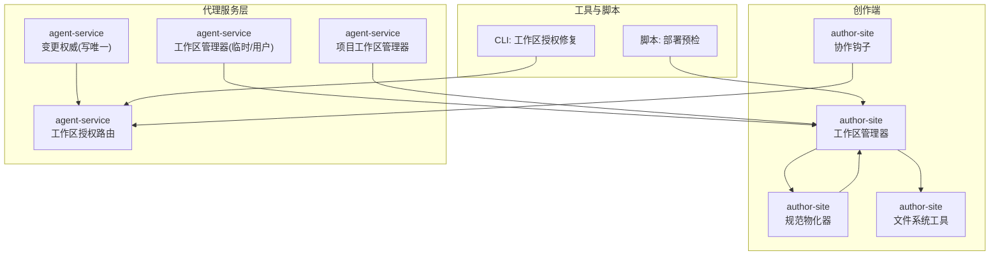
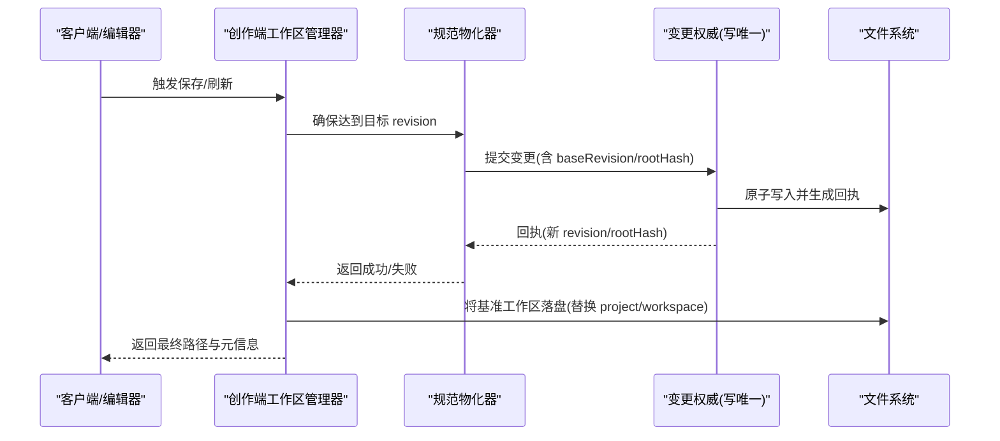
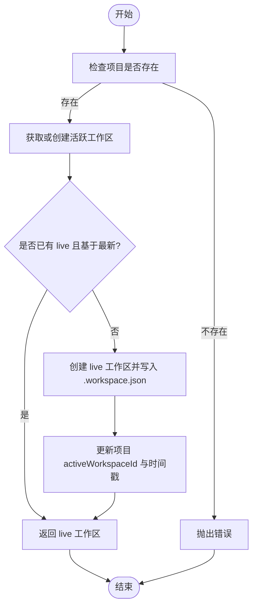
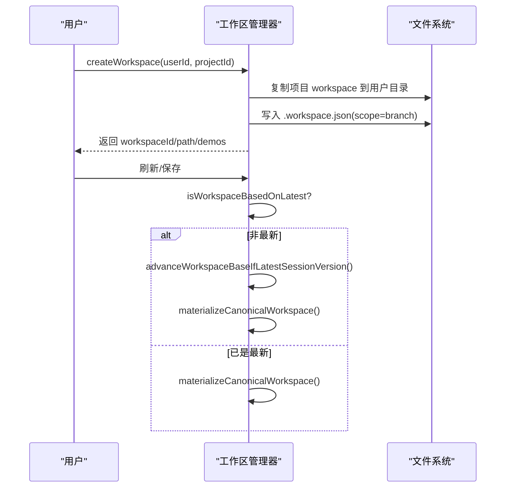
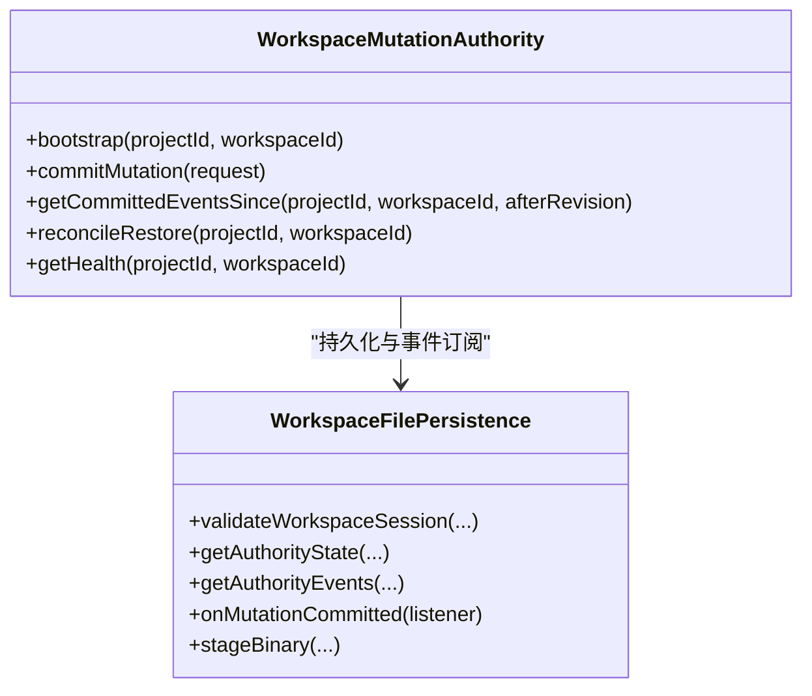
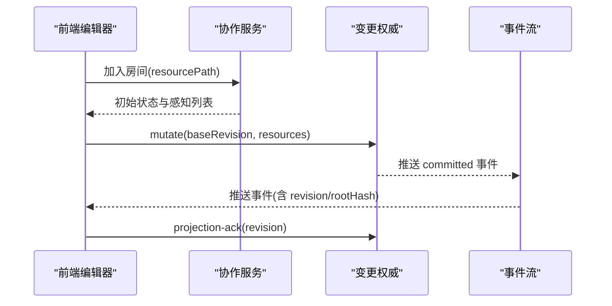
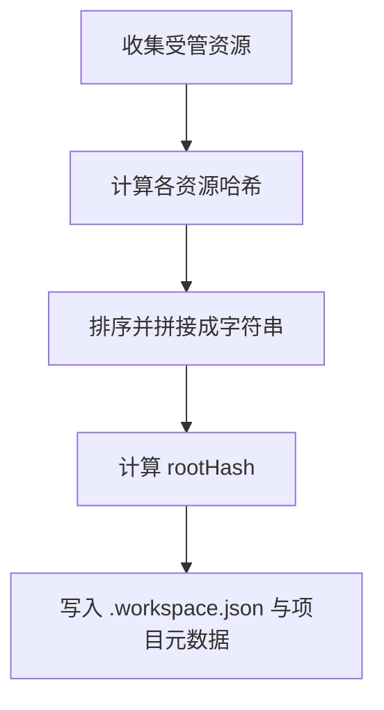
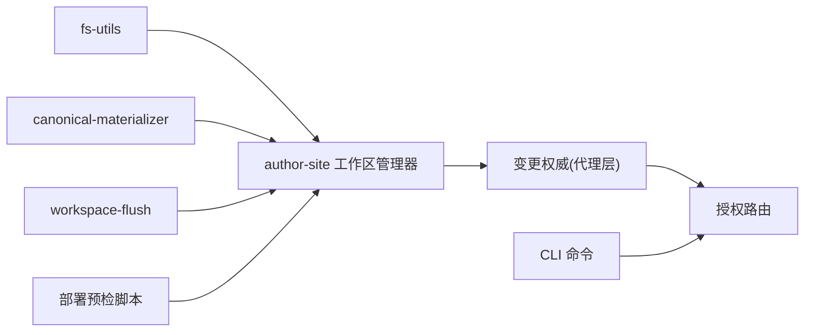

# 工作空间管理

<cite>
**本文引用的文件**   
- [packages/agent-service/src/workspace/workspace-manager.ts](file://packages/agent-service/src/workspace/workspace-manager.ts)
- [packages/agent-service/src/workspace/project-workspace-manager.ts](file://packages/agent-service/src/workspace/project-workspace-manager.ts)
- [packages/author-site/src/lib/workspace-manager.ts](file://packages/author-site/src/lib/workspace-manager.ts)
- [packages/author-site/src/lib/canonical-materializer.ts](file://packages/author-site/src/lib/canonical-materializer.ts)
- [packages/agent-service/src/workspace/workspace-mutation-authority.ts](file://packages/agent-service/src/workspace/workspace-mutation-authority.ts)
- [packages/agent-service/src/routes/workspace-authority.ts](file://packages/agent-service/src/routes/workspace-authority.ts)
- [packages/author-site/src/app/api/workspaces/[workspaceId]/route.ts](file://packages/author-site/src/app/api/workspaces/[workspaceId]/route.ts)
- [packages/author-site/src/app/api/workspace-authority/[projectId]/[workspaceId]/[...segments]/route.ts](file://packages/author-site/src/app/api/workspace-authority/[projectId]/[workspaceId]/[...segments]/route.ts)
- [packages/author-site/src/lib/fs-utils.ts](file://packages/author-site/src/lib/fs-utils.ts)
- [packages/author-site/src/lib/workspace-flush.ts](file://packages/author-site/src/lib/workspace-flush.ts)
- [packages/author-site/src/hooks/useCollabDocument.ts](file://packages/author-site/src/hooks/useCollabDocument.ts)
- [packages/agent-service/src/collab/collab-room-manager.ts](file://packages/agent-service/src/collab/collab-room-manager.ts)
- [scripts/check-workspace-deploy-preflight.mjs](file://scripts/check-workspace-deploy-preflight.mjs)
- [OPS/CLI/src/commands/workspace-authority.ts](file://OPS/CLI/src/commands/workspace-authority.ts)
- [packages/agent-service/tests/unit/workspace-mutation-authority.test.ts](file://packages/agent-service/tests/unit/workspace-mutation-authority.test.ts)
- [packages/author-site/src/lib/workspace-performance-sampling.ts](file://packages/author-site/src/lib/workspace-performance-sampling.ts)
</cite>

## 目录
1. [简介](#简介)
2. [项目结构](#项目结构)
3. [核心组件](#核心组件)
4. [架构总览](#架构总览)
5. [详细组件分析](#详细组件分析)
6. [依赖关系分析](#依赖关系分析)
7. [性能考量](#性能考量)
8. [故障排查指南](#故障排查指南)
9. [结论](#结论)
10. [附录：API 与管理操作](#附录api-与管理操作)

## 简介
本技术文档围绕“工作空间管理系统”展开，系统支持三类工作区：基准工作区、分支工作区与 Session 工作区。文档深入解释其概念、使用场景与生命周期；详述从基准到分支的创建流程、合并策略与冲突解决机制；说明状态同步（实时协作、版本锁定、并发控制）；介绍元数据管理（文件索引、依赖追踪、缓存策略）；并提供 API 使用示例、管理员操作指南（备份恢复、性能调优、问题排查）。

## 项目结构
仓库采用多包 monorepo 组织，工作空间相关能力横跨创作端（author-site）、代理服务层（agent-service）、脚手架与脚本工具等模块：
- 创作端负责工作区创建/切换、基准物化、清理孤儿工作区、协作接入与诊断采样
- 代理服务层提供工作区变更权威写入、事件流、健康检查与恢复能力
- 脚手架与脚本用于部署前校验、权限守卫检查与 CLI 运维

图表来源
- [packages/author-site/src/lib/workspace-manager.ts:1-755](file://packages/author-site/src/lib/workspace-manager.ts#L1-L755)
- [packages/author-site/src/lib/canonical-materializer.ts:1-178](file://packages/author-site/src/lib/canonical-materializer.ts#L1-L178)
- [packages/agent-service/src/workspace/workspace-manager.ts:1-144](file://packages/agent-service/src/workspace/workspace-manager.ts#L1-L144)
- [packages/agent-service/src/workspace/project-workspace-manager.ts:1-472](file://packages/agent-service/src/workspace/project-workspace-manager.ts#L1-L472)
- [packages/agent-service/src/workspace/workspace-mutation-authority.ts:1-200](file://packages/agent-service/src/workspace/workspace-mutation-authority.ts#L1-L200)
- [packages/agent-service/src/routes/workspace-authority.ts:1-278](file://packages/agent-service/src/routes/workspace-authority.ts#L1-L278)
- [scripts/check-workspace-deploy-preflight.mjs:36-78](file://scripts/check-workspace-deploy-preflight.mjs#L36-L78)
- [OPS/CLI/src/commands/workspace-authority.ts:500-581](file://OPS/CLI/src/commands/workspace-authority.ts#L500-L581)

章节来源
- [packages/author-site/src/lib/workspace-manager.ts:1-755](file://packages/author-site/src/lib/workspace-manager.ts#L1-L755)
- [packages/agent-service/src/workspace/workspace-manager.ts:1-144](file://packages/agent-service/src/workspace/workspace-manager.ts#L1-L144)
- [packages/agent-service/src/workspace/project-workspace-manager.ts:1-472](file://packages/agent-service/src/workspace/project-workspace-manager.ts#L1-L472)

## 核心组件
- 工作区类型与职责
  - 基准工作区：项目的“真实源”，由规范物化推进，作为 live 工作区的目标落盘位置
  - 分支工作区：基于最新版本的副本，供用户独立编辑，不直接影响基准
  - Session 工作区：会话级临时或 legacy 工作区，绑定特定会话，生命周期与会话一致
- 关键实现
  - 创作端工作区管理器：创建/获取/删除工作区、基准物化、孤儿清理、时间戳更新
  - 规范物化器：对高频物化请求进行批处理与去重，保证单实例串行推进
  - 代理服务层工作区管理器：临时/用户工作区生命周期管理
  - 项目工作区管理器：旧版编辑会话、快照与版本历史
  - 变更权威：唯一写入者，维护 revision/rootHash、提交回执、投影确认、恢复与健康检查
  - 授权路由：对外暴露状态、资源、事件流、变更提交、二进制暂存、健康与恢复接口

章节来源
- [packages/author-site/src/lib/workspace-manager.ts:146-181](file://packages/author-site/src/lib/workspace-manager.ts#L146-L181)
- [packages/author-site/src/lib/canonical-materializer.ts:41-122](file://packages/author-site/src/lib/canonical-materializer.ts#L41-L122)
- [packages/agent-service/src/workspace/workspace-manager.ts:13-144](file://packages/agent-service/src/workspace/workspace-manager.ts#L13-L144)
- [packages/agent-service/src/workspace/project-workspace-manager.ts:166-472](file://packages/agent-service/src/workspace/project-workspace-manager.ts#L166-L472)
- [packages/agent-service/src/workspace/workspace-mutation-authority.ts:112-200](file://packages/agent-service/src/workspace/workspace-mutation-authority.ts#L112-L200)
- [packages/agent-service/src/routes/workspace-authority.ts:61-278](file://packages/agent-service/src/routes/workspace-authority.ts#L61-L278)

## 架构总览
系统通过“创作端 + 代理服务层 + 持久化存储”的分层设计，将工作区变更的唯一写入权交给“变更权威”，并通过事件流与投影确认保障一致性。

图表来源
- [packages/author-site/src/lib/canonical-materializer.ts:41-122](file://packages/author-site/src/lib/canonical-materializer.ts#L41-L122)
- [packages/author-site/src/lib/workspace-manager.ts:336-492](file://packages/author-site/src/lib/workspace-manager.ts#L336-L492)
- [packages/agent-service/src/workspace/workspace-mutation-authority.ts:534-560](file://packages/agent-service/src/workspace/workspace-mutation-authority.ts#L534-L560)

## 详细组件分析

### 工作区类型与生命周期
- 基准工作区
  - 位于项目目录下的 workspace 目录，由“规范物化”推进，是发布与预览的最终来源
  - 通过 `syncActiveWorkspaceToCanonical` 完成原子替换与元数据更新
- 分支工作区
  - 每个用户/项目下可存在多个分支，scope=branch，status=active，baseVersion 指向最新版本
  - 通过 `createWorkspace` 复制基准内容，后续编辑不影响基准
- Session 工作区
  - 会话级临时或 legacy 工作区，绑定 sessionId，过期后自动清理
  - 旧版编辑流程仍使用此模式，新项目默认绑定 live 工作区

图表来源
- [packages/author-site/src/lib/workspace-manager.ts:240-334](file://packages/author-site/src/lib/workspace-manager.ts#L240-L334)
- [packages/author-site/src/lib/fs-utils.ts:1747-1762](file://packages/author-site/src/lib/fs-utils.ts#L1747-L1762)

章节来源
- [packages/author-site/src/lib/workspace-manager.ts:190-334](file://packages/author-site/src/lib/workspace-manager.ts#L190-L334)
- [packages/author-site/src/lib/fs-utils.ts:1747-1762](file://packages/author-site/src/lib/fs-utils.ts#L1747-L1762)

### 工作区转换流程（基准→分支）
- 创建分支工作区
  - 校验项目存在
  - 生成 workspaceId，复制项目 workspace 到用户目录
  - 写入 .workspace.json（scope=branch，baseVersion=latest）
  - 返回多页面文件集合与路径
- 切换回基准
  - 若当前分支 baseVersion 非最新，则标记为过期
  - 通过 `advanceWorkspaceBaseIfLatestSessionVersion` 提升 baseVersion 至最新
  - 再次尝试物化，如仍失败则提示刷新

图表来源
- [packages/author-site/src/lib/workspace-manager.ts:190-238](file://packages/author-site/src/lib/workspace-manager.ts#L190-L238)
- [packages/author-site/src/lib/workspace-manager.ts:162-181](file://packages/author-site/src/lib/workspace-manager.ts#L162-L181)
- [packages/author-site/src/lib/canonical-materializer.ts:135-152](file://packages/author-site/src/lib/canonical-materializer.ts#L135-L152)

章节来源
- [packages/author-site/src/lib/workspace-manager.ts:190-238](file://packages/author-site/src/lib/workspace-manager.ts#L190-L238)
- [packages/author-site/src/lib/workspace-manager.ts:162-181](file://packages/author-site/src/lib/workspace-manager.ts#L162-L181)

### 合并策略与冲突解决
- 变更权威（唯一写入者）
  - 以 revision 递增与 rootHash 校验保证幂等与一致性
  - 提交回执包含 mutationId、revision、rootHash、resources 等
  - 外部漂移检测：当文件系统内容与权威状态不一致时，拒绝写入并提示恢复
- 冲突处理
  - 客户端需携带 baseRevision 与 rootHash，服务端校验通过后才会推进
  - 若检测到 gap 或冲突，返回相应错误码，客户端应拉取最新事件并重放
- 恢复机制
  - reconcile/restore：基于最后已提交的备份恢复工作区内容
  - 缺失备份时 fail-closed，保留外部内容并报告 missingBackupCount

图表来源
- [packages/agent-service/src/workspace/workspace-mutation-authority.ts:112-200](file://packages/agent-service/src/workspace/workspace-mutation-authority.ts#L112-L200)
- [packages/agent-service/src/routes/workspace-authority.ts:61-278](file://packages/agent-service/src/routes/workspace-authority.ts#L61-L278)

章节来源
- [packages/agent-service/src/workspace/workspace-mutation-authority.ts:825-851](file://packages/agent-service/src/workspace/workspace-mutation-authority.ts#L825-L851)
- [packages/agent-service/src/workspace/workspace-mutation-authority.ts:1005-1028](file://packages/agent-service/src/workspace/workspace-mutation-authority.ts#L1005-L1028)
- [packages/agent-service/tests/unit/workspace-mutation-authority.test.ts:321-345](file://packages/agent-service/tests/unit/workspace-mutation-authority.test.ts#L321-L345)

### 状态同步机制（实时协作、版本锁定、并发控制）
- 实时协作
  - 前端通过 WebSocket 连接协作服务，按 room 维度聚合同一资源的编辑
  - 服务器侧维护房间与连接，发送同步步骤与感知状态
- 版本锁定与并发控制
  - 变更权威为每工作区维护队列与租约，串行执行提交
  - 客户端通过 projection ack 反馈应用进度，服务端记录投影确认
- 事件流
  - 提供 /events 与 /stream 接口，客户端可增量拉取并提交 ack

图表来源
- [packages/agent-service/src/collab/collab-room-manager.ts:137-157](file://packages/agent-service/src/collab/collab-room-manager.ts#L137-L157)
- [packages/agent-service/src/routes/workspace-authority.ts:124-193](file://packages/agent-service/src/routes/workspace-authority.ts#L124-L193)
- [packages/author-site/src/hooks/useCollabDocument.ts:173-211](file://packages/author-site/src/hooks/useCollabDocument.ts#L173-L211)

章节来源
- [packages/agent-service/src/collab/collab-room-manager.ts:489-517](file://packages/agent-service/src/collab/collab-room-manager.ts#L489-L517)
- [packages/agent-service/src/routes/workspace-authority.ts:215-278](file://packages/agent-service/src/routes/workspace-authority.ts#L215-L278)

### 工作区元数据管理（文件索引、依赖追踪、缓存策略）
- 文件索引
  - 通过遍历工作区计算受管资源哈希，构建 resourceHashes 与 rootHash
  - 根哈希对所有资源排序后拼接，保证顺序无关性
- 依赖追踪
  - 工作区 manifest 记录 projectId、baseVersion、workspaceId、workspaceRevision、workspaceRootHash 等
- 缓存策略
  - 规范物化器对同 tick 内多次物化请求进行合并，仅推进到最新 revision
  - 发布前预检脚本扫描 live 工作区并统计 JSON 数量，辅助定位异常

图表来源
- [packages/agent-service/src/workspace/workspace-mutation-authority.ts:825-851](file://packages/agent-service/src/workspace/workspace-mutation-authority.ts#L825-L851)
- [packages/author-site/src/lib/workspace-manager.ts:436-492](file://packages/author-site/src/lib/workspace-manager.ts#L436-L492)
- [scripts/check-workspace-deploy-preflight.mjs:36-78](file://scripts/check-workspace-deploy-preflight.mjs#L36-L78)

章节来源
- [packages/author-site/src/lib/workspace-manager.ts:436-492](file://packages/author-site/src/lib/workspace-manager.ts#L436-L492)
- [scripts/check-workspace-deploy-preflight.mjs:36-78](file://scripts/check-workspace-deploy-preflight.mjs#L36-L78)

## 依赖关系分析
- 创作端依赖
  - fs-utils：工作区路径解析、元数据读写、多页面文件读取
  - canonical-materializer：批量物化与去重
  - workspace-flush：在关键动作前刷新并同步基准
- 代理服务层依赖
  - workspace-mutation-authority：唯一写入、事件与恢复
  - routes/workspace-authority：HTTP/WebSocket 暴露能力
- 工具链依赖
  - 部署预检：扫描 live 工作区与 JSON 计数
  - CLI：健康检查与 reconcile restore 操作

图表来源
- [packages/author-site/src/lib/fs-utils.ts:1713-1762](file://packages/author-site/src/lib/fs-utils.ts#L1713-L1762)
- [packages/author-site/src/lib/canonical-materializer.ts:1-178](file://packages/author-site/src/lib/canonical-materializer.ts#L1-L178)
- [packages/author-site/src/lib/workspace-flush.ts:229-287](file://packages/author-site/src/lib/workspace-flush.ts#L229-L287)
- [packages/agent-service/src/workspace/workspace-mutation-authority.ts:112-200](file://packages/agent-service/src/workspace/workspace-mutation-authority.ts#L112-L200)
- [packages/agent-service/src/routes/workspace-authority.ts:61-278](file://packages/agent-service/src/routes/workspace-authority.ts#L61-L278)
- [scripts/check-workspace-deploy-preflight.mjs:36-78](file://scripts/check-workspace-deploy-preflight.mjs#L36-L78)
- [OPS/CLI/src/commands/workspace-authority.ts:500-581](file://OPS/CLI/src/commands/workspace-authority.ts#L500-L581)

章节来源
- [packages/author-site/src/lib/workspace-flush.ts:229-287](file://packages/author-site/src/lib/workspace-flush.ts#L229-L287)
- [packages/agent-service/src/routes/workspace-authority.ts:61-278](file://packages/agent-service/src/routes/workspace-authority.ts#L61-L278)

## 性能考量
- 批处理与背压
  - 规范物化器在同一 tick 内合并请求，只推进到最新 revision，避免重复 IO
- 指标采样与 SLO
  - 采集 autosave-debounce、queue-wait、commit-latency、remote-update-latency、draft-preview-latency、projection-latency、reconnect-convergence、canonical-lag 等指标
  - 环形缓冲区固定容量，内存中计算 p50/p95/p99，并与 SLO 目标对比
- 建议
  - 合理设置 debounce 与队列大小，避免高并发下积压
  - 监控 externalDrift 与 missingBackupCount，及时恢复

章节来源
- [packages/author-site/src/lib/canonical-materializer.ts:41-122](file://packages/author-site/src/lib/canonical-materializer.ts#L41-L122)
- [packages/author-site/src/lib/workspace-performance-sampling.ts:176-279](file://packages/author-site/src/lib/workspace-performance-sampling.ts#L176-L279)

## 故障排查指南
- 常见问题
  - 工作区过期：提示 WORKSPACE_STALE，需刷新项目或重新获取活跃工作区
  - 工作区未找到：WORKSPACE_NOT_FOUND，检查路径与元数据
  - 权威不可用：503，检查服务健康与网络连通
  - 备份缺失：WORKSPACE_AUTHORITY_BACKUP_MISSING，禁止覆盖外部内容，先补齐备份
- 诊断手段
  - 查看工作区健康状态与队列深度
  - 拉取最近事件与投影确认，定位 gap 与延迟
  - 使用 CLI 执行 dry-run 与实际恢复

章节来源
- [packages/author-site/src/lib/workspace-manager.ts:336-492](file://packages/author-site/src/lib/workspace-manager.ts#L336-L492)
- [packages/agent-service/src/routes/workspace-authority.ts:205-213](file://packages/agent-service/src/routes/workspace-authority.ts#L205-L213)
- [OPS/CLI/src/commands/workspace-authority.ts:500-581](file://OPS/CLI/src/commands/workspace-authority.ts#L500-L581)
- [packages/agent-service/tests/unit/workspace-mutation-authority.test.ts:321-345](file://packages/agent-service/tests/unit/workspace-mutation-authority.test.ts#L321-L345)

## 结论
本系统通过“变更权威 + 事件流 + 投影确认”的设计，实现了高可靠的工作区状态同步与并发控制；借助“规范物化器”的批处理与去重，提升了基准推进的性能与稳定性。配合完善的健康检查、恢复机制与性能采样，可在复杂协作场景下保持数据一致性与用户体验。

## 附录：API 与管理操作

### API 概览（工作区授权）
- 状态查询
  - GET /api/workspace-authority/projects/:projectId/workspaces/:workspaceId/state?sessionId=...
- 资源读取
  - GET /api/workspace-authority/projects/:projectId/workspaces/:workspaceId/resources/*?sessionId=...
- 事件拉取
  - GET /api/workspace-authority/projects/:projectId/workspaces/:workspaceId/events?sessionId=...&afterRevision=...
- 投影确认
  - GET /api/workspace-authority/projects/:projectId/workspaces/:workspaceId/projection-acks?sessionId=...&afterRevision=...
- 事件流
  - WS /api/workspace-authority/projects/:projectId/workspaces/:workspaceId/stream?sessionId=...&afterRevision=...
- 变更提交
  - POST /api/workspace-authority/projects/:projectId/workspaces/:workspaceId/mutate
- 二进制暂存
  - POST /api/workspace-authority/projects/:projectId/workspaces/:workspaceId/staging?sessionId=...
- 健康检查
  - GET /api/workspace-authority/projects/:projectId/workspaces/:workspaceId/health?sessionId=...
- 恢复与采纳
  - POST /api/workspace-authority/projects/:projectId/workspaces/:workspaceId/reconcile/adopt?sessionId=...
  - POST /api/workspace-authority/projects/:projectId/workspaces/:workspaceId/reconcile/restore?sessionId=...

章节来源
- [packages/agent-service/src/routes/workspace-authority.ts:61-278](file://packages/agent-service/src/routes/workspace-authority.ts#L61-L278)

### 管理员操作指南
- 健康检查与恢复
  - 使用 CLI 检查工作区授权健康状态，dry-run 评估是否需要恢复
  - 加 --apply 执行 reconcile restore，基于最后已提交备份恢复工作区
- 部署前预检
  - 扫描 data/workspaces 下 live 工作区，统计 JSON 数量，辅助发现异常
- 性能调优
  - 调整 debounce 与队列大小，关注 queue-wait 与 commit-latency
  - 监控 projection-latency 与 reconnect-convergence，优化协作体验

章节来源
- [OPS/CLI/src/commands/workspace-authority.ts:500-581](file://OPS/CLI/src/commands/workspace-authority.ts#L500-L581)
- [scripts/check-workspace-deploy-preflight.mjs:36-78](file://scripts/check-workspace-deploy-preflight.mjs#L36-L78)
- [packages/author-site/src/lib/workspace-performance-sampling.ts:176-279](file://packages/author-site/src/lib/workspace-performance-sampling.ts#L176-L279)