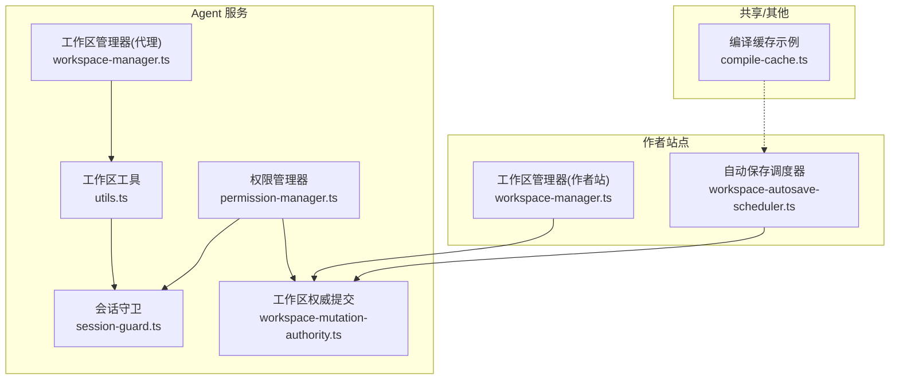
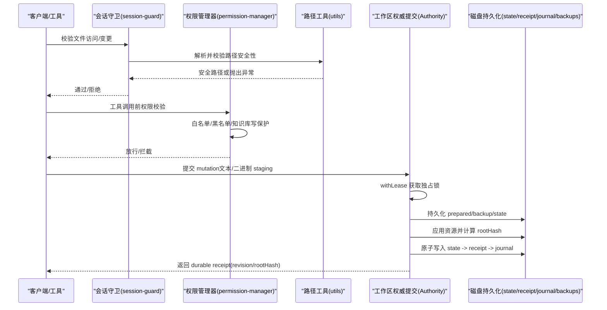
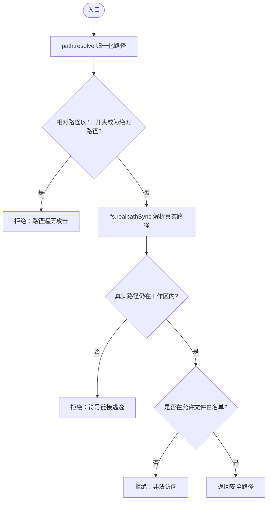
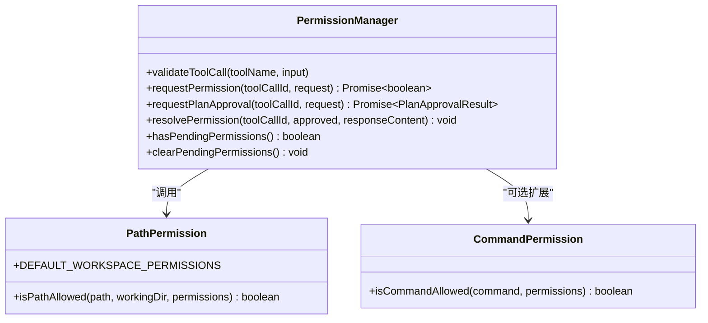
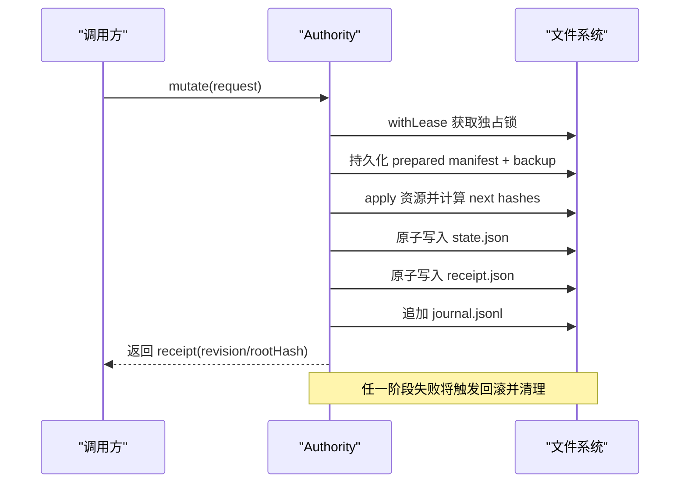
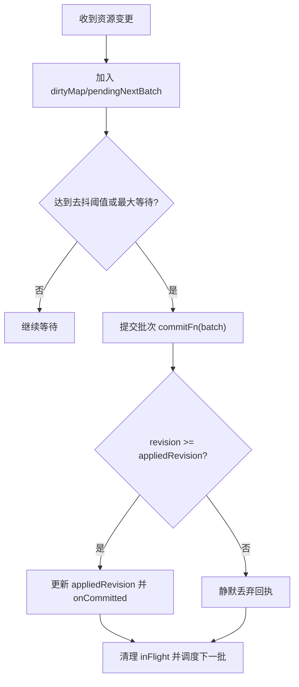
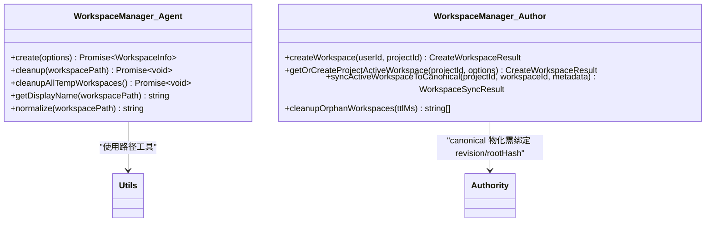
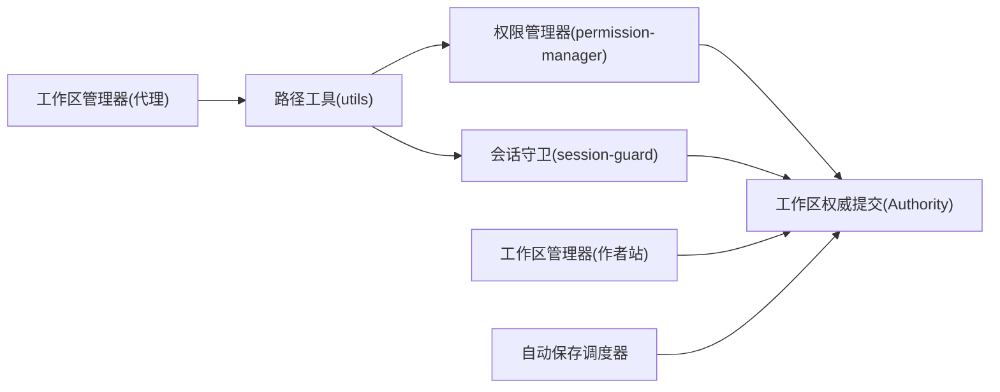

# 文件操作抽象层

<cite>
**本文引用的文件**   
- [packages/agent-service/src/workspace/utils.ts](file://packages/agent-service/src/workspace/utils.ts)
- [packages/agent-service/src/session/session-guard.ts](file://packages/agent-service/src/session/session-guard.ts)
- [packages/agent-service/src/backends/managers/permission-manager.ts](file://packages/agent-service/src/backends/managers/permission-manager.ts)
- [packages/agent-service/src/workspace/workspace-mutation-authority.ts](file://packages/agent-service/src/workspace/workspace-mutation-authority.ts)
- [packages/author-site/src/lib/workspace-manager.ts](file://packages/author-site/src/lib/workspace-manager.ts)
- [packages/agent-service/src/workspace/workspace-manager.ts](file://packages/agent-service/src/workspace/workspace-manager.ts)
- [packages/agent-service/tests/unit/session-guard.test.ts](file://packages/agent-service/tests/unit/session-guard.test.ts)
- [packages/agent-service/tests/unit/permissions.test.ts](file://packages/agent-service/tests/unit/permissions.test.ts)
- [packages/agent-service/tests/unit/permission-manager.test.ts](file://packages/agent-service/tests/unit/permission-manager.test.ts)
- [packages/screenshot-service/src/utils/compile-cache.ts](file://packages/screenshot-service/src/utils/compile-cache.ts)
- [packages/author-site/src/lib/workspace-autosave-scheduler.ts](file://packages/author-site/src/lib/workspace-autosave-scheduler.ts)
- [docs/plans/进行中/创作端Workspace写入一致性-单写者事务改造方案.md](file://docs/plans/进行中/创作端Workspace写入一致性-单写者事务改造方案.md)
</cite>

## 目录
1. [简介](#简介)
2. [项目结构](#项目结构)
3. [核心组件](#核心组件)
4. [架构总览](#架构总览)
5. [详细组件分析](#详细组件分析)
6. [依赖关系分析](#依赖关系分析)
7. [性能考量](#性能考量)
8. [故障排查指南](#故障排查指南)
9. [结论](#结论)
10. [附录：API 参考](#附录api-参考)

## 简介
本技术文档围绕“文件操作抽象层”展开，聚焦以下目标：
- 路径规范化机制：跨平台路径处理、特殊字符过滤与安全路径验证。
- 权限验证系统：文件访问控制、目录遍历防护与操作权限检查。
- 并发控制机制：文件锁管理、事务处理与一致性保证。
- 文件系统优化策略：批量操作、缓存机制与异步处理。
- 文件操作 API 参考：CRUD 操作、批量处理与错误处理模式。
- 性能优化建议与常见问题解决方案。

该抽象层在 agent-service 与 author-site 之间提供统一的安全、可审计、可回滚的文件操作能力，并通过 Workspace Authority 实现单写者串行提交、幂等回执与外部漂移 fail-closed 的一致性保障。

## 项目结构
文件操作抽象层涉及的关键模块与职责如下：
- 路径工具与校验：utils.ts、session-guard.ts
- 权限管理器：permission-manager.ts（含白名单/黑名单、知识库写保护）
- 工作区生命周期：agent-service workspace-manager.ts、author-site workspace-manager.ts
- 工作区权威提交：workspace-mutation-authority.ts（lease、prepared、receipt、journal、backups）
- 自动保存调度：workspace-autosave-scheduler.ts（批量化、单调 ack）
- 缓存示例：compile-cache.ts（LRU 缓存，用于说明缓存模式）

图表来源
- [packages/agent-service/src/workspace/utils.ts:1-77](file://packages/agent-service/src/workspace/utils.ts#L1-L77)
- [packages/agent-service/src/session/session-guard.ts:1-134](file://packages/agent-service/src/session/session-guard.ts#L1-L134)
- [packages/agent-service/src/backends/managers/permission-manager.ts:1-200](file://packages/agent-service/src/backends/managers/permission-manager.ts#L1-L200)
- [packages/agent-service/src/workspace/workspace-mutation-authority.ts:910-961](file://packages/agent-service/src/workspace/workspace-mutation-authority.ts#L910-L961)
- [packages/agent-service/src/workspace/workspace-manager.ts:1-144](file://packages/agent-service/src/workspace/workspace-manager.ts#L1-L144)
- [packages/author-site/src/lib/workspace-manager.ts:1-755](file://packages/author-site/src/lib/workspace-manager.ts#L1-L755)
- [packages/author-site/src/lib/workspace-autosave-scheduler.ts:214-250](file://packages/author-site/src/lib/workspace-autosave-scheduler.ts#L214-L250)
- [packages/screenshot-service/src/utils/compile-cache.ts:1-69](file://packages/screenshot-service/src/utils/compile-cache.ts#L1-L69)

章节来源
- [packages/agent-service/src/workspace/utils.ts:1-77](file://packages/agent-service/src/workspace/utils.ts#L1-L77)
- [packages/agent-service/src/session/session-guard.ts:1-134](file://packages/agent-service/src/session/session-guard.ts#L1-L134)
- [packages/agent-service/src/backends/managers/permission-manager.ts:1-200](file://packages/agent-service/src/backends/managers/permission-manager.ts#L1-L200)
- [packages/agent-service/src/workspace/workspace-mutation-authority.ts:910-961](file://packages/agent-service/src/workspace/workspace-mutation-authority.ts#L910-L961)
- [packages/agent-service/src/workspace/workspace-manager.ts:1-144](file://packages/agent-service/src/workspace/workspace-manager.ts#L1-L144)
- [packages/author-site/src/lib/workspace-manager.ts:1-755](file://packages/author-site/src/lib/workspace-manager.ts#L1-L755)
- [packages/author-site/src/lib/workspace-autosave-scheduler.ts:214-250](file://packages/author-site/src/lib/workspace-autosave-scheduler.ts#L214-L250)
- [packages/screenshot-service/src/utils/compile-cache.ts:1-69](file://packages/screenshot-service/src/utils/compile-cache.ts#L1-L69)

## 核心组件
- 路径工具与校验
  - 跨平台路径解析与归一化、相对路径安全判定、工作空间内路径强制约束。
  - 符号链接与绝对路径越界检测，防止路径遍历攻击。
- 会话守卫
  - 对文件访问进行白名单限制与路径合法性校验，支持批量变更校验。
- 权限管理器
  - 工具调用级路径权限校验（读/写/列目录），知识库写保护，计划审批与删除确认的异步等待。
- 工作区权威提交（Authority）
  - 每工作区串行提交、持久化 lease、prepared manifest、state/receipt/journal、committed backups、二进制 staging、启动恢复屏障。
- 工作区管理器
  - 临时工作区创建/清理、用户工作区校验、显示名生成、临时目录管理。
- 自动保存调度器
  - 批量合并、去抖与最大等待、单调 revision ack、失败重试与队列推进。
- 缓存示例
  - LRU 内存缓存，按内容哈希键控，容量上限与淘汰策略。

章节来源
- [packages/agent-service/src/workspace/utils.ts:1-77](file://packages/agent-service/src/workspace/utils.ts#L1-L77)
- [packages/agent-service/src/session/session-guard.ts:1-134](file://packages/agent-service/src/session/session-guard.ts#L1-L134)
- [packages/agent-service/src/backends/managers/permission-manager.ts:1-200](file://packages/agent-service/src/backends/managers/permission-manager.ts#L1-L200)
- [packages/agent-service/src/workspace/workspace-mutation-authority.ts:534-560](file://packages/agent-service/src/workspace/workspace-mutation-authority.ts#L534-L560)
- [packages/agent-service/src/workspace/workspace-manager.ts:1-144](file://packages/agent-service/src/workspace/workspace-manager.ts#L1-L144)
- [packages/author-site/src/lib/workspace-autosave-scheduler.ts:214-250](file://packages/author-site/src/lib/workspace-autosave-scheduler.ts#L214-L250)
- [packages/screenshot-service/src/utils/compile-cache.ts:1-69](file://packages/screenshot-service/src/utils/compile-cache.ts#L1-L69)

## 架构总览
下图展示了从请求进入、路径与权限校验、到 Authority 串行提交与回执返回的整体流程。

图表来源
- [packages/agent-service/src/session/session-guard.ts:76-133](file://packages/agent-service/src/session/session-guard.ts#L76-L133)
- [packages/agent-service/src/workspace/utils.ts:59-76](file://packages/agent-service/src/workspace/utils.ts#L59-L76)
- [packages/agent-service/src/backends/managers/permission-manager.ts:54-78](file://packages/agent-service/src/backends/managers/permission-manager.ts#L54-L78)
- [packages/agent-service/src/workspace/workspace-mutation-authority.ts:920-944](file://packages/agent-service/src/workspace/workspace-mutation-authority.ts#L920-L944)
- [packages/agent-service/src/workspace/workspace-mutation-authority.ts:534-560](file://packages/agent-service/src/workspace/workspace-mutation-authority.ts#L534-L560)

## 详细组件分析

### 路径规范化与安全校验
- 跨平台路径处理
  - 使用 path.resolve 进行绝对化与分隔符归一化；isPathInsideWorkspace 基于相对路径判断是否越界。
- 特殊字符与符号链接防护
  - resolveWorkspacePath 在解析后再次校验相对路径不以 ".." 开头且非绝对路径；validatePath 进一步通过 fs.realpathSync 解析真实路径，防范符号链接逃逸。
- 白名单与受限访问
  - session-guard 对允许访问的文件集合进行白名单匹配，未命中则拒绝。

图表来源
- [packages/agent-service/src/workspace/utils.ts:59-76](file://packages/agent-service/src/workspace/utils.ts#L59-L76)
- [packages/agent-service/src/session/session-guard.ts:76-133](file://packages/agent-service/src/session/session-guard.ts#L76-L133)

章节来源
- [packages/agent-service/src/workspace/utils.ts:1-77](file://packages/agent-service/src/workspace/utils.ts#L1-L77)
- [packages/agent-service/src/session/session-guard.ts:1-134](file://packages/agent-service/src/session/session-guard.ts#L1-L134)
- [packages/agent-service/tests/unit/session-guard.test.ts:1-39](file://packages/agent-service/tests/unit/session-guard.test.ts#L1-L39)

### 权限验证系统
- 工具调用级路径权限
  - readFile/readFileWithLines/writeFile/editFile/listFiles 等工具在调用前由 PermissionManager.validateToolCall 进行路径校验。
- 白名单/黑名单与通配
  - isPathAllowed 支持 allowedPaths 与 deniedPatterns，黑名单优先于白名单；支持 * 单层段通配与 ** 通配。
- 知识库写保护
  - writeFile/editFile 若目标位于 knowledge/ 下将被拒绝，确保知识库只读。
- 命令执行白名单
  - isCommandAllowed 仅允许白名单内的命令，拒绝 rm/mv/cp/mkdir/sudo/chmod/chown/npm/npx/node -e 等危险命令。

图表来源
- [packages/agent-service/src/backends/managers/permission-manager.ts:1-200](file://packages/agent-service/src/backends/managers/permission-manager.ts#L1-L200)
- [packages/agent-service/tests/unit/permissions.test.ts:34-141](file://packages/agent-service/tests/unit/permissions.test.ts#L34-L141)
- [packages/agent-service/tests/unit/permission-manager.test.ts:1-42](file://packages/agent-service/tests/unit/permission-manager.test.ts#L1-L42)

章节来源
- [packages/agent-service/src/backends/managers/permission-manager.ts:1-200](file://packages/agent-service/src/backends/managers/permission-manager.ts#L1-L200)
- [packages/agent-service/tests/unit/permissions.test.ts:34-141](file://packages/agent-service/tests/unit/permissions.test.ts#L34-L141)
- [packages/agent-service/tests/unit/permission-manager.test.ts:1-42](file://packages/agent-service/tests/unit/permission-manager.test.ts#L1-L42)

### 并发控制与一致性保证
- 工作区独占锁（Lease）
  - withLease 使用原子写文件 flag=wx 获取独占锁，失败返回 WORKSPACE_WRITE_LEASE_UNAVAILABLE；finally 中释放锁，异常时保持 fail-closed。
- 串行提交与幂等回执
  - 每个 mutation 维护 baseRevision，成功后递增 revision 并计算 rootHash；state 先于 receipt 持久化，避免崩溃暴露不一致状态。
- Prepared 事务与回滚
  - prepare 阶段持久化 before 快照与 previousState；apply 失败时回滚至备份，保证“全成功或全失败”。
- 启动恢复屏障
  - 启动时扫描 prepared/reconcile 状态，无 receipt 的 prepared 回滚到 backup；已提交的 prepared 仅清理残留。

图表来源
- [packages/agent-service/src/workspace/workspace-mutation-authority.ts:920-944](file://packages/agent-service/src/workspace/workspace-mutation-authority.ts#L920-L944)
- [packages/agent-service/src/workspace/workspace-mutation-authority.ts:534-560](file://packages/agent-service/src/workspace/workspace-mutation-authority.ts#L534-L560)

章节来源
- [packages/agent-service/src/workspace/workspace-mutation-authority.ts:910-961](file://packages/agent-service/src/workspace/workspace-mutation-authority.ts#L910-L961)
- [packages/agent-service/src/workspace/workspace-mutation-authority.ts:534-560](file://packages/agent-service/src/workspace/workspace-mutation-authority.ts#L534-L560)
- [docs/plans/进行中/创作端Workspace写入一致性-单写者事务改造方案.md:763-861](file://docs/plans/进行中/创作端Workspace写入一致性-单写者事务改造方案.md#L763-L861)

### 文件系统优化策略
- 批量操作
  - autosave scheduler 将 dirty 资源合并为一批提交，减少频繁 I/O 与网络往返。
- 缓存机制
  - compile-cache 展示 LRU 缓存模式：按内容哈希键控、容量上限、淘汰最旧项；可用于构建产物或中间结果缓存。
- 异步处理
  - autosave 使用 in-flight 标志与 pendingNextBatch 缓冲，确保下一批继续调度；revision 单调 ack 避免乱序覆盖。

图表来源
- [packages/author-site/src/lib/workspace-autosave-scheduler.ts:214-250](file://packages/author-site/src/lib/workspace-autosave-scheduler.ts#L214-L250)
- [packages/screenshot-service/src/utils/compile-cache.ts:1-69](file://packages/screenshot-service/src/utils/compile-cache.ts#L1-L69)

章节来源
- [packages/author-site/src/lib/workspace-autosave-scheduler.ts:214-250](file://packages/author-site/src/lib/workspace-autosave-scheduler.ts#L214-L250)
- [packages/screenshot-service/src/utils/compile-cache.ts:1-69](file://packages/screenshot-service/src/utils/compile-cache.ts#L1-L69)

### 工作区生命周期管理
- 临时工作区
  - 在系统临时目录下创建命名唯一的工作区，支持清理全部临时工作区。
- 用户工作区
  - 不自动创建空目录，避免误判为空工作区；提供显示名生成与路径归一化。
- 作者站点工作区
  - 创建 live/branch 工作区、同步 canonical、清理孤儿工作区、版本恢复与时间戳更新。

图表来源
- [packages/agent-service/src/workspace/workspace-manager.ts:1-144](file://packages/agent-service/src/workspace/workspace-manager.ts#L1-L144)
- [packages/author-site/src/lib/workspace-manager.ts:1-755](file://packages/author-site/src/lib/workspace-manager.ts#L1-L755)

章节来源
- [packages/agent-service/src/workspace/workspace-manager.ts:1-144](file://packages/agent-service/src/workspace/workspace-manager.ts#L1-L144)
- [packages/author-site/src/lib/workspace-manager.ts:1-755](file://packages/author-site/src/lib/workspace-manager.ts#L1-L755)

## 依赖关系分析
- 低耦合高内聚
  - 路径工具独立于业务逻辑，被守卫与权限管理器复用。
  - 权限管理器与工具调用解耦，通过配置驱动白名单/黑名单。
  - Authority 作为单一写入口，所有写操作必须经过其串行化与持久化。
- 外部依赖
  - Node.js fs/path/os 标准库；JSONL 日志与 JSON 元数据持久化。
- 潜在循环依赖
  - 当前未发现直接循环导入；各模块通过接口与类型契约协作。

图表来源
- [packages/agent-service/src/workspace/utils.ts:1-77](file://packages/agent-service/src/workspace/utils.ts#L1-L77)
- [packages/agent-service/src/session/session-guard.ts:1-134](file://packages/agent-service/src/session/session-guard.ts#L1-L134)
- [packages/agent-service/src/backends/managers/permission-manager.ts:1-200](file://packages/agent-service/src/backends/managers/permission-manager.ts#L1-L200)
- [packages/agent-service/src/workspace/workspace-mutation-authority.ts:910-961](file://packages/agent-service/src/workspace/workspace-mutation-authority.ts#L910-L961)
- [packages/agent-service/src/workspace/workspace-manager.ts:1-144](file://packages/agent-service/src/workspace/workspace-manager.ts#L1-L144)
- [packages/author-site/src/lib/workspace-manager.ts:1-755](file://packages/author-site/src/lib/workspace-manager.ts#L1-L755)
- [packages/author-site/src/lib/workspace-autosave-scheduler.ts:214-250](file://packages/author-site/src/lib/workspace-autosave-scheduler.ts#L214-L250)

章节来源
- [packages/agent-service/src/workspace/utils.ts:1-77](file://packages/agent-service/src/workspace/utils.ts#L1-L77)
- [packages/agent-service/src/session/session-guard.ts:1-134](file://packages/agent-service/src/session/session-guard.ts#L1-L134)
- [packages/agent-service/src/backends/managers/permission-manager.ts:1-200](file://packages/agent-service/src/backends/managers/permission-manager.ts#L1-L200)
- [packages/agent-service/src/workspace/workspace-mutation-authority.ts:910-961](file://packages/agent-service/src/workspace/workspace-mutation-authority.ts#L910-L961)
- [packages/agent-service/src/workspace/workspace-manager.ts:1-144](file://packages/agent-service/src/workspace/workspace-manager.ts#L1-L144)
- [packages/author-site/src/lib/workspace-manager.ts:1-755](file://packages/author-site/src/lib/workspace-manager.ts#L1-L755)
- [packages/author-site/src/lib/workspace-autosave-scheduler.ts:214-250](file://packages/author-site/src/lib/workspace-autosave-scheduler.ts#L214-L250)

## 性能考量
- 批量化与去抖
  - autosave 将多次变更合并为一次提交，降低 I/O 与网络开销；设置最大等待时间避免长时间延迟。
- 单调 ack 与乱序丢弃
  - 只接受 >= 已应用 revision 的回执，避免旧回执覆盖新状态。
- 原子写入与最小化落盘
  - state 先于 receipt 持久化，减少崩溃窗口；binary staging 分离大对象，减小 JSON 体积。
- 缓存
  - 编译产物或中间结果采用 LRU 缓存，提升重复读取性能。
- 并发与背压
  - Lease 保证同一工作区串行提交；队列深度与冲突计数纳入健康检查，便于监控与扩容。

[本节为通用指导，无需特定文件引用]

## 故障排查指南
- 常见错误码与原因
  - WORKSPACE_WRITE_LEASE_UNAVAILABLE：工作区正被其他进程写入，稍后重试。
  - WORKSPACE_EXTERNAL_DRIFT：检测到旁路修改，fail-closed；需显式 reconcile adopt。
  - WORKSPACE_RESOURCE_CONFLICT：目标资源 hash 不匹配，需刷新或解决冲突。
  - WORKSPACE_STALE：工作区过期或未绑定 canonical proof，需刷新或重新同步。
- 诊断与恢复
  - 查看 journal.jsonl 与 receipts 目录，定位 mutation 生命周期事件。
  - 启动恢复屏障会清理 prepared 残留并回滚未提交变更。
  - 使用 health/status 接口输出 queueDepth、conflictCount、recoveryPendingCount 等指标。

章节来源
- [packages/agent-service/src/workspace/workspace-mutation-authority.ts:910-961](file://packages/agent-service/src/workspace/workspace-mutation-authority.ts#L910-L961)
- [docs/plans/进行中/创作端Workspace写入一致性-单写者事务改造方案.md:763-861](file://docs/plans/进行中/创作端Workspace写入一致性-单写者事务改造方案.md#L763-L861)

## 结论
文件操作抽象层通过严格的路径校验、细粒度权限控制、串行化事务与持久化证明，实现了安全、一致、可审计的文件写入能力。结合批量提交、缓存与异步调度，系统在可用性与性能间取得平衡。后续可进一步完善后台 coalesce materializer、跨实例 fencing token lease 与端到端验收。

[本节为总结性内容，无需特定文件引用]

## 附录：API 参考
- 路径与校验
  - normalizeWorkspacePath(workspacePath): string
  - isPathInsideWorkspace(targetPath, workspacePath): boolean
  - resolveWorkspacePath(basePath, relativePath): string
  - validatePath(workingDir, targetPath): FileValidationResult
  - safeResolvePath(workingDir, relativePath): string
- 权限与工具
  - PermissionManager.validateToolCall(toolName, input): { block, reason } | undefined
  - PermissionManager.requestPermission(toolCallId, request): Promise<boolean>
  - PermissionManager.requestPlanApproval(toolCallId, request): Promise<PlanApprovalResult>
- 工作区管理
  - WorkspaceManager.create(options): Promise<WorkspaceInfo>
  - WorkspaceManager.cleanup(workspacePath): Promise<void>
  - WorkspaceManager.cleanupAllTempWorkspaces(): Promise<void>
  - getOrCreateProjectActiveWorkspace(projectId, options): CreateWorkspaceResult
  - syncActiveWorkspaceToCanonical(projectId, workspaceId, metadata): WorkspaceSyncResult
- 权威提交
  - mutate(request): Promise<Receipt>
  - withLease(workspaceId, work): Promise<T>
  - getHealth(): HealthStatus

章节来源
- [packages/agent-service/src/workspace/utils.ts:1-77](file://packages/agent-service/src/workspace/utils.ts#L1-L77)
- [packages/agent-service/src/session/session-guard.ts:1-134](file://packages/agent-service/src/session/session-guard.ts#L1-L134)
- [packages/agent-service/src/backends/managers/permission-manager.ts:1-200](file://packages/agent-service/src/backends/managers/permission-manager.ts#L1-L200)
- [packages/agent-service/src/workspace/workspace-manager.ts:1-144](file://packages/agent-service/src/workspace/workspace-manager.ts#L1-L144)
- [packages/author-site/src/lib/workspace-manager.ts:1-755](file://packages/author-site/src/lib/workspace-manager.ts#L1-L755)
- [packages/agent-service/src/workspace/workspace-mutation-authority.ts:534-560](file://packages/agent-service/src/workspace/workspace-mutation-authority.ts#L534-L560)