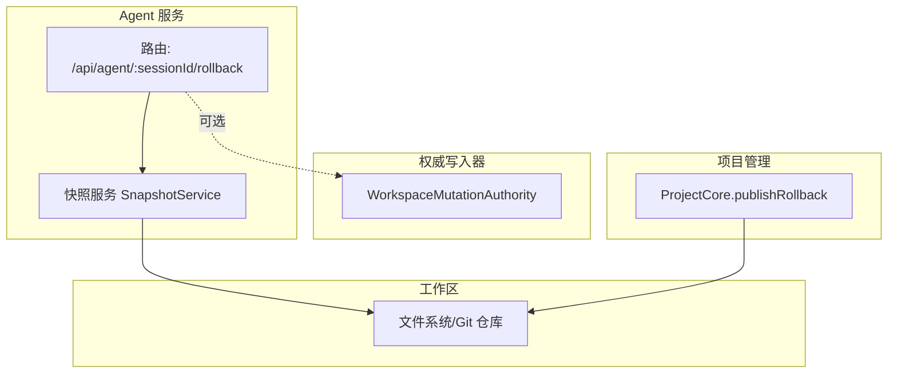
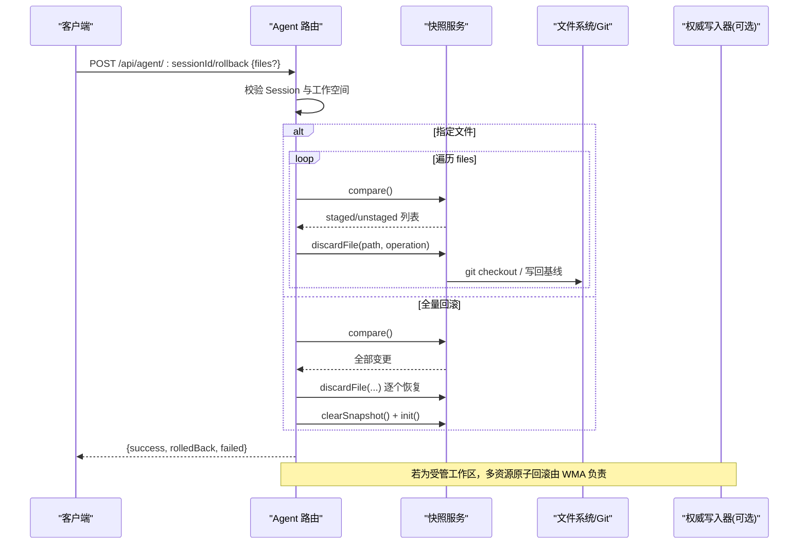
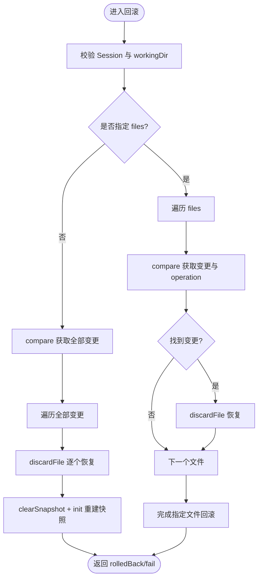
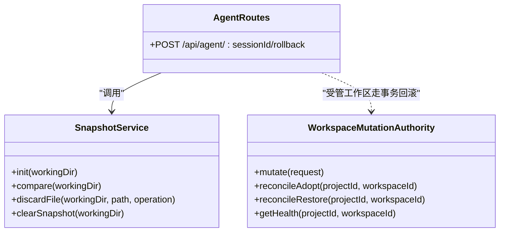
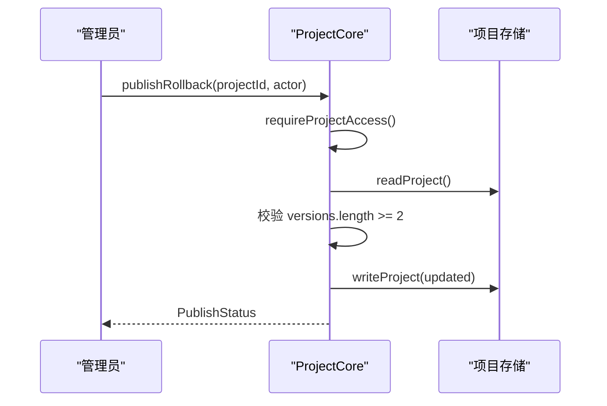
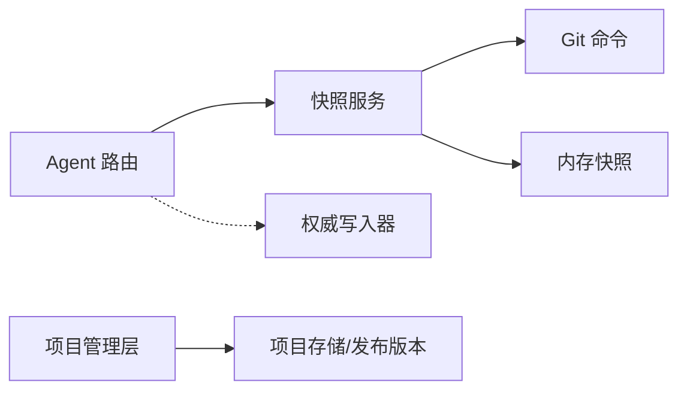

# 回滚机制

<cite>
**本文引用的文件**   
- [packages/agent-service/src/routes/agent.ts](file://packages/agent-service/src/routes/agent.ts)
- [packages/agent-service/src/session/snapshot-service.ts](file://packages/agent-service/src/session/snapshot-service.ts)
- [packages/agent-service/src/workspace/workspace-mutation-authority.ts](file://packages/agent-service/src/workspace/workspace-mutation-authority.ts)
- [docs/项目文档/独立Agent服务层/02-接口规范.md](file://docs/项目文档/独立Agent服务层/02-接口规范.md)
- [test/创作端E2E回归测试/workspace-mutation-authority.spec.ts](file://test/创作端E2E回归测试/workspace-mutation-authority.spec.ts)
- [packages/project-core/src/service.ts](file://packages/project-core/src/service.ts)
</cite>

## 目录
1. [简介](#简介)
2. [项目结构](#项目结构)
3. [核心组件](#核心组件)
4. [架构总览](#架构总览)
5. [详细组件分析](#详细组件分析)
6. [依赖关系分析](#依赖关系分析)
7. [性能与一致性考量](#性能与一致性考量)
8. [故障排查指南](#故障排查指南)
9. [结论](#结论)
10. [附录：API 使用示例与最佳实践](#附录api-使用示例与最佳实践)

## 简介
本技术文档围绕“回滚机制”展开，覆盖单文件回滚、页面级回滚（多资源）和项目级回滚三类策略。文档从系统架构、数据流、处理逻辑、权限控制、冲突处理到 API 使用与最佳实践进行系统化说明，帮助读者快速理解并安全落地回滚能力。

## 项目结构
回滚相关能力分布在以下模块：
- Agent 服务路由层：提供会话级回滚 HTTP 接口，协调快照服务完成文件级恢复。
- 快照服务：在 Git 仓库或非 Git 工作区两种模式下，对比变更并提供丢弃/重置能力。
- Workspace Mutation Authority：面向受管工作区的强一致写入与事务化回滚，保障多资源原子性与可恢复性。
- 项目管理层：提供发布级回滚（将已发布版本回退至上一版本）。
- E2E 用例：验证多页面写入失败后的回滚行为与最终一致性。

图表来源
- [packages/agent-service/src/routes/agent.ts:368-465](file://packages/agent-service/src/routes/agent.ts#L368-L465)
- [packages/agent-service/src/session/snapshot-service.ts:14-342](file://packages/agent-service/src/session/snapshot-service.ts#L14-L342)
- [packages/agent-service/src/workspace/workspace-mutation-authority.ts:468-637](file://packages/agent-service/src/workspace/workspace-mutation-authority.ts#L468-L637)
- [packages/project-core/src/service.ts:4542-4560](file://packages/project-core/src/service.ts#L4542-L4560)

章节来源
- [packages/agent-service/src/routes/agent.ts:368-465](file://packages/agent-service/src/routes/agent.ts#L368-L465)
- [packages/agent-service/src/session/snapshot-service.ts:14-342](file://packages/agent-service/src/session/snapshot-service.ts#L14-L342)
- [packages/agent-service/src/workspace/workspace-mutation-authority.ts:468-637](file://packages/agent-service/src/workspace/workspace-mutation-authority.ts#L468-L637)
- [packages/project-core/src/service.ts:4542-4560](file://packages/project-core/src/service.ts#L4542-L4560)

## 核心组件
- 会话级回滚接口：POST /api/agent/:sessionId/rollback，支持指定文件或全量回滚。
- 快照服务：封装 Git 与非 Git 模式下的差异对比与文件丢弃/重置。
- 工作区权威写入器：对受管工作区执行带 prepared/backup/receipt/journal 的事务化提交与自动回滚。
- 项目级回滚：将已发布版本指针回退到上一个版本。

章节来源
- [docs/项目文档/独立Agent服务层/02-接口规范.md:26-42](file://docs/项目文档/独立Agent服务层/02-接口规范.md#L26-L42)
- [packages/agent-service/src/routes/agent.ts:368-465](file://packages/agent-service/src/routes/agent.ts#L368-L465)
- [packages/agent-service/src/session/snapshot-service.ts:14-342](file://packages/agent-service/src/session/snapshot-service.ts#L14-L342)
- [packages/agent-service/src/workspace/workspace-mutation-authority.ts:468-637](file://packages/agent-service/src/workspace/workspace-mutation-authority.ts#L468-L637)
- [packages/project-core/src/service.ts:4542-4560](file://packages/project-core/src/service.ts#L4542-L4560)

## 架构总览
下图展示回滚在系统中的关键路径：客户端调用 Agent 服务回滚接口，路由层根据是否指定文件选择逐文件或全量回滚；底层通过快照服务在 Git 仓库中 checkout HEAD 或在内存快照中恢复基线内容；对于受管工作区，权威写入器保证多操作原子性与崩溃恢复。

图表来源
- [packages/agent-service/src/routes/agent.ts:368-465](file://packages/agent-service/src/routes/agent.ts#L368-L465)
- [packages/agent-service/src/session/snapshot-service.ts:108-342](file://packages/agent-service/src/session/snapshot-service.ts#L108-L342)
- [packages/agent-service/src/workspace/workspace-mutation-authority.ts:468-637](file://packages/agent-service/src/workspace/workspace-mutation-authority.ts#L468-L637)

## 详细组件分析

### 单文件回滚（会话级）
- 入口：POST /api/agent/:sessionId/rollback，请求体包含 files 数组。
- 流程要点：
  - 校验 Session 存在且绑定 workingDir。
  - 针对每个 file，compare 定位 staged/unstaged 变更及 operation。
  - 调用 discardFile 按 operation 类型恢复：create 删除、modify/delete 写回基线或 git checkout。
  - 返回 rolledBack 与 failed 列表，便于上层重试或告警。
- 适用场景：误改单个文件、临时调试产物清理。

图表来源
- [packages/agent-service/src/routes/agent.ts:368-465](file://packages/agent-service/src/routes/agent.ts#L368-L465)
- [packages/agent-service/src/session/snapshot-service.ts:298-333](file://packages/agent-service/src/session/snapshot-service.ts#L298-L333)

章节来源
- [packages/agent-service/src/routes/agent.ts:368-465](file://packages/agent-service/src/routes/agent.ts#L368-L465)
- [packages/agent-service/src/session/snapshot-service.ts:298-333](file://packages/agent-service/src/session/snapshot-service.ts#L298-L333)

### 页面级回滚（多资源）
- 目标：在一次操作中回滚多个页面文件，确保要么全部成功，要么全部失败。
- 实现方式一（会话级批量）：传入 files 数组，服务端循环执行 compare/discardFile，并在最后统一返回结果。适合非受管工作区。
- 实现方式二（受管工作区）：通过 WorkspaceMutationAuthority 的 mutate 事务边界，prepare/apply/state/receipt/journal 各阶段异常均会触发 restore，保证多资源原子性。
- 并发修改检测：当 baseRevision 不匹配或外部漂移时，返回冲突错误，避免覆盖他人改动。

图表来源
- [packages/agent-service/src/session/snapshot-service.ts:14-342](file://packages/agent-service/src/session/snapshot-service.ts#L14-L342)
- [packages/agent-service/src/workspace/workspace-mutation-authority.ts:468-637](file://packages/agent-service/src/workspace/workspace-mutation-authority.ts#L468-L637)
- [packages/agent-service/src/routes/agent.ts:368-465](file://packages/agent-service/src/routes/agent.ts#L368-L465)

章节来源
- [packages/agent-service/src/routes/agent.ts:368-465](file://packages/agent-service/src/routes/agent.ts#L368-L465)
- [packages/agent-service/src/workspace/workspace-mutation-authority.ts:468-637](file://packages/agent-service/src/workspace/workspace-mutation-authority.ts#L468-L637)

### 项目级回滚（发布版本）
- 目标：将项目的“已发布版本”回退到上一个版本，常用于线上紧急修复。
- 流程要点：
  - 校验操作者对项目具有访问权限。
  - 检查是否存在至少两个版本。
  - 将 publishedVersion 指向倒数第二个版本，记录发布时间。
  - 返回最新发布状态。
- 审计：项目层具备审计事件读写能力，可用于追踪回滚动作。

图表来源
- [packages/project-core/src/service.ts:4542-4560](file://packages/project-core/src/service.ts#L4542-L4560)

章节来源
- [packages/project-core/src/service.ts:4542-4560](file://packages/project-core/src/service.ts#L4542-L4560)

### 回滚前验证、数据备份、状态恢复与一致性检查
- 回滚前验证：
  - 会话级：校验 sessionId 存在、workingDir 有效、路径安全。
  - 项目级：校验项目存在、版本数满足条件、操作者权限。
- 数据备份：
  - 会话级：Git 模式下以 HEAD 为基线；非 Git 模式以内存快照保存初始内容。
  - 受管工作区：每次提交前持久化 prepared 与 committed backups，用于崩溃恢复与 reconcile restore。
- 状态恢复：
  - 会话级：discardFile 按 operation 恢复或删除文件。
  - 受管工作区：apply 失败则 restore 所有受影响资源并回写 previousState。
- 一致性检查：
  - 受管工作区：比较 rootHash 与 resourceHashes，发现外部漂移即拒绝或要求显式 reconcile adopt/restore。

章节来源
- [packages/agent-service/src/routes/agent.ts:368-465](file://packages/agent-service/src/routes/agent.ts#L368-L465)
- [packages/agent-service/src/session/snapshot-service.ts:108-342](file://packages/agent-service/src/session/snapshot-service.ts#L108-L342)
- [packages/agent-service/src/workspace/workspace-mutation-authority.ts:468-637](file://packages/agent-service/src/workspace/workspace-mutation-authority.ts#L468-L637)

### 回滚权限控制、审计日志与审批流程
- 权限控制：
  - 会话级：路由层基于 Cookie/JWT 鉴权，未登录或过期返回未授权。
  - 项目级：publishRollback 需具备项目访问权限，部分管理操作限制 admin。
- 审计日志：
  - 项目层提供 auditList/auditGet 等能力，可回溯回滚等操作。
- 审批流程：
  - 当前代码未内置审批流，建议在网关或管理后台增加二次确认与审批节点，并将审批结果写入审计。

章节来源
- [packages/author-site/src/app/api/workspace-authority/[projectId]/[workspaceId]/[...segments]/route.ts:1-26](file://packages/author-site/src/app/api/workspace-authority/[projectId]/[workspaceId]/[...segments]/route.ts#L1-L26)
- [packages/project-core/src/service.ts:4562-4578](file://packages/project-core/src/service.ts#L4562-L4578)

### 回滚冲突处理：并发修改检测、自动合并与手动干预
- 并发修改检测：
  - 受管工作区：baseRevision 不匹配或 rootHash 不一致时抛出冲突/外部漂移错误。
  - 会话级：compare 仅反映当前变更，无全局锁；建议在上层做幂等与重试。
- 自动合并策略：
  - 当前未实现自动合并；回滚以恢复到基线为主。
- 手动干预机制：
  - 通过 reconcile adopt 接受磁盘现状为新版本，或 reconcile restore 强制恢复到上次提交状态。

章节来源
- [packages/agent-service/src/workspace/workspace-mutation-authority.ts:468-637](file://packages/agent-service/src/workspace/workspace-mutation-authority.ts#L468-L637)

### E2E 验证：多页面写入失败后的回滚
- 场景：先成功写入页面 A，再模拟页面 B 写入失败，随后回滚页面 A 的写入，最终两页均不含回滚标记。
- 目的：验证多页面场景下，失败不会污染其他页面，且可通过再次写入基线完成回滚。

章节来源
- [test/创作端E2E回归测试/workspace-mutation-authority.spec.ts:591-621](file://test/创作端E2E回归测试/workspace-mutation-authority.spec.ts#L591-L621)

## 依赖关系分析
- Agent 路由依赖快照服务进行文件级回滚。
- 快照服务依赖 Git 命令或内存快照实现差异对比与恢复。
- 受管工作区由权威写入器统一管理，提供更强的一致性与可恢复性。
- 项目管理层提供发布级回滚，与上述两类回滚互补。

图表来源
- [packages/agent-service/src/routes/agent.ts:368-465](file://packages/agent-service/src/routes/agent.ts#L368-L465)
- [packages/agent-service/src/session/snapshot-service.ts:108-342](file://packages/agent-service/src/session/snapshot-service.ts#L108-L342)
- [packages/agent-service/src/workspace/workspace-mutation-authority.ts:468-637](file://packages/agent-service/src/workspace/workspace-mutation-authority.ts#L468-L637)
- [packages/project-core/src/service.ts:4542-4560](file://packages/project-core/src/service.ts#L4542-L4560)

章节来源
- [packages/agent-service/src/routes/agent.ts:368-465](file://packages/agent-service/src/routes/agent.ts#L368-L465)
- [packages/agent-service/src/session/snapshot-service.ts:108-342](file://packages/agent-service/src/session/snapshot-service.ts#L108-L342)
- [packages/agent-service/src/workspace/workspace-mutation-authority.ts:468-637](file://packages/agent-service/src/workspace/workspace-mutation-authority.ts#L468-L637)
- [packages/project-core/src/service.ts:4542-4560](file://packages/project-core/src/service.ts#L4542-L4560)

## 性能与一致性考量
- 会话级回滚：
  - Git 模式：git status/git checkout 开销较低，适合大仓库增量回滚。
  - 非 Git 模式：需要扫描目录构建快照，首次初始化有 I/O 成本；回滚后需重建快照。
- 受管工作区：
  - 串行队列与 lease 保证单写者一致性；prepared/backup/receipt/journal 提升可靠性但带来额外磁盘 I/O。
- 建议：
  - 大项目优先使用 Git 模式以减少快照体积与扫描时间。
  - 批量回滚尽量合并为一次请求，减少网络往返。
  - 对高频回滚路径引入缓存（如最近变更集），降低 compare 成本。

## 故障排查指南
- 常见错误码与状态：
  - SESSION_NOT_FOUND：会话不存在或未绑定工作空间。
  - INVALID_PARAMS：参数缺失或非法。
  - FILE_ACCESS_DENIED：路径越界或不在允许范围。
  - ROLLBACK_ERROR：回滚过程中发生内部错误。
- 诊断步骤：
  - 检查 Session 是否存在并绑定 workingDir。
  - 查看 compare 结果，确认变更集合是否符合预期。
  - 观察 failed 列表，定位具体失败文件与原因。
  - 对于受管工作区，检查 health 指标中的 externalDrift、preparedCount、missingBackupCount。
- 恢复手段：
  - 使用 reconcile adopt 接受磁盘现状为新版本。
  - 使用 reconcile restore 强制恢复到上次提交状态。

章节来源
- [docs/项目文档/独立Agent服务层/02-接口规范.md:182-212](file://docs/项目文档/独立Agent服务层/02-接口规范.md#L182-L212)
- [packages/agent-service/src/workspace/workspace-mutation-authority.ts:240-284](file://packages/agent-service/src/workspace/workspace-mutation-authority.ts#L240-L284)

## 结论
本回滚机制通过“会话级文件回滚 + 受管工作区事务化回滚 + 项目级发布回滚”三层能力，覆盖了从开发调试到生产应急的多类场景。其设计强调：
- 明确边界：会话级适用于临时调试与快速修复；受管工作区保障强一致与可恢复；项目级用于发布版本回退。
- 可观测性：健康指标、审计日志与 E2E 用例共同支撑问题定位与回归验证。
- 可扩展性：未来可在会话级回滚中引入更细粒度的冲突提示与合并建议，进一步提升用户体验。

## 附录：API 使用示例与最佳实践

### 会话级回滚 API
- 端点：POST /api/agent/:sessionId/rollback
- 请求体：
  - files?: string[]（可选，指定回滚的文件路径；为空表示全量回滚）
- 响应：
  - success: boolean
  - data: { sessionId, rolledBack: string[], failed: string[] }
- 使用示例（概念性描述）：
  - 指定文件回滚：传入 ["demos/home/index.tsx", "demos/about/schema.json"]。
  - 全量回滚：不传 files 或传入空数组。
- 注意事项：
  - 确保 sessionId 有效且已绑定 workingDir。
  - 非 Git 工作区首次初始化快照会有 I/O 开销。
  - 关注 failed 列表，必要时重试或人工介入。

章节来源
- [docs/项目文档/独立Agent服务层/02-接口规范.md:26-42](file://docs/项目文档/独立Agent服务层/02-接口规范.md#L26-L42)
- [packages/agent-service/src/routes/agent.ts:368-465](file://packages/agent-service/src/routes/agent.ts#L368-L465)

### 页面级回滚最佳实践
- 多页面写入失败时的回滚：
  - 先捕获失败页面，再对成功页面发起回滚（写入基线）。
  - 使用 E2E 用例中的模式：获取修改前版本作为基准，失败后回写基线。
- 建议：
  - 在应用层维护“变更清单”，以便批量回滚。
  - 对关键页面启用幂等写入与重试。

章节来源
- [test/创作端E2E回归测试/workspace-mutation-authority.spec.ts:591-621](file://test/创作端E2E回归测试/workspace-mutation-authority.spec.ts#L591-L621)

### 项目级回滚最佳实践
- 发布回滚：
  - 调用 publishRollback 将 publishedVersion 回退至上一个版本。
  - 结合审计日志确认回滚时间与操作者。
- 灾难恢复：
  - 若磁盘与权威状态不一致，优先执行 reconcile restore 恢复权威状态，再进行发布回滚。

章节来源
- [packages/project-core/src/service.ts:4542-4560](file://packages/project-core/src/service.ts#L4542-L4560)