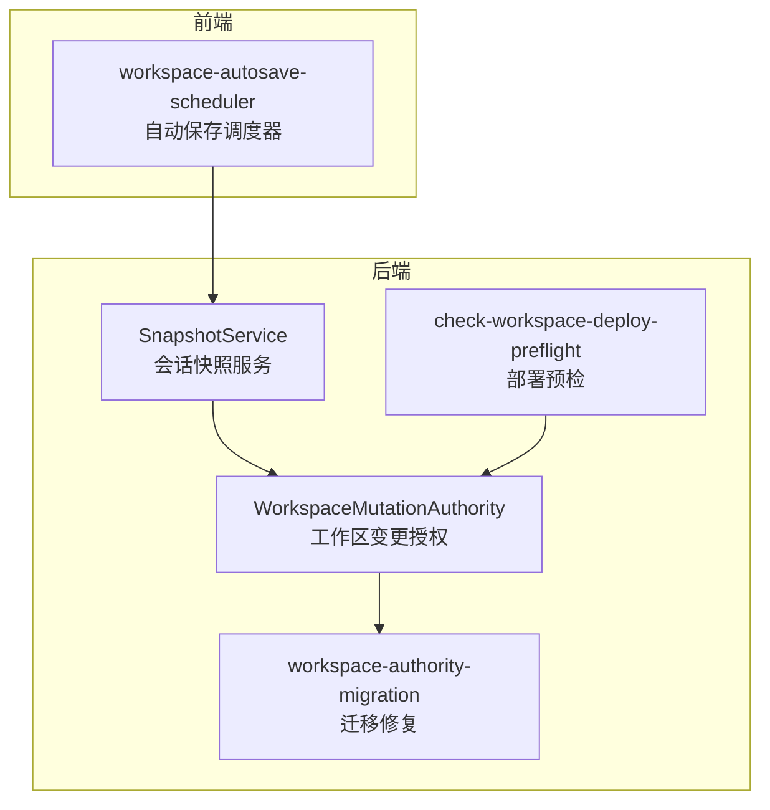
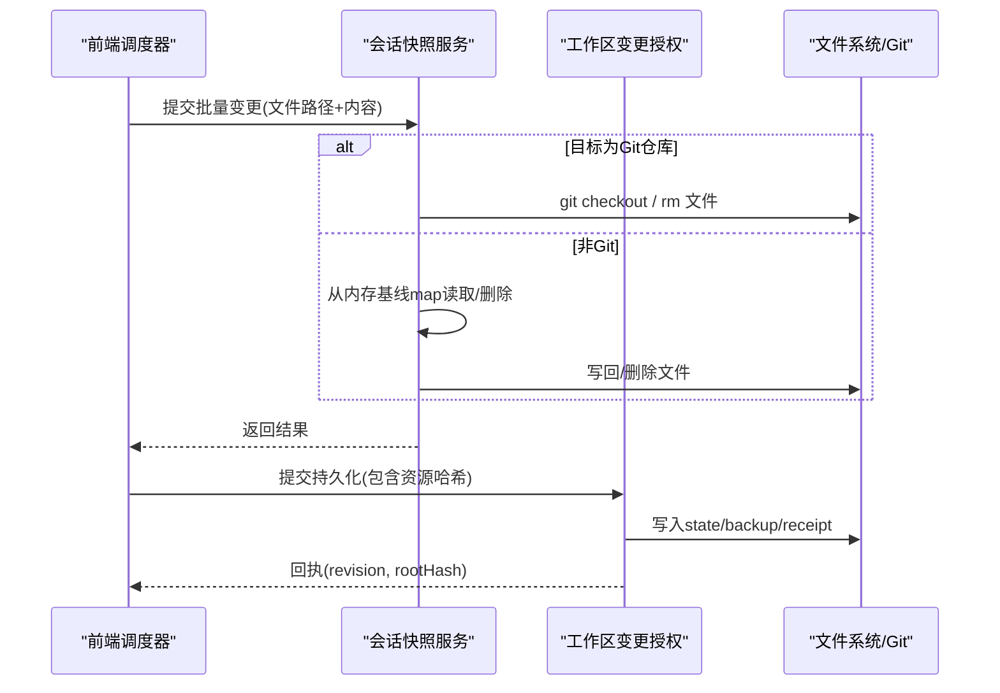
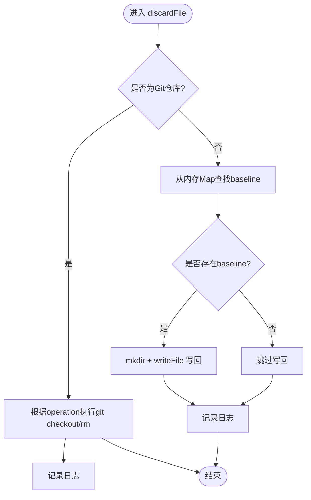
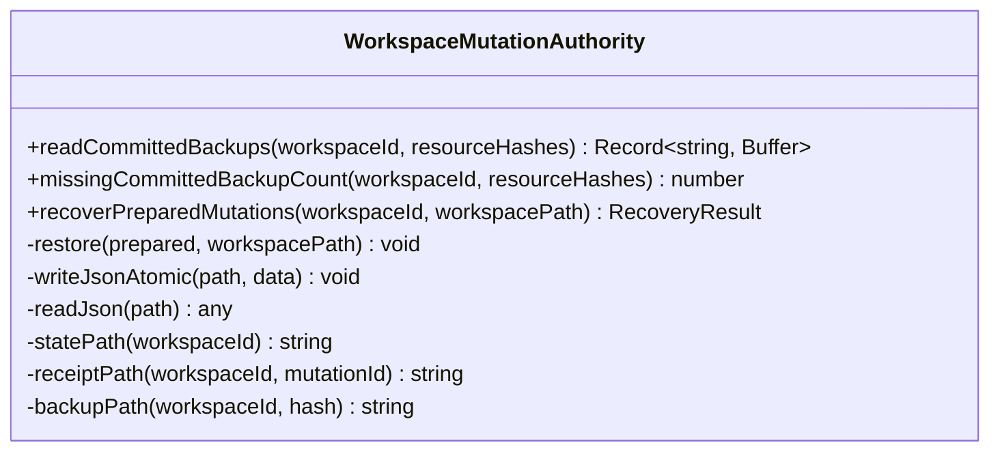
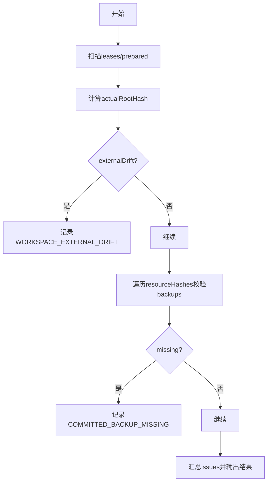
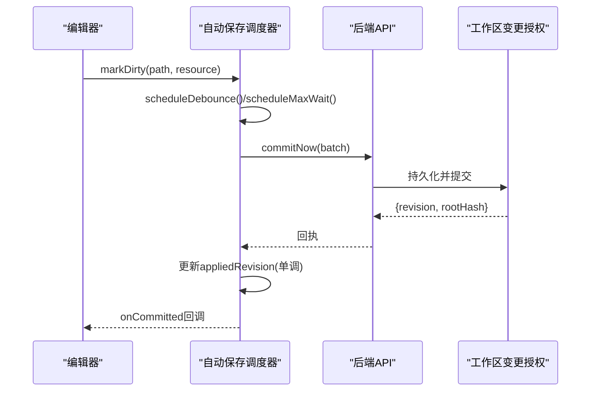
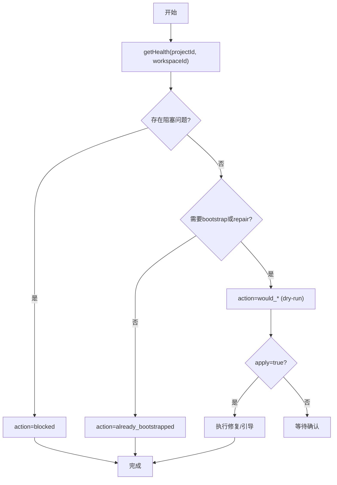
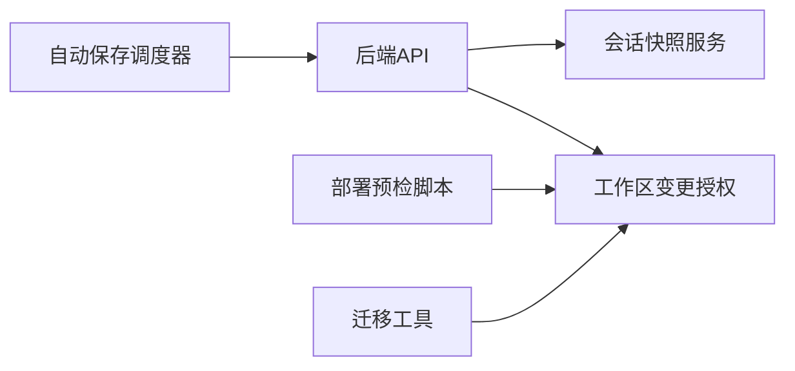
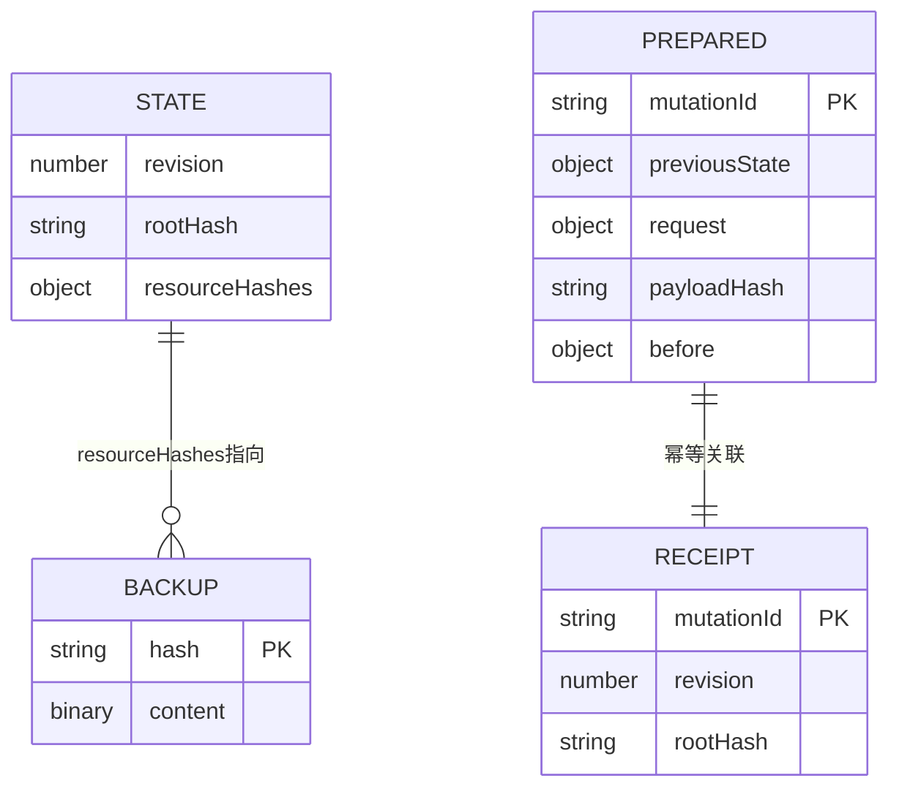

# 快照管理

<cite>
**本文引用的文件**
- [packages/agent-service/src/session/snapshot-service.ts](file://packages/agent-service/src/session/snapshot-service.ts)
- [packages/agent-service/src/workspace/workspace-mutation-authority.ts](file://packages/agent-service/src/workspace/workspace-mutation-authority.ts)
- [scripts/check-workspace-deploy-preflight.mjs](file://scripts/check-workspace-deploy-preflight.mjs)
- [packages/author-site/src/lib/workspace-autosave-scheduler.ts](file://packages/author-site/src/lib/workspace-autosave-scheduler.ts)
- [packages/agent-service/src/workspace/workspace-authority-migration.ts](file://packages/agent-service/src/workspace/workspace-authority-migration.ts)
- [docs/项目文档/创作端/03-项目管理/技术/06_项目工作空间迁移方案.md](file://docs/项目文档/创作端/03-项目管理/技术/06_项目工作空间迁移方案.md)
</cite>

## 目录
1. [简介](#简介)
2. [项目结构](#项目结构)
3. [核心组件](#核心组件)
4. [架构总览](#架构总览)
5. [详细组件分析](#详细组件分析)
6. [依赖分析](#依赖分析)
7. [性能考虑](#性能考虑)
8. [故障排除指南](#故障排除指南)
9. [结论](#结论)
10. [附录](#附录)

## 简介
本技术文档围绕“快照管理系统”展开，聚焦于以下目标：
- 解释快照创建机制（含增量与全量策略）、存储结构与版本标识生成策略
- 描述快照生命周期管理（保留策略、垃圾回收、存储空间优化）
- 说明快照验证与完整性检查（哈希计算、损坏检测与修复）
- 提供快照操作 API 的使用示例（创建、查询、删除、批量操作）
- 给出性能优化建议与故障排除指南

基于仓库中的实现，系统采用“双轨快照”模式：
- Git 仓库场景：以 Git 作为权威源，通过 git checkout 等命令进行差异恢复与丢弃
- 非 Git 场景：在内存中维护基线快照，按文件路径映射内容，支持就地回滚与清理

此外，工作区变更授权层负责持久化提交状态、备份资源内容与回执，确保一致性、可恢复性与幂等性。

## 项目结构
与快照相关的核心代码分布在如下模块：
- 会话级快照服务：负责初始化、文件级快照与丢弃/重置
- 工作区变更授权：负责已提交状态的持久化、备份与启动恢复
- 部署预检脚本：校验工作区外部漂移与备份完整性
- 自动保存调度器：前端侧的批量提交与回执应用
- 迁移工具：引导式修复缺失备份或引导初始化

图表来源
- [packages/agent-service/src/session/snapshot-service.ts](file://packages/agent-service/src/session/snapshot-service.ts)
- [packages/agent-service/src/workspace/workspace-mutation-authority.ts](file://packages/agent-service/src/workspace/workspace-mutation-authority.ts)
- [packages/agent-service/src/workspace/workspace-authority-migration.ts](file://packages/agent-service/src/workspace/workspace-authority-migration.ts)
- [scripts/check-workspace-deploy-preflight.mjs](file://scripts/check-workspace-deploy-preflight.mjs)
- [packages/author-site/src/lib/workspace-autosave-scheduler.ts](file://packages/author-site/src/lib/workspace-autosave-scheduler.ts)

章节来源
- [packages/agent-service/src/session/snapshot-service.ts](file://packages/agent-service/src/session/snapshot-service.ts)
- [packages/agent-service/src/workspace/workspace-mutation-authority.ts](file://packages/agent-service/src/workspace/workspace-mutation-authority.ts)
- [scripts/check-workspace-deploy-preflight.mjs](file://scripts/check-workspace-deploy-preflight.mjs)
- [packages/author-site/src/lib/workspace-autosave-scheduler.ts](file://packages/author-site/src/lib/workspace-autosave-scheduler.ts)
- [packages/agent-service/src/workspace/workspace-authority-migration.ts](file://packages/agent-service/src/workspace/workspace-authority-migration.ts)

## 核心组件
- 会话快照服务（SnapshotService）
  - 职责：为会话工作目录建立快照上下文；对单个文件执行丢弃/重置；清理会话快照
  - 关键能力：
    - Git 仓库：利用 git 命令进行文件丢弃或恢复到 HEAD
    - 非 Git：从内存基线 map 中读取原始内容并写回，或删除新增文件
- 工作区变更授权（WorkspaceMutationAuthority）
  - 职责：维护工作区的已提交状态、资源哈希与备份；处理启动时未完成的 prepared mutation 恢复
  - 关键能力：
    - 读取已提交的资源哈希并校验备份完整性
    - 启动恢复：无回执则回滚到 previousState，有回执则清理残留
- 部署预检脚本（check-workspace-deploy-preflight.mjs）
  - 职责：扫描工作区，报告 active lease、prepared transactions、外部漂移与缺失备份等问题
- 自动保存调度器（workspace-autosave-scheduler）
  - 职责：前端侧将脏资源批量提交，接收回执并单调递增 appliedRevision
- 迁移工具（workspace-authority-migration）
  - 职责：交互式或自动化地修复缺失备份或引导初始化

章节来源
- [packages/agent-service/src/session/snapshot-service.ts](file://packages/agent-service/src/session/snapshot-service.ts)
- [packages/agent-service/src/workspace/workspace-mutation-authority.ts](file://packages/agent-service/src/workspace/workspace-mutation-authority.ts)
- [scripts/check-workspace-deploy-preflight.mjs](file://scripts/check-workspace-deploy-preflight.mjs)
- [packages/author-site/src/lib/workspace-autosave-scheduler.ts](file://packages/author-site/src/lib/workspace-autosave-scheduler.ts)
- [packages/agent-service/src/workspace/workspace-authority-migration.ts](file://packages/agent-service/src/workspace/workspace-authority-migration.ts)

## 架构总览
整体数据流与控制流如下：
- 前端自动保存调度器收集 dirty 资源，批量提交至后端
- 后端 SnapshotService 根据是否 Git 仓库选择不同策略进行文件级快照/丢弃/重置
- WorkspaceMutationAuthority 负责持久化提交状态、备份资源与回执，并在启动时做一致性恢复
- 部署预检脚本用于巡检健康度，发现外部漂移或缺失备份等问题
- 迁移工具辅助修复问题，保障系统稳定运行

图表来源
- [packages/agent-service/src/session/snapshot-service.ts](file://packages/agent-service/src/session/snapshot-service.ts)
- [packages/agent-service/src/workspace/workspace-mutation-authority.ts](file://packages/agent-service/src/workspace/workspace-mutation-authority.ts)
- [packages/author-site/src/lib/workspace-autosave-scheduler.ts](file://packages/author-site/src/lib/workspace-autosave-scheduler.ts)

## 详细组件分析

### 组件A：会话快照服务（SnapshotService）
- 设计要点
  - 针对 Git 仓库与非 Git 目录分别实现文件级快照与丢弃逻辑
  - 提供 resetFile/discardFile/clearSnapshot 等方法，便于上层调用
- 关键流程（丢弃/重置文件）
  - 若为 Git 仓库：
    - create：删除文件
    - modify/delete：git checkout HEAD -- <filePath> 恢复
  - 若非 Git：
    - 从内存 snapshots Map 中查找 baseline，存在则写回，否则删除新增文件
- 复杂度与性能
  - Git 路径：O(1) 命令调用，I/O 由 Git 驱动
  - 非 Git 路径：Map 查找 O(1)，磁盘 I/O 取决于文件大小
- 错误处理
  - Git 命令失败抛出异常并记录日志
  - 非 Git 路径下若无 baseline，跳过写回

图表来源
- [packages/agent-service/src/session/snapshot-service.ts](file://packages/agent-service/src/session/snapshot-service.ts)

章节来源
- [packages/agent-service/src/session/snapshot-service.ts](file://packages/agent-service/src/session/snapshot-service.ts)

### 组件B：工作区变更授权（WorkspaceMutationAuthority）
- 设计要点
  - 维护 state（revision/rootHash/resourceHashes）、backups（按哈希命名）、receipts（回执）与 prepared 事务
  - 启动恢复：遍历 prepared 目录，若无 receipt 则回滚到 previousState，若有 receipt 则清理残留
- 关键流程（读取已提交备份）
  - 遍历 resourceHashes，按 expectedHash 定位 backupPath
  - 校验 hashContent(backup) === expectedHash，不一致则报错
- 关键流程（启动恢复）
  - 读取 prepared/*.json，判断 receipt 是否存在
  - 无 receipt：restore(prepared) 并写回 previousState
  - 有 receipt：校验 state.revision/rootHash 与 receipt 一致后清理

图表来源
- [packages/agent-service/src/workspace/workspace-mutation-authority.ts](file://packages/agent-service/src/workspace/workspace-mutation-authority.ts)

章节来源
- [packages/agent-service/src/workspace/workspace-mutation-authority.ts](file://packages/agent-service/src/workspace/workspace-mutation-authority.ts)

### 组件C：部署预检脚本（check-workspace-deploy-preflight.mjs）
- 功能点
  - 检测 active/stale write lease
  - 统计 prepared 事务数量
  - 计算实际 rootHash 并与 state.rootHash 对比，检测外部漂移
  - 校验 committed backups 完整性（resourceHashes 对应的 .bin 是否存在且哈希匹配）
- 输出
  - 汇总 issues 列表，标记 passed 状态

图表来源
- [scripts/check-workspace-deploy-preflight.mjs](file://scripts/check-workspace-deploy-preflight.mjs)

章节来源
- [scripts/check-workspace-deploy-preflight.mjs](file://scripts/check-workspace-deploy-preflight.mjs)

### 组件D：自动保存调度器（workspace-autosave-scheduler）
- 功能点
  - 收集 dirty 资源，防抖与最大等待时间触发批量提交
  - 仅接受 revision >= appliedRevision 的回执，避免旧回执覆盖新状态
  - in-flight 期间的新脏资源转入下一批，保证顺序与一致性
- 接口行为
  - hasDirty/isInFlight/getAppliedRevision/setAppliedRevision/dispose

图表来源
- [packages/author-site/src/lib/workspace-autosave-scheduler.ts](file://packages/author-site/src/lib/workspace-autosave-scheduler.ts)

章节来源
- [packages/author-site/src/lib/workspace-autosave-scheduler.ts](file://packages/author-site/src/lib/workspace-autosave-scheduler.ts)

### 组件E：迁移工具（workspace-authority-migration）
- 功能点
  - 诊断工作区健康度（activeLease、preparedCount、externalDrift、missingBackupCount）
  - 支持 dry-run 与实际 apply，自动修复缺失备份或引导初始化
- 交互流程
  - 列出 items（action: blocked/would_bootstrap/would_repair_backups/already_bootstrapped）
  - 用户确认后执行 apply

图表来源
- [packages/agent-service/src/workspace/workspace-authority-migration.ts](file://packages/agent-service/src/workspace/workspace-authority-migration.ts)

章节来源
- [packages/agent-service/src/workspace/workspace-authority-migration.ts](file://packages/agent-service/src/workspace/workspace-authority-migration.ts)

## 依赖分析
- 组件耦合
  - 自动保存调度器依赖后端 API，间接依赖工作区变更授权
  - 会话快照服务在工作区层面与文件系统/Git 交互，不直接依赖持久化状态
  - 部署预检脚本与工作区变更授权的数据布局强相关（state/backups/receipts/prepared）
- 外部依赖
  - Git 命令（仅在 Git 仓库模式下使用）
  - 文件系统读写（JSON/Binary 文件）
- 潜在循环依赖
  - 当前未见循环依赖；各组件职责清晰，分层明确

图表来源
- [packages/author-site/src/lib/workspace-autosave-scheduler.ts](file://packages/author-site/src/lib/workspace-autosave-scheduler.ts)
- [packages/agent-service/src/session/snapshot-service.ts](file://packages/agent-service/src/session/snapshot-service.ts)
- [packages/agent-service/src/workspace/workspace-mutation-authority.ts](file://packages/agent-service/src/workspace/workspace-mutation-authority.ts)
- [scripts/check-workspace-deploy-preflight.mjs](file://scripts/check-workspace-deploy-preflight.mjs)
- [packages/agent-service/src/workspace/workspace-authority-migration.ts](file://packages/agent-service/src/workspace/workspace-authority-migration.ts)

章节来源
- [packages/author-site/src/lib/workspace-autosave-scheduler.ts](file://packages/author-site/src/lib/workspace-autosave-scheduler.ts)
- [packages/agent-service/src/session/snapshot-service.ts](file://packages/agent-service/src/session/snapshot-service.ts)
- [packages/agent-service/src/workspace/workspace-mutation-authority.ts](file://packages/agent-service/src/workspace/workspace-mutation-authority.ts)
- [scripts/check-workspace-deploy-preflight.mjs](file://scripts/check-workspace-deploy-preflight.mjs)
- [packages/agent-service/src/workspace/workspace-authority-migration.ts](file://packages/agent-service/src/workspace/workspace-authority-migration.ts)

## 性能考虑
- 批量提交与去抖
  - 前端调度器通过 debounce 与最大等待时间合并多次修改，减少网络与后端压力
- 单调回执与幂等
  - 仅接受 revision >= appliedRevision 的回执，避免重复提交导致的状态抖动
- 存储与 I/O
  - Git 仓库模式利用 Git 的增量能力，降低磁盘占用与 I/O
  - 非 Git 模式需关注大文件写回成本，建议限制单次提交大小或分片
- 并发控制
  - 注意 active lease 与 prepared 事务的竞态条件，必要时引入队列或锁

[本节为通用指导，无需特定文件引用]

## 故障排除指南
- 常见问题与定位
  - 外部漂移：actualRootHash 与 state.rootHash 不一致，需 adopt 或 restore
  - 备份缺失：committed backups 不完整，需修复缺失 .bin 文件
  - 未完成事务：prepared 事务存在，需启动恢复或手动清理
  - 活动租约：active/stale write lease 存在，需释放或清理
- 修复手段
  - 使用迁移工具进行 would_* 预览与 apply 修复
  - 使用部署预检脚本输出 issues 清单，逐项处理
  - 对于无 receipt 的 prepared mutation，系统将自动回滚到 previousState

章节来源
- [scripts/check-workspace-deploy-preflight.mjs](file://scripts/check-workspace-deploy-preflight.mjs)
- [packages/agent-service/src/workspace/workspace-authority-migration.ts](file://packages/agent-service/src/workspace/workspace-authority-migration.ts)
- [docs/项目文档/创作端/03-项目管理/技术/06_项目工作空间迁移方案.md](file://docs/项目文档/创作端/03-项目管理/技术/06_项目工作空间迁移方案.md)

## 结论
本快照管理系统通过“Git/非Git双轨”策略与“工作区变更授权”的持久化保障，实现了可靠的快照创建、验证与恢复。结合部署预检与迁移工具，系统在复杂环境下具备较强的健壮性与可运维性。建议在大规模项目中优先采用 Git 仓库模式，并结合批量提交与单调回执策略提升性能与一致性。

[本节为总结，无需特定文件引用]

## 附录

### 快照创建机制与算法
- 增量快照（Git 模式）
  - 通过 git checkout/rm 等命令实现文件级差异操作，避免全量复制
- 全量快照（非 Git 模式）
  - 在内存中维护 baseline Map，按需写回或删除文件，适合临时会话或不可控环境
- 版本标识符生成策略
  - 使用 revision 与 rootHash 作为版本标识；rootHash 由资源哈希聚合得到，确保全局一致性

章节来源
- [packages/agent-service/src/session/snapshot-service.ts](file://packages/agent-service/src/session/snapshot-service.ts)
- [packages/agent-service/src/workspace/workspace-mutation-authority.ts](file://packages/agent-service/src/workspace/workspace-mutation-authority.ts)

### 快照存储结构与数据模型
- 存储布局
  - state：包含 revision、rootHash、resourceHashes
  - backups：按资源哈希命名的二进制文件
  - receipts：按 mutationId 命名的回执文件
  - prepared：未完成的事务草稿
- 数据关系
  - resourceHashes -> backups（哈希对应）
  - mutationId -> receipts（幂等凭证）
  - prepared -> previousState（回滚依据）

图表来源
- [packages/agent-service/src/workspace/workspace-mutation-authority.ts](file://packages/agent-service/src/workspace/workspace-mutation-authority.ts)

### 快照生命周期管理
- 保留策略
  - 建议基于 revision 窗口或 rootHash 唯一性保留最近 N 个版本
- 垃圾回收
  - 定期扫描 backups，移除未被 resourceHashes 引用且无活跃 lease 的文件
- 存储空间优化
  - 优先使用 Git 仓库模式；对大文件启用压缩或分块上传

章节来源
- [docs/项目文档/创作端/03-项目管理/技术/06_项目工作空间迁移方案.md](file://docs/项目文档/创作端/03-项目管理/技术/06_项目工作空间迁移方案.md)

### 快照验证与完整性检查
- 哈希计算
  - 对每个资源计算哈希，写入 resourceHashes；备份文件以哈希命名
- 损坏检测
  - 启动恢复与部署预检均会校验备份哈希与 expectedHash 的一致性
- 修复机制
  - 无 receipt 的 prepared 事务自动回滚；迁移工具可修复缺失备份

章节来源
- [packages/agent-service/src/workspace/workspace-mutation-authority.ts](file://packages/agent-service/src/workspace/workspace-mutation-authority.ts)
- [scripts/check-workspace-deploy-preflight.mjs](file://scripts/check-workspace-deploy-preflight.mjs)

### 快照操作 API 使用示例
- 创建
  - 前端批量提交 dirty 资源，后端持久化并提交，返回回执
- 查询
  - 读取 state 获取 revision 与 rootHash；遍历 resourceHashes 获取资源清单
- 删除
  - 通过会话快照服务的 discard/reset 方法删除文件或恢复至 baseline
- 批量操作
  - 使用自动保存调度器的批量提交接口，合并多次修改

章节来源
- [packages/author-site/src/lib/workspace-autosave-scheduler.ts](file://packages/author-site/src/lib/workspace-autosave-scheduler.ts)
- [packages/agent-service/src/session/snapshot-service.ts](file://packages/agent-service/src/session/snapshot-service.ts)