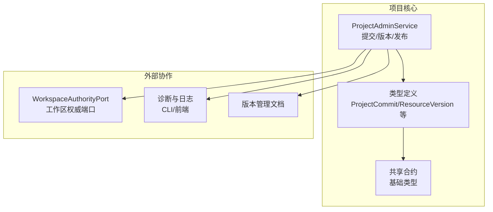
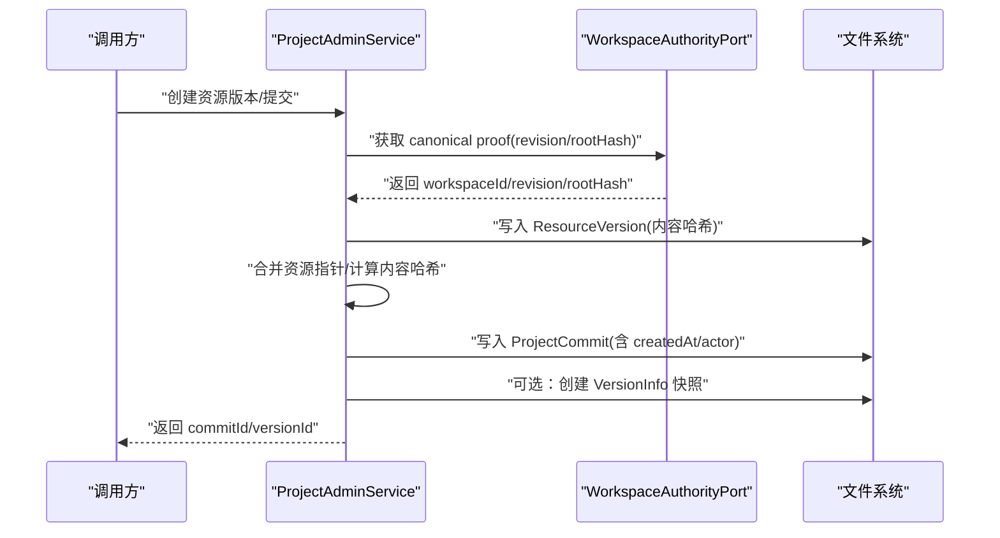
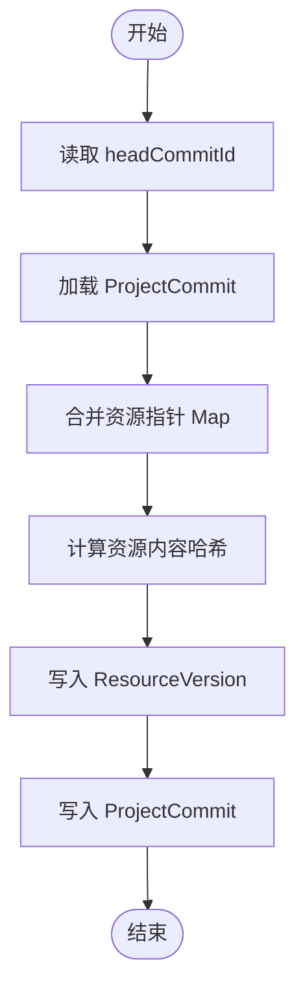
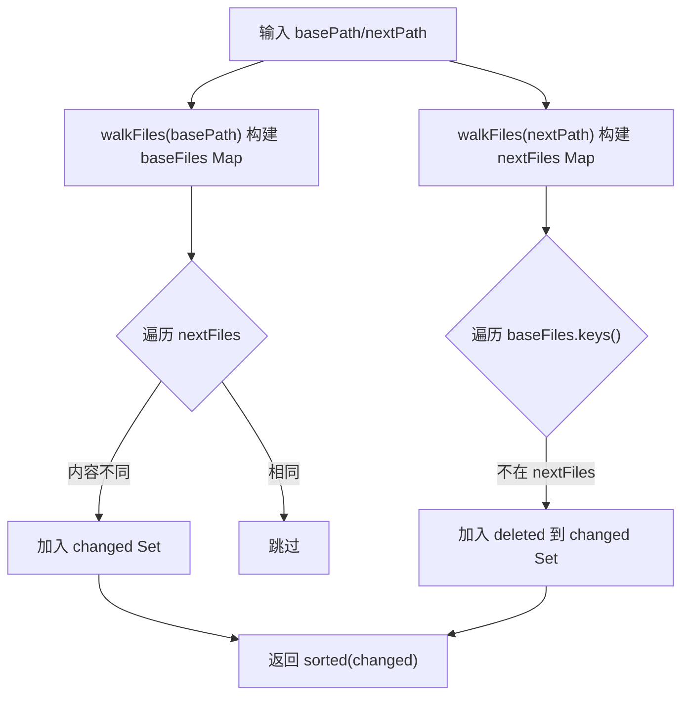
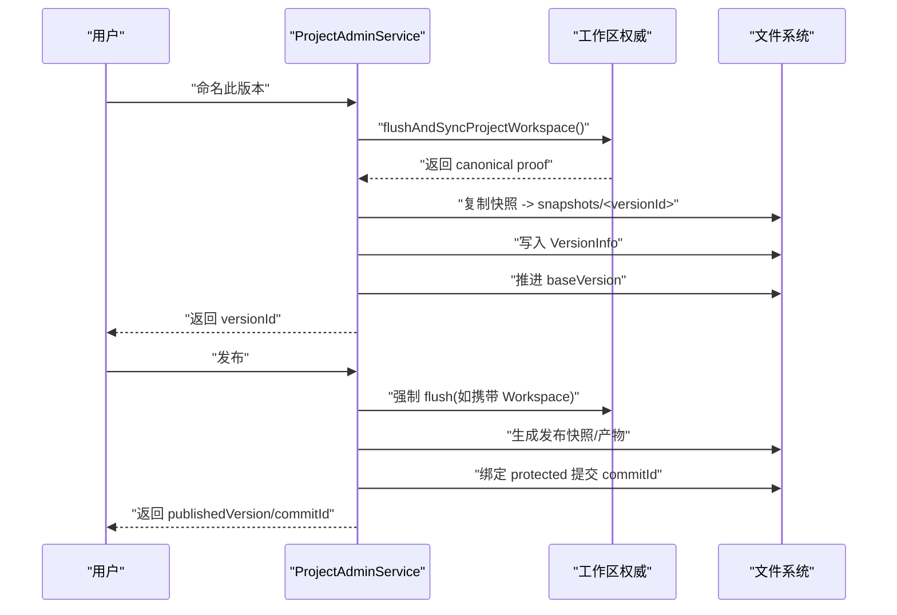
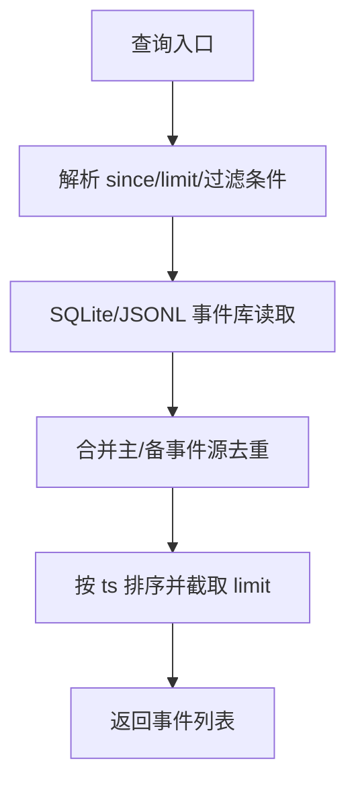
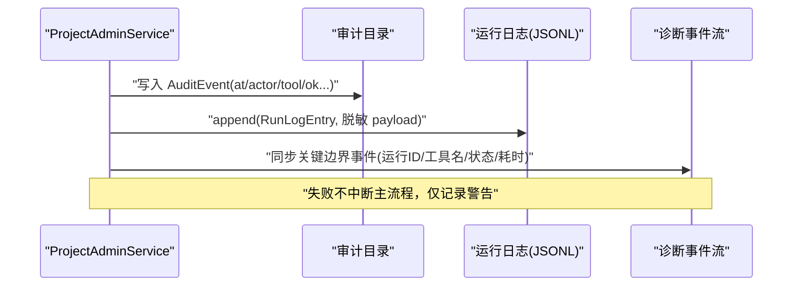
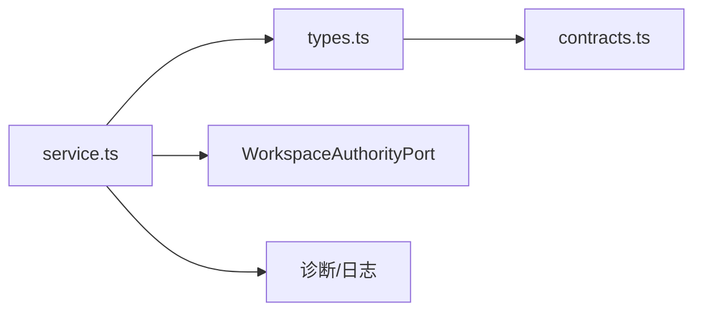

# 提交历史

<cite>
**本文引用的文件**   
- [service.ts](file://packages/project-core/src/service.ts)
- [types.ts](file://packages/project-core/src/types.ts)
- [contracts.ts](file://packages/shared/src/contracts.ts)
- [04_版本管理.md](file://docs/项目文档/创作端/03-项目管理/技术/04_版本管理.md)
- [03_项目工作区_v2.md](file://docs/项目文档/创作端/03-项目管理/技术/03_项目工作区_v2.md)
- [06_项目工作空间迁移方案.md](file://docs/项目文档/创作端/03-项目管理/技术/06_项目工作空间迁移方案.md)
- [scaffold.test.ts](file://packages/project-scaffold/src/scaffold.test.ts)
- [cli.test.ts](file://packages/project-cli/src/cli.test.ts)
- [diagnostics.ts](file://OPS/CLI/src/commands/diagnostics.ts)
- [store.ts](file://packages/author-site/src/lib/editor-diagnostics/store.ts)
- [run-log-store.ts](file://packages/agent-service/src/session/run-log-store.ts)
</cite>

## 目录
1. [引言](#引言)
2. [项目结构](#项目结构)
3. [核心组件](#核心组件)
4. [架构总览](#架构总览)
5. [详细组件分析](#详细组件分析)
6. [依赖关系分析](#依赖关系分析)
7. [性能考量](#性能考量)
8. [故障排查指南](#故障排查指南)
9. [结论](#结论)
10. [附录](#附录)

## 引言
本文件面向“提交历史系统”的技术实现与使用，覆盖以下目标：
- 提交记录的创建与管理机制（元数据结构、时间戳、作者信息）
- 变更追踪算法（差异检测、变更集合并、冲突解决策略）
- 版本标签系统（命名版本、发布标记、分支事务）
- 提交历史查询接口（按时间范围过滤、用户筛选、变更搜索）
- 可视化展示方案与审计日志集成方案

## 项目结构
提交历史能力由“项目核心服务”主导，结合共享合约类型定义、文档规范以及 CLI/前端诊断工具共同构成。关键位置如下：
- 项目核心服务：负责内容图、资源版本、提交记录、快照与发布等
- 共享合约：定义跨模块使用的数据模型
- 文档规范：明确版本管理原则、流程与约束
- CLI/前端诊断：提供查询、过滤、聚合与可视化辅助

图表来源
- [service.ts:477-521](file://packages/project-core/src/service.ts#L477-L521)
- [types.ts:105-123](file://packages/project-core/src/types.ts#L105-L123)
- [contracts.ts:1-86](file://packages/shared/src/contracts.ts#L1-L86)

章节来源
- [service.ts:477-521](file://packages/project-core/src/service.ts#L477-L521)
- [types.ts:105-123](file://packages/project-core/src/types.ts#L105-L123)
- [contracts.ts:1-86](file://packages/shared/src/contracts.ts#L1-L86)

## 核心组件
- 提交记录（ProjectCommit）：描述一次操作对资源指针的变更集合，包含时间戳、作者、可见性、关联会话与工作区证明等
- 资源版本（ResourceVersion）：不可变的内容版本，附带内容哈希、元数据、来源与时间戳
- 项目级版本（VersionInfo）：整项目快照或命名版本，用于回退与追溯
- 内容状态（ProjectContentState）：维护 headCommitId 与材料化状态
- 工作区权威端口（WorkspaceMutationPort）：与底层工作区协同层交互，获取 revision/rootHash 等权威证明

章节来源
- [types.ts:255-276](file://packages/project-core/src/types.ts#L255-L276)
- [service.ts:4890-5002](file://packages/project-core/src/service.ts#L4890-L5002)
- [service.ts:5673-5712](file://packages/project-core/src/service.ts#L5673-L5712)

## 架构总览
提交历史系统围绕“内容图 + 资源版本 + 提交记录 + 项目级快照”四层组织。关键流程包括：
- 同步与物化：确保 live Workspace 的 canonical proof（workspaceId/revision/rootHash）存在
- 资源版本写入：以内容哈希去重存储，生成 ResourceVersion
- 提交记录写入：合并资源指针，持久化 ProjectCommit，更新 headCommitId
- 项目级快照：复制工作区为快照，记录 VersionInfo，推进 baseVersion
- 发布标记：绑定 protected 提交与产物，形成可追溯发布点

图表来源
- [service.ts:4890-5002](file://packages/project-core/src/service.ts#L4890-L5002)
- [service.ts:5673-5712](file://packages/project-core/src/service.ts#L5673-L5712)
- [service.ts:5734-5769](file://packages/project-core/src/service.ts#L5734-L5769)

## 详细组件分析

### 提交记录与资源版本
- 提交记录持久化：将 ProjectCommit 写入 commits 目录，并按 createdAt 倒序列出
- 资源版本读写：按 kind/resourceId/versionId 路径组织，支持读取与写入
- 内容哈希：基于 kind/resourceId/blobRefs/metadata 的 JSON 序列化后 SHA-256，保证内容唯一性与去重
- 头提交读取：从内容状态中读取 headCommitId，再加载对应提交
- 指针合并：按 kind:resourceId 键合并当前与更新后的资源指针，排序输出

图表来源
- [service.ts:4890-5002](file://packages/project-core/src/service.ts#L4890-L5002)
- [service.ts:4965-4979](file://packages/project-core/src/service.ts#L4965-L4979)

章节来源
- [service.ts:4890-5002](file://packages/project-core/src/service.ts#L4890-L5002)
- [service.ts:4965-4979](file://packages/project-core/src/service.ts#L4965-L4979)

### 变更追踪与差异检测
- 工作区差异：遍历基准与下一个工作区目录，比较文件内容与存在性，输出变更集合
- 忽略目录：node_modules/.next/.git 等不参与差异
- CLI diff 行为：本地包与远程基线对比，输出 created/updated/deleted 摘要
- 测试用例验证：提交前后 diff 为空，说明提交成功收敛变更

图表来源
- [service.ts:5734-5769](file://packages/project-core/src/service.ts#L5734-L5769)
- [cli.test.ts:155-176](file://packages/project-cli/src/cli.test.ts#L155-L176)

章节来源
- [service.ts:5734-5769](file://packages/project-core/src/service.ts#L5734-L5769)
- [cli.test.ts:155-176](file://packages/project-cli/src/cli.test.ts#L155-L176)

### 版本标签与发布标记
- 命名版本：先 flush 并推进项目基准工作区，复制快照，记录 VersionInfo；随后保存/合并 Session 形成项目级历史节点
- 发布快照：若请求携带 Workspace，强制 flush 后再同步项目工作区至基准，生成发布快照；产物绑定 protected 提交 commitId
- 基线推进：当项目基准已追上 active live Workspace，发布快照需推进该 Workspace 的 baseVersion
- 分支事务：隔离 Workspace 适合 CLI/批量/AI 沙盒；提交时比较事务 baseVersion 与项目当前版本，冲突则拒绝整体覆盖

图表来源
- [04_版本管理.md:129-145](file://docs/项目文档/创作端/03-项目管理/技术/04_版本管理.md#L129-L145)
- [03_项目工作区_v2.md:146-169](file://docs/项目文档/创作端/03-项目管理/技术/03_项目工作区_v2.md#L146-L169)
- [service.ts:5673-5712](file://packages/project-core/src/service.ts#L5673-L5712)

章节来源
- [04_版本管理.md:129-145](file://docs/项目文档/创作端/03-项目管理/技术/04_版本管理.md#L129-L145)
- [03_项目工作区_v2.md:146-169](file://docs/项目文档/创作端/03-项目管理/技术/03_项目工作区_v2.md#L146-L169)
- [service.ts:5673-5712](file://packages/project-core/src/service.ts#L5673-L5712)

### 提交历史查询接口
- 按时间范围过滤：通过 since 参数（ISO 字符串或 h/d 后缀）限定 ts >= since
- 用户筛选：通过 actor.name 或 sessionId/workspaceId 等维度组合过滤
- 变更搜索：结合 diffSummary.created/updated/deleted 字段进行检索
- 结果限制：limit 默认 200，最大 1000，按 ts 排序后截断

图表来源
- [diagnostics.ts:308-331](file://OPS/CLI/src/commands/diagnostics.ts#L308-L331)
- [diagnostics.ts:639-643](file://OPS/CLI/src/commands/diagnostics.ts#L639-L643)
- [store.ts:394-433](file://packages/author-site/src/lib/editor-diagnostics/store.ts#L394-L433)

章节来源
- [diagnostics.ts:308-331](file://OPS/CLI/src/commands/diagnostics.ts#L308-L331)
- [diagnostics.ts:639-643](file://OPS/CLI/src/commands/diagnostics.ts#L639-L643)
- [store.ts:394-433](file://packages/author-site/src/lib/editor-diagnostics/store.ts#L394-L433)

### 可视化展示方案
- 提交时间轴：按 createdAt 倒序渲染，支持点击展开资源指针与变更摘要
- 资源版本树：按 kind/resourceId 分组，显示版本链与内容哈希
- 发布标记：在时间轴上标注发布点，链接到发布产物与 protected 提交
- 变更高亮：diffSummary.updated 列表作为变更热点，支持跳转到具体资源版本详情

[本节为概念性说明，不直接分析具体文件]

### 审计日志集成方案
- 审计事件：每个关键动作写入 AuditEvent，包含 at/actor/tool/ok/diffSummary/error 等
- 运行日志：Agent 运行日志以 JSONL 行式追加，敏感字段脱敏，失败仅记录 warning
- 诊断事件：关键边界事件同步到结构化诊断流，供 SQLite/JSONL 查询串联
- 恢复与回滚：每次恢复/回滚均新增语义记录，不覆盖旧记录

图表来源
- [run-log-store.ts:355-384](file://packages/agent-service/src/session/run-log-store.ts#L355-L384)
- [04_版本管理.md:51-63](file://docs/项目文档/创作端/03-项目管理/技术/04_版本管理.md#L51-L63)

章节来源
- [run-log-store.ts:355-384](file://packages/agent-service/src/session/run-log-store.ts#L355-L384)
- [04_版本管理.md:51-63](file://docs/项目文档/创作端/03-项目管理/技术/04_版本管理.md#L51-L63)

## 依赖关系分析
- 内部依赖
  - service.ts 依赖 types.ts 中的接口与类型
  - types.ts 依赖 shared/contracts.ts 的基础类型
- 外部依赖
  - WorkspaceAuthorityPort 提供工作区权威状态与提交能力
  - CLI/前端诊断工具提供查询、过滤与可视化支撑
- 潜在循环依赖
  - 当前分层清晰，未见循环导入；建议保持服务层与类型解耦

图表来源
- [service.ts:477-521](file://packages/project-core/src/service.ts#L477-L521)
- [types.ts:1-24](file://packages/project-core/src/types.ts#L1-L24)
- [contracts.ts:1-86](file://packages/shared/src/contracts.ts#L1-L86)

章节来源
- [service.ts:477-521](file://packages/project-core/src/service.ts#L477-L521)
- [types.ts:1-24](file://packages/project-core/src/types.ts#L1-L24)
- [contracts.ts:1-86](file://packages/shared/src/contracts.ts#L1-L86)

## 性能考量
- 差异检测复杂度：O(N+M)，N/M 分别为基准与下一工作区的文件数；避免大目录扫描（忽略 node_modules/.next/.git）
- 内容哈希：SHA-256 计算开销与文件大小线性相关，建议对大文件采用分块或增量策略
- 快照复制：copyWorkspaceWithoutRuntimeMetadata 会排除运行时元数据，减少 I/O
- 查询限制：limit 上限 1000，避免一次性拉取过多事件导致内存压力
- 并发写入：审计与运行日志采用 appendFileSync，单进程安全；多进程场景需考虑锁或队列

[本节为通用指导，不直接分析具体文件]

## 故障排查指南
- 工作区过期错误：WORKSPACE_STALE 表示 canonical proof 缺失或不匹配，需重新 flush 并同步
- 提交前校验：diff 结果为空即表示提交收敛；若仍有变更，检查是否遗漏同步步骤
- 审计与运行日志：若写入失败，仅记录 warning，不影响主流程；可通过诊断事件定位关键边界
- 冲突解决：分支事务提交冲突时拒绝整体覆盖，要求基于最新项目工作区重新开启事务

章节来源
- [scaffold.test.ts:718-749](file://packages/project-scaffold/src/scaffold.test.ts#L718-L749)
- [cli.test.ts:155-176](file://packages/project-cli/src/cli.test.ts#L155-L176)
- [run-log-store.ts:355-384](file://packages/agent-service/src/session/run-log-store.ts#L355-L384)

## 结论
提交历史系统以“内容图 + 资源版本 + 提交记录 + 项目级快照”为核心，配合工作区权威证明与审计日志，实现了可追溯、可回退、可发布的完整生命周期管理。差异检测与指针合并保证了变更的精确性，命名版本与发布标记提供了清晰的里程碑。通过 CLI/前端诊断工具的查询与可视化能力，团队可高效地进行变更分析与问题定位。

[本节为总结性内容，不直接分析具体文件]

## 附录
- 术语
  - 提交记录（ProjectCommit）：一次操作的资源指针变更集合
  - 资源版本（ResourceVersion）：不可变内容版本，带内容哈希与元数据
  - 项目级版本（VersionInfo）：整项目快照或命名版本
  - 工作区权威证明（canonical proof）：workspaceId/revision/rootHash 三元组
- 最佳实践
  - 关键动作前先 flush 并推进 canonical proof
  - 发布前确认项目基准已追上 active live Workspace
  - 审计与运行日志保持最小必要信息，敏感字段脱敏

[本节为补充说明，不直接分析具体文件]