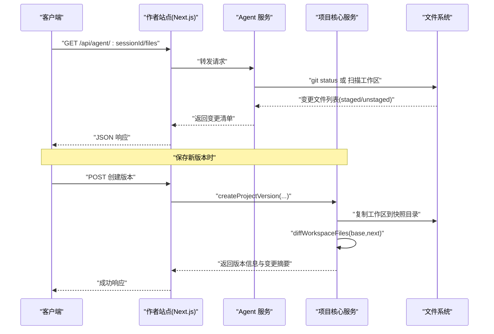
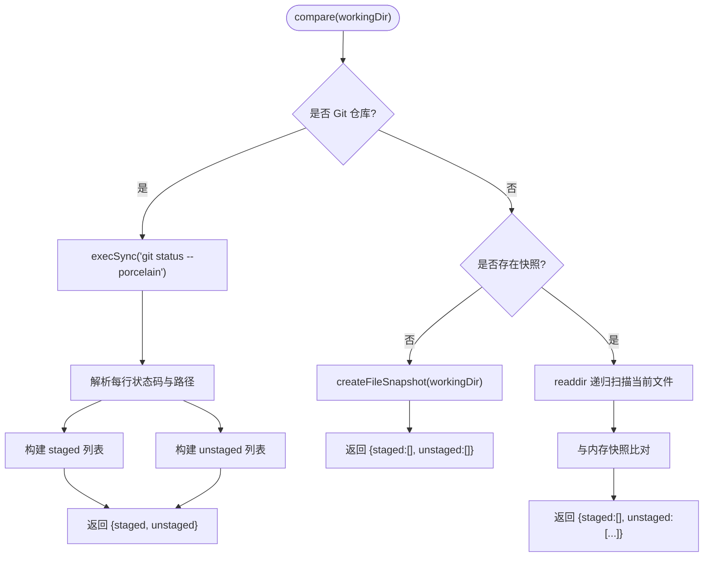
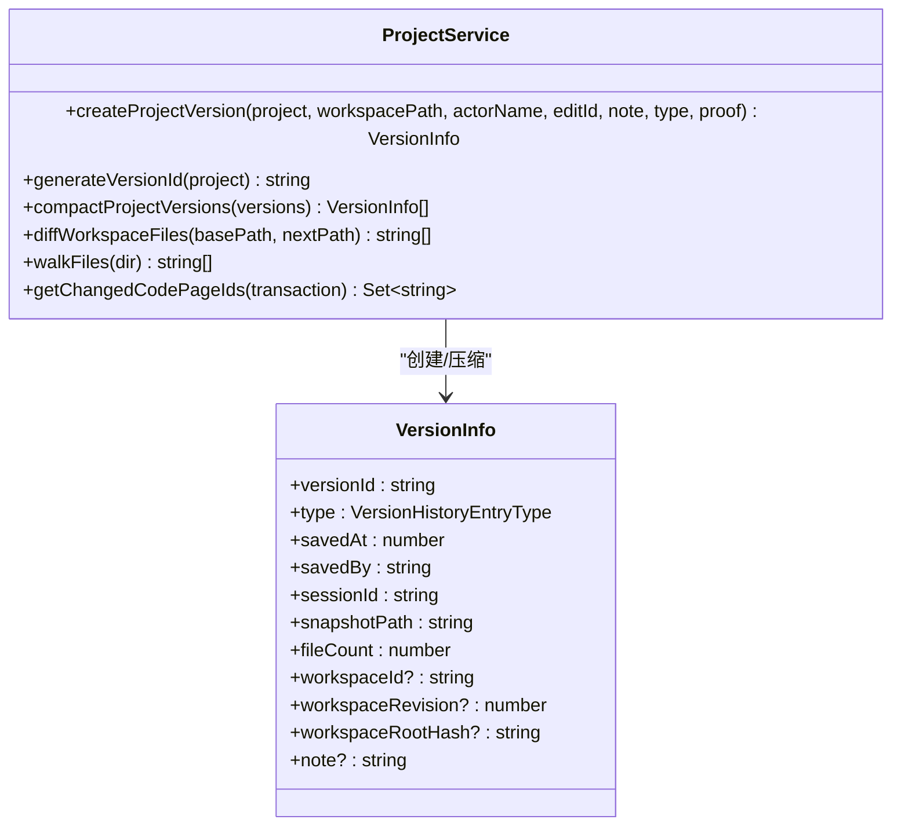
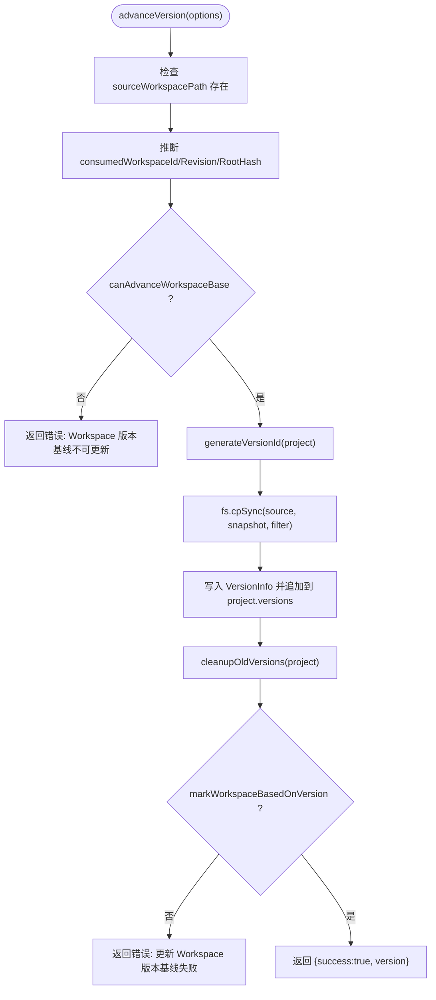
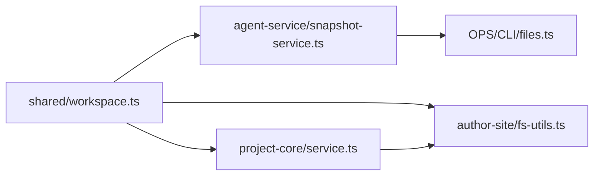

# 版本对比

<cite>
**本文引用的文件**   
- [packages/shared/src/workspace.ts](file://packages/shared/src/workspace.ts)
- [packages/agent-service/src/session/snapshot-service.ts](file://packages/agent-service/src/session/snapshot-service.ts)
- [packages/project-core/src/service.ts](file://packages/project-core/src/service.ts)
- [packages/author-site/src/lib/fs-utils.ts](file://packages/author-site/src/lib/fs-utils.ts)
- [OPS/CLI/src/commands/files.ts](file://OPS/CLI/src/commands/files.ts)
- [docs/项目文档/独立Agent服务层/02-接口规范.md](file://docs/项目文档/独立Agent服务层/02-接口规范.md)
</cite>

## 目录
1. [简介](#简介)
2. [项目结构](#项目结构)
3. [核心组件](#核心组件)
4. [架构总览](#架构总览)
5. [详细组件分析](#详细组件分析)
6. [依赖关系分析](#依赖关系分析)
7. [性能考量](#性能考量)
8. [故障排查指南](#故障排查指南)
9. [结论](#结论)
10. [附录：API 使用示例与最佳实践](#附录api-使用示例与最佳实践)

## 简介
本技术文档围绕“版本对比”能力，系统阐述差异计算算法、差异展示机制、代码审查支持、合并冲突解决工具以及版本对比 API 的使用方式。内容覆盖文件内容对比、结构差异分析与语义化比较策略；行级高亮、变更统计与可视化 diff 界面；批注系统与评论功能；冲突检测、自动合并建议与手动合并编辑器；并提供批量对比、自定义规则与性能优化技巧的参考实现路径。

## 项目结构
仓库中与版本对比相关的关键模块分布如下：
- 共享类型与模型：定义工作空间、版本历史、资源版本等数据结构，为前后端与 CLI 提供统一契约。
- Agent 快照与差异：提供 Git 仓库模式与非 Git 目录模式的差异发现，输出暂存区与未暂存区变更列表。
- 项目核心服务：负责创建项目版本、生成快照、计算工作区差异、识别受影响的页面资源并执行运行时校验。
- 前端辅助工具：封装版本创建、快照复制、旧版本清理与基线推进等流程。
- CLI 命令：以终端形式展示变更文件清单与操作类型颜色提示。
- 接口规范文档：列出 Agent 会话相关的 REST 接口，包括获取 staged/unstaged 变更、回滚、切换工作空间等。

```mermaid
graph TB
subgraph "共享契约"
WS["workspace.ts<br/>类型与常量"]
end
subgraph "Agent 服务"
SS["snapshot-service.ts<br/>快照与差异"]
end
subgraph "项目核心"
PC["service.ts<br/>版本/快照/差异/校验"]
end
subgraph "创作端"
FSU["fs-utils.ts<br/>版本创建/快照复制/清理"]
end
subgraph "CLI"
CLI["files.ts<br/>变更清单展示"]
end
subgraph "文档"
API["接口规范.md<br/>REST 端点说明"]
end
WS --> SS
WS --> PC
WS --> FSU
SS --> CLI
PC --> FSU
API --> SS
API --> PC
```

**图表来源** 
- [packages/shared/src/workspace.ts:1-526](file://packages/shared/src/workspace.ts#L1-L526)
- [packages/agent-service/src/session/snapshot-service.ts:1-183](file://packages/agent-service/src/session/snapshot-service.ts#L1-L183)
- [packages/project-core/src/service.ts:5670-5869](file://packages/project-core/src/service.ts#L5670-L5869)
- [packages/author-site/src/lib/fs-utils.ts:1473-1539](file://packages/author-site/src/lib/fs-utils.ts#L1473-L1539)
- [OPS/CLI/src/commands/files.ts:54-99](file://OPS/CLI/src/commands/files.ts#L54-L99)
- [docs/项目文档/独立Agent服务层/02-接口规范.md:26-95](file://docs/项目文档/独立Agent服务层/02-接口规范.md#L26-L95)

**章节来源**
- [packages/shared/src/workspace.ts:1-526](file://packages/shared/src/workspace.ts#L1-L526)
- [packages/agent-service/src/session/snapshot-service.ts:1-183](file://packages/agent-service/src/session/snapshot-service.ts#L1-L183)
- [packages/project-core/src/service.ts:5670-5869](file://packages/project-core/src/service.ts#L5670-L5869)
- [packages/author-site/src/lib/fs-utils.ts:1473-1539](file://packages/author-site/src/lib/fs-utils.ts#L1473-L1539)
- [OPS/CLI/src/commands/files.ts:54-99](file://OPS/CLI/src/commands/files.ts#L54-L99)
- [docs/项目文档/独立Agent服务层/02-接口规范.md:26-95](file://docs/项目文档/独立Agent服务层/02-接口规范.md#L26-L95)

## 核心组件
- 共享类型与常量
  - 工作空间元信息、快照模式、差异结果、版本历史条目、资源版本指针、项目提交记录等。
  - 最大版本保留数量常量用于控制历史版本规模。
- Agent 快照服务
  - 初始化快照（Git 仓库模式或非 Git 目录模式）。
  - 差异计算：基于 git status 或文件系统快照扫描，输出 staged/unstaged 变更。
- 项目核心服务
  - 创建项目版本：复制工作区到快照目录，记录版本信息与审计数据。
  - 工作区差异：递归遍历文件，按内容哈希比对，返回变更文件集合。
  - 受影响页面识别：根据变更文件匹配页面目录，驱动运行时校验。
- 前端辅助工具
  - 版本创建流程：选择消费的工作空间与修订号，复制快照，更新项目元数据，清理旧版本。
- CLI 命令
  - 以彩色文本输出已暂存与未暂存的变更文件清单。
- 接口规范
  - 提供 Agent 会话的文件变更查询、回滚、工作空间切换等 REST 接口。

**章节来源**
- [packages/shared/src/workspace.ts:1-526](file://packages/shared/src/workspace.ts#L1-L526)
- [packages/agent-service/src/session/snapshot-service.ts:1-183](file://packages/agent-service/src/session/snapshot-service.ts#L1-L183)
- [packages/project-core/src/service.ts:5670-5869](file://packages/project-core/src/service.ts#L5670-L5869)
- [packages/author-site/src/lib/fs-utils.ts:1473-1539](file://packages/author-site/src/lib/fs-utils.ts#L1473-L1539)
- [OPS/CLI/src/commands/files.ts:54-99](file://OPS/CLI/src/commands/files.ts#L54-L99)
- [docs/项目文档/独立Agent服务层/02-接口规范.md:26-95](file://docs/项目文档/独立Agent服务层/02-接口规范.md#L26-L95)

## 架构总览
版本对比的整体流程如下：
- 客户端通过 REST 接口请求 Agent 服务获取当前工作空间的变更清单（staged/unstaged）。
- Agent 服务在 Git 模式下调用 git status，在非 Git 模式下进行文件系统快照扫描，输出变更文件列表。
- 项目核心服务在保存新版本时，对基准工作区与目标工作区进行文件级差异计算，识别受影响的页面资源，并触发运行时校验。
- 前端辅助工具负责版本创建、快照复制与旧版本清理，确保版本历史可控且可回溯。
- CLI 提供快速查看变更清单的能力，便于开发者在终端中审阅差异。



**图表来源** 
- [packages/agent-service/src/session/snapshot-service.ts:108-183](file://packages/agent-service/src/session/snapshot-service.ts#L108-L183)
- [packages/project-core/src/service.ts:5673-5757](file://packages/project-core/src/service.ts#L5673-L5757)
- [docs/项目文档/独立Agent服务层/02-接口规范.md:26-95](file://docs/项目文档/独立Agent服务层/02-接口规范.md#L26-L95)

## 详细组件分析

### 组件 A：Agent 快照与差异服务
- 职责
  - 初始化快照：判断是否为 Git 仓库，若是则记录分支信息；否则创建文件快照。
  - 差异计算：Git 模式解析 git status --porcelain 输出，映射为 create/modify/delete 操作；非 Git 模式递归扫描工作区并与内存快照比对。
  - 输出：统一的 CompareResult，包含 staged 与 unstaged 两个变更数组。
- 关键流程
  - compare → isGitRepository → compareWithGit 或 compareWithSnapshot
  - compareWithSnapshot → scanDirectory → 构建 files Map → 对比当前文件集合与快照
- 复杂度
  - 时间复杂度：O(F)，F 为工作区文件数（读取与比对）
  - 空间复杂度：O(F)，存储文件内容与 mtime
- 错误处理
  - Git 命令失败时记录错误日志并返回空变更列表
  - 文件读取异常时跳过该文件并记录调试日志



**图表来源** 
- [packages/agent-service/src/session/snapshot-service.ts:108-183](file://packages/agent-service/src/session/snapshot-service.ts#L108-L183)

**章节来源**
- [packages/agent-service/src/session/snapshot-service.ts:1-183](file://packages/agent-service/src/session/snapshot-service.ts#L1-183)

### 组件 B：项目核心服务（版本与差异）
- 职责
  - 创建项目版本：生成 versionId，复制工作区到快照目录，记录审计信息（savedBy、sessionId、workspaceId/Revision/RootHash）。
  - 版本压缩：当版本超过最大保留数量时，优先删除 auto_checkpoint 类型，再按顺序删除其他版本，同时清理对应快照目录。
  - 工作区差异：递归遍历 base 与 next 目录，忽略 node_modules/.next/.git，按内容字符串比对，收集变更文件集合。
  - 受影响页面识别：根据变更文件匹配 demos/{pageId}/index.tsx 等页面文件，提取 pageId 集合，驱动运行时校验。
- 关键流程
  - createProjectVersion → generateVersionId → copyWorkspaceWithoutRuntimeMetadata
  - compactProjectVersions → 删除多余快照目录
  - diffWorkspaceFiles → walkFiles → 内容比对
  - getChangedCodePageIds → 正则匹配页面文件 → 返回 pageIds
- 复杂度
  - 时间复杂度：O(F_base + F_next)，F 为文件数
  - 空间复杂度：O(F_base + F_next)，Map 存储相对路径与内容
- 错误处理
  - 目录不存在时返回空文件列表
  - 文件读取失败时由上层捕获并记录日志



**图表来源** 
- [packages/project-core/src/service.ts:5673-5757](file://packages/project-core/src/service.ts#L5673-L5757)
- [packages/shared/src/workspace.ts:41-64](file://packages/shared/src/workspace.ts#L41-L64)

**章节来源**
- [packages/project-core/src/service.ts:5673-5757](file://packages/project-core/src/service.ts#L5673-L5757)
- [packages/shared/src/workspace.ts:41-64](file://packages/shared/src/workspace.ts#L41-L64)

### 组件 C：前端辅助工具（版本创建与快照管理）
- 职责
  - 推断消费的工作空间与修订号：根据 canonical 同步状态与 active 工作空间决定 consumedWorkspaceId/Revision/RootHash。
  - 版本创建：复制源工作区到快照目录，过滤运行时元数据，写入版本信息，更新项目元数据，清理旧版本。
  - 基线推进：若存在可推进的工作空间，标记其基于的版本为新版本。
- 关键流程
  - inferSyncedActiveWorkspaceForVersion → canAdvanceWorkspaceBase → generateVersionId → fs.cpSync → cleanupOldVersions
- 复杂度
  - 时间复杂度：O(F_snapshot)，F_snapshot 为快照文件数
  - 空间复杂度：O(1)，仅维护少量元数据
- 错误处理
  - 工作空间不存在时返回错误
  - 基线不可更新时返回错误
  - 更新基线失败时返回错误



**图表来源** 
- [packages/author-site/src/lib/fs-utils.ts:1473-1539](file://packages/author-site/src/lib/fs-utils.ts#L1473-L1539)

**章节来源**
- [packages/author-site/src/lib/fs-utils.ts:1473-1539](file://packages/author-site/src/lib/fs-utils.ts#L1473-L1539)

### 组件 D：CLI 变更清单展示
- 职责
  - 接收 Agent 服务的变更清单 JSON，按 staged/unstaged 分组并以彩色文本输出。
  - 无变更时输出提示信息。
- 关键流程
  - 解析 JSON → 遍历 staged/unstaged → 根据 action 设置颜色 → 打印
- 复杂度
  - 时间复杂度：O(N)，N 为变更文件数
  - 空间复杂度：O(1)

**章节来源**
- [OPS/CLI/src/commands/files.ts:54-99](file://OPS/CLI/src/commands/files.ts#L54-L99)

### 组件 E：接口规范（Agent 会话 REST 端点）
- 职责
  - 定义 Agent 会话相关的 REST 接口，包括获取 staged/unstaged 变更、回滚、切换工作空间、验证等。
- 关键端点
  - GET /api/agent/:sessionId/files：返回当前工作空间 staged/unstaged 变更
  - POST /api/agent/:sessionId/rollback：回滚指定文件或全部文件变更
  - PUT /api/agent/:sessionId/workspace：切换 Session 工作空间并初始化快照
  - POST /api/agent/:sessionId/files/stage：暂存指定文件变更
  - POST /api/agent/:sessionId/files/discard：丢弃指定文件变更
  - POST /api/agent/:sessionId/validate：执行工作空间中的 demo 代码和 schema 校验

**章节来源**
- [docs/项目文档/独立Agent服务层/02-接口规范.md:26-95](file://docs/项目文档/独立Agent服务层/02-接口规范.md#L26-L95)

## 依赖关系分析
- 共享契约被 Agent 服务、项目核心服务与前端辅助工具共同引用，保证类型一致性与跨模块协作。
- Agent 服务依赖文件系统与 Git 命令，输出标准化的变更清单。
- 项目核心服务依赖文件系统与共享契约，负责版本快照与差异计算。
- 前端辅助工具依赖项目核心服务与文件系统，完成版本创建与快照管理。
- CLI 依赖 Agent 服务输出的 JSON 格式，进行终端展示。



**图表来源** 
- [packages/shared/src/workspace.ts:1-526](file://packages/shared/src/workspace.ts#L1-L526)
- [packages/agent-service/src/session/snapshot-service.ts:1-183](file://packages/agent-service/src/session/snapshot-service.ts#L1-183)
- [packages/project-core/src/service.ts:5670-5869](file://packages/project-core/src/service.ts#L5670-L5869)
- [packages/author-site/src/lib/fs-utils.ts:1473-1539](file://packages/author-site/src/lib/fs-utils.ts#L1473-L1539)
- [OPS/CLI/src/commands/files.ts:54-99](file://OPS/CLI/src/commands/files.ts#L54-L99)

**章节来源**
- [packages/shared/src/workspace.ts:1-526](file://packages/shared/src/workspace.ts#L1-L526)
- [packages/agent-service/src/session/snapshot-service.ts:1-183](file://packages/agent-service/src/session/snapshot-service.ts#L1-183)
- [packages/project-core/src/service.ts:5670-5869](file://packages/project-core/src/service.ts#L5670-L5869)
- [packages/author-site/src/lib/fs-utils.ts:1473-1539](file://packages/author-site/src/lib/fs-utils.ts#L1473-L1539)
- [OPS/CLI/src/commands/files.ts:54-99](file://OPS/CLI/src/commands/files.ts#L54-L99)

## 性能考量
- 差异计算
  - 文件级差异采用内容字符串比对，适合中小规模工作区；对于大型仓库建议优先使用 Git 模式以减少 I/O。
  - 递归遍历需忽略 node_modules/.next/.git 等无关目录，降低扫描开销。
- 版本压缩
  - 限制最大版本数量，优先删除自动检查点，避免快照目录无限增长。
- 前端快照复制
  - 使用过滤器排除运行时元数据，减少复制时间与磁盘占用。
- 并发与缓存
  - 批量对比场景可考虑并行读取文件与差异计算，结合内容哈希缓存避免重复计算。
- 网络与序列化
  - 变更清单 JSON 体积较大时，可在服务端分页或增量返回，减少传输开销。

[本节为通用指导，不直接分析具体文件]

## 故障排查指南
- Git 命令失败
  - 现象：无法获取变更清单或返回空列表
  - 排查：确认 workingDir 是否为有效 Git 仓库；检查 git 命令权限与环境变量
- 文件读取异常
  - 现象：部分文件未被纳入差异计算
  - 排查：检查文件权限与编码；关注调试日志中的失败路径
- 版本创建失败
  - 现象：返回“工作空间不存在”或“基线不可更新”
  - 排查：确认 sourceWorkspacePath 存在；检查 canAdvanceWorkspaceBase 条件
- 基线更新失败
  - 现象：返回“更新 Workspace 版本基线失败”
  - 排查：检查 markWorkspaceBasedOnVersion 的实现与文件系统状态
- CLI 输出异常
  - 现象：颜色或格式不正确
  - 排查：确认终端支持 ANSI 颜色；检查 JSON 结构与字段名称

**章节来源**
- [packages/agent-service/src/session/snapshot-service.ts:157-174](file://packages/agent-service/src/session/snapshot-service.ts#L157-L174)
- [packages/author-site/src/lib/fs-utils.ts:1495-1536](file://packages/author-site/src/lib/fs-utils.ts#L1495-L1536)
- [OPS/CLI/src/commands/files.ts:76-85](file://OPS/CLI/src/commands/files.ts#L76-L85)

## 结论
本方案通过 Agent 服务与项目核心服务的协同，实现了稳健的版本对比与差异计算能力。Git 模式与非 Git 模式的双轨策略兼顾了效率与兼容性；版本快照与压缩策略保障了历史数据的可控性；CLI 与接口规范提供了便捷的交互与集成入口。后续可在行级高亮、语义化比较与自动化冲突解决方面进一步增强，以提升代码审查与合并体验。

[本节为总结，不直接分析具体文件]

## 附录：API 使用示例与最佳实践

### 批量对比
- 使用 Agent 服务接口批量获取多个 Session 的变更清单，聚合后在前端进行汇总展示。
- 建议对大体积响应进行分页或流式处理，避免一次性加载过多数据。

### 自定义对比规则
- 在 diffWorkspaceFiles 中扩展忽略规则（如特定后缀或目录），减少噪音。
- 引入结构化比较（如 JSON/XML/AST）提升语义化差异精度。

### 性能优化技巧
- 优先使用 Git 模式，利用底层索引与增量状态。
- 对频繁访问的快照目录建立本地缓存，减少重复 I/O。
- 在批量对比场景下使用并发读取与差异计算，注意控制并发度以避免 I/O 争用。

### 行级高亮与可视化 Diff
- 后端输出变更文件集合，前端按需拉取文件内容并进行行级差异计算（如 Myers 算法）。
- 将变更统计（新增/删除/修改行数）与可视化 diff 界面结合，提升可读性。

### 代码审查支持与评论
- 在变更清单基础上，增加批注与评论功能，关联到具体文件与行号。
- 将评论与版本快照绑定，形成可追溯的审查记录。

### 合并冲突解决工具
- 冲突检测：在保存新版本前，比较基准与工作区的差异，识别潜在冲突。
- 自动合并建议：基于结构化比较与规则引擎，生成最小变更建议。
- 手动合并编辑器：提供三方视图（基准/ theirs/ ours）与交互式合并界面。

[本节为概念性指导，不直接分析具体文件]