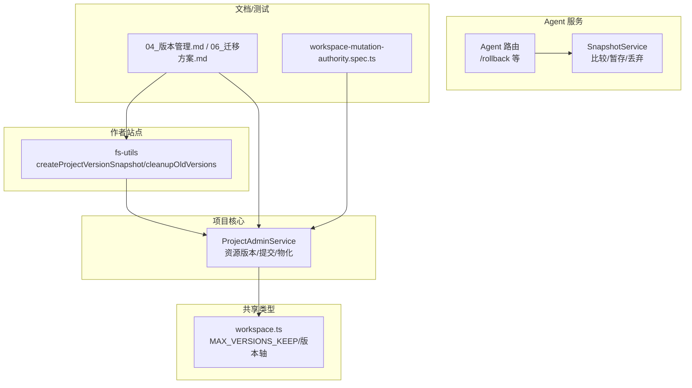
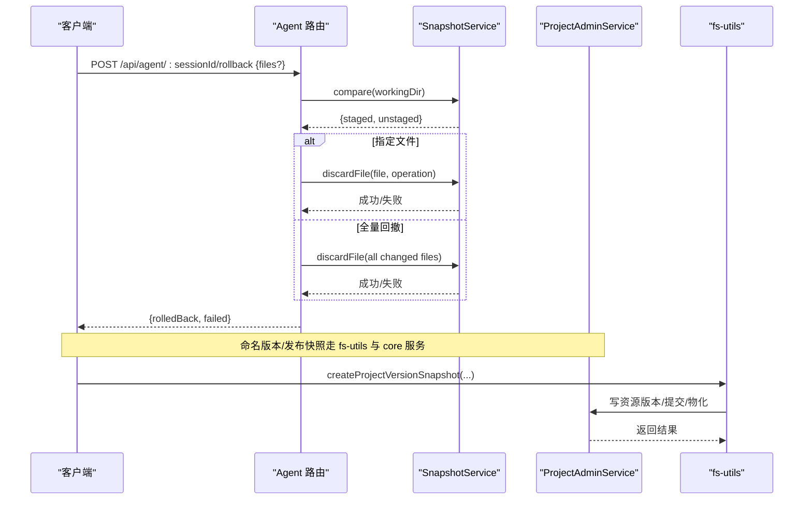
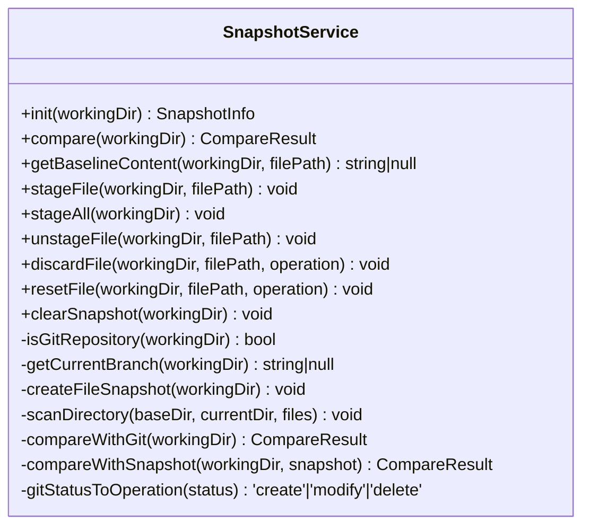
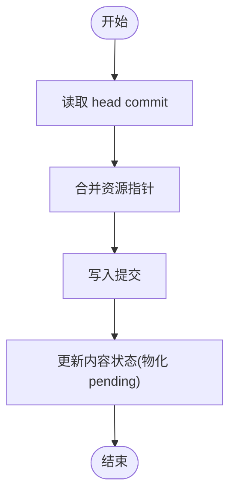
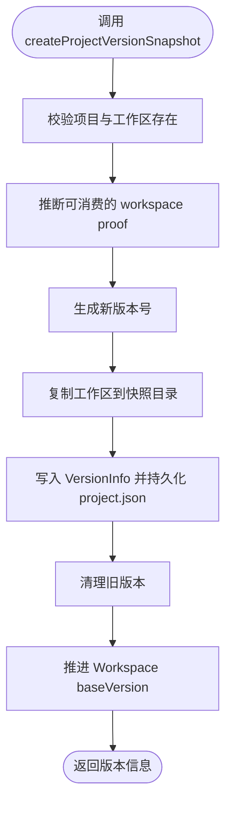
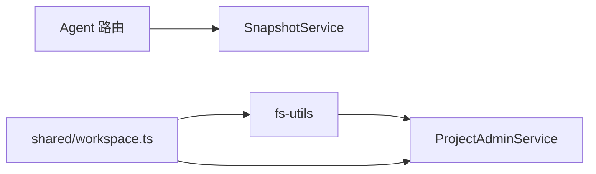
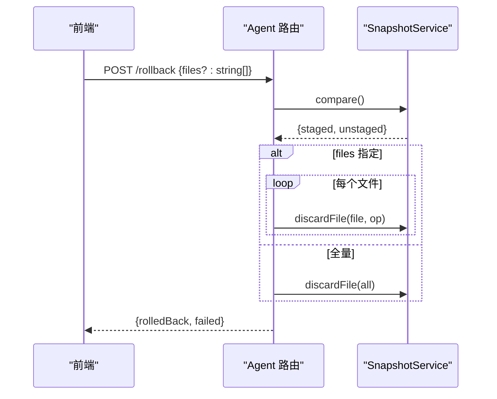
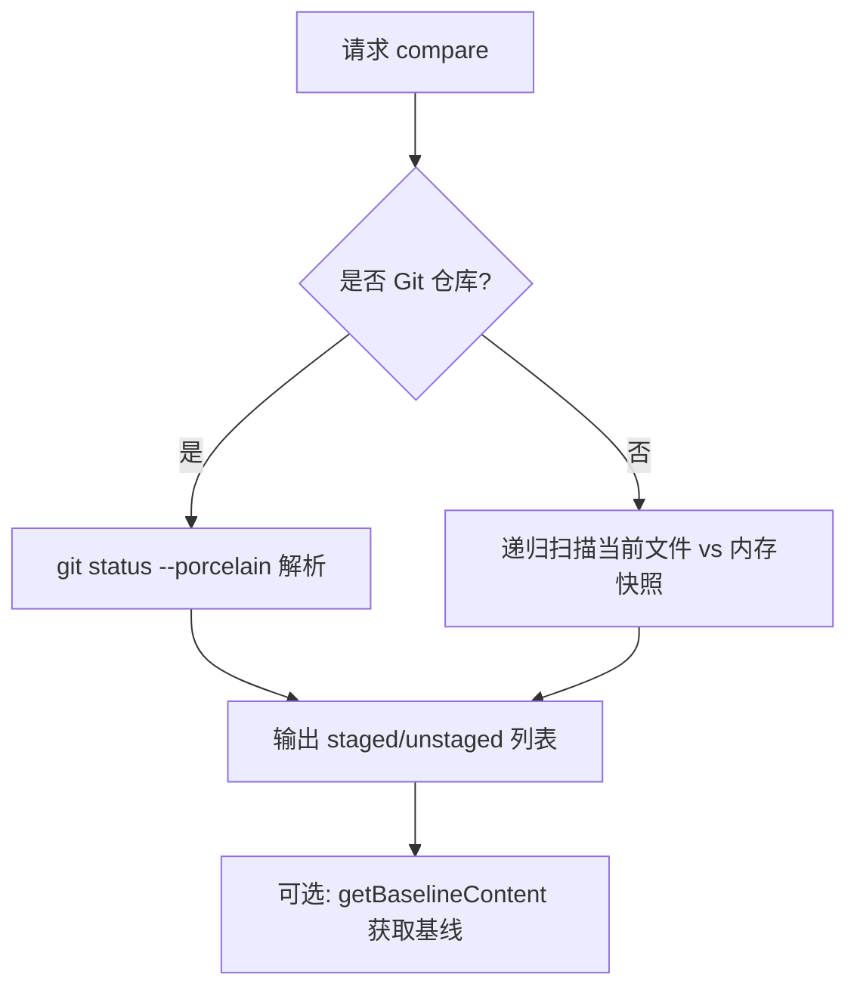

# 版本控制系统

<cite>
**本文引用的文件**
- [packages/agent-service/src/session/snapshot-service.ts](file://packages/agent-service/src/session/snapshot-service.ts)
- [packages/agent-service/src/routes/agent.ts](file://packages/agent-service/src/routes/agent.ts)
- [packages/project-core/src/service.ts](file://packages/project-core/src/service.ts)
- [packages/author-site/src/lib/fs-utils.ts](file://packages/author-site/src/lib/fs-utils.ts)
- [packages/shared/src/workspace.ts](file://packages/shared/src/workspace.ts)
- [docs/项目文档/创作端/03-项目管理/技术/04_版本管理.md](file://docs/项目文档/创作端/03-项目管理/技术/04_版本管理.md)
- [docs/项目文档/创作端/03-项目管理/技术/06_项目工作空间迁移方案.md](file://docs/项目文档/创作端/03-项目管理/技术/06_项目工作空间迁移方案.md)
- [docs/项目文档/独立Agent服务层/03-核心模块设计.md](file://docs/项目文档/独立Agent服务层/03-核心模块设计.md)
- [test/创作端E2E回归测试/workspace-mutation-authority.spec.ts](file://test/创作端E2E回归测试/workspace-mutation-authority.spec.ts)
</cite>

## 目录
1. [引言](#引言)
2. [项目结构](#项目结构)
3. [核心组件](#核心组件)
4. [架构总览](#架构总览)
5. [详细组件分析](#详细组件分析)
6. [依赖关系分析](#依赖关系分析)
7. [性能与差异计算](#性能与差异计算)
8. [回滚机制](#回滚机制)
9. [版本对比与代码审查](#版本对比与代码审查)
10. [最佳实践](#最佳实践)
11. [API 使用示例](#api-使用示例)
12. [故障排除指南](#故障排除指南)
13. [结论](#结论)

## 引言
本文件面向版本控制系统的实现与使用，围绕快照创建（增量/全量）、差异计算、版本历史管理（提交记录、变更追踪、标签）、回滚策略（单文件/页面级/项目级）、版本对比与合并冲突处理，以及发布流程与灾难恢复进行系统化说明。内容基于仓库中现有实现与文档，确保读者既能理解整体架构，也能落地到具体代码路径与接口。

## 项目结构
版本控制相关能力分布在以下层次：
- Agent 服务层：提供 Git/非 Git 两种模式的快照与差异能力，支撑会话级回撤。
- 项目核心服务：负责资源版本、内容图提交、物化与清理等核心逻辑。
- 作者站点工具：提供项目级版本快照生成、版本号生成、旧版本清理等工具函数。
- 共享类型：定义最大保留版本数、多轴版本类型等约束。
- 文档与测试：描述版本管理策略、迁移方案与并发冲突行为。

图表来源
- [packages/agent-service/src/session/snapshot-service.ts:14-339](file://packages/agent-service/src/session/snapshot-service.ts#L14-L339)
- [packages/agent-service/src/routes/agent.ts:368-430](file://packages/agent-service/src/routes/agent.ts#L368-L430)
- [packages/project-core/src/service.ts:4890-5089](file://packages/project-core/src/service.ts#L4890-L5089)
- [packages/author-site/src/lib/fs-utils.ts:1418-1572](file://packages/author-site/src/lib/fs-utils.ts#L1418-L1572)
- [packages/shared/src/workspace.ts:506-525](file://packages/shared/src/workspace.ts#L506-L525)
- [docs/项目文档/创作端/03-项目管理/技术/04_版本管理.md:1-174](file://docs/项目文档/创作端/03-项目管理/技术/04_版本管理.md#L1-L174)
- [docs/项目文档/创作端/03-项目管理/技术/06_项目工作空间迁移方案.md:1-422](file://docs/项目文档/创作端/03-项目管理/技术/06_项目工作空间迁移方案.md#L1-L422)
- [test/创作端E2E回归测试/workspace-mutation-authority.spec.ts:437-479](file://test/创作端E2E回归测试/workspace-mutation-authority.spec.ts#L437-L479)

章节来源
- [packages/agent-service/src/session/snapshot-service.ts:14-339](file://packages/agent-service/src/session/snapshot-service.ts#L14-L339)
- [packages/agent-service/src/routes/agent.ts:368-430](file://packages/agent-service/src/routes/agent.ts#L368-L430)
- [packages/project-core/src/service.ts:4890-5089](file://packages/project-core/src/service.ts#L4890-L5089)
- [packages/author-site/src/lib/fs-utils.ts:1418-1572](file://packages/author-site/src/lib/fs-utils.ts#L1418-L1572)
- [packages/shared/src/workspace.ts:506-525](file://packages/shared/src/workspace.ts#L506-L525)
- [docs/项目文档/创作端/03-项目管理/技术/04_版本管理.md:1-174](file://docs/项目文档/创作端/03-项目管理/技术/04_版本管理.md#L1-L174)
- [docs/项目文档/创作端/03-项目管理/技术/06_项目工作空间迁移方案.md:1-422](file://docs/项目文档/创作端/03-项目管理/技术/06_项目工作空间迁移方案.md#L1-L422)
- [test/创作端E2E回归测试/workspace-mutation-authority.spec.ts:437-479](file://test/创作端E2E回归测试/workspace-mutation-authority.spec.ts#L437-L479)

## 核心组件
- SnapshotService（Agent 服务）
  - 职责：初始化基准（Git 或内存快照）、比较变更、暂存/取消暂存、丢弃文件、获取基线内容。
  - 模式：若工作区为 Git 仓库，则通过 git 命令执行；否则在内存维护文件内容与 mtime 的快照映射。
- ProjectAdminService（项目核心）
  - 职责：资源版本读写、内容图提交、blob 存储、合并指针、读取/写入提交、物化状态更新。
- fs-utils（作者站点）
  - 职责：版本号生成、旧版本清理、项目级快照创建（含 workspace proof 消费与推进）。
- 共享类型
  - 职责：定义 MAX_VERSIONS_KEEP、版本轴类型（project-base-version、workspace-revision、canonical-synced-revision）。

章节来源
- [packages/agent-service/src/session/snapshot-service.ts:14-339](file://packages/agent-service/src/session/snapshot-service.ts#L14-L339)
- [packages/project-core/src/service.ts:4890-5089](file://packages/project-core/src/service.ts#L4890-L5089)
- [packages/author-site/src/lib/fs-utils.ts:1418-1572](file://packages/author-site/src/lib/fs-utils.ts#L1418-L1572)
- [packages/shared/src/workspace.ts:506-525](file://packages/shared/src/workspace.ts#L506-L525)

## 架构总览
版本控制由“会话级快照”和“项目级版本/内容图”两层组成：
- 会话级快照：用于快速回撤与差异展示，支持 Git 与非 Git 两种模式。
- 项目级版本/内容图：用于不可变的历史记录、资源版本、提交审计与发布追溯。

图表来源
- [packages/agent-service/src/routes/agent.ts:368-430](file://packages/agent-service/src/routes/agent.ts#L368-L430)
- [packages/agent-service/src/session/snapshot-service.ts:108-339](file://packages/agent-service/src/session/snapshot-service.ts#L108-L339)
- [packages/author-site/src/lib/fs-utils.ts:1454-1539](file://packages/author-site/src/lib/fs-utils.ts#L1454-L1539)
- [packages/project-core/src/service.ts:4890-5089](file://packages/project-core/src/service.ts#L4890-L5089)

## 详细组件分析

### 快照服务（SnapshotService）
- 初始化
  - 检测是否为 Git 仓库；若是，记录分支信息；否则扫描工作区建立内存快照。
- 比较算法
  - Git 模式：解析 `git status --porcelain`，区分 staged/unstaged，并映射操作类型。
  - 非 Git 模式：递归遍历当前文件集合，与内存快照比对 content/mtime，识别新增/修改/删除。
- 基线与暂存
  - 支持从 HEAD 或内存快照获取基线内容；支持 add/reset 等操作（仅 Git 模式）。
- 回撤
  - Git 模式：新建文件直接删除，其他操作通过 checkout HEAD 恢复。
  - 非 Git 模式：根据操作类型恢复或删除文件。

图表来源
- [packages/agent-service/src/session/snapshot-service.ts:14-339](file://packages/agent-service/src/session/snapshot-service.ts#L14-L339)

章节来源
- [packages/agent-service/src/session/snapshot-service.ts:14-339](file://packages/agent-service/src/session/snapshot-service.ts#L14-L339)
- [docs/项目文档/独立Agent服务层/03-核心模块设计.md:198-203](file://docs/项目文档/独立Agent服务层/03-核心模块设计.md#L198-L203)

### 项目核心（ProjectAdminService）
- 提交与资源版本
  - 写入/读取提交、资源版本、blob；按内容哈希去重存储。
  - 合并资源指针，维护 head commit 与物化状态。
- 关键流程
  - 创建内容提交时携带审计信息与 workspace proof（id/revision/rootHash）。
  - 列表读取提交时按时间倒序排序。

图表来源
- [packages/project-core/src/service.ts:4981-5055](file://packages/project-core/src/service.ts#L4981-L5055)

章节来源
- [packages/project-core/src/service.ts:4890-5089](file://packages/project-core/src/service.ts#L4890-L5089)

### 作者站点工具（fs-utils）
- 版本号生成
  - 基于现有版本序列推导下一个 vN。
- 旧版本清理
  - 优先删除自动保存记录，超出上限后逐步删除其他记录。
- 项目级快照创建
  - 复制工作区到 snapshots，记录 fileCount、workspaceId/revision/rootHash，推进 baseVersion。

图表来源
- [packages/author-site/src/lib/fs-utils.ts:1418-1572](file://packages/author-site/src/lib/fs-utils.ts#L1418-L1572)

章节来源
- [packages/author-site/src/lib/fs-utils.ts:1418-1572](file://packages/author-site/src/lib/fs-utils.ts#L1418-L1572)
- [docs/项目文档/创作端/03-项目管理/技术/06_项目工作空间迁移方案.md:150-218](file://docs/项目文档/创作端/03-项目管理/技术/06_项目工作空间迁移方案.md#L150-L218)

## 依赖关系分析
- Agent 服务依赖 SnapshotService 完成会话级差异与回撤。
- 作者站点工具依赖共享类型常量与文件系统工具，驱动项目级版本与清理。
- 项目核心服务作为权威数据源，维护资源版本、提交与 blob。

图表来源
- [packages/agent-service/src/routes/agent.ts:368-430](file://packages/agent-service/src/routes/agent.ts#L368-L430)
- [packages/agent-service/src/session/snapshot-service.ts:14-339](file://packages/agent-service/src/session/snapshot-service.ts#L14-L339)
- [packages/author-site/src/lib/fs-utils.ts:1418-1572](file://packages/author-site/src/lib/fs-utils.ts#L1418-L1572)
- [packages/project-core/src/service.ts:4890-5089](file://packages/project-core/src/service.ts#L4890-L5089)
- [packages/shared/src/workspace.ts:506-525](file://packages/shared/src/workspace.ts#L506-L525)

章节来源
- [packages/agent-service/src/routes/agent.ts:368-430](file://packages/agent-service/src/routes/agent.ts#L368-L430)
- [packages/agent-service/src/session/snapshot-service.ts:14-339](file://packages/agent-service/src/session/snapshot-service.ts#L14-L339)
- [packages/author-site/src/lib/fs-utils.ts:1418-1572](file://packages/author-site/src/lib/fs-utils.ts#L1418-L1572)
- [packages/project-core/src/service.ts:4890-5089](file://packages/project-core/src/service.ts#L4890-L5089)
- [packages/shared/src/workspace.ts:506-525](file://packages/shared/src/workspace.ts#L506-L525)

## 性能与差异计算
- Git 模式差异
  - 通过 `git status --porcelain` 一次性获取变更集，复杂度近似 O(n)（n 为变更文件数），适合大规模仓库。
- 非 Git 模式差异
  - 递归遍历工作区，逐文件读取内容与 stat，时间复杂度 O(N log N) 或 O(N) 取决于文件系统与过滤策略；对大项目建议限制扫描范围或引入增量扫描。
- 内存快照
  - 以 Map 存储相对路径到内容与 mtime，查找与插入均为 O(1)，但会占用较多内存；适用于小项目或短期会话。

章节来源
- [packages/agent-service/src/session/snapshot-service.ts:108-229](file://packages/agent-service/src/session/snapshot-service.ts#L108-L229)

## 回滚机制
- 单文件回滚
  - 通过 `/api/agent/:sessionId/rollback` 传入目标文件列表，服务端比较变更后逐一 discard。
- 全量回滚
  - 不传 files 时，对所有 staged/unstaged 变更执行 discard。
- 页面级回滚
  - 通过资源版本恢复接口只恢复目标页面，不影响无关资源；live Workspace 下先经 Authority receipt，再提交语义 restore commit。
- 项目级回滚
  - 整项目覆盖恢复入口已下线；如需回退具体内容，应从资源历史进入恢复流程。

图表来源
- [packages/agent-service/src/routes/agent.ts:368-430](file://packages/agent-service/src/routes/agent.ts#L368-L430)
- [packages/agent-service/src/session/snapshot-service.ts:298-333](file://packages/agent-service/src/session/snapshot-service.ts#L298-L333)

章节来源
- [packages/agent-service/src/routes/agent.ts:368-430](file://packages/agent-service/src/routes/agent.ts#L368-L430)
- [docs/项目文档/创作端/03-项目管理/技术/04_版本管理.md:149-158](file://docs/项目文档/创作端/03-项目管理/技术/04_版本管理.md#L149-L158)

## 版本对比与代码审查
- 文件差异显示
  - 通过 compare 返回 staged/unstaged 列表，包含 path 与 operation（create/modify/delete）。
- 代码审查支持
  - 结合 getBaselineContent 获取基线内容，便于前后端渲染 diff。
- 合并冲突解决
  - 当并发编辑导致 revision 不一致时，服务端返回 409 Conflict；客户端需拉取最新内容并重新提交。

图表来源
- [packages/agent-service/src/session/snapshot-service.ts:108-254](file://packages/agent-service/src/session/snapshot-service.ts#L108-L254)
- [test/创作端E2E回归测试/workspace-mutation-authority.spec.ts:437-479](file://test/创作端E2E回归测试/workspace-mutation-authority.spec.ts#L437-L479)

章节来源
- [packages/agent-service/src/session/snapshot-service.ts:108-254](file://packages/agent-service/src/session/snapshot-service.ts#L108-L254)
- [test/创作端E2E回归测试/workspace-mutation-authority.spec.ts:437-479](file://test/创作端E2E回归测试/workspace-mutation-authority.spec.ts#L437-L479)

## 最佳实践
- 分支策略
  - 使用 live Workspace 作为活跃编辑区，关键动作前强制 flush 并推进 canonical proof，避免 stale 状态。
- 发布流程
  - 发布前同步工作区，生成发布快照并绑定 protected 提交；产物中的图片资源本地化规则遵循发布规范。
- 灾难恢复
  - 资源级恢复优先于整项目覆盖；保留内容图与 blob，确保可审计与可追溯。
- 版本清理
  - 最多保留 50 条，优先淘汰自动保存记录；受保护提交与被引用 blob 不参与清理。

章节来源
- [docs/项目文档/创作端/03-项目管理/技术/04_版本管理.md:115-166](file://docs/项目文档/创作端/03-项目管理/技术/04_版本管理.md#L115-L166)
- [packages/shared/src/workspace.ts:515-525](file://packages/shared/src/workspace.ts#L515-L525)

## API 使用示例
- 会话回撤
  - 路径：POST /api/agent/:sessionId/rollback
  - 请求体：{ files?: string[] }
  - 响应：{ success: true, data: { sessionId, rolledBack, failed } }
- 版本历史查询
  - 路径：GET /api/projects/:projectId/versions
  - 响应：{ success: true, data: { currentVersion, versions, totalVersions } }
- 资源版本恢复
  - 路径：POST /api/projects/:projectId/resources/:kind/:resourceId/versions/:versionId
  - 行为：仅恢复目标资源，生成语义恢复记录

章节来源
- [packages/agent-service/src/routes/agent.ts:368-430](file://packages/agent-service/src/routes/agent.ts#L368-L430)
- [docs/项目文档/创作端/03-项目管理/技术/06_项目工作空间迁移方案.md:300-336](file://docs/项目文档/创作端/03-项目管理/技术/06_项目工作空间迁移方案.md#L300-L336)

## 故障排除指南
- 回撤失败
  - 检查 workingDir 是否为有效 Git 仓库；若非 Git，确认内存快照是否存在。
  - 查看日志中 discardFile 的错误码与堆栈。
- 并发冲突
  - 出现 409 Conflict 时，拉取最新内容并重新提交；避免使用过期 revision。
- 版本缺失
  - 确认 snapshots 目录未被手动删除；若被误删，将无法通过该版本恢复。
- 清理异常
  - 超过 50 条版本时，确认自动保存记录是否可删除；受保护提交与引用 blob 不应被清理。

章节来源
- [packages/agent-service/src/session/snapshot-service.ts:298-339](file://packages/agent-service/src/session/snapshot-service.ts#L298-L339)
- [test/创作端E2E回归测试/workspace-mutation-authority.spec.ts:437-479](file://test/创作端E2E回归测试/workspace-mutation-authority.spec.ts#L437-L479)
- [docs/项目文档/创作端/03-项目管理/技术/06_项目工作空间迁移方案.md:402-422](file://docs/项目文档/创作端/03-项目管理/技术/06_项目工作空间迁移方案.md#L402-L422)

## 结论
本系统通过“会话级快照 + 项目级版本/内容图”的双层模型，兼顾了快速回撤与长期可追溯性。差异计算在 Git 与非 Git 模式下分别优化，版本历史与资源版本保证不可变性与审计能力。配合严格的并发控制与清理策略，系统在易用性、可靠性与扩展性之间取得平衡。建议在生产环境严格遵循发布与回滚流程，并持续监控磁盘与内存使用，确保稳定性。