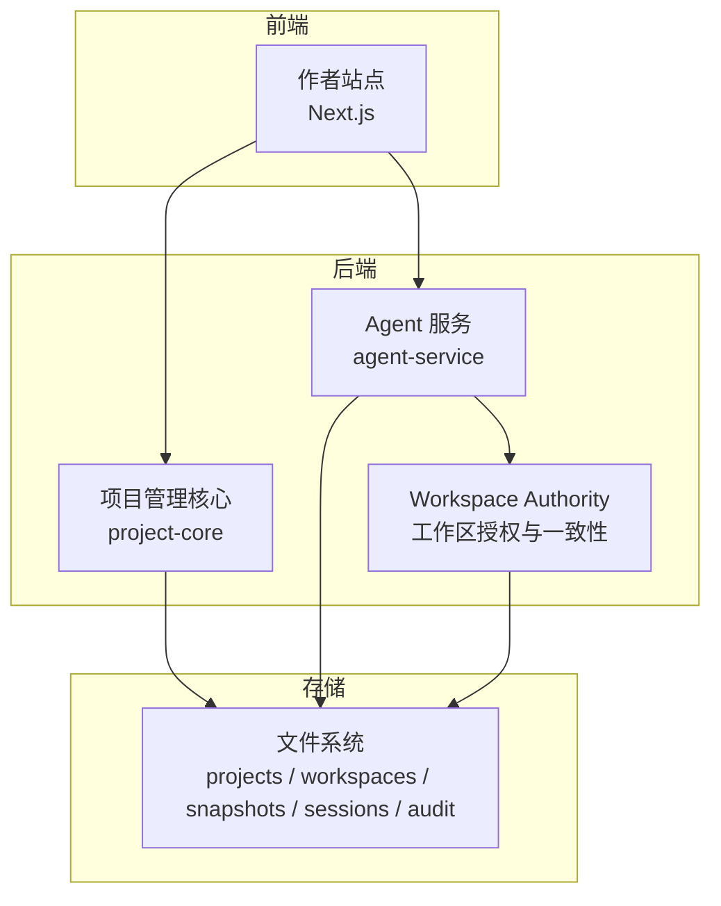
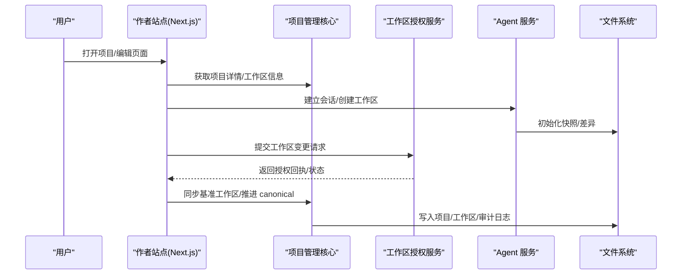
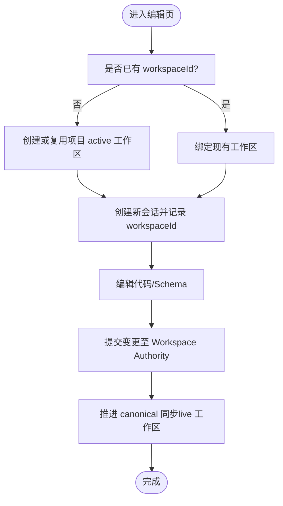
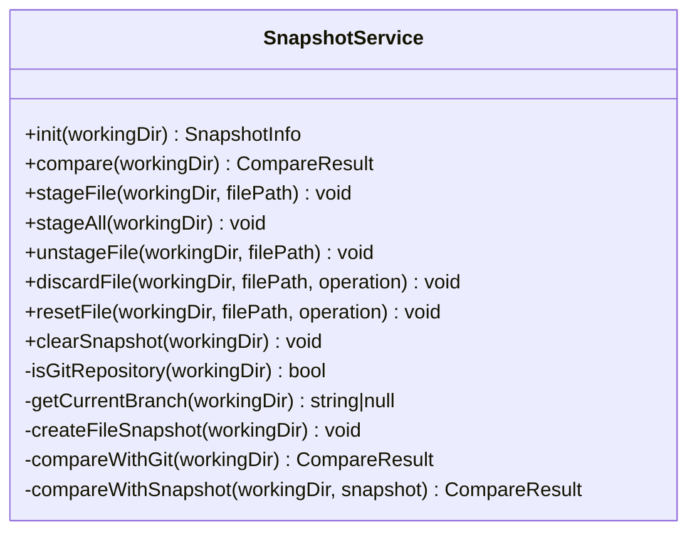
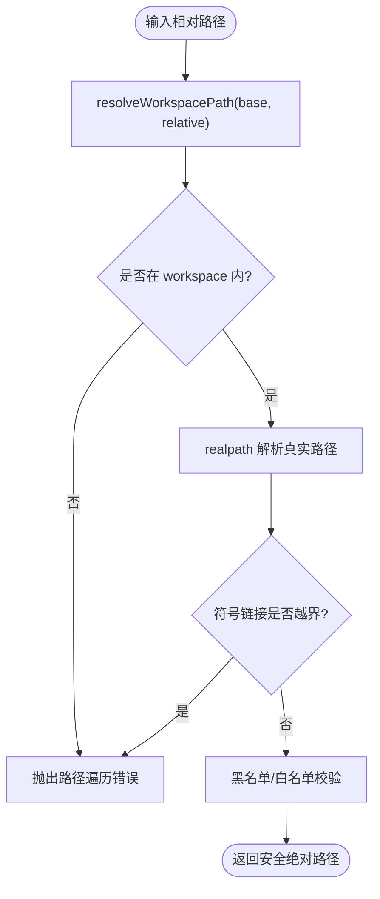
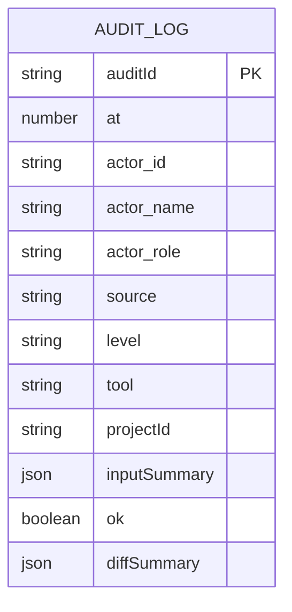
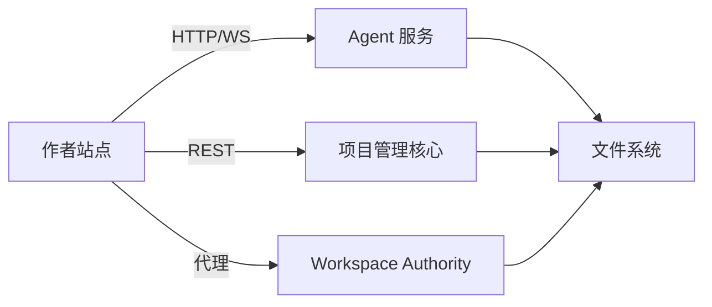

# 项目管理系统

<cite>
**本文引用的文件列表**
- [package.json](file://package.json)
- [service.ts](file://packages/project-core/src/service.ts)
- [types.ts](file://packages/project-core/src/types.ts)
- [07_工作空间对话解耦.md](file://docs/项目文档/创作端/03-项目管理/技术/07_工作空间对话解耦.md)
- [fs-utils.ts](file://packages/author-site/src/lib/fs-utils.ts)
- [session-manager.ts](file://packages/author-site/src/lib/session-manager.ts)
- [workspace-authority-client.ts](file://packages/author-site/src/lib/workspace-authority-client.ts)
- [route.ts（Workspace Authority 代理）](file://packages/author-site/src/app/api/workspace-authority/[projectId]/[workspaceId]/[...segments]/route.ts)
- [snapshot-service.ts](file://packages/agent-service/src/session/snapshot-service.ts)
- [workspace-manager.ts](file://packages/agent-service/src/workspace/workspace-manager.ts)
- [utils.ts（路径工具）](file://packages/agent-service/src/workspace/utils.ts)
- [session-guard.ts（路径校验与变更检测）](file://packages/agent-service/src/session/session-guard.ts)
- [agent.ts（回撤 API）](file://packages/agent-service/src/routes/agent.ts)
- [websocket.ts（会话初始化）](file://packages/agent-service/src/routes/websocket.ts)
- [workspace-authority.ts（快照/健康接口）](file://packages/agent-service/src/routes/workspace-authority.ts)
- [check-workspace-authority-guards.mjs](file://scripts/check-workspace-authority-guards.mjs)
- [audit_*.json（审计日志样例）](file://data/audit/project-admin/2026-07-01/audit_1782929116138_2fiel1.json)
</cite>

## 目录
1. [简介](#简介)
2. [项目结构](#项目结构)
3. [核心组件](#核心组件)
4. [架构总览](#架构总览)
5. [详细组件分析](#详细组件分析)
6. [依赖关系分析](#依赖关系分析)
7. [性能考量](#性能考量)
8. [故障排查指南](#故障排查指南)
9. [结论](#结论)
10. [附录：API 与管理操作示例](#附录api-与管理操作示例)

## 简介
本项目管理系统围绕“多租户隔离、工作空间管理、版本控制、文件操作抽象层、审计日志”五大主题构建，提供从项目创建、页面编辑、AI 协作到发布与回滚的完整生命周期能力。系统采用前后端分离与微服务化思路：
- 创作端（Next.js）负责用户交互与编排；
- 项目管理核心（project-core）负责项目元数据、模板、工作区与发布产物等持久化；
- Agent 服务（agent-service）负责会话、工作区实例、快照与差异计算、权限校验与回撤；
- Workspace Authority 作为工作区变更授权与一致性保障的中间层。

本技术文档面向开发者与运维人员，既提供高层架构说明，也深入到关键模块的实现细节与调用流程，帮助读者快速理解并扩展系统。

## 项目结构
仓库为 monorepo，核心包包括 author-site（创作端）、project-core（项目管理核心）、agent-service（Agent 服务），以及共享契约 shared 等。根脚本统一编排开发、测试、检查与部署任务。

图表来源
- [package.json:1-101](file://package.json#L1-L101)
- [service.ts:492-530](file://packages/project-core/src/service.ts#L492-L530)
- [workspace-manager.ts:1-52](file://packages/agent-service/src/workspace/workspace-manager.ts#L1-L52)

章节来源
- [package.json:1-101](file://package.json#L1-L101)

## 核心组件
- 项目管理核心（ProjectAdminService）
  - 负责项目、页面、模板、工作区、快照、发布产物、审计目录等数据目录的组织与读写；
  - 提供项目 CRUD、导出包、运行时校验、版本历史、配置管理等能力；
  - 通过可选的 workspaceAuthorityPort 与工作区授权服务通信，确保 live 工作区变更的一致性。
- 工作区与会话管理
  - 将 Session 与 Workspace 解耦，支持项目级 live 工作区与显式分支/legacy 工作区；
  - 会话仅保存消息与状态，并通过 workspaceId 关联到具体工作区。
- 快照与差异
  - 对 Git 仓库与非 Git 目录分别实现快照与差异比较；
  - 支持暂存、取消暂存、丢弃修改、重置文件等操作。
- 文件操作抽象层
  - 路径规范化、越界访问防护、符号链接安全校验；
  - 黑名单与白名单策略，避免访问敏感或系统目录。
- 审计日志
  - 记录操作者、时间、资源、输入摘要、结果与变更摘要；
  - 按日期分目录归档，便于合规审查与问题回溯。

章节来源
- [service.ts:492-530](file://packages/project-core/src/service.ts#L492-L530)
- [07_工作空间对话解耦.md:1-185](file://docs/项目文档/创作端/03-项目管理/技术/07_工作空间对话解耦.md#L1-L185)
- [snapshot-service.ts:1-342](file://packages/agent-service/src/session/snapshot-service.ts#L1-L342)
- [utils.ts:46-76](file://packages/agent-service/src/workspace/utils.ts#L46-L76)
- [session-guard.ts:76-133](file://packages/agent-service/src/session/session-guard.ts#L76-L133)
- [audit_*.json:1-23](file://data/audit/project-admin/2026-07-01/audit_1782929116138_2fiel1.json#L1-L23)

## 架构总览
系统以“项目为核心”，围绕“工作区”进行多会话协作与版本控制，同时通过“Workspace Authority”保证工作区变更的一致性与可追溯性。

图表来源
- [route.ts（Workspace Authority 代理）:1-26](file://packages/author-site/src/app/api/workspace-authority/[projectId]/[workspaceId]/[...segments]/route.ts#L1-L26)
- [workspace-authority-client.ts:219-244](file://packages/author-site/src/lib/workspace-authority-client.ts#L219-L244)
- [websocket.ts:255-283](file://packages/agent-service/src/routes/websocket.ts#L255-L283)
- [service.ts:492-530](file://packages/project-core/src/service.ts#L492-L530)

## 详细组件分析

### 多租户架构设计（用户隔离、权限控制、资源分配）
- 用户隔离
  - 工作区目录按用户维度组织，结合项目 ID 形成唯一路径；
  - 会话目录按用户与项目维度组织，仅保存会话元数据与消息。
- 权限控制
  - 通过 Actor 模型（admin/creator/readonly）与 allowedProjectIds 限制访问范围；
  - 工作区变更需经 Workspace Authority 授权，防止并发冲突与不一致。
- 资源分配
  - 临时工作区位于系统临时目录，命名带前缀标识；
  - 项目级 live 工作区与显式分支/legacy 工作区并存，按需复用或创建。

章节来源
- [fs-utils.ts:1713-1762](file://packages/author-site/src/lib/fs-utils.ts#L1713-L1762)
- [types.ts:28-36](file://packages/project-core/src/types.ts#L28-L36)
- [workspace-manager.ts:1-52](file://packages/agent-service/src/workspace/workspace-manager.ts#L1-L52)
- [07_工作空间对话解耦.md:55-76](file://docs/项目文档/创作端/03-项目管理/技术/07_工作空间对话解耦.md#L55-L76)

### 工作空间管理机制（基准、分支、Session 工作区及转换流程）
- 概念
  - 基准工作区（live）：项目默认工作区，所有会话默认共享；
  - 分支工作区：显式创建的独立工作区，用于实验或事务性变更；
  - Session 工作区：会话仅持有 workspaceId，不直接持有文件。
- 转换流程
  - 新建会话时，若未指定 workspaceId，则绑定项目 active 工作区；
  - 切换会话时，仅切换 AI 上下文，不重置代码/Schema；
  - 归档/放弃/过期会话清理时，保护 live 工作区不被删除。
- 关键函数
  - getOrCreateProjectActiveWorkspace、materializeCanonicalWorkspace、createWorkspace、findActiveWorkspace、findWorkspacePath、getWorkspaceFiles、updateWorkspaceFiles、deleteWorkspace。

图表来源
- [07_工作空间对话解耦.md:83-106](file://docs/项目文档/创作端/03-项目管理/技术/07_工作空间对话解耦.md#L83-L106)
- [session-manager.ts:368-399](file://packages/author-site/src/lib/session-manager.ts#L368-L399)
- [check-workspace-authority-guards.mjs:1278-1305](file://scripts/check-workspace-authority-guards.mjs#L1278-L1305)

章节来源
- [07_工作空间对话解耦.md:1-185](file://docs/项目文档/创作端/03-项目管理/技术/07_工作空间对话解耦.md#L1-L185)
- [session-manager.ts:368-399](file://packages/author-site/src/lib/session-manager.ts#L368-L399)

### 版本控制系统实现（快照、差异、回滚）
- 快照模式
  - Git 仓库：基于 git status 与 HEAD 内容；
  - 非 Git 目录：内存中维护文件内容与 mtime 快照。
- 差异计算
  - 对比当前文件与快照/HEAD，生成 staged/unstaged 变更集；
  - 支持新增、修改、删除三类操作。
- 回滚机制
  - 支持单文件或全量回撤；
  - Git 模式使用 checkout/reset；非 Git 模式恢复快照内容或删除新增文件。

图表来源
- [snapshot-service.ts:1-342](file://packages/agent-service/src/session/snapshot-service.ts#L1-L342)

章节来源
- [snapshot-service.ts:1-342](file://packages/agent-service/src/session/snapshot-service.ts#L1-L342)
- [agent.ts:396-430](file://packages/agent-service/src/routes/agent.ts#L396-L430)

### 文件操作抽象层（路径规范化、权限验证、并发控制）
- 路径规范化
  - normalizeWorkspacePath 统一解析绝对路径；
  - resolveWorkspacePath 在相对路径基础上做安全校验。
- 权限验证
  - isPathInsideWorkspace 防止路径遍历攻击；
  - session-guard.validatePath 额外校验符号链接指向；
  - 黑名单策略拒绝 node_modules、隐藏状态文件、monorepo 源目录等。
- 并发控制
  - 通过 Workspace Authority 的 revision/rootHash 与回执机制，避免覆盖写；
  - 会话切换与归档时对 live 工作区进行保护。

图表来源
- [utils.ts:46-76](file://packages/agent-service/src/workspace/utils.ts#L46-L76)
- [session-guard.ts:76-133](file://packages/agent-service/src/session/session-guard.ts#L76-L133)
- [permissions.test.ts:34-56](file://packages/agent-service/tests/unit/permissions.test.ts#L34-L56)

章节来源
- [utils.ts:46-76](file://packages/agent-service/src/workspace/utils.ts#L46-L76)
- [session-guard.ts:76-133](file://packages/agent-service/src/session/session-guard.ts#L76-L133)
- [permissions.test.ts:34-56](file://packages/agent-service/tests/unit/permissions.test.ts#L34-L56)

### 审计日志系统（操作记录、变更追踪、合规性）
- 记录要素
  - 操作者（id/name/role/source）、时间戳、级别、工具名、资源 ID、输入摘要、成功标志、变更摘要。
- 存储结构
  - 按日期分目录存放 JSON 文件，便于检索与归档。
- 合规性
  - 敏感字段脱敏、长文本截断；
  - 关键边界事件（如 finish）必须记录，便于审计与排障。

图表来源
- [audit_*.json:1-23](file://data/audit/project-admin/2026-07-01/audit_1782929116138_2fiel1.json#L1-L23)

章节来源
- [audit_*.json:1-23](file://data/audit/project-admin/2026-07-01/audit_1782929116138_2fiel1.json#L1-L23)

## 依赖关系分析
- 前端（author-site）
  - 通过 Next.js Route 代理 Workspace Authority 请求，携带认证与会话上下文；
  - 使用 workspace-authority-client 封装快照与健康查询；
  - 通过 session-manager 与 fs-utils 协调会话与工作区。
- 后端（project-core）
  - 管理数据目录与项目元数据；
  - 通过 workspaceAuthorityPort 与工作区授权服务交互，确保 live 工作区一致性。
- Agent 服务（agent-service）
  - 管理临时/用户工作区实例；
  - 提供快照与差异、路径安全校验、回撤 API；
  - WebSocket 初始化会话时自动创建/绑定工作区与快照。

图表来源
- [route.ts（Workspace Authority 代理）:1-26](file://packages/author-site/src/app/api/workspace-authority/[projectId]/[workspaceId]/[...segments]/route.ts#L1-L26)
- [workspace-authority-client.ts:219-244](file://packages/author-site/src/lib/workspace-authority-client.ts#L219-L244)
- [service.ts:492-530](file://packages/project-core/src/service.ts#L492-L530)
- [websocket.ts:255-283](file://packages/agent-service/src/routes/websocket.ts#L255-L283)

章节来源
- [route.ts（Workspace Authority 代理）:1-26](file://packages/author-site/src/app/api/workspace-authority/[projectId]/[workspaceId]/[...segments]/route.ts#L1-L26)
- [workspace-authority-client.ts:219-244](file://packages/author-site/src/lib/workspace-authority-client.ts#L219-L244)
- [service.ts:492-530](file://packages/project-core/src/service.ts#L492-L530)
- [websocket.ts:255-283](file://packages/agent-service/src/routes/websocket.ts#L255-L283)

## 性能考量
- 快照扫描
  - 非 Git 模式下递归扫描文件并缓存内容与 mtime，建议对大仓库优先使用 Git 模式以减少内存占用；
- 差异计算
  - Git 模式利用 git status 增量输出，避免全量读取；
- 并发与一致性
  - 通过 Workspace Authority 的 revision/rootHash 与回执减少冲突重试；
- I/O 优化
  - 批量操作受 maxBatchSize 限制，避免单次过大负载；
  - 审计日志异步落盘，失败不影响主流程。

## 故障排查指南
- 路径越界/符号链接攻击
  - 现象：路径校验失败或抛出越界错误；
  - 排查：检查 validatePath 与 resolveWorkspacePath 的返回值与异常信息；
  - 参考：[session-guard.ts:76-133](file://packages/agent-service/src/session/session-guard.ts#L76-L133)、[utils.ts:46-76](file://packages/agent-service/src/workspace/utils.ts#L46-L76)。
- 快照不可用/差异为空
  - 现象：compare 返回空变更集；
  - 排查：确认 init 是否执行、是否为 Git 仓库、是否存在 .workbench-snapshot；
  - 参考：[snapshot-service.ts:17-37](file://packages/agent-service/src/session/snapshot-service.ts#L17-L37)。
- 工作区一致性报错
  - 现象：WORKSPACE_STALE 或授权失败；
  - 排查：检查 canonicalSyncedRevision/rootHash 与 Workspace Authority 健康接口；
  - 参考：[service.ts:702-723](file://packages/project-core/src/service.ts#L702-L723)、[workspace-authority.ts:195-213](file://packages/agent-service/src/routes/workspace-authority.ts#L195-L213)。
- 会话清理误删 live 工作区
  - 现象：归档/过期后 live 工作区被删除；
  - 排查：确认清理逻辑中的 live 保护守卫；
  - 参考：[check-workspace-authority-guards.mjs:1278-1305](file://scripts/check-workspace-authority-guards.mjs#L1278-L1305)。

章节来源
- [session-guard.ts:76-133](file://packages/agent-service/src/session/session-guard.ts#L76-L133)
- [utils.ts:46-76](file://packages/agent-service/src/workspace/utils.ts#L46-L76)
- [snapshot-service.ts:17-37](file://packages/agent-service/src/session/snapshot-service.ts#L17-L37)
- [service.ts:702-723](file://packages/project-core/src/service.ts#L702-L723)
- [workspace-authority.ts:195-213](file://packages/agent-service/src/routes/workspace-authority.ts#L195-L213)
- [check-workspace-authority-guards.mjs:1278-1305](file://scripts/check-workspace-authority-guards.mjs#L1278-L1305)

## 结论
本系统通过清晰的多租户隔离、工作区与会话解耦、稳健的版本控制与文件安全抽象、完善的审计日志体系，构建了高可用、可扩展的项目管理平台。配合 Workspace Authority 的一致性保障，系统在并发协作与合规审计方面具备良好表现。后续可在快照压缩、差异增量传输、权限细粒度化等方面持续优化。

## 附录：API 与管理操作示例
- 工作区授权接口（GET/POST）
  - 路径：/api/workspace-authority/projects/:projectId/workspaces/:workspaceId/{state|snapshot|health|events|projection-acks|mutate|staging|reconcile/adopt|reconcile/restore|resources/*}
  - 说明：由作者站点路由代理，携带认证与会话上下文，转发至 Workspace Authority。
  - 参考：[route.ts（Workspace Authority 代理）:1-26](file://packages/author-site/src/app/api/workspace-authority/[projectId]/[workspaceId]/[...segments]/route.ts#L1-L26)
- 快照与健康查询
  - GET /api/workspace-authority/projects/:projectId/workspaces/:workspaceId/snapshot?sessionId=...
  - GET /api/workspace-authority/projects/:projectId/workspaces/:workspaceId/health?sessionId=...
  - 参考：[workspace-authority.ts:195-213](file://packages/agent-service/src/routes/workspace-authority.ts#L195-L213)
- 回撤 API（Agent 服务）
  - 支持指定文件或全量回撤，内部调用 snapshotService.compare/discardFile。
  - 参考：[agent.ts:396-430](file://packages/agent-service/src/routes/agent.ts#L396-L430)
- 会话初始化（WebSocket）
  - 连接时根据 workingDir 创建/验证工作区，并初始化快照模式。
  - 参考：[websocket.ts:255-283](file://packages/agent-service/src/routes/websocket.ts#L255-L283)
- 项目管理核心（ProjectAdminService）
  - 目录初始化、活工作区判断、发布索引重建、项目导出与校验等。
  - 参考：[service.ts:492-530](file://packages/project-core/src/service.ts#L492-L530)

章节来源
- [route.ts（Workspace Authority 代理）:1-26](file://packages/author-site/src/app/api/workspace-authority/[projectId]/[workspaceId]/[...segments]/route.ts#L1-L26)
- [workspace-authority.ts:195-213](file://packages/agent-service/src/routes/workspace-authority.ts#L195-L213)
- [agent.ts:396-430](file://packages/agent-service/src/routes/agent.ts#L396-L430)
- [websocket.ts:255-283](file://packages/agent-service/src/routes/websocket.ts#L255-L283)
- [service.ts:492-530](file://packages/project-core/src/service.ts#L492-L530)