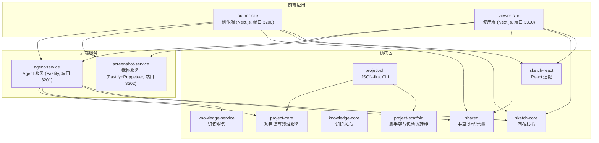
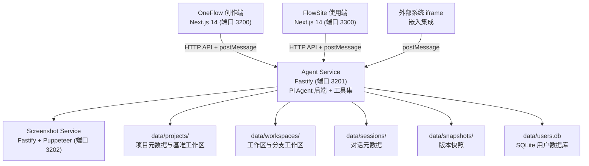
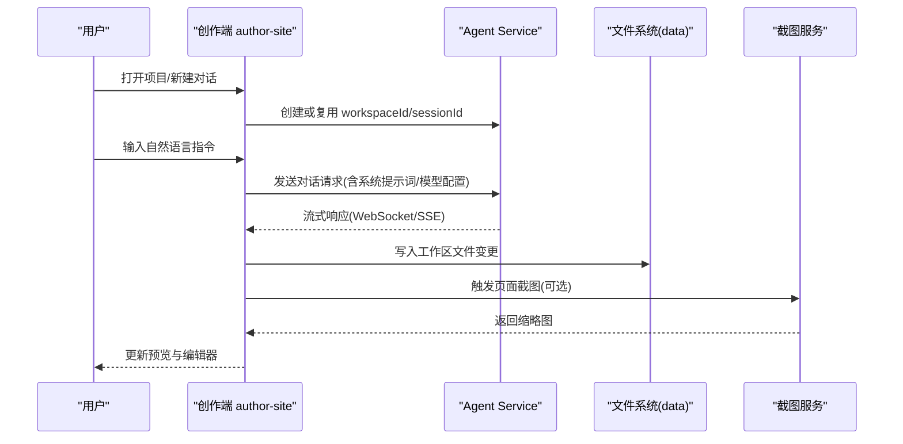
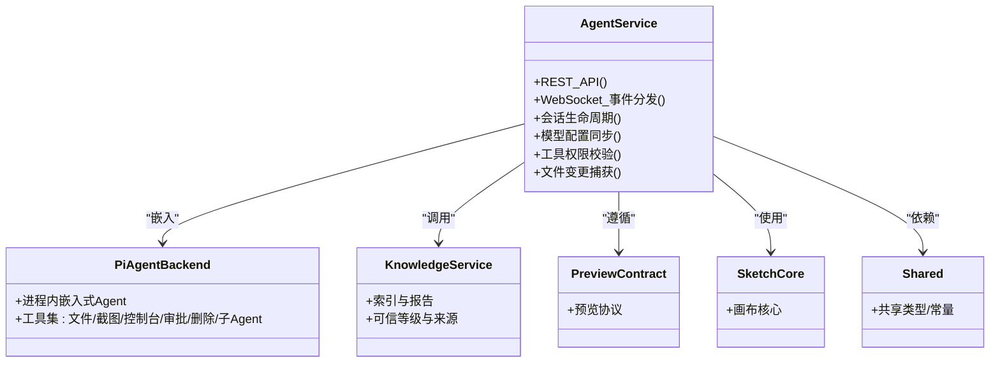
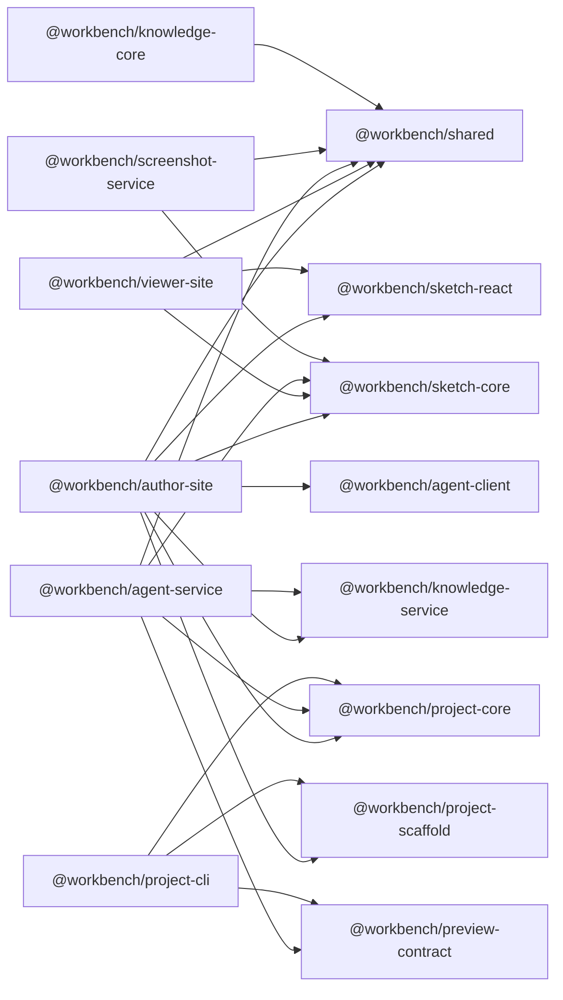

# 项目介绍

<cite>
**本文引用的文件列表**
- [package.json](file://package.json)
- [项目总览.md](file://docs/项目文档/项目总览.md)
- [agent-service/package.json](file://packages/agent-service/package.json)
- [author-site/package.json](file://packages/author-site/package.json)
- [viewer-site/package.json](file://packages/viewer-site/package.json)
- [screenshot-service/package.json](file://packages/screenshot-service/package.json)
- [project-core/package.json](file://packages/project-core/package.json)
- [project-scaffold/package.json](file://packages/project-scaffold/package.json)
- [project-cli/package.json](file://packages/project-cli/package.json)
- [knowledge-core/package.json](file://packages/knowledge-core/package.json)
</cite>

## 目录
1. [引言](#引言)
2. [项目结构](#项目结构)
3. [核心组件](#核心组件)
4. [架构总览](#架构总览)
5. [详细组件分析](#详细组件分析)
6. [依赖关系分析](#依赖关系分析)
7. [性能与可扩展性](#性能与可扩展性)
8. [故障排查指南](#故障排查指南)
9. [结论](#结论)
10. [附录：术语与参考](#附录术语与参考)

## 引言
Workbench 是一个面向组件化开发的 AI 辅助创作与使用平台，提供从组件设计、AI 辅助编码、配置管理到预览嵌入的完整工作流。其核心价值主张包括：
- 基于 Pi Agent 的自然语言编程环境：通过对话式指令驱动代码生成与修改，降低开发门槛，提升迭代效率。
- 组件化开发工作流：以 Schema 驱动的表单生成与动态编译，实现“配置即界面”的可视化编排。
- 实时预览系统：在创作端与使用端均提供低延迟的预览能力，支持即时反馈与快速验证。
- 多租户项目管理：以项目为边界组织工作区、会话与快照，支持多人协作与版本回溯。

技术愿景与设计理念围绕“解耦与复用”展开：将 AI 交互、预览渲染、截图生成、项目读写等能力拆分为独立服务与可复用包，通过清晰的 API 契约与数据协议进行集成，从而兼顾灵活性与稳定性。

目标用户群体与典型场景：
- 开发者/设计师：在创作端通过自然语言指令与可视化编辑协同完成组件开发与配置定义，结合知识库增强上下文理解。
- 产品/运营人员：在使用端浏览组件库、调整配置参数并预览效果，无需编写代码。
- 外部系统集成：通过 iframe + postMessage 协议将组件嵌入自有系统，动态传递配置与状态。

## 项目结构
仓库采用 Monorepo 组织方式，按功能域拆分多个子包，并通过脚本统一编排开发、构建与测试流程。顶层 package.json 提供了并行启动各服务的便捷命令，便于本地联调与演示。

图表来源
- [项目总览.md:99-119](file://docs/项目文档/项目总览.md#L99-L119)
- [author-site/package.json:6-14](file://packages/author-site/package.json#L6-L14)
- [viewer-site/package.json:6-14](file://packages/viewer-site/package.json#L6-L14)
- [agent-service/package.json:6-16](file://packages/agent-service/package.json#L6-L16)
- [screenshot-service/package.json:6-16](file://packages/screenshot-service/package.json#L6-L16)

章节来源
- [package.json:1-79](file://package.json#L1-L79)
- [项目总览.md:99-119](file://docs/项目文档/项目总览.md#L99-L119)

## 核心组件
- 创作端（author-site）
  - 职责：提供 OneFlow 创作体验，包含用户鉴权、Demo 管理、项目管理、配置与预览、AI 对话、知识库、嵌入 API 与管理后台等模块。
  - 关键特性：Schema 驱动表单生成、动态编译、实时预览、iframe 嵌入、JWT 无状态认证。
- 使用端（viewer-site）
  - 职责：提供 FlowSite 使用体验，用于浏览项目、调整配置参数、预览组件效果，支持独立部署与外部系统嵌入。
- Agent 服务（agent-service）
  - 职责：承载业务逻辑与 AI 交互，提供 REST API 与 WebSocket 事件分发；进程内嵌入 Pi Agent，提供文件操作、Schema 校验、控制台日志、截图、计划审批、页面删除、子 Agent 委派等工具集；负责会话生命周期、模型配置同步与权限校验。
- 截图服务（screenshot-service）
  - 职责：基于 Puppeteer 提供同步/异步页面截图能力，支持 LRU 编译缓存与浏览器池优化并发。
- 领域包
  - project-core：项目读写领域服务，供 Web API 与 CLI 复用。
  - project-scaffold：本地项目包协议与脚手架转换器。
  - project-cli：JSON-first 项目管理 CLI，暴露 ow / workbench-project-admin 命令。
  - knowledge-core / knowledge-service：知识核心与服务层，支撑工作空间内的参考文档管理与检索。
  - shared / sketch-core / sketch-react：共享类型与画布相关核心与 React 适配。

章节来源
- [项目总览.md:125-161](file://docs/项目文档/项目总览.md#L125-L161)
- [project-core/package.json:1-27](file://packages/project-core/package.json#L1-L27)
- [project-scaffold/package.json:1-21](file://packages/project-scaffold/package.json#L1-L21)
- [project-cli/package.json:1-31](file://packages/project-cli/package.json#L1-L31)
- [knowledge-core/package.json:1-20](file://packages/knowledge-core/package.json#L1-L20)

## 架构总览
整体架构由消费层（创作端、使用端、外部系统 iframe）、代理服务层（Agent Service）、截图服务与数据持久化组成。前后端通过 HTTP API 与 postMessage 协议通信，Agent 服务内部集成 Pi Agent 后端并提供丰富的工具集。

图表来源
- [项目总览.md:35-82](file://docs/项目文档/项目总览.md#L35-L82)

章节来源
- [项目总览.md:35-82](file://docs/项目文档/项目总览.md#L35-L82)

## 详细组件分析

### 创作端（author-site）
- 角色与职责
  - 提供完整的创作体验：用户鉴权、Demo 管理、项目管理、配置与预览、AI 对话、知识库、嵌入 API、管理后台。
  - 通过 SWR 获取数据，使用 react-jsonschema-form 生成表单，结合 sucrase 动态编译，实现实时预览。
- 关键流程
  - 创建项目 → 初始化基准工作区 → 打开编辑（创建工作区与 Session）→ AI 对话/手动编辑 → 同步工作区至基准 → 创建历史快照 → 记录版本。
  - Schema 解析 → 表单生成 → 动态编译 → 实时预览，配置值作为 Props 传入组件渲染，修改后预览区实时更新。
- 技术要点
  - Next.js 14 App Router、shadcn/ui + Tailwind CSS、SWR、react-jsonschema-form、sucrase 动态编译。
  - JWT 无状态认证，iframe + postMessage 双向通信。

图表来源
- [项目总览.md:166-194](file://docs/项目文档/项目总览.md#L166-L194)
- [author-site/package.json:6-14](file://packages/author-site/package.json#L6-L14)
- [agent-service/package.json:6-16](file://packages/agent-service/package.json#L6-L16)
- [screenshot-service/package.json:6-16](file://packages/screenshot-service/package.json#L6-L16)

章节来源
- [项目总览.md:125-194](file://docs/项目文档/项目总览.md#L125-L194)
- [author-site/package.json:16-99](file://packages/author-site/package.json#L16-L99)

### 使用端（viewer-site）
- 角色与职责
  - 提供极简的使用体验：项目浏览、预览与配置、部署与嵌入。
  - 通过 iframe 直嵌创作端 viewer，非技术人员可调整配置参数并预览效果。
- 技术要点
  - Next.js 14、shadcn/ui + Tailwind CSS、与创作端一致的 UI 组件体系。

章节来源
- [项目总览.md:140-147](file://docs/项目文档/项目总览.md#L140-L147)
- [viewer-site/package.json:6-14](file://packages/viewer-site/package.json#L6-L14)

### Agent 服务（agent-service）
- 角色与职责
  - 承载业务逻辑与 AI 交互，提供 REST API 与 WebSocket 事件分发。
  - 进程内嵌入 Pi Agent 后端，提供文件、截图、控制台、计划审批、页面删除、子 Agent 委派等工具集。
  - 负责会话生命周期、模型配置同步、工具权限校验与文件变更捕获。
- 技术要点
  - Fastify、@fastify/websocket、yjs/y-protocols 实时协作、pino 日志、undici 网络请求。
  - 与 knowledge-service、preview-contract、sketch-core、shared 等包协作。

图表来源
- [agent-service/package.json:18-37](file://packages/agent-service/package.json#L18-L37)
- [项目总览.md:196-206](file://docs/项目文档/项目总览.md#L196-L206)

章节来源
- [项目总览.md:196-206](file://docs/项目文档/项目总览.md#L196-L206)
- [agent-service/package.json:1-53](file://packages/agent-service/package.json#L1-L53)

### 截图服务（screenshot-service）
- 角色与职责
  - 提供同步单页截图与异步批量截图能力，支持 LRU 编译缓存与文件系统截图缓存，优化并发性能。
- 技术要点
  - Fastify + Puppeteer，pino 日志，与 sketch-core、shared 协作。

章节来源
- [项目总览.md:64-72](file://docs/项目文档/项目总览.md#L64-L72)
- [screenshot-service/package.json:17-26](file://packages/screenshot-service/package.json#L17-L26)

### 领域包（project-core / project-scaffold / project-cli / knowledge-core）
- project-core：项目读写领域服务，供 Web API 与 CLI 复用，确保一致的项目语义。
- project-scaffold：本地项目包协议与脚手架转换器，支撑项目初始化与迁移。
- project-cli：JSON-first CLI，暴露 ow / workbench-project-admin 命令，便于自动化与运维。
- knowledge-core：知识核心，配合 knowledge-service 提供索引、报告与阅读地图等能力。

章节来源
- [project-core/package.json:1-27](file://packages/project-core/package.json#L1-L27)
- [project-scaffold/package.json:1-21](file://packages/project-scaffold/package.json#L1-L21)
- [project-cli/package.json:1-31](file://packages/project-cli/package.json#L1-L31)
- [knowledge-core/package.json:1-20](file://packages/knowledge-core/package.json#L1-L20)

## 依赖关系分析
Monorepo 中各包的依赖关系清晰，前端应用依赖共享类型与领域包，后端服务依赖知识服务与预览契约，CLI 复用项目读写与脚手架能力。

图表来源
- [author-site/package.json:60-68](file://packages/author-site/package.json#L60-L68)
- [viewer-site/package.json:17-20](file://packages/viewer-site/package.json#L17-L20)
- [agent-service/package.json:24-28](file://packages/agent-service/package.json#L24-L28)
- [screenshot-service/package.json:19-20](file://packages/screenshot-service/package.json#L19-L20)
- [project-cli/package.json:21-24](file://packages/project-cli/package.json#L21-L24)
- [knowledge-core/package.json:1-20](file://packages/knowledge-core/package.json#L1-L20)

章节来源
- [author-site/package.json:16-99](file://packages/author-site/package.json#L16-L99)
- [viewer-site/package.json:13-47](file://packages/viewer-site/package.json#L13-L47)
- [agent-service/package.json:18-37](file://packages/agent-service/package.json#L18-L37)
- [screenshot-service/package.json:17-26](file://packages/screenshot-service/package.json#L17-L26)
- [project-cli/package.json:19-24](file://packages/project-cli/package.json#L19-L24)
- [knowledge-core/package.json:1-20](file://packages/knowledge-core/package.json#L1-L20)

## 性能与可扩展性
- 实时预览与动态编译：通过 sucrase 动态编译与轻量预览运行时，实现配置联动 < 16ms 响应，提升创作体验。
- 截图服务并发优化：LRU 编译缓存与浏览器池管理，提高大规模截图任务吞吐。
- 会话与文件变更：Session 与工作空间解耦，切换对话不影响工作区文件，减少不必要的 I/O 与重建开销。
- 多租户与隔离：以项目为边界组织工作区与快照，支持显式分支工作区事务隔离，保障数据安全与一致性。

[本节为通用性能讨论，不直接分析具体文件]

## 故障排查指南
- 常见问题定位
  - 预览未更新：检查 Agent 服务 WebSocket 连接与文件变更捕获是否正常。
  - 截图缺失或裁剪异常：确认截图服务 Chromium/Chrome 环境可用，查看 LRU 缓存与浏览器池状态。
  - 鉴权失败：检查 JWT 配置与 httpOnly Cookie 设置。
- 诊断与自动化
  - 使用 OPS 自动化与诊断工具进行日常巡检与回归检测。
  - 利用 E2E 测试套件覆盖核心流程，快速复现与回归问题。

章节来源
- [OPS/automations/README.md](file://OPS/automations/README.md)
- [test/创作端E2E回归测试/playwright.config.ts](file://test/创作端E2E回归测试/playwright.config.ts)

## 结论
Workbench 通过“AI 辅助 + 组件化 + 实时预览 + 多租户项目管理”的组合，显著降低了传统开发流程中的沟通成本与重复劳动，提升了从设计到交付的整体效率。其模块化架构与清晰的 API 契约使得系统具备良好的可扩展性与可维护性，适用于组件库开发、低代码平台、营销页面搭建与第三方集成等多种场景。

[本节为总结性内容，不直接分析具体文件]

## 附录：术语与参考
- OneFlow 创作端：面向开发者/设计师的 AI 辅助创作体验。
- FlowSite 使用端：面向非技术人员的组件浏览与配置调整体验。
- Pi Agent：当前采用的单后端 AI Agent 方案，提供工具集与进程内嵌入能力。
- 项目工作区：承载当前态的文件集合，支持分支工作区用于显式隔离事务。
- 快照与版本：关键动作时同步工作区至基准并创建历史快照，支持回退。

章节来源
- [项目总览.md:10-31](file://docs/项目文档/项目总览.md#L10-L31)
- [项目总览.md:166-194](file://docs/项目文档/项目总览.md#L166-L194)