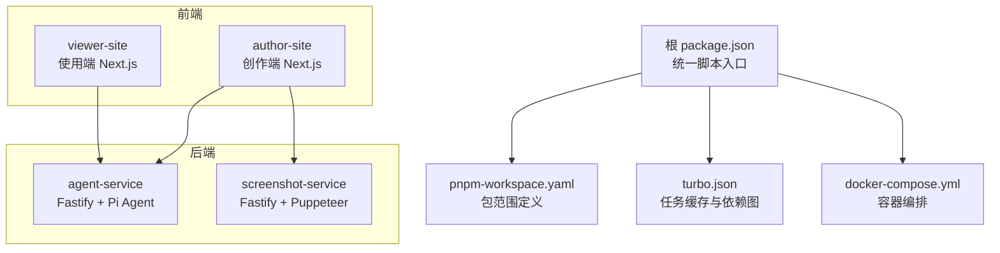
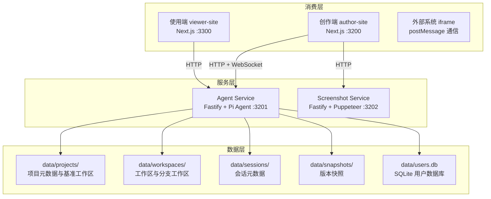
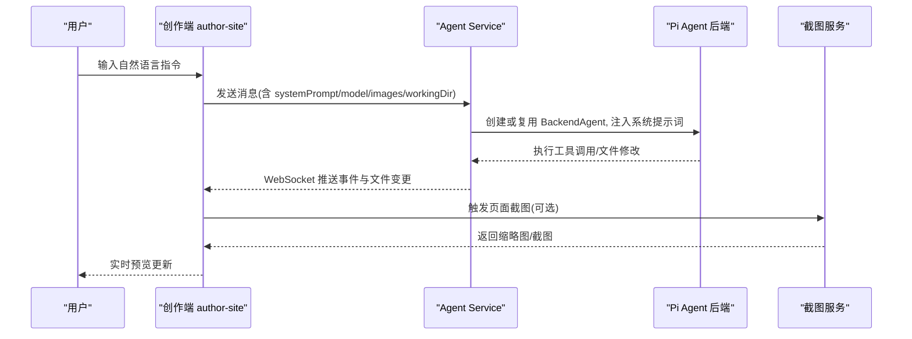
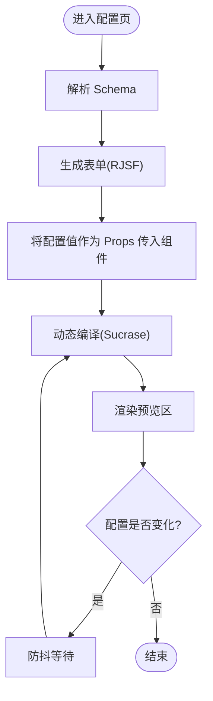
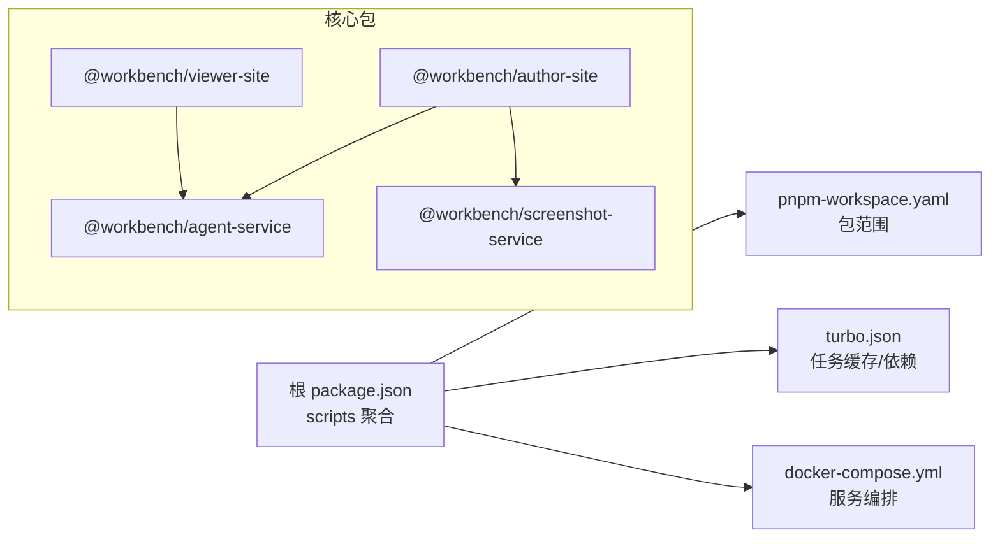

# 项目概述

<cite>
**本文引用的文件列表**
- [package.json](file://package.json)
- [pnpm-workspace.yaml](file://pnpm-workspace.yaml)
- [turbo.json](file://turbo.json)
- [docker-compose.yml](file://docker-compose.yml)
- [docs/项目文档/项目总览.md](file://docs/项目文档/项目总览.md)
- [packages/agent-service/package.json](file://packages/agent-service/package.json)
- [packages/author-site/package.json](file://packages/author-site/package.json)
- [packages/viewer-site/package.json](file://packages/viewer-site/package.json)
- [packages/screenshot-service/package.json](file://packages/screenshot-service/package.json)
- [docs/项目文档/创作端/06-基础设施/技术/03_Docker部署方案.md](file://docs/项目文档/创作端/06-基础设施/技术/03_Docker部署方案.md)
- [docs/项目文档/独立Agent服务层/03-核心模块设计.md](file://docs/项目文档/独立Agent服务层/03-核心模块设计.md)
- [docs/项目文档/使用端/README.md](file://docs/项目文档/使用端/README.md)
</cite>

## 目录
1. [简介](#简介)
2. [项目结构](#项目结构)
3. [核心组件](#核心组件)
4. [架构总览](#架构总览)
5. [关键流程与数据流](#关键流程与数据流)
6. [依赖关系分析](#依赖关系分析)
7. [性能与可扩展性](#性能与可扩展性)
8. [快速开始指南](#快速开始指南)
9. [常见问题排查](#常见问题排查)
10. [结论](#结论)

## 简介
Workbench AI 辅助创作平台是一个面向组件化开发的自然语言编程环境，基于 Pi Agent 提供“对话即开发”的协作体验。平台支持：
- 组件化开发工作流：通过 JSON Schema 驱动表单生成、动态编译与实时预览，实现配置与代码联动。
- 实时预览系统：在创作端与使用端均提供即时渲染能力，预览更新延迟极低。
- 多租户项目管理：以 data 目录为共享存储，结合 Session 与工作区解耦的设计，支撑多用户、多项目的并发编辑与版本快照。

整体采用微服务架构，包含 Agent 服务、创作端应用、使用端展示页面和截图服务等核心组件；并通过 Monorepo（pnpm workspace）统一管理包与依赖。

## 项目结构
仓库采用 pnpm workspace 的 Monorepo 组织方式，顶层脚本统一编排各子包的构建、开发与测试任务。核心目录说明如下：
- packages：所有业务包与 SDK，包括 agent-service、author-site、viewer-site、screenshot-service、project-core、project-scaffold、project-cli、shared、sketch-* 等。
- docker：各服务的 Dockerfile 与 Nginx 配置。
- docs：项目文档与使用说明。
- scripts：构建、部署、诊断与自动化脚本。
- data：运行时数据（项目、会话、快照、图片等）。

图表来源
- [package.json:1-101](file://package.json#L1-L101)
- [pnpm-workspace.yaml:1-15](file://pnpm-workspace.yaml#L1-L15)
- [turbo.json:1-20](file://turbo.json#L1-L20)
- [docker-compose.yml:1-140](file://docker-compose.yml#L1-L140)

章节来源
- [package.json:1-101](file://package.json#L1-L101)
- [pnpm-workspace.yaml:1-15](file://pnpm-workspace.yaml#L1-L15)
- [turbo.json:1-20](file://turbo.json#L1-L20)
- [docs/项目文档/项目总览.md:99-122](file://docs/项目文档/项目总览.md#L99-L122)

## 核心组件
- Agent 服务（@workbench/agent-service）
  - 职责：承载 Pi Agent 后端、REST API、WebSocket 事件分发、模型配置同步、工具权限校验、文件变更捕获与快照。
  - 技术栈：Fastify、Pi Agent 进程内嵌入、yjs/y-websocket 协作协议、pino 日志。
  - 端口：3201。
- 创作端（@workbench/author-site）
  - 职责：AI 对话、Schema 驱动的表单与配置管理、动态编译与实时预览、项目与工作区管理、知识库集成、嵌入 API。
  - 技术栈：Next.js 14、SWR、React JSON Schema Form、sucrase 动态编译。
  - 端口：3200。
- 使用端（@workbench/viewer-site）
  - 职责：项目浏览、预览与配置面板、iframe 直嵌创作端 viewer、外部系统集成。
  - 技术栈：Next.js 14、轻量 UI 组件库。
  - 端口：3300。
- 截图服务（@workbench/screenshot-service）
  - 职责：同步/异步页面截图、LRU 编译缓存、浏览器池管理。
  - 技术栈：Fastify、Puppeteer Core、Chromium。
  - 端口：3202。

章节来源
- [docs/项目文档/项目总览.md:33-82](file://docs/项目文档/项目总览.md#L33-L82)
- [docs/项目文档/独立Agent服务层/03-核心模块设计.md:130-176](file://docs/项目文档/独立Agent服务层/03-核心模块设计.md#L130-L176)
- [docs/项目文档/使用端/README.md:80-155](file://docs/项目文档/使用端/README.md#L80-L155)
- [packages/agent-service/package.json:1-53](file://packages/agent-service/package.json#L1-L53)
- [packages/author-site/package.json:1-127](file://packages/author-site/package.json#L1-L127)
- [packages/viewer-site/package.json:1-62](file://packages/viewer-site/package.json#L1-L62)
- [packages/screenshot-service/package.json:1-39](file://packages/screenshot-service/package.json#L1-L39)

## 架构总览
平台采用“消费层 + 服务层 + 数据层”的分层架构。消费层包括创作端、使用端与外部 iframe 集成；服务层由 Agent 服务与截图服务组成；数据层通过共享 data 目录持久化项目、会话与快照。

图表来源
- [docker-compose.yml:1-140](file://docker-compose.yml#L1-L140)
- [docs/项目文档/项目总览.md:33-82](file://docs/项目文档/项目总览.md#L33-L82)

## 关键流程与数据流
### 自然语言编程与实时预览流程

图表来源
- [docs/项目文档/创作端/06-基础设施/技术/03_Docker部署方案.md:83-121](file://docs/项目文档/创作端/06-基础设施/技术/03_Docker部署方案.md#L83-L121)
- [docs/项目文档/独立Agent服务层/03-核心模块设计.md:130-176](file://docs/项目文档/独立Agent服务层/03-核心模块设计.md#L130-L176)

### 配置驱动与预览联动流程

图表来源
- [docs/项目文档/项目总览.md:180-188](file://docs/项目文档/项目总览.md#L180-L188)

## 依赖关系分析
Monorepo 通过 pnpm workspace 管理包范围与依赖提升，turbo 负责任务级缓存与依赖顺序。顶层脚本聚合了各包的 dev/build/test/lint/typecheck 命令，便于统一编排。

图表来源
- [package.json:1-101](file://package.json#L1-L101)
- [pnpm-workspace.yaml:1-15](file://pnpm-workspace.yaml#L1-L15)
- [turbo.json:1-20](file://turbo.json#L1-L20)
- [docker-compose.yml:1-140](file://docker-compose.yml#L1-L140)

章节来源
- [package.json:1-101](file://package.json#L1-L101)
- [pnpm-workspace.yaml:1-15](file://pnpm-workspace.yaml#L1-L15)
- [turbo.json:1-20](file://turbo.json#L1-L20)

## 性能与可扩展性
- 编译与预览
  - 使用 Sucrase 进行 TSX 动态编译，避免全量 TSC 开销，配合 SWR 缓存与防抖策略，确保配置联动响应时间极短。
- 截图服务
  - 采用 LRU 编译缓存与文件系统截图缓存，结合浏览器池管理，优化并发截图吞吐。
- 并发与资源
  - Docker Compose 对各服务设置 CPU/内存/PID 限制，避免单点资源争用；截图服务额外配置 shm_size 以满足 Chromium 运行需求。
- 扩展建议
  - 对高并发场景可横向扩容 Agent 服务实例，配合无状态 JWT 认证与会话外置存储；截图服务可按负载水平扩展并引入队列化批处理。

[本节为通用性能讨论，不直接分析具体文件]

## 快速开始指南
- 环境要求
  - Node.js >= 18
  - pnpm 8.x（通过 corepack 管理）
  - Docker（可选，用于一键启动全部服务）
- 安装与启动
  - 安装依赖：pnpm install
  - 并行启动所有服务：pnpm dev
  - 单独启动某服务：pnpm dev:author / dev:agent / dev:viewer / dev:screenshot
  - 本地准生产预览：pnpm preview:local
  - 构建：pnpm build / pnpm build:viewer
  - 类型检查与测试：pnpm check:all / pnpm test:e2e
- Docker 一键启动
  - 默认包含 agent-service(:3201)、author-site(:3200)、screenshot-service(:3202)、viewer-site(:3300)。截图服务需要可用的 Chromium/Chrome 环境。
  - 常用环境变量：PI_AGENT_PROVIDER、PI_AGENT_API_KEY、PI_AGENT_MODEL、CORS_ORIGINS、DATA_DIR、SCREENSHOT_SERVICE_URL 等。

章节来源
- [package.json:1-101](file://package.json#L1-L101)
- [docker-compose.yml:1-140](file://docker-compose.yml#L1-L140)
- [docs/项目文档/项目总览.md:220-229](file://docs/项目文档/项目总览.md#L220-L229)

## 常见问题排查
- 截图服务健康检查失败
  - 现象：容器健康检查返回非 200。
  - 排查要点：确认 Chromium 路径、沙箱参数、端口映射与 CORS 配置；查看服务日志。
- Agent 服务无法连接 LLM
  - 现象：对话无响应或超时。
  - 排查要点：核对 PI_AGENT_PROVIDER、PI_AGENT_API_KEY、PI_AGENT_MODEL、PI_AGENT_BASE_URL 与网络连通性；调整 PI_AGENT_TIMEOUT。
- 预览不更新
  - 现象：修改配置后预览未刷新。
  - 排查要点：确认作者站点与 Agent 服务地址配置、WebSocket 连接状态、浏览器控制台错误；必要时清理 Next.js 缓存并重试。
- 权限与鉴权问题
  - 现象：访问受限接口被拒绝。
  - 排查要点：检查 JWT_SECRET、USE_SECURE_COOKIE、CORS_ORIGINS 与 INTERNAL_API_TOKEN 配置一致性。

章节来源
- [docker-compose.yml:116-121](file://docker-compose.yml#L116-L121)
- [docs/项目文档/创作端/06-基础设施/技术/03_Docker部署方案.md:110-121](file://docs/项目文档/创作端/06-基础设施/技术/03_Docker部署方案.md#L110-L121)

## 结论
Workbench 以 Pi Agent 为核心，构建了从自然语言到组件代码的端到端创作链路，并通过微服务与 Monorepo 实现了清晰的职责划分与高效的工程治理。其配置驱动与实时预览机制显著降低了组件开发与联调成本，同时为多租户与外部系统集成提供了稳定可靠的支撑。对于初学者，可从“自然语言指令 → 预览更新”的核心闭环入手；对于有经验的开发者，可深入 Agent 工具集、工作区与快照机制、以及截图服务的高并发优化实践。