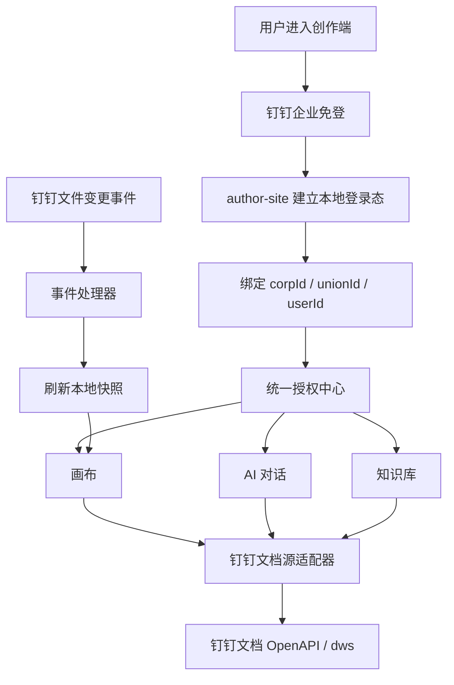

# 企业内部钉钉登录与文档同步方案

## 背景

创作端已经具备用户级外部工具授权能力，AI 对话可以通过当前用户授权访问钉钉文档、在线表格和知识库。下一阶段希望把钉钉能力从“对话中按需授权”升级为“企业内部统一登录、统一授权、AI 与画布共同复用”，避免用户在不同入口反复连接钉钉。

本方案暂不实施代码，先定义目标架构、授权边界、实时同步能力、实施阶段和风险。

## 目标

- 用户可以使用企业内部钉钉身份登录创作端。
- 用户登录后，系统能够记住其钉钉身份与授权状态。
- AI 对话、画布、知识库等入口复用同一套钉钉授权，不重复要求用户授权。
- 画布可以插入钉钉文档，并在钉钉文档更新后同步刷新。
- 同步能力以“准实时”为目标，不承诺逐字级协同编辑。
- 读写外部文档时遵守钉钉侧企业、应用和用户权限，不使用全局账号绕过权限。

## 范围

包含：

- 钉钉企业内部应用登录接入。
- 本地用户与钉钉企业身份绑定。
- 钉钉应用级 access token、用户级 token 或 dws 登录态的统一管理。
- 钉钉文档读取、快照、刷新与画布插入。
- 钉钉文档变更事件订阅与后台同步。
- AI 对话与画布共享授权状态。

不包含：

- 钉钉群聊、审批、待办、通讯录管理等非文档能力。
- 钉钉在线文档 iframe 直接嵌入作为第一版主方案。
- 与钉钉原生多人协同编辑完全一致的逐字实时同步。
- 绕过钉钉企业管理员授权或用户文档权限的访问方式。

## 官方能力依据

- 企业内部 H5 微应用免登：用于获取当前钉钉企业用户身份。参考钉钉开放平台“企业内部应用免登”文档。
- 用户 token：用于在需要用户委托权限时获取和刷新用户级访问凭据。参考钉钉开放平台“获取用户 token”文档。
- 企业内部应用 access token：用于服务端调用企业内部应用开放接口，通常需要缓存并按过期时间刷新。
- 文档 OpenAPI：用于读取、查询、更新钉钉文档内容。
- 文件变更事件订阅：用于在文档更新后触发后台刷新，实现画布准实时同步。

后续实施前需要用当前租户可用的钉钉开放平台权限重新核对 API 名称、字段、额度和事件范围，因为钉钉开放平台能力会受企业应用类型、权限包和灰度状态影响。

## 总体方案

采用“钉钉企业身份 + 统一授权中心 + 外部文档源适配器 + 本地画布文档节点”的架构。

用户通过钉钉企业内部应用登录创作端。服务端把钉钉 `corpId`、`userId`、`unionId` 与本地用户绑定。后续 AI 对话、画布、知识库读取钉钉文档时，不直接在各自模块维护 token，而是统一调用授权中心和文档源适配器。

画布插入钉钉文档时，保存的是外部文档引用与本地快照，不直接保存用户浏览器登录态，也不依赖钉钉页面 iframe 是否允许嵌入。后台通过钉钉文档事件和定时兜底刷新快照，再通过 WebSocket 或现有会话事件通知前端刷新。

## 身份登录设计

### 登录入口

创作端新增“钉钉企业登录”入口。用户从钉钉工作台、H5 微应用或企业内网页入口进入时，前端获取免登 code，提交给 author-site。author-site 使用企业内部应用凭据向钉钉换取用户身份。

首次登录时：

- 如果本地不存在该钉钉身份，创建本地用户。
- 如果本地已存在同 `corpId + unionId` 或 `corpId + userId` 绑定，直接登录该用户。
- 如果用户已有账号但未绑定钉钉，提供绑定流程。

再次登录时：

- 根据钉钉身份恢复本地登录态。
- 不要求用户重新进行外部工具授权。

### 身份主键

本地绑定关系建议以 `corpId + unionId` 作为长期身份主键，`userId` 作为企业内操作身份字段保存。原因是 `unionId` 更适合跨应用识别同一用户，`userId` 更适合企业内接口调用和权限判断。

需要保存：

- 本地用户 ID。
- 钉钉企业 ID。
- 钉钉 unionId。
- 钉钉 userId。
- 显示名称、头像等脱敏资料。
- 绑定时间、最近登录时间、状态。

## 授权记住设计

授权中心负责统一管理钉钉授权，目标是“用户授权一次，各处复用”。

### 应用级授权

企业管理员为内部应用开通文档、存储、事件订阅等权限后，服务端可以获取企业内部应用 access token。该 token 是服务端能力，不暴露给浏览器。系统按过期时间缓存并自动刷新。

适用场景：

- 获取企业内用户身份。
- 接收和处理文件变更事件。
- 调用企业授权范围内的文档与存储接口。

### 用户级授权

当某些文档接口必须以当前用户身份访问，或需要严格遵循“用户本人可见范围”时，保留用户级授权：

- 优先使用钉钉 OAuth 用户 token 与 refresh token。
- 如果当前 dws CLI 仍是最稳定的文档访问路径，则继续保存用户级 `DWS_CONFIG_DIR`。
- access token 过期时自动刷新。
- refresh token 或 dws 登录态失效时，才要求用户重新授权。

### 复用规则

授权状态以本地用户为边界，不以单个 AI session 或画布页面为边界。

同一用户：

- 新建 AI 会话时复用授权。
- 回到已有 AI 会话时热更新授权。
- 在画布插入或刷新钉钉文档时复用授权。
- 在知识库导入钉钉文档时复用授权。

不同用户：

- 不能共享用户级 token。
- 不能共享 dws 用户目录。
- 即使属于同一企业，也必须按各自身份判断文档权限。

## 钉钉文档源适配器

新增统一的 `DingtalkDocumentSource` 概念，由后端实现，对 AI、画布、知识库暴露一致语义。

核心能力：

- `resolve(url)`：解析钉钉文档链接，得到稳定文档引用。
- `read(ref)`：读取文档内容，输出 Markdown 或结构化块。
- `snapshot(ref)`：生成可持久化的本地快照。
- `refresh(ref)`：按引用重新拉取文档并更新快照。
- `watch(ref)`：登记需要订阅或关注的文档。
- `checkAccess(ref, user)`：检查当前用户是否仍有权限。

文档引用需要包含：

- provider：固定为 `dingtalk`。
- 原始 URL。
- 文档 ID、空间 ID、节点 ID 或 dentry 标识。
- 所属企业 ID。
- 标题。
- 最近同步时间。
- 最近同步状态。
- 是否允许后台自动刷新。

## 画布插入设计

画布不直接插入钉钉网页 iframe，第一版插入“外部文档节点”。

节点显示内容来自本地快照：

- 标题。
- 来源标识。
- 最近同步时间。
- Markdown 渲染内容或摘要。
- 同步状态。
- 手动刷新按钮。
- 打开原钉钉文档链接。

节点保存内容：

- 外部文档引用。
- 本地缓存快照。
- 同步策略。
- 布局信息。

同步策略建议提供三种：

| 策略 | 行为 | 适用场景 |
| :--- | :--- | :--- |
| 快照 | 插入时读取一次，之后不自动刷新 | 需求评审、归档、稳定版本 |
| 手动刷新 | 用户点击刷新后重新读取 | 内容变化不频繁 |
| 自动同步 | 订阅事件后后台刷新 | 高频协作文档、产品说明 |

## 文档更新实时性

钉钉文档更新可以做到准实时同步，推荐事件驱动加定时兜底。

### 事件驱动

系统订阅钉钉文件变更事件。收到事件后：

1. 验证事件来源。
2. 找到关联的外部文档引用。
3. 标记该引用为待刷新。
4. 合并短时间内的重复事件。
5. 后台重新读取文档内容。
6. 更新本地快照。
7. 通知正在打开相关项目或画布的前端。

### 定时兜底

事件可能丢失、延迟或不覆盖某些文档类型。系统需要定时扫描自动同步的文档引用：

- 对活跃项目高频检查。
- 对长期未打开项目低频检查。
- 对失败文档指数退避。
- 用户打开画布时触发一次轻量状态检查。

### 用户体验定义

第一版建议承诺：

- 正常情况下，钉钉文档更新后几十秒内同步到画布。
- 前端明确显示“已同步、同步中、同步失败、需要重新授权”。
- 用户可以手动刷新。
- 如果同步失败，保留最后一次可用快照。

不建议承诺：

- 与钉钉原文档逐字实时一致。
- 多人同时编辑画布节点内容并自动写回钉钉。
- 无需用户或企业授权即可读取任意钉钉链接。

## AI 对话集成

AI 对话不直接操作 token，也不拼接 dws 命令访问任意资源。AI 只使用受控工具：

- 读取钉钉文档。
- 摘要钉钉文档。
- 将钉钉文档插入当前画布。
- 刷新当前画布中的钉钉文档节点。
- 在用户确认后执行写操作。

当 AI 需要访问未授权或权限不足的文档时，工具返回结构化状态：

- 未登录钉钉。
- 企业应用未授权。
- 用户需要补充授权。
- 当前用户无该文档权限。
- 文档不存在或链接无法解析。

前端根据状态展示登录、授权、申请权限或失败提示。

## 权限与安全边界

- 浏览器端不接触企业 app secret、access token、refresh token 或 dws 认证目录。
- 企业级 token 只能保存在服务端。
- 用户级 token 必须加密存储。
- dws 登录态必须按用户隔离目录保存。
- 事件回调必须校验来源和签名。
- 文档快照需要记录创建者和最后刷新者。
- 用户失去文档权限后，自动刷新应失败并标记状态，不继续扩大读取范围。
- 断开钉钉账号后，新刷新停止；已有快照是否保留由项目策略决定。

## 数据流

## 实施阶段

### 第一阶段：企业登录与账号绑定

- 创建钉钉企业内部应用。
- 配置回调域名和免登入口。
- author-site 新增钉钉登录入口。
- 建立本地用户与钉钉身份绑定。
- 支持已有账号绑定钉钉。
- 保留原有登录方式作为兜底。

验收标准：

- 企业内用户可用钉钉身份登录创作端。
- 同一钉钉用户多次登录映射到同一本地用户。
- 不同企业或不同用户不会串号。

### 第二阶段：统一授权中心

- 抽象钉钉授权配置。
- 接入企业内部应用 access token 缓存与刷新。
- 接入用户级 token 或 dws 登录态复用。
- 将现有 AI 外部授权从会话级入口升级为用户级授权中心读取。
- 设置页展示钉钉登录、企业授权、用户授权三层状态。

验收标准：

- 用户完成一次授权后，AI 对话和画布都能复用。
- access token 过期后可自动刷新。
- 用户授权失效时只在必要时重新授权。

### 第三阶段：钉钉文档读取与画布插入

- 实现钉钉文档链接解析。
- 实现钉钉文档读取并转换为 Markdown。
- 新增画布外部文档节点或扩展现有 document 节点。
- 支持插入为快照、手动刷新或自动同步。
- 节点展示来源、同步状态和打开原文链接。

验收标准：

- 用户粘贴钉钉文档链接后，画布可生成文档节点。
- 节点内容来自当前用户有权限访问的文档。
- 无权限、链接错误、授权失效时给出明确提示。

### 第四阶段：事件订阅与准实时同步

- 配置钉钉文件变更事件订阅。
- 实现事件回调校验。
- 建立外部文档引用与钉钉事件标识的映射。
- 后台任务合并变更事件并刷新快照。
- 前端通过实时通道接收文档节点更新。
- 增加定时兜底刷新。

验收标准：

- 钉钉文档更新后，画布节点可在短时间内刷新。
- 重复事件不会造成频繁全文拉取。
- 事件丢失时定时任务能兜底。

### 第五阶段：写操作与审计

- AI 写钉钉文档前必须触发用户确认。
- 写操作记录目标文档、操作摘要、执行用户和结果。
- 对画布快照回写钉钉文档保持显式入口，不自动双向同步。

验收标准：

- AI 不能静默改写钉钉文档。
- 用户能看懂写操作影响范围。
- 审计记录可追踪。

## 任务清单

- [x] 完成企业内部钉钉登录与文档同步方案评估。
- [ ] 确认钉钉企业内部应用类型、回调域名、权限包和管理员审批流程。
- [ ] 确认钉钉文档读取最终走 OpenAPI 还是继续复用 dws。
- [ ] 确认文件变更事件能覆盖目标文档类型和空间范围。
- [x] 设计并实现本地用户与钉钉身份绑定的数据结构。
- [ ] 设计统一授权中心接口。
- [x] 预留画布外部文档节点所需的共享数据结构。
- [ ] 设计文档快照存储和刷新任务。
- [ ] 补充实施级技术文档后再开始编码。

## 进度记录

- 2026-06-28：创建方案文档。当前结论是企业内部钉钉登录可以作为最优身份入口；授权可通过企业应用授权与用户级授权两层记住；文档更新可通过事件订阅加定时兜底做到准实时刷新。
- 2026-06-28：开始第一阶段实现。已新增钉钉企业身份绑定表、服务端免登 code 换用户身份逻辑、钉钉登录 API、登录页钉钉入口、设置页绑定状态展示，以及外部文档引用/快照共享类型。当前尚未实现钉钉文档读取、画布插入和事件订阅同步。
- 2026-06-28：针对性验证通过：`corepack pnpm --filter @opencode-workbench/author-site test -- --testPathPatterns=src/lib/__tests__/dingtalk-login.test.ts --runInBand`。`corepack pnpm --filter @opencode-workbench/author-site typecheck` 复跑时被当前工作区既有的 `packages/author-site/src/app/api/sessions/[sessionId]/canvas-layout/route.ts` 中 `normalizeCanvasStateLayers` 的 `import type` 用作运行时值问题阻断，失败点不属于本次钉钉登录改动。

## 验证方式

方案阶段不运行代码测试。进入实施后需要至少覆盖：

- author-site 登录与账号绑定单测。
- 外部授权状态读取、刷新和失效处理单测。
- agent-service 钉钉工具授权注入单测。
- 画布外部文档节点插入、保存、刷新单测。
- 钉钉事件回调验签和去重单测。
- 一条企业登录到插入钉钉文档的 E2E 冒烟链路。

## 风险与待确认事项

- 钉钉开放平台权限受企业应用类型、管理员授权和接口灰度影响，正式实施前必须在目标企业租户中验证。
- 文档 OpenAPI 对复杂文档块、附件、表格、图片和权限继承的支持可能不完整，需要定义降级规则。
- 文件变更事件可能不是逐字实时事件，只适合驱动快照刷新。
- 如果继续依赖 dws，需要确认容器部署、持久卷、登录态刷新和 CLI 输出兼容性。
- 企业应用 access token 是企业级能力，不能替代用户本人权限；涉及个人可见文档时仍需要用户级授权或明确企业授权边界。
- 断开授权后，画布历史快照是否继续可见需要产品确认。

## 推荐决策

推荐采用“企业内部钉钉登录 + 统一授权中心 + 外部文档快照节点 + 事件驱动准实时刷新”的路线。

第一版不做 iframe 嵌入，不做双向自动同步，不承诺逐字实时协作。先把身份、授权记住、文档读取、画布快照和准实时刷新链路打通，再评估是否需要更深的钉钉原生编辑集成。
