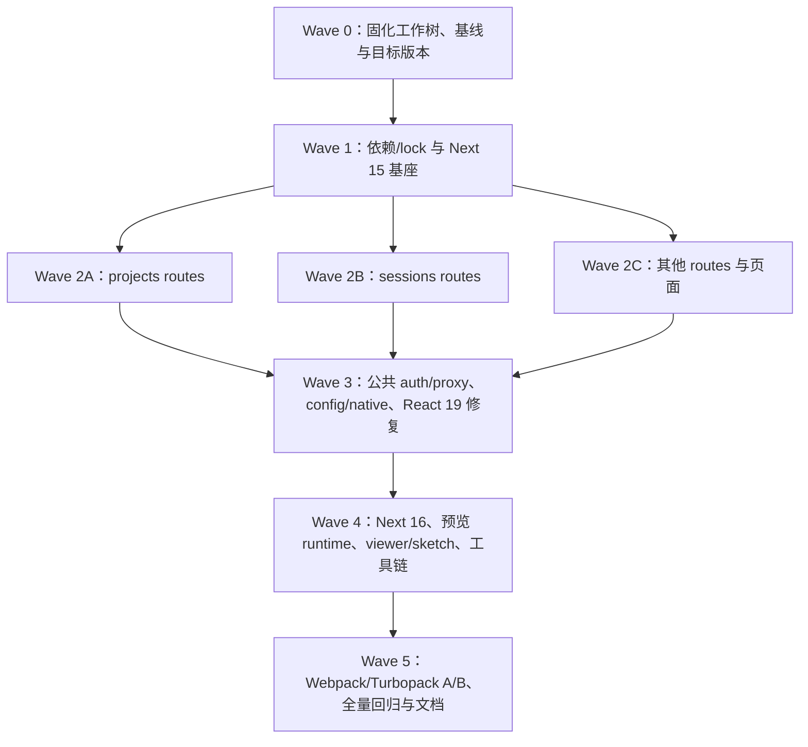

# 创作端 Next LTS 与 Turbopack 迁移实施方案

## 文档状态

- 状态：进行中（Wave 5：author 开发态 Turbopack A/B 与浏览器门禁已通过，开发默认值已切换；生产构建仍使用 Webpack，完整 E2E 最终门禁待完成）
- 编制日期：2026-08-12
- 当前分支 / 基线提交：`codex/next16-turbopack-migration` / `bd2c21bc`
- 目标：将工作区从 Next.js 14.1 / React 18.3 迁移到受支持的 Next.js 16 Active LTS / React 19，并独立决定是否把 Turbopack 设为默认开发与构建 bundler。
- 前置方案：[创作端-开发模式路由加载性能治理方案](./创作端-开发模式路由加载性能治理方案.md)
- 长期事实文档：[开发环境路由编译性能](../../项目文档/创作端/06-基础设施/技术/07_开发环境路由编译性能.md)

## 一、结论摘要

本次应升级 Next，但不能把它理解为 author-site 的单包版本更新。当前 Next 14.1 已不在官方支持范围；截至 2026-08-12，Next 16.x 是 Active LTS，Next 15.x 是 Maintenance LTS，当前可见稳定版本分别为 16.2.12 与 15.5.22。最终目标应是执行时最新安全补丁版的 Next 16.x，而不是停留在 Next 14.2 或 Next 15。

迁移必须拆成两个独立准入决策：

1. **框架准入**：Next 16 + React 19 在显式 Webpack 模式下通过动态 API、鉴权、预览 runtime、生产构建、静态导出、Docker 和 E2E 门禁。
2. **Bundler 准入**：在同一份 Next 16 代码上比较 Webpack 与 Turbopack；只有 Turbopack 功能完整、无新增错误且有明确性能收益时，才把它设为默认。若 Turbopack 不合格，只回退默认 bundler，不回滚已经通过的 Next LTS 升级。

实施采用两个逻辑检查点：

- **Checkpoint A：Next 15.5.x / React 19**。利用同步动态 API 的临时兼容期暴露警告、完成批量改造并建立可构建中间态。
- **Checkpoint B：Next 16.x / React 19.2.x**。消除同步兼容层、迁移 Proxy/ESLint/稳定配置，完成最终准入。

这不是一次适合全仓盲跑 codemod 的任务。author-site 有 121 个 Route Handler，其中 79 个动态路由，77 个仍使用同步 `params`；`cookies()` helper 又影响 60 多个路由文件。批量执行时必须由协调者先冻结公共签名和依赖，再按目录给子智能体分配排他的文件所有权。

## 二、背景与动因

### 2.1 直接动因

开发模式路由性能治理已经把编辑页冷编译从治理前的分钟级降到中位数 23.0s / 8,605 modules，证明主要业务侧问题已被修复。Next 14.2/Turbopack 探针没有在旧框架上带来额外收益，并暴露了 instrumentation、`better-sqlite3`、Markdown 文本导入和 workspace ESM 解析问题，因此当时正确地保留了 Next 14.1 Webpack。

现在继续停留在 14.1 有三类成本：

- Next 14.x 已不在官方 LTS 支持范围，缺少持续的安全修复与框架维护。
- Next 16 已将 Turbopack 作为 `next dev` 和 `next build` 默认 bundler，新的路由、开发缓存和编译改进不再回补到 Next 14。
- 当前配置仍使用已在后续版本稳定或移除的入口，例如 `experimental.instrumentationHook`、`experimental.serverComponentsExternalPackages` 和 `next lint`。

### 2.2 为什么必须独立立项

Next 升级会同时改变 React 主版本、App Router 动态 API、客户端路由缓存、GET Route Handler 默认缓存、middleware/proxy runtime、lint CLI、开发/生产 bundler 和构建输出行为。它与已完成的业务导入边界优化不是同一风险域，不应混在一个不可回滚的大改动中。

### 2.3 当前工作树约束

编制本方案时工作树包含大量未提交的用户改动，且以下高冲突文件已被修改：

- 根 `package.json`
- `packages/ai-chat-shared/package.json`
- `packages/demo-ui/package.json`
- `packages/author-site/next.config.js`
- `scripts/dev-restart.mjs`
- `docker/viewer-site/Dockerfile`
- 编辑页及多个动态 Route Handler

正式执行批量迁移前，必须先把当前业务改动固化为可恢复检查点。不得在现有脏工作树上让多个智能体并发运行全仓 codemod，也不得通过 reset/checkout 覆盖用户改动。

## 三、目标、非目标与成功定义

### 3.1 目标

- 三个 Next 应用统一进入受支持的 Next 16 Active LTS：author-site、viewer-site、sketch-playground。
- host 应用和共享 React 组件统一迁移到 React 19；React 类型、测试环境和 peer range 一致。
- 完成 Next 16 强制的 Async Request APIs 迁移，不保留 `UnsafeUnwrapped*`、`@next-codemod-error` 或同步兼容访问。
- 将 middleware 迁为 Proxy，并保持现有 JWT、Admin、页面/API 保护和 CORS 语义不变。
- 将 instrumentation 与原生依赖迁到稳定配置，保证 dev、build、standalone 和 Docker 中均可加载 `better-sqlite3`。
- 对 author 的 Markdown、workspace ESM 与 client-only 依赖边界建立 Webpack/Turbopack 等价行为。
- 保持 author standalone 输出、viewer static export 和 sketch playground 的开发/E2E 能力。
- 用同一 Next 16 代码对比 Webpack/Turbopack，依据功能和性能证据决定默认 bundler。

### 3.2 非目标

- 不在本次启用 React Compiler、Cache Components、PPR、View Transitions 等新能力。
- 不借升级改变现有权限范围、业务接口、数据格式、缓存语义或页面设计。
- 不把编辑页大文件拆分、微前端化或 iframe 化当作 Next 升级的一部分。
- 不为旧 Next、旧 React 或旧请求 API 保留兼容层；项目未上线，完成迁移后直接维护新事实。
- 不以消除所有历史 lint warning 为目标，但不得新增 Next/React 迁移相关 warning。

### 3.3 成功定义

满足以下条件才算完成：

- 所有 Next/React 版本与 lockfile 已统一，安装无新增 peer 冲突。
- 77 个同步动态 Route Handler、两个同步动态页面、同步 `cookies()` / `headers()` 全部完成迁移。
- auth/proxy/CORS、instrumentation/native、预览 runtime、author/viewer/sketch 的功能门禁全部通过。
- author、viewer、sketch 三套生产构建通过，standalone、静态 `out/` 和 Docker 产物可运行。
- Next 16 Webpack 无不可接受回退；Turbopack 是否默认由独立 A/B 门禁决定并记录。
- 计划文档、长期项目文档、模块索引与 AGENTS.md 的当前事实同步完成。

## 四、现状证据与影响面

### 4.1 版本矩阵

| 范围 | 当前事实 | 证据 |
| --- | --- | --- |
| Node / pnpm | Node 要求 `>=24 <25`，pnpm `8.15.0` | `package.json` |
| author-site | Next 14.1.0 / React 18.3.1 / React DOM 18.3.1 | `packages/author-site/package.json` |
| viewer-site | Next 14.1.0 / React 18.3.1 / React DOM 18.3.1 | `packages/viewer-site/package.json` |
| sketch-playground | Next 14.1.0 / React 18.3.1 / React DOM 18.3.1 | `packages/sketch-playground/package.json` |
| ai-chat-shared | peer `next >=14` / `react >=18`，dev 仍固定 14.1 / 18.3 | `packages/ai-chat-shared/package.json` |
| React 类型 | author、viewer、sketch、ai-chat、demo-ui、sketch-react 均为 React 18 类型 | 各包 `package.json` / `pnpm-lock.yaml` |
| 官方支持 | 16.x Active LTS；15.x Maintenance LTS；14.x unsupported | Next.js Support Policy |

执行时不得直接使用浮动 `latest` 写入 manifest。协调者先重新查询官方安全公告与 registry，冻结准确版本并记录在本文进度表。本文编制时的候选值为：Checkpoint A `next@15.5.22`，最终 `next@16.2.12`；React 使用目标 Next 版本支持的最新 19.2.x 安全补丁。

2026-08-12 执行冻结：Checkpoint A 使用 `next@15.5.22` / `eslint-config-next@15.5.22`，React 使用 `react@19.2.3`、`react-dom@19.2.3`、`@types/react@19.2.7`、`@types/react-dom@19.2.3`。`lucide-react@0.575.0` 与 `@radix-ui/react-compose-refs@1.1.2` 的 peer range 已确认覆盖 React 19。最终 Checkpoint B 继续锁定为 `next@16.2.12` / `eslint-config-next@16.2.12`；两代 Next 均接受该 React 主版本。版本依据为 Next 官方支持政策及 npm registry 的稳定包元数据。

### 4.2 author Next 配置合同

[`packages/author-site/next.config.js`](../../../packages/author-site/next.config.js) 当前承担：

- 根 `.env` 加载与四个预览相关公开环境变量。
- `output: "standalone"`。
- dev `onDemandEntries` 路由保活。
- 10 个 workspace 包与 Shiki 的 `transpilePackages`。
- 没有实际 Server Action 消费方的 `experimental.serverActions.bodySizeLimit`。
- 已稳定的 `experimental.instrumentationHook`。
- 后续更名为顶层 `serverExternalPackages` 的原生/解析器 external 配置。
- Webpack `.js → .ts/.tsx/.js` extension alias。
- `.md` 的 `asset/source` 文本导入。
- client 侧 `vscode-jsonrpc` / `langium` 禁用别名。

Next 16 在存在自定义 `webpack` 配置时不会无提示地用默认 Turbopack 构建；这组能力必须逐项迁移、验证或删除其根因，不能只删 `webpack()` 让构建通过。

### 4.3 Async Request APIs 迁移面

| 类别 | 数量/位置 | 风险 |
| --- | --- | --- |
| author Route Handler | 共 121 个 | API 回归面大，`check:all` 不能替代定向路由测试。 |
| 动态 Route Handler | 79 个 | 其中 77 个仍同步读取 `params`。 |
| `projects/**` | 30 个同步动态 route | 与项目管理、发布、资源、配置等核心 API 重叠。 |
| `sessions/**` | 22 个同步动态 route | 与编辑 bootstrap、保存、Workspace Authority 重叠。 |
| 其他动态 API + data route | 25 个 | 涉及 auth/admin、截图、知识、模板、viewer 等。 |
| 直接调用 handler 的测试 | 至少 24 个，盘点命中 27 个测试文件 | context 需改为 Promise，防止只修类型不修测试。 |
| 动态页面 | 编辑页 client page、embed server page | Client Component 使用 `React.use(params)` 或 `useParams`；server page 使用 `await params`。 |
| `cookies()` | `lib/auth/jwt.ts`、`lib/admin-auth.ts` | helper 异步化会传播到 60 多个 route 文件。 |
| `headers()` | `app/cli/page.tsx` | 页面需要 async 化并 await。 |
| `draftMode()` / page `searchParams` props | 未命中 | 作为 codemod 后复核项，不预设改动。 |

最终代码不得依赖 Next 15 的同步兼容层，也不得保留 codemod 生成的 unsafe cast。

### 4.4 Proxy 与鉴权/CORS

唯一 middleware [`packages/author-site/src/middleware.ts`](../../../packages/author-site/src/middleware.ts) 同时承担：

- JWT Cookie 解析与登录态校验。
- 已登录用户访问登录/注册页的重定向。
- `/demo/**`、`/cli/**` 页面保护。
- `/api/sessions/**` 未登录 401 JSON。
- Admin secret 与 `admin_token`。
- API/embed/viewer/data CORS。
- preview runtime/module 的公开 CORS。
- 几乎全路由 matcher。

Next 16 将 middleware 约定弃用并改名为 Proxy，Proxy 使用 Node.js runtime。当前实现未发现 Node runtime 明确不兼容项，但迁移会改变运行边界，因此必须先补合同测试。升级只保持现有保护范围；AGENTS.md 中出现而实际代码未保护的 `/projects` 不在本任务中顺手修正。

### 4.5 Instrumentation 与原生依赖

[`packages/author-site/src/instrumentation.ts`](../../../packages/author-site/src/instrumentation.ts) 在 Node runtime 中动态加载 Session/Workspace 清理、provider/image 同步任务，并注册 30 分钟 interval。其依赖链可到达：

- `packages/author-site/src/lib/db/index.ts` → `better-sqlite3`
- `packages/author-site/src/lib/editor-diagnostics/store.ts` → `better-sqlite3`
- `packages/knowledge-service/src/sqlite-catalog.ts` → `better-sqlite3`

旧 Next 14 Turbopack 探针已实证 instrumentation 阶段找不到 native binding。Next 16 即使默认 external `better-sqlite3`，也必须验证 dev 启动、冷编译、生产 build、standalone 启动、Docker、users DB 与 diagnostics DB 实际读写，以及 instrumentation 不会重复注册 interval。

### 4.6 Bundler 专属能力

| 能力 | 真实消费者 | 目标处理 |
| --- | --- | --- |
| Markdown 文本 import | `src/lib/agent/system-prompt.ts` | 优先改为明确 TS 字符串资源，消除 bundler loader；若不可接受，再用受支持的 Turbopack rule。 |
| `.js` 映射到 TS 源码 | project-core、project-scaffold、knowledge-service 共 7 个生产源码文件 | 先在 Next 16 实测；失败时治理 package/source 边界，避免维护大量逐文件 alias。 |
| `vscode-jsonrpc` / `langium` client 排除 | Streamdown/Mermaid/AI Chat 链 | 优先以精确 exports 和 client/server 边界阻断，Turbopack alias 仅作最后兜底。 |
| monorepo workspace root | 多个 `transpilePackages` | Turbopack `root` 必须覆盖 app 与 workspace 包共同父目录。 |

### 4.7 React 19 与预览 runtime 隐藏耦合

根 React 版本会被 [`scripts/build-preview-runtime.mjs`](../../../scripts/build-preview-runtime.mjs) 打进 author/viewer 的本地预览 runtime；两站点生产 build 又会先重建该 runtime。但预览合同和两个 iframe import map 目前硬编码 React 18.3.1：

- `packages/preview-contract/src/rules.ts`
- `packages/shared/src/demo/iframe-template.ts`
- `packages/demo-ui/src/iframe-template.ts`
- author 的 preview runtime policy 测试
- author/viewer `public/preview-runtime/manifest.json`

若只升级根 React，会形成 local runtime=React 19、CDN/policy=React 18 的不一致。本方案决定同步升级预览合同、CDN import map、runtime manifest 与受追踪产物，不长期维护双 React 工具链。

React 19 还会暴露两个直接 peer 风险：

- 根 override 将 `@radix-ui/react-compose-refs` 固定到 1.0.0，该版本 peer 只覆盖到 React 18。此 override 用于规避 ref cleanup 循环，不能机械删除。
- 当前 `lucide-react` 0.312/0.323 peer 只覆盖到 React 18，且分散在多个包与预览合同中。

依赖所有者需选择支持 React 19 的版本，并对 Select、Tooltip、Dialog、页面树、拖拽、弹层挂载/卸载和图标可用性做专项回归。

### 4.8 构建与测试现状

- author build 产出 `.next/standalone`，Docker 显式重建 `better-sqlite3` 并复制 standalone/static/public。
- viewer production 使用 `output: "export"`，Docker 复制 `packages/viewer-site/out` 到 nginx。
- sketch playground 没有 Next config；根 `check:sketch-playground` 只做 typecheck，不做 build。
- author/viewer 仍使用 `next lint`；Next 16 已移除该命令。
- `check:all` 不包含 lint、三个 Next production build、E2E 或 Docker build。
- author Jest 通过 `next/jest` 并带 Markdown/Milkdown/Streamdown mock，是升级后的单测工具链门禁。
- 现有编辑页导入边界测试必须保持通过。

## 五、架构与迁移决策

### 5.1 版本策略

1. 执行日先检查 Next 官方支持政策、安全公告和 registry。
2. 使用精确版本，不使用 canary/preview，不在 manifest 中写浮动 `latest`。
3. 先建立 Next 15.5.x 可构建检查点，再升级 Next 16.x。
4. React、React DOM、类型与 Next peer 要求同步升级，三套 Next app 不允许混用 React 主版本。
5. 共享包的 peer range 改为真实支持的范围；devDependencies 与最终 host 保持一致。

### 5.2 Codemod 策略

- 官方 codemod只由协调者运行一次。
- 第一次只在隔离的干净 worktree 中运行 `--dry` / `--print`，生成影响清单，不直接污染主工作树。
- 主工作树的迁移按目录分片实施；不允许每个子智能体各自运行全仓 codemod。
- 自动结果必须人工消除 `UnsafeUnwrapped*`、`@next-codemod-error` 和无意义的 async 传播。

### 5.3 Async helper 合同

- `cookies()` 相关 helper 全部显式返回 Promise；调用方使用 `await`，不使用类型强转伪装同步接口。
- Route Handler context 统一为 `params: Promise<...>`，函数内一次解包。
- 直接调用 handler 的测试统一传 `Promise.resolve({...})`，与真实框架合同一致。
- 编辑页 Client Component 采用最小侵入的官方 Promise 解包方式；不得借机重构 9,000 行页面。

### 5.4 缓存语义

Next 15 起 server `fetch`、GET Route Handler 和客户端 Page Router Cache 默认行为变化。本次不通过全局配置恢复旧默认：

- API 若读取实时文件、session、workspace 或数据库，保持动态/不缓存语义。
- 只有已有产品证据要求静态缓存的 GET 才显式 `force-static`/`force-cache`。
- 首页、编辑页、viewer 和返回导航必须做行为与性能复测，确认客户端路由缓存变化没有引入旧数据或额外等待。

### 5.5 Proxy 决策

- 迁移 `middleware.ts` / `middleware()` 为 `proxy.ts` / `proxy()`。
- 保持 matcher、状态码、重定向、cookie、CORS header 和公开 preview module 规则逐项一致。
- 不在升级中改变权限范围。

### 5.6 Instrumentation 决策

- 删除已经稳定的 `experimental.instrumentationHook`。
- 将 `serverComponentsExternalPackages` 迁为顶层 `serverExternalPackages`，保留经实测仍必要的项。
- 通过真实 native DB 读写而不是只看 build 成功判定兼容性。
- 若 Next dev 热重启会重复注册 interval，另做幂等修复并补测试；不在没有证据时提前重构调度模型。

### 5.7 Webpack/Turbopack 双轨策略

迁移阶段明确保留：

- `dev:webpack`：Next 16 + Webpack 功能基线。
- `build:webpack`：Next 16 + Webpack 生产构建基线。
- Turbopack dev/build：用于专项兼容和性能验证。

最终只保留一个日常默认入口：

- Turbopack 达标：`dev` / `build` 使用 Next 16 默认 Turbopack，保留诊断用 Webpack 脚本。
- Turbopack 不达标：`dev` / `build` 显式 `--webpack`，记录阻塞项；Next 16 本身仍可准入。

### 5.8 暂不启用的新能力

React Compiler、Cache Components/PPR、Turbopack build filesystem cache 的额外实验开关不在本次同时启用。先完成等价迁移，再以独立数据决定是否引入，避免版本、编译器和缓存模型同时变化。

## 六、子智能体批量执行设计

### 6.1 协作规则

- 最多同时运行 3 个执行子智能体，主智能体保留协调、公共文件整合和门禁职责。
- 所有子智能体共享工作树，必须按下表获得排他文件所有权。
- 子智能体不得编辑未授权文件，不得运行 `pnpm install`，不得生成 lockfile，不得 commit，不得回滚他人改动。
- 子智能体遇到公共签名、manifest 或 config 需求时，只向协调者报告，不越界修改。
- 每个任务必须同时修改同目录测试，并在交付时列出：改动文件、未解决项、运行命令、结果、观察到的新增 warning。
- 协调者在每个 Wave 结束、全部子智能体停止后，统一安装依赖、处理生成物、跑门禁和更新本文进度。

### 6.2 子智能体任务模板

后续分派时统一使用以下结构：

```text
目标：<唯一、可验收的目标>
前置状态：<依赖哪个 checkpoint / 公共签名>
所有权：<允许修改的目录或文件>
禁止：不改 manifest/lock/config；不回滚他人改动；不运行全仓 codemod
要求：<迁移规则与不能改变的业务语义>
验证：<最小定向命令>
交付：改动清单、验证结果、遗留阻塞、需要协调者处理的公共文件需求
```

### 6.3 Wave 与依赖图



### 6.4 推荐调度批次

| 批次 | 主智能体职责 | 并行子智能体 | 启动条件 | 收口条件 |
| --- | --- | --- | --- | --- |
| Batch 0 | NEXT-00～03：恢复点、版本冻结、测试基础设施、升级前基线 | 最多 2 个只读/测试加固任务 | 当前业务改动已可恢复 | 新基线和公共迁移规则已写回本文 |
| Batch 1 | NEXT-10～12：唯一修改依赖、lock、公共 async helper | 不并行修改源码大目录 | Batch 0 完成 | Next 15 依赖可安装，公共 API 合同冻结 |
| Batch 2 | 集成与冲突仲裁 | NEXT-20、NEXT-21、NEXT-22 | Batch 1 完成 | 三个目录分片各自定向测试通过，协调者跑 `check:author` |
| Batch 3A | 公共文件整合 | NEXT-30、NEXT-31、NEXT-32 | Batch 2 完成 | Proxy、native/config、React 19 专项门禁通过 |
| Batch 3B | NEXT-33 与 Checkpoint A 总门禁 | 最多 1 个工具链子智能体 | Batch 3A 不再编辑配置 | Next 15 checkpoint 全绿 |
| Batch 4 | NEXT-40：唯一升到 Next 16 并更新 lock | 无源码子智能体 | Checkpoint A 全绿 | Next 16 Webpack typecheck/build 基线通过 |
| Batch 5A | 公共整合与生成顺序控制 | NEXT-41、NEXT-42、NEXT-43 | Batch 4 完成 | Turbopack专项、runtime、viewer/sketch 各自交付；生成物只生成一次 |
| Batch 5B | NEXT-44 部署门禁 | 最多 1 个部署子智能体 | Batch 5A build 输出稳定 | standalone、static export、Docker 通过 |
| Batch 6 | NEXT-50～53：全量验证、浏览器、A/B、默认值和文档 | 可派 1 个只读结果复核任务 | 所有实现子智能体停止 | 默认 bundler 决策与归档结论完成 |

协调者不得因空闲并发槽提前启动后续批次。批次边界用于避免 `package.json` / lock、author config、auth helper、编辑页和预览生成物发生跨 Wave 冲突。

## 七、详细任务清单

### Wave 0：执行准备与基线固化（协调者，串行）

#### NEXT-00 工作树与恢复点

- [x] 记录 `git status --short`、当前分支、提交和所有高冲突文件。
- [x] 当前工作树干净，创建 `codex/next16-turbopack-migration` 作为可恢复迁移起点；本轮不提交，由用户决定何时提交。
- [ ] 不使用 reset/checkout/stash 覆盖未知来源改动。
- [ ] 创建迁移分支时使用 `codex/` 前缀；是否 commit 由用户决定。

交付：一个可恢复的迁移起点，以及“本轮允许修改的基线文件清单”。

#### NEXT-01 版本冻结与 peer 预检

- [x] 核验执行日 Next Active/Maintenance LTS、安全补丁和目标 React peer。
- [x] 冻结 Checkpoint A、Checkpoint B、React、React DOM、类型、eslint-config-next 精确版本。
- [x] 盘点 React 19 peer 冲突，重点确认 Radix compose refs override 与 lucide-react。
- [x] 把精确版本和选择理由回填本文。

验收：目标版本均为 stable、受支持、安全补丁已覆盖，无 canary/preview。

#### NEXT-02 验收基础设施加固

- [x] 为 `measure-edit-page-load.mjs` 增加根脚本入口，输出可机器读取的 Navigation Timing 与编辑器 ready marker；硬指标不得包含固定 `settle` 等待。
- [x] 修正 sketch playground dev/E2E 端口不一致，统一到项目约定端口 3400 并完成 typecheck。
- [x] 为 Proxy 补现状合同测试：auth redirect、页面/API 保护、Admin、普通 CORS、preview module CORS、matcher。
- [x] 为 instrumentation 增加 Node runtime 的启动任务和 interval 注册合同测试。

所有权：测试/开发脚本，不修改 Next/React 依赖。

#### NEXT-03 升级前性能与功能基线

- [ ] 使用 Node 24，关闭旧 author 浏览器标签，只启动 author 采集纯编译基线。
- [ ] 固定项目与路径：首页 → 编辑页 → 首页 → 编辑页。
- [ ] 清理 author `.next`、重启并完成 3 个有效冷样本；污染轮作废。
- [ ] 同一进程完成至少 3 轮热导航与一次 Fast Refresh。
- [ ] 记录 route compile 墙钟、modules（同 bundler 辅证）、`responseStart`、`load`、编辑器 ready、首页 ready、意外 `/not-found`、空 Authority 请求与 metadata 请求数。
- [ ] 以本次同机新基线覆盖历史 `23.0s / 8,605 modules / responseStart 25.0s / load 28.53s`，历史数据仅作参考。

### Wave 1：依赖与 Next 15 基座（单一所有者，串行）

#### NEXT-10 依赖与 lockfile

唯一所有权：

- 根 `package.json`、`pnpm-workspace.yaml`、`pnpm-lock.yaml`
- author/viewer/sketch/ai-chat/demo-ui/sketch-react/preview-contract 的 `package.json`

任务：

- [x] 统一 Next 15 checkpoint、React/React DOM 19、React 19 类型与 eslint-config-next。
- [x] 更新共享包 peer/dev range，使本地测试使用真实 host 版本。
- [x] 选择 React 19 兼容的 lucide/Radix 方案；不能用 `--force` 或忽略 peer 冲突作为完成条件。
- [x] 统一 lockfile，确认只有预期的 Next/React 主版本。
- [x] 保存安装日志；安装仅出现既有 `eslint@8` 和 `@types/dompurify` 过期提示，以及 Node `url.parse` deprecation，未出现 Next/React peer 冲突。

验收：`pnpm install --frozen-lockfile` 可复现；无新增 Next/React peer warning。

#### NEXT-11 官方 codemod 影响清单

- [ ] 在隔离 worktree 对 Checkpoint A 运行官方 upgrade/async-request codemod dry-run。
- [ ] 分类输出：可机械接受、需人工调整、公共 helper 传播、测试 context、配置重命名。
- [ ] 主工作树只应用经过分片的 patch，不直接复制包含无关格式化的全仓 diff。

#### NEXT-12 公共 Async Request 合同

- [x] 将 auth/admin cookie helper 改为真实异步 API。
- [x] 冻结 Route Handler 的 `params: Promise<T>` 写法和测试 context 写法。
- [x] 核验编辑页 Client Component 与 embed 页面是否需 Promise 解包；不因文件名动态而假定必改。
- [x] 提供静态检查，阻止 `UnsafeUnwrapped`、`@next-codemod-error` 与同步 `cookies()` / `headers()` 回流。

这是 Wave 2 的硬前置。公共 helper 完成后，目录子智能体只消费合同，不再各自设计签名。

### Wave 2：动态 API 批量迁移（3 个子智能体并行）

#### NEXT-20 Projects API 分片

所有权：`packages/author-site/src/app/api/projects/**`

- [x] 迁移约 30 个同步动态 Route Handler。
- [x] 同时处理本目录对异步 cookie/auth helper 的调用。
- [x] 更新本目录直接调用 handler 的测试。
- [ ] 保持项目、配置、页面、资源、发布与版本接口的状态码和响应合同不变。

验证：本目录定向 Jest + author typecheck。

#### NEXT-21 Sessions API 分片

所有权：`packages/author-site/src/app/api/sessions/**`

- [x] 迁移约 22 个同步动态 Route Handler。
- [x] 同时处理本目录的 cookie/auth await。
- [x] 更新本目录 route 测试。
- [ ] 保持 Session、保存、Workspace Authority、文件与协同语义不变。

验证：本目录定向 Jest + author typecheck + workspace authority 检查。

#### NEXT-22 其他 API 与动态页面分片

所有权：

- `packages/author-site/src/app/api/**` 中 NEXT-20/21 未覆盖的目录
- `packages/author-site/src/app/data/**`
- `packages/author-site/src/app/cli/**`
- `packages/author-site/src/app/embed/**`
- `packages/author-site/src/app/demo/[id]/edit/page.tsx`
- 经协调者明确列出的 auth consumer helper

- [x] 迁移其余约 25 个同步动态 route。
- [x] await `headers()`、cookie helper 与页面 params。
- [x] 更新相关测试 context。
- [ ] 编辑页只做 params 必要修改，保留既有性能治理和用户改动。

验证：相关定向 Jest、编辑页导入边界测试、author typecheck。

Wave 2 汇总门禁：

- [x] 静态检查中不再存在同步动态 params、同步 request API 或 codemod marker。
- [x] `corepack pnpm check:author`
- [ ] Next 15 Webpack dev/build 启动，检查动态 API warning 为 0。

### Wave 3：框架边界、React 19 与工具链（最多 3 个子智能体并行）

#### NEXT-30 Proxy 与鉴权/CORS

所有权：`middleware.ts` → `proxy.ts`、proxy 合同测试；公共 auth helper 只在协调者授权时修改。

- [x] 完成文件与导出重命名。
- [x] 保持 matcher、重定向、401 JSON、Admin cookie、普通 CORS 和 preview CORS 等价。
- [ ] 验证 Node Proxy runtime 下 jose/Web Crypto 行为。
- [ ] 不扩大或缩小保护路径。

#### NEXT-31 Instrumentation / Native / Next config

单一所有权：`packages/author-site/next.config.js`、`src/instrumentation.ts` 及专项测试。

- [x] 删除 `experimental.instrumentationHook`。
- [x] 迁移顶层 `serverExternalPackages`。
- [ ] 静态确认无 Server Action 后删除无效的 10MB Server Action 配置；若发现真实消费者则保留并补合同。
- [ ] 保留根 `.env`、standalone、onDemandEntries、公开环境变量和必要 transpilePackages。
- [ ] 分别验证 users DB、diagnostics DB、启动任务与 interval 注册。

#### NEXT-32 React 19 组件与测试兼容

所有权：共享 UI/AI/sketch React 源码及其测试，不编辑 manifest/lock。

- [ ] 运行 React 19 类型检查，处理 ref callback、`useRef` 必填参数、ReactElement props 等真实报错。
- [ ] 检查已移除的 ReactDOM/test-utils API；当前盘点未发现旧 `ReactDOM.render`/`findDOMNode`，仍以编译结果为准。
- [ ] 验证 Radix Select/Tooltip/Dialog、页面树/拖拽、AI Chat、Milkdown、Sketch 挂载卸载。
- [ ] 保持编辑页稳定引用约束，不借 React 19 改造业务状态模型。

#### NEXT-33 ESLint 与 Jest 工具链

所有权：ESLint/Jest 配置，不编辑 manifests。

- [x] author/viewer 从 `next lint` 迁为 ESLint CLI。
- [x] 选择与仓库其余包一致、可复现的 flat config；保留 Next core-web-vitals/TypeScript 规则。
- [ ] 保持 `.next`、`out`、生成 runtime、test outputs 的 ignore。
- [x] 验证 `next/jest`、Markdown transform、Milkdown/Streamdown mock 和 workspace alias。

Checkpoint A 门禁：

- [x] `check:author`、`check:viewer`、`check:demo-ui`、`check:ai-chat-shared`
- [x] `check:sketch-core`、`check:sketch-react`、`check:sketch-playground`
- [x] author、viewer、sketch 三套 Webpack production build
- [x] `lint:all`（0 error；保留既有告警）
- [x] 核心 E2E 冒烟（author core flow 通过）
- [x] 画布自动保存与重新打开 E2E（Yjs-first 持久化链路通过）

### Wave 4：Next 16 与 Turbopack 等价能力（先串行升版，再并行）

#### NEXT-40 Next 16 最终升版（依赖所有者，串行）

- [x] 从已通过的 Checkpoint A 升到冻结的 Next 16.x / React 19.2.x。
- [x] 运行 typegen 与 typecheck，确保不再依赖同步兼容层。
- [x] 更新 lock；其他子智能体停止期间完成安装。
- [x] 先使用显式 Webpack dev/build 建立 Next 16 功能基线。

#### NEXT-41 Turbopack 资源与 workspace ESM 专项

所有权：author Next config、Markdown prompt 资源，以及经协调者授权的 project-core/project-scaffold/knowledge-service 文件。

- [x] 保持单个 system prompt raw Markdown import，并为 Webpack `asset/source` 与 Turbopack raw-text rule 建立等价加载路径。
- [x] 实测 Next 16 是否能解析现有 `.js` → TS workspace specifier。
- [ ] 若失败，优先修正 package/source 边界；不得生成大规模逐文件 alias 表。
- [ ] 检查 AI Chat/Mermaid client 图是否仍触达 `langium` / `vscode-jsonrpc`。
- [x] 配置 Turbopack workspace root、必要 rules/aliases，并保留 Webpack 等价路径用于对照。
- [ ] 用 `NEXT_TURBOPACK_TRACING=1` 采集阻塞证据，禁止用压制 warning 代替修复。

#### NEXT-42 预览 runtime 与合同同步

排他所有权：

- `packages/preview-contract/src/**`
- `packages/shared/src/demo/iframe-template.ts`
- `packages/demo-ui/src/iframe-template.ts`
- `scripts/build-preview-runtime.mjs`
- author/viewer `public/preview-runtime/**`
- 对应 policy/contract 测试

- [x] 将 React/React DOM/lucide 版本同步到统一预览合同。
- [x] 更新 import map、dependency policy 与合同版本。
- [x] 重建受追踪 runtime 产物；其他智能体不得同时运行该生成命令。
- [ ] 验证 local/CDN/fixed/inline 路径使用相同版本语义。
- [ ] 验证高保真 React 页面、SDK、动画运行时和 viewer 静态输出。

#### NEXT-43 Viewer 与 Sketch

所有权：`packages/viewer-site/**`、`packages/sketch-playground/**` 中未被 runtime 生成任务占用的文件。

- [x] viewer static export、catch-all、唯一 Route Handler、`next/image` unoptimized 和 AI Chat 边界。
- [x] sketch dev 端口、typecheck、production build、Playwright E2E（20/20）。
- [ ] 检查 viewer 不经根 barrel 重新拉入不必要的 Mermaid/Node 依赖。

#### NEXT-44 部署产物

所有权：author/viewer Dockerfile、local production preview、构建检查脚本。

- [x] 验证 author `.next/standalone` 路径与 server 启动命令。
- [x] 验证 native module 在 builder/runtime 中可加载。
- [x] 验证 viewer `out/` 和 nginx 路径。
- [x] 验证 Docker build check 不依赖 Next 14 日志或目录细节。

### Wave 5：统一验收与默认 bundler 决策

#### NEXT-50 分层验证矩阵

快速门禁（每个子任务）：

- 受影响包 typecheck。
- 受影响目录定向 test。
- 编辑页/AI 导入边界 test。
- 公共 helper 或 config 改动后的最小 dev/build smoke。

Checkpoint 门禁：

```bash
corepack pnpm check:author
corepack pnpm check:viewer
corepack pnpm check:demo-ui
corepack pnpm check:ai-chat-shared
corepack pnpm check:sketch-core
corepack pnpm check:sketch-react
corepack pnpm check:sketch-playground
corepack pnpm lint:all
corepack pnpm build
corepack pnpm build:viewer
corepack pnpm --filter @workbench/sketch-playground build
```

最终门禁：

```bash
corepack pnpm check:all
corepack pnpm lint:all
corepack pnpm build
corepack pnpm build:viewer
corepack pnpm --filter @workbench/sketch-playground build
E2E_BASE_URL=http://localhost:4200 corepack pnpm test:e2e:core-flow
E2E_BASE_URL=http://localhost:4200 corepack pnpm test:e2e
corepack pnpm test:e2e:sketch-playground
corepack pnpm check:docker-build
```

当前执行记录：核心流程与 sketch-playground E2E 均已通过；配置、项目分类、画布自动保存和画布删除/撤回/重做的定向 E2E 也已通过。`sketch-page-regression` 会在默认关闭 `NEXT_PUBLIC_SKETCH_SCENE_AUTHORING_ENABLED` 时条件跳过，开启该 feature flag 的环境必须重新执行该用例。完整创作端 E2E 上次在后台仍运行时被停止，未产生可采信的最终结果；`check:all` 仍受既有 Workspace Authority 守卫缺口阻断。启动 OrbStack 后，knowledge-service、agent-service、author-site 与 viewer-site 的 Docker Buildx 构建均已完成，Docker build 不再是本次迁移阻塞项。

此外必须人工/浏览器验证：

- 登录、注册、登出、Admin、页面/API 未登录行为。
- 首页 → 编辑页 → 首页；空 Authority 请求为 0；metadata POST 为 1。
- AI Chat、评论、知识文档、配置、保存、协同、预览、截图。
- viewer 静态站、feedback、预览 runtime local/CDN。
- Radix 弹层、Select、Tooltip、页面树、拖拽与卸载。
- Fast Refresh 后状态与控制台错误。

#### NEXT-51 性能 A/B

在完全相同的 Next 16 代码、Node 24、项目数据和服务拓扑下：

1. 清 `.next`，3 轮 Webpack 冷样本。
2. 清 `.next`，3 轮 Turbopack 冷样本。
3. 各自同一进程做 3 轮热导航与一次同文件 Fast Refresh。
4. 分开记录 screenshot-service on/off，不混合统计。
5. 模块数只在同 bundler 内比较；Webpack 与 Turbopack 模块口径不可直接比较。

准入线：

- Next 16 Webpack 相对升级前同机新基线，冷编译/页面 ready 中位数不得回退超过 10%，且任何有效样本不得重新出现分钟级等待。
- Turbopack 相对同一 Next 16 Webpack，冷编辑路由 ready 应有至少 15% 改善；若冷收益不足，则 Fast Refresh/热路由至少有 30% 改善，且冷路径不得回退超过 10%。
- 已热编辑页返回首页继续保持 UI ready 1s 内。
- 功能、错误率、内存稳定性优先于微小性能收益；不以单次最快值做结论。

#### NEXT-52 默认 bundler 决策

- [x] author 开发态功能与性能均达标：`dev` 默认 Turbopack，保留 `dev:webpack` 诊断命令；生产 `build` 继续使用 Webpack。
- [ ] Turbopack 生产构建通过独立稳定性门禁后，再单独决定是否切换 `build`。
- [ ] Next 16 Webpack 也不达标：停止准入，回到 Checkpoint A 或迁移起点定位，不用配置压制错误。

#### NEXT-53 文档与规则收尾

- [x] 更新本文任务状态、精确版本、验证结果和未决风险；性能 A/B 数据已追加。
- [x] 使用 `doc-maintainer` 更新长期技术文档：开发编译器、预览 runtime/依赖合同与对应模块 INDEX；Docker 镜像门禁已完成。
- [x] 更新根 AGENTS.md：Next/React 版本、默认 bundler、基线命令、Turbopack 已知约束；删除已失效的 Next 14.1 说明。
- [ ] 若任务完成，按 `docs/plans/已完成/README.md` 压缩并归档本文；旧性能方案只保留最终索引与历史数据。

## 八、文件所有权矩阵

| 任务 | 排他所有权 | 依赖 | 可并行 |
| --- | --- | --- | --- |
| NEXT-10/40 依赖 | 所有 manifest、workspace override、lock | NEXT-00/01 | 否，单一所有者 |
| NEXT-12 Async 公共合同 | auth/admin helper、静态检查 | NEXT-10 | 否，Wave 2 前置 |
| NEXT-20 Projects | `author-site/src/app/api/projects/**` | NEXT-12 | 与 21/22 并行 |
| NEXT-21 Sessions | `author-site/src/app/api/sessions/**` | NEXT-12 | 与 20/22 并行 |
| NEXT-22 其他 API/页面 | 其余 API、data/cli/embed/edit page | NEXT-12 | 与 20/21 并行 |
| NEXT-30 Proxy | middleware/proxy 与合同测试 | Wave 2 | 与 31/32 并行 |
| NEXT-31 Config/Native | author next config、instrumentation 专项 | Wave 2 | 与 30/32 并行 |
| NEXT-32 React 19 | 共享 React 源码与测试 | NEXT-10 | 与 30/31 并行 |
| NEXT-33 Lint/Jest | lint/Jest 配置 | NEXT-10 | 可与 30-32 并行，但不改 manifest |
| NEXT-41 Turbopack | author config、prompt、授权 workspace 包 | NEXT-40 | 与 42/43 并行时避开 config/runtime |
| NEXT-42 Preview runtime | preview contract/templates/build script/generated runtime | NEXT-40 | 排他生成 |
| NEXT-43 Viewer/Sketch | viewer/sketch 非生成文件 | NEXT-40 | 与 41/42 协调后并行 |
| NEXT-44 Deploy | Docker/production preview/build checks | 41-43 | 可独立实施 |
| NEXT-50-53 验收 | 公共集成与文档 | 全部 | 协调者串行收口 |

## 九、风险、停止条件与回退策略

### 9.1 立即停止推进的条件

- 任一 checkpoint 无法通过 typecheck、定向 test 或生产 build。
- 动态 route 出现 5xx、参数未解包或 auth helper Promise 泄漏。
- Proxy 的状态码、重定向、cookie 或 CORS 合同变化。
- Markdown prompt、workspace ESM、Mermaid/langium 或 native binding 无法加载。
- author standalone、viewer `out/`、sketch build 或 Docker 产物缺失。
- preview runtime 的 local/CDN/policy React 版本不一致。
- 出现新的 Next/React peer 冲突，或通过 `--force` 才能安装。
- 生成物覆盖了非本任务用户改动。

### 9.2 分层回退

- **Route 分片失败**：只撤回/修复该目录分片，不影响已通过分片。
- **React 19 共享组件失败**：停在 Checkpoint A 修复，不能带着类型/运行时不一致推进 Next 16。
- **Next 16 框架失败**：保留完整证据，可临时停在受支持的 Next 15 Maintenance LTS，但不得把它宣称为最终完成。
- **Turbopack 失败**：默认回到 Next 16 `--webpack`，不回退 Next LTS、Async APIs、Proxy、React 19 或 lint 迁移。
- **性能不达标**：保留同版本 Webpack/Turbopack trace，先定位再决定默认值，不以主观“感觉更快”准入。

### 9.3 已知高风险点

- 当前工作树脏，批量 codemod有覆盖用户改动风险。
- cookie helper 的异步传播与 route params 修改高度重叠，错误分工会造成大面积冲突。
- author config、manifest/lock、编辑页、preview runtime 生成物必须单一所有者。
- React 19 + Radix ref 语义可能重现循环更新；旧 override 不能无验证删除。
- Next 16 新路由缓存行为可能改变首页/编辑页返回体验，需真实浏览器测量。
- `check:all` 本身不足以证明升级完成。

## 十、执行交接清单

后续主智能体启动实施时，按顺序确认：

- [ ] 已读取本方案、前置性能方案、memory.md 和根 AGENTS.md。
- [ ] 当前工作树与本文编制时的 dirty 热点已重新核对。
- [ ] 已使用系统化调试方法处理任何升级失败，未靠猜测堆配置。
- [ ] 已创建/更新执行计划，任务 ID 与本文一致。
- [ ] 先完成 Wave 0，不直接从依赖升级或 codemod 开始。
- [ ] 每次只启动当前 Wave 可并行的最多 3 个子智能体，并明确文件所有权。
- [ ] 每个 Wave 结束后统一收口、跑门禁、回填进度，再启动下一 Wave。
- [ ] 最终由主智能体运行全量验证和浏览器/性能验收，不能把子智能体的局部测试当成集成结论。

## 十一、参考依据

- [Next.js Support Policy](https://nextjs.org/support-policy)
- [Upgrading to Next.js 15](https://nextjs.org/docs/app/guides/upgrading/version-15)
- [Upgrading to Next.js 16](https://nextjs.org/docs/app/guides/upgrading/version-16)
- [Next.js Codemods](https://nextjs.org/docs/app/guides/upgrading/codemods)
- [Turbopack API Reference](https://nextjs.org/docs/app/api-reference/turbopack)
- [serverExternalPackages](https://nextjs.org/docs/app/api-reference/config/next-config-js/serverExternalPackages)
- [Instrumentation](https://nextjs.org/docs/app/api-reference/file-conventions/instrumentation)
- [React 19 Upgrade Guide](https://react.dev/blog/2024/04/25/react-19-upgrade-guide)

## 十二、进度记录

- 2026-08-14（编辑器启动链第二轮收窄）：并行审计确认四个独立根因：Session Bootstrap 在返回前串行推送模型与授权配置；页面评论 target 每次渲染新建对象导致 REST/WS effects 重复运行；author 校验适配器仍穿透 `@workbench/shared` 根桶；初始单页模式仍同步导入 3,374 行 `PreviewCanvas` 及其自由节点、Markdown 与几何子树。四项均先补红灯契约再做最小修复：两项 Session 配置改为 `Promise.all` 且仍在响应前共同完成；评论 target 改为稳定引用并在空活动页时禁用；shared 新增 `./validator` 精确导出；`PreviewStage` 只在 canvas 分支异步加载画布。定向 author 测试 44 项、demo-ui 13 项、shared/demo-ui/author 类型检查均通过。已存在的完整五服务热环境下，三次编辑页导航到可用状态为 1.118s、1.923s、2.040s，中位数相对上轮 3.976s 改善约 51.6%；手动切换画布后异步子树正常挂载，无运行时异常。由于 4200–4300 完整拓扑是用户已有进程，本轮未停服清理 `.next`，因此该数据只验证热启动改善，冷编译增益待下次可独占服务时按原准入门禁复测。

- 2026-08-14：Docker 部署后编辑页出现“框架加载但内容为空”。证据显示 `/api/sessions` 的 bootstrap 以 active Workspace 的 `workspace-tree.json` 为页面真值；历史 active Workspace 可能保留页面目录但页面索引为空，导致 `demoPages=[]`、`activePageId=null`，前端将空 bootstrap 当作成功状态渲染。已在 `workspace-manager` 增加窄范围自愈：仅当 active Workspace 页面集合为空且项目基准工作区存在页面时，恢复页面目录和 `workspace-tree.json`，不覆盖其它工作区数据；补充回归测试并通过 author-site typecheck、Workspace Manager 测试和 Sessions API 测试。完整 Docker 编辑页 E2E 仍需在已登录浏览器中复验。

- 2026-08-12：完成方案编制。确认 Next 14 unsupported、Next 16 Active LTS；盘点三套 Next app、77 个同步动态 Route Handler、异步 cookie helper 传播、Proxy/Instrumentation/native、Webpack 专属配置、React 19 peer 风险与预览 runtime 隐藏耦合；形成 6 个 Wave、任务 ID、文件所有权、验证矩阵和分层回退策略。
- 2026-08-13：完成 Next 16.2.12 / React 19.2.3 依赖收口、Async Request APIs 分片迁移、`middleware.ts` → `proxy.ts`、ESLint flat config、预览合同 v2 与 author/viewer/sketch 的 Webpack/Turbopack 双轨脚本。author 编辑页在 Turbopack 开发态完成浏览器冒烟，已验证 Markdown 文本与受限 NodeNext workspace `.js`→TS 解析规则；一次 `build:turbo` 已完整通过。随后在清理 `.next` 的重复构建中，Turbopack 停在优化阶段两分钟无输出且无 CPU 进展，已主动中止，故不能视为稳定生产构建。Next 16 的 Webpack 生产构建已通过；为修正 Next 16 ESM 配置加载及 bundler 等价性，author/viewer Tailwind 插件改用 ESM import，author 恢复 Markdown 的 Webpack `asset/source` rule。viewer 静态导出还发现 `/api/preview-runtime/shell` 未声明静态策略；添加 `dynamic = "force-static"` 和 workspace tracing root 后，Webpack build 通过并将该路由预渲染为静态内容。`check:author` 已在清除并行 TypeScript 争用后通过（156 suites / 1124 tests）；此前并行运行出现的 8 个跨模块 Jest 超时，串行全量同样全部通过，确认不是业务断言回归。`check:viewer`、`check:demo-ui`（97 tests）、`check:ai-chat-shared`、`check:sketch-core`（69 tests）、`check:sketch-react`（152 tests）、`check:sketch-playground`、preview-contract typecheck/test 和 Async Request API 静态检查均通过。草图 React 的 8 个多选/缩放失败已归因并修复为测试适配：hover/选择提交会替换 `dangerouslySetInnerHTML` 生成的 SVG 节点，测试改为在每次状态提交后重新查询目标节点，不再向脱离文档的旧引用派发事件。随后 author、viewer、sketch 三套 Webpack production build 及全仓 `lint:all` 均通过（lint 仅遗留历史告警）；agent-service 在允许本地端口绑定的环境通过 63 个测试文件、505 个测试，先前唯一 `EPERM` 属沙箱限制。默认 bundler 仍是 Webpack：同机三轮冷/热性能 A/B 被 ego-browser 无响应输出阻塞；Docker 预检还存在既有 data workspace drift，Docker BuildKit/OrbStack 在 agent-service 阶段报 RPC EOF；全量 E2E 与其余生产产物门禁待执行。
- 2026-08-13（补充）：`check:all` 已通过 preview-contract 后被 `check:workspace-authority` 的 5 项既有业务守卫缺口阻断：live Workspace 恢复版本测试仍期待旧本地写入，且三个数据脚本未登记 local-write 白名单。这些项不涉及 Next/React 迁移，保留给 Workspace Authority 任务处理；不能把聚合门禁标记为全绿。
- 2026-08-13（补充）：sketch-playground Playwright 先暴露 Next 16 对 `127.0.0.1` HMR 的开发来源限制；在其 Next config 增加 `allowedDevOrigins` 后，画布创建与性能基线用例恢复。随后右键菜单用例的人工 `dispatchEvent("contextmenu")` 在浏览器中将菜单落到不可点击位置，改为与用户一致的真实右键点击；完整 `test:e2e:sketch-playground` 通过 20/20。此次修复不改变生产画布行为。
- 2026-08-13（补充）：在本地 author-site（4200）与 agent-service（4201）完整拓扑下，`test:e2e:core-flow` 通过：登录、项目创建、Workspace Authority 写入、保存与重读、编辑页加载均正常。用例末尾的发布入口断言由历史的“同步并发布/创建版本并发布”改为当前可访问名称“发布”。首次仅启动 author-site 时的 Authority 未就绪，以及冷编译下的加载延迟，均为测试前置条件而非迁移功能回归。
- 2026-08-13（补充）：Docker 构建门禁曾因 `~/.orbstack/run/docker.sock` 不存在而无法启动；启动 OrbStack 后已重跑并完成 knowledge-service、agent-service、author-site、viewer-site 四个镜像。author 阶段完成 Next 16 standalone 产物与 `better-sqlite3` Linux 原生编译，viewer 阶段完成静态导出镜像；Docker build check 不再是本次迁移阻塞项。构建调用输出通道会提前释放，故以 Buildx 四个目标均为 `Completed`、且 author/viewer 镜像创建时间已刷新为验收证据。
- 2026-08-13（补充）：以 `NEXT_TURBOPACK_TRACING=1` 复现 author `build:turbo`，在“Creating optimized production build”后 73 秒无新增输出、进程 CPU 为 0%，仅产生约 332 MB 的二进制 `packages/author-site/.next/trace-turbopack`；已安全中止（exit 130）。这证明 Turbopack 生产构建尚不具稳定性，默认继续固定 Webpack；不可仅凭此前一次成功构建切换默认。Docker Desktop context 同样缺少 `~/.docker/run/docker.sock`，需先启动任一 Docker daemon 后再验证镜像。
- 2026-08-13（补充）：完整 `test:e2e` 首轮恰遇 agent-service `tsx` 热重启与按需路由首次编译，两个重型用例超时，不能作为有效集成结论。稳定拓扑下，core flow 通过；画布自动保存用例还暴露两处旧测试夹具与当前 Workspace Authority/Yjs-first 契约不符：知识库 live workspace 写入缺少 `sessionId`，且画布保存仍监听已移除的 REST `POST /canvas-layout`。测试已改为传入编辑 Session，并以“退出完成后从 GET 读到持久化布局”断言，定向 E2E 通过（2.3 分钟）。`test:e2e:sketch-playground` 已通过 20/20；完整 `test:e2e` 仍待在稳定、预热的全服务环境重新运行。
- 2026-08-13（补充）：其余三个过期测试契约已收敛并通过各自定向回归：配置面板不再默认展开，测试在读取 schema 后显式切换“配置”标签；项目分类从文本框改为选择器，测试进入“自定义分类”后填写；画布页删除/撤回/重做改为真实选择操作和全局快捷键。手绘页面创作由 `NEXT_PUBLIC_SKETCH_SCENE_AUTHORING_ENABLED` feature flag 显式关闭，API 设计性返回 403，故手绘 E2E 在 flag 未开启时条件跳过，开启后自动恢复执行。完整 `test:e2e` 重新执行时其 runner 输出通道提前释放，而本地全服务拓扑仍在继续跑；停止服务时尚未写出最终结果，不能将该轮视为通过，需在可持续收集退出码的环境重跑。此次仅更新测试以匹配已验证的产品合同，不改变业务代码。
- 2026-08-14：统一 author-site、knowledge-service 与 OPS CLI 的 `better-sqlite3` 到 `12.11.1`，消除开发、CLI 与知识服务 Docker 镜像之间的原生依赖版本漂移。冻结锁文件安装后，三处均在 Node 24 / macOS arm64 成功加载 binding 并完成内存 SQLite 冒烟；author-site 与 knowledge-service typecheck 通过。author 全量 Jest 的 4 个失败来自 AI 流式服务新增 `assistantMessageId` 参数后，既有 mock 仍断言旧 10 参数签名，属于独立的 Agent 测试适配，不以此次 native 依赖变更掩盖。Docker 构建门禁正在重跑以验收 Linux 产物。
- 2026-08-14（开发编译性能复核）：首轮 author-site Webpack 探针确认慢请求主要等待 Next 按需编译，热 `/login` 仍为 350ms 量级；但冷请求在不同时点从 19.5s 波动到 56s，同期 10 核机器的 load average 升至 89–102，可用内存降至数十 MB 并伴随大量 swap。高占用主要来自项目外的 Chrome renderer、WindowServer、OrbStack 和 DrCleaner；这一轮样本已判定为资源争用污染，不用于 Webpack/Turbopack 默认值决策。路由、根布局、Proxy 与 Instrumentation 相对升级前基线没有可解释该量级回退的业务依赖图变化；三类 agent-service 配置同步为 3s 后异步退避任务，属于日志和健壮性次要问题，不是路由冷编译主因。NEXT-51 仍保持未完成；下一轮必须在停止其他构建/测试、旧浏览器热重连和高占用应用后，通过负载/内存准入检查，再串行执行各 3 轮 Webpack/Turbopack 冷热 A/B。
- 2026-08-14（NEXT-51/52 收口）：恢复可用内存并将正式样本限制在一分钟 load 不超过 15 后，以 Webpack/Turbopack 交错顺序采集。`/login` 三轮冷响应中位数为 6.868s/4.058s（Turbopack 改善 40.9%）；首页各两轮为 12.283s/8.557s（改善 30.3%）；编辑页三轮为 29.815s/12.507s（改善 58.1%），Next 日志中位数为 28.4s/12.5s（改善 56.0%），热响应为 208ms/65ms。所有有效样本均返回 HTTP 200，无 bundler 编译错误；一轮被 4200 旧浏览器标签自动请求污染的样本已作废，后续统一使用空闲端口。完整 author/agent/knowledge/viewer/screenshot 拓扑下，Turbopack 编辑页连续三次到达 `editor-ready`，用时 4.089s、3.976s、3.280s；临时源文件标记触发 Fast Refresh 后页面仍保持 ready，撤销标记后再次验证，两次均无 `Runtime.exceptionThrown`。因此 author-site `dev` 切换为 Turbopack，`dev:webpack` 保留诊断回退；生产 `build` 仍固定 Webpack，不将开发准入外推为生产准入。
