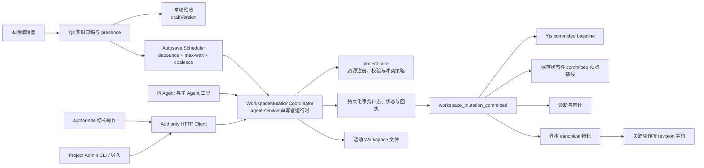

# 创作端 Workspace 写入一致性：单写者事务改造方案（归档）

> 状态：已完成
> 任务代号：`WMA`（Workspace Mutation Authority）
> 创建日期：2026-07-10
> 完成日期：2026-07-11
> 完整历史：`git log -- docs/plans/进行中/创作端Workspace写入一致性-单写者事务改造方案.md`

本文是 WMA 方案的归档压缩版。完整计划、进度记录和设计细节保留在 `docs/plans/进行中/` 原文件的 git 历史中。

## 一、最终架构



### 模块职责

| 模块 | 最终职责 |
|:-----|:-----|
| `@workbench/shared` | 传输协议、receipt、event、错误码、actor 和 operation 类型 |
| `@workbench/project-core` | 资源注册表、路径与类型校验、hash/manifest、冲突和 mutation policy |
| `@workbench/agent-service` | 每 live Workspace 单写者 coordinator、持久化 lease、串行队列、事务日志、恢复、HTTP/WS、协同草稿 barrier 和 AI 工具适配 |
| `@workbench/author-site` | Authority client、Yjs/本地草稿热路径、autosave scheduler、保存状态、异步预览 revision ack 和关键动作编排 |
| `@workbench/project-cli` | branch Workspace 隔离编辑；读取或改变 live Workspace 必须调用 Authority 协议 |
| screenshot/viewer | 只读 committed snapshot 或已绑定 revision 的物化产物 |

## 二、核心数据协议

### Workspace 状态

```ts
interface WorkspaceAuthorityState {
  workspaceId: string;
  projectId: string;
  revision: number;
  rootHash: string;
  resourceHashes: Record<string, string>;
  lastCommittedMutationId: string | null;
  updatedAt: number;
}
```

Authority 状态存放在 `data/workspace-authority/{workspaceId}/`，包含 state.json、journal.jsonl、receipts、staging、backups、reconcile-prepared 和 reconcile-receipts。

### Mutation 请求

```ts
interface WorkspaceMutationRequest {
  mutationId: string;
  projectId: string;
  workspaceId: string;
  sessionId?: string;
  baseRevision: number;
  actor: WorkspaceMutationActor;
  reason: string;
  operations: WorkspaceMutationOperation[];
}
```

operation 覆盖 `put_text`、`put_binary`、`delete_path`、`move_path`。每个改变既有资源的 operation 必须携带 `expectedHash`。

### 提交回执

```ts
interface WorkspaceMutationReceipt {
  committed: true;
  mutationId: string;
  projectId: string;
  workspaceId: string;
  baseRevision: number;
  revision: number;
  rootHash: string;
  actor: WorkspaceMutationActor;
  resources: Array<{
    path: string;
    action: "created" | "modified" | "deleted" | "moved";
    beforeHash: string | null;
    afterHash: string | null;
  }>;
  committedAt: number;
}
```

重复 `mutationId` 返回同一 receipt；不同 payload 返回 `WORKSPACE_MUTATION_ID_REUSED`。

### 投影 Ack

```ts
interface WorkspaceProjectionAck {
  projectId: string;
  workspaceId: string;
  revision: number;
  mutationId?: string;
  clientId: string;
  surface: "active-preview" | "canvas-preview" | "screenshot";
  status: "applied" | "failed";
  runtimeError?: { code: string; message: string };
  acknowledgedAt: number;
}
```

receipt 一旦 durable 就立即返回。Projection ack 可以晚到、缺失或失败，只改变预览状态，不能把已 committed mutation 改成失败。

## 三、系统不变量（INV-1 ~ INV-10）

| 编号 | 不变量 | 说明 |
|:-----|:-----|:-----|
| INV-1 | 活动 Workspace 单写者 | `scope=live` 激活后只有 Authority 可改受管资源 |
| INV-2 | 资源级冲突检测 | 每个变更携带 `expectedHash`，hash 不匹配返回 `WORKSPACE_RESOURCE_CONFLICT` |
| INV-3 | 提交后才发事件 | 只有 durable receipt 写入后才广播 `workspace_mutation_committed` |
| INV-4 | 旧投影无权回写 | 协同房间 flush 时若目标资源已被其他 mutation 推进，只能进入冲突状态 |
| INV-5 | 草稿预览即时，可靠消费有版本 | 编辑态预览消费本地/Yjs 草稿；截图、发布、导出只消费 committed snapshot |
| INV-6 | 项目版本与 Workspace revision 分离 | `baseVersion` 和 `revision` 不得互相替代 |
| INV-7 | 关键动作绑定确切 revision | 命名版本、发布、导出、模板、恢复必须记录 `workspaceId` + `revision` |
| INV-8 | 成功状态由系统生成 | UI 状态由 receipt 和 revision ack 生成，不从模型自然语言推断 |
| INV-9 | 自动保存不等待 canonical | "已自动保存"只要求 mutation durable commit；canonical 异步追赶 |
| INV-10 | 实时热路径不进入 Authority | 本地输入、Yjs 广播、草稿预览不等待 mutation journal 或 canonical |

## 四、验证证据摘要

### 测试覆盖

| 包 | 测试数 | 状态 |
|:-----|:-----|:-----|
| agent-service | 41 suites / 350+ tests | 通过 |
| project-core | 3 suites / 49+ tests | 通过 |
| author-site | 700+ tests（4 个既有 `useVisualEditState` 基线失败，与 WMA 无关） | 通过 |
| project-cli | 全量测试 | 通过 |
| screenshot-service | 18 tests | 通过 |
| OPS CLI | 18 tests | 通过 |
| check:workspace-authority | 静态门禁 + allowlist | 通过 |
| check:contracts | 共享合同检查 | 通过 |

### 已覆盖的关键场景

- 单文件、多文件、创建、删除、移动和二进制 staging 提交
- mutation ID 幂等与 payload 重用拒绝
- 并发请求严格串行
- prepare/staging/apply/state/receipt 各故障点回滚或恢复
- 服务重启 prepared 事务恢复
- 外部漂移检测、adopt、restore
- 跨进程 lease 拒绝第二写者
- AI commit 后旧 room flush 返回冲突
- 协同草稿 flush barrier
- 知识文档原子提交 Markdown + manifest
- 页面新增/复制/删除/恢复/重命名/排序/运行时切换 Authority mutation
- 文件夹 API Authority mutation
- canonical revision/rootHash 绑定版本创建、发布、导出、模板
- post-materialize revision 防线
- 诊断事件完整生命周期和性能分位值

### 性能 SLO 目标

| 指标 | 目标 |
|:-----|:-----|
| 本地输入回显 | 不等待网络或文件提交 |
| 远端协作更新 | p95 < 300ms |
| HTML/CSS/Sketch 草稿预览 | p95 < 150ms |
| Authority commit latency | p95 < 500ms |
| 停止输入到"已自动保存" | p95 < 1500ms |
| WebSocket 重连收敛 | p95 < 3000ms |
| canonical 后台 lag | p95 < 5000ms |
| 内容回退 | 0 次 |

## 五、迁移结论

### 已实现

- shared mutation contract、event、error code、actor 和 operation 类型
- project-core 资源注册表、路径规范化、内容校验、hash/manifest、冲突策略
- agent-service 单写者 coordinator、串行队列、事务日志、receipt 幂等、启动恢复、外部漂移检测、health/status、projection ack、事件 WebSocket、协同草稿 barrier、二进制 staging
- author-site Authority client（服务端和浏览器同源代理）、页面结构操作、配置操作、知识文档、画布布局、图片资产、页面资源版本恢复
- project-core live Workspace fail-closed 防线
- project-cli live Workspace fail-closed
- Pi Agent bash 和 delegateTask live Workspace 防线
- 静态门禁 `check:workspace-authority` 和部署前 preflight
- OPS CLI Authority status/bootstrap/reconcile/preflight 命令
- 诊断事件完整生命周期、性能分位值和跨存储合并

### 仍在迁移中

- 完整 CLI Authority client 和合并 barrier
- 离线 IndexedDB 草稿和重连协议
- 编辑页状态机（draftVersion/committedRevision/previewAppliedRevision）
- 后台 coalesce canonical materializer
- 部分 author-site 写入口和废弃路径清理

### 核心用户感知

> 编辑和协作始终即时响应；当界面显示"已自动保存"时，内容已经成为活动 Workspace 的新 revision；当显示"预览已更新"时，预览已独立确认应用该 revision；任何旧状态后续都没有权限把它覆盖回去。

## 六、相关文档

- 项目文档：`docs/项目文档/创作端/03-项目管理/技术/03_项目工作区_v2.md`（Authority 不变量）
- 项目文档：`docs/项目文档/创作端/03-项目管理/技术/11_实时保存与协同编辑.md`（Authority 运行时）
- 项目文档：`docs/项目文档/创作端/03-项目管理/技术/04_版本管理.md`（revision 绑定）
- 项目文档：`docs/项目文档/创作端/05-AI对话/技术/03_AI行为约束机制.md`（receipt 成功语义）
- 项目文档：`docs/项目文档/创作端/11-诊断与日志/技术/01_创作端诊断事件系统.md`（诊断事件）
- 完整计划与进度记录：`git log -- docs/plans/进行中/创作端Workspace写入一致性-单写者事务改造方案.md`
