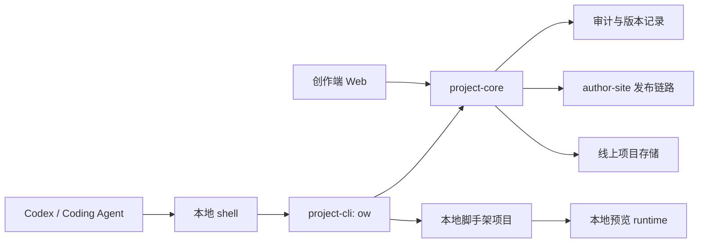

# 创作端项目管理 CLI 本地开发长期方案

> 状态：实施中，MCP 有效链路已移除，Project Admin CLI 已接管项目管理入口  
> 日期：2026-06-25  
> 结论：后续高级 Agent 开发体验不再以 MCP 为核心；改为拥抱本地脚手架和 JSON-first CLI。MCP 只保留历史方案文档，不再作为有效运行链路、workspace 包或 Web 入口。

---

## 一、背景

此前方案已验证 Project Admin MCP 可以把创作端项目管理能力暴露给 Codex，并完成项目、模板、页面、配置、资产、审计和远程 HTTP 入口等能力。但进一步讨论后，长期目标发生变化：

- 使用对象不再优先考虑人手动使用，而是面向 Codex、Claude Code、Cursor Agent 等编码代理。
- Agent 最擅长的环境是本地文件系统、终端命令、测试输出和普通工程结构。
- MCP 逐个工具调用适合治理和远程管理，不适合作为复杂页面开发、组件拆分、样式调试、依赖安装和本地预览的主体验。
- 维护 MCP 会额外带来工具 schema、协议适配、远程鉴权、资源映射和客户端兼容成本。

因此，新的长期方向是：**抛弃 MCP 作为核心路径，拥抱本地脚手架和 CLI。**

---

## 二、核心结论

### 2.1 不再把 MCP 作为核心依赖

后续不以 MCP 覆盖全部项目管理能力为目标。MCP 有效包、Web 入口和校验链路从当前主线移除，只保留历史方案文档用于追溯。

不继续维护 MCP 的原因：

- Agent 可以直接使用 shell，CLI 更通用。
- 本地开发需要 dev server、构建、测试、截图和文件编辑，MCP 不自然。
- MCP 和 CLI 如果并行维护，容易出现两套协议、两套错误模型、两套测试矩阵。
- 创作端项目真正需要的是稳定的项目包协议和同步协议，而不是更多远程工具。

### 2.2 CLI 是 Agent 主入口

新的主入口是 JSON-first CLI。Agent 使用 CLI 完成项目拉取、校验、diff、提交和发布。

理想工作流：

```bash
ow project pull proj_xxx
cd proj_xxx
pnpm install
pnpm dev
ow validate --json
ow diff --json
ow submit --json
ow publish --json
```

CLI 不替代本地工程工具。`pnpm dev`、`pnpm test`、`pnpm build` 仍由脚手架自己的 `package.json` scripts 承担。CLI 只负责创作端项目协议。

### 2.3 本地脚手架是开发平面

高级 Agent 不应该直接面对线上 `data/projects/*/workspace` 的内部结构，而应该拿到一个普通前端工程。

本地脚手架负责：

- 页面源码组织。
- 配置 Schema 文件。
- 资产目录。
- 本地预览 runtime。
- 测试和构建命令。
- 与线上项目版本的同步状态。

### 2.4 低维护高能力原则

本方案的关键不是“做一个很强的 CLI”，而是**把 CLI 做薄，把项目协议做稳，把本地工程交给标准前端工具**。

长期维护边界如下：

| 能力 | 归属 | 原则 |
| --- | --- | --- |
| 项目拉取、提交、发布 | CLI | 只处理创作端项目协议 |
| dev server | 脚手架 `package.json` | 使用 Vite/Next 等成熟工具，不在 CLI 自研 |
| 测试、构建、lint | 脚手架 `package.json` | 使用标准 npm scripts |
| 页面渲染 runtime | 共享 runtime | 与 author/viewer 复用，避免脚手架复制逻辑 |
| Schema 校验、页面树校验 | `project-core` | CLI 调用同一套校验规则 |
| 线上事务、审计、发布 | author-site/project-core | CLI 只触发，不复制云端规则 |

判断一项能力是否进入 CLI 的标准：

- 如果它只和“创作端项目协议”有关，进入 CLI。
- 如果它是通用前端工程能力，交给脚手架 scripts。
- 如果它涉及线上权限、审计、发布产物，交给云端复验。
- 如果它只是 Agent 方便性增强，优先通过 JSON 输出、nextActions 和 AGENTS.md 解决，不新增长期服务。

---

## 三、目标

### 3.1 产品目标

- Agent 可以把线上项目拉到本地，像维护普通前端项目一样维护创作端项目。
- Agent 可以在本地完成开发、预览、测试、构建和截图验证。
- Agent 可以把本地变更提交回创作端，保留版本、审计和冲突检测。
- Agent 可以触发云端复验和发布。
- 普通用户继续使用 Web 创作端，不需要理解 CLI。
- 管理员仍可在 Web 管理模板、权限、发布记录和审计。

### 3.2 工程目标

- 建立稳定的“创作端项目包协议”。
- CLI 输出必须 JSON-first，方便 Agent 稳定解析。
- 本地脚手架结构与线上存储结构解耦，由转换器负责双向转换。
- 所有提交回云端的变更必须经过统一校验、冲突检测和审计。
- 发布前必须云端复验，不能只信任本地构建结果。
- 不再扩张 MCP 能力面，避免长期维护两套入口。
- CLI 保持薄封装，不自研 dev server、测试框架、构建系统和包管理器。
- 脚手架保持标准前端工程，不把线上内部数据结构暴露给 Agent。

---

## 四、范围

### 4.1 覆盖范围

- 从线上项目或模板生成本地脚手架。
- 本地项目开发、预览、校验、测试和构建。
- 本地变更 diff、打包、提交。
- 线上版本冲突检测和处理建议。
- 云端校验、版本生成、发布和回滚。
- 模板导出、模板实例化、本地模板开发。
- Agent 可读的 JSON 输出、错误码、下一步建议。

### 4.2 不覆盖范围

- 不继续把 MCP 作为完整能力层维护。
- 不要求 CLI 管理所有本地开发命令。
- 不把线上数据目录直接暴露成本地开发目录。
- 不让本地构建结果绕过云端复验直接发布。
- 不在第一阶段解决多人实时协作，只处理版本基线和提交冲突。
- 不在 CLI 中内置 UI 框架、路由框架或样式体系。
- 不让每个脚手架复制一套复杂同步逻辑；同步逻辑集中在 CLI 与转换器。

---

## 五、目标架构



架构原则：

- `project-core` 仍是统一业务规则层。
- `project-cli` 是 Agent 主入口。
- 本地脚手架是开发工作台。
- Web 是产品管理入口。
- MCP 不再是核心链路。

---

## 六、包与模块设计

### 6.1 `packages/project-core`

继续保留，作为统一项目服务层。

职责：

- 线上项目读取和写入。
- 版本、事务、冲突检测。
- 页面树、配置 Schema、资产、模板和发布状态。
- 云端校验和审计。

### 6.2 `packages/project-cli`

新增 CLI 包，命令名建议为 `ow`。

职责：

- 拉取项目或模板到本地。
- 生成脚手架。
- 读取本地项目包协议。
- 本地校验和 diff。
- 生成提交变更包。
- 调用 `project-core` 或 Web API 完成云端提交、复验和发布。

CLI 设计原则：

- 所有关键命令支持 `--json`。
- 所有写入类命令支持 `--dry-run`。
- 高风险命令使用 confirm token 或显式 `--confirm`。
- 所有失败返回稳定错误码和 nextActions。
- 默认输出人可读文本，但 Agent 使用 `--json`。
- CLI 不启动和封装具体框架的 dev server，只在需要时提示运行脚手架脚本。
- CLI 不直接编辑业务源码，只读取本地项目包协议并生成变更包。
- CLI 的稳定面优先是 JSON 契约，而不是终端展示文案。

当前已落地 Project Admin CLI 管理层：`packages/project-cli` 直接调用 `project-core`，覆盖项目、模板、编辑事务、页面、文件夹、配置、资产、预览、发布、AI 会话、审计和管理员锁定能力。`pull`、`validate`、`diff`、`submit`、`template init` 和 `template submit` 已收敛到 `project-scaffold` 转换器，CLI 只负责命令解析与 JSON 输出。

### 6.3 `packages/project-scaffold`

新增脚手架模板和转换器包。

职责：

- 定义本地目录结构。
- 将线上 workspace 转换为本地工程。
- 将本地工程转换为提交变更包。
- 维护脚手架版本升级规则。

维护原则：

- 脚手架模板尽量薄，只包含必要配置、runtime 引用和标准 scripts。
- 多技术栈支持通过模板变体实现，不在 CLI 中写死框架分支。
- 模板升级通过 `scaffoldVersion` 和迁移器完成，不要求旧项目立即重建。
- 本地工程的公共能力优先抽到共享 runtime，而不是复制到每个脚手架。

### 6.4 `packages/project-runtime`

可选新增，用于沉淀本地预览 runtime。

职责：

- 本地页面预览。
- 配置 Schema 合并。
- iframe runtime。
- 与 viewer/author 共享必要运行逻辑。

该包只承载创作端特有的运行逻辑。通用前端能力继续使用社区工具，避免项目维护自己的小型框架。

### 6.5 最小包组合

为了控制维护成本，推荐按以下顺序落地：

1. `project-core`：已经存在，继续作为规则中心。
2. `project-scaffold`：先实现转换器和一个默认模板。
3. `project-cli`：先实现 `pull`、`validate`、`diff`、`submit`。
4. `project-runtime`：只有当本地预览无法直接复用现有 viewer/author runtime 时再抽包。

第一阶段不新增 MCP 能力，不新增多套脚手架，不新增复杂插件系统。

---

## 七、本地脚手架结构

建议本地项目结构：

```text
my-project/
  opencode.project.json
  package.json
  src/
    project.config.schema.json
    pages/
      home/
        index.tsx
        config.schema.json
      rules/
        index.tsx
        config.schema.json
    assets/
    components/
    styles/
  public/
  .opencode/
    remote.json
    sync-state.json
```

### 7.1 `opencode.project.json`

项目包协议文件，描述本地工程与线上项目的映射。

示例：

```json
{
  "schemaVersion": 1,
  "projectId": "proj_xxx",
  "baseVersion": "v12",
  "name": "活动项目",
  "pages": [
    {
      "id": "home",
      "name": "首页",
      "entry": "src/pages/home/index.tsx",
      "schema": "src/pages/home/config.schema.json",
      "parentId": null,
      "order": 0
    }
  ],
  "projectConfig": "src/project.config.schema.json",
  "assetsDir": "src/assets"
}
```

### 7.2 `.opencode/remote.json`

记录远端地址和项目身份。不能保存真实密钥。

### 7.3 `.opencode/sync-state.json`

记录拉取时的文件 hash、版本基线和脚手架版本。Agent 不应直接编辑该文件。

---

## 八、CLI 命令设计

CLI 命令按“必要核心 + 可选增强”分层。第一阶段只做核心命令，避免命令面过大。

| 层级 | 命令 | 是否第一阶段必须 |
| --- | --- | --- |
| 核心同步 | `ow project pull`、`ow validate`、`ow diff`、`ow submit` | 是 |
| 发布控制 | `ow publish`、`ow publish rollback` | 是 |
| 模板开发 | `ow template init`、`ow template submit` | 第二阶段 |
| 维护辅助 | `ow doctor`、`ow upgrade` | 第二阶段 |
| 便利包装 | `ow dev`、`ow test`、`ow build` | 不建议做，使用 `pnpm dev/test/build` |

### 8.1 项目拉取

```bash
ow project pull proj_xxx --json
```

职责：

- 从线上读取项目元数据、页面树、配置、页面文件和资产。
- 生成本地脚手架。
- 写入 `opencode.project.json` 和 `.opencode/sync-state.json`。

### 8.2 模板初始化

```bash
ow template init tmpl_xxx my-project --json
```

职责：

- 从模板创建本地项目。
- 不立即写回线上。
- 适合 Agent 先在本地开发，再决定创建线上项目。

### 8.3 本地校验

```bash
ow validate --json
```

校验内容：

- `opencode.project.json` 格式。
- 页面入口文件存在。
- 页面 Schema 是合法 JSON Schema。
- 项目级 Schema 与页面 Schema 字段不冲突。
- 页面树没有重复 id、循环层级或非法 parent。
- 资产引用存在。

`ow validate` 可以调用脚手架内置的 `pnpm typecheck` 或 `pnpm build` 作为可选检查，但不把这些工具内置进 CLI。推荐输出中区分：

- `protocolValidation`：项目包协议与 Schema 校验。
- `scriptValidation`：脚手架 scripts 的运行结果。

### 8.4 本地 diff

```bash
ow diff --json
```

职责：

- 对比本地当前状态与 `.opencode/sync-state.json`。
- 输出创建、修改、删除的页面、配置和资产。
- 给 Agent 明确提交摘要。

### 8.5 提交变更

```bash
ow submit --json
```

职责：

- 读取 baseVersion。
- 云端检查当前版本是否仍匹配。
- 生成事务。
- 上传变更包。
- 云端复验。
- 提交新版本。
- 写审计记录。
- 更新本地 sync-state。

### 8.6 发布

```bash
ow publish --json
```

职责：

- 触发云端发布前检查。
- 调用 author-site 发布链路生成正式产物。
- 返回发布版本、发布时间、产物摘要和访问入口。

### 8.7 回滚

```bash
ow publish rollback --to v12 --json
```

职责：

- 预览回滚影响。
- 要求显式确认。
- 写入审计。
- 更新发布状态。

### 8.8 环境诊断

```bash
ow doctor --json
```

这是低维护但高收益的辅助命令，用于减少 Agent 反复试错。检查内容包括：

- Node 和 pnpm 版本。
- 是否在有效脚手架目录。
- `opencode.project.json` 是否存在。
- 远端配置是否完整。
- 本地依赖是否安装。

`ow doctor` 只做诊断，不自动修复复杂问题。修复建议放在 `nextActions`。

---

## 九、降低维护成本的关键设计

### 9.1 项目协议强于脚手架实现

长期稳定面是 `opencode.project.json` 和变更包格式，而不是某个模板目录细节。脚手架可以升级，协议必须谨慎演进。

所有转换器测试都围绕协议展开：

- 线上 workspace 转本地协议。
- 本地协议转变更包。
- 变更包提交回线上 workspace。
- 再次导出后结构一致。

### 9.2 双向转换只维护一个核心转换器

不要让 Web、CLI、脚手架各自维护转换逻辑。转换逻辑集中在 `project-scaffold`：

```text
线上 workspace <-> project package <-> local scaffold
```

Web 下载 zip、CLI pull、模板初始化都调用同一转换器。

### 9.3 脚手架模板少而稳

第一阶段只维护一个默认模板。模板应尽量接近普通前端工程：

- 标准 `package.json` scripts。
- 标准 TypeScript 配置。
- 标准目录结构。
- 少量创作端 runtime 依赖。

不要一开始支持 React、Next、Vue、Svelte 多套模板。多模板会明显抬高测试矩阵。

### 9.4 插件点只放在提交与发布边界

为了保持灵活性，可以预留插件点，但不要让插件侵入核心同步流程。

允许的插件点：

- `preValidate`
- `postValidate`
- `preSubmit`
- `postSubmit`
- `prePublish`
- `postPublish`

插件配置必须声明在 `opencode.project.json` 或 `.opencode/hooks.json`，并且默认关闭。第一阶段只定义协议，不实现复杂插件市场。

### 9.5 云端复验减少本地兼容压力

本地校验负责快速反馈，云端复验负责最终可信。这样本地脚手架不需要模拟所有生产发布细节。

发布链路保持：

```text
本地 validate
  -> submit 变更包
  -> 云端复验
  -> 云端发布
```

### 9.6 版本迁移显式化

脚手架和协议都必须有版本：

- `schemaVersion`：项目包协议版本。
- `scaffoldVersion`：脚手架模板版本。
- `runtimeVersion`：本地预览 runtime 版本。

升级不自动静默发生。Agent 调用：

```bash
ow upgrade --dry-run --json
ow upgrade --json
```

先输出影响范围，再修改文件。

### 9.7 测试矩阵收敛

维护成本主要来自测试矩阵。推荐只保留四类关键测试：

- 协议 schema 测试。
- 转换器 golden fixture 测试。
- CLI JSON 输出契约测试。
- 提交/冲突/发布的端到端服务测试。

不为每个脚手架样式细节写重测试。脚手架只验证能安装、能启动、能构建、能提交。

---

## 十、JSON-first 输出规范

所有关键命令统一返回：

```json
{
  "ok": true,
  "data": {},
  "warnings": [],
  "diffSummary": {
    "created": [],
    "updated": [],
    "deleted": [],
    "notes": []
  },
  "validation": {
    "ok": true,
    "issues": []
  },
  "nextActions": []
}
```

失败返回：

```json
{
  "ok": false,
  "error": {
    "code": "EDIT_CONFLICT",
    "message": "线上项目版本已变化，请先 rebase",
    "recoverable": true
  },
  "nextActions": ["ow project pull --rebase --json"]
}
```

Agent 只依赖 JSON 字段，不解析人类文本。

---

## 十一、同步与冲突策略

### 11.1 基线版本

`ow project pull` 时记录 `baseVersion`。`ow submit` 时必须检查线上当前版本。

### 11.2 无冲突提交

如果线上版本未变化，直接提交。

### 11.3 可自动合并

如果线上版本变化，但修改页面不重叠，可以自动 rebase。

### 11.4 需要人工或 Agent 处理的冲突

如果同一页面或同一配置文件同时变化，CLI 输出冲突报告：

```json
{
  "ok": false,
  "error": {
    "code": "SUBMIT_CONFLICT",
    "message": "页面 home 同时被线上和本地修改"
  },
  "data": {
    "conflicts": [
      {
        "type": "page",
        "pageId": "home",
        "localPath": "src/pages/home/index.tsx"
      }
    ]
  }
}
```

---

## 十二、云端 API 边界

CLI 可以直接调用 `project-core` 本地服务，也可以调用 author-site API。长期推荐通过 author-site 暴露稳定项目同步 API：

- 拉取项目包。
- 上传变更包。
- 提交事务。
- 云端校验。
- 发布和回滚。
- 审计查询。

这样本地 CLI 不需要直接理解部署服务器文件系统。

---

## 十三、MCP 退场策略

### 13.1 MCP 已退出有效运行链路

后续不再要求 MCP 覆盖全部功能，不再以 MCP 工具清单作为高级 Agent 的主要能力边界。当前有效主链路是：

```text
Agent shell -> ow CLI --json -> project-core / author-site API
```

### 13.2 移除范围

本轮移除范围：

- 删除 `packages/project-admin-mcp` 的有效 package manifest 和源码入口。
- 删除 author-site 的 `/api/mcp` HTTP JSON-RPC 入口。
- 删除 author-site 的 `/mcp` 安装介绍页和首页 MCP 按钮。
- 删除根 `check:project-admin-mcp` 脚本和 `check:all` 中的 MCP 校验。
- 将 `opencode-project-admin` 技能改为 CLI 工作流。

### 13.3 历史资料保留

历史 MCP 方案文档可以保留在 `docs/plans/进行中/创作端项目管理MCP完整能力方案.md` 中作为决策记录，但不再作为待实施计划、验收项或主入口说明。

---

## 十四、实施阶段

### 阶段 0：MCP 等价 CLI 替代层

- [x] 新增 `packages/project-cli`，命令名为 `ow` / `opencode-project-admin`。
- [x] CLI 直接调用 `project-core`，不经过 MCP JSON-RPC。
- [x] 覆盖项目管理能力，保留 snake_case 命令别名，便于迁移。
- [x] 所有命令支持 `--json`，失败沿用 `ProjectAdminResult.error.code`。
- [x] 支持 `--input-json`、`--stdin`、`@file` 和资产 `--file`，方便 Agent 传递复杂参数。
- [x] CLI 审计 actor source 使用 `project-admin-cli`，编辑事务 workspaceId 使用 `cli_` 前缀。
- [x] 新增 `pnpm check:project-cli` 并纳入 `check:all`。
- [x] 移除 `project-admin-mcp` 有效 workspace 包、author-site MCP HTTP 入口和 MCP 安装页。

### 阶段 1：项目包协议与导出

- [x] 定义 `opencode.project.json` schema。
- [x] 新增 `packages/project-scaffold`，只包含项目包转换器和当前默认脚手架写出逻辑。
- [x] 实现线上 workspace 到本地项目包转换，转换器位于 `packages/project-scaffold/src/index.ts`。
- [x] Web 端提供下载脚手架 zip。
- [x] CLI 支持 `ow project pull proj_xxx <dir> --json`。
- [x] CLI 支持 `ow doctor --json`。

### 阶段 2：本地校验与预览

- [x] 脚手架内置 `pnpm dev`。
- [x] CLI 支持 `ow validate --json`。
- [x] CLI 支持 `ow diff --json`。
- [x] 本地 runtime 与 author/viewer 的配置合并规则保持一致，按项目级默认值先进入、页面级默认值覆盖的顺序生成预览配置。
- [x] 建立转换器本地往返集成测试，覆盖 pull、validate、diff、submit 和模板本地化；golden fixture 可后续补强。

### 阶段 3：提交回云端

- [x] CLI 支持 `ow submit --json`，覆盖页面新增、页面删除、文件夹变化、页面代码、页面 Schema、页面元信息、项目级 Schema 和资产增删改。
- [x] 实现基础变更包格式，基于 `opencode.project.json` 和 `.opencode/sync-state.json` 识别本地变更。
- [x] 云端接收基础变更包并创建事务。
- [x] 云端复验后生成新版本。
- [x] 支持线上版本冲突检测，并通过 nextActions 提示重新拉取；自动 rebase 暂不进入当前阶段。

### 阶段 4：发布闭环

- [x] CLI 支持 `ow publish --json` 别名，当前映射到 `publish project`。
- [x] 发布调用 author-site 正式发布链路；需要配置 `AUTHOR_SITE_URL` 与 `AUTHOR_SITE_AUTH_TOKEN`，未配置时保留本地状态发布降级路径。
- [x] 返回发布产物摘要和访问入口。
- [x] 支持发布回滚状态命令。

### 阶段 5：模板与批量开发

- [x] CLI 支持从模板初始化本地项目。
- [x] CLI 支持把本地项目保存为线上模板快照。
- [x] 支持模板健康检查。
- [x] 支持脚手架版本升级。

### 阶段 6：Agent 体验完善

- [x] 生成 Codex 使用提示词和项目管理 CLI 技能说明。
- [x] 输出标准 AGENTS.md。
- [x] 每个 CLI 错误都提供 nextActions。
- [x] 文档补齐本地开发工作流和 CLI 能力层说明。
- [x] 明确不新增 MCP 主路径能力，历史 MCP 只作为文档记录保留。
- [x] 输出 `packages/project-cli/AGENTS.md`，说明 CLI 包边界、验证命令和不走 MCP 的约束。

---

## 十五、验收标准

- [x] Agent 可以通过一条命令拉取线上项目到本地。
- [x] 本地项目可以 `pnpm install`、`pnpm dev`、`ow validate --json`；转换器测试覆盖 `pnpm install --lockfile-only`、`pnpm run build`、`pnpm run dev` 检查模式和本地 validate。
- [x] Agent 修改页面后，`ow diff --json` 能准确输出变更。
- [x] `ow submit --json` 能把变更提交回创作端并生成新版本。
- [x] Web 创作端能打开 CLI 提交后的项目。
- [x] 使用端 viewer 能读取 CLI 提交后的项目。
- [x] `ow publish --json` 能触发云端发布并返回产物摘要。
- [x] 线上版本变化时，CLI 能拦截冲突并给出 nextActions。
- [x] 所有 JSON 输出字段稳定，Agent 不需要解析人类文本。
- [x] MCP 不再是新增能力的必要验收项。
- [x] 原 MCP 管理功能已有 CLI 等价入口，Agent 可通过 shell 直接调用。
- [x] 有效 workspace、Web 入口和根验证链路不再依赖 `project-admin-mcp`。
- [x] CLI 没有封装 dev/test/build，仍通过脚手架 scripts 完成。
- [x] 同一转换器同时服务 Web 下载、CLI pull 和模板初始化。
- [x] 默认只维护一个脚手架模板，多模板支持不进入第一阶段。

---

## 十六、风险与对策

| 风险 | 对策 |
| --- | --- |
| 本地结构和线上结构分叉 | 建立项目包协议和转换器测试 |
| Agent 误改同步状态文件 | 明确 `.opencode/` 为内部目录，validate 阶段检查 |
| 本地构建通过但云端发布失败 | submit/publish 必须云端复验 |
| CLI 输出不稳定导致 Agent 误判 | JSON-first，固定错误码和字段 |
| 脚手架版本升级破坏旧项目 | 记录 scaffoldVersion，提供迁移命令 |
| 不维护 MCP 后失去远程治理能力 | 保留 Web 管理和 CLI / author-site API；远程治理走稳定 HTTP API 而非 MCP |
| CLI 变成厚封装 | 禁止 CLI 自研 dev/test/build，只处理项目协议 |
| 多模板导致测试矩阵膨胀 | 第一阶段只维护一个默认模板 |
| hooks 变成隐形复杂度 | 第一阶段只定义少量边界 hooks，默认关闭 |

---

## 十七、当前决策记录

- 2026-06-25：确认长期方向从“完整 MCP 能力层”调整为“本地脚手架 + JSON-first CLI”。
- 2026-06-25：确认 MCP 不再作为核心依赖，不继续扩张为完整开发平台。
- 2026-06-25：确认 CLI 只负责创作端项目协议，不替代 `pnpm dev/test/build`。
- 2026-06-25：确认发布必须云端复验，本地构建结果不能直接成为正式产物。
- 2026-06-25：确认维护成本控制策略：薄 CLI、单默认脚手架、单转换器、JSON 契约测试、云端复验。
- 2026-06-25：完成 Project Admin CLI 管理层第一版。新增 `packages/project-cli`，直接调用 `project-core`，覆盖项目管理能力并提供 snake_case 迁移别名；新增 `check:project-cli`，验证通过：`project-cli typecheck/test`、`project-core test`。
- 2026-06-25：移除 MCP 有效运行链路。删除 `project-admin-mcp` 的 package/source、author-site `/api/mcp` 与 `/mcp` 页面、首页 MCP 入口、根 `check:project-admin-mcp`；新增 `/cli` 介绍页和 CLI 使用提示词。
- 2026-06-25：补齐本地项目包基础闭环。`project-core` 新增只读项目包导出；`project-cli` 新增 `project pull`、`validate`、`diff`，生成 `opencode.project.json`、`.opencode/sync-state.json`、页面源码、Schema 和资产文件。验证：`pnpm check:project-cli`、`pnpm check:project-core` 通过。
- 2026-06-25：补齐 `ow submit --json` 基础闭环。支持本地项目包提交已有页面代码、Schema、元信息和项目级 Schema；提交前检查线上版本，提交后更新本地 baseVersion 与 sync-state。验证：`pnpm check:project-cli` 通过。
- 2026-06-25：抽出 `packages/project-scaffold` 转换器包，并把 `project pull`、`validate`、`diff`、`submit` 接入该包。`submit` 扩展支持页面新增/删除、文件夹变化和资产增删改，仍统一走 `project-core` 事务、校验、审计和版本生成。验证：`pnpm check:project-core`、`pnpm check:project-scaffold`、`pnpm check:project-cli` 通过。
- 2026-06-25：补齐模板本地开发命令。新增 `ow template init` 从模板创建项目并拉取为本地项目包，新增 `ow template submit` 先提交本地项目包再保存为线上模板快照。验证：`pnpm check:project-scaffold`、`pnpm check:project-cli` 通过。
- 2026-06-25：接入 Web 脚手架下载。`project-scaffold` 新增项目包文件条目导出和 zip 生成能力，`ow project pull`、`ow template init` 和 author-site 脚手架下载接口复用同一转换器。新增 `/api/projects/[projectId]/scaffold` route 测试。验证：`pnpm check:project-scaffold`、author-site typecheck、author-site scaffold route test 通过。
- 2026-06-25：增强 CLI 发布路径。`ow publish project` 在配置 `AUTHOR_SITE_URL` 和 `AUTHOR_SITE_AUTH_TOKEN` 时调用 author-site 正式发布 API，返回 Web 发布结果；未配置时仍保留 `project-core` 本地发布状态更新并提示降级。验证：`pnpm check:project-cli` 通过。
- 2026-06-25：补齐默认脚手架本地运行面。`project-scaffold` 生成零依赖 `scripts/dev-server.mjs` 和 `package.json` scripts，支持 `pnpm install`、`pnpm dev`、`pnpm build` 与 `ow validate --json` 本地闭环；本地预览服务按项目级默认值加页面级默认值覆盖的顺序合并配置。验证：`pnpm check:project-scaffold` 通过。
- 2026-06-25：补齐发布 JSON 摘要。`PublishStatus` 和 CLI author-site 发布结果统一返回 `artifactSummary` 与 `accessUrls`；本地降级发布会返回 `project-admin-status.json` 作为 fallback 产物入口，正式发布路径会补齐 viewer 和数据文件入口。验证：`pnpm check:project-core`、`pnpm check:project-cli` 通过。
- 2026-06-25：补齐脚手架升级命令。新增 `ow upgrade --json`，只刷新脚手架托管文件、`scaffoldVersion` 和 sync-state 元数据，不重写页面源码、Schema 或资产，升级完成后业务 diff 仍保持干净。验证：`pnpm check:project-scaffold`、`pnpm check:project-cli` 通过。
- 2026-06-25：补齐 CLI 错误下一步兜底。CLI 输出归一化层为所有失败结果补齐 `nextActions`，业务层未提供具体建议时回退到 `ow commands --json` 和 `ow doctor --json`。验证：`pnpm check:project-cli` 通过。
- 2026-06-25：补齐 Web、viewer 与云端发布验收。author-site viewer data route 测试改为真实本地项目包提交链路，验证 `pullProjectScaffold -> submitProjectScaffold -> /api/viewer/:projectId/data` 可读取 CLI 提交后的页面代码；同一测试继续执行正式 `publishProject` 并通过 `/data/:projectId/project.json` route 验证 viewer 所需发布产物可读；CLI 契约测试 mock author-site publish API，验证 `ow publish --json` 会调用 Web 发布入口并补齐 `artifactSummary/accessUrls`。验证：author-site viewer route test、`pnpm check:project-cli` 通过。
- 2026-06-25：收口 JSON 输出稳定性。CLI 所有 `--json` 输出统一经过归一化层，失败结果保证有 `error.code`、`error.message` 和 `nextActions`；`commands` 提供机器可读命令注册表，核心链路契约测试覆盖 doctor、project pull、validate、upgrade、diff、submit、publish、本地错误和 author-site 发布路径。验证：`pnpm check:project-cli` 通过。

---

## 十八、最终状态

状态：已完成。

实施摘要：

- Project Admin 主路径已从 MCP 切换为 JSON-first CLI；有效 workspace、Web 入口和根验证链路不再依赖 `project-admin-mcp`。
- CLI 已覆盖项目、模板、事务、页面、文件夹、配置、资产、预览、发布、AI 会话、审计、管理员锁定和本地项目包工作流。
- 本地项目包协议由 `project-scaffold` 统一维护，并同时服务 Web 脚手架下载、CLI pull/submit、模板初始化/提交和脚手架升级。
- 发布闭环已包含本地降级状态发布、author-site 正式发布调用、产物摘要、访问入口、Web 读取和 viewer 发布数据读取验收。
- CLI JSON 输出已收口到统一结果结构，失败结果保证带 `nextActions`，Agent 不需要解析人类文本。

验证结果：

- `pnpm check:project-core` 通过。
- `pnpm check:project-scaffold` 通过。
- `pnpm check:project-cli` 通过。
- `pnpm check:author` 通过。
- `pnpm --filter @opencode-workbench/author-site test -- --testPathPatterns='api/viewer/.*/data/route.test.ts'` 通过。
- `pnpm check:all` 通过。

剩余风险：

- 本地自动化通过 mock author-site API 验证 `ow publish --json` 的正式发布调用；真实部署环境仍需提供有效 `AUTHOR_SITE_URL` 与 `AUTHOR_SITE_AUTH_TOKEN`。
- Cloudflare 同步属于 author-site 发布后的可选外部集成，本次仅保持返回 `cloudflareSync` 透传，不做真实云端同步冒烟。
