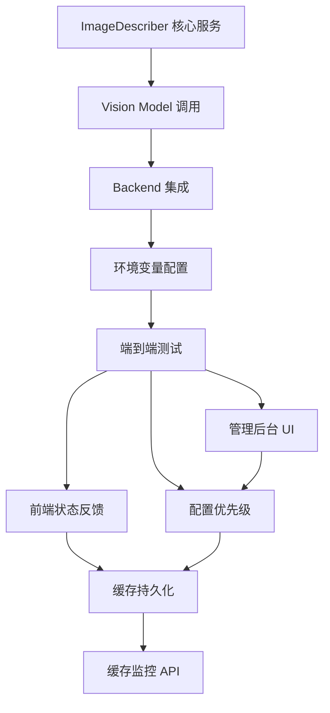

# 非多模态模型图片内容预描述方案（最终版）

> 版本：v2.1  
> 创建日期：2026-06-03  
> 更新日期：2026-06-03  
> 状态：✅ 可实施  
> 关联文档：[AI对话多模态图片上传方案.md](../已完成/02-核心问题根因分析/AI对话多模态图片上传方案.md)

---

## 一、概述

### 1.1 问题与目标

**问题**：非多模态模型（`supportsImages: false`）无法理解用户发送的图片内容

**目标**：让非多模态模型也能"看到"图片，同时保持用户模型选择自由

### 1.2 核心方案

**图片内容预描述（Image Pre-Description）**

```
用户发送图片 → 检测模型能力 → 不支持图片？
  ├─ 是 → 管理后台已配置识图模型？
  │   ├─ 是 → 调用多模态模型生成文字描述 → 注入消息 → 发送
  │   └─ 否 → 直接报错：「当前模型不支持图片，请联系管理员配置识图模型」
  └─ 否 → 直接发送（现有多模态流程）
```

**注入格式**：

```
【图片内容】{描述文本}

【用户问题】{用户原文}
```

### 1.3 关键优势

| 优势             | 说明                                             |
| ---------------- | ------------------------------------------------ |
| 用户无感知       | 自动触发，无需手动操作                           |
| 低成本           | 单次 ¥0.0007（gpt-4o-mini）                      |
| 高性能           | 缓存命中率 30-80%，延迟 < 10ms                   |
| 易实施           | P0 阶段 4.5 天完成核心功能                       |
| 管理后台显式控制 | 管理员必须主动配置识图模型，未配置则拒绝图片请求 |

---

## 二、架构设计

### 2.1 数据流

```
前端（author-site）
  useChatStream.handleSend
  ├─ 检测 supportsImages
  └─ 不支持时显示「正在分析图片...」或报错
      ↓ WebSocket
agent-service
  ImageDescriber Service
  ├─ 检查管理后台是否已配置识图模型
  ├─ 未配置 → 抛出错误，提示用户不支持图片
  ├─ 已配置 → 检查缓存（SHA-256）
  ├─ 缓存命中 → 返回描述
  ├─ 缓存未命中 → 调用 Vision Model
  └─ 注入描述到消息
      ↓ 纯文本消息
LLM Backend（非多模态模型）
  正常处理增强后的文本
```

### 2.2 拦截点选择

**后端拦截**（推荐）

| 对比维度 | 后端拦截        | 前端拦截      |
| -------- | --------------- | ------------- |
| 缓存共享 | ✅ 跨会话       | ❌ 仅限会话   |
| 代码复用 | ✅ 所有 Backend | ❌ 需重复实现 |
| 逻辑集中 | ✅ 统一管理     | ❌ 分散多处   |

**拦截位置**：`packages/agent-service/src/backends/base.ts` 的 `sendMessage` 方法

---

## 三、核心设计

### 3.1 ImageDescriber 服务

**文件**：`packages/agent-service/src/services/image-describer.ts`

```typescript
import { ImageAttachment } from "@opencode-workbench/shared";
import crypto from "crypto";
import { logger } from "../utils/logger";

export interface ImageDescription {
  hash: string; // 图片 SHA-256 哈希
  description: string; // 生成的文字描述
  fromCache: boolean; // 是否来自缓存
}

export interface ImageDescriberConfig {
  enabled: boolean; // 是否启用（默认 false，需管理后台显式开启）
  visionModelId: string; // 预描述使用的多模态模型（必须显式指定）
  describePrompt: string; // 描述提示词
  maxCacheSize: number; // 缓存最大条目数
  timeout: number; // 超时（毫秒）
}

/**
 * 图片预描述专用错误
 * 用于区分「未配置」和「运行时失败」两种场景
 */
export class ImageDescriptionError extends Error {
  constructor(
    public code: string,
    message: string,
  ) {
    super(message);
    this.name = "ImageDescriptionError";
  }
}

const DEFAULT_PROMPT = `请用简洁的中文描述这张图片的内容。
重点关注：
- UI 元素（按钮、表单、布局、颜色）
- 代码或文本内容（如可见）
- 图表或数据结构（如可见）
- 整体设计风格和意图

要求：
- 描述控制在 150 字以内
- 使用技术相关术语
- 避免主观猜测`;

export class ImageDescriber {
  private cache = new Map<string, string>(); // hash → description
  private config: ImageDescriberConfig;
  private hitCount = 0;
  private missCount = 0;

  constructor(config: Partial<ImageDescriberConfig> = {}) {
    // 1. 默认值（默认关闭，需管理后台显式启用）
    this.config = {
      enabled: false,
      visionModelId: "",
      describePrompt: DEFAULT_PROMPT,
      maxCacheSize: 500,
      timeout: 10000,
      ...config,
    };

    // 2. 环境变量覆盖
    this.loadEnvConfig();

    // 3. 管理后台配置覆盖（运行时动态读取）
    this.loadAdminConfig();
  }

  /**
   * 对图片数组生成描述
   */
  /**
   * 检查预描述是否可用（已启用且配置了识图模型）
   */
  isAvailable(): boolean {
    return this.config.enabled && this.config.visionModelId !== "";
  }

  /**
   * 对图片数组生成描述
   * 调用前应先检查 isAvailable()，否则抛出错误
   */
  async describe(images: ImageAttachment[]): Promise<string> {
    if (!this.config.enabled) {
      throw new ImageDescriptionError(
        "IMAGE_DESCRIPTION_DISABLED",
        "图片预描述功能未启用，请联系管理员在管理后台配置识图模型",
      );
    }

    if (!this.config.visionModelId) {
      throw new ImageDescriptionError(
        "VISION_MODEL_NOT_CONFIGURED",
        "未配置识图模型，请联系管理员在管理后台选择预描述视图模型",
      );
    }

    if (images.length === 0) {
      return "";
    }

    const descriptions = await Promise.all(
      images.map(async (img) => {
        const hash = this.computeHash(img.data);

        // 检查缓存
        if (this.cache.has(hash)) {
          this.hitCount++;
          return {
            hash,
            description: this.cache.get(hash)!,
            fromCache: true,
          };
        }

        // 调用多模态模型
        this.missCount++;
        const description = await this.callVisionModel(img);
        this.updateCache(hash, description);

        return { hash, description, fromCache: false };
      }),
    );

    return this.formatDescriptions(descriptions);
  }

  /**
   * 计算图片 SHA-256 哈希
   */
  private computeHash(base64Data: string): string {
    return crypto.createHash("sha256").update(base64Data).digest("hex");
  }

  /**
   * 调用多模态模型生成描述
   */
  private async callVisionModel(img: ImageAttachment): Promise<string> {
    const controller = new AbortController();
    const timeoutId = setTimeout(() => controller.abort(), this.config.timeout);

    try {
      // TODO: 实现实际的 API 调用
      // 复用现有 Backend 架构，临时创建 Vision Backend 实例
      const response = await this.invokeVisionModel({
        model: this.config.visionModelId,
        messages: [
          {
            role: "user",
            content: [
              { type: "image", image: img.data, mimeType: img.mimeType },
              { type: "text", text: this.config.describePrompt },
            ],
          },
        ],
        maxTokens: 300,
      });

      clearTimeout(timeoutId);
      return response.content.trim();
    } catch (error) {
      clearTimeout(timeoutId);
      logger.error({ error, image: img.name }, "Vision model call failed");

      // 降级策略：返回图片元数据
      return `[图片：${img.name || "未命名"}，格式：${img.mimeType}]`;
    }
  }

  /**
   * 更新缓存（LRU 策略）
   */
  private updateCache(hash: string, description: string): void {
    if (this.cache.size >= this.config.maxCacheSize) {
      const firstKey = this.cache.keys().next().value;
      if (firstKey) {
        this.cache.delete(firstKey);
      }
    }
    this.cache.set(hash, description);
  }

  /**
   * 格式化多张图片的描述
   */
  private formatDescriptions(descriptions: ImageDescription[]): string {
    if (descriptions.length === 0) return "";

    const parts = descriptions.map((desc, idx) => {
      const header = descriptions.length > 1 ? `图片 ${idx + 1}：` : "";
      const cacheTag = desc.fromCache ? "（缓存）" : "";
      return `${header}${desc.description}${cacheTag}`;
    });

    return parts.join("\n\n");
  }

  /**
   * 从环境变量加载配置
   */
  private loadEnvConfig(): void {
    if (process.env.IMAGE_DESCRIPTION_ENABLED === "false") {
      this.config.enabled = false;
    }
    if (process.env.IMAGE_DESCRIPTION_MODEL) {
      this.config.visionModelId = process.env.IMAGE_DESCRIPTION_MODEL;
    }
    if (process.env.IMAGE_DESCRIPTION_TIMEOUT) {
      this.config.timeout = parseInt(process.env.IMAGE_DESCRIPTION_TIMEOUT);
    }
    if (process.env.IMAGE_DESCRIPTION_MAX_CACHE) {
      this.config.maxCacheSize = parseInt(
        process.env.IMAGE_DESCRIPTION_MAX_CACHE,
      );
    }
    if (process.env.IMAGE_DESCRIPTION_PROMPT) {
      this.config.describePrompt = process.env.IMAGE_DESCRIPTION_PROMPT;
    }
  }

  /**
   * 从管理后台加载配置（运行时动态读取）
   */
  private async loadAdminConfig(): Promise<void> {
    const adminConfig = await getAdminConfig(); // 从数据库读取
    if (adminConfig.imageDescription) {
      Object.assign(this.config, adminConfig.imageDescription);
    }
  }

  /**
   * 配置变更时热更新
   */
  async updateConfig(newConfig: Partial<ImageDescriberConfig>): Promise<void> {
    Object.assign(this.config, newConfig);
    if (newConfig.maxCacheSize !== undefined) {
      this.resizeCache(newConfig.maxCacheSize);
    }
  }

  /**
   * 清理缓存
   */
  clearCache(): void {
    this.cache.clear();
    this.hitCount = 0;
    this.missCount = 0;
  }

  /**
   * 获取缓存统计信息
   */
  getCacheStats() {
    return {
      size: this.cache.size,
      maxSize: this.config.maxCacheSize,
      hitCount: this.hitCount,
      missCount: this.missCount,
    };
  }

  /**
   * 调整缓存大小
   */
  private resizeCache(newSize: number): void {
    if (newSize < this.cache.size) {
      const keysToDelete = Array.from(this.cache.keys()).slice(
        0,
        this.cache.size - newSize,
      );
      keysToDelete.forEach((key) => this.cache.delete(key));
    }
    this.config.maxCacheSize = newSize;
  }
}
```

### 3.2 后端集成

**文件**：`packages/agent-service/src/backends/base.ts`

```typescript
async sendMessage(
  content: string,
  options?: SendMessageOptions
): Promise<string> {
  const { images, ...restOptions } = options || {};

  // 检测当前模型是否支持图片
  const modelInfo = await this.getModelInfo();
  const currentModel = modelInfo.availableModels.find(
    (m) => m.id === modelInfo.currentModelId
  );
  const supportsImages = currentModel?.supportsImages ?? false;

  let enhancedContent = content;

  // 如果有图片但模型不支持，检查预描述配置
  if (images && images.length > 0 && !supportsImages) {
    const describer = this.getImageDescriber();

    // 未配置识图模型 → 直接报错
    if (!describer.isAvailable()) {
      logger.warn(
        { modelId: modelInfo.currentModelId, imageCount: images.length },
        "Image sent to non-vision model but image description not configured"
      );
      throw new Error(
        "当前模型不支持图片处理。请联系管理员在管理后台配置识图模型以启用图片理解功能。"
      );
    }

    logger.info(
      { imageCount: images.length, modelId: modelInfo.currentModelId },
      "Triggering image pre-description for non-vision model"
    );

    const imageDescription = await describer.describe(images);

    // 注入描述到消息
    enhancedContent = `【图片内容】${imageDescription}\n\n【用户问题】${content}`;

    logger.info(
      {
        originalLength: content.length,
        enhancedLength: enhancedContent.length,
      },
      "Image description injected into message"
    );
  }

  // 继续原有发送逻辑（使用 enhancedContent）
  return this.sendToLLM(enhancedContent, restOptions);
}
```

### 3.3 前端状态反馈

**文件**：`packages/author-site/src/components/ai-elements/chat/hooks/use-chat-stream.ts`

```typescript
const [isDescribingImages, setIsDescribingImages] = useState(false);

const handleSend = useCallback(
  async (userMessage: string, images?: ImageAttachment[]) => {
    // 检测是否需要预描述
    const currentModel = models.find((m) => m.id === currentModelId);
    const needsDescription =
      images && images.length > 0 && !currentModel?.supportsImages;

    if (needsDescription) {
      setIsDescribingImages(true);
    }

    try {
      // 发送消息（后端会处理预描述或报错）
      streamService.sendMessage(userMessage, workingDir, images);

      // 添加用户消息到历史
      setMessages((prev) => [
        ...prev,
        {
          id: `user-${Date.now()}`,
          role: "user",
          content: userMessage.trim(),
          parts: [
            ...(needsDescription
              ? [{ type: "system" as const, content: "🔍 正在分析图片..." }]
              : []),
            ...(images?.map((img) => ({
              type: "image" as const,
              url: `data:${img.mimeType};base64,${img.data}`,
            })) || []),
          ],
        },
      ]);
    } catch (error) {
      // 后端报错（如未配置识图模型）→ 显示错误消息
      if (needsDescription && error instanceof Error) {
        setMessages((prev) => [
          ...prev,
          {
            id: `error-${Date.now()}`,
            role: "assistant",
            content: `⚠️ ${error.message}`,
            parts: [{ type: "system" as const, content: error.message }],
          },
        ]);
      }
    } finally {
      if (needsDescription) {
        setIsDescribingImages(false);
      }
    }
  },
  [currentModelId, models, streamService, workingDir],
);
```

---

## 四、配置方案

### 4.1 配置优先级

```
管理后台配置 > 环境变量 > 默认值
```

### 4.2 环境变量配置（P0）

`.env` 新增：

```bash
# 图片预描述配置（默认关闭，需管理后台显式配置识图模型后才启用）
IMAGE_DESCRIPTION_ENABLED=false
# IMAGE_DESCRIPTION_MODEL=gpt-4o-mini  # 不设置时使用管理后台配置
IMAGE_DESCRIPTION_TIMEOUT=10000
IMAGE_DESCRIPTION_MAX_CACHE=500
# IMAGE_DESCRIPTION_PROMPT="..."  # 不设置时使用内置默认提示词
```

### 4.3 管理后台配置（P1）

在 `/admin/model-config` 页面新增「图片处理」配置区：

#### 数据结构扩展

```typescript
// packages/author-site/src/app/admin/model-config/page.tsx

interface ModelConfigState {
  enabledModels: string[];
  autoEnableRules: AutoEnableRule[];
  blacklist: string[];
  multimodalModels: string[];
  // 新增
  imageDescription?: {
    enabled: boolean;
    visionModelId: string; // 预描述使用的多模态模型
    customPrompt?: string; // 自定义提示词
    maxCacheSize?: number; // 缓存上限
    timeout?: number; // 超时（秒）
  };
}

const DEFAULT_IMAGE_DESCRIPTION = {
  enabled: false, // 默认关闭，管理员必须显式启用
  visionModelId: "", // 必须显式选择识图模型，不支持自动选择
  customPrompt: "",
  maxCacheSize: 500,
  timeout: 10,
};
```

#### API 扩展

```typescript
// GET /admin/model-config 响应增加 imageDescription
interface ModelConfigResponse {
  frontend: { enabledModels: string[] /* ... */ };
  multimodalModels: string[];
  imageDescription?: {
    enabled: boolean;
    visionModelId: string;
    customPrompt?: string;
    maxCacheSize?: number;
    timeout?: number;
  };
}

// GET /admin/image-description/stats
// 返回缓存统计
interface CacheStatsResponse {
  success: true;
  data: {
    size: number;
    maxSize: number;
    hitCount: number;
    missCount: number;
  };
}

// POST /admin/image-description/cache/clear
// 清空缓存
```

#### 配置校验规则

```typescript
function validateImageDescription(config: ModelConfigState): string | null {
  if (!config.imageDescription?.enabled) return null;

  const visionModelId = config.imageDescription.visionModelId;

  // 必须显式选择识图模型
  if (!visionModelId) {
    return "启用图片预描述必须选择一个识图模型";
  }

  // 识图模型必须已启用
  if (!config.enabledModels.includes(visionModelId)) {
    return "识图模型必须已启用（在上方模型列表中打开对应开关）";
  }

  // 识图模型必须支持多模态
  if (!config.multimodalModels.includes(visionModelId)) {
    return "识图模型必须支持多模态（图片输入）";
  }

  return null;
}
```

#### UI 组件

```tsx
{
  /* 图片处理配置区 */
}
<section className="bg-neutral-900 rounded-lg border border-neutral-800 p-6">
  <header className="mb-4 flex items-center gap-2">
    <ImageIcon className="h-5 w-5 text-blue-400" />
    <div>
      <h3 className="text-lg font-semibold text-neutral-50">图片处理</h3>
      <p className="text-sm text-neutral-400 mt-1">
        当用户使用非多模态模型发送图片时，自动调用识图模型转换为文字描述。
        未启用或未配置识图模型时，用户发送图片将收到错误提示。
      </p>
    </div>
  </header>

  <div className="space-y-4">
    {/* 启用开关 */}
    <div className="flex items-center justify-between">
      <div>
        <div className="text-sm font-medium text-neutral-200">
          启用图片预描述
        </div>
        <div className="text-xs text-neutral-500">
          启用后需选择识图模型，未配置时用户发送图片将报错
        </div>
      </div>
      <Switch
        checked={config.imageDescription?.enabled ?? false}
        onCheckedChange={(v) =>
          setConfig((prev) => ({
            ...prev,
            imageDescription: {
              ...DEFAULT_IMAGE_DESCRIPTION,
              ...prev.imageDescription,
              enabled: v,
            },
          }))
        }
      />
    </div>

    {/* 视图模型选择 */}
    {config.imageDescription?.enabled && (
      <>
        <div>
          <label className="block text-sm font-medium text-neutral-200 mb-2">
            预描述视图模型
          </label>
          <select
            value={config.imageDescription.visionModelId || ""}
            onChange={(e) =>
              setConfig((prev) => ({
                ...prev,
                imageDescription: {
                  ...prev.imageDescription!,
                  visionModelId: e.target.value,
                },
              }))
            }
            className="w-full bg-neutral-800 border border-neutral-700 rounded-lg px-3 py-2 text-sm text-neutral-200"
          >
            <option value="" disabled>
              请选择识图模型（必选）
            </option>
            {availableModels
              .filter((m) => m.supportsImages)
              .map((m) => (
                <option key={m.id} value={m.id}>
                  {m.label}
                </option>
              ))}
          </select>
        </div>

        {/* 描述提示词 */}
        <div>
          <label className="block text-sm font-medium text-neutral-200 mb-2">
            描述提示词（可选）
          </label>
          <textarea
            value={config.imageDescription.customPrompt || ""}
            onChange={(e) =>
              setConfig((prev) => ({
                ...prev,
                imageDescription: {
                  ...prev.imageDescription!,
                  customPrompt: e.target.value,
                },
              }))
            }
            placeholder={DEFAULT_PROMPT}
            rows={3}
            className="w-full bg-neutral-800 border border-neutral-700 rounded-lg px-3 py-2 text-sm text-neutral-200"
          />
        </div>

        {/* 缓存配置 */}
        <div className="grid grid-cols-2 gap-4">
          <div>
            <label className="block text-sm font-medium text-neutral-200 mb-2">
              缓存最大条目数
            </label>
            <Input
              type="number"
              value={config.imageDescription.maxCacheSize ?? 500}
              onChange={(e) =>
                setConfig((prev) => ({
                  ...prev,
                  imageDescription: {
                    ...prev.imageDescription!,
                    maxCacheSize: parseInt(e.target.value) || 500,
                  },
                }))
              }
              className="bg-neutral-800 border-neutral-700"
            />
          </div>
          <div>
            <label className="block text-sm font-medium text-neutral-200 mb-2">
              超时时间（秒）
            </label>
            <Input
              type="number"
              value={config.imageDescription.timeout ?? 10}
              onChange={(e) =>
                setConfig((prev) => ({
                  ...prev,
                  imageDescription: {
                    ...prev.imageDescription!,
                    timeout: parseInt(e.target.value) || 10,
                  },
                }))
              }
              className="bg-neutral-800 border-neutral-700"
            />
          </div>
        </div>

        {/* 缓存统计与清空 */}
        <div className="flex items-center justify-between pt-2 border-t border-neutral-800">
          <div className="text-sm text-neutral-400">
            缓存统计：已缓存 23 条 / 最大 500 条
          </div>
          <Button
            variant="outline"
            size="sm"
            onClick={handleClearCache}
            className="border-neutral-700 text-neutral-300"
          >
            清空缓存
          </Button>
        </div>
      </>
    )}
  </div>
</section>;
```

---

## 五、实施计划

### 5.1 阶段与工时

| 阶段   | 任务                           | 工时   | 依赖           |
| ------ | ------------------------------ | ------ | -------------- |
| **P0** | 实现 ImageDescriber 核心服务   | 2 天   | -              |
| **P0** | 集成到 BaseBackend.sendMessage | 1 天   | ImageDescriber |
| **P0** | 环境变量配置 + 日志            | 0.5 天 | -              |
| **P0** | 端到端测试（核心功能验证）     | 1 天   | 上述全部       |
| **P1** | 前端加载状态反馈               | 1 天   | 后端集成       |
| **P1** | 描述缓存持久化（SQLite）       | 1 天   | 核心服务       |
| **P1** | 管理后台配置界面（UI + API）   | 2 天   | 核心服务       |
| **P1** | 配置读取优先级实现             | 0.5 天 | 配置界面       |
| **P2** | 缓存监控与统计 API             | 1 天   | 缓存持久化     |
| **P2** | 用户自定义描述提示词模板       | 1 天   | 配置界面       |

**总计**：P0 4.5 天 | P1 4.5 天 | P2 2 天

### 5.2 实施顺序



### 5.3 关键里程碑

| 里程碑 | 完成标志                           | 预计        |
| ------ | ---------------------------------- | ----------- |
| M1     | 非多模态模型可理解图片内容         | P0 + 4.5 天 |
| M2     | 管理员可配置视图模型、提示词、缓存 | P1 + 4.5 天 |
| M3     | 缓存持久化、监控统计完善           | P2 + 2 天   |

---

## 六、测试要点

### 6.1 功能测试

| 测试场景                             | 预期行为                            |
| ------------------------------------ | ----------------------------------- |
| 发送 1 张图片 + 文本（非多模态模型） | 消息包含图片描述，AI 能理解图片内容 |
| 发送 5 张图片（非多模态模型）        | 所有图片都被描述，消息格式正确      |
| 发送相同图片 2 次                    | 第 2 次使用缓存，延迟显著降低       |
| 切换到多模态模型发送图片             | 直接发送，不触发预描述              |
| Vision Model 调用超时                | 降级为图片元数据描述                |
| 管理员未配置识图模型时用户发送图片   | 直接报错提示，管理员需显式配置      |

### 6.2 性能测试

| 测试项                 | 指标          |
| ---------------------- | ------------- |
| 单张图片描述延迟       | < 3 秒（P95） |
| 5 张图片并行描述延迟   | < 5 秒（P95） |
| 缓存命中率             | > 30%（预期） |
| 内存占用（500 条缓存） | < 50MB        |

### 6.3 集成测试

```bash
# 1. 启动服务
pnpm dev

# 2. 选择非多模态模型（如 deepseek-v4-flash）

# 3. 发送带图片的消息
# 验证：
# - agent-service 日志显示 "Triggering image pre-description"
# - 消息注入格式正确
# - AI 回复提及图片内容

# 4. 再次发送相同图片
# 验证：
# - 日志显示 "（缓存）"
# - 延迟显著降低
```

---

## 七、风险与缓解

### 7.1 技术风险

| 风险                | 概率 | 影响 | 缓解措施                           |
| ------------------- | ---- | ---- | ---------------------------------- |
| Vision Model 不可用 | 中   | 高   | 降级为元数据描述，前端显示错误提示 |
| 描述质量差          | 低   | 中   | 支持自定义 prompt，可迭代优化      |
| 缓存内存溢出        | 低   | 中   | LRU 淘汰，限制 maxCacheSize        |
| 配置热更新 bug      | 低   | 中   | 完善的类型校验 + 单元测试          |

### 7.2 业务风险

| 风险          | 概率 | 影响 | 缓解措施                           |
| ------------- | ---- | ---- | ---------------------------------- |
| 额外 API 成本 | 中   | 低   | 低成本模型（¥0.0007/次），缓存优化 |
| 描述延迟      | 中   | 中   | 前端加载状态，并行处理             |
| 隐私问题      | 低   | 高   | 描述后丢弃原始图片，不持久化       |

---

## 八、性能与成本

### 8.1 延迟评估

| 场景                 | 延迟   | 说明               |
| -------------------- | ------ | ------------------ |
| 缓存命中             | < 10ms | 直接返回缓存描述   |
| 缓存未命中（1 张图） | 1-3 秒 | 调用一次多模态 API |
| 缓存未命中（5 张图） | 2-5 秒 | 并行调用，取最慢者 |

### 8.2 成本估算（gpt-4o-mini）

- 输入：图片 ~500 tokens + 提示词 ~100 tokens = 600 tokens
- 输出：描述 ~150 tokens
- 单次成本：750 tokens × $0.15/1M = **$0.0001（约 ¥0.0007）**

**日均 100 次**：约 ¥0.07/天，¥2/月

### 8.3 缓存优化

预期命中率：

- 同一用户重复发送相同截图：30-50%
- 设计稿参考图（可能重复使用）：60-80%
- 随机网络图片：< 5%

---

## 九、相关文件

### 9.1 需修改的文件

| 文件                                                                            | 改动类型 | 说明                               |
| ------------------------------------------------------------------------------- | -------- | ---------------------------------- |
| `packages/agent-service/src/services/image-describer.ts`                        | 新增     | 核心预描述服务                     |
| `packages/agent-service/src/backends/base.ts`                                   | 修改     | 集成预描述逻辑                     |
| `packages/agent-service/src/core/types.ts`                                      | 修改     | 新增配置类型                       |
| `packages/agent-service/src/routes/admin/model-config.ts`                       | 修改     | 扩展 API 支持 imageDescription     |
| `packages/agent-service/src/routes/admin/image-description.ts`                  | 新增     | 缓存管理 API                       |
| `packages/author-site/src/app/admin/model-config/page.tsx`                      | 修改     | 新增图片处理配置区域               |
| `packages/author-site/src/components/ai-elements/chat/hooks/use-chat-stream.ts` | 修改     | 前端状态反馈                       |
| `packages/shared/src/index.ts`                                                  | 修改     | 新增 `ImageDescriptionConfig` 类型 |
| `.env`                                                                          | 修改     | 新增环境变量                       |

### 9.2 参考文件

- [AI对话多模态图片上传方案.md](../已完成/02-核心问题根因分析/AI对话多模态图片上传方案.md) — 图片上传全链路
- [ModelSelectWithGuard](file:///Users/qh2/Documents/PGM/1·Work/opencode-workbench/packages/author-site/src/components/ai-elements/chat/model-select-with-guard.tsx) — 现有模型守卫
- [ModelConfigPage](file:///Users/qh2/Documents/PGM/1·Work/opencode-workbench/packages/author-site/src/app/admin/model-config/page.tsx) — 管理后台模型配置
- `packages/agent-service/src/backends/opencode-http.ts` — Backend 实现参考
- `packages/shared/src/index.ts` — 共享类型定义

---

## 十、决策记录

### 10.1 为什么选择后端拦截而非前端？

| 对比维度 | 后端拦截             | 前端拦截              |
| -------- | -------------------- | --------------------- |
| 缓存共享 | ✅ 跨会话共享        | ❌ 仅限当前会话       |
| 代码复用 | ✅ 所有 Backend 复用 | ❌ 每个前端组件需实现 |
| 逻辑集中 | ✅ 统一管理          | ❌ 分散多处           |
| 用户反馈 | ⚠️ 需额外通信        | ✅ 即时反馈           |

**结论**：后端拦截更优，前端仅负责加载状态显示。

### 10.2 为什么使用 SHA-256 而非完整 Base64 作为缓存键？

- Base64 字符串过长（单张图片可能 1-5MB）
- Map 键比较性能差
- SHA-256 固定 64 字符，碰撞概率极低（2^256）

### 10.3 为什么选择 LRU 缓存而非其他策略？

- **LRU**（最近最少使用）：适合图片缓存场景（近期图片更可能重复）
- **LFU**（最不经常使用）：需要额外计数器，复杂度高
- **FIFO**（先进先出）：可能淘汰常用图片

### 10.4 为什么移除自动模式，要求管理后台显式配置？

| 对比维度 | 自动模式（已移除）              | 显式配置（当前方案）          |
| -------- | ------------------------------- | ----------------------------- |
| 安全性   | ⚠️ 可能意外调用 API 产生费用    | ✅ 管理员明确知晓并同意       |
| 可预测性 | ⚠️ 自动选择哪个模型不确定       | ✅ 管理员明确指定识图模型     |
| 责任边界 | ⚠️ 系统自行决策，出问题难以追责 | ✅ 管理员主动配置，权责清晰   |
| 用户体感 | ⚠️ 未配置时默默降级，用户不知   | ✅ 未配置时明确报错，引导配置 |

**结论**：显式配置更符合管理后台可控的设计原则，避免系统在管理员不知情的情况下调用外部 API。未配置识图模型时，用户发送图片会收到明确错误提示，引导管理员完成配置。

---

## 十一、调试指南

### 11.1 验证预描述是否触发

```typescript
// packages/agent-service/src/backends/base.ts
logger.info(
  {
    modelId: currentModelId,
    supportsImages,
    imageCount: images?.length,
    willDescribe: images?.length > 0 && !supportsImages,
  },
  "Image pre-description decision",
);
```

### 11.2 检查描述质量

```typescript
// ImageDescriber.callVisionModel 后添加
logger.info(
  {
    imageHash: hash,
    descriptionLength: description.length,
    description: description.substring(0, 200), // 截断日志
    fromCache: false,
  },
  "Image description generated",
);
```

### 11.3 缓存命中率监控

```typescript
// 定期输出统计
setInterval(() => {
  const stats = describer.getCacheStats();
  logger.info(stats, "Image description cache stats");
}, 60000); // 每分钟
```

---

## 十二、总结

本方案通过**图片内容预描述**技术，让非多模态模型也能理解图片内容。

**核心优势**：

1. ✅ 管理后台显式控制：管理员主动配置识图模型，未配置时安全拒绝
2. ✅ 用户无感知：配置后自动触发，保持模型选择自由
3. ✅ 低成本：单次描述约 ¥0.0007，日均 100 次仅 ¥2/月
4. ✅ 高性能：缓存命中率预期 30-80%，延迟 < 10ms
5. ✅ 易实施：4.5 天完成核心功能，向后兼容

**下一步**：

1. 评审方案文档（团队 review）
2. 确认 P0 阶段排期（4.5 天）
3. 创建 Git worktree（隔离开发）
4. 开始实施 Task 1（ImageDescriber 核心服务）
