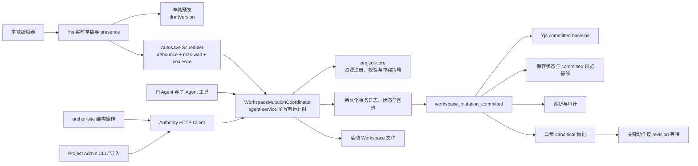

# 创作端 Workspace 写入一致性：单写者事务改造方案

> 状态：待实施
> 目标执行方式：在一个目标模式任务中完成全部代码、迁移工具、测试、浏览器验收和文档收口，不拆成多轮渐进上线
> 任务代号：`WMA`（Workspace Mutation Authority）
> 创建日期：2026-07-10
> 最近修订：2026-07-10，拆分实时草稿、可靠保存和关键物化三条路径，补充离线草稿、保存调度、性能 SLO 和跨进程单写者约束

## 一、目标模式执行约定

本文件是本次跨模块改造的唯一执行清单。目标模式启动后应持续推进，直到所有必做任务、验证和文档同步完成；不要在每个阶段结束后等待用户确认，也不要把“兼容层已搭好”当成完成。

执行时遵守以下约定：

1. 先读取根目录 `AGENTS.md`、`packages/agent-service/AGENTS.md`、本文件和本文件列出的项目文档，再开始修改。
2. 开始前记录 `git status --short`，保留当前所有用户改动；禁止回滚、覆盖或整理无关 dirty changes。
3. 使用 CodeGraph 完成结构性入口和影响范围核对；只有搜索直接文件写入、事件名、错误码等字面量时使用 `rg`。
4. 所有 `WMA-*` 任务使用稳定 ID。执行过程中实时勾选，并在“进度记录”中只记录关键发现、方案调整、阻塞和验收结论。
5. 本任务允许在当前工作树内一次性完成跨包改造和本地服务重启；不包含正式环境发布、正式数据写入或生产流量切换，除非用户在目标模式中另行明确授权。
6. 不设置长期双写、长期 feature flag 或旧链路兜底。实现过程中可以短暂保留适配代码以维持编译，但最终验收前必须删除旧写入权威路径。
7. 不因测试困难降低一致性要求。若遇到真实阻塞，应先穷尽代码、日志、诊断 CLI 和本地浏览器验证；只有缺少外部密钥、正式环境授权或不可恢复外部状态时才请求用户介入。
8. 完成后使用 `doc-maintainer` 更新 `docs/项目文档/` 当前事实，再把本文件压缩后移动到 `docs/plans/已完成/`；不得把已完成清单长期留在 `进行中`。

## 二、背景与根因

### 2.1 用户可见问题

AI 对页面文件执行编辑后，工具和对话可能显示修改成功，但预览没有变化，或者短暂变化后同一个文件恢复成旧内容。用户无法判断“AI 成功”代表工具调用返回、磁盘已写入、协同状态已更新、自动保存已完成，还是预览已经消费新版本。

### 2.2 当前链路的问题

当前活动 Workspace 同时存在多条可以改变文件或内存当前态的路径：

- Pi Agent 的 `writeFile`、`editFile`、页面、Sketch、图片和子 Agent 工具可以直接写工作目录。
- `ToolHookManager` 在工具执行完成后反推文件变化，再发出 `file_operation`。
- `CollabRoomManager` 持有 Yjs 内存文档，并可 debounce 或 flush 写回文件。
- author-site 页面状态、refs、自动保存、页面 API、画布和知识库 API 也能推进 Workspace 内容。
- CLI、导入和 `ProjectAdminService` 有自己的项目与 Workspace 写入入口。
- `syncActiveWorkspaceToCanonical` 会把活动 Workspace 整体物化到项目基准工作区。

这些机制没有共享同一个提交版本和成功回执，因此会出现以下竞态：

1. AI 已改磁盘，但文件事件缺失，前端和协同房间仍持有旧文本。
2. 旧 Yjs 房间或旧页面 state 后续正常 flush，把磁盘恢复成旧内容。
3. 同一个文件的短路径、完整路径和资源类型映射不一致，重载通知没有命中。
4. Session、活动 Workspace、项目最新版本和 canonical Workspace 的状态推进不同步。
5. 工具“没有抛错”被错误等同为“持久化成功并已在预览生效”。

2026-07-10 的止血修复已经把带完整参数的 `tool_result` 作为文件事件来源，并给 `prototype.html` / `prototype.css` 建立独立协同资源；这能修复当前已知竞态，但仍属于“直接写文件后再通知其他副本对齐”的模型，不是长期唯一权威。

## 三、目标与非目标

### 3.1 必须实现的目标

1. 活动 Workspace 的所有内容变更只有一个权威提交入口。
2. AI、浏览器协同、author-site API、CLI、导入、页面/文件/画布/知识库操作都不能绕过该入口修改活动 Workspace。
3. 同一 Workspace 内的提交按单调递增 revision 排序；同一资源的旧版本永远不能静默覆盖新版本。
4. 每次变更具备幂等 ID、预期资源 hash、原子或可恢复的批量提交、持久化回执和明确错误码。
5. 实时编辑热路径与持久化路径解耦：本地编辑器、Yjs 和草稿预览即时响应，Authority 只处理合并后的可靠保存，不进入逐键输入热路径。
6. 协同房间和 React 状态可以持有未提交草稿，但无权覆盖更高 committed revision；canonical Workspace 只是 committed revision 的物化投影。
7. AI 工具只有收到持久化提交回执后才能报告“修改已提交”；预览应用状态由独立异步 ack 证明，不阻塞 mutation commit。
8. 事件丢失、WebSocket 重连、服务重启、重复请求和旧浏览器自动保存都不能导致内容回退。
9. 网络中断时允许继续本地编辑并保留离线草稿，但不能误报为服务器已保存；恢复连接后必须先对齐 committed revision 再受控提交。
10. 直接文件篡改必须被检测并失败关闭，不能被系统默认为合法新版本。
11. 一次性删除旧的外部写入路径猜测、`file_operation` 持久化语义和散落的资源类型条件分支。
12. 提供确定性单元、集成、E2E、真实浏览器、真实 AI 和性能 SLO 证据。

### 3.2 非目标

- 不把历史快照、内容图 commit 和 Workspace revision 合并为同一个概念。
- 不在本任务中重写 Yjs 协议；Yjs 继续负责同一房间内的实时合并和 presence。
- 不实现自动三方文本合并。发生同资源并发冲突时保留本地草稿、展示冲突并要求重试，禁止静默 last-write-wins。
- 不把 canonical Workspace 变成实时编辑源；它仍是发布、导出、历史和既有项目读取流程使用的物化结果。
- 不在未获授权时部署正式环境或修改正式数据。

## 四、不可妥协的系统不变量

以下不变量必须写入代码注释、测试名称和长期项目文档：

### INV-1：活动 Workspace 单写者

`scope=live` Workspace 激活后，只有 Workspace Mutation Authority 可以改变其受管资源。初始化过程只能通过 `bootstrap` 注册既有目录；注册完成后任何裸 `fs.write*`、`rename`、`rm`、shell 重定向或第三方工具写入都属于违规。

### INV-2：资源级冲突检测

每个变更必须携带目标资源的 `expectedHash`。Workspace 的 `baseRevision` 用于识别调用者看到的版本；如果 revision 只因无关资源推进、且所有目标资源 hash 仍匹配，可以在当前 revision 上安全 rebase。任何目标资源 hash 不匹配都返回 `WORKSPACE_RESOURCE_CONFLICT`，不能写入。

### INV-3：提交后才发事件

只有 durable receipt 已写入后才能广播 `workspace_mutation_committed`。`tool_result`、`tool_execution_end`、前端 setState、Yjs update 和 HTTP 200 都不能替代提交回执。

### INV-4：旧投影无权回写

协同房间记录自己最后应用的 committed resource hash。flush 时使用该 hash 提交；如果目标资源已经由其他 mutation 推进，旧房间只能进入冲突状态并保留草稿，不能覆盖文件。

### INV-5：草稿预览即时，可靠消费有版本

编辑态预览允许消费本地或 Yjs 合并草稿，必须在输入和协同更新后立即响应；同时记录 `draftVersion` 和其基于的 `committedRevision`。截图、自动修复判定、历史、发布和导出只消费 Authority 返回的 committed snapshot。草稿预览不能被标记为“已自动保存”，也不能作为发布输入。

### INV-6：项目历史版本与 Workspace revision 分离

`baseVersion` 表示项目历史版本基线；`revision` 表示活动 Workspace 当前态提交序列。创建项目版本可以推进 `baseVersion`，普通内容提交只推进 `revision`，两者不得互相替代。

### INV-7：关键动作绑定确切 revision

命名版本、自动检查点、发布、导出、模板、恢复和分支合并必须记录其消费的 `workspaceId` 和 `revision`。canonical 同步成功后记录 `canonicalSyncedRevision`，不能只记录时间戳。

### INV-8：成功状态由系统生成

用户界面的“修改已提交”“已自动保存”“预览已更新”由结构化 receipt 和 revision ack 生成，不从模型自然语言、工具名称或事件到达推断。

### INV-9：自动保存不等待 canonical

“已自动保存”只要求 live Workspace 的 mutation durable commit。canonical 作为异步物化投影，可以在后台追赶；命名版本、自动检查点、发布、导出、模板和恢复等关键动作必须显式等待 canonical 追到目标 revision。canonical 延迟或失败不能把已 durable commit 的内容显示成“未保存”。

### INV-10：实时热路径不进入 Authority

本地输入、Yjs 广播、presence 和草稿预览不得等待 mutation journal、文件系统写入、canonical 物化或预览 ack。Authority 接收 debounce/coalesce 后的资源快照和显式结构操作，不处理每次键盘输入。

## 五、最终架构



### 5.1 模块职责

| 模块 | 最终职责 |
|:-----|:-----|
| `@workbench/shared` | 传输协议、receipt、event、错误码、actor 和 operation 类型 |
| `@workbench/project-core` | 资源注册表、路径与类型校验、hash/manifest、冲突和 mutation policy；不得自行成为第二个 live Workspace 写进程 |
| `@workbench/agent-service` | 承载每个 live Workspace 的单写者 coordinator、持久化 lease、串行队列、事务日志、恢复、HTTP/WS、协同草稿 barrier 和 AI 工具适配 |
| `@workbench/author-site` | Authority client、Yjs/本地草稿热路径、autosave scheduler、离线草稿、保存状态、异步预览 revision ack 和关键动作编排；不直接写 live Workspace |
| `@workbench/project-cli` | branch Workspace 可继续隔离编辑；读取或改变 live Workspace、合并和 canonical 切换必须调用 Authority 协议 |
| screenshot/viewer | 只读 committed snapshot 或已绑定 revision 的物化产物 |

### 5.2 为什么不新增独立服务

agent-service 已承载协同房间、AI 工具和 Workspace flush，是当前唯一能在一次提交前同时看到“目标资源是否有未落盘协同草稿”和“AI 是否准备修改该资源”的运行时。把 coordinator 放在 agent-service 可以形成真正单写者，而不增加第五个部署服务。领域协议和策略仍放在 shared/project-core，避免逻辑被锁死在 Agent 代码中。

如果未来需要把 Authority 独立部署，应只迁移运行时宿主，不改变 mutation contract、journal 或调用方语义。

agent-service 当前部署必须明确保持一个 Authority 写实例，或为每个 Workspace 获取带 fencing token 的持久化 lease。仅靠进程内 Map/Promise queue 不能满足多实例单写者；第二个实例未获得 lease 时只能代理或拒绝写入，不能自行提交。部署 preflight 必须校验该约束。

## 六、核心数据协议

以下类型名是稳定目标名；实现时允许根据现有导入风格拆文件，但不得改变语义。

### 6.1 Workspace 状态

```ts
interface WorkspaceAuthorityState {
  workspaceId: string;
  projectId: string;
  revision: number;
  rootHash: string;
  resourceHashes: Record<string, string>;
  lastCommittedMutationId: string | null;
  updatedAt: number;
}
```

Authority 状态存放在可配置 `DATA_DIR` 下的独立内部目录，不放入可编辑 Workspace，也不进入发布、模板或项目导出：

```text
data/workspace-authority/{workspaceId}/
├── state.json
├── journal.jsonl
├── receipts/{mutationId}.json
└── staging/{mutationId}/
```

`state.json`、receipt 和 staging manifest 均使用临时文件加 rename。`journal.jsonl` 只追加 `prepared`、`committed`、`rolled_back`、`recovered` 记录。服务启动时必须先恢复未完成事务，再把 Workspace 标记为 ready。

`.workspace.json` 可以镜像当前 `revision` 和 `rootHash` 便于诊断，但 Authority 内部 state 才是提交序列权威。旧代码忽略新增字段，因此数据格式保持可回滚兼容。

### 6.2 Mutation 请求

```ts
interface WorkspaceMutationRequest {
  mutationId: string;
  projectId: string;
  workspaceId: string;
  sessionId?: string;
  baseRevision: number;
  actor: WorkspaceMutationActor;
  reason: string;
  operations: WorkspaceMutationOperation[];
}
```

operation 至少覆盖：

- `put_text`：文本文件完整内容或由服务端应用的精确 patch。
- `put_binary`：已暂存 blob 的引用、目标路径、hash 和大小。
- `delete_path`：删除文件或受控目录。
- `move_path`：同一 Workspace 内的受控重命名或移动。

每个改变既有资源的 operation 必须携带 `expectedHash`；创建必须显式声明 `expectedAbsent: true`。一个 mutation 的所有 operation 要么全部提交，要么全部回滚或在启动恢复时收敛到单一结果。

### 6.3 提交回执

```ts
interface WorkspaceMutationReceipt {
  committed: true;
  mutationId: string;
  projectId: string;
  workspaceId: string;
  baseRevision: number;
  revision: number;
  rootHash: string;
  actor: WorkspaceMutationActor;
  resources: Array<{
    path: string;
    action: "created" | "modified" | "deleted" | "moved";
    beforeHash: string | null;
    afterHash: string | null;
  }>;
  committedAt: number;
}
```

重复提交相同 `mutationId` 时必须返回同一 receipt，不能生成新 revision。相同 `mutationId` 携带不同 payload 时返回 `WORKSPACE_MUTATION_ID_REUSED`。

预览投影不是 mutation 事务的一部分，使用独立状态表达：

```ts
interface WorkspaceProjectionAck {
  projectId: string;
  workspaceId: string;
  revision: number;
  mutationId?: string;
  clientId: string;
  surface: "active-preview" | "canvas-preview" | "screenshot";
  status: "applied" | "failed";
  runtimeError?: {
    code: string;
    message: string;
  };
  acknowledgedAt: number;
}
```

receipt 一旦 durable 就立即返回。Projection ack 可以晚到、缺失或失败，只改变“预览是否已应用”的独立状态，不能把已 committed mutation 改成失败。

### 6.4 事件

唯一持久化完成事件为 `workspace_mutation_committed`，payload 直接使用 receipt 的稳定子集。事件采用至少一次投递；客户端按 `(workspaceId, revision)` 去重。

编辑页建立一个 Workspace 级事件连接，握手携带 `lastAppliedRevision`：

- 如果没有缺口，继续增量消费。
- 如果服务端 revision 大于客户端 revision + 1，客户端读取最新 committed snapshot 后整体对齐。
- WebSocket 事件丢失不能影响数据正确性，只影响短暂刷新时延。
- 当前连接编辑器应用资源并完成预览刷新后异步回传 `workspace_revision_applied`；该 ack 只用于用户状态、诊断和 SLO，不参与 mutation commit 请求的完成条件。

## 七、冲突、协同和成功语义

### 7.1 同资源冲突

若 `expectedHash` 与 committed hash 不同：

1. 返回 `409 WORKSPACE_RESOURCE_CONFLICT`。
2. 响应包含当前 revision、当前 hash 和冲突资源路径，不默认返回敏感完整内容。
3. AI 工具必须重新读取后重试；不能把冲突包装成成功。
4. 协同房间保留未提交 Yjs 草稿，状态变为 conflict，并向用户提供“重新载入当前版本”或后续人工合并入口；本任务不自动合并。

### 7.2 协同草稿 barrier

AI、CLI、导入或非 collab actor 修改某个资源前，coordinator 必须询问 `CollabDraftProvider`：

- 目标资源房间 clean：直接读取 committed hash 并继续。
- 目标资源房间 dirty：先把房间当前文本作为独立 collab mutation 提交。
- 草稿 flush 失败或冲突：外部 mutation 失败，不能越过草稿继续写。

collab 自己提交时不再次触发 pre-flush，避免循环。提交成功后房间更新 base hash；其他 actor 提交成功后，房间通过确切资源路径应用 committed 内容，并标记为 server origin，不调度旧内容写回。

### 7.3 AI 成功语义

AI 文件工具结果必须直接包含 receipt，不再通过 `ToolHookManager` 读取文件推导“可能修改了什么”。Agent 当前 run 记录所有 mutation receipt：

- 只有 `committed=true` 才能产生应用层“修改已提交”状态。
- 独立 projection ack 为 `applied` 才能产生“预览已更新”状态。
- mutation 冲突、回滚和外部漂移进入 mutation run summary；预览 pending、运行时错误或编译失败进入独立 projection summary。
- 系统提示词要求模型区分“文件已提交”和“预览已验证”；前端最终状态以结构化 run summary 为准，即使模型自然语言误述也要展示系统警告。

mutation durable 后工具立即返回 receipt，不等待浏览器、后台标签页、编译器或 iframe。前端收到 committed event 后显示“修改已提交，预览更新中”；无连接编辑器时保持 committed，不制造工具超时。模型只有在随后可见的 projection ack 已确认时才能声称预览已更新。

### 7.4 自动保存语义

“已自动保存”只表示：

1. 所有当前 dirty 协同房间已通过 mutation 提交；
2. author-site 已观察到对应 committed revision，并且当前没有比该 revision 更新的本地 dirty draft。

canonical 物化不再是普通自动保存成功条件。后台 materializer 可以 coalesce 多个 committed revision，只物化当前最新 revision；命名版本、自动检查点、发布、导出、模板、恢复和 branch merge 等关键动作调用 `ensureCanonicalRevision(targetRevision)`，只有 canonical 追到目标 revision 后才继续。

canonical 失败时，如果 live mutation 已 durable，顶部状态显示“已保存，项目同步异常”，不能显示“修改未保存”。关键动作仍必须阻断并给出重试入口。

### 7.5 实时协作与 autosave 调度

实时热路径固定为：

```text
本地输入
  -> 编辑器立即回显
  -> Yjs 立即广播与合并
  -> 草稿预览立即刷新
  -> autosave debounce / max-wait
  -> 合并 dirty resources
  -> Authority 批量提交
  -> committed revision
```

autosave scheduler 必须遵守：

- 默认空闲 debounce 目标为 800ms，可配置；持续编辑的 max-wait 目标为 3s，可配置。
- 同一 Workspace 只允许一个 autosave mutation 在途；在途期间产生的新编辑进入下一批。
- 同一资源的多次变更只提交批次结束时的最终草稿；结构操作需要原子的多资源 mutation。
- receipt 按 revision 单调应用，旧 receipt 迟到不能把 UI 状态降级。
- 文本 autosave 与大型二进制 staging 分开调度，assets 上传不能阻塞键盘输入和普通文本保存。
- 页面切换、退出和关键动作触发立即 flush，但复用同一 scheduler 和 in-flight barrier，不另建旁路保存。

### 7.6 离线草稿与重连

Authority 或网络不可达时，用户仍可在本地编辑，Yjs update 或规范化草稿必须持久化到 IndexedDB，并显示“离线，修改尚未保存到服务器”。离线状态不得调用裸文件 API，也不得显示“已自动保存”。

重连后按以下顺序恢复：

1. 获取最新 committed revision 和目标资源 hash。
2. 恢复本地离线草稿及其 base revision/hash。
3. hash 仍匹配时提交一个受管 mutation。
4. hash 已变化时进入明确冲突状态，保留本地草稿供用户重新载入或后续人工合并。
5. receipt durable 后才能清除 IndexedDB 对应草稿。

### 7.7 外部漂移

Authority 在读取、提交、关键动作和定期诊断时校验 root/resource hash。发现受管目录被裸文件写入后返回 `WORKSPACE_EXTERNAL_DRIFT` 并停止该 Workspace 新提交。

提供显式修复命令，必须二选一：

- `workspace reconcile --adopt`：把当前磁盘内容作为一个有审计记录的新 mutation 接纳。
- `workspace reconcile --restore`：按最后 committed state/backup 恢复磁盘。

禁止启动时静默 adopt。

## 八、资源注册表

把 `CollabResourceKind`、路径正则、前端文件映射、工具映射和预览映射中散落的条件收敛到 `WorkspaceResourceRegistry`。每个 adapter 至少定义：

- 稳定 `kind`。
- 路径匹配与规范化。
- 文本或二进制类型。
- 最大大小和权限。
- 内容校验方式。
- 是否参与预览、协同、截图、发布和 root hash。
- 删除或移动限制。

首批必须覆盖：

- `workspace-tree.json`
- `.canvas-layout.json`
- `project.config.schema.json`
- `demos/*/index.tsx`
- `demos/*/prototype.html`
- `demos/*/prototype.css`
- `demos/*/prototype.meta.json` 或现有实际 meta 文件
- `demos/*/config.schema.json`
- `demos/*/sketch.scene.json`
- `knowledge/*`
- Workspace 内受管 assets
- 其他经写入清单审计确认的受管文件

新增页面运行时或新资源类型后只能通过注册 adapter 扩展，不能再要求 shared、agent hook、collab persistence、编辑页和预览层分别增加一套路径判断。

## 九、改动范围

以下是预期主要范围；目标模式必须先通过 CodeGraph 和写入清单审计校准，不得只改列出的文件：

### 9.1 shared / project-core

- `packages/shared/src/`
- `packages/project-core/src/`
- `packages/project-core/src/__tests__/`

### 9.2 agent-service

- `packages/agent-service/src/collab/`
- `packages/agent-service/src/backends/pi-tools/`
- `packages/agent-service/src/backends/managers/tool-hook-manager.ts`
- `packages/agent-service/src/backends/pi-agent.ts`
- `packages/agent-service/src/routes/`
- `packages/agent-service/src/server.ts`
- `packages/agent-service/tests/`

### 9.3 author-site

- `packages/author-site/src/app/demo/[id]/edit/`
- `packages/author-site/src/components/ai-elements/`
- `packages/author-site/src/lib/client-workspace-flush.ts`
- `packages/author-site/src/lib/workspace-manager.ts`
- `packages/author-site/src/app/api/sessions/`
- 页面、画布、知识库、导入、版本、发布和恢复相关 API

### 9.4 CLI / scaffold / scripts / E2E

- `packages/project-cli/`
- `packages/project-scaffold/`
- `OPS/CLI/` 中涉及 Workspace 写入或诊断的命令
- `scripts/` 中活动 Workspace 初始化、迁移、诊断和部署检查
- `test/创作端E2E回归测试/`

## 十、一次性实施任务清单

目标模式应按依赖顺序执行，但所有任务都属于同一次开发交付。

### WMA-000：基线、写入清单与保护

- [ ] `WMA-001` 记录工作树、当前分支、Node/pnpm 版本和相关服务状态，不触碰无关 dirty changes。
- [ ] `WMA-002` 用 CodeGraph 获取 live Workspace 创建、读取、写入、flush、canonical 同步、发布、CLI commit 和 AI 工具调用链。
- [ ] `WMA-003` 用 `rg` 审计所有可能写入 live Workspace 的 `fs.write*`、`rename*`、`rm*`、文件 API、shell、上传、导入和第三方工具入口，形成测试可消费的 allowlist。
- [ ] `WMA-004` 为当前“AI editFile 后旧协同房间再次 flush”建立失败优先回归，确保旧实现能复现、新实现必须通过。
- [ ] `WMA-005` 确认所有活动 Workspace 资源类型和路径，补齐资源注册表清单。

### WMA-100：共享协议与 project-core 领域层

- [ ] `WMA-101` 在 shared 定义 mutation request、operation、receipt、actor、event、projection ack 和稳定错误码。
- [ ] `WMA-102` 在 project-core 实现 `WorkspaceResourceRegistry`、路径规范化、资源校验、hash 和 root manifest。
- [ ] `WMA-103` 实现冲突判定：允许无关资源 revision rebase，拒绝目标资源 hash 不匹配。
- [ ] `WMA-104` 明确 `baseVersion`、`revision`、`canonicalSyncedRevision` 的独立类型和更新规则。
- [ ] `WMA-105` 为文本、JSON、Sketch、知识文档、页面树、画布、原型页和 assets 建立 adapter 与单元测试。

### WMA-120：事务日志、串行队列与崩溃恢复

- [ ] `WMA-121` 在 agent-service 实现每 Workspace 串行 mutation queue，禁止同一 Workspace 并行 commit。
- [ ] `WMA-122` 实现 authority state、journal、receipt、staging 和安全路径布局，统一服从 `DATA_DIR`。
- [ ] `WMA-123` 实现 prepare、全量校验、stage、backup、apply、state/receipt commit、event publish 的顺序。
- [ ] `WMA-124` 实现中途异常回滚；所有 operation 要么全部可见，要么恢复旧内容。
- [ ] `WMA-125` 实现启动恢复：识别 prepared 未完成事务，根据 manifest/hash 决定完成提交或恢复 backup，并产生 recovered 诊断。
- [ ] `WMA-126` 实现幂等：重复 mutation ID 返回同一 receipt，payload 不同则拒绝。
- [ ] `WMA-127` 实现 bootstrap：从既有 live Workspace 生成 revision 1、resource hashes 和 root hash，不修改业务内容。
- [ ] `WMA-128` 实现 external drift 检测和 fail-closed 状态。
- [ ] `WMA-129` 明确并实现跨进程单写者：单实例部署必须有 preflight/运行时断言；允许多实例时使用带 fencing token 的持久化 Workspace lease，不能只依赖进程内 queue。

### WMA-150：Authority API 与事件通道

- [ ] `WMA-151` 在 agent-service 增加鉴权后的 state、snapshot/read、mutate、reconcile 和 health API。
- [ ] `WMA-152` 增加 Workspace 级事件 WebSocket，支持 `lastAppliedRevision` catch-up、gap 检测和重连。
- [ ] `WMA-153` 增加异步 `workspace_revision_applied` ack；mutation receipt 不等待浏览器或预览，projection 状态独立查询、订阅和诊断。
- [ ] `WMA-154` 所有 HTTP/WS 错误映射为共享稳定错误码，不用字符串猜测。
- [ ] `WMA-155` 在 author-site、project-cli 建立类型安全 client；浏览器继续通过同源 author-site 代理访问，避免暴露内部地址和鉴权细节。

### WMA-200：协同层切换为投影与 mutation producer

- [ ] `WMA-201` `WorkspaceFilePersistence.writeResource` 不再直接写 live Workspace，改为提交 collab mutation。
- [ ] `WMA-202` Collab room 保存 committed base revision/hash，flush 必须携带 expectedHash。
- [ ] `WMA-203` 实现 `CollabDraftProvider` 和目标资源 pre-mutation flush barrier。
- [ ] `WMA-204` committed event 使用确切资源路径更新对应 Y.Doc，server-origin 更新不再次标记 dirty。
- [ ] `WMA-205` 冲突时保留本地 Yjs 草稿并进入明确 conflict 状态，禁止旧文本落盘。
- [ ] `WMA-206` Workspace flush-all 返回最终 committed revision，不再只返回 flushed room 数量。
- [ ] `WMA-207` 用 revision/hash 机制替代短路径回退、外部文件重载猜测和重复文本倍增修补；迁移完成后删除不再需要的启发式运行时代码。
- [ ] `WMA-208` 保持 Yjs update、presence 和本地草稿预览为无持久化等待的实时热路径；Authority 只接收 scheduler 合并后的资源快照。

### WMA-230：AI、子 Agent 与所有写工具切换

- [ ] `WMA-231` `writeFile`、`editFile`、delete、move、页面、Schema、Sketch 和其他写工具全部调用 coordinator，并返回 receipt。
- [ ] `WMA-232` 工具读取必须返回当前 committed revision/hash；精确 edit 在提交时校验读取到的 hash。
- [ ] `WMA-233` `ToolHookManager` 改为消费 receipt 生成运行摘要，不再通过工具名和磁盘回读推导文件操作。
- [ ] `WMA-234` 主 Agent 与 `delegateTask` 子 Agent 使用同一受管写工具和 actor identity；子 Agent 不获得裸 Workspace 写权限。
- [ ] `WMA-235` 审计 bash、npm、npx、node、echo 重定向、上传和第三方工具，live Workspace 模式下禁止一切 Authority 外写入；需要生成文件的流程必须先 staging 再 mutation。
- [ ] `WMA-236` Agent run summary 分开记录 mutation committed receipts/冲突/回滚和异步 projection pending/applied/failed，不能互相覆盖。
- [ ] `WMA-237` 更新系统提示词：未收到 receipt 不得声称已修改，未收到 preview ack 不得声称预览已更新。

### WMA-260：author-site 写入口、自动保存与关键动作切换

- [ ] `WMA-261` 页面代码、React/HTML/CSS/Sketch、页面/项目 Schema、页面树、画布布局、知识文档和 Workspace 文件编辑全部改走 Authority client。
- [ ] `WMA-262` 页面新增、复制、删除、重命名、排序和文件夹操作以单个多资源 mutation 提交，避免 tree 与目录半成功。
- [ ] `WMA-263` 导入 Figma、原型页迁移、图片/资产保存等写入口通过 staging + mutation 提交。
- [ ] `WMA-264` 自动保存成功只绑定 live Workspace committed revision；canonicalSyncedRevision 使用独立后台同步状态，不再阻塞“已自动保存”。
- [ ] `WMA-265` 退出、命名版本、自动检查点、发布、恢复、模板和导出先取得确切 committed revision，再执行后续动作。
- [ ] `WMA-266` 画布布局停止同时直接写 Session、live Workspace 和 canonical 三份数据；live 当前态先 mutation，其他位置按 committed revision 物化。
- [ ] `WMA-267` Session 续期只承担访问授权，不再决定旧内存状态是否有资格覆盖新 revision。
- [ ] `WMA-268` 实现 Workspace autosave scheduler：800ms 目标 debounce、3s 目标 max-wait、单 in-flight、dirty resource coalesce、revision 单调 ack 和立即 flush barrier，参数可配置。
- [ ] `WMA-269` 实现 IndexedDB 离线草稿：断线可继续编辑、重连先比对 base hash、成功提交后清理、冲突时保留草稿且不误报已保存。

### WMA-300：CLI、branch commit 与 canonical 物化

- [ ] `WMA-301` project-cli 对 live Workspace 的读写使用 Authority client；无法连接 Authority 时 fail closed，不回退裸写。
- [ ] `WMA-302` branch Workspace 可以继续隔离写入，但合并前必须获取 live Workspace barrier、验证 baseVersion/revision 并通过单个受管切换事务提交。
- [ ] `WMA-303` `ProjectAdminService` 对 live Workspace 的调用改用明确 mutation port；保留项目 active/canonical 指针字段。
- [ ] `WMA-304` 把 `syncActiveWorkspaceToCanonical` 收敛为可 coalesce 的后台 materializer；关键动作通过 `ensureCanonicalRevision(targetRevision)` 等待，完成后记录 `canonicalSyncedRevision` 和 root hash。
- [ ] `WMA-305` 发布、脚手架转换、模板和导出绑定 revision/root hash；物化过程中 revision 改变时不得把旧结果标记为最新。
- [ ] `WMA-306` 增加 `workspace authority status`、`bootstrap`、`reconcile --adopt`、`reconcile --restore` 诊断/修复命令，默认只读或 dry-run。

### WMA-340：编辑页和预览投影

- [ ] `WMA-341` 编辑页建立 Workspace 状态 store/event connection，分别维护 `draftVersion`、`committedRevision`、`previewAppliedRevision`、`canonicalSyncedRevision`、gap 和 conflict。
- [ ] `WMA-342` 编辑态预览立即消费本地/Yjs 草稿；收到 committed event 后按确切资源列表更新 committed baseline、页面 map、refs、截图失效和重连恢复点。
- [ ] `WMA-343` 预览加载、编译或原型渲染完成后异步 ack 对应 revision；ack 不阻塞 mutation，运行时错误与“文件未提交”分开呈现。
- [ ] `WMA-344` 事件丢失或重连后从 committed snapshot 收敛，不从旧 React/Yjs state 反向补写。
- [ ] `WMA-345` AI 对话展示系统生成的“修改已提交 / 预览更新中 / 预览已应用 / 预览失败”独立状态；模型文本不能覆盖结构化结果。
- [ ] `WMA-346` 顶部使用明确状态机展示“编辑中 / 保存中 / 已自动保存 / 离线待同步 / 冲突 / 已保存但 canonical 同步异常”，删除旧的多布尔值互相覆盖逻辑。
- [ ] `WMA-347` 为草稿预览、远端协作、autosave、重连和 canonical 后台物化建立性能采样与 SLO 断言。

### WMA-380：诊断、审计与可观测性

- [ ] `WMA-381` 增加 `workspace.mutation_received/prepared/committed/conflicted/rolled_back/recovered` 诊断事件。
- [ ] `WMA-382` 事件统一包含 projectId、workspaceId、sessionId、mutationId、baseRevision、revision、actor、resource paths、traceId 和耗时，不记录敏感完整源码。
- [ ] `WMA-383` 增加 `workspace.projection_applied/gap_detected/failed`、`workspace.external_drift_detected` 和 canonical materialization 事件。
- [ ] `WMA-384` 扩展 `diagnostics:autosave`、`diagnostics:collab`、`diagnostics:preview`、`diagnostics:project` 和导出包，使一次查询能串起 mutation 到 preview/canonical。
- [ ] `WMA-385` health 输出 Authority ready、恢复中事务数、冲突数、queue depth 和 event subscriber 数。
- [ ] `WMA-386` 诊断输出 autosave debounce 等待、queue wait、commit latency、remote update latency、draft preview latency、projection latency、reconnect convergence 和 canonical lag 的分位值。

### WMA-420：删除旧权威路径与防回归门禁

- [ ] `WMA-421` 删除 `file_operation` 作为持久化/刷新权威的前后端分支；如其他非持久化 UI 仍需文件展示，改为从 receipt 派生并重命名语义。
- [ ] `WMA-422` 删除 `applyExternalFileChanges` 的短路径猜测与磁盘后读回主链。
- [ ] `WMA-423` 删除 collab 对 live Workspace 的直接写入、旧房间 hash 抢占逻辑和重复文本运行时修补主链；需要的数据修复保留为显式诊断命令。
- [ ] `WMA-424` 删除 author-site 对 live Workspace 的直接文件写入和重复 canonical 写入。
- [ ] `WMA-425` 建立静态门禁测试：allowlist 外代码不得对已激活 live Workspace 调用裸写 API，AI bash 不得产生写副作用。
- [ ] `WMA-426` 搜索并清理废弃事件名、错误码、状态字段、测试 fixture、注释和项目文档陈述。

### WMA-500：迁移工具、验证和验收

- [ ] `WMA-501` 提供幂等 bootstrap/migration 命令，支持 `--dry-run`、单 Workspace、单项目和全量扫描；默认不修改业务内容。
- [ ] `WMA-502` 提供部署前检查：未注册 live Workspace、外部漂移、未完成事务、旧写入口和共享 `DATA_DIR` 不一致时失败。
- [ ] `WMA-503` 完成下文所有单元、集成和 E2E 场景。
- [ ] `WMA-504` 本地重启 agent/author，验证 recovery、health、事件重连和浏览器状态。
- [ ] `WMA-505` 使用 `__e2e__` 项目完成真实浏览器 AI 编辑 React 页和 HTML/CSS 原型页，关闭并重新打开后内容和预览仍保持新 revision。
- [ ] `WMA-506` 执行全仓匹配验证并记录结果、已知无关失败和复跑证据。

### WMA-600：项目文档与任务归档

- [ ] `WMA-601` 使用 `doc-maintainer` 更新项目管理 Workspace、实时协同、版本管理和 CLI 文档及索引。
- [ ] `WMA-602` 更新 AI 工具成功语义、事件日志和系统行为约束文档及索引。
- [ ] `WMA-603` 更新预览实时机制、协同草稿驱动预览、可视化编辑和诊断文档及索引。
- [ ] `WMA-604` 整理 `创作端编辑与协同.md`、`AI对话与Agent.md`、`创作端项目编辑页预览区.md` 中已被新架构替代的条目，避免同时维护新旧事实。
- [ ] `WMA-605` 将本文件压缩为最终架构、验证证据和迁移结论后移动到 `docs/plans/已完成/`。

## 十一、测试矩阵

### 11.1 project-core / shared 单元测试

- 资源路径规范化和越权拒绝。
- 每种 adapter 的类型、大小、内容和删除校验。
- root hash 对排序稳定、对内容变化敏感。
- 无关资源 revision 推进时安全 rebase。
- 目标资源 hash 变化时稳定返回冲突。
- `baseVersion`、`revision`、`canonicalSyncedRevision` 不混用。

### 11.2 Authority 单元与集成测试

- 单文件、多文件、创建、删除、移动和二进制 staging 提交。
- mutation ID 幂等与 payload 重用拒绝。
- 两个并发请求严格串行。
- prepare、stage、第一项 apply、最后一项 apply、state 写入、receipt 写入各故障点的回滚或恢复。
- 服务重启后 prepared 事务恢复，不能出现混合文件状态。
- event 只能在 receipt durable 后发出。
- 外部漂移检测、adopt、restore。
- Authority 未 ready 时所有写请求 fail closed。
- 单实例断言和跨进程 lease/fencing token 保证两个进程不能同时提交同一 Workspace。

### 11.3 协同测试

- clean room flush 产生 mutation receipt。
- dirty room 在 AI 编辑前先提交，AI 基于最新 hash 修改。
- dirty room flush 失败时 AI 不得写入。
- AI commit 后旧 room 再 flush 返回冲突，文件保持新内容。
- 多浏览器 Yjs 合并后只产生一个 committed 版本。
- event 重复、乱序和断线重连不会重复写文件。
- HTML、CSS、React、Schema、Sketch、知识文档、页面树和画布资源使用同一机制。
- 本地输入和 Yjs 远端广播不等待 Authority；autosave debounce/max-wait 能合并同资源高频更新。
- 断线期间 IndexedDB 草稿不丢失，重连 hash 匹配时提交、hash 冲突时保留草稿。

### 11.4 AI 工具测试

- `editFile` 精确替换成功后返回 receipt 和 revision。
- old string 不匹配、资源冲突和 journal 失败不能返回成功；预览 pending/失败不回滚已 committed mutation，而是进入独立 projection 状态。
- `writeFile`、删除、页面、Sketch、图片和子 Agent 的修改均有 actor 和 receipt。
- `ToolHookManager` 不再依赖 `tool_execution_end` 或磁盘回读捕获文件。
- live Workspace 中 bash/npm/npx/node/重定向不能绕过 Authority。

### 11.5 author-site / CLI 测试

- 所有 live Workspace 写 API 都通过 Authority client。
- 页面树和目录变更是原子多资源 mutation。
- 自动保存只以 live committed revision 判定；canonical 延迟或失败显示独立状态。
- autosave 同一时刻只有一个 in-flight，持续编辑按 max-wait 保存，在途编辑进入下一批且旧 receipt 不降级 UI。
- 编辑态预览使用草稿即时刷新；截图、发布、历史和自动修复只消费 committed snapshot。
- branch commit 在 live revision 变化时拒绝旧基线。
- canonical 物化绑定 revision，旧物化结果不能覆盖新 revision 状态。
- CLI 在 Authority 不可达时失败，不回退直接写文件。

### 11.6 正式 E2E 场景

新增 `test/创作端E2E回归测试/workspace-mutation-authority.spec.ts`，并按需复用或更新 `canvas-autosave-reopen-regression.spec.ts`：

1. AI 编辑 React 页面，receipt 先 committed，预览独立 ack 同 revision；ack 慢时工具不超时，退出重开仍是新内容。
2. AI 编辑 `prototype.html` 和 `prototype.css`，两个资源在一个 mutation 中提交；草稿预览即时更新，committed baseline 和重开内容一致。
3. 浏览器存在未落盘协同草稿时 AI 编辑同一文件，先 flush 草稿再应用 AI patch，不丢任一方内容。
4. 人为构造旧浏览器/旧房间保存，得到 conflict，磁盘和预览不回退。
5. 丢弃一条 committed event 后重连，通过 revision gap 自动恢复最新 snapshot。
6. 在 prepared 阶段终止 agent-service，重启后恢复到完整旧版本或完整新版本，不能混合。
7. 修改多个页面和 `workspace-tree.json` 时中途失败，目录和 tree 同时回滚。
8. 自动保存 durable 后立即显示“已自动保存”，无需等待 canonical；后台 canonical 可 coalesce 追到最新 revision，发布前强制追到目标 revision/root hash。
9. 直接篡改受管文件后系统显示 external drift，停止自动保存和 AI 修改，显式 adopt 后恢复。
10. 两个浏览器同时编辑不同资源可连续提交；同时编辑同一资源由 Yjs 房间合并或明确冲突，不发生 last-write-wins。
11. 断开 Authority/WebSocket 后继续编辑，刷新前后离线草稿仍在；重连后安全提交或进入冲突，离线期间不显示“已自动保存”。
12. 连续输入 10 秒时本地回显、协同广播和草稿预览不被 autosave 阻塞，scheduler 按 max-wait 产生有限次数提交且最终内容一致。

### 11.7 流畅度 SLO

测试环境需固定机器、浏览器和网络条件并记录样本量；阈值作为本地/CI 性能回归目标，不以单次偶发样本下结论：

| 指标 | 目标 |
|:-----|:-----|
| 本地输入回显 | 不等待网络或文件提交，正常编辑帧内完成 |
| 正常网络远端协作更新 | p95 `< 300ms` |
| HTML/CSS/Sketch 草稿预览更新 | p95 `< 150ms` |
| React 增量草稿预览可见 | p95 `< 1000ms` |
| Authority commit latency（不含 debounce） | p95 `< 500ms` |
| 停止输入到“已自动保存” | p95 `< 1500ms` |
| WebSocket 重连到 revision 收敛 | p95 `< 3000ms` |
| canonical 后台 lag（无故障、静止后） | p95 `< 5000ms` |
| 内容回退 | 所有故障注入场景为 `0` 次 |

### 11.8 必跑命令

实现中先跑定向测试，最终至少执行：

```bash
corepack pnpm check:project-core
corepack pnpm check:project-cli
corepack pnpm check:agent
corepack pnpm check:author
corepack pnpm check:project-scaffold
corepack pnpm check:screenshot
corepack pnpm check:viewer
corepack pnpm check:all
corepack pnpm test:e2e -- workspace-mutation-authority.spec.ts
corepack pnpm test:e2e -- canvas-autosave-reopen-regression.spec.ts
```

若 shared 合同影响更多包，必须补跑对应 `check:*`。不得使用 Jest 专属参数调用 Vitest；按根目录和包内现有脚本执行。

## 十二、完成判据

只有同时满足以下条件，目标模式才可宣布完成：

1. 所有 `WMA-*` 必做项已勾选，代码中不存在标记为后续再迁移的 live Workspace 写入口。
2. 写入清单门禁证明所有活动 Workspace 修改都经过 Authority。
3. 旧浏览器、旧 Yjs 房间、重复 mutation、事件丢失和服务重启都不能让 revision 或内容回退。
4. 本地输入、Yjs 广播和草稿预览不等待持久化；性能采样达到约定 SLO 或有明确、经用户接受的环境性说明。
5. AI 工具成功具有 durable receipt；receipt 不等待预览，当前预览成功具有独立 applied revision ack。
6. 离线时可继续本地编辑并保留草稿，但不误报已保存；重连后安全提交或明确冲突。
7. React、HTML/CSS 原型、Sketch、Schema、页面树、画布、知识文档和 assets 的关键路径均覆盖。
8. 自动保存不等待 canonical；canonical、版本、发布、导出和 CLI 消费确切 committed revision/root hash。
9. 所有必跑验证通过；若存在仓库既有失败，必须提供与本任务无关的证据、定向复跑结果和剩余风险，不能笼统忽略。
10. 真实浏览器和真实 AI 冒烟通过，关闭并重新打开同一测试项目仍保持新内容。
11. 项目文档已更新为新事实，现有模块沉淀中的旧架构描述已整理。
12. 本文件已归档，`docs/plans/进行中/` 不留下已完成任务清单。

最终用户可感知判据只有一句：

> 编辑和协作始终即时响应；当界面显示“已自动保存”时，内容已经成为活动 Workspace 的新 revision；当显示“预览已更新”时，预览已独立确认应用该 revision；任何旧状态后续都没有权限把它覆盖回去。

## 十三、迁移、部署与回滚手册要求

本次开发不直接执行生产发布，但必须交付可执行手册和脚本。

### 13.1 数据 bootstrap

1. dry-run 扫描所有 active live Workspace，输出资源数、root hash、外部漂移和不支持路径。
2. 有漂移或不支持路径时阻断，不静默跳过。
3. apply 只创建 Authority 内部 state/journal/receipt 索引，并在 `.workspace.json` 镜像 revision；不修改业务文件内容。
4. 重复执行保持幂等。

### 13.2 一次性切换顺序

1. 进入维护窗口，阻止新编辑和 AI 写入。
2. 部署包含 shared、project-core、agent-service、author-site 和 CLI 的同一版本。
3. 运行 Authority bootstrap。
4. 启动 agent-service，等待 recovery 完成和 Authority ready。
5. 启动 author-site，执行 health/preflight。
6. 运行确定性冒烟和一个真实浏览器 AI 编辑流程。
7. 恢复编辑流量。

不允许先上线旧 writer + 新 Authority 双写，也不允许部分前端仍消费 `file_operation`。

### 13.3 回滚

- 新增 Authority 数据存放在独立目录；旧版本不会读取。
- `.workspace.json` 新字段向后兼容，旧版本应忽略。
- 代码回滚前先停止写流量并确认没有 prepared 事务。
- 如果新版本已经产生 committed revision，回滚代码不删除这些业务文件；先把最新 committed Workspace 原子同步到 canonical，再回滚服务。
- 不使用 git 回滚用户数据，不自动删除 journal、receipt 或 recovery backup。

## 十四、风险与设计约束

### 14.1 最大风险：仍有旁路写入

最危险的失败不是 coordinator 本身，而是某个旧 API、bash、子 Agent、导入或画布逻辑仍能直接写 live Workspace。`WMA-003` 写入清单与 `WMA-425` 静态门禁是发布阻断项，不是可选清理。

### 14.2 多文件文件系统事务不是数据库事务

文件系统无法天然原子提交多个不同路径，因此必须使用 staged content、backup manifest、durable prepared record 和启动恢复。实现不能只对每个文件分别 `tmp + rename` 后宣称批量原子。

### 14.3 Yjs 草稿与外部编辑冲突

本方案优先保证不丢数据，不尝试自动合并 AI patch 与未提交 Yjs 草稿。外部 mutation 前先 flush dirty room；仍冲突就失败并保留草稿。这比静默覆盖更可靠，也更容易解释。

### 14.4 Authority 可用性

单写者意味着 agent-service 不可达时不能完成服务器持久化，但不应阻断本地输入。前端进入“离线草稿”状态，把 Yjs update 或规范化草稿写入 IndexedDB，继续提供本地编辑和草稿预览；同时明确提示尚未保存到服务器，不能回退成本地直接写 Workspace 文件。已有协同依赖 agent-service，因此没有新增完全不同的在线依赖，只是把失败边界和恢复协议变得明确。

### 14.5 多实例与 lease

进程内串行 queue 只在单 agent-service 实例下成立。部署必须固定单 Authority 写实例，或使用持久化 lease + fencing token 阻止两个实例同时写同一 Workspace。仅依赖“正常情况下只启动一个容器”而没有 preflight/运行时断言，不满足长期可靠性要求。

### 14.6 canonical 后台积压

canonical 改为后台物化后需要 coalesce 和背压：只追最新 committed revision，不逐个重放所有中间 revision。关键动作按目标 revision 等待并展示明确进度；materializer 失败不能影响 live Workspace 的“已保存”事实，但必须阻断消费旧 canonical 的发布、导出、模板和历史动作。

### 14.7 大文件和 assets

二进制内容不应塞入 JSON mutation body。先上传到 Authority staging，校验 hash/大小/类型后再通过 `put_binary` 引用提交。失败或过期 staging 需要可清理，不能污染 Workspace 或发布产物。

## 十五、进度记录

目标模式执行时在此记录关键节点，禁止写命令流水账。

- 2026-07-10：方案建立，状态为待实施。
- 2026-07-10：根据实时协作体验复核修订最终态：草稿预览走低延迟热路径，autosave 只确认 live committed revision，canonical 后台物化，projection ack 与 AI commit 解耦，并增加离线草稿、autosave scheduler、跨进程 lease 和性能 SLO。

## 十六、目标模式启动提示词

新开目标模式窗口后，直接使用以下提示词：

```text
请以 docs/plans/进行中/创作端Workspace写入一致性-单写者事务改造方案.md 作为本次任务的唯一执行清单，一次性完成全部 WMA 任务。

要求：
1. 先读取根 AGENTS.md、packages/agent-service/AGENTS.md、本方案及方案引用的项目文档；遵守 CodeGraph 优先规则。
2. 先记录并保护当前 dirty worktree，不回滚或整理任何无关改动。
3. 不分阶段向我申请继续，不把兼容层、feature flag、部分入口迁移或“后续再做”视为完成；持续执行到代码、迁移工具、旧链删除、测试、真实浏览器/真实 AI 验收、项目文档同步和计划归档全部完成。
4. 所有活动 Workspace 写入必须收敛到单写者 Authority；任何旧浏览器、旧协同房间、重复事件或旧自动保存都不能覆盖更高 revision。
5. 实时输入、Yjs 广播和草稿预览不得等待 Authority；autosave 只以 live durable receipt 判定，不能等待 canonical。
6. AI 的修改成功必须有 durable mutation receipt，receipt 不等待预览；预览成功使用独立 applied revision ack。
7. 断线时允许继续本地编辑并可靠保存离线草稿，但不能误报已保存；重连后按 base hash 安全提交或明确冲突。
8. 遇到失败先通过诊断 CLI、日志、CodeGraph、定向测试和本地浏览器继续排查。只有缺少外部密钥、正式环境权限或不可恢复外部状态时才向我报告阻塞。
9. 正式环境部署和正式数据修改不在本次默认授权内；完成本地开发、验证和可执行发布/回滚手册即可。
10. 完成后使用 doc-maintainer 更新 docs/项目文档/，整理相关进行中文档，并将本方案压缩归档到 docs/plans/已完成/。
```
