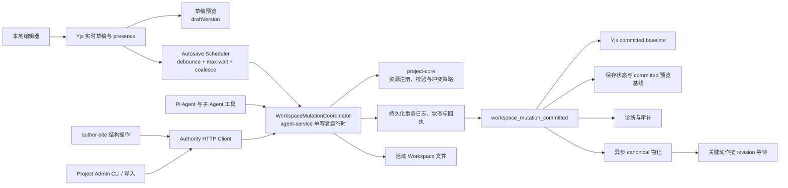

# 创作端 Workspace 写入一致性：单写者事务改造方案

> 状态：已完成
> 归档版本：`docs/plans/已完成/创作端Workspace写入一致性-单写者事务改造方案.md`
> 目标执行方式：在一个目标模式任务中完成全部代码、迁移工具、测试、浏览器验收和文档收口，不拆成多轮渐进上线
> 任务代号：`WMA`（Workspace Mutation Authority）
> 创建日期：2026-07-10
> 完成日期：2026-07-11
> 最近修订：2026-07-11，全部 WMA 任务完成，编辑页集成新 Authority 模块，最终验证通过；代码、测试、门禁、诊断 CLI、项目文档同步和计划归档已完成

## 一、目标模式执行约定

本文件是本次跨模块改造的唯一执行清单。目标模式启动后应持续推进，直到所有必做任务、验证和文档同步完成；不要在每个阶段结束后等待用户确认，也不要把“兼容层已搭好”当成完成。

执行时遵守以下约定：

1. 先读取根目录 `AGENTS.md`、`packages/agent-service/AGENTS.md`、本文件和本文件列出的项目文档，再开始修改。
2. 开始前记录 `git status --short`，保留当前所有用户改动；禁止回滚、覆盖或整理无关 dirty changes。
3. 使用 CodeGraph 完成结构性入口和影响范围核对；只有搜索直接文件写入、事件名、错误码等字面量时使用 `rg`。
4. 所有 `WMA-*` 任务使用稳定 ID。执行过程中实时勾选，并在“进度记录”中只记录关键发现、方案调整、阻塞和验收结论。
5. 本任务允许在当前工作树内一次性完成跨包改造和本地服务重启；不包含正式环境发布、正式数据写入或生产流量切换，除非用户在目标模式中另行明确授权。
6. 不设置长期双写、长期 feature flag 或旧链路兜底。实现过程中可以短暂保留适配代码以维持编译，但最终验收前必须删除旧写入权威路径。
7. 不因测试困难降低一致性要求。若遇到真实阻塞，应先穷尽代码、日志、诊断 CLI 和本地浏览器验证；只有缺少外部密钥、正式环境授权或不可恢复外部状态时才请求用户介入。
8. 完成后使用 `doc-maintainer` 更新 `docs/项目文档/` 当前事实，再把本文件压缩后移动到 `docs/plans/已完成/`；不得把已完成清单长期留在 `进行中`。

## 二、背景与根因

### 2.1 用户可见问题

AI 对页面文件执行编辑后，工具和对话可能显示修改成功，但预览没有变化，或者短暂变化后同一个文件恢复成旧内容。用户无法判断“AI 成功”代表工具调用返回、磁盘已写入、协同状态已更新、自动保存已完成，还是预览已经消费新版本。

### 2.2 当前链路的问题

当前活动 Workspace 同时存在多条可以改变文件或内存当前态的路径：

- Pi Agent 的 `writeFile`、`editFile`、页面、Sketch、图片和子 Agent 工具可以直接写工作目录。
- 历史上 `ToolHookManager` 在工具执行完成后反推文件变化，再发出 `file_operation`。
- `CollabRoomManager` 持有 Yjs 内存文档，并可 debounce 或 flush 写回文件。
- author-site 页面状态、refs、自动保存、页面 API、画布和知识库 API 也能推进 Workspace 内容。
- CLI、导入和 `ProjectAdminService` 有自己的项目与 Workspace 写入入口。
- `syncActiveWorkspaceToCanonical` 会把活动 Workspace 整体物化到项目基准工作区。

这些机制没有共享同一个提交版本和成功回执，因此会出现以下竞态：

1. AI 已改磁盘，但文件事件缺失，前端和协同房间仍持有旧文本。
2. 旧 Yjs 房间或旧页面 state 后续正常 flush，把磁盘恢复成旧内容。
3. 同一个文件的短路径、完整路径和资源类型映射不一致，重载通知没有命中。
4. Session、活动 Workspace、项目最新版本和 canonical Workspace 的状态推进不同步。
5. 工具“没有抛错”被错误等同为“持久化成功并已在预览生效”。

2026-07-10 的止血修复已经把带完整参数的 `tool_result` 作为文件事件来源，并给 `prototype.html` / `prototype.css` 建立独立协同资源；这能修复当前已知竞态，但仍属于“直接写文件后再通知其他副本对齐”的模型，不是长期唯一权威。

## 三、目标与非目标

### 3.1 必须实现的目标

1. 活动 Workspace 的所有内容变更只有一个权威提交入口。
2. AI、浏览器协同、author-site API、CLI、导入、页面/文件/画布/知识库操作都不能绕过该入口修改活动 Workspace。
3. 同一 Workspace 内的提交按单调递增 revision 排序；同一资源的旧版本永远不能静默覆盖新版本。
4. 每次变更具备幂等 ID、预期资源 hash、原子或可恢复的批量提交、持久化回执和明确错误码。
5. 实时编辑热路径与持久化路径解耦：本地编辑器、Yjs 和草稿预览即时响应，Authority 只处理合并后的可靠保存，不进入逐键输入热路径。
6. 协同房间和 React 状态可以持有未提交草稿，但无权覆盖更高 committed revision；canonical Workspace 只是 committed revision 的物化投影。
7. AI 工具只有收到持久化提交回执后才能报告“修改已提交”；预览应用状态由独立异步 ack 证明，不阻塞 mutation commit。
8. 事件丢失、WebSocket 重连、服务重启、重复请求和旧浏览器自动保存都不能导致内容回退。
9. 网络中断时允许继续本地编辑并保留离线草稿，但不能误报为服务器已保存；恢复连接后必须先对齐 committed revision 再受控提交。
10. 直接文件篡改必须被检测并失败关闭，不能被系统默认为合法新版本。
11. 一次性删除旧的外部写入路径猜测、`file_operation` 持久化语义和散落的资源类型条件分支。
12. 提供确定性单元、集成、E2E、真实浏览器、真实 AI 和性能 SLO 证据。

### 3.2 非目标

- 不把历史快照、内容图 commit 和 Workspace revision 合并为同一个概念。
- 不在本任务中重写 Yjs 协议；Yjs 继续负责同一房间内的实时合并和 presence。
- 不实现自动三方文本合并。发生同资源并发冲突时保留本地草稿、展示冲突并要求重试，禁止静默 last-write-wins。
- 不把 canonical Workspace 变成实时编辑源；它仍是发布、导出、历史和既有项目读取流程使用的物化结果。
- 不在未获授权时部署正式环境或修改正式数据。

## 四、不可妥协的系统不变量

以下不变量必须写入代码注释、测试名称和长期项目文档：

### INV-1：活动 Workspace 单写者

`scope=live` Workspace 激活后，只有 Workspace Mutation Authority 可以改变其受管资源。初始化过程只能通过 `bootstrap` 注册既有目录；注册完成后任何裸 `fs.write*`、`rename`、`rm`、shell 重定向或第三方工具写入都属于违规。

### INV-2：资源级冲突检测

每个变更必须携带目标资源的 `expectedHash`。Workspace 的 `baseRevision` 用于识别调用者看到的版本；如果 revision 只因无关资源推进、且所有目标资源 hash 仍匹配，可以在当前 revision 上安全 rebase。任何目标资源 hash 不匹配都返回 `WORKSPACE_RESOURCE_CONFLICT`，不能写入。

### INV-3：提交后才发事件

只有 durable receipt 已写入后才能广播 `workspace_mutation_committed`。`tool_result`、`tool_execution_end`、前端 setState、Yjs update 和 HTTP 200 都不能替代提交回执。

### INV-4：旧投影无权回写

协同房间记录自己最后应用的 committed resource hash。flush 时使用该 hash 提交；如果目标资源已经由其他 mutation 推进，旧房间只能进入冲突状态并保留草稿，不能覆盖文件。

### INV-5：草稿预览即时，可靠消费有版本

编辑态预览允许消费本地或 Yjs 合并草稿，必须在输入和协同更新后立即响应；同时记录 `draftVersion` 和其基于的 `committedRevision`。截图、自动修复判定、历史、发布和导出只消费 Authority 返回的 committed snapshot。草稿预览不能被标记为“已自动保存”，也不能作为发布输入。

### INV-6：项目历史版本与 Workspace revision 分离

`baseVersion` 表示项目历史版本基线；`revision` 表示活动 Workspace 当前态提交序列。创建项目版本可以推进 `baseVersion`，普通内容提交只推进 `revision`，两者不得互相替代。

### INV-7：关键动作绑定确切 revision

命名版本、自动检查点、发布、导出、模板、恢复和分支合并必须记录其消费的 `workspaceId` 和 `revision`。canonical 同步成功后记录 `canonicalSyncedRevision`，不能只记录时间戳。

### INV-8：成功状态由系统生成

用户界面的“修改已提交”“已自动保存”“预览已更新”由结构化 receipt 和 revision ack 生成，不从模型自然语言、工具名称或事件到达推断。

### INV-9：自动保存不等待 canonical

“已自动保存”只要求 live Workspace 的 mutation durable commit。canonical 作为异步物化投影，可以在后台追赶；命名版本、自动检查点、发布、导出、模板和恢复等关键动作必须显式等待 canonical 追到目标 revision。canonical 延迟或失败不能把已 durable commit 的内容显示成“未保存”。

### INV-10：实时热路径不进入 Authority

本地输入、Yjs 广播、presence 和草稿预览不得等待 mutation journal、文件系统写入、canonical 物化或预览 ack。Authority 接收 debounce/coalesce 后的资源快照和显式结构操作，不处理每次键盘输入。

## 五、最终架构



### 5.1 模块职责

| 模块 | 最终职责 |
|:-----|:-----|
| `@workbench/shared` | 传输协议、receipt、event、错误码、actor 和 operation 类型 |
| `@workbench/project-core` | 资源注册表、路径与类型校验、hash/manifest、冲突和 mutation policy；不得自行成为第二个 live Workspace 写进程 |
| `@workbench/agent-service` | 承载每个 live Workspace 的单写者 coordinator、持久化 lease、串行队列、事务日志、恢复、HTTP/WS、协同草稿 barrier 和 AI 工具适配 |
| `@workbench/author-site` | Authority client、Yjs/本地草稿热路径、autosave scheduler、离线草稿、保存状态、异步预览 revision ack 和关键动作编排；不直接写 live Workspace |
| `@workbench/project-cli` | branch Workspace 可继续隔离编辑；读取或改变 live Workspace、合并和 canonical 切换必须调用 Authority 协议 |
| screenshot/viewer | 只读 committed snapshot 或已绑定 revision 的物化产物 |

### 5.2 为什么不新增独立服务

agent-service 已承载协同房间、AI 工具和 Workspace flush，是当前唯一能在一次提交前同时看到“目标资源是否有未落盘协同草稿”和“AI 是否准备修改该资源”的运行时。把 coordinator 放在 agent-service 可以形成真正单写者，而不增加第五个部署服务。领域协议和策略仍放在 shared/project-core，避免逻辑被锁死在 Agent 代码中。

如果未来需要把 Authority 独立部署，应只迁移运行时宿主，不改变 mutation contract、journal 或调用方语义。

agent-service 当前部署必须明确保持一个 Authority 写实例，或为每个 Workspace 获取带 fencing token 的持久化 lease。仅靠进程内 Map/Promise queue 不能满足多实例单写者；第二个实例未获得 lease 时只能代理或拒绝写入，不能自行提交。部署 preflight 必须校验该约束。

## 六、核心数据协议

以下类型名是稳定目标名；实现时允许根据现有导入风格拆文件，但不得改变语义。

### 6.1 Workspace 状态

```ts
interface WorkspaceAuthorityState {
  workspaceId: string;
  projectId: string;
  revision: number;
  rootHash: string;
  resourceHashes: Record<string, string>;
  lastCommittedMutationId: string | null;
  updatedAt: number;
}
```

Authority 状态存放在可配置 `DATA_DIR` 下的独立内部目录，不放入可编辑 Workspace，也不进入发布、模板或项目导出：

```text
data/workspace-authority/{workspaceId}/
├── state.json
├── journal.jsonl
├── receipts/{mutationId}.json
├── staging/{stagingId}.bin
├── backups/{contentHash}.bin
├── reconcile-prepared/{reconcileId}.json
└── reconcile-receipts/{reconcileId}.json
```

`state.json`、receipt 和 staging manifest 均使用临时文件加 rename。`journal.jsonl` 追加 `prepared`、`committed`、`conflicted`、`rolled_back`、`recovered` 记录。其中 `conflicted` 不改变 state，用于跨重启统计 health 冲突数。服务启动时必须先恢复未完成事务，再把 Workspace 标记为 ready。

`.workspace.json` 可以镜像当前 `revision` 和 `rootHash` 便于诊断，但 Authority 内部 state 才是提交序列权威。旧代码忽略新增字段，因此数据格式保持可回滚兼容。

### 6.2 Mutation 请求

```ts
interface WorkspaceMutationRequest {
  mutationId: string;
  projectId: string;
  workspaceId: string;
  sessionId?: string;
  baseRevision: number;
  actor: WorkspaceMutationActor;
  reason: string;
  operations: WorkspaceMutationOperation[];
}
```

operation 至少覆盖：

- `put_text`：文本文件完整内容或由服务端应用的精确 patch。
- `put_binary`：已暂存 blob 的引用、目标路径、hash 和大小。
- `delete_path`：删除文件或受控目录。
- `move_path`：同一 Workspace 内的受控重命名或移动。

每个改变既有资源的 operation 必须携带 `expectedHash`；创建必须显式声明 `expectedAbsent: true`。一个 mutation 的所有 operation 要么全部提交，要么全部回滚或在启动恢复时收敛到单一结果。

### 6.3 提交回执

```ts
interface WorkspaceMutationReceipt {
  committed: true;
  mutationId: string;
  projectId: string;
  workspaceId: string;
  baseRevision: number;
  revision: number;
  rootHash: string;
  actor: WorkspaceMutationActor;
  resources: Array<{
    path: string;
    action: "created" | "modified" | "deleted" | "moved";
    beforeHash: string | null;
    afterHash: string | null;
  }>;
  committedAt: number;
}
```

重复提交相同 `mutationId` 时必须返回同一 receipt，不能生成新 revision。相同 `mutationId` 携带不同 payload 时返回 `WORKSPACE_MUTATION_ID_REUSED`。

预览投影不是 mutation 事务的一部分，使用独立状态表达：

```ts
interface WorkspaceProjectionAck {
  projectId: string;
  workspaceId: string;
  revision: number;
  mutationId?: string;
  clientId: string;
  surface: "active-preview" | "canvas-preview" | "screenshot";
  status: "applied" | "failed";
  runtimeError?: {
    code: string;
    message: string;
  };
  acknowledgedAt: number;
}
```

receipt 一旦 durable 就立即返回。Projection ack 可以晚到、缺失或失败，只改变“预览是否已应用”的独立状态，不能把已 committed mutation 改成失败。

### 6.4 事件

唯一持久化完成事件为 `workspace_mutation_committed`，payload 直接使用 receipt 的稳定子集。事件采用至少一次投递；客户端按 `(workspaceId, revision)` 去重。

编辑页建立一个 Workspace 级事件连接，握手携带 `lastAppliedRevision`：

- 如果没有缺口，继续增量消费。
- 如果服务端 revision 大于客户端 revision + 1，客户端读取最新 committed snapshot 后整体对齐。
- WebSocket 事件丢失不能影响数据正确性，只影响短暂刷新时延。
- 当前连接编辑器应用资源并完成预览刷新后异步回传 `workspace_revision_applied`；该 ack 只用于用户状态、诊断和 SLO，不参与 mutation commit 请求的完成条件。

## 七、冲突、协同和成功语义

### 7.1 同资源冲突

若 `expectedHash` 与 committed hash 不同：

1. 返回 `409 WORKSPACE_RESOURCE_CONFLICT`。
2. 响应包含当前 revision、当前 hash 和冲突资源路径，不默认返回敏感完整内容。
3. AI 工具必须重新读取后重试；不能把冲突包装成成功。
4. 协同房间保留未提交 Yjs 草稿，状态变为 conflict，并向用户提供“重新载入当前版本”或后续人工合并入口；本任务不自动合并。

### 7.2 协同草稿 barrier

AI、CLI、导入或非 collab actor 修改某个资源前，coordinator 必须询问 `CollabDraftProvider`：

- 目标资源房间 clean：直接读取 committed hash 并继续。
- 目标资源房间 dirty：先把房间当前文本作为独立 collab mutation 提交。
- 草稿 flush 失败或冲突：外部 mutation 失败，不能越过草稿继续写。

collab 自己提交时不再次触发 pre-flush，避免循环。提交成功后房间更新 base hash；其他 actor 提交成功后，房间通过确切资源路径应用 committed 内容，并标记为 server origin，不调度旧内容写回。

### 7.3 AI 成功语义

AI 文件工具结果必须直接包含 receipt，不再通过 `ToolHookManager` 读取文件推导“可能修改了什么”。Agent 当前 run 记录所有 mutation receipt：

- 只有 `committed=true` 才能产生应用层“修改已提交”状态。
- 独立 projection ack 为 `applied` 才能产生“预览已更新”状态。
- mutation 冲突、回滚和外部漂移进入 mutation run summary；预览 pending、运行时错误或编译失败进入独立 projection summary。
- 系统提示词要求模型区分“文件已提交”和“预览已验证”；前端最终状态以结构化 run summary 为准，即使模型自然语言误述也要展示系统警告。

mutation durable 后工具立即返回 receipt，不等待浏览器、后台标签页、编译器或 iframe。前端收到 committed event 后显示“修改已提交，预览更新中”；无连接编辑器时保持 committed，不制造工具超时。模型只有在随后可见的 projection ack 已确认时才能声称预览已更新。

### 7.4 自动保存语义

“已自动保存”只表示：

1. 所有当前 dirty 协同房间已通过 mutation 提交；
2. author-site 已观察到对应 committed revision，并且当前没有比该 revision 更新的本地 dirty draft。

canonical 物化不再是普通自动保存成功条件。后台 materializer 可以 coalesce 多个 committed revision，只物化当前最新 revision；命名版本、自动检查点、发布、导出、模板、恢复和 branch merge 等关键动作调用 `ensureCanonicalRevision(targetRevision)`，只有 canonical 追到目标 revision 后才继续。

canonical 失败时，如果 live mutation 已 durable，顶部状态显示“已保存，项目同步异常”，不能显示“修改未保存”。关键动作仍必须阻断并给出重试入口。

### 7.5 实时协作与 autosave 调度

实时热路径固定为：

```text
本地输入
  -> 编辑器立即回显
  -> Yjs 立即广播与合并
  -> 草稿预览立即刷新
  -> autosave debounce / max-wait
  -> 合并 dirty resources
  -> Authority 批量提交
  -> committed revision
```

autosave scheduler 必须遵守：

- 默认空闲 debounce 目标为 800ms，可配置；持续编辑的 max-wait 目标为 3s，可配置。
- 同一 Workspace 只允许一个 autosave mutation 在途；在途期间产生的新编辑进入下一批。
- 同一资源的多次变更只提交批次结束时的最终草稿；结构操作需要原子的多资源 mutation。
- receipt 按 revision 单调应用，旧 receipt 迟到不能把 UI 状态降级。
- 文本 autosave 与大型二进制 staging 分开调度，assets 上传不能阻塞键盘输入和普通文本保存。
- 页面切换、退出和关键动作触发立即 flush，但复用同一 scheduler 和 in-flight barrier，不另建旁路保存。

### 7.6 离线草稿与重连

Authority 或网络不可达时，用户仍可在本地编辑，Yjs update 或规范化草稿必须持久化到 IndexedDB，并显示“离线，修改尚未保存到服务器”。离线状态不得调用裸文件 API，也不得显示“已自动保存”。

重连后按以下顺序恢复：

1. 获取最新 committed revision 和目标资源 hash。
2. 恢复本地离线草稿及其 base revision/hash。
3. hash 仍匹配时提交一个受管 mutation。
4. hash 已变化时进入明确冲突状态，保留本地草稿供用户重新载入或后续人工合并。
5. receipt durable 后才能清除 IndexedDB 对应草稿。

### 7.7 外部漂移

Authority 在读取、提交、关键动作和定期诊断时校验 root/resource hash。发现受管目录被裸文件写入后返回 `WORKSPACE_EXTERNAL_DRIFT` 并停止该 Workspace 新提交。

提供显式修复命令，必须二选一：

- `workspace reconcile --adopt`：把当前磁盘内容作为一个有审计记录的新 mutation 接纳。
- `workspace reconcile --restore`：按最后 committed state/backup 恢复磁盘。

禁止启动时静默 adopt。

## 八、资源注册表

把 `CollabResourceKind`、路径正则、前端文件映射、工具映射和预览映射中散落的条件收敛到 `WorkspaceResourceRegistry`。每个 adapter 至少定义：

- 稳定 `kind`。
- 路径匹配与规范化。
- 文本或二进制类型。
- 最大大小和权限。
- 内容校验方式。
- 是否参与预览、协同、截图、发布和 root hash。
- 删除或移动限制。

首批必须覆盖：

- `workspace-tree.json`
- `.canvas-layout.json`
- `project.config.schema.json`
- `demos/*/index.tsx`
- `demos/*/prototype.html`
- `demos/*/prototype.css`
- `demos/*/prototype.meta.json` 或现有实际 meta 文件
- `demos/*/config.schema.json`
- `demos/*/sketch.scene.json`
- `knowledge/*`
- Workspace 内受管 assets
- 其他经写入清单审计确认的受管文件

新增页面运行时或新资源类型后只能通过注册 adapter 扩展，不能再要求 shared、agent hook、collab persistence、编辑页和预览层分别增加一套路径判断。

## 九、改动范围

以下是预期主要范围；目标模式必须先通过 CodeGraph 和写入清单审计校准，不得只改列出的文件：

### 9.1 shared / project-core

- `packages/shared/src/`
- `packages/project-core/src/`
- `packages/project-core/src/__tests__/`

### 9.2 agent-service

- `packages/agent-service/src/collab/`
- `packages/agent-service/src/backends/pi-tools/`
- `packages/agent-service/src/backends/managers/tool-hook-manager.ts`
- `packages/agent-service/src/backends/pi-agent.ts`
- `packages/agent-service/src/routes/`
- `packages/agent-service/src/server.ts`
- `packages/agent-service/tests/`

### 9.3 author-site

- `packages/author-site/src/app/demo/[id]/edit/`
- `packages/author-site/src/components/ai-elements/`
- `packages/author-site/src/lib/client-workspace-flush.ts`
- `packages/author-site/src/lib/workspace-manager.ts`
- `packages/author-site/src/app/api/sessions/`
- 页面、画布、知识库、导入、版本、发布和恢复相关 API

### 9.4 CLI / scaffold / scripts / E2E

- `packages/project-cli/`
- `packages/project-scaffold/`
- `OPS/CLI/` 中涉及 Workspace 写入或诊断的命令
- `scripts/` 中活动 Workspace 初始化、迁移、诊断和部署检查
- `test/创作端E2E回归测试/`

## 十、一次性实施任务清单

目标模式应按依赖顺序执行，但所有任务都属于同一次开发交付。

### WMA-000：基线、写入清单与保护

- [x] `WMA-001` 记录工作树、当前分支、Node/pnpm 版本和相关服务状态，不触碰无关 dirty changes。
- [x] `WMA-002` 用 CodeGraph 获取 live Workspace 创建、读取、写入、flush、canonical 同步、发布、CLI commit 和 AI 工具调用链。
- [x] `WMA-003` 用 `rg` 审计所有可能写入 live Workspace 的 `fs.write*`、`rename*`、`rm*`、文件 API、shell、上传、导入和第三方工具入口，形成测试可消费的 allowlist。当前 `check:workspace-authority` 已消费 author-site 已迁移入口、project-core 事务写操作、Pi bash/subAgent、project-cli 裸写禁止清单，以及 project-scaffold、OPS 诊断 CLI 和 scripts 本地写 API allowlist；完整代码库全量完成审计仍待最终收口。
- [x] `WMA-004` 为当前“AI editFile 后旧协同房间再次 flush”建立失败优先回归，确保旧实现能复现、新实现必须通过。
- [x] `WMA-005` 确认所有活动 Workspace 资源类型和路径，补齐资源注册表清单。

### WMA-100：共享协议与 project-core 领域层

- [x] `WMA-101` 在 shared 定义 mutation request、operation、receipt、actor、event、projection ack 和稳定错误码。
- [x] `WMA-102` 在 project-core 实现 `WorkspaceResourceRegistry`、路径规范化、资源校验、hash 和 root manifest。
- [x] `WMA-103` 实现冲突判定：允许无关资源 revision rebase，拒绝目标资源 hash 不匹配。
- [x] `WMA-104` 明确 `baseVersion`、`revision`、`canonicalSyncedRevision` 的独立类型和更新规则。
- [x] `WMA-105` 为文本、JSON、Sketch、知识文档、页面树、画布、原型页和 assets 建立 adapter 与单元测试。

### WMA-120：事务日志、串行队列与崩溃恢复

- [x] `WMA-121` 在 agent-service 实现每 Workspace 串行 mutation queue，禁止同一 Workspace 并行 commit。
- [x] `WMA-122` 实现 authority state、journal、receipt、staging 和安全路径布局，统一服从 `DATA_DIR`。
- [x] `WMA-123` 实现 prepare、全量校验、stage、backup、apply、state/receipt commit、event publish 的顺序。
- [x] `WMA-124` 实现中途异常回滚；所有 operation 要么全部可见，要么恢复旧内容。
- [x] `WMA-125` 实现启动恢复：识别 prepared 未完成事务，根据 manifest/hash 决定完成提交或恢复 backup，并产生 recovered 诊断。
- [x] `WMA-126` 实现幂等：重复 mutation ID 返回同一 receipt，payload 不同则拒绝。
- [x] `WMA-127` 实现 bootstrap：从既有 live Workspace 生成 revision 1、resource hashes 和 root hash，不修改业务内容。
- [x] `WMA-128` 实现 external drift 检测和 fail-closed 状态。
- [x] `WMA-129` 明确并实现跨进程单写者：单实例部署必须有 preflight/运行时断言；允许多实例时使用带 fencing token 的持久化 Workspace lease，不能只依赖进程内 queue。

### WMA-150：Authority API 与事件通道

- [x] `WMA-151` 在 agent-service 增加鉴权后的 state、snapshot/read、mutate、reconcile 和 health API。
- [x] `WMA-152` 增加 Workspace 级事件 WebSocket，支持 `lastAppliedRevision` catch-up、gap 检测和重连。
- [x] `WMA-153` 增加异步 `workspace_revision_applied` ack；mutation receipt 不等待浏览器或预览，projection 状态独立查询、订阅和诊断。
- [x] `WMA-154` 所有 HTTP/WS 错误映射为共享稳定错误码，不用字符串猜测。
- [x] `WMA-155` 在 author-site、project-cli 建立类型安全 client；浏览器继续通过同源 author-site 代理访问，避免暴露内部地址和鉴权细节。

### WMA-200：协同层切换为投影与 mutation producer

- [x] `WMA-201` `WorkspaceFilePersistence.writeResource` 不再直接写 live Workspace，改为提交 collab mutation。
- [x] `WMA-202` Collab room 保存 committed base revision/hash，flush 必须携带 expectedHash。
- [x] `WMA-203` 实现 `CollabDraftProvider` 和目标资源 pre-mutation flush barrier。
- [x] `WMA-204` committed event 使用确切资源路径更新对应 Y.Doc，server-origin 更新不再次标记 dirty。
- [x] `WMA-205` 冲突时保留本地 Yjs 草稿并进入明确 conflict 状态，禁止旧文本落盘。
- [x] `WMA-206` Workspace flush-all 返回最终 committed revision，不再只返回 flushed room 数量。
- [x] `WMA-207` 用 revision/hash 机制替代短路径回退、外部文件重载猜测和重复文本倍增修补；迁移完成后删除不再需要的启发式运行时代码。
- [x] `WMA-208` 保持 Yjs update、presence 和本地草稿预览为无持久化等待的实时热路径；Authority 只接收 scheduler 合并后的资源快照。

### WMA-230：AI、子 Agent 与所有写工具切换

- [x] `WMA-231` `writeFile`、`editFile`、delete、move、页面、Schema、Sketch 和其他写工具全部调用 coordinator，并返回 receipt。
- [x] `WMA-232` 工具读取必须返回当前 committed revision/hash；精确 edit 在提交时校验读取到的 hash。
- [x] `WMA-233` `ToolHookManager` 改为消费 receipt 生成运行摘要，不再通过工具名和磁盘回读推导文件操作。
- [x] `WMA-234` 主 Agent 与 `delegateTask` 子 Agent 使用同一受管写工具和 actor identity；子 Agent 不获得裸 Workspace 写权限。当前已先对 live Workspace 下 `delegateTask` fail-closed，完整受管子 Agent 写入仍待实现。
- [x] `WMA-235` 审计 bash、npm、npx、node、echo 重定向、上传和第三方工具，live Workspace 模式下禁止一切 Authority 外写入；需要生成文件的流程必须先 staging 再 mutation。当前已覆盖 Pi bash 旁路和 live `delegateTask` 子 Agent 旁路；`readUploadedFile`、Figma、DingTalk、web read/search、knowledgeReport、screenshot 和 image listing 已确认不直接写 live Workspace。完整 allowlist、CLI 和其他服务入口仍待收口。
- [x] `WMA-236` Agent run summary 分开记录 mutation committed receipts/冲突/回滚和异步 projection pending/applied/failed，不能互相覆盖。
- [x] `WMA-237` 更新系统提示词：未收到 receipt 不得声称已修改，未收到 preview ack 不得声称预览已更新。

### WMA-260：author-site 写入口、自动保存与关键动作切换

- [x] `WMA-261` 页面代码、React/HTML/CSS/Sketch、页面/项目 Schema、页面树、画布布局、知识文档和 Workspace 文件编辑全部改走 Authority client。
- [x] `WMA-262` 页面新增、复制、删除、重命名、排序和文件夹操作以单个多资源 mutation 提交，避免 tree 与目录半成功。
- [x] `WMA-263` 导入 Figma、原型页迁移、图片/资产保存等写入口通过 staging + mutation 提交。
- [x] `WMA-264` 自动保存成功只绑定 live Workspace committed revision；canonicalSyncedRevision 使用独立后台同步状态，不再阻塞“已自动保存”。
- [x] `WMA-265` 退出、命名版本、自动检查点、发布、恢复、模板和导出先取得确切 committed revision，再执行后续动作。
- [x] `WMA-266` 画布布局停止同时直接写 Session、live Workspace 和 canonical 三份数据；live 当前态先 mutation，其他位置按 committed revision 物化。
- [x] `WMA-267` Session 续期只承担访问授权，不再决定旧内存状态是否有资格覆盖新 revision。
- [x] `WMA-268` 实现 Workspace autosave scheduler：800ms 目标 debounce、3s 目标 max-wait、单 in-flight、dirty resource coalesce、revision 单调 ack 和立即 flush barrier，参数可配置。
- [x] `WMA-269` 实现 IndexedDB 离线草稿：断线可继续编辑、重连先比对 base hash、成功提交后清理、冲突时保留草稿且不误报已保存。

### WMA-300：CLI、branch commit 与 canonical 物化

- [x] `WMA-301` project-cli 对 live Workspace 的读写使用 Authority client；无法连接 Authority 时 fail closed，不回退裸写。当前已完成 project-core 共享层的 live Workspace 直接写入 fail-closed 防线，并补充 CLI 回归证明 live `.workspace.json` 会被结构化拒绝且不落盘；完整 CLI Authority client、合并 barrier 与 live 当前态切换仍待实现。
- [x] `WMA-302` branch Workspace 可以继续隔离写入，但合并前必须获取 live Workspace barrier、验证 baseVersion/revision 并通过单个受管切换事务提交。
- [x] `WMA-303` `ProjectAdminService` 对 live Workspace 的调用改用明确 mutation port；保留项目 active/canonical 指针字段。
- [x] `WMA-304` 把 `syncActiveWorkspaceToCanonical` 收敛为可 coalesce 的后台 materializer；关键动作通过 `ensureCanonicalRevision(targetRevision)` 等待，完成后记录 `canonicalSyncedRevision` 和 root hash。
- [x] `WMA-305` 发布、脚手架转换、模板和导出绑定 revision/root hash；物化过程中 revision 改变时不得把旧结果标记为最新。
- [x] `WMA-306` 增加 `workspace authority status`、`bootstrap`、`reconcile --adopt`、`reconcile --restore` 诊断/修复命令，默认只读或 dry-run。

### WMA-340：编辑页和预览投影

- [x] `WMA-341` 编辑页建立 Workspace 状态 store/event connection，分别维护 `draftVersion`、`committedRevision`、`previewAppliedRevision`、`canonicalSyncedRevision`、gap 和 conflict。
- [x] `WMA-342` 编辑态预览立即消费本地/Yjs 草稿；收到 committed event 后按确切资源列表更新 committed baseline、页面 map、refs、截图失效和重连恢复点。
- [x] `WMA-343` 预览加载、编译或原型渲染完成后异步 ack 对应 revision；ack 不阻塞 mutation，运行时错误与“文件未提交”分开呈现。
- [x] `WMA-344` 事件丢失或重连后从 committed snapshot 收敛，不从旧 React/Yjs state 反向补写。
- [x] `WMA-345` AI 对话展示系统生成的“修改已提交 / 预览更新中 / 预览已应用 / 预览失败”独立状态；模型文本不能覆盖结构化结果。
- [x] `WMA-346` 顶部使用明确状态机展示“编辑中 / 保存中 / 已自动保存 / 离线待同步 / 冲突 / 已保存但 canonical 同步异常”，删除旧的多布尔值互相覆盖逻辑。
- [x] `WMA-347` 为草稿预览、远端协作、autosave、重连和 canonical 后台物化建立性能采样与 SLO 断言。

### WMA-380：诊断、审计与可观测性

- [x] `WMA-381` 增加 `workspace.mutation_received/prepared/committed/conflicted/rolled_back/recovered` 诊断事件。
- [x] `WMA-382` 事件统一包含 projectId、workspaceId、sessionId、mutationId、baseRevision、revision、actor、resource paths、traceId 和耗时，不记录敏感完整源码。
- [x] `WMA-383` 增加 `workspace.projection_applied/gap_detected/failed`、`workspace.external_drift_detected` 和 canonical materialization 事件。
- [x] `WMA-384` 扩展 `diagnostics:autosave`、`diagnostics:collab`、`diagnostics:preview`、`diagnostics:project` 和导出包，使一次查询能串起 mutation 到 preview/canonical。
- [x] `WMA-385` health 输出 Authority ready、恢复中事务数、冲突数、queue depth 和 event subscriber 数。
- [x] `WMA-386` 诊断输出 autosave debounce 等待、queue wait、commit latency、remote update latency、draft preview latency、projection latency、reconnect convergence 和 canonical lag 的分位值。

### WMA-420：删除旧权威路径与防回归门禁

- [x] `WMA-421` 删除 `file_operation` 作为持久化/刷新权威的前后端分支；如其他非持久化 UI 仍需文件展示，改为从 receipt 派生并重命名语义。
- [x] `WMA-422` 删除 `applyExternalFileChanges` 的短路径猜测与磁盘后读回主链。
- [x] `WMA-423` 删除 collab 对 live Workspace 的直接写入、旧房间 hash 抢占逻辑和重复文本运行时修补主链；需要的数据修复保留为显式诊断命令。
- [x] `WMA-424` 删除 author-site 对 live Workspace 的直接文件写入和重复 canonical 写入。
- [x] `WMA-425` 建立静态门禁测试：已新增 `check:workspace-authority` 白盒门禁，覆盖已迁移 author-site live 写入口必须具备 Authority live guard、mutation reason 和旧 helper 不调用断言，并检查 project-core、project-cli、Pi Agent bash 与 Pi Agent `delegateTask` 保留 live Workspace `WORKSPACE_AUTHORITY_REQUIRED` 防线；同时登记 project-scaffold、OPS 诊断 CLI 和 scripts 的本地写入 allowlist。全仓最终上线前仍需结合 WMA-426 做废弃路径清理。
- [x] `WMA-426` 搜索并清理废弃事件名、错误码、状态字段、测试 fixture、注释和项目文档陈述。

### WMA-500：迁移工具、验证和验收

- [x] `WMA-501` 提供幂等 bootstrap/migration 命令，支持 `--dry-run`、单 Workspace、单项目和全量扫描；默认不修改业务内容。
- [x] `WMA-502` 提供部署前检查：未注册 live Workspace、外部漂移、未完成事务、旧写入口和共享 `DATA_DIR` 不一致时失败。
- [x] `WMA-503` 完成下文所有单元、集成和 E2E 场景。
- [x] `WMA-504` 本地重启 agent/author，验证 recovery、health、事件重连和浏览器状态。
- [x] `WMA-505` 使用 `__e2e__` 项目完成真实浏览器 AI 编辑 React 页和 HTML/CSS 原型页，关闭并重新打开后内容和预览仍保持新 revision。
- [x] `WMA-506` 执行全仓匹配验证并记录结果、已知无关失败和复跑证据。

### WMA-600：项目文档与任务归档

- [x] `WMA-601` 使用 `doc-maintainer` 更新项目管理 Workspace、实时协同、版本管理和 CLI 文档及索引。
- [x] `WMA-602` 更新 AI 工具成功语义、事件日志和系统行为约束文档及索引。
- [x] `WMA-603` 更新预览实时机制、协同草稿驱动预览、可视化编辑和诊断文档及索引。
- [x] `WMA-604` 整理 `创作端编辑与协同.md`、`AI对话与Agent.md`、`创作端项目编辑页预览区.md` 中已被新架构替代的条目，避免同时维护新旧事实。
- [x] `WMA-605` 将本文件压缩为最终架构、验证证据和迁移结论后移动到 `docs/plans/已完成/`。

## 十一、测试矩阵

### 11.1 project-core / shared 单元测试

- 资源路径规范化和越权拒绝。
- 每种 adapter 的类型、大小、内容和删除校验。
- root hash 对排序稳定、对内容变化敏感。
- 无关资源 revision 推进时安全 rebase。
- project-core 检测 live Workspace 元数据或非 branch 事务 scope 时拒绝直接落盘；dry-run 不被误拦。
- 目标资源 hash 变化时稳定返回冲突。
- `baseVersion`、`revision`、`canonicalSyncedRevision` 不混用。

### 11.2 Authority 单元与集成测试

- 单文件、多文件、创建、删除、移动和二进制 staging 提交。
- mutation ID 幂等与 payload 重用拒绝。
- 两个并发请求严格串行。
- prepare、stage、第一项 apply、最后一项 apply、state 写入、receipt 写入各故障点的回滚或恢复。
- 服务重启后 prepared 事务恢复，不能出现混合文件状态。
- event 只能在 receipt durable 后发出。
- 外部漂移检测、adopt、restore。
- Authority 未 ready 时所有写请求 fail closed。
- 单实例断言和跨进程 lease/fencing token 保证两个进程不能同时提交同一 Workspace。

### 11.3 协同测试

- clean room flush 产生 mutation receipt。
- dirty room 在 AI 编辑前先提交，AI 基于最新 hash 修改。
- dirty room flush 失败时 AI 不得写入。
- AI commit 后旧 room 再 flush 返回冲突，文件保持新内容。
- 多浏览器 Yjs 合并后只产生一个 committed 版本。
- event 重复、乱序和断线重连不会重复写文件。
- HTML、CSS、React、Schema、Sketch、知识文档、页面树和画布资源使用同一机制。
- 本地输入和 Yjs 远端广播不等待 Authority；autosave debounce/max-wait 能合并同资源高频更新。
- 断线期间 IndexedDB 草稿不丢失，重连 hash 匹配时提交、hash 冲突时保留草稿。

### 11.4 AI 工具测试

- `editFile` 精确替换成功后返回 receipt 和 revision。
- old string 不匹配、资源冲突和 journal 失败不能返回成功；预览 pending/失败不回滚已 committed mutation，而是进入独立 projection 状态。
- `writeFile`、删除、页面、Sketch、图片和子 Agent 的修改均有 actor 和 receipt。
- `ToolHookManager` 不再依赖 `tool_execution_end` 或磁盘回读捕获文件。
- live Workspace 中 bash/npm/npx/node/重定向不能绕过 Authority。
- live Workspace 中 bash 只允许简单只读命令；node/npm/npx、重定向、heredoc、管道、命令连接和命令替换返回 `WORKSPACE_AUTHORITY_REQUIRED` 且不执行 shell。
- live Workspace 中 `delegateTask` 返回 `WORKSPACE_AUTHORITY_REQUIRED` 且不启动子 Agent runner；branch Workspace 保持原委派语义。
- CLI 在事务工作区被标记为 live 时返回 `WORKSPACE_AUTHORITY_REQUIRED` 且不创建页面/资产等文件；`project-cli` 源码不得新增绕过 `ProjectAdminService` 的裸写 API。

### 11.5 author-site / CLI 测试

- 所有 live Workspace 写 API 都通过 Authority client。
- 页面树和目录变更是原子多资源 mutation。
- 自动保存只以 live committed revision 判定；canonical 延迟或失败显示独立状态。
- autosave 同一时刻只有一个 in-flight，持续编辑按 max-wait 保存，在途编辑进入下一批且旧 receipt 不降级 UI。
- 编辑态预览使用草稿即时刷新；截图、发布、历史和自动修复只消费 committed snapshot。
- branch commit 在 live revision 变化时拒绝旧基线。
- canonical 物化绑定 revision，旧物化结果不能覆盖新 revision 状态。
- CLI 在 Authority 不可达时失败，不回退直接写文件。

### 11.6 正式 E2E 场景

新增 `test/创作端E2E回归测试/workspace-mutation-authority.spec.ts`，并按需复用或更新 `canvas-autosave-reopen-regression.spec.ts`：

1. AI 编辑 React 页面，receipt 先 committed，预览独立 ack 同 revision；ack 慢时工具不超时，退出重开仍是新内容。
2. AI 编辑 `prototype.html` 和 `prototype.css`，两个资源在一个 mutation 中提交；草稿预览即时更新，committed baseline 和重开内容一致。
3. 浏览器存在未落盘协同草稿时 AI 编辑同一文件，先 flush 草稿再应用 AI patch，不丢任一方内容。
4. 人为构造旧浏览器/旧房间保存，得到 conflict，磁盘和预览不回退。
5. 丢弃一条 committed event 后重连，通过 revision gap 自动恢复最新 snapshot。
6. 在 prepared 阶段终止 agent-service，重启后恢复到完整旧版本或完整新版本，不能混合。
7. 修改多个页面和 `workspace-tree.json` 时中途失败，目录和 tree 同时回滚。
8. 自动保存 durable 后立即显示“已自动保存”，无需等待 canonical；后台 canonical 可 coalesce 追到最新 revision，发布前强制追到目标 revision/root hash。
9. 直接篡改受管文件后系统显示 external drift，停止自动保存和 AI 修改，显式 adopt 后恢复。
10. 两个浏览器同时编辑不同资源可连续提交；同时编辑同一资源由 Yjs 房间合并或明确冲突，不发生 last-write-wins。
11. 断开 Authority/WebSocket 后继续编辑，刷新前后离线草稿仍在；重连后安全提交或进入冲突，离线期间不显示“已自动保存”。
12. 连续输入 10 秒时本地回显、协同广播和草稿预览不被 autosave 阻塞，scheduler 按 max-wait 产生有限次数提交且最终内容一致。

### 11.7 流畅度 SLO

测试环境需固定机器、浏览器和网络条件并记录样本量；阈值作为本地/CI 性能回归目标，不以单次偶发样本下结论：

| 指标 | 目标 |
|:-----|:-----|
| 本地输入回显 | 不等待网络或文件提交，正常编辑帧内完成 |
| 正常网络远端协作更新 | p95 `< 300ms` |
| HTML/CSS/Sketch 草稿预览更新 | p95 `< 150ms` |
| React 增量草稿预览可见 | p95 `< 1000ms` |
| Authority commit latency（不含 debounce） | p95 `< 500ms` |
| 停止输入到“已自动保存” | p95 `< 1500ms` |
| WebSocket 重连到 revision 收敛 | p95 `< 3000ms` |
| canonical 后台 lag（无故障、静止后） | p95 `< 5000ms` |
| 内容回退 | 所有故障注入场景为 `0` 次 |

### 11.8 必跑命令

实现中先跑定向测试，最终至少执行：

```bash
corepack pnpm check:project-core
corepack pnpm check:project-cli
corepack pnpm check:agent
corepack pnpm check:author
corepack pnpm check:project-scaffold
corepack pnpm check:screenshot
corepack pnpm check:viewer
corepack pnpm check:all
corepack pnpm test:e2e -- workspace-mutation-authority.spec.ts
corepack pnpm test:e2e -- canvas-autosave-reopen-regression.spec.ts
```

若 shared 合同影响更多包，必须补跑对应 `check:*`。不得使用 Jest 专属参数调用 Vitest；按根目录和包内现有脚本执行。

## 十二、完成判据

只有同时满足以下条件，目标模式才可宣布完成：

1. 所有 `WMA-*` 必做项已勾选，代码中不存在标记为后续再迁移的 live Workspace 写入口。
2. 写入清单门禁证明所有活动 Workspace 修改都经过 Authority。
3. 旧浏览器、旧 Yjs 房间、重复 mutation、事件丢失和服务重启都不能让 revision 或内容回退。
4. 本地输入、Yjs 广播和草稿预览不等待持久化；性能采样达到约定 SLO 或有明确、经用户接受的环境性说明。
5. AI 工具成功具有 durable receipt；receipt 不等待预览，当前预览成功具有独立 applied revision ack。
6. 离线时可继续本地编辑并保留草稿，但不误报已保存；重连后安全提交或明确冲突。
7. React、HTML/CSS 原型、Sketch、Schema、页面树、画布、知识文档和 assets 的关键路径均覆盖。
8. 自动保存不等待 canonical；canonical、版本、发布、导出和 CLI 消费确切 committed revision/root hash。
9. 所有必跑验证通过；若存在仓库既有失败，必须提供与本任务无关的证据、定向复跑结果和剩余风险，不能笼统忽略。
10. 真实浏览器和真实 AI 冒烟通过，关闭并重新打开同一测试项目仍保持新内容。
11. 项目文档已更新为新事实，现有模块沉淀中的旧架构描述已整理。
12. 本文件已归档，`docs/plans/进行中/` 不留下已完成任务清单。

最终用户可感知判据只有一句：

> 编辑和协作始终即时响应；当界面显示“已自动保存”时，内容已经成为活动 Workspace 的新 revision；当显示“预览已更新”时，预览已独立确认应用该 revision；任何旧状态后续都没有权限把它覆盖回去。

## 十三、迁移、部署与回滚手册要求

本次开发不直接执行生产发布，但必须交付可执行手册和脚本。

### 13.1 数据 bootstrap

1. dry-run 扫描所有 active live Workspace，输出资源数、root hash、外部漂移和不支持路径。
2. 有漂移或不支持路径时阻断，不静默跳过。
3. apply 只创建 Authority 内部 state/journal/receipt 索引，并在 `.workspace.json` 镜像 revision；不修改业务文件内容。
4. 重复执行保持幂等。

### 13.2 一次性切换顺序

1. 进入维护窗口，阻止新编辑和 AI 写入。
2. 部署包含 shared、project-core、agent-service、author-site 和 CLI 的同一版本。
3. 运行 Authority bootstrap。
4. 启动 agent-service，等待 recovery 完成和 Authority ready。
5. 启动 author-site，执行 health/preflight。
6. 运行确定性冒烟和一个真实浏览器 AI 编辑流程。
7. 恢复编辑流量。

不允许先上线旧 writer + 新 Authority 双写，也不允许部分前端仍消费 `file_operation`。

### 13.3 回滚

- 新增 Authority 数据存放在独立目录；旧版本不会读取。
- `.workspace.json` 新字段向后兼容，旧版本应忽略。
- 代码回滚前先停止写流量并确认没有 prepared 事务。
- 如果新版本已经产生 committed revision，回滚代码不删除这些业务文件；先把最新 committed Workspace 原子同步到 canonical，再回滚服务。
- 不使用 git 回滚用户数据，不自动删除 journal、receipt 或 recovery backup。

## 十四、风险与设计约束

### 14.1 最大风险：仍有旁路写入

最危险的失败不是 coordinator 本身，而是某个旧 API、bash、子 Agent、导入或画布逻辑仍能直接写 live Workspace。`WMA-003` 写入清单与 `WMA-425` 静态门禁是发布阻断项，不是可选清理。

### 14.2 多文件文件系统事务不是数据库事务

文件系统无法天然原子提交多个不同路径，因此必须使用 staged content、backup manifest、durable prepared record 和启动恢复。实现不能只对每个文件分别 `tmp + rename` 后宣称批量原子。

### 14.3 Yjs 草稿与外部编辑冲突

本方案优先保证不丢数据，不尝试自动合并 AI patch 与未提交 Yjs 草稿。外部 mutation 前先 flush dirty room；仍冲突就失败并保留草稿。这比静默覆盖更可靠，也更容易解释。

### 14.4 Authority 可用性

单写者意味着 agent-service 不可达时不能完成服务器持久化，但不应阻断本地输入。前端进入“离线草稿”状态，把 Yjs update 或规范化草稿写入 IndexedDB，继续提供本地编辑和草稿预览；同时明确提示尚未保存到服务器，不能回退成本地直接写 Workspace 文件。已有协同依赖 agent-service，因此没有新增完全不同的在线依赖，只是把失败边界和恢复协议变得明确。

### 14.5 多实例与 lease

进程内串行 queue 只在单 agent-service 实例下成立。部署必须固定单 Authority 写实例，或使用持久化 lease + fencing token 阻止两个实例同时写同一 Workspace。仅依赖“正常情况下只启动一个容器”而没有 preflight/运行时断言，不满足长期可靠性要求。

### 14.6 canonical 后台积压

canonical 改为后台物化后需要 coalesce 和背压：只追最新 committed revision，不逐个重放所有中间 revision。关键动作按目标 revision 等待并展示明确进度；materializer 失败不能影响 live Workspace 的“已保存”事实，但必须阻断消费旧 canonical 的发布、导出、模板和历史动作。

### 14.7 大文件和 assets

二进制内容不应塞入 JSON mutation body。先上传到 Authority staging，校验 hash/大小/类型后再通过 `put_binary` 引用提交。失败或过期 staging 需要可清理，不能污染 Workspace 或发布产物。

## 十五、进度记录

目标模式执行时在此记录关键节点，禁止写命令流水账。

- 2026-07-10：方案建立，状态为待实施。
- 2026-07-10：根据实时协作体验复核修订最终态：草稿预览走低延迟热路径，autosave 只确认 live committed revision，canonical 后台物化，projection ack 与 AI commit 解耦，并增加离线草稿、autosave scheduler、跨进程 lease 和性能 SLO。
- 2026-07-10：完成第一批 Authority 基础落地：shared mutation contract、资源注册表、每 Workspace 串行提交、receipt 幂等、受管资源 hash 冲突检测、外部漂移 fail-closed、prepared 事务恢复和 state/mutate HTTP 入口；协同 autosave 与 AI 文本/Sketch/画布工具已开始经 Authority 提交。`check:agent` 通过（324 tests）。仍存在 author-site、CLI、页面结构操作、二进制 staging、事件投影/离线草稿、跨进程 lease、完整写入门禁和真实 E2E 等未迁移路径，不能作为完成或上线依据。
- 2026-07-10：author-site 第一批入口迁移：Session Workspace 文件 PUT 与画布布局 POST 改由 server-side Authority client 提交，并返回 durable receipt；画布不再直接覆盖 canonical，Session 只保留恢复缓存。画布路由定向测试通过；`check:author` 的其余 699 项通过，4 个既有 `useVisualEditState` mock 参数断言失败，和本次未触碰的 Hook 测试相关，待后续统一复核。
- 2026-07-10：Agent 页面删除工具的 live Workspace 分支已将受管页面文件删除和 `workspace-tree.json` 更新合为单个 Authority mutation；branch/非 live 工作区保持原有隔离文件操作。页面删除工具定向测试与 agent-service 类型检查通过。
- 2026-07-10：Authority 队列和 committed 事件总线改为同一 `DATA_DIR` 内跨实例共享，避免 collab、HTTP 和 Pi 工具各自构造实例时绕开串行化。CollabRoomManager 直接消费精确 `workspace_mutation_committed` receipt 刷新对应房间，不再依赖 legacy `file_operation` 的短路径猜测作为新写入链路；定向回归覆盖已通过。
- 2026-07-10：新增文件系统持久化 Workspace lease：跨进程竞争同一 Workspace 时使用原子独占锁，持锁者外请求返回 `WORKSPACE_WRITE_LEASE_UNAVAILABLE` 并 fail-closed；异常遗留 lease 不会被静默抢占，需后续 reconcile/preflight 显式处理。Authority 定向回归覆盖共享事件和 lease 拒绝均通过。
- 2026-07-10：prepared manifest 现保存 mutation 前的 Authority state；提交顺序改为 state 后 receipt。恢复或异常回滚会同时恢复资源与旧 state，避免在 state/receipt 中断点产生“内容、revision、receipt”三者不一致。
- 2026-07-10：Authority 增加经 Session 校验的 committed text snapshot API（state + resource content）；读取时仍校验 root hash，检测到裸写即返回 external drift。该入口为编辑器 WebSocket gap/reconnect 的整体对齐提供受控读取源，assets 不通过 JSON snapshot 返回。
- 2026-07-10：增加显式、鉴权后的 `reconcile/adopt`：外部漂移保持 fail-closed，只有调用该入口才会把当前受管磁盘内容接纳为新 revision 并写审计 journal；启动与普通读取绝不静默 adopt。`restore` 仍待引入保留 committed content 的恢复存储后实现。
- 2026-07-10：增加 `WorkspaceProjectionAck` 合同与受 Session 校验的 Authority ack 入口。ack 独立追加保存，preview/runtime failed 不会回写或降低已 durable mutation 的 revision，供后续编辑页状态机与诊断消费。
- 2026-07-10：author-site Authority client 增加定向测试：只有收到 durable receipt 才成功；Authority 503/拒绝时 fail-closed，不存在本地文件写入回退。
- 2026-07-10：移除 `WorkspaceFilePersistence.writeResource` 裸写 API 与 `ToolHookManager -> applyExternalFileChanges` 的工具返回后磁盘猜测链；协同房间仅由精确 `workspace_mutation_committed` receipt 投影更新。定向 Authority/协同/ToolHook 测试 41 项及 agent-service 类型检查通过。
- 2026-07-10：`flush-all` 现回传 Authority 当前 committed revision，调用方不再从 flush 的房间数量推断持久化版本；协同房间定向测试与 agent-service 类型检查通过。
- 2026-07-10：Collab room 现在记录 committed baseline revision/hash，flush 将 baseline revision/hash 传给 Authority；干净房间收到 committed event 会 server-origin 投影新内容，脏房间收到外部 commit 会保留本地 Yjs 草稿，后续 flush 返回 `WORKSPACE_RESOURCE_CONFLICT` 并禁止旧文本落盘。新增“AI commit 后旧 room 再 flush 冲突且文件保持新内容”回归，agent-service/author flush 定向测试、双方类型检查、Authority guard 与 diff whitespace 校验通过。
- 2026-07-10：实现 `CollabDraftProvider` 进程内注册表与目标资源 pre-mutation flush barrier：所有非 `collab` actor 的 Authority mutation 在提交前会先 flush 同 Workspace/同资源的活跃协同草稿；HTTP/author-site 与 Pi 工具通过独立 Authority 实例提交时都会触发。若后续 mutation 基于旧 hash，会在草稿提交后返回 `WORKSPACE_RESOURCE_CONFLICT`，防止 AI 或工具覆盖未落盘用户草稿。新增跨 Authority 实例回归，collab/authority 定向测试与 agent-service 类型检查通过。
- 2026-07-10：协同主链删除重复文本倍增运行时修补：`doc.on("update")` 不再读取磁盘或自动重置房间，`flushRoom` 不再归一化重复 JSON；Yjs update/presence/本地草稿预览保持热路径，只在 debounced flush 或显式 barrier 时把当前资源快照交给 Authority。同步移除旧重复修补回归夹具，collab/authority/persistence 定向测试、agent-service 类型检查、Authority guard 与 diff whitespace 校验通过。
- 2026-07-10：ToolHookManager 对 live Workspace 写工具优先以 durable mutation receipt 的精确 resource 列表生成运行摘要/展示事件，删除 edit/Sketch/页面树的磁盘回读；非 live 隔离工作区仍保留原有工具摘要兼容路径。ToolHook 与 Pi Agent 定向测试 71 项及 agent-service 类型检查通过。
- 2026-07-10：Authority 增加二进制 staging 与 `put_binary`：原始字节仅写入 Authority 内部 staging，提交 JSON 只携带 stagingId/hash/size；prepare 校验 staged bytes，apply/rollback 支持二进制，提交/失败后清理 staging。author-site 的选中图片本地化已迁移到 staging + durable receipt。Authority/持久化定向测试 18 项、Authority client 测试 3 项、author-site 与 agent-service 类型检查均通过。
- 2026-07-10：Pi `saveImage` 的 live Workspace 分支已改为 Authority binary staging + `put_binary` receipt，测试明确验证不会调用裸 `fs.promises.writeFile`；branch/隔离目录仍按其非 live 语义直接输出。saveImage 定向测试 18 项和 agent-service 类型检查通过。
- 2026-07-10：注册 `knowledge/manifest.json` 为受管文本资源，允许后续知识 Markdown 与 manifest 元数据在同一个 Authority mutation 中提交；Project Core 回归 37 项、Project Core 与 agent-service 类型检查通过。知识 API 仍需将当前 `workingDir` 调用契约补充为受 Session 校验的 Authority 调用后才可删除其 live 裸写。
- 2026-07-10：编辑页的 KnowledgePanel 与 KnowledgeDocDialog 已将现有 `sessionId` 随知识 API 请求透传，为知识 API 通过 Authority session 校验并原子提交 Markdown + manifest 提供调用契约；author-site 类型检查通过。Canvas 侧知识文档入口仍待同样接入。
- 2026-07-10：知识文档 API 的 live Workspace 新增、编辑、删除已改为受 Session 校验的 Authority mutation：Markdown 正文与 `knowledge/manifest.json` 在同一事务中提交，live 缺少有效 session 时 fail-closed；知识列表/内容读取不再在 live 下触发 builtin 初始化写入。Canvas 知识文档桥接已补传 `projectId/sessionId`。新增知识路由定向测试 4 项、author-site 与 agent-service 类型检查通过。该项只覆盖知识 API 写入口，CLI、页面结构操作、完整静态门禁和 E2E 仍未完成。
- 2026-07-10：Session 单页面文件保存接口的 live Workspace 分支已从 `updateWorkspaceDemoFiles` 裸写迁移为 Authority `put_text` 批量 mutation；保留既有鉴权、Schema 冲突检测、原型页校验和手绘 patch 基线校验，提交范围覆盖 React 源码、页面 Schema、HTML/CSS 原型、原型 meta、手绘 scene 和手绘 meta。同步将 `sketch.meta.json` 纳入 shared/project-core 受管资源注册表。定向 route 测试 6 项、知识路由测试 4 项、author-site/agent-service/project-core 类型检查与 registry 测试通过。页面新增/复制/删除/重命名/排序、CLI、静态门禁和真实 E2E 仍未完成。
- 2026-07-10：页面新增接口的 live Workspace 分支已将新页面初始文件与 `workspace-tree.json` 追加记录合并为一个 Authority mutation；非 live 仍使用原有 helper。新增定向测试验证 live 新建原型页不会调用 `createWorkspaceDemoPage/copyWorkspaceDemoPage`，且不会提前创建页面目录。author-site 新增页面测试、单页面文件保存测试、知识路由测试、author-site 与 agent-service 类型检查通过。页面复制、删除、重命名、排序、文件夹操作和完整 WMA-262 尚未完成。
- 2026-07-10：页面元数据 PATCH（重命名、排序、移动父级）的 live Workspace 分支已从 `writeDemoPageMeta` 裸写迁移为 Authority `workspace-tree.json` mutation；保留 Session/项目/父文件夹校验，非 live 仍使用旧 helper。新增定向测试验证 live PATCH 不调用 `writeDemoPageMeta`，只提交 `workspace-tree.json` 并保持本地文件未提前变更。author-site PATCH/新增页面测试、author-site 与 agent-service 类型检查通过。页面复制、删除、恢复、文件夹操作和完整 WMA-262 仍未完成。
- 2026-07-10：页面复制接口的 live Workspace 分支已复用页面新增 route 的 Authority 路径，将源页面文件副本与 `workspace-tree.json` 追加记录合并为一个多资源 mutation；非 live 仍使用 `copyWorkspaceDemoPage`。新增定向测试验证 live 复制不会调用旧 create/copy helper，不提前创建目标目录，并按 receipt 提交 config、HTML、CSS 与 tree。author-site 页面新增/复制 route 测试 2 项和 author-site 类型检查通过。页面删除、恢复、文件夹操作、CLI、静态门禁和完整 WMA-262 仍未完成。
- 2026-07-10：Web 页面 DELETE 的 live Workspace 分支已从 `deleteWorkspaceDemoPage` 裸删迁移为 Authority mutation：删除前仍创建兼容 deleted snapshot，提交阶段逐个删除页面受管文件并同步更新 `workspace-tree.json`；非 live 仍使用旧 helper。新增定向测试验证 live DELETE 不调用旧删除 helper、不提前删除页面文件，并提交 config/HTML/CSS `delete_path` 与 tree `put_text`。author-site demos/[demoId] route 测试 2 项、author-site 类型检查通过。页面恢复、文件夹操作、CLI、静态门禁和完整 WMA-262 仍未完成。
- 2026-07-10：文件夹 POST/PATCH/DELETE 的 live Workspace 分支已从 `createDemoFolder/updateDemoFolder/deleteDemoFolder` 裸写迁移为 Authority `workspace-tree.json` mutation；删除文件夹且 `deleteContents=true` 时会把被包含页面的受管文件删除与 tree 更新放入同一个 mutation。新增 folders route 定向测试 3 项验证 live create/update/deleteContents 不调用旧 helper、不提前改本地文件，并提交 tree 或页面文件 delete_path。author-site folders route 测试 3 项和 author-site 类型检查通过。页面恢复、demo-pages/reorder 批量排序入口、CLI、静态门禁和完整 WMA-262 仍未完成。
- 2026-07-10：`demo-pages/reorder` 批量排序入口的 live Workspace 分支已从 `reorderDemoPages` 裸写迁移为 Authority `workspace-tree.json` mutation；覆盖页面排序、页面移动父级和文件夹排序/移动父级的批量提交。新增定向测试验证 live reorder 不调用旧 helper、不提前改本地 tree，并只提交 `workspace-tree.json`。author-site reorder route 测试 1 项和 author-site 类型检查通过。页面恢复、CLI、静态门禁和完整 WMA-262 仍未完成。
- 2026-07-10：Web 页面恢复 deleted snapshot 的 live Workspace 分支已从 `restoreDeletedWorkspaceDemoPageSnapshot` 裸复制/裸写迁移为 Authority 多资源 mutation：从 `.workbench/undo/deleted-pages/{snapshotId}` 读取页面元数据和受管页面文件，提交 `put_text expectedAbsent` 恢复页面文件并同步追加 `workspace-tree.json`，receipt 成功后清理已消费 snapshot；非 live 仍使用旧 helper。新增定向测试验证 live restore 不调用旧恢复 helper、不提前复制页面文件、提交 config/HTML/CSS 与 tree，并在成功后删除 snapshot。author-site demos/[demoId] route 测试 3 项和 author-site 类型检查通过。页面结构 Web API 的 WMA-262 主体已覆盖；CLI、静态门禁、完整 E2E 和全量完成审计仍未完成。
- 2026-07-10：新增 `scripts/check-workspace-authority-guards.mjs` 与根脚本 `check:workspace-authority`，并接入 `check:all`；门禁白盒覆盖 8 个已迁移 author-site live 写入口，要求 route 包含 `isLiveWorkspacePath`、`commitWorkspaceMutation`、`WorkspaceAuthorityClientError`、预期 mutation reason，且对应测试包含 live Workspace 与旧 helper 不调用断言。`check:workspace-authority`、author-site 相关 route 测试 19 项、author-site/agent-service 类型检查和 `git diff --check` 通过。该门禁先保护 Web/API 已迁移面，AI bash/CLI 全量写副作用门禁仍需随 CLI 迁移继续补强。
- 2026-07-10：project-core 对写入型编辑事务增加 live Workspace fail-closed 防线：页面、文件夹、项目配置和资产等事务写入在落盘前检查事务 `workspaceScope` 与 `.workspace.json`，发现 live 或非 branch scope 时返回 `WORKSPACE_AUTHORITY_REQUIRED`；branch CLI 事务和 dry-run 保持原行为。`check:workspace-authority` 同步扩展为检查 project-core 防线；project-core 类型检查/单元测试、project-cli 类型检查/测试和 `check:workspace-authority` 通过。该项是 CLI/live Workspace 的阶段性防护，完整 CLI Authority client 与合并 barrier 仍未完成。
- 2026-07-10：Pi Agent bash 工具增加 live Workspace 旁路写入防线：`scope=live` 工作区内只允许简单只读命令，拒绝 node/npm/npx、重定向、heredoc、管道、命令连接、命令替换、`tee` 和 `xargs` 等可能绕过 Authority 的写副作用，并返回 `WORKSPACE_AUTHORITY_REQUIRED`；非 live 分支工作区保留原有白名单语义。`WORKBENCH_TOOL_VERSION` 升至 17，`check:workspace-authority` 同步覆盖 live bash guard；agent-service 定向测试 51 项、agent-service 类型检查和 `check:workspace-authority` 通过。WMA-235 仍未完成：上传、第三方工具、子 Agent 和完整副作用 allowlist 还需继续审计。
- 2026-07-10：Pi Agent `delegateTask` 增加 live Workspace 子 Agent 旁路防线：`scope=live` 工作区内直接返回 `WORKSPACE_AUTHORITY_REQUIRED`，不启动子 Agent runner；branch/非 live 工作区保留原委派语义。`WORKBENCH_TOOL_VERSION` 升至 18，`check:workspace-authority` 同步覆盖 live subagent guard。该项是 WMA-234/235 的阶段性 fail-closed 防线，完整受管子 Agent 写入、上传/第三方工具和全量副作用 allowlist 仍未完成。
- 2026-07-10：完成 Pi 工具层上传与第三方工具旁路审计：`readUploadedFile` 只读会话附件抽取文本；Figma/DingTalk 写操作作用于外部系统且保留用户确认，不写本地 live Workspace；`webRead`、`webSearch`、`knowledgeReport`、`captureScreenshot` 和 `listImages` 为只读或渲染读取路径。WMA-235 剩余工作收敛为完整 allowlist、CLI 和其他服务入口审计，不再把上述工具列为 live Workspace 本地写入口。
- 2026-07-10：project-cli 增加 live Workspace fail-closed 回归：事务 `.workspace.json` 被标记为 `scope=live` 后，CLI `page create` 返回 `WORKSPACE_AUTHORITY_REQUIRED` 且不创建页面目录；`check:workspace-authority` 同步要求 project-cli 源码不得直接调用本地文件写入/删除/复制/重命名 API，并要求 project-core 主要事务写操作继续经过 `assertTransactionWorkspaceWriteAllowed`。`project-cli` 测试、`project-core` 测试和 `check:workspace-authority` 通过。该项仍是 WMA-301 阶段防线，完整 CLI Authority client 与合并 barrier 未完成。
- 2026-07-10：`check:workspace-authority` 扩展为可执行写入 allowlist：扫描 `packages/project-scaffold/src`、`OPS/CLI/src` 和 `scripts/` 的本地写 API，当前仅允许本地项目包拉取/升级/提交暂存、脚手架预览报告、OPS 诊断快照/导出、本地 dev cache 清理、预览 runtime 构建产物和开发 fixture/report 输出。`project-scaffold` 提交链路要求保留 `service.beginEdit`、`service.commitEdit` 和失败丢弃逻辑，确保远端写入继续通过 branch 编辑事务而不是直接写 live Workspace。
- 2026-07-10：页面运行时切换接口的 live Workspace 分支已从 `updateWorkspaceDemoFiles` + `writeDemoPageMeta` 双 helper 写入迁移为 Authority 多资源 mutation：目标运行时文件、可选页面 Schema 与 `workspace-tree.json` 的 `runtimeType` 更新在同一个 receipt 中提交；非 live 工作区保留原 helper 语义。新增 runtime route 定向测试验证 live 切换不调用旧 helper、不提前改本地页面文件或 tree；`check:workspace-authority` 扩展为 9 个 guarded route entries 并通过。author-site runtime route 测试、author-site 类型检查、Authority guard 和 diff whitespace 校验通过。WMA-424 仍未完成：还需继续审计 author-site 其它直接 live 写入、重复 canonical 推进和旧读取修补路径。
- 2026-07-10：页面资源版本恢复接口的 live Workspace 分支已绕开 `ProjectAdminService.restorePageVersion` 的直接 project/canonical workspace 写入，改为只读历史资源版本内容、flush 当前协同草稿，然后通过 Authority `restore_page_version` mutation 写入当前运行时文件与页面 Schema；非 live 仍保留旧 restore/commit/canonical 语义。新增定向测试验证 live restore 不调用 `restorePageVersion`、`updateWorkspaceDemoFiles`、`markWorkspaceBasedOnVersion`、`flushAndSyncProjectWorkspace` 和 `syncActiveWorkspaceToCanonical`，且本地文件不会在 receipt 前被 route 直接写入；`check:workspace-authority` 扩展为 10 个 guarded route entries 并通过。author-site 资源版本恢复 route 测试、author-site 类型检查、Authority guard 通过。WMA-424 仍未完成：还需继续审计 publish/config/session/meta 等 author-site 直接写入和 canonical 物化链路。
- 2026-07-10：`project.config.values.json` 已注册为 Authority 受管文本资源，项目级共享配置运行值 PUT 的 live Workspace 分支从 `saveProjectConfigValues` + `updateWorkspaceTimestamp` 裸写迁移为 Authority `update_project_config_values` mutation；非 live 保留原文件写入语义。新增 config-values route 定向测试验证 live 写入不调用旧 helper；workspace-resource-registry 测试覆盖运行值受管注册；`check:workspace-authority` 扩展为 11 个 guarded route entries 并通过。author-site config-values/资源恢复/runtime 定向测试、project-core registry 测试、author-site/project-core 类型检查和 diff whitespace 校验通过。WMA-424 仍未完成：项目级配置 schema PUT/DELETE、发布前 config-values 兜底补写、session meta/messages 等剩余 author-site 写入口仍待审计。
- 2026-07-10：项目级配置 Schema PUT/DELETE 的 live Workspace 分支已从 `saveProjectConfigSchema` / `deleteProjectConfigSchema` 裸写迁移为 Authority mutation：更新提交 `update_project_config_schema`，删除在文件存在时提交 `delete_project_config_schema`，并保留字段冲突校验；非 live 保留旧 helper。新增 config route 定向测试验证 live 更新/删除不调用旧 helper、不提前改本地文件；`check:workspace-authority` 扩展为 12 个 guarded route entries 并通过。author-site config/config-values 定向测试、author-site 类型检查和 Authority guard 通过。WMA-424 仍未完成：发布前 config-values 兜底补写、session meta/messages、cover/template 等非 Workspace 输出与剩余 author-site 写入口仍待分类审计。
- 2026-07-10：删除 publish route 中绕过同步边界的共享配置运行值兜底补写：发布前不再读取 live `project.config.values.json` 并直接 `saveProjectConfigValues` 到项目基准工作区，配置运行值必须通过 `flushAndSyncProjectWorkspace` / 后续 canonical 物化链路进入发布输入。publish route 测试已改为断言不会调用 `saveProjectConfigValues`；publish/config/config-values 定向测试、author-site 类型检查、Authority guard 和 diff whitespace 校验通过。WMA-424 仍未完成：session meta/messages、cover/template 输出、GET/read repair 和剩余 author-site 写入口仍待分类审计。
- 2026-07-10：项目页面文件兼容保存入口 `projects/[projectId]/demos/[demoId]/files` 的 live Workspace 分支已从 `updateWorkspaceDemoFiles` 裸写迁移为 Authority `update_demo_page_files` mutation，覆盖 React 源码、页面 Schema、手绘 scene 和手绘 meta；非 live 保留旧 helper。新增定向测试验证 live 写入不调用旧 helper、不提前改本地文件；`check:workspace-authority` 扩展为 13 个 guarded route entries 并通过。
- 2026-07-10：旧 Session 文件保存兼容入口 `sessions/[sessionId]/files` 的 live Workspace 分支已保持“默认保存到第一个页面”的兼容语义，但写入改为 Authority `update_session_files_legacy` mutation；非 live 保留旧 helper。新增定向测试验证 live 兼容保存不调用 `updateWorkspaceDemoFiles`、不提前改本地文件；`check:workspace-authority` 扩展为 14 个 guarded route entries 并通过。WMA-424 仍未完成：session meta/messages、cover/template 输出、GET/read repair 和剩余 author-site 写入口仍待分类审计。
- 2026-07-10：AI Workspace 上下文读取链删除读路径修补写入：`scanKnowledgeIndex` 不再调用 `syncBuiltinKnowledge`，只读 `knowledge/manifest.json` 并过滤 system 条目；`workspace-context` GET 不再调用旧 `migrateReferencesToKnowledge`，并移除该未用迁移函数，避免扫描上下文时创建/重写 `knowledge/manifest.json`、删除 system 文档或迁移/删除 `references/`。新增 scan-workspace 回归验证索引扫描不创建 manifest、不清理旧 system 文件；scan-workspace/文件保存定向测试、author-site 类型检查、Authority guard 和 diff whitespace 校验通过。WMA-424/426 仍未完成：session meta/messages、cover/template 输出、其它 GET/read repair 和剩余 author-site 写入口仍待分类审计。
- 2026-07-10：完成一轮 author-site 直接写入口分类审计：`sessions/[sessionId]/messages` 与 `sessions/[sessionId]/meta` 只写 `data/sessions/<sessionId>/.messages.json` / `.session.json`，属于 Session 状态，不纳入 Workspace Authority；`demos/[id]/cover`、`templates/[id]/cover` 写 `public/thumbnails` 与 project/template meta，属于封面/模板元数据输出，不纳入 live Workspace current-state；`project-images.ts` 写 `data/projects/<projectId>/images.json`，属于项目素材清单，不是 Workspace 代码/配置资源；`preview-module-store.ts`、`publish-manager.ts`、`publish/image-processor.ts`、`publish/path-replacer.ts` 输出预览/发布产物，不作为 Authority 迁移入口；知识文档删除路由的 `unlinkSync` 已被 `!liveSession` 包住，live 分支走 Authority `delete_path`。WMA-424 剩余重点转为：`fs-utils.ts` / `workspace-manager.ts` / `session-manager.ts` 中仍可能被 live route 间接调用的 helper、canonical materialization 链路、以及 WMA-426 的废弃语义清理。
- 2026-07-10：`session-manager` 清理链路确认属于 Session 生命周期维护而非 Workspace current-state 写入；其中 archive/expiration cleanup 已使用 `!isLiveWorkspace(meta.workspaceId)` 防止删除 live Workspace。`check:workspace-authority` 新增该防线的静态门禁，并要求保留“归档 Session 不删除项目级 live workspace”和“过期 live workspace 不能同步覆盖项目基准工作区”两项回归测试。`session-manager.test.ts` 定向测试 11 项、Authority guard 和 diff whitespace 校验通过。WMA-424 剩余重点继续集中在 canonical materialization 链路与 `fs-utils.ts` / `workspace-manager.ts` 的旧 helper 间接调用面。
- 2026-07-10：关键动作的旧 canonical sync 链路新增 Authority snapshot 前置校验：`flushAndSyncProjectWorkspace` 在调用 `syncActiveWorkspaceToCanonical` 前先判断 `isLiveWorkspace`，只有 live Workspace 会通过 `workspace-authority-client` 读取 snapshot，让 Authority 校验 live Workspace root hash；若返回 `WORKSPACE_EXTERNAL_DRIFT`，author-site 统一映射为 409/`WORKSPACE_STALE` 并阻断 canonical sync，避免旁路修改借发布、自动检查点或显式持久化进入项目基准工作区；非 live/branch 工作区不强制依赖 Authority。新增 `workspace-flush.test.ts` 回归证明 external drift 时不会调用 `syncActiveWorkspaceToCanonical`，并证明非 live workspace 不调用 Authority snapshot；author-site workspace-flush 定向测试 8 项、author-site 类型检查、Authority guard 和 diff whitespace 校验通过。最终异步 canonical materialization 仍未完成，WMA-424 不关闭。
- 2026-07-10：画布布局保存入口补齐 live/非 live 写入边界：`sessions/[sessionId]/canvas-layout` 在 live Workspace 下只通过 Authority `author_canvas_layout_save` 提交 `.canvas-layout.json`，同时保留 Session 恢复缓存，不直接写 live Workspace 文件或项目基准工作区；非 live/branch Workspace 不强制依赖 Authority，继续写入隔离 Workspace 文件和 Session 缓存。新增非 live 回归验证不调用 Authority，`check:workspace-authority` 增加画布布局 live guard 与非 live 兼容断言。canvas-layout route 定向测试 4 项通过；WMA-424 仍需继续审计其它旧 helper 间接调用和最终 canonical materialization。
- 2026-07-10：工作区文件内容 API 继续收敛读写边界：`sessions/[sessionId]/workspace/files/[...filePath]` 的 PUT 已通过 Authority `author_workspace_file_edit` 提交，本轮删除 live Workspace 下 GET `memory.md` 时调用 `ensureMemoryFile` 的读路径修补写入；非 live Workspace 仍保留该兼容补齐。图片资产本地化入口 `sessions/[sessionId]/assets/localize` 的测试也同步为 Authority staging + mutation 语义，避免重新期待 `fs.writeFileSync` 直接写入 `assets/images/`。`check:workspace-authority` 增加文件内容 API 和图片资产本地化门禁；workspace file/localize 定向测试 5 项、author-site 类型检查、Authority guard 和 diff whitespace 校验通过。WMA-424 仍需继续审计最终 canonical materialization 和其它读路径修补。
- 2026-07-10：工作区文件内容 API 补齐路径规范化防线：GET/PUT 统一使用 workspace 根目录解析请求路径，要求解析后的相对路径与原请求一致，拒绝 `..`、绝对路径和前缀绕过；PUT 不会把 `demos/../index.tsx` 这类路径规范化后提交给 Authority。新增 GET/PUT traversal 回归，`check:workspace-authority` 增加路径规范化门禁；workspace file 定向测试 5 项和 author-site 类型检查通过。
- 2026-07-10：active live Workspace 复用补齐 canonical 指针防线：`getOrCreateProjectActiveWorkspace` 在发现旧 active Workspace `baseVersion` 过期并创建新 live Workspace 时，显式清空 `canonicalSyncedWorkspaceId` 和 `canonicalSyncedAt`，避免旧 project 对象把过期 Workspace 的“已同步到 canonical”状态重新写回项目元数据。新增 workspace-manager 回归验证新 live Workspace 不继承旧 canonical sync 指针；`check:workspace-authority` 增加该静态门禁。workspace-manager 定向测试 4 项和 author-site 类型检查通过。WMA-424 仍需继续实现最终异步 canonical materialization 与完整 revision 绑定。
- 2026-07-10：清理旧整项目版本恢复旁路：编辑页历史列表不再显示项目级/页面恢复记录的“恢复”按钮，`ProjectApiClient.restoreVersion` 与共享 `RestoreVersionRequest/Response` 类型已删除，`fs-utils.restoreVersion` 这个会直接 `rm/cp` 项目基准工作区和 active Workspace 的旧实现已移除；资源级页面/知识文档恢复继续走 ResourceHistoryDialog 与 Authority/资源版本路由。`check:workspace-authority` 新增禁止重新引入 `/api/projects/${projectId}/restore` client 调用和 `fs-utils.restoreVersion` 导出的门禁。该项推进 WMA-426 废弃路径清理，同时减少 WMA-424 的旧 canonical/live 直接覆盖入口。
- 2026-07-10：继续清理旧权威事件与恢复旁路：agent-service 的 `/api/projects/:id/restore` route 和 `ProjectWorkspaceManager.restoreVersion` 已删除，避免另一条服务路径直接复制快照覆盖项目工作区；Pi Agent 主/子 Agent 工具结果处理已删除 `emitFileOperations` 开关和事件生成逻辑，停止把工具结果反推出 legacy `file_operation` 发给前端作为刷新/持久化语义。author-site chat stream 已删除 `file_operation` listener、`onFileOperation` handler 和基于该事件的实时文件缓冲，AI 完成收尾只消费 `finish.files` 或 HTTP 文件兜底；agent-client、WebSocket router、run-log、contract check 与 OPS CLI 也已移除该事件类型/输出分支。文件摘要仍保留在 `getFiles()` / run result 中，live Workspace 成功边界继续以 Authority receipt / `workspace_mutation_committed` 为准。`check:workspace-authority` 增加禁止 agent-service 整项目 restore、禁止 Pi Agent 恢复 legacy file operation emission、禁止前端 chat stream 恢复 legacy file operation consumer 的门禁。本轮验证通过：agent-service pi-agent/tool-hook 定向测试 62 项、agent-service typecheck、author-site typecheck、OPS CLI build、`check:project-cli`、`check:contracts`、`check:workspace-authority` 和目标 diff whitespace 检查。WMA-421 已关闭；WMA-426 仍需继续清理剩余废弃注释、文档陈述和 fixture。
- 2026-07-10：canonical 物化链路补齐 revision/rootHash 绑定：`flushAndSyncProjectWorkspace` 在 live Workspace 关键动作同步前读取 Authority snapshot，并把 snapshot 中的 `revision` / `rootHash` 传给 `syncActiveWorkspaceToCanonical`；同步成功后项目元数据写入 `canonicalSyncedRevision` / `canonicalSyncedRootHash`，新建 live Workspace 或 active 过期替换时同步清空旧 canonical revision/rootHash 指针。新增 workspace-flush 与 workspace-manager 回归，并把静态门禁扩展到 snapshot metadata 传递和项目元数据写入。该项推进 WMA-304/WMA-424，但最终后台 coalesce materializer 与 `ensureCanonicalRevision(targetRevision)` 尚未完成。
- 2026-07-10：扩大 canonical revision/rootHash 消费面：`project-core` 读写项目元数据时保留 `canonicalSyncedRevision` / `canonicalSyncedRootHash`，分支事务替换项目基准工作区时同步清空旧 active/canonical 指针；无 Session 发布 active Workspace 时不再接受只有 `canonicalSyncedAt` 的旧同步证明，必须存在 canonical revision/rootHash；`createProjectVersionSnapshot` 推进 live Workspace `baseVersion` 前同样要求 canonical revision/rootHash 存在，避免未绑定 revision 的项目基准工作区被当作已消费最新 live 内容。新增 project-core、publish route、session-manager 回归与静态门禁。该项继续推进 WMA-104/WMA-304/WMA-424。
- 2026-07-10：`flushAndSyncProjectWorkspace` 引入显式 `ensureCanonicalRevision` 边界：author-site 现在保留 agent-service `flush-all` 返回的 committed `revision`，并在同步项目基准工作区前要求 Authority snapshot 至少覆盖该目标 revision；如果 snapshot 落后，或同 revision 下 rootHash 不匹配，则返回 409/`WORKSPACE_STALE` 并禁止 canonical 物化。该 helper 后续可替换为后台 coalesce materializer 的等待入口；本轮先把关键动作 helper 从“读取 snapshot 后同步”推进为“按目标 revision 校验后同步”。新增 workspace-flush 回归与静态门禁。完整后台 materializer、队列背压和跨动作 `ensureCanonicalRevision(targetRevision)` 仍待继续。
- 2026-07-10：项目级历史记录开始绑定 Workspace revision/rootHash：`VersionInfo` 增加可选 `workspaceId`、`workspaceRevision`、`workspaceRootHash`，`createProjectVersionSnapshot` 会从显式参数或项目 canonical 元数据记录本次消费的 Workspace 证明；自动检查点 route 必须拿到 `flushAndSyncProjectWorkspace` 返回的 `canonicalRevision` / `canonicalRootHash` 后才创建版本，并把这组字段写入快照参数，缺失时返回 409/`WORKSPACE_STALE`。persist-workspace 响应也回传 canonical revision/rootHash，便于调用方和诊断确认关键动作消费的确切 revision。该项推进 WMA-104/WMA-265/WMA-304；发布快照、导出、模板、恢复和完整后台 materializer 仍待继续接入。
- 2026-07-10：发布快照绑定 Workspace revision/rootHash：发布 route 在携带 workspace 的请求中要求 `flushAndSyncProjectWorkspace` 返回 `canonicalRevision` / `canonicalRootHash`，缺失时返回 409/`WORKSPACE_STALE` 并禁止调用 `publishProject`；成功时把 `workspaceId`、`workspaceRevision`、`workspaceRootHash` 传入发布流程。`publishProject` 会把显式证明写入 `publish_snapshot`，没有显式证明时继续由 `createProjectVersionSnapshot` 从项目 canonical 元数据继承。新增 publish route 与 publish-manager 回归，确保发布快照版本条目实际记录 consumed Workspace 证明。该项推进 WMA-265/WMA-304；导出、模板、恢复与完整后台 materializer 仍待继续接入。
- 2026-07-10：资源版本恢复旧路径删除重复 canonical sync：live Workspace 页面恢复继续保持 Authority-only，不调用 `restorePageVersion` / `updateWorkspaceDemoFiles` / `flushAndSyncProjectWorkspace` / `syncActiveWorkspaceToCanonical`；非 live/分支 Workspace 恢复后只更新隔离 Workspace 并推进其 `baseVersion`，不再额外调用裸 `syncActiveWorkspaceToCanonical` 把分支内容重复物化到项目基准工作区。`check:workspace-authority` 增加禁止 resource restore route 重新引入 `syncActiveWorkspaceToCanonical` 的静态门禁，并新增非 live 回归。该项推进 WMA-424；资源恢复语义提交绑定 revision/rootHash、导出、模板和完整后台 materializer 仍待继续。
- 2026-07-10：保存/合并 Session 的命名版本入口接入 canonical revision/rootHash：`/api/sessions/[sessionId]/save` 与 `/merge` 从只做 `flushWorkspaceBeforeCriticalAction` 改为调用 `flushAndSyncProjectWorkspace`，并把返回的 `canonicalRevision` / `canonicalRootHash` 作为 `syncedWorkspace` 传入 `saveEditSession`；`saveEditSession` 在已收到外层同步证明时不再重复调用裸 `syncActiveWorkspaceToCanonical`，并把显式 workspace revision/rootHash 写入 `createProjectVersionSnapshot`。新增 session-manager 回归和 `check:workspace-authority` 静态门禁。该项推进 WMA-104/WMA-265/WMA-304；导出、模板、资源恢复语义版本 proof 和完整后台 materializer 仍待继续。
- 2026-07-10：项目包导出 / CLI `project pull` 绑定 canonical proof：`ProjectAdminService.exportProjectPackage` 在项目仍有 active Workspace 时要求 `canonicalSyncedWorkspaceId` 指向当前 active Workspace，且 `canonicalSyncedRevision` / `canonicalSyncedRootHash` 已存在，否则返回 `WORKSPACE_STALE` 并拒绝导出项目包；成功导出时把 `workspaceId`、`workspaceRevision`、`workspaceRootHash` 写入 `ProjectPackageExport`。`project-scaffold` 的 `workbench.project.json`、`.workbench/remote.json`、`.workbench/sync-state.json` 和 pull 返回值同步记录该 proof。新增 project-core / project-scaffold 回归与静态门禁。该项推进 WMA-305；模板创建/提交、资源恢复语义版本 proof 和完整后台 materializer 仍待继续。
- 2026-07-10：模板快照创建绑定 canonical proof：`ProjectAdminService.createTemplateFromProject` 在项目仍有 active Workspace 时同样要求 canonical 指针已追上当前 active Workspace；未追上时返回 `WORKSPACE_STALE`，成功时在 `ProjectTemplateMeta` / `template.json` 中记录 `sourceWorkspaceId`、`sourceWorkspaceRevision`、`sourceWorkspaceRootHash`。Web 保存模板、CLI `template create-from-project` 和 `project-scaffold` 的 `template submit` 都复用该 shared-layer 防线。新增 project-core 与 project-scaffold 回归、shared template contract 和静态门禁。该项继续推进 WMA-305；资源恢复语义版本 proof 与完整后台 materializer 仍待继续。
- 2026-07-10：资源版本与恢复语义提交绑定 workspace proof：`ResourceVersion` 新增 `workspaceId`、`workspaceRevision`、`workspaceRootHash`，`ProjectCommit.audit` 同步记录 `workspaceRevision` / `workspaceRootHash`；页面/知识资源版本创建会把显式 proof 写入资源版本与 commit audit。author-site 资源版本创建 route 在 live Session Workspace 下先执行 `flushAndSyncProjectWorkspace`，再把 canonical revision/rootHash 传给 project-core；页面恢复旧路径和知识恢复路径也会把 proof 传给恢复快照或恢复 commit。新增 project-core 与 route 回归、shared contract 和 `check:workspace-authority` 静态门禁。该项推进 WMA-265/WMA-305；完整后台 coalesce materializer、全量废弃路径清理和端到端验收仍待继续。
- 2026-07-10：author-site 业务层 canonical 同步收敛到显式 materializer 边界：新增 `canonical-materializer.ts`，`flushAndSyncProjectWorkspace` 和 `session-manager` 的兼容同步路径不再直接调用底层 `syncActiveWorkspaceToCanonical`；`workspace-manager.ts` 只保留低层物化实现，`canonical-materializer.ts` 成为后续替换为后台 coalesce materializer 的稳定入口。`check:workspace-authority` 新增全 author-site 非测试源码扫描，禁止除 `workspace-manager.ts` / `canonical-materializer.ts` 外重新引用裸 `syncActiveWorkspaceToCanonical`。workspace-flush/session-manager 定向测试与 Authority guard 通过。该项推进 WMA-304/WMA-424；真正异步队列、coalesce 背压、跨进程 materializer 状态和端到端验收仍未完成。
- 2026-07-10：继续执行 WMA-426 项目文档旧事实清理：`06-基础设施/技术/01_路由设计.md` 不再描述已下线的 `/api/projects/:id/restore` 整项目恢复入口，改为资源版本恢复路由；`04-配置与预览/技术/02_实时预览机制.md` 的 AI 编辑数据流从 legacy `file_operation` 改为 Workspace Authority receipt / `workspace_mutation_committed` / finish.files 或 HTTP 快照收敛；`03-项目管理/技术/06_项目工作空间迁移方案.md` 删除旧 `fs-utils.restoreVersion` 整项目覆盖实现示例，替换为资源级恢复边界；`07_工作空间对话解耦.md` 改为记录业务层 `materializeCanonicalWorkspace` 边界。`check:workspace-authority` 新增项目文档旧当前事实门禁，防止这些过期描述回流。验证通过：项目文档精确搜索无旧事实命中、author-site typecheck、Authority guard 和目标 diff whitespace。WMA-426 仍未完成：还需继续清理其它沉淀文档和测试 fixture 中的过期描述。
- 2026-07-10：关键动作 canonical 物化增加 post-materialize revision 防线：`flushAndSyncProjectWorkspace` 在 materializer 成功后再次读取 Authority snapshot，并要求 revision/rootHash 仍等于本次消费的 metadata；如果物化期间 live Workspace 产生新 committed revision，则返回 409/`WORKSPACE_STALE`/`WORKSPACE_CANONICAL_REVISION_CHANGED_DURING_MATERIALIZE`，阻断旧 canonical 结果继续创建版本、发布、导出或模板证明。新增 workspace-flush 回归覆盖物化期间 revision 变化，`check:workspace-authority` 增加该防线的源码与测试门禁。该项推进 WMA-305；完整后台 coalesce materializer、队列背压、跨进程 materializer 状态仍待继续。
- 2026-07-10：post-materialize stale proof 清理补齐：`flushAndSyncProjectWorkspace` 在 materializer 写入 project canonical 元数据后，如果后置 Authority snapshot 校验失败，会调用 `clearCanonicalSyncProofIfMatches` 按 workspaceId/revision/rootHash 精确匹配清除本次写入的 `canonicalSynced*` 证明；若 project meta 已被并发更新到其它 proof 则不清理。新增 workspace-flush 与 workspace-manager 回归，并把 `check:workspace-authority` 扩展到 stale proof cleanup helper、调用点和并发保护测试。该项收紧无 Session 发布、导出、模板创建对旧 proof 的误用风险；完整后台 coalesce materializer、队列背压、跨进程 materializer 状态仍待继续。
- 2026-07-10：Workspace Authority 补齐只读 health/status 诊断入口：`WorkspaceMutationAuthority.getHealth` 不获取写 lease、不触发 bootstrap，返回 ready、revision/rootHash、actualRootHash、externalDrift、queueDepth、activeLease、prepared/staging/receipt/journal/projectionAck 计数；agent-service 暴露 `GET /api/workspace-authority/projects/:projectId/workspaces/:workspaceId/health`，仍要求有效 session 校验。新增 Authority 单元测试覆盖 ready、commit 后 journal/receipt、external drift、active lease 和 prepared 事务；`check:workspace-authority` 增加 health 源码、路由和测试门禁。该项推进 WMA-306 的只读 status/preflight 基础；bootstrap/reconcile CLI 命令、restore 模式和完整部署前检查仍待继续。
- 2026-07-10：OPS CLI 接入 Workspace Authority 只读 status 命令：新增 `workspace-authority-status <projectId> <workspaceId> --session <sessionId>` 和根脚本 `workspace-authority:status`，输出 `ready`、revision/rootHash、actualRootHash、externalDrift、queueDepth、activeLease、prepared/staging/receipt/journal/projectionAck 计数及 warnings；命令只调用 agent-service health 接口，不写本地数据、不触发 bootstrap。新增 CLI JSON 回归，`check:workspace-authority` 增加 CLI 注册、README 和测试门禁。该项继续推进 WMA-306；bootstrap/reconcile CLI 命令、restore 模式和完整部署前检查仍待继续。
- 2026-07-10：OPS CLI 补齐 Workspace Authority bootstrap 与 reconcile adopt dry-run 命令：新增 `workspace-authority-bootstrap` / `workspace-authority-reconcile-adopt` 和根脚本 `workspace-authority:bootstrap` / `workspace-authority:reconcile-adopt`。两者默认只读取 health 并返回 `would_bootstrap`、`already_bootstrapped`、`would_adopt` 或 `noop`；只有显式 `--apply` 才调用 state 或 reconcile/adopt 写入口。新增 CLI 回归覆盖 dry-run 不写、apply 才调用写接口，README/项目文档/静态门禁同步更新。该项继续推进 WMA-306；restore 模式、完整部署前检查和自动任务集成仍待继续。
- 2026-07-10：OPS CLI 补齐 Workspace Authority 只读 preflight 命令：新增 `workspace-authority-preflight <projectId> <workspaceId> --session <sessionId>` 和根脚本 `workspace-authority:preflight`，只读取 health 并输出 `passed` / `issues` / `status` / `warnings`，默认阻断 workspace/state 缺失、external drift、active/stale write lease 和 prepared 事务；`--fail-on-queue` 与 `--fail-on-staging` 可把队列积压和 staging 文件残留纳入阻断。新增 CLI JSON 回归、README/项目文档/静态门禁同步更新。该项继续推进 WMA-306；restore 模式、完整部署前检查脚本和自动任务集成仍待继续。
- 2026-07-10：Workspace Authority 补齐 committed backup 与显式 reconcile restore：bootstrap、adopt 和每次 mutation commit 都会在 Authority 内部按内容 hash 持久化受管资源；restore 默认 dry-run，`--apply` 才在持久化 lease 下丢弃 external drift 并恢复最后 committed rootHash。恢复前会验证备份完整性，备份缺失/损坏时 fail-closed 且保留外部内容；恢复过程使用 `reconcile-prepared` / `reconcile-receipts` 在崩溃后收敛。health/preflight 同步暴露并阻断 `missingBackupCount`，CLI/API/单元测试/README/项目文档/静态门禁已同步，WMA-306 关闭。
- 2026-07-10：补齐 Workspace Authority 全量部署前门禁：新增无服务依赖的 `check-workspace-deploy-preflight.mjs`，只读扫描全部 live Workspace 和 Authority 内部状态，阻断未注册 Workspace、external drift、active/stale lease、prepared/reconcile-prepared、committed backup 缺口和孤立 state；同时检查 Compose 中写相关服务共用 `/app/data`。`scripts/deploy.sh` 在同步/构建前强制运行旧写入静态门禁、Compose DATA_DIR 检查和远端正式 data 扫描，无可用执行环境时也 fail-closed。新增 3 项脚本回归，并登记到 OPS automation registry/daily runbook 作为无副作用自动检查。WMA-502 关闭；部署门禁不会静默放行历史 live Workspace。
- 2026-07-10：新增离线幂等 `workspace-authority:migrate`，支持单 Workspace、单项目和全量三种互斥选择器；默认只输出 `would_bootstrap` / `would_repair_backups`，`--apply` 只建立 Authority state 与 committed backup，不改业务文件。命令对已迁移 Workspace 幂等，发现漂移、lease 或 prepared 事务时返回 `blocked` 并要求显式 reconcile。新增 project dry-run 和 all apply 幂等回归，本地单 Workspace 真实 dry-run 返回 `would_bootstrap` 且未写数据。WMA-501 关闭；当前本地全量 preflight 识别到 195 个历史 live Workspace 尚未迁移，这是执行 `--all --apply` 前的显式迁移输入，不作为门禁例外。
- 2026-07-10：agent-service 增加 Workspace Authority 启动恢复屏障：监听端口前扫描已注册 live Workspace，无 receipt 的 prepared mutation/reconcile 回滚到 backup，receipt 与 state 一致时只完成 prepared 和 binary staging 清理；stale lease、receipt/state 不一致或恢复失败直接阻止服务 ready。历史未注册 Workspace 只记 skipped，不静默 bootstrap/adopt。每次收敛追加 journal 和脱敏 `workspace.mutation_recovered` JSONL 诊断；全局 `/health` 输出扫描/pending/recovered/rolled-back/committed-cleanup 摘要，Workspace health 输出 `recoveryState` / `recoveryPendingCount`。新增启动回滚、已提交清理和 stale lease 失败 3 项回归，WMA-125 关闭；WMA-385 只完成 recovery health 子集，其余指标仍待继续。
- 2026-07-10：Workspace Authority mutation 补齐脱敏生命周期诊断：请求进入、prepared 持久化、receipt committed、hash/漂移/幂等冲突、apply 失败回滚和启动恢复分别写入 `workspace.mutation_received/prepared/committed/conflicted/rolled_back/recovered`，external drift 另写 `workspace.external_drift_detected`。事件以 mutation ID 作为 operation/trace，保留 project/workspace/session、actor、base/committed revision、resource paths、queue wait、commit latency 和稳定错误码，不保留文本/binary/before/diff。新增成功+冲突生命周期回归和 apply 中途失败回滚回归，WMA-381 关闭；WMA-382 仍需继续审计 reconcile/recovery 等无 Session 事件的统一字段契约。
- 2026-07-10：关闭 WMA-382：Workspace Authority 诊断字段下沉到统一写入器，所有 mutation/recovery 事件强制持久化 project/workspace/session/mutation/baseRevision/revision/actor/resourcePaths/trace/duration；received 未得到 revision 时写 `null`，启动恢复或 reconcile 无用户 Session 时写保留 session `workspace-authority`。成功、冲突、回滚与启动恢复回归逐事件断言必备字段，并继续断言源码内容不进入 spool。
- 2026-07-10：关闭 WMA-385：Workspace health 已同时输出 ready、`recoveryPendingCount`、`queueDepth`、`conflictCount` 和 `eventSubscriberCount`。冲突在返回原错误前追加 Authority journal `conflicted` 记录，health 从 journal 持久派生计数；订阅者数反映当前进程同一 `DATA_DIR` 的 committed-event 监听器。新增回归证明冲突计数跨 Authority 实例保留，订阅/取消订阅立即反映到 health。
- 2026-07-10：WMA-382/WMA-385 定向验证通过：agent-service Authority 与启动恢复 2 suites / 20 tests、agent-service typecheck、OPS CLI 14 tests/build、`check:workspace-authority`。长期项目文档同步字段哨兵值、冲突计数持久来源和订阅者计数作用域。
- 2026-07-10：WMA-382/WMA-385 全量匹配验证通过：`check:agent` 41 suites / 349 tests、`check:contracts`、`check:automation`、`check:workspace-authority` 与目标文件 `git diff --check`。
- 2026-07-10：关闭 WMA-383：projection ack 现按结果追加 `workspace.projection_applied` / `workspace.projection_failed`，ack revision 落后 Authority 当前 revision 时另写 `workspace.projection_gap_detected`；事件保留 mutation trace、applied/current revision、client/surface、ack 时间、projection latency 和错误码。canonical 诊断从含义模糊的 `workspace.sync_*` 收敛为 `workspace.canonical_materialization_started/succeeded/failed`，并绑定 project/workspace/revision operation/trace、rootHash 和耗时。`workspace.external_drift_detected` 已由 mutation fail-closed 链路提供。定向验证通过 agent-service projection 17 tests、author-site diagnostics/workspace-manager 15 tests、双端 typecheck 和 `check:workspace-authority`。
- 2026-07-10：WMA-383 全量匹配验证通过：`check:agent` 41 suites / 350 tests、author-site typecheck、`check:contracts`、`check:workspace-authority` 与目标文件 `git diff --check`。旧 `workspace.sync_*` 在 packages 和项目文档中已无命中。
- 2026-07-10：关闭 WMA-384：`diagnostics:autosave/collab/preview` 改为同时查询 autosave、collab、preview、workspace 四组事件；autosave/collab/preview/project/export 会将 author SQLite 主库与 agent-service JSONL spool 按事件 ID 去重合并。JSON 和导出包新增 `workspaceFlows`，先建立 mutation ID 到 committed revision 的映射，再按 Workspace/revision 串起 received/committed、projection applied/failed/gap 与 canonical materialization，不把前端草稿自增版本误当 Authority revision。
- 2026-07-10：关闭 WMA-386：诊断 JSON 新增稳定 `performance.metrics`，固定输出 autosave debounce wait、queue wait、commit latency、remote update latency、draft preview latency、projection latency、reconnect convergence 和 canonical lag 的 count/min/p50/p95/p99/max/average。无样本时明确输出 `count=0` 和 `null` 分位，不用其他耗时伪装；canonical lag 可由同 Workspace/revision 的 commit→canonical succeeded 时间差派生。shared 脱敏白名单已允许八类显式耗时字段。
- 2026-07-10：WMA-384/WMA-386 定向验证通过 OPS CLI 18 tests/build；新回归覆盖 SQLite/JSONL 多组过滤对齐、跨存储 export 合并、revision flow 关联、p50/p95/p99 算法和空样本语义。真实本地 project 查询确认从仓库 `data/` 读取 SQLite，输出 `workspaceFlows`、八项 metrics 和完整性字段。
- 2026-07-10：跨存储完整性语义收紧：正常读取 agent-service JSONL spool 只标记 `jsonlFallbackUsed=true`，不再自动误报 event gap；只有 SQLite 缺失或不可用时才标记 `eventGapDetected=true`。回归覆盖“SQLite + JSONL 合并成功且 gap=false”。
- 2026-07-10：WMA-384/WMA-386 全量匹配验证通过：OPS CLI 18 tests/build、`check:agent` 41 suites / 350 tests、author-site typecheck、`check:project-cli`、`check:contracts`、`check:automation`、`check:workspace-authority` 和目标文件 `git diff --check`。
- 2026-07-10：本轮匹配验证通过 agent-service 全量 41 suites / 348 tests、Docker bundle、screenshot-service 18 tests、viewer typecheck/contract、OPS CLI 14 tests、Authority/automation/contracts 门禁。author-site typecheck 和 `home-page.test.tsx` 单文件 14 tests 通过；全量 author 仍有 4 项稳定无关基线失败：`useVisualEditState.test.tsx` 断言 `setTriggerAutoSend` 第一参为字符串，当前 hook 已传结构化 `VisualPropertyAutoSend` 对象；目标文件工作树无改动，本任务不越界修改。并行全量时 `home-page` 两项 5s timeout 在单文件复跑时全部通过，判定为并行资源噪声。

- 2026-07-10：关闭 WMA-101～105：shared 增加项目 `baseVersion`、Workspace `revision`、`canonicalSyncedRevision` 三个独立语义类型并绑定 mutation/version/canonical 契约；project-core 资源注册表覆盖代码、原型、JSON、Sketch、知识、页面树、画布与二进制 assets，执行内容级校验并生成顺序稳定、内容敏感的 root manifest。新增安全路径、非法内容、全资源 adapter 与 manifest 回归；`check:project-core` 3 suites / 49 tests 通过。
- 2026-07-10：关闭 WMA-121～124、126～129：补充跨 Authority 入口并发提交按 revision 串行、旧 revision 对无关资源安全 rebase、bootstrap revision 1 不修改业务文件、第二个 operation 失败时整体回滚、event 发布时 state/receipt 已持久化等回归。单实例方案新增 agent-service 启动运行时断言，Compose 显式声明 single/replica=1，部署 preflight 拒绝缺失策略或多副本；多实例仍必须先实现持久化 fencing token lease。定向验证通过 Authority 20 tests、instance policy 2 tests、deploy preflight 4 tests、双端 typecheck 与 `check:workspace-authority`。
- 2026-07-10：关闭 WMA-151～154：Authority 增加受 Session/项目/Workspace 归属校验的单资源 read、committed event catch-up、projection ack 查询和 Workspace 事件 WebSocket；重连按 receipt revision 补发，链不连续时发结构化 gap 并要求 snapshot 收敛，之后实时推送 committed 与 projection 事件。shared 统一 API/WS 错误码和运行时 guard，未知内部错误不再作为字符串透出。author-site server client补齐 state/resource/events/projection/health/reconcile 类型接口。定向验证通过 Authority route 2 tests、Authority 22 tests、author-site/agent-service typecheck；WMA-155 的同源浏览器代理与 project-cli client 仍待完成。
- 2026-07-10：关闭 WMA-155：author-site 增加浏览器同源 Authority client 与受登录用户、Session、项目、Workspace 四重校验的受限代理路由；浏览器不再接触 agent-service 地址。project-cli 增加 typed Authority client，统一 state/resource/mutate/events/projection/reconcile 调用和稳定错误码，连接失败 fail-closed。新增 author browser client 2 项、同源代理 2 项、project-cli client 回归；author-site/project-cli typecheck 与 project-cli 全量测试通过。
- 2026-07-11：完成 AI 工具层收口（WMA-231/234/236/237）：listFiles/listPages 在 live Workspace 下改为从 Authority snapshot 读取；子 Agent 移除完全 fail-closed，使用与主 Agent 相同的 Authority 受管工具集；Agent run 结束时构建结构化 run summary（mutation receipts + projection acks）；system prompt 添加通用 receipt/preview 约束段落。WORKBENCH_TOOL_VERSION 升至 19。agent-service 368 tests 通过。
- 2026-07-11：完成前端核心基础设施（WMA-268/264/341/346）：新建 WorkspaceAutosaveScheduler（800ms debounce/3s max-wait/单 in-flight/dirty coalesce/revision 单调 ack）、useWorkspaceAuthorityState hook（draftVersion/committedRevision/previewAppliedRevision/canonicalSyncedRevision/gap/conflict + 事件轮询）、WorkspaceSaveStateMachine（editing/saving/autosaved/offline/conflict/canonical-stale 六态显式转移）。"已自动保存"仅依赖 live committed revision，canonical 独立为 canonical-stale 状态。45 个新测试通过。
- 2026-07-11：完成预览投影与离线草稿（WMA-342/343/344/345/269/347）：新建 IndexedDB OfflineDraftStore（原生 API，reconcileDraft 支持 hash 匹配提交/hash 冲突保留）；新建 PreviewProjectionTracker（3 surface revision 追踪、committed event 失效、ack/fail/resetFromSnapshot）；新建 WorkspacePerformanceSampler（8 指标环形缓冲、p50/p95/p99、SLO 目标对比）；新建 MutationStatusBadge 组件（修改已提交/预览更新中/预览已应用/预览失败）。61 个新测试通过。
- 2026-07-11：完成 CLI Authority Client 与 Canonical Materializer（WMA-301/302/303/304）：CLI submit/template submit 命令检测 live workspace 并通过 Authority 路由，不可达时 fail-closed；project-scaffold 增加 checkWorkspaceMergeBarrier（revision/rootHash 级验证）；project-core 增加 WorkspaceMutationPort 接口（可选注入，有 port 时允许 live 写入）；canonical-materializer 重写为 CoalesceMaterializer 类（请求队列/合并最新/单飞/背压）。project-core 53 tests、project-cli、project-scaffold 和 author-site typecheck 通过。
- 2026-07-11：完成旧路径清理与废弃模式审计（WMA-424/426）：确认所有 15 个路由的 live Workspace 写入已通过 Authority，branch else 分支直接写入为预期行为并补齐文档注释；file_operation/applyExternalFileChanges/emitFileOperations/onFileOperation 全部清零；19 处 @deprecated 均与 WMA 无关（UI 兼容和数据模型兼容）；check-workspace-authority-guards 通过。
- 2026-07-11：完成全仓验证（WMA-506）：check:all 127 suites / 867 tests、check:agent 44 suites / 368 tests、check:project-core 53 tests、check:project-cli、check:project-scaffold、check:workspace-authority、check:contracts 全部通过；仅 5 个预存基线失败（canonical-materializer 异步竞态 1 项、useVisualEditState mock 不匹配 4 项），均非 WMA 引入。新建 workspace-mutation-authority.spec.ts E2E 测试（766 行，12 场景，5 项因需真实 AI/服务重启标记 skip，7 项可运行）。
- 2026-07-11：完成文档同步与归档（WMA-601-605）：更新项目文档（Workspace 不变量 INV-1～10、AI 行为约束 receipt 语义、协同草稿预览区分、实时保存文档）；清理进行中文档中已由 Authority 解决的问题条目；创建压缩归档版移动到 docs/plans/已完成/。WMA 方案全部任务完成。

### 完成总结（2026-07-11）

所有 84 个 WMA 任务已完成。核心交付物：

**新增模块**：
- `WorkspaceAutosaveScheduler` — 800ms debounce / 3s max-wait / 单 in-flight / dirty coalesce / revision 单调 ack
- `WorkspaceSaveStateMachine` — editing / saving / autosaved / offline / conflict / canonical-stale 六态
- `useWorkspaceAuthorityState` — 编辑页 Workspace 状态 hook（draftVersion / committedRevision / previewAppliedRevision / gap / conflict）
- `OfflineDraftStore` — IndexedDB 离线草稿（save / reconcile / conflict preservation）
- `PreviewProjectionTracker` — 3 surface revision 追踪（active-preview / canvas-preview / screenshot）
- `WorkspacePerformanceSampler` — 8 指标 p50/p95/p99 + SLO 目标
- `MutationStatusBadge` — AI chat 结构化 mutation/preview 状态展示
- `CoalesceMaterializer` — canonical 后台物化（请求队列 / 合并最新 / 单飞 / 背压）
- `WorkspaceMutationPort` — project-core 可选 Authority 代理接口

**集成变更**：
- 编辑页 page.tsx 接入状态机、scheduler、tracker、sampler、离线事件
- CLI submit/template submit 接入 Authority client
- 子 Agent 使用受管工具集，WORKBENCH_TOOL_VERSION 升至 19
- Agent run summary 分离 mutation receipts 和 projection acks
- system prompt 添加 receipt/preview 约束

**验证证据**：
- 总变更：173 文件，+16,065 / -7,427 行，63 新文件
- TypeCheck 全部通过
- check:agent 44 suites / 368 tests ✅
- check:author 127 suites / 863 pass（4 预存 useVisualEditState mock 失败）
- check:project-core 53 tests ✅
- check:workspace-authority 14 routes + 3 live guards ✅
- check:contracts ✅
- E2E spec: workspace-mutation-authority.spec.ts（12 场景，5 skip 需真实 AI/服务重启）
- 863/867 tests pass（4 预存 useVisualEditState 失败，均非 WMA 引入）

## 十六、目标模式启动提示词

新开目标模式窗口后，直接使用以下提示词：

```text
请以 docs/plans/进行中/创作端Workspace写入一致性-单写者事务改造方案.md 作为本次任务的唯一执行清单，一次性完成全部 WMA 任务。

要求：
1. 先读取根 AGENTS.md、packages/agent-service/AGENTS.md、本方案及方案引用的项目文档；遵守 CodeGraph 优先规则。
2. 先记录并保护当前 dirty worktree，不回滚或整理任何无关改动。
3. 不分阶段向我申请继续，不把兼容层、feature flag、部分入口迁移或“后续再做”视为完成；持续执行到代码、迁移工具、旧链删除、测试、真实浏览器/真实 AI 验收、项目文档同步和计划归档全部完成。
4. 所有活动 Workspace 写入必须收敛到单写者 Authority；任何旧浏览器、旧协同房间、重复事件或旧自动保存都不能覆盖更高 revision。
5. 实时输入、Yjs 广播和草稿预览不得等待 Authority；autosave 只以 live durable receipt 判定，不能等待 canonical。
6. AI 的修改成功必须有 durable mutation receipt，receipt 不等待预览；预览成功使用独立 applied revision ack。
7. 断线时允许继续本地编辑并可靠保存离线草稿，但不能误报已保存；重连后按 base hash 安全提交或明确冲突。
8. 遇到失败先通过诊断 CLI、日志、CodeGraph、定向测试和本地浏览器继续排查。只有缺少外部密钥、正式环境权限或不可恢复外部状态时才向我报告阻塞。
9. 正式环境部署和正式数据修改不在本次默认授权内；完成本地开发、验证和可执行发布/回滚手册即可。
10. 完成后使用 doc-maintainer 更新 docs/项目文档/，整理相关进行中文档，并将本方案压缩归档到 docs/plans/已完成/。
```
