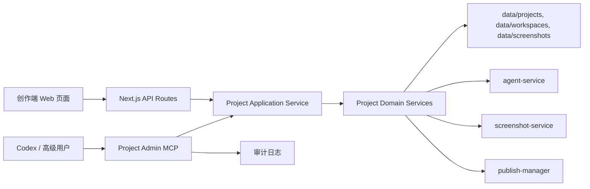

# 创作端项目管理 MCP 完整能力方案

> 状态：本地 stdio 第一版已完成并测试通过，远程化与外部服务深度接入待补齐  
> 日期：2026-06-25  
> 目标：让管理员、开发者和高级用户可以通过 Codex 完整增删改创作端项目，同时普通用户继续使用创作端 Web 页面。

---

## 一、背景

当前创作端已经支持普通用户在 Web 页面中创建项目、编辑多页面 Demo、配置 Schema、预览、AI 对话、保存模板、发布和管理项目。管理员和部分高级用户更习惯使用 Codex，希望通过自然语言和工具调用直接维护创作端项目，包括预设项目模板、批量改页面、整理文件夹、修复配置、发布和回滚。

这个需求不适合只做一个提示词技能。技能只能指导 Codex 怎么操作，不能保证数据校验、权限、事务、预览验证、审计和回滚。完整方案应以 MCP 作为能力层，技能作为使用规范层。

---

## 二、目标

### 2.1 产品目标

- 高级用户可以在 Codex 中完成创作端 Web 端能做的全部项目管理与编辑操作。
- 普通用户仍使用创作端 Web 页面，不需要理解 MCP 或 Codex。
- Web 端与 MCP 操作的是同一套项目、模板、工作空间、版本、图片和发布资产。
- 管理员可以提前预设项目模板，并通过 Codex 批量维护模板库。
- Codex 操作后，Web 端能立即继续打开、预览、保存、发布同一项目。
- 创作端首页右上角提供 MCP 入口，让高级用户可以了解能力、复制安装提示词，并把 MCP 与配套技能安装到 Codex 等工具中。

### 2.2 工程目标

- MCP 不直接绕过业务规则改文件，而是调用统一项目应用服务。
- Web API 与 MCP 工具共享核心读写逻辑，避免两套行为分叉。
- 所有写操作具备输入校验、影响预览、事务提交、失败回滚和审计记录。
- 高风险操作支持 `dryRun`、差异预览和显式确认。
- 能力覆盖不按最小 MVP 设计，而按完整创作端能力域设计，分阶段落地。

---

## 三、范围

### 3.1 覆盖范围

- 项目列表、创建、重命名、复制、删除、封面管理。
- 项目模板保存、模板元信息维护、模板复制创建、模板推荐、模板删除。
- 编辑会话、工作空间打开、文件读取、保存、丢弃、提交、版本快照。
- 多页面 Demo 的创建、复制、重命名、删除、批量删除、排序、移动。
- 页面文件的代码、Schema、元信息读写。
- 虚拟文件夹的创建、重命名、移动、删除、层级约束和页面归档。
- 项目级配置 Schema 的读取、创建、更新、删除和冲突检查。
- 图片资产上传、查询、去重、删除和页面引用检查。
- 编译、预览、截图、控制台日志、运行错误读取。
- 发布、发布状态查询、发布前检查和回滚。
- AI 对话会话、上下文扫描、消息发送、运行日志和工具事件读取。
- 管理员可用的审计、权限、操作记录和批量维护能力。

### 3.2 暂不覆盖

- 不用 MCP 替代创作端 Web UI。
- 不让 MCP 直接管理生产密钥；密钥仍走现有环境变量、管理后台或用户模型配置。
- 不恢复 agent-service 已移除的多后端架构。
- 不把项目数据迁移到数据库作为本方案前置条件；仍兼容当前文件系统数据目录。

### 3.3 Web 端能力对照矩阵

为了确保 MCP 可以完整覆盖创作端 Web 端能力，实施时按以下矩阵逐项验收。矩阵中的“共享服务”表示该能力必须进入 `project-core` 或等价共享服务，不能只在 Web API 或 MCP 单边实现。

| Web 端能力域 | 现有入口 | MCP 覆盖方式 | 共享服务要求 |
| --- | --- | --- | --- |
| 项目列表与项目卡片 | 首页、项目 API | `project_list`、`project_get` | 项目元数据读取、排序、过滤 |
| 新建空白项目 | 新建项目弹窗 | `project_create` | 项目目录、工作空间初始化 |
| 从模板创建项目 | 新建项目弹窗 | `template_instantiate`、`project_create` | 模板快照复制、身份重写 |
| 保存项目为模板 | 项目卡片更多菜单 | `template_create_from_project` | 模板目录、元信息、页面摘要 |
| 模板推荐 | 新建项目弹窗 | `template_recommend` | 推荐输入构造、命中校验 |
| 项目封面 | 项目卡片封面上传 | `project_set_cover`、`project_delete_cover` | 文件校验、路径生成、缓存刷新 |
| 编辑会话 | 编辑页进入、保存、丢弃 | `edit_begin`、`edit_commit`、`edit_discard` | 临时工作空间、版本基线、保存合并 |
| 多页面编辑 | 左侧页面树、代码 Tab | `page_*` | 页面目录、元信息、代码和 Schema 读写 |
| 文件夹层级 | 左侧树拖拽、文件夹菜单 | `folder_*`、`page_reorder` | `workspace-tree` 约束、循环检测、排序 |
| 项目级配置 | 配置面板 | `config_*` | 项目级 Schema、合并校验、冲突检测 |
| 页面配置 | 配置表单、可视化配置 | `config_validate_page_schema`、`config_apply_visual_patch` | Schema 解析、默认值、视觉补丁 |
| 实时预览 | iframe 预览区 | `preview_compile`、`preview_render` | 编译、依赖替换、错误归一 |
| 截图与控制台 | Agent 观测能力 | `preview_screenshot`、`preview_console_logs` | screenshot-service、事件日志 |
| 图片资产 | 图片上传、图床引用 | `asset_*` | 去重、manifest、引用扫描 |
| AI 对话 | AIChat | `ai_*` | session 绑定、消息、运行日志 |
| 版本历史 | 保存记录、页面版本 | `edit_commit`、`page_restore_version` | 项目版本、页面版本、恢复 |
| 发布与使用端 | 发布按钮、使用端读取 | `publish_*` | 发布前检查、产物、状态、回滚 |
| 管理后台相关 | 管理员配置、用户管理 | `admin_capabilities`、审计工具 | 权限、角色、服务账号 |
| MCP 入口与安装 | 首页右上角 MCP 按钮、介绍页 | 安装提示词、配置片段、技能说明 | 介绍页内容、安装模板、权限提示 |

验收时如果某一项只有 MCP 能做而 Web 端不能继续识别，视为失败；如果 Web 端能做但 MCP 没有等价能力，也视为未覆盖。

---

## 四、核心判断

### 4.1 选择 MCP 作为能力层

MCP 适合承载确定性项目操作：列项目、读页面、改 Schema、提交保存、发布、回滚。它可以把创作端已有能力包装成可被 Codex 调用的工具，并通过工具 schema 限制输入，避免 Codex 直接用 Shell 或文本替换破坏项目结构。

### 4.2 技能作为使用规范层

后续应新增一个 Codex 技能，例如 `opencode-project-admin`。技能只负责说明工作流：

- 修改前先读取项目结构和当前版本。
- 页面删除必须先预览影响。
- 改 Schema 后必须运行校验和预览。
- 大批量操作先 `dryRun`，再提交。
- 不直接编辑 `workspace-tree.json`、`project.json` 等内部文件。

技能不承担数据安全责任，真正的权限和校验必须在 MCP 与项目服务层完成。

### 4.3 不做“很小的 MCP”

本方案按完整能力域设计，但实施仍分阶段。第一阶段不是低能力版本，而是先搭完整骨架：统一项目服务、权限、事务、审计、工具命名、错误模型和测试基线。后续阶段补齐能力组，而不是推倒重来。

---

## 五、总体架构



架构原则：

- Web API 和 MCP 都只是入口，不在入口层复制业务逻辑。
- `Project Application Service` 负责用例编排，例如“从模板创建项目”“删除文件夹并处理页面”“发布前检查”。
- `Project Domain Services` 负责底层项目、页面、文件夹、模板、配置、版本、发布等规则。
- MCP 工具只调用应用服务，不直接写 `data/`。
- 每次写操作都生成操作记录，便于管理员追踪 Codex 做了什么。

### 5.1 部署形态

MCP 需要同时支持本地开发和团队共享两种形态。

| 形态 | 适用对象 | 运行方式 | 数据访问 |
| --- | --- | --- | --- |
| 本地 stdio MCP | 管理员、本地开发者 | Codex 启动本地 MCP 进程 | 直接调用本地 `project-core`，访问本地 `DATA_DIR` |
| 远程 HTTP MCP | 团队高级用户 | 部署为内网服务或随 author-site 部署 | 通过服务账号调用项目服务，不直接暴露文件系统 |
| CI/批处理 MCP | 模板批量维护、巡检 | 定时任务或手动任务 | 只使用受限工具集，默认 dryRun |

第一阶段优先实现本地 stdio MCP，但代码结构要预留远程 HTTP MCP。工具 schema、权限和审计不应依赖“本地进程可信”。

### 5.2 MCP 能力形态

MCP 不只提供 tools，还应提供 resources 和 prompts：

- Tools：执行确定性操作，例如创建页面、提交事务、发布项目。
- Resources：读取项目、页面、模板、审计记录等只读上下文，减少 Codex 反复调用多个工具拼上下文。
- Prompts：提供常用工作流模板，例如“从需求创建项目”“批量整理页面树”“修复预览错误”。

这三类能力共享同一权限模型。只读 resource 也要校验项目授权，不能因为不是写操作就开放全部项目。

---

## 六、建议代码落点

### 6.1 新增项目核心包

建议新增 `packages/project-core/`，作为 Node-only 项目业务核心包。

职责：

- 承接当前 `packages/author-site/src/lib/fs-utils.ts` 中与项目读写强相关的能力。
- 对外提供面向用例的服务，而不是暴露零散文件工具。
- 被 `author-site` API 和 MCP server 同时引用。
- 不包含 React、Next.js、浏览器 API。

初始模块建议：

| 模块 | 职责 |
| --- | --- |
| `project-service` | 项目 CRUD、元数据、封面、复制、删除 |
| `template-service` | 模板保存、复制、推荐输入准备、模板维护 |
| `workspace-service` | 工作空间打开、事务、提交、丢弃、文件读写 |
| `page-service` | 多页面 CRUD、页面文件、页面版本 |
| `folder-service` | 虚拟文件夹、层级约束、排序移动 |
| `config-service` | 项目级配置、页面 Schema、字段冲突 |
| `asset-service` | 图片资产、去重、引用检查 |
| `preview-service` | 编译、截图、控制台日志聚合 |
| `publish-service` | 发布、发布状态、发布前检查 |
| `audit-service` | 操作记录、操作者、差异摘要 |

### 6.2 新增 MCP 包

建议新增 `packages/project-admin-mcp/`。

职责：

- 暴露 MCP tools。
- 解析认证信息和操作者身份。
- 调用 `@opencode-workbench/project-core`。
- 统一返回工具结果、错误、差异摘要和下一步建议。

### 6.3 Web API 瘦身

现有 `packages/author-site/src/app/api/` 中项目相关 route 逐步改为调用 `project-core`。这样 Web 页面和 MCP 的行为自然一致。

### 6.4 配置与脚本

建议新增以下配置项：

| 配置项 | 用途 |
| --- | --- |
| `PROJECT_ADMIN_MCP_ENABLED` | 是否启用 MCP 服务 |
| `PROJECT_ADMIN_MCP_MODE` | `stdio`、`http` 或 `readonly` |
| `PROJECT_ADMIN_TOKEN` | 本地或远程 MCP 服务账号凭证 |
| `PROJECT_ADMIN_AUDIT_DIR` | 文件型审计日志目录 |
| `PROJECT_ADMIN_REQUIRE_CONFIRM` | 是否强制高风险操作二段确认 |
| `PROJECT_ADMIN_MAX_BATCH_SIZE` | 批量页面、资产、模板操作上限 |

建议新增脚本：

| 命令 | 用途 |
| --- | --- |
| `pnpm --filter @opencode-workbench/project-admin-mcp dev` | 本地启动 MCP |
| `pnpm --filter @opencode-workbench/project-admin-mcp typecheck` | MCP 类型检查 |
| `pnpm --filter @opencode-workbench/project-admin-mcp test` | MCP 工具测试 |
| `pnpm --filter @opencode-workbench/project-core test` | 项目核心服务测试 |

### 6.5 与现有代码的迁移关系

迁移应采用“包裹再抽取”的顺序：

1. 先在 `project-core` 中包裹现有 `fs-utils`、`workspace-manager`、`publish-manager` 等能力。
2. Web API 先改为调用包裹后的服务，保持接口响应不变。
3. MCP 接入同一批服务。
4. 再逐步把散落在 author-site 的项目读写逻辑迁入 `project-core`。

这样可以避免一次性重写造成大范围回归。

### 6.6 Web 入口与介绍页落点

创作端需要把 MCP 能力作为高级用户入口显式暴露出来，而不是只停留在文档中。

建议落点：

| 位置 | 改动 |
| --- | --- |
| 首页顶部操作区 | 在右上角新增 `MCP` 按钮，靠近新建项目、用户菜单或管理员入口 |
| `packages/author-site/src/app/mcp/page.tsx` | 新增 MCP 介绍页 |
| `packages/author-site/src/components/mcp/` | 新增安装卡片、能力说明、复制按钮、权限提示组件 |
| `packages/author-site/src/lib/mcp-install-prompt.ts` | 生成可复制的安装提示词和配置片段 |
| `docs/用户指南/` | 后续补充面向高级用户的 MCP 安装与使用指南 |

首页按钮的目标不是让普通用户改变工作流，而是让高级用户清楚知道“这个项目支持用 Codex 管理”。按钮可对所有登录用户展示，但介绍页内根据权限展示不同安装能力：无权限用户只能阅读介绍，有权限用户可以复制安装提示词和服务配置。

---

## 七、MCP 工具设计

工具命名按资源分组，统一使用动词前缀。所有写工具都支持 `dryRun?: boolean`；高风险工具额外支持 `confirmToken?: string` 或“预览计划 id”。

### 7.1 项目工具

| 工具 | 能力 |
| --- | --- |
| `project_list` | 列出项目，支持关键词、更新时间、发布状态过滤 |
| `project_get` | 获取项目详情、页面树、配置摘要、版本摘要 |
| `project_create` | 创建空白项目或从模板创建 |
| `project_rename` | 修改项目名称 |
| `project_duplicate` | 复制项目为独立项目 |
| `project_delete_preview` | 预览删除影响 |
| `project_delete_execute` | 执行项目删除 |
| `project_set_cover` | 设置项目封面 |
| `project_delete_cover` | 删除项目封面 |

### 7.2 模板工具

| 工具 | 能力 |
| --- | --- |
| `template_list` | 列出模板，按分类聚合 |
| `template_get` | 获取模板详情和页面摘要 |
| `template_create_from_project` | 将项目保存为模板快照 |
| `template_update_meta` | 修改模板分类、名称、简介、封面 |
| `template_delete_preview` | 预览模板删除影响 |
| `template_delete_execute` | 删除模板 |
| `template_recommend` | 基于用户描述推荐模板 |
| `template_instantiate` | 从模板创建项目 |

### 7.3 编辑事务工具

| 工具 | 能力 |
| --- | --- |
| `edit_begin` | 打开项目编辑事务，返回 `editId`、`workspaceId` 和基准版本 |
| `edit_status` | 查看事务状态、变更文件、过期时间 |
| `edit_diff` | 查看当前事务相对基准的差异摘要 |
| `edit_validate` | 校验页面、Schema、配置冲突和可编译性 |
| `edit_commit` | 保存事务，生成版本记录 |
| `edit_discard` | 丢弃事务 |
| `edit_extend` | 延长事务有效期 |

设计要求：

- Codex 修改项目必须先进入编辑事务。
- 事务提交前必须能看到差异摘要和验证结果。
- 同一项目并发编辑时，提交要检查基准版本，避免覆盖 Web 用户的新保存。

### 7.4 页面工具

| 工具 | 能力 |
| --- | --- |
| `page_list` | 列出页面和文件夹树 |
| `page_get` | 获取单页代码、Schema、元信息 |
| `page_create` | 新建页面 |
| `page_duplicate` | 复制页面 |
| `page_update_code` | 更新页面代码 |
| `page_update_schema` | 更新页面 Schema |
| `page_update_meta` | 修改页面名称、父文件夹、排序 |
| `page_delete_preview` | 预览单页或批量删除影响 |
| `page_delete_execute` | 执行删除计划 |
| `page_reorder` | 页面和文件夹混合排序 |
| `page_restore_version` | 恢复页面历史版本 |

页面写入规则：

- 不允许直接修改页面目录名来重命名页面。
- 删除必须通过预览计划执行，不能循环调用低级文件删除。
- 更新 Schema 后自动执行 JSON 解析、字段冲突和默认值检查。

### 7.5 文件夹工具

| 工具 | 能力 |
| --- | --- |
| `folder_create` | 创建虚拟文件夹 |
| `folder_update` | 重命名、移动、调整排序 |
| `folder_delete_preview` | 预览删除文件夹的页面影响 |
| `folder_delete_execute` | 删除文件夹，可选择保留或删除内容 |

约束：

- 复用现有最大层级规则。
- 禁止循环引用。
- 删除文件夹时必须明确页面处理策略。

### 7.6 配置工具

| 工具 | 能力 |
| --- | --- |
| `config_get_project_schema` | 读取项目级配置 Schema |
| `config_set_project_schema` | 创建或更新项目级配置 Schema |
| `config_delete_project_schema` | 删除项目级配置 Schema |
| `config_validate_page_schema` | 校验页面 Schema |
| `config_validate_merged_schema` | 校验项目级和页面级 Schema 合并结果 |
| `config_generate_from_code` | 从页面代码生成候选 Schema |
| `config_apply_visual_patch` | 应用可视化配置补丁 |

约束：

- 项目级配置和页面配置字段不得冲突。
- 删除项目级配置前需要返回受影响页面清单。
- 自动生成 Schema 只产生候选结果，默认不直接覆盖。

### 7.7 资产工具

| 工具 | 能力 |
| --- | --- |
| `asset_list` | 列出项目图片和引用摘要 |
| `asset_upload` | 上传图片并去重 |
| `asset_delete_preview` | 预览删除图片影响 |
| `asset_delete_execute` | 删除图片 |
| `asset_replace` | 替换图片并更新引用 |

### 7.8 预览与验证工具

| 工具 | 能力 |
| --- | --- |
| `preview_compile` | 编译指定页面或全项目 |
| `preview_render` | 获取可访问预览 URL 或 HTML 结果 |
| `preview_screenshot` | 捕获页面截图 |
| `preview_console_logs` | 读取页面控制台日志 |
| `preview_runtime_errors` | 读取运行时错误 |
| `preview_healthcheck` | 检查编译服务、截图服务和依赖状态 |

验收标准：

- 提交前至少能按页编译。
- UI 类改动应能生成截图供 Codex 复核。
- 截图失败不应阻塞非 UI 操作，但必须返回明确降级原因。

### 7.9 发布工具

| 工具 | 能力 |
| --- | --- |
| `publish_check` | 发布前检查页面、配置、图片和目标环境 |
| `publish_project` | 发布项目 |
| `publish_status` | 查询发布状态 |
| `publish_rollback` | 回滚到上一发布版本 |
| `publish_artifacts` | 查看发布产物摘要 |

### 7.10 AI 与运行日志工具

| 工具 | 能力 |
| --- | --- |
| `ai_session_list` | 列出项目相关 AI 会话 |
| `ai_session_get` | 查看会话摘要、模型和工作空间 |
| `ai_send_message` | 向项目编辑会话发送 AI 指令 |
| `ai_run_logs` | 读取运行日志和工具事件 |
| `ai_workspace_context` | 获取 AI 当前可见的项目上下文 |

这些工具不替代 agent-service，而是为 Codex 高级用户提供“从项目视角控制 AI 编辑”的入口。

### 7.11 审计与管理工具

| 工具 | 能力 |
| --- | --- |
| `audit_list` | 查询 MCP 和 Web 端项目操作记录 |
| `audit_get` | 查看单次操作详情、操作者和差异摘要 |
| `admin_capabilities` | 查看当前用户可用工具和权限 |
| `admin_lock_project` | 临时锁定项目，防止并发写入 |
| `admin_unlock_project` | 解除项目锁 |

### 7.12 MCP Resources

建议提供以下只读 resources。Codex 可以先读取 resource 理解当前项目，再决定调用哪个写工具。

| Resource | 内容 |
| --- | --- |
| `project://{projectId}/summary` | 项目摘要、页面数、更新时间、发布状态 |
| `project://{projectId}/tree` | 页面和文件夹树 |
| `project://{projectId}/page/{pageId}` | 单页代码、Schema、元信息 |
| `project://{projectId}/config` | 项目级配置和合并冲突摘要 |
| `project://{projectId}/versions` | 项目版本和页面版本列表 |
| `template://list` | 模板分类和摘要 |
| `audit://project/{projectId}` | 项目操作记录 |

### 7.13 MCP Prompts

建议提供以下 prompts：

| Prompt | 用途 |
| --- | --- |
| `create_project_from_brief` | 从用户需求选择模板、创建项目并进入编辑事务 |
| `refactor_project_pages` | 批量整理页面结构、文件夹和命名 |
| `fix_preview_failure` | 根据编译错误、控制台日志和截图修复页面 |
| `prepare_template` | 将项目校验、截图、补充元信息并保存为模板 |
| `publish_with_checklist` | 发布前检查、发布、确认使用端状态 |

### 7.14 工具返回结构

所有工具返回应尽量统一，便于 Codex 稳定理解。

| 字段 | 说明 |
| --- | --- |
| `ok` | 是否成功 |
| `data` | 成功结果 |
| `error` | 错误码、错误消息、可恢复性 |
| `warnings` | 非阻塞风险 |
| `diffSummary` | 写操作产生或预计产生的差异摘要 |
| `validation` | 校验结果，包含阻塞项和建议项 |
| `nextActions` | 推荐下一步工具调用 |
| `auditId` | 已记录的审计事件 id |

错误码应复用共享包已有错误语义，并补充 MCP 专用错误，例如 `CONFIRMATION_REQUIRED`、`PROJECT_LOCKED`、`EDIT_CONFLICT`、`VALIDATION_BLOCKED`、`BATCH_LIMIT_EXCEEDED`。

---

## 八、权限模型

### 8.1 身份

MCP 至少区分三类操作者：

| 身份 | 权限 |
| --- | --- |
| 管理员 | 所有项目、模板、发布、审计、锁定 |
| 高级创作者 | 被授权项目的完整编辑、模板使用、预览、发布前检查 |
| 只读协作者 | 查询项目、读取页面、预览、查看日志 |

### 8.2 鉴权方式

建议支持两种部署形态：

- 本地开发：MCP 读取本地配置中的管理员 token，并绑定当前 Codex 使用者。
- 共享环境：MCP 通过创作端管理员凭证或服务账号 token 调用项目服务。

无论哪种形态，MCP 都不能因为运行在本机就跳过权限检查。

### 8.3 高风险操作

高风险操作包括项目删除、模板删除、批量页面删除、发布、回滚、删除图片、删除项目级配置。

规则：

- 第一步必须返回预览计划。
- 第二步必须携带计划 id 执行。
- 计划应包含影响范围、可恢复性、预计删除对象和验证建议。
- 审计记录必须保存计划和执行结果。

### 8.4 操作分级

| 等级 | 操作类型 | 示例 | 保护策略 |
| --- | --- | --- | --- |
| L0 只读 | 不改变任何数据 | 列项目、读页面、看日志 | 权限校验、审计可选 |
| L1 可恢复写入 | 可通过事务丢弃或版本恢复 | 改代码、改 Schema、新建页面 | 必须在编辑事务内，提交前验证 |
| L2 结构性写入 | 影响页面树或多个文件 | 批量排序、移动文件夹、复制页面 | dryRun、差异摘要、事务提交 |
| L3 破坏性操作 | 删除或覆盖资产 | 删除页面、删除图片、删除模板 | 预览计划、确认执行、审计必填 |
| L4 外部可见操作 | 影响使用端或团队 | 发布、回滚、锁项目 | 管理员或发布权限、发布前检查 |

### 8.5 审计字段

每次 L1 及以上操作建议记录：

- `auditId`、时间、操作者、角色、来源客户端。
- 工具名、输入摘要、是否 dryRun。
- 项目 id、事务 id、页面 id、模板 id 等资源标识。
- 差异摘要和验证结果。
- 失败错误码、失败阶段、是否已回滚。
- 高风险操作的预览计划 id 和确认执行 id。

审计日志既要能给管理员追踪，也要能给 Codex 在后续会话中复盘“上次做了什么”。

---

## 九、数据一致性与事务

### 9.1 编辑事务

Codex 不应直接改正式项目目录。推荐流程：

1. `edit_begin` 创建编辑事务。
2. Codex 通过 MCP 修改事务工作空间。
3. `edit_validate` 校验项目。
4. `edit_diff` 查看变更。
5. `edit_commit` 合并到正式项目并生成版本。

这与现有“一个项目 = 一个工作空间，编辑在临时空间，保存才合并”的理念一致。

### 9.2 并发控制

- 每个事务记录基准版本和开始时间。
- 提交时检查正式项目是否已被其他事务更新。
- 冲突时返回冲突文件、冲突页面和建议处理方式。
- 管理员可以使用项目锁处理大规模模板维护。

### 9.3 原子写入

项目元数据、页面树、页面文件和配置文件应尽量通过临时文件加 rename 的方式原子写入。多文件提交失败时，需要能回滚到提交前状态。

### 9.4 快照与恢复

MCP 引入后，高级用户会更频繁地批量修改项目，因此恢复能力必须前置设计：

- `edit_begin` 记录基准版本和基准页面树。
- `edit_commit` 自动生成版本快照，保存提交说明和操作者。
- L3/L4 操作前额外生成保护快照。
- `edit_commit` 失败时恢复到提交前正式项目状态。
- `publish_rollback` 只回滚发布产物，不应隐式修改编辑中的项目工作空间，除非工具参数明确要求。

### 9.5 数据文件边界

MCP 工具不向 Codex 暴露以下内部文件的直接写入口：

- `project.json`
- `workspace-tree.json`
- `.demo.json`
- `.session.json`
- 截图缓存元信息
- 用户数据库和密钥配置

这些文件只能通过 project-core 的领域服务修改。只读输出也应转换成稳定业务结构，避免高级用户依赖内部文件格式。

### 9.6 批量操作限制

批量工具必须有上限，避免一次自然语言指令误删或重排过多页面：

- 批量删除页面默认上限为 20，可由管理员配置。
- 批量更新 Schema 默认要求逐页验证。
- 批量图片替换必须列出引用位置。
- 批量发布不在第一版开放，避免跨项目外部影响过大。

---

## 十、模板体系

### 10.1 模板作为一等资源

模板不是普通项目列表中的隐藏项目，而是独立模板库。Web 新建项目和 MCP 新建项目都使用同一套模板来源。

模板元信息建议包含：

- 分类、名称、简介。
- 来源项目和创建者。
- 页面清单和页面摘要。
- 封面图或关键截图。
- 适用场景标签。
- 推荐关键词。
- 最后校验状态。

### 10.2 管理员预设模板流程

1. 管理员用 Codex 创建或调整项目。
2. 运行 `edit_validate` 和 `preview_screenshot`。
3. 通过 `template_create_from_project` 保存模板。
4. 设置分类、简介、标签和封面。
5. 执行 `template_get` 确认模板快照与源项目隔离。

### 10.3 AI 推荐模板

推荐只做选择，不直接生成项目内容。推荐结果必须命中模板库已有模板，并返回理由、置信度和候选模板摘要。

---

## 十一、高级用户 Codex 工作流

### 11.1 创建项目

1. `template_list` 或 `template_recommend` 找起点。
2. `project_create` 或 `template_instantiate` 创建项目。
3. `edit_begin` 打开事务。
4. `page_create`、`page_update_code`、`config_set_project_schema` 等完成编辑。
5. `edit_validate` 和 `preview_screenshot` 验证。
6. `edit_commit` 保存。

### 11.2 批量调整页面

1. `project_get` 查看页面树。
2. `edit_begin` 打开事务。
3. `page_reorder`、`folder_create`、`folder_update` 整理结构。
4. 对删除操作先 `page_delete_preview`。
5. `edit_diff` 检查影响。
6. `edit_commit` 保存。

### 11.3 修复配置或预览问题

1. `preview_compile` 定位编译错误。
2. `preview_console_logs` 和 `preview_runtime_errors` 读取运行状态。
3. `page_get` 获取页面代码与 Schema。
4. `page_update_code` 或 `page_update_schema` 修复。
5. `config_validate_merged_schema` 和 `preview_screenshot` 验证。

---

## 十二、配套技能

建议新增技能 `opencode-project-admin`，内容包括：

- 必须优先使用 Project Admin MCP，而不是直接改 `data/`。
- 修改前读取项目详情、页面树和编辑事务状态。
- 删除、发布、回滚等操作必须先预览。
- UI 改动必须截图或编译验证。
- Schema 改动必须运行配置校验。
- 批量操作必须先输出计划，再执行。
- 最终回复必须说明项目、页面、验证结果和剩余风险。

技能适合给同事安装使用，让高级用户在 Codex 中形成统一操作习惯。

### 12.1 技能分发方式

技能需要和 MCP 安装提示一起分发，避免用户只安装 MCP 而不知道安全工作流。

建议提供三类内容：

| 内容 | 用途 |
| --- | --- |
| 技能说明 | 告诉 Codex 如何使用 Project Admin MCP，尤其是事务、校验、预览、确认规则 |
| MCP 配置片段 | 告诉 Codex 如何启动本地 stdio MCP 或连接远程 MCP |
| 首次使用提示词 | 让用户一键复制到 Codex，对当前项目完成安装、验证和自检 |

### 12.2 安装提示词原则

介绍页的一键复制内容不应包含真实密钥。提示词只包含安装步骤、配置占位符、权限说明和自检命令。

提示词应覆盖：

- 当前项目名称和创作端地址。
- MCP server 的推荐安装方式。
- 技能名称和用途。
- 需要用户手动填写的 token 或服务地址占位符。
- 安装后自检步骤：列项目、读取权限、打开一个只读 resource。
- 安全约束：不要让 Codex 直接改 `data/`，必须通过 MCP 工具操作项目。

### 12.3 支持的工具

第一版明确支持 Codex。介绍页文案可以使用“Codex 等工具”，但按钮和提示词优先围绕 Codex 流程打磨，其他 MCP Client 只提供通用配置片段。

---

## 十三、创作端 MCP 入口与介绍页

### 13.1 首页右上角 MCP 按钮

首页右上角新增 `MCP` 按钮，作为高级用户入口。

交互要求：

- 点击后跳转到 `/mcp` 介绍页。
- 按钮应使用现有按钮组件和 lucide 图标，避免引入新 UI 库。
- 按钮文案保持短，例如 `MCP` 或 `Codex MCP`。
- 移动端应进入顶部菜单或操作区，不挤压新建项目按钮。
- 如果当前用户无高级权限，按钮仍可展示，但介绍页只展示说明和申请权限提示。

### 13.2 MCP 介绍页内容

介绍页需要解决三个问题：这是什么、能做什么、怎么装。

建议页面结构：

| 区块 | 内容 |
| --- | --- |
| 顶部说明 | Project Admin MCP 的定位：用 Codex 管理创作端项目 |
| 能力概览 | 项目、模板、页面、配置、预览、发布、审计等能力 |
| 适用人群 | 管理员、开发者、高级创作者 |
| 安装步骤 | 安装 MCP、安装技能、配置 token、运行自检 |
| 一键复制 | 复制 Codex 安装提示词 |
| 通用配置 | 展示 MCP Client 通用配置片段 |
| 安全提示 | 权限、审计、不要直接改数据目录 |
| 常见问题 | 无权限、连接失败、项目不可见、事务冲突 |

### 13.3 一键复制提示词

页面提供“复制到 Codex”按钮。复制内容应是完整提示词，让用户粘贴到 Codex 后可以完成安装引导。

提示词模板建议包含：

```text
请帮我在当前 Codex 环境安装并启用 opencode-workbench 的 Project Admin MCP 和 opencode-project-admin 技能。

项目地址：{authorSiteUrl}
MCP 模式：{stdio 或 remote}
MCP 服务配置：{配置片段或占位符}
技能名称：opencode-project-admin

安装要求：
1. 安装 MCP 后，先运行只读自检，不要执行写操作。
2. 自检需要确认可以读取当前用户权限、项目列表和模板列表。
3. 后续维护项目时必须通过 MCP 工具，不要直接修改 data/、project.json、workspace-tree.json。
4. 删除、发布、回滚和批量操作必须先 dryRun 或生成预览计划。

请完成安装检查后告诉我：MCP 是否可用、技能是否可用、当前账号有哪些项目权限。
```

实际页面中 `{authorSiteUrl}`、`{stdio 或 remote}`、`{配置片段或占位符}` 由前端根据部署形态和登录用户权限生成。复制按钮旁边要明确提示“不会复制真实密钥；如果需要 token，请在 Codex 中按提示填写”。

### 13.4 配置片段展示

介绍页应同时展示本地 stdio 和远程 HTTP 两种示例。

本地 stdio 示例面向管理员和开发者：

- 使用 monorepo 本地命令启动 MCP。
- 依赖本地 `.env` 或环境变量。
- 适合直接维护本机项目数据。

远程 HTTP 示例面向团队高级用户：

- 使用远程 MCP URL。
- 使用服务账号或个人 token。
- 只能访问授权项目。

### 13.5 权限与可见性

介绍页根据用户身份分层展示：

| 用户 | 展示内容 |
| --- | --- |
| 管理员 | 完整安装提示词、本地和远程配置、审计入口 |
| 高级创作者 | 远程配置、授权项目说明、复制提示词 |
| 普通用户 | MCP 说明、能力介绍、申请权限提示 |
| 未登录用户 | 跳转登录或展示登录要求 |

### 13.6 复制体验

- 复制成功后显示短暂反馈。
- 复制失败时允许手动选择文本。
- 提示词内容可以展开查看，避免用户复制黑盒内容。
- 配置片段和安装提示词分开复制，降低误操作概率。
- 页面应标注更新时间和当前 MCP 版本，避免同事复制过期配置。

---

## 十四、实施阶段

### 阶段 1：基础设施与统一服务

- [x] 新增 `packages/project-core/`。
- [x] 从 author-site 提取项目、模板、页面、文件夹、配置核心服务。
- [x] 定义统一错误模型、操作结果、差异摘要和验证结果。
- [x] Web API 基础项目、模板和推荐接口改为调用核心服务的薄封装。
- [x] 补齐 project-core 单元测试。
- [x] 建立兼容测试，确认 Web API 响应结构不变。

### 阶段 2：MCP Server 骨架

- [x] 新增 `packages/project-admin-mcp/`。
- [x] 接入 project-core。
- [x] 实现鉴权、操作者身份、工具注册和统一响应。
- [x] 实现 `project_*`、`template_*`、`edit_*` 基础工具。
- [x] 记录审计日志。
- [x] 提供 stdio 启动方式和 Codex 本地配置示例。
- [x] 提供安装提示词生成函数，供 Web 介绍页复用。

### 阶段 3：页面、文件夹、配置完整编辑

- [x] 实现 `page_*` 工具。
- [x] 实现 `folder_*` 工具。
- [x] 实现 `config_*` 工具。
- [x] 删除和批量操作改为预览计划加执行计划。
- [x] 补齐事务冲突检测。

### 阶段 4：资产、预览、截图、发布

- [x] 实现 `asset_*` 工具。
- [x] 实现 `preview_*` 工具。
- [x] 实现 `publish_*` 工具。
- [x] 串联 screenshot-service 健康检查。
- [x] 建立发布前检查清单。

### 阶段 5：AI、审计、技能与团队使用

- [x] 实现 `audit_*` 工具。
- [x] 实现 `ai_session_list`、`ai_session_get`、`ai_run_logs`、`ai_workspace_context` 只读工具。
- [ ] `ai_send_message` 接入 author-site 与 agent-service 在线会话链路。
- [x] 新增 `opencode-project-admin` 技能。
- [x] 编写团队使用说明。
- [ ] 用真实项目演练管理员预设模板、批量页面维护、发布回滚。

### 阶段 6：Web 入口与安装介绍页

- [x] 首页右上角新增 MCP 按钮。
- [x] 新增 `/mcp` 介绍页。
- [x] 新增一键复制 Codex 安装提示词。
- [x] 新增本地 stdio 和远程 HTTP 配置片段展示。
- [ ] 按用户权限分层展示安装能力。
- [x] 补充 MCP 使用指南入口。

### 阶段 7：远程化与团队治理

- [ ] 支持远程 HTTP MCP 部署。
- [ ] 接入项目级授权和服务账号。
- [x] 增加项目锁在 Web 端的可见提示。
- [ ] 提供团队模板分层和官方模板标记。
- [ ] 建立周期性模板健康检查任务。

---

## 十五、验证方式

### 15.1 单元测试

- project-core：项目 CRUD、模板复制、页面 CRUD、文件夹层级、Schema 冲突、事务提交。
- project-admin-mcp：工具参数校验、权限校验、dryRun、错误响应、审计记录。
- 权限：不同角色对 L0-L4 操作的允许与拒绝。
- 事务：提交冲突、失败回滚、过期事务清理。
- author-site：安装提示词生成函数、权限分层展示、复制按钮状态。

### 15.2 集成测试

- 从模板创建项目后，Web 端项目列表可见。
- Codex 通过 MCP 新建页面后，Web 编辑页能打开并预览。
- MCP 删除页面后，页面树和文件系统一致。
- MCP 修改项目级配置后，Web 配置面板合并结果正确。
- MCP 发布后，使用端可读取最新发布数据。
- MCP 操作后，Web 端继续保存同一项目不会丢失页面树。
- Web 端保存后，MCP 基于旧事务提交会被冲突检测拦截。
- 登录用户访问首页能看到 MCP 入口。
- 有权限用户访问 `/mcp` 能复制安装提示词。
- 普通用户访问 `/mcp` 不会看到真实配置或 token。

### 15.3 端到端验收

- 管理员用 Codex 预设一个完整模板。
- 高级用户用 Codex 从模板创建项目并批量修改页面。
- 普通用户在 Web 端继续打开同一项目编辑保存。
- 删除、发布、回滚等高风险操作都有审计记录和可读差异。
- 管理员从首页点击 MCP 按钮进入介绍页，复制提示词到 Codex，完成 MCP 和技能安装自检。

### 15.4 完整覆盖验收清单

第一版标记“完整可用”前，至少完成以下验收：

- [x] Web 端能创建的项目、模板、页面、文件夹、配置和图片资产，MCP 都能创建。
- [x] Web 端能修改的项目结构，MCP 都能修改。
- [ ] Web 端能触发的验证，MCP 都能触发。
- [ ] MCP 写入后的项目可以被 Web 端无报错读取。
- [ ] MCP 写入后的项目可以被使用端无报错读取。
- [x] MCP 不能写入 Web 端无法识别的内部状态。
- [x] 所有 L3/L4 操作都有二段确认和审计。
- [x] 所有 UI 相关变更都有编译结果，必要时有截图。
- [x] 所有 Schema 相关变更都有合并校验。
- [x] 所有发布相关变更都有发布前检查。
- [x] 首页存在 MCP 入口，并能跳转介绍页。
- [x] 介绍页能复制 Codex 安装提示词。
- [x] 安装提示词不包含真实密钥。
- [x] 安装提示词能引导 Codex 完成只读自检。

### 15.5 文档验收

- [ ] 更新创作端项目管理、模板、配置预览、AI 对话和独立 Agent 服务层相关项目文档。
- [x] 新增 MCP 使用指南。
- [x] 新增高级用户 Codex 工作流指南。
- [ ] 新增管理员模板维护手册。
- [ ] 新增故障排查文档：鉴权失败、事务冲突、预览失败、发布失败。
- [ ] 新增介绍页文案维护说明，确保复制提示词与实际 MCP 配置同步。

---

## 十六、风险与对策

| 风险 | 对策 |
| --- | --- |
| MCP 和 Web API 行为分叉 | 统一 project-core，入口层只做协议适配 |
| Codex 直接改坏内部文件 | 技能禁止直接改 `data/`，MCP 工具隐藏内部文件结构 |
| 批量删除不可恢复 | 预览计划、确认执行、版本快照和审计 |
| 并发编辑覆盖 Web 用户 | 编辑事务记录基准版本，提交时冲突检测 |
| 模板和项目互相污染 | 模板保存为独立快照，从模板创建时复制为新项目 |
| 截图或编译服务不可用 | 验证结果返回降级原因，非 UI 操作不强制阻塞 |
| 权限绕过 | MCP 必须走身份与角色校验，本地开发也不例外 |
| project-core 抽取影响面大 | 先包裹现有函数，再逐步内聚，不做一次性大重写 |
| 工具数量过多导致 Codex 选错工具 | 提供 prompts、resources 和清晰命名，技能中约束工作流 |
| 审计日志增长过快 | 分级记录、定期归档、只保存输入摘要和差异摘要 |
| 远程 MCP 泄露项目数据 | 项目级授权、最小化 resource、只返回必要上下文 |
| 批量操作误伤 | 批量上限、dryRun、计划执行、保护快照 |
| 介绍页复制了过期安装提示词 | 安装提示词由代码生成，展示 MCP 版本和更新时间 |
| 复制内容泄露密钥 | 只复制占位符和配置说明，真实 token 由用户在 Codex 中手动填写 |
| 普通用户误以为必须使用 MCP | 首页按钮和介绍页明确说明 MCP 面向高级用户，普通创作流程不变 |

---

## 十七、待确认事项

- MCP 是否只服务本地管理员，还是要支持团队共享远程 MCP。
- 高级用户权限是否按项目授权，还是先按全局高级用户角色授权。
- 审计日志放文件系统、SQLite，还是复用现有用户数据库。
- 模板是否需要“官方模板 / 团队模板 / 个人模板”三级来源。
- 发布回滚的目标是上一发布版本，还是任意历史版本。
- 是否需要给 MCP 操作单独加项目锁 UI，让 Web 用户看到“管理员正在维护”。
- 是否允许高级用户直接触发 AI 编辑，还是只允许项目确定性工具。
- `project-core` 是否作为 workspace 独立包发布，还是仅 monorepo 内部引用。
- 审计日志保留周期和脱敏规则。
- 远程 MCP 是否需要接入组织身份系统。
- 首页 MCP 按钮是否对所有登录用户展示，还是只对管理员和高级创作者展示。
- 介绍页第一版是否只支持 Codex，还是同时给出 Cursor、Claude Desktop 等通用 MCP Client 示例。

---

## 十八、建议 Issue 拆分

### Issue 1：抽取 project-core 基础服务

范围：项目、模板、页面、文件夹、配置的只读与基础写入服务；Web API 行为保持不变。

验收：现有 author-site 项目相关测试通过，新增 project-core 单元测试。

### Issue 2：实现 MCP 骨架与项目/模板/事务工具

范围：stdio MCP、鉴权、统一响应、审计、`project_*`、`template_*`、`edit_*`。

验收：Codex 可以列项目、从模板创建项目、打开事务、提交空变更。

### Issue 3：实现页面/文件夹/配置工具

范围：`page_*`、`folder_*`、`config_*`，包括 dryRun 和删除计划。

验收：Codex 可以完成 Web 端页面树和配置面板的等价操作。

### Issue 4：实现预览/资产/发布工具

范围：`asset_*`、`preview_*`、`publish_*`。

验收：Codex 可以修改项目后完成编译、截图、发布和发布状态检查。

### Issue 5：团队治理与技能

范围：`audit_*`、`admin_*`、技能、团队使用文档、远程 MCP 预研。

验收：同事可以按指南在 Codex 中安全维护被授权项目。

### Issue 6：首页 MCP 入口与安装介绍页

范围：首页右上角 MCP 按钮、`/mcp` 介绍页、安装提示词生成、一键复制、权限分层展示、通用配置片段。

验收：管理员可以从首页进入介绍页，复制提示词到 Codex，并完成 MCP 与技能安装自检；普通用户不会看到真实配置或密钥。

---

## 十九、当前进度记录

- 2026-06-25：形成完整方案初稿，明确采用 “MCP 能力层 + 技能规范层 + 统一 project-core 服务层” 的方向。
- 2026-06-25：补充 Web 端能力对照矩阵、部署形态、MCP resources/prompts、工具返回结构、操作分级、审计字段、恢复策略、批量限制、远程化阶段和完整验收清单。
- 2026-06-25：补充创作端首页右上角 MCP 按钮、`/mcp` 介绍页、一键复制 Codex 安装提示词、权限分层展示、配置片段和对应实施验收要求。
- 2026-06-25：完成本地 stdio 第一版实施。新增 `packages/project-core/` 和 `packages/project-admin-mcp/`；实现项目、模板、编辑事务、页面、文件夹、配置、审计、发布检查等确定性工具；首页新增 MCP 按钮，新增 `/mcp` 安装介绍页、`docs/用户指南/Project-Admin-MCP使用指南.md` 和 `.agents/skills/opencode-project-admin` 技能。
- 2026-06-25：继续补齐资产工具、截图服务健康检查、AI 会话只读工具、项目锁 Web 可见状态，并修复 `project-core` 在 Next 生产构建中的源码解析问题。
- 2026-06-25：完成验证：`project-core typecheck/test`、`project-admin-mcp typecheck/test`、`author-site typecheck/test`、`author-site build` 均通过。其中 author-site 全量测试为 39 个测试套件、318 个测试；生产构建有既有 lint warning 和构建期 dynamic usage 日志，但退出码为 0。剩余外部服务深度接入包括 `ai_send_message` 在线会话控制、远程 HTTP MCP、项目级授权与服务账号治理、完整发布产物编译链路直连。
