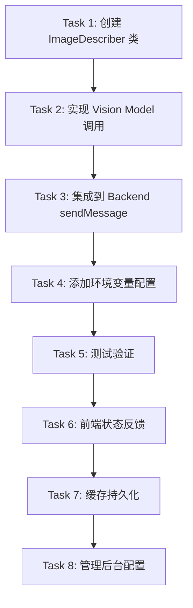

# 非多模态模型图片内容预描述方案

> 版本：v1.0  
> 创建日期：2026-06-03  
> 状态：方案设计（待实施）  
> 关联文档：[AI对话多模态图片上传方案.md](../已完成/02-核心问题根因分析/AI对话多模态图片上传方案.md)

---

## 一、问题背景

### 1.1 现状

当前系统已实现完整的多模态图片上传链路（见关联文档），但存在以下限制：

- 当用户选择**非多模态模型**（`supportsImages: false`）时，即使发送了图片，模型也无法"看到"图片内容
- 现有 [ModelSelectWithGuard](file:///Users/qh2/Documents/PGM/1·Work/opencode-workbench/packages/author-site/src/components/ai-elements/chat/model-select-with-guard.tsx) 仅在**切换模型**时拦截，无法处理**发送时**的图片兼容性检查
- 用户可能因偏好某些非多模态模型（如 DeepSeek、Claude 3 Sonnet 等）而放弃使用图片功能

### 1.2 目标

让非多模态模型也能"理解"用户发送的图片内容，同时保持用户模型选择的自由度。

---

## 二、技术方案

### 2.1 核心思路：图片内容预描述（Image Pre-Description）

在消息到达非多模态模型前，使用一个**轻量的多模态模型**先将图片转为文字描述，再将描述注入到用户消息中。

### 2.2 工作流程

```
用户发送：文本 + 图片附件
    ↓
检测当前模型的 supportsImages 标记
    ↓
├─ true（支持图片）
│   └→ 直接发送（现有多模态流程）
│
└─ false（不支持图片）
    └→ 触发预描述流程
        ↓
    调用预描述服务 ImageDescriber
        ↓
    对每张图片生成文字描述（并行或串行）
        ↓
    将描述注入原始消息：
    "【图片内容】{描述1}\n\n【用户问题】{原文本}"
        ↓
    发送给非多模态模型
```

### 2.3 架构设计

```
┌─────────────────────────────────────────────┐
│  前端（author-site）                         │
│  useChatStream.handleSend                    │
│  - 检测 supportsImages                       │
│  - 显示"正在分析图片..."状态                 │
└──────────────┬──────────────────────────────┘
               │ WebSocket: { text, images, needDescription: true }
               ↓
┌─────────────────────────────────────────────┐
│  agent-service                               │
│  ImageDescriber Service                      │
│  - 检查图片缓存（SHA-256 hash）              │
│  - 缓存命中 → 直接返回描述                   │
│  - 缓存未命中 → 调用 Vision Model            │
│  - 注入描述到消息                            │
└──────────────┬──────────────────────────────┘
               │ 纯文本消息（已含图片描述）
               ↓
┌─────────────────────────────────────────────┐
│  LLM Backend（非多模态模型）                 │
│  - 正常处理增强后的文本消息                  │
│  - 无需修改现有后端逻辑                      │
└─────────────────────────────────────────────┘
```

---

## 三、详细设计

### 3.1 拦截点选择

**推荐拦截点**：后端 `agent-service` 的 `sendMessage` 入口

**理由**：
1. 后端可统一管理预描述逻辑，避免前端重复实现
2. 可复用已注入的 `ImageAttachment[]` 数据
3. 便于实现描述缓存（跨会话共享）
4. 前端只需显示加载状态，无需复杂逻辑

**备选拦截点**：前端 `useChatStream.handleSend`
- 优点：可更早给用户反馈
- 缺点：缓存难以跨会话共享，前端逻辑复杂化

### 3.2 核心组件设计

#### 3.2.1 ImageDescriber Service

**文件位置**：`packages/agent-service/src/services/image-describer.ts`

```typescript
import { ImageAttachment } from "@opencode-workbench/shared";
import crypto from "crypto";

export interface ImageDescription {
  /** 图片原始数据哈希（用于缓存） */
  hash: string;
  /** 生成的文字描述 */
  description: string;
  /** 是否来自缓存 */
  fromCache: boolean;
}

export interface ImageDescriberConfig {
  /** 预描述使用的多模态模型 ID */
  visionModelId: string;
  /** 描述提示词模板 */
  describePrompt?: string;
  /** 缓存最大条目数 */
  maxCacheSize?: number;
  /** 单张图片描述超时（毫秒） */
  timeout?: number;
}

const DEFAULT_PROMPT = `请用简洁的中文描述这张图片的内容。
重点关注：
- UI 元素（按钮、表单、布局、颜色）
- 代码或文本内容（如可见）
- 图表或数据结构（如可见）
- 整体设计风格和意图

要求：
- 描述控制在 150 字以内
- 使用技术相关术语
- 避免主观猜测`;

export class ImageDescriber {
  private cache = new Map<string, string>(); // hash → description
  private config: Required<ImageDescriberConfig>;

  constructor(config: Partial<ImageDescriberConfig> = {}) {
    this.config = {
      visionModelId: config.visionModelId || "gpt-4o-mini",
      describePrompt: config.describePrompt || DEFAULT_PROMPT,
      maxCacheSize: config.maxCacheSize || 500,
      timeout: config.timeout || 10000, // 10 秒
    };
  }

  /**
   * 对图片数组生成描述
   * @param images 图片附件
   * @returns 所有图片的描述文本（用换行分隔）
   */
  async describe(images: ImageAttachment[]): Promise<string> {
    const descriptions: ImageDescription[] = [];

    // 并行处理所有图片
    const promises = images.map(async (img) => {
      const hash = this.computeHash(img.data);

      // 检查缓存
      if (this.cache.has(hash)) {
        return {
          hash,
          description: this.cache.get(hash)!,
          fromCache: true,
        };
      }

      // 调用多模态模型生成描述
      const description = await this.callVisionModel(img);

      // 更新缓存
      this.updateCache(hash, description);

      return { hash, description, fromCache: false };
    });

    const results = await Promise.all(promises);
    descriptions.push(...results);

    // 组装描述文本
    return this.formatDescriptions(descriptions);
  }

  /**
   * 计算图片数据的 SHA-256 哈希
   */
  private computeHash(base64Data: string): string {
    return crypto.createHash("sha256").update(base64Data).digest("hex");
  }

  /**
   * 调用多模态模型生成描述
   */
  private async callVisionModel(img: ImageAttachment): Promise<string> {
    // TODO: 实现实际的 API 调用
    // 可选方案：
    // 1. 直接调用 OpenCode Server 的多模态模型
    // 2. 调用 OpenAI / Anthropic API（需配置独立 API Key）
    // 3. 复用现有 Backend 架构，临时创建 Vision Backend 实例

    const timeout = this.config.timeout;
    const controller = new AbortController();
    const timeoutId = setTimeout(() => controller.abort(), timeout);

    try {
      // 伪代码：实际实现需根据现有 Backend 架构调整
      const response = await this.invokeVisionModel({
        model: this.config.visionModelId,
        messages: [
          {
            role: "user",
            content: [
              { type: "image", image: img.data, mimeType: img.mimeType },
              { type: "text", text: this.config.describePrompt },
            ],
          },
        ],
        maxTokens: 300,
      });

      clearTimeout(timeoutId);
      return response.content.trim();
    } catch (error) {
      clearTimeout(timeoutId);
      
      // 降级策略：返回图片元数据
      return `[图片：${img.name || "未命名"}，格式：${img.mimeType}]`;
    }
  }

  /**
   * 更新缓存（LRU 策略）
   */
  private updateCache(hash: string, description: string): void {
    // 如果缓存已满，删除最早的条目
    if (this.cache.size >= this.config.maxCacheSize) {
      const firstKey = this.cache.keys().next().value;
      if (firstKey) {
        this.cache.delete(firstKey);
      }
    }

    this.cache.set(hash, description);
  }

  /**
   * 格式化多张图片的描述
   */
  private formatDescriptions(descriptions: ImageDescription[]): string {
    if (descriptions.length === 0) return "";

    const parts = descriptions.map((desc, idx) => {
      const header = descriptions.length > 1 ? `图片 ${idx + 1}：` : "";
      const cacheTag = desc.fromCache ? "（缓存）" : "";
      return `${header}${desc.description}${cacheTag}`;
    });

    return parts.join("\n\n");
  }

  /**
   * 清理缓存
   */
  clearCache(): void {
    this.cache.clear();
  }

  /**
   * 获取缓存统计信息
   */
  getCacheStats(): { size: number; maxSize: number } {
    return {
      size: this.cache.size,
      maxSize: this.config.maxCacheSize,
    };
  }
}
```

#### 3.2.2 消息注入逻辑

**文件位置**：`packages/agent-service/src/backends/base.ts`（或具体 Backend 实现）

```typescript
// 在 BaseBackend.sendMessage 中增加预描述逻辑
async sendMessage(
  content: string,
  options?: SendMessageOptions
): Promise<string> {
  const { images, ...restOptions } = options || {};

  // 检测当前模型是否支持图片
  const modelInfo = await this.getModelInfo();
  const currentModel = modelInfo.availableModels.find(
    (m) => m.id === modelInfo.currentModelId
  );
  const supportsImages = currentModel?.supportsImages ?? false;

  let enhancedContent = content;

  // 如果有图片但模型不支持，触发预描述
  if (images && images.length > 0 && !supportsImages) {
    logger.info(
      { imageCount: images.length, modelId: modelInfo.currentModelId },
      "Triggering image pre-description for non-vision model"
    );

    const describer = this.getImageDescriber(); // 获取或创建实例
    const imageDescription = await describer.describe(images);

    // 注入描述到消息
    enhancedContent = `【图片内容】${imageDescription}\n\n【用户问题】${content}`;

    logger.info(
      { originalLength: content.length, enhancedLength: enhancedContent.length },
      "Image description injected into message"
    );
  }

  // 继续原有发送逻辑（使用 enhancedContent）
  return this.sendToLLM(enhancedContent, restOptions);
}
```

### 3.3 前端状态反馈

**文件位置**：`packages/author-site/src/components/ai-elements/chat/hooks/use-chat-stream.ts`

```typescript
// 在 handleSend 中增加预描述状态
const [isDescribingImages, setIsDescribingImages] = useState(false);

const handleSend = useCallback(
  async (userMessage: string, images?: ImageAttachment[]) => {
    // 检测是否需要预描述
    const currentModel = models.find((m) => m.id === currentModelId);
    const needsDescription =
      images && images.length > 0 && !currentModel?.supportsImages;

    if (needsDescription) {
      setIsDescribingImages(true);
      // 可选：显示 Toast 或内联提示
      // toast({ title: "正在分析图片内容...", description: "请稍候" });
    }

    try {
      // 发送消息（后端会自动处理预描述）
      streamService.sendMessage(userMessage, workingDir, images);

      // 添加用户消息到历史
      setMessages((prev) => [
        ...prev,
        {
          id: `user-${Date.now()}`,
          role: "user",
          content: userMessage.trim(),
          parts: [
            ...(needsDescription
              ? [{ type: "system" as const, content: "🔍 正在分析图片..." }]
              : []),
            ...(images?.map((img) => ({
              type: "image" as const,
              url: `data:${img.mimeType};base64,${img.data}`,
            })) || []),
          ],
        },
      ]);
    } finally {
      if (needsDescription) {
        setIsDescribingImages(false);
      }
    }
  },
  [currentModelId, models, streamService, workingDir]
);
```

---

## 四、配置方案

### 4.1 环境变量配置

在 `.env` 中新增：

```bash
# 图片预描述配置
IMAGE_DESCRIPTION_ENABLED=true
IMAGE_DESCRIPTION_MODEL=gpt-4o-mini
IMAGE_DESCRIPTION_TIMEOUT=10000
IMAGE_DESCRIPTION_MAX_CACHE=500
IMAGE_DESCRIPTION_PROMPT="请用简洁的中文描述这张图片的内容。重点关注 UI 元素、代码或文本内容、图表或数据结构。描述控制在 150 字以内。"
```

### 4.2 管理后台配置（远期）

可在模型配置页面增加"图片处理策略"选项：

```typescript
interface ImageHandlingPolicy {
  mode: "auto-describe" | "ask-user" | "block";
  visionModelId: string; // 预描述使用的模型
  customPrompt?: string; // 自定义描述提示词
}
```

---

## 五、多模态模型选择策略

### 5.1 推荐模型

| 模型 | 成本 | 延迟 | 描述质量 | 推荐度 |
|------|------|------|----------|--------|
| `gpt-4o-mini` | 低（$0.15/1M tokens） | 1-2 秒 | 高 | ⭐⭐⭐⭐⭐ |
| `claude-3-haiku` | 低（$0.25/1M tokens） | 1-2 秒 | 高 | ⭐⭐⭐⭐ |
| `gemini-1.5-flash` | 低（$0.075/1M tokens） | 1-3 秒 | 中 | ⭐⭐⭐ |

### 5.2 降级策略

```typescript
const VISION_MODEL_FALLBACK = [
  "gpt-4o-mini",
  "claude-3-haiku-20240307",
  "gemini-1.5-flash",
];

async function getAvailableVisionModel(): Promise<string> {
  for (const modelId of VISION_MODEL_FALLBACK) {
    if (await isModelAvailable(modelId)) {
      return modelId;
    }
  }
  throw new Error("无可用的多模态模型用于图片描述");
}
```

---

## 六、性能与成本分析

### 6.1 延迟评估

| 场景 | 延迟 | 说明 |
|------|------|------|
| 缓存命中 | < 10ms | 直接返回缓存描述 |
| 缓存未命中（1 张图） | 1-3 秒 | 调用一次多模态 API |
| 缓存未命中（5 张图） | 2-5 秒 | 并行调用，取最慢者 |

### 6.2 成本估算

假设使用 `gpt-4o-mini`：
- 输入：图片 ~500 tokens + 提示词 ~100 tokens = 600 tokens
- 输出：描述 ~150 tokens
- 单次成本：750 tokens × $0.15/1M = **$0.0001（约 ¥0.0007）**

**日均 100 次图片描述**：约 ¥0.07/天，¥2/月

### 6.3 缓存命中率优化

预期缓存命中率：
- 同一用户重复发送相同截图：30-50%
- 设计稿参考图（可能重复使用）：60-80%
- 随机网络图片：< 5%

**优化策略**：
1. 使用 SHA-256 哈希作为缓存键
2. LRU 淘汰策略（默认 500 条）
3. 可选：持久化缓存到 Redis 或 SQLite

---

## 七、实施计划

### 7.1 阶段划分

| 阶段 | 任务 | 优先级 | 预估工时 |
|------|------|--------|----------|
| **P0** | 实现 `ImageDescriber` 核心服务 | P0 | 2 天 |
| **P0** | 集成到 `BaseBackend.sendMessage` | P0 | 1 天 |
| **P0** | 环境变量配置 + 日志 | P0 | 0.5 天 |
| **P1** | 前端加载状态反馈 | P1 | 1 天 |
| **P1** | 描述缓存持久化（SQLite） | P1 | 1 天 |
| **P2** | 管理后台配置界面 | P2 | 2 天 |
| **P2** | 缓存监控与统计 API | P2 | 1 天 |

### 7.2 实施顺序



---

## 八、测试要点

### 8.1 功能测试

| 测试场景 | 预期行为 |
|----------|----------|
| 发送 1 张图片 + 文本（非多模态模型） | 消息包含图片描述，AI 能理解图片内容 |
| 发送 5 张图片（非多模态模型） | 所有图片都被描述，消息格式正确 |
| 发送相同图片 2 次 | 第 2 次使用缓存，延迟显著降低 |
| 切换到多模态模型发送图片 | 直接发送，不触发预描述 |
| Vision Model 调用超时 | 降级为图片元数据描述 |
| 无可用 Vision Model | 发送失败，提示用户 |

### 8.2 性能测试

| 测试项 | 指标 |
|--------|------|
| 单张图片描述延迟 | < 3 秒（P95） |
| 5 张图片并行描述延迟 | < 5 秒（P95） |
| 缓存命中率 | > 30%（预期） |
| 内存占用（500 条缓存） | < 50MB |

### 8.3 集成测试

```bash
# 1. 启动服务
pnpm dev

# 2. 选择非多模态模型（如 deepseek-v4-flash）

# 3. 发送带图片的消息
# 验证：
# - agent-service 日志显示 "Triggering image pre-description"
# - 消息注入格式正确
# - AI 回复提及图片内容

# 4. 再次发送相同图片
# 验证：
# - 日志显示 "（缓存）"
# - 延迟显著降低
```

---

## 九、风险与缓解

### 9.1 技术风险

| 风险 | 影响 | 缓解措施 |
|------|------|----------|
| Vision Model 不可用 | 预描述失败 | 降级为图片元数据，发送失败提示 |
| 描述质量差 | AI 理解偏差 | 优化提示词，支持自定义 prompt |
| 缓存占用内存过多 | 服务内存溢出 | LRU 淘汰，限制 maxCacheSize |
| 大图片导致超时 | 用户体验差 | 前端压缩，超时降级 |

### 9.2 业务风险

| 风险 | 影响 | 缓解措施 |
|------|------|----------|
| 额外 API 成本 | 费用增加 | 使用低成本模型，缓存优化 |
| 描述延迟 | 用户等待 | 显示加载状态，并行处理 |
| 隐私问题 | 图片泄露风险 | 描述后丢弃原始图片，不持久化 |

---

## 十、未来扩展

### 10.1 用户自定义描述提示词

允许用户根据场景定制描述重点：

```typescript
interface UserPromptTemplate {
  id: string;
  name: string;
  prompt: string;
}

const TEMPLATES = [
  {
    id: "ui-design",
    name: "UI 设计稿",
    prompt: "描述 UI 布局、颜色、组件层次...",
  },
  {
    id: "code-screenshot",
    name: "代码截图",
    prompt: "提取代码内容、编程语言、函数名...",
  },
  {
    id: "chart-data",
    name: "图表数据",
    prompt: "描述图表类型、数据趋势、关键数值...",
  },
];
```

### 10.2 多策略选择

提供多种图片处理策略：

```typescript
enum ImageHandlingStrategy {
  AUTO_DESCRIBE = "auto-describe",     // 自动描述（本方案）
  ASK_USER = "ask-user",               // 询问用户
  BLOCK = "block",                     // 阻止发送
  EXTRACT_TEXT = "extract-text",       // 仅提取文字（OCR）
  SKIP = "skip",                       // 忽略图片
}
```

### 10.3 描述质量反馈

允许用户对描述质量评分，优化提示词：

```typescript
interface DescriptionFeedback {
  descriptionId: string;
  rating: 1 | 2 | 3 | 4 | 5;
  feedback?: string;
}
```

---

## 十一、相关文件

### 11.1 需修改的文件

| 文件 | 改动类型 | 说明 |
|------|----------|------|
| `packages/agent-service/src/services/image-describer.ts` | 新增 | 核心预描述服务 |
| `packages/agent-service/src/backends/base.ts` | 修改 | 集成预描述逻辑 |
| `packages/agent-service/src/core/types.ts` | 修改 | 新增配置类型 |
| `packages/author-site/src/components/ai-elements/chat/hooks/use-chat-stream.ts` | 修改 | 前端状态反馈 |
| `.env` | 修改 | 新增环境变量 |

### 11.2 参考文件

- [AI对话多模态图片上传方案.md](../已完成/02-核心问题根因分析/AI对话多模态图片上传方案.md) — 图片上传全链路
- [ModelSelectWithGuard](file:///Users/qh2/Documents/PGM/1·Work/opencode-workbench/packages/author-site/src/components/ai-elements/chat/model-select-with-guard.tsx) — 现有模型守卫
- `packages/agent-service/src/backends/opencode-http.ts` — Backend 实现参考
- `packages/shared/src/index.ts` — 共享类型定义

---

## 十二、决策记录

### 12.1 为什么选择后端拦截而非前端？

| 对比维度 | 后端拦截 | 前端拦截 |
|----------|----------|----------|
| 缓存共享 | ✅ 跨会话共享 | ❌ 仅限当前会话 |
| 代码复用 | ✅ 所有 Backend 复用 | ❌ 每个前端组件需实现 |
| 逻辑集中 | ✅ 统一管理 | ❌ 分散多处 |
| 用户反馈 | ⚠️ 需额外通信 | ✅ 即时反馈 |

**结论**：后端拦截更优，前端仅负责加载状态显示。

### 12.2 为什么使用 SHA-256 而非完整 Base64 作为缓存键？

- Base64 字符串过长（单张图片可能 1-5MB）
- Map 键比较性能差
- SHA-256 固定 64 字符，碰撞概率极低（2^256）

### 12.3 为什么选择 LRU 缓存而非其他策略？

- **LRU**（最近最少使用）：适合图片缓存场景（近期图片更可能重复）
- **LFU**（最不经常使用）：需要额外计数器，复杂度高
- **FIFO**（先进先出）：可能淘汰常用图片

---

## 十三、调试指南

### 13.1 验证预描述是否触发

在 `packages/agent-service/src/backends/base.ts` 添加日志：

```typescript
logger.info(
  {
    modelId: currentModelId,
    supportsImages,
    imageCount: images?.length,
    willDescribe: images?.length > 0 && !supportsImages,
  },
  "Image pre-description decision"
);
```

### 13.2 检查描述质量

```typescript
// 在 ImageDescriber.callVisionModel 后添加
logger.info(
  {
    imageHash: hash,
    descriptionLength: description.length,
    description: description.substring(0, 200), // 截断日志
    fromCache: false,
  },
  "Image description generated"
);
```

### 13.3 缓存命中率监控

```typescript
// 定期输出统计
setInterval(() => {
  const stats = describer.getCacheStats();
  logger.info(stats, "Image description cache stats");
}, 60000); // 每分钟
```

---

## 十四、总结

本方案通过**图片内容预描述**技术，让非多模态模型也能理解图片内容，核心优势：

1. ✅ **用户无感知**：自动触发，保持模型选择自由
2. ✅ **低成本**：单次描述约 ¥0.0007，日均 100 次仅 ¥2/月
3. ✅ **高性能**：缓存命中率预期 30-80%，延迟 < 10ms
4. ✅ **易实施**：2-3 天完成核心功能，向后兼容
5. ✅ **可扩展**：支持自定义提示词、多策略选择、质量反馈

**下一步**：评审方案 → 确认技术细节 → 开始实施（P0 阶段 3.5 天）
